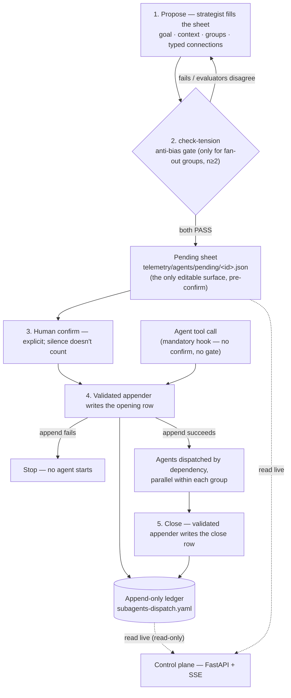

# cyberalchemy-orchestrator *(provisional name)*

> **Private remote, unreviewed.** Created 2026-07-18; first working session 2026-07-20. No `LICENSE`
> and no `CONTRIBUTING` — treat it as one person's working repo, not a project accepting patches.
> The read side runs and is tested; the confirm-gated write path is built but **not cut over**.
> `Claim ≤ proof`: any claim here holds only as far as the file it links proves it — read every
> strong claim as *candidate*, not result.

This README is a map, not a manifesto. It tells a first-time reader **what this repo is, why it
exists, what actually runs today, how to bring it up, and where to go next**.

## What is this?

**cyberalchemy-orchestrator** is a substrate for **organizing, dispatching, and observing fleets of
LLM subagents**. In practice: you have Claude Code split a job across several AI agents, every
hand-off is logged to an append-only ledger, and a small local dashboard lets you watch it live.

**Why it exists.** Agents on one base model may agree too readily and share blind spots, so N of
them "could be closer to one look repeated than to N independent looks" — one of three hypothesized
failure modes (correlated bias, noise, framing) in
[`PLAN.md`](plans/governed-agent-work-infrastructure/PLAN.md#1-the-business-problem). That is why
agents are paired on deliberately opposed angles and why the pairing is gated before they run: the
opposition is the point, not decoration. The repo is trying to *test* that hypothesis, not assuming
it.

The orchestration happens **inside a Claude Code session** through skills — there is no daemon you
run to orchestrate. The substrate is also meant to drop into any repo with near-zero integration:
the control plane observes read-only off the filesystem, with no instrumentation on the target.

*(There is a research thesis underneath — that good orchestration is a decision-hygiene problem with
category-theoretic types. That is deliberately **not** the entry point; see
[Going deeper](#going-deeper--the-thesis-optional).)*

## What runs today vs. what is still thesis

**Runs today — code, with tests, you can run it now:**

- The **control plane** (Phase 1, the reader): FastAPI + SSE in [`implementations/`](implementations/),
  ten UI variants over one API contract, with parser/endpoint/Playwright tests
  ([`implementations/tests/`](implementations/tests/)). One endpoint is *not* read-only:
  `POST /api/confirm` ships and writes a `.confirmed` marker into a discovered repo's
  `telemetry/agents/pending/` directory. It never writes the ledger.
- The **ledger**: [`telemetry/agents/subagents-dispatch.yaml`](telemetry/agents/subagents-dispatch.yaml)
  — append-only, holding this repo's own dispatches (including the ones that built the control
  plane), with the `register-dispatch` appender as its only sanctioned write path.
- The **agent-pool MCP**: [`tools/agent-pool-mcp/`](tools/agent-pool-mcp/) — selects `agent_name`
  from [`telemetry/agents/agent-pool.yaml`](telemetry/agents/agent-pool.yaml) (414 tagged entries);
  `npm run smoke` needs no API key.
- The **operational skills** in [`.claude/skills/`](.claude/skills/) — `register-dispatch`,
  `check-tension`, `robot-talks`, `domainspec-subagents-strategy` — invokable in Claude Code today.
- The **mandatory Agent hooks**: [`.claude/settings.json`](.claude/settings.json) wraps every
  `Agent` tool call, opening a dispatch through the validated appender and **denying launch** if the
  YAML or ACI opening receipt fails. See [How a dispatch flows](#how-a-dispatch-flows) — this is a
  second write path, and it does not pass the confirm gate.
- The **ACI/APT local pilot** — a SQLite journal with Session→Dispatch links, structured Research
  records, replayable projections, scoped capabilities and a fail-closed `127.0.0.1:8766`
  composition. **Opt-in and off by default** (`ACI_LOCAL_PILOT_ENABLED=1`). Stages
  [E](docs/features/agent-provenance-telemetry/integration/stage-e/local-orchestration-logging-bridge.md),
  [F](docs/features/agent-provenance-telemetry/integration/stage-f/mandatory-host-wrapper.md), and
  [G](docs/features/agent-provenance-telemetry/integration/stage-g/reference-scout-and-ingestion.md).

**Still thesis / candidate — not proof:**

- The **write-side cutover**: the UI confirm button, the TASK-020 materializer, sole-writer
  deployment proof, generic provider launch, and production cutover remain disabled. YAML is still
  the compatibility audit ledger and only the validated appender may write it. What exactly gates
  the cutover is itself contested — see [Open questions](#open-questions).
- The **agent-work language**: a proposed language for governed agent work, with a mathematical
  formalization appendix — [`docs/architecture/agent-language-system-view.md`](docs/architecture/agent-language-system-view.md)
  (`authority: proposal-only`), its [research subplan](plans/governed-agent-work-infrastructure/subplans/agent-work-language-research/PLAN.md),
  and [`research/agent-language-mathematical-formalization/`](research/agent-language-mathematical-formalization/).
- The **decision-science loop** (anti-bias runs; anti-noise mostly on paper) —
  [`vault/hypothesis/anti-noise-orchestration.md`](vault/hypothesis/anti-noise-orchestration.md).
- The **category-theory typing** of the orchestration language — one open obligation decides it:
  [`OBLIGATIONS.md`](OBLIGATIONS.md) (OBL-E3). **Nothing in this repo is typed in Lean**; the anchors
  point to the sibling repo, indexed in [`lean-formalization/`](lean-formalization/README.md).

## Quick start

Verified on Python 3.12 and Node 22. Steps 2 and 3 assume you ran step 1 first.

**1 — Control plane (the reader).**

```sh
cd implementations
pip install -r requirements.txt      # there is no requirements.txt at the repo root
python -m server.main
# http://127.0.0.1:8765 — the root serves the hub over ten UI variants
```

On startup it prints `observing N repos:` — that line is how you know it worked. Without a
`config.json` it **auto-discovers**, scanning the *parent* directory for any sibling folder holding
either a `telemetry/agents/subagents-dispatch.yaml` file or a `telemetry/agents/pending/` directory.
Know that blast radius before you run it.

To override the discovered list, copy `implementations/config.example.json` to `config.json`. Copied
as-is it keeps auto-discovery; its `scan_roots`/`repos` examples are deliberately inert, because
absolute paths from another machine resolve to **zero** repos silently.

**2 — Tests.** `test_ui.py` drives the variants through Playwright, which is a test-only extra:

```sh
pip install -r implementations/requirements-dev.txt && playwright install chromium
python implementations/tests/test_ledger.py       # parser + smoke over the real ledgers
python implementations/tests/test_ui.py           # Playwright across the ten variants
```

**3 — agent-pool MCP (`agent_name` selection).**

```sh
cd tools/agent-pool-mcp
npm install
npm run smoke     # deterministic, no API key
```

To register cross-repo, see [`tools/agent-pool-mcp/README.md`](tools/agent-pool-mcp/README.md).
Without `ANTHROPIC_API_KEY`, recommendation degrades to the deterministic pre-filter; search and
vocab checks never need a key.

## How a dispatch flows

**Two paths write the ledger.** The confirm-gated path below is the designed one. The mandatory
`PreToolUse(Agent)` hook is the other: it opens a dispatch automatically on *every* `Agent` tool
call, through the same validated appender and the same ledger file, with **no separate human confirm
and no anti-bias gate** — it either authorizes the launch or denies it. Any row you see may have
come from either path.

In both paths the opening row is appended **before** any agent starts; if the append fails, nothing
runs. Closing appends a second row — the opening is never mutated.



The appender is strict (it refuses any row outside schema `v0.6.1`) while the control plane's reader
is lenient (it still shows older rows the appender would now reject). A hook blocks reading the
ledger via direct Bash; structured reads go through `server/ledger.py`. Field-by-field anatomy of a
row lives in [`register-dispatch`](.claude/skills/register-dispatch/SKILL.md); the API contract in
[`implementations/UI-CONTRACT.md`](implementations/UI-CONTRACT.md).

## Navigation

**Orientation & method**

| Path | What |
|---|---|
| [`plans/governed-agent-work-infrastructure/PLAN.md`](plans/governed-agent-work-infrastructure/PLAN.md) | The root infrastructure Plan: business problem → hypothesis → research and implementation children. Start here for the "why." |
| [`OBLIGATIONS.md`](OBLIGATIONS.md) | The single falsifiable target, OBL-E3 — does the orchestration language form a category? |
| [`FRAMINGS.md`](FRAMINGS.md) | The category-theory ledger (F1–F7 framings + construct⟷CT-type mapping). |
| [`BACKLOG.md`](BACKLOG.md) | Named-but-unplanned candidates and the portability hypotheses. |
| [`definitions/DEFINITIONS.md`](definitions/DEFINITIONS.md) | Normative definition map — system primitives and category-theory parallels, with one canonical home per term. |

**What runs**

| Path | What |
|---|---|
| [`implementations/`](implementations/) | The runnable control plane (Phase 1), its ten UI variants, and [`UI-CONTRACT.md`](implementations/UI-CONTRACT.md). |
| [`tools/agent-pool-mcp/`](tools/agent-pool-mcp/) | Cross-repo MCP that selects `agent_name` from the canonical pool. |
| [`telemetry/agents/`](telemetry/agents/) | THE ledger (append-only, via `register-dispatch` only), the 414-entry agent pool, and `pending/` — the only editable surface pre-confirm. |
| [`.claude/`](.claude/skills/) | 67 skills invokable in Claude Code, plus the mandatory Agent hooks in `settings.json`. |

**Knowledge & investigations**

| Path | What |
|---|---|
| [`vault/`](vault/) | Governed knowledge store: [`axioms`](vault/axioms/axioms.md) (AX-1..5), candidate [`constitution/`](vault/constitution/) (unratified), [`hypothesis/`](vault/hypothesis/), and [`audit/`](vault/audit/). |
| [`docs/`](docs/) | Feature specs, essays, discovery, signals, and [`architecture/`](docs/architecture/) — the agent-work language system view. |
| [`research/`](research/) | Investigations, never auto-promoted. |
| [`plans/`](plans/) | Durable plans and the canonical [Plan contract](plans/README.md#canonical-definition). |
| [`sessions/`](sessions/) | 43 dated working-session records (close-session outputs). |
| [`experiments/`](experiments/) | Two entries, and they are not the same kind of thing. [`skill-relationship-graph/`](experiments/skill-relationship-graph/) is a governed experiment — frozen `criterion.md`, then `experiment.md` + `findings.md` — and its `graph.json` is read at runtime by the control plane, so it is a live dependency, not an archive. [`foodstogo-jbp-2025/`](experiments/foodstogo-jbp-2025/) is a client business case with no criterion and no falsifiable claim; it sits here for want of a better home, and the directory name overstates it. Feature-scoped probes live with their feature instead — see [`docs/features/agents-communication-infra/experiments/`](docs/features/agents-communication-infra/experiments/). Which of the two homes a new probe belongs in is not yet a written rule. |
| [`internal-tools/`](internal-tools/), [`tools/`](tools/) | Auxiliary experiments; validators, spec constitution, test-derivation engine. |

## Where to start

1. **[`implementations/README.md`](implementations/README.md)** — the piece that already runs: what
   the control plane is, why it exists, and the two decisions the real data forced.
2. **[`plans/governed-agent-work-infrastructure/PLAN.md`](plans/governed-agent-work-infrastructure/PLAN.md)**
   — the problem, the hypothesis, the fronts, what runs vs. what is still being gathered.
3. **[`OBLIGATIONS.md`](OBLIGATIONS.md)** — only for the depth: the one falsifiable test that decides
   whether the orchestration language is mathematics or metaphor.

## Open questions

- **What actually gates the write-side cutover.**
  [`vault/audit/ledger-enum-drift-finding.md`](vault/audit/ledger-enum-drift-finding.md) calls itself
  the keystone next step for Phase 2, but
  [`sessions/2026-07-22-1315-phase2-confirm-handoff.md`](sessions/2026-07-22-1315-phase2-confirm-handoff.md)
  re-scoped it — the drift blocks a veracity label, not an operation — and Phase 2's confirm slice
  shipped without tracing it. Either this README's framing or that audit file is stale. Unresolved.

## Going deeper — the thesis *(optional)*

Everything above is enough to use the repo. Underneath sits a research bet, in three fronts. The
first two each have a **funnel essay** that opens at the everyday problem and ramps to full density:

- **Decision-making (the why).** Orchestration as *decision hygiene* — countering correlated bias,
  noise, and framing, à la Kahneman and Thaler. →
  [`docs/essays/decision-hygiene-hypothesis/`](docs/essays/decision-hygiene-hypothesis/README.md),
  then [`vault/hypothesis/anti-noise-orchestration.md`](vault/hypothesis/anti-noise-orchestration.md).
- **Category theory (the formal ground).** Give the orchestration constructs categorical types
  (probe→Yoneda, synthesis→pushout/residue, connections→composition/2-cells) — decided by OBL-E3. →
  [`docs/essays/categorical-theory-hypothesis/`](docs/essays/categorical-theory-hypothesis/README.md),
  then [`FRAMINGS.md`](FRAMINGS.md).
- **System architecture (the how).** An event/bus/journal runtime that would make those principles
  enforceable end-to-end. The local pilot is implemented and opt-in; production remains a proposal.
  → [`docs/features/`](docs/features/).
