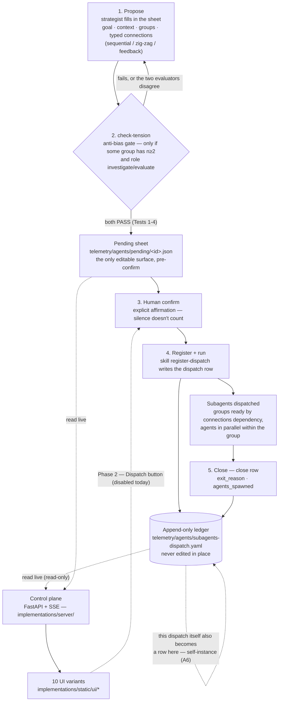
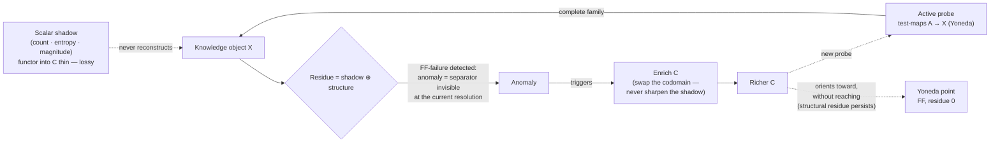

# cyberalchemy-orchestrator *(provisional name)*

> **Status:** seed / brainstorm, **unreviewed**, local (no remote, no push).
> `Claim ≤ proof`: every statement below holds only as far as the linked file proves it — read
> "is a category" as "candidate to be typed," not as a result. **Nothing in this repo is
> typed in Lean**; the Lean anchors point to the sibling repo `domainspec-lean-formalization`.
> The dispatch discipline (check-tension → confirm → ledger → close) runs for real; the
> control plane that **reads** the ledger (Phase 1) is built and tested; the button that
> **writes** (Phase 2) exists in the UI but is `disabled` by design. Created 2026-07-18,
> first real working session 2026-07-20.

This README orients whoever opens the repo for the first time: **what this is, what already runs
today vs. what is still thesis, how to bring up the concrete piece, and which three documents to
read first.**

## What is this?

**cyberalchemy-orchestrator** is an agent-orchestration project that treats coordinating
LLM agents as a problem in the science of decision-making — the study of **bias, noise, and
nudges** — rather than a plumbing problem. When you fan work out to several agents, what comes
back is only as good as the judgment behind it. The project's founding **hypothesis** is that
multi-agent judgment fails the way human judgment does: agents on the same base model agree
too readily (correlated bias), their answers scatter for reasons unrelated to the task
(noise), and how a task is framed quietly steers the outcome. This is a claim to be tested,
not a settled fact — but a productive one, because each failure it names already has a known
countermeasure in decision science, which turns "orchestrate agents well" into concrete,
falsifiable moves. If it holds, the orchestrator's job is to organize the agents to counter
those failures — pairing them on deliberately opposed angles, keeping them blind to one
another, aggregating independent judgments, auditing the result — instead of spawning agents
and gluing together whatever they return. Whether those countermeasures actually cancel the
failures, rather than just relabel them, is itself a hypothesis under test: agents sharing a
base model produce correlated errors, which caps how much independence can buy.

Those three levers are borrowed from the science of judgment: **Kahneman** on bias and noise,
**Thaler** on nudges and choice architecture. Under the hood, we are trying to ground the
tooling in **category theory** and **information theory** — a candidate framing, not a proven
one — to pin down what a dispatch is, what a synthesis loses, and when a label adds information
rather than noise. The main loop is meant to run on **epistemology and the scientific
process**: state a falsifiable claim, probe it, keep what survives, enrich the model from what
breaks. That loop isn't built yet — it is the next thing to add — but the discipline it implies
(`claim ≤ proof` — certainty no larger than the evidence; every construct falsifiable with a
collapse-test) already runs through the repo.

What exists **today** is the orchestration substrate: a **dispatch discipline** (agent
groups, typed connections, an anti-bias gate, an append-only ledger) and a **control plane** —
a FastAPI + SSE server with ten UI variants that read, live, what is pending human
confirmation and what has already been dispatched. It runs, has tests, and comes up locally in
minutes (see [Quick Start](#quick-start--how-to-run)). The decision-science loop and the
categorical typing of the tools are the **thesis layer** — mostly still on paper
([`FRAMINGS.md`](FRAMINGS.md), [`MAPPING.md`](MAPPING.md), [`OBLIGATIONS.md`](OBLIGATIONS.md)),
not proven. One self-referential twist links the two: building this repo is itself done
through dispatches recorded in the **same ledger** the orchestrator operates —
*"framework as its own instance"* (BACKLOG A6; see [`PLAN.md §1`](PLAN.md#1-problem)).

> **Design goal (new, 2026-07-20):** the concrete layer must be **generic — droppable
> into any repo with near-zero integration**, independent of that repo's domain. The
> categorical thesis is the *particular* content of this repository; the orchestration substrate
> (dispatch schema, skills, ledger, control plane, agent pool) shouldn't depend
> on it. What properties this requires, and what is already evidence of it today, is in
> [Goal: droppable into any repo](#goal-droppable-into-any-repo-generic-by-design) —
> raised there as falsifiable hypotheses, not as settled fact.

## How the pieces fit together



The ledger is only written **after** human confirm — that's the gate. A UI that only read the
ledger would always arrive late, because it could never *be* the gate; that's why Phase 1 also
reads the pending sheet (`telemetry/agents/pending/`), the only pre-confirm, editable artifact.
The two sides have opposite postures by design: the `register-dispatch` skill's **appender** is
**strict** (refuses to write a record outside schema v0.6.0, and refuses to append to a
**structurally** corrupted ledger — malformed line shapes, invalid JSON, duplicate ids; it does
**not**, however, re-validate enum values on rows already on disk, which are grandfathered — so it
protects the file's *structure*, not the historical correctness of every prior row), while the
control plane's **reader** is **lenient** (it even
shows old prettified rows that the appender would reject — see
[the two decisions](#two-decisions-the-real-data-forced)). A hook blocks reading the ledger via
direct Bash; structural reading always goes through `server/ledger.py`.

That strictness is a property of the write **path**, not a guarantee about every row already on
disk. An audit ([`vault/audit/ledger-enum-drift-finding.md`](vault/audit/ledger-enum-drift-finding.md))
found two 2026-07-18 rows carrying an out-of-enum `exit_reason: "success"` that could only have
**bypassed** the validated appender. It's a live counterexample — it currently holds the engine
constitution's single-writer rule (`EG-1`) at `veracity: medium` and blocks its promotion, and
it's the keystone to resolve before Phase 2 lets a button write.

## What already runs today vs. what is thesis

This is the point where it's worth being more honest than excited.

**Runs today (code, with tests, you can run it now):**

- The **read control plane** (Phase 1): FastAPI + SSE server in
  [`implementations/`](implementations/), with ten UI variants over the same API,
  a lenient ledger parser, parser tests (`tests/test_ledger.py`), endpoint tests
  (`tests/test_main.py`), and Playwright tests against the ten variants (`tests/test_ui.py`).
- The **real ledger**: [`telemetry/agents/subagents-dispatch.yaml`](telemetry/agents/subagents-dispatch.yaml)
  holds **this repo's own ~30 dispatches** (≈49 rows counting their close rows), written by the
  `register-dispatch` skill — including, literally, the dispatches that built and reviewed the
  control plane itself. That file is only this repo's slice; across **all the sibling repos the
  control plane auto-discovers**, the aggregate is on the order of ~700 dispatches under a single
  `schema_version` (this is the cross-repo total, not the content of any one file).
- The **agent-pool-mcp**: a runnable MCP server at [`tools/agent-pool-mcp/`](tools/agent-pool-mcp/)
  (`npm run smoke` doesn't need an API key), which selects `agent_name` from the
  canonical pool in [`telemetry/agents/agent-pool.yaml`](telemetry/agents/agent-pool.yaml)
  (419 tagged entries).
- The **operational skills** in [`.claude/skills/`](.claude/skills/) —
  `register-dispatch`, `check-tension`, `robot-talks`, `domainspec-subagents-strategy` —
  executable via Claude Code today, not a future roadmap.

**Is thesis / candidate, not proof:**

- **[OBLIGATIONS.md](OBLIGATIONS.md)** — the question "is the orchestration language really a
  category?" (OBL-E3) is **OPEN**. Without it discharged, every parallel in
  `MAPPING.md` is a typed candidate, not a result.
- **[MAPPING.md](MAPPING.md)** and **[FRAMINGS.md](FRAMINGS.md)** — the parallels between
  orchestrator constructs (probe, verb, residue, zig-zag) and category theory are
  anchored hypotheses (often in `domainspec-lean-formalization`), not theorems
  of this repo.
- **[`vault/hypothesis/anti-noise-orchestration.md`](vault/hypothesis/anti-noise-orchestration.md)**
  (`HYP-ORCH-NOISE`) — the thesis that the orchestrator is a "noise-reduction machine" —
  status `candidate` / `exploratory` explicit in the frontmatter, with sections marked `PENDING`.
- **Generic portability** (the goal below) — today it's partial evidence + hypothesis, not an
  empirical guarantee; see the collapse-tests for each `H-PORT-*`.
- **Phase 2 of the control plane** (the "Dispatch" button that writes the confirm) is not
  implemented; every button in the ten UIs is `disabled` on purpose.
- **Nothing in this repo is typed in Lean** — the cited Lean anchors point to the sibling repo
  `domainspec-lean-formalization`; here they are reference, not local proof.

## Quick Start / How to Run

### 1. Control plane (the reader)

```sh
cd implementations
pip install -r requirements.txt
python -m server.main
# http://127.0.0.1:8765  — the root serves the selection hub for the ten UI variants
```

`requirements.txt` lives inside `implementations/`, not in the root — enter the folder **before**
installing. It's **read-only**: no command here writes to the ledger. Without `config.json`,
the server **auto-discovers** — it scans the parent directory for any sibling folder with
`telemetry/agents/`; to pin the list, copy `implementations/config.example.json` to
`implementations/config.json`.

### 2. Tests

```sh
python implementations/tests/test_ledger.py       # parser + smoke against the real ledgers
python implementations/tests/test_ui.py           # Playwright across the ten variants
python implementations/tests/test_ui.py terminal  # just one variant
```

Screenshots land in `implementations/tests/screenshots/`.

### 3. agent-pool MCP (`agent_name` selection)

```sh
cd tools/agent-pool-mcp
npm install
npm run smoke          # deterministic paths, no API key
```

Cross-repo registration, user scope — in `~/.claude.json` (or a repo's `.mcp.json`):

```json
{
  "mcpServers": {
    "agent-pool": {
      "command": "node",
      "args": ["C:\\Users\\victo\\cyberalchemy-orchestrator\\tools\\agent-pool-mcp\\src\\server.mjs"],
      "env": { "ANTHROPIC_API_KEY": "sk-ant-..." }
    }
  }
}
```

Without `ANTHROPIC_API_KEY`, `recommend_agents` degrades to the deterministic pre-filter (mode
`deterministic-fallback`); `search_pool` and `check_vocab` never need a key.

## Control plane API

| Endpoint | What |
|---|---|
| `GET /api/snapshot` | Entire state, recent window per repo (up to `limit`=40 per repo). |
| `GET /api/stream` | SSE — emits `event: snapshot` whenever the disk changes; connect with `EventSource`. |
| `GET /api/dispatch/{repo}/{dispatch_id}` | A single dispatch without truncating prompts (detail panel). 404/500 as appropriate. |
| `GET /api/overview` | Aggregates across ALL repos + human-attention queues (pending, opened today, all open — cap 200). Nothing truncated by `limit`. |
| `GET /api/repo/{name}` | Drill-down of a single repo: full `slim` history + `summary` + `series` (daily histogram). Filters `?state=open\|closed\|all` and `?type=<dispatch_type>` filter only the list, never the `summary`/`series`. |

Full contract (exact shapes, required `data-testid`s, `_` prefix convention for
calculated fields, UTC day reference): [`implementations/UI-CONTRACT.md`](implementations/UI-CONTRACT.md).

#### Two decisions the real data forced

1. **The reader is lenient; the appender is strict.** Old prettified rows (multi-line
   JSON, trailing commas) that the appender would reject still need to show up — in strict
   mode the reader returned 0 dispatches for the `domainspec` repo; lenient, it returns 55.
2. **The `_` prefix is scoped to objects with ROW SHAPE.** `status` is a real key on pre-v0.5.2
   rows; a calculated field with that name, in an object that shares a row's namespace,
   would overwrite historical data. Aggregates that aren't rows (`summary`, `series`,
   `totals`) have no such namespace to protect and use unprefixed keys.

## Anatomy of a dispatch row / close row

Each dispatch contributes **exactly two appends** to the same ledger (Principle 3 of the
subagents-strategy constitution): the **dispatch row** at dispatch time and the **close row** at
close. `groups`/`connections` (dispatch) and `agents_spawned`/`feedback_prompts` (close)
are JSON columns inside the YAML row. The fields that carry the weight — the full shape (and the
enums) — live in the [`register-dispatch`](.claude/skills/register-dispatch/SKILL.md) skill:

| Field (dispatch row) | What |
|---|---|
| `dispatch_id` | `YYYY-MM-DD-<slug>` — dedup key. |
| `schema_version` | exactly `"0.6.0"`. |
| `dispatch_type` | `research \| review \| experiment` (LIVE); `code \| plan \| suggestion` reserved. |
| `goal` / `context` | objective (1-2 sentences) / framing (2-4 sentences) — the only channel the subagents receive. |
| `groups` | JSON array: each group has `group_id`, `agents[]`, `n`, `robot_talks`, `anti_bias` (required if `n≥2`). |
| `connections` | array of edges `{from, to, type, loop_cap?}` — `type` ∈ `sequential \| zig-zag \| feedback`; `loop_cap` only on loops. |
| `final_approver` | `"parent"` or the `agent_name` of a dedicated approver (never a member of the working group). |
| `anti_bias_global` | tension axis for the entire dispatch (required with ≥2 groups in fan-out). |

Each `agents[]` entry carries `role` (`explorer \| synthesizer \| skeptic \| writer \| auditor \| planner \| coder`), `model`,
`token_budget`, `initial_prompt`, `agent_name` (from the pool or `null`), and `angle` (required if
`n≥2`). The **close row** closes with `close_of` (the `dispatch_id`), `exit_reason`
(`resolved \| loop_ceiling_reached \| dissent_irreconcilable \| user_abort \| error`),
`agents_spawned` (`{total, tree, loops_used}`), and `feedback_prompts` (each request from a
`feedback` edge, verbatim). Timestamps (`created`, `closed`) are stamped by the appender — sending
them is rejected.

## Phases

| Phase | What | State |
|---|---|---|
| **Phase 1 — the reader** | Read-only FastAPI + SSE over the ledger and the pending sheets; ten UI variants over a single testid contract. | **Done** — tested (`test_ledger.py`, `test_ui.py`). |
| **Phase 2 — the button** | `POST /confirm` writes the confirm; Claude, waiting via `Monitor`, follows the normal chain (`check-tension` → `register-dispatch` → agents → close row). The one who dispatches remains Claude in the session — preserving context and the skill chain. | Planned — the "Dispatch" button already exists in every UI, `disabled`. |
| **Phase 3 — editing** | Edit the pending sheet before confirm (today, read-only). | Planned. |

## Goal: droppable into any repo *(generic by design)*

A first-class goal of this project: the **orchestration substrate** must serve
any repository with near-zero integration — independent of the target's domain. It's worth
separating what is **substrate** (generic, portable) from what is **content** (particular to this
repo):

| Layer | What it is | Portable? |
|---|---|---|
| **Substrate** | dispatch schema (`schema_version 0.6.0`), skills (`register-dispatch`, `check-tension`, `domainspec-subagents-strategy`), append-only ledger, control plane, agent pool | **is the goal** — should drop into any repo |
| **Content** | the categorical thesis (FRAMINGS/MAPPING/OBLIGATIONS/DEFINITIONS), the vault, `HYP-ORCH-NOISE`, the essays | **no** — it's the subject matter of this specific repository |

### What is already evidence of genericity today

It's not just aspiration — part of the design already points there, and it's verifiable:

- The control plane **auto-discovers** any sibling repo that has `telemetry/agents/` (ledger
  or pending), reading it **read-only**, with no instrumentation on the target — pure filesystem
  ([`implementations/server/config.py`](implementations/server/config.py), `_scan_repos`).
- The dispatches the plane discovers already span **~11 sibling repos** (a union of per-repo
  ledgers) under a single `schema_version` — it's not single-repo by accident, it's multi-repo by
  construction.
- `agent_name` is resolved against **one** canonical pool via a cross-repo MCP server;
  other repos are **consumers**, not carrying copies that drift
  ([`tools/agent-pool-mcp/README.md`](tools/agent-pool-mcp/README.md)).
- The skills live in `.claude/skills/` — copy-in units, not code coupled to this repo.

### Portability hypotheses (candidates, falsifiable)

Following the repo's `claim ≤ proof` discipline, each required property becomes a hypothesis
with its own **collapse-test**. None is discharged; they are what would have to hold for "generic
by design" to stop being a slogan.

- **H-PORT-1 — Substrate ⊥ domain.** The orchestration layer is separable from all domain
  content: a repo *without* the vault/thesis still operates the entire discipline. *Collapse:* if
  any skill (`register-dispatch`/`check-tension`) hard-codes CT-thesis concepts to the point of
  not running without `definitions/` or `FRAMINGS.md`, the substrate is not separable.
- **H-PORT-2 — The schema is the only contract.** A repo is "observable" **if and only if** it has
  `telemetry/agents/` with a ledger conforming to `schema_version` — nothing else. *Collapse:* if
  observing a new repo requires anything beyond the folder + schema (manual config, code in the
  target), the contract isn't the schema alone. *(Supporting evidence today: auto-discovery fires
  on exactly that signal.)*
- **H-PORT-3 — Read-only observation = zero-integration.** The plane observes without the target
  repo doing anything: no hook on the target, no event emission, no SDK — just the disk.
  *Collapse:* if any repo needs to instrument/emit to show up, the integration isn't zero.
- **H-PORT-4 — Single vocabulary, N consumers.** `agent_name` is resolved against ONE shared
  canonical pool; repos don't carry divergent copies. *Collapse:* if per-repo pools
  drift and don't reconcile, the vocabulary's genericity breaks — which is exactly the stated
  reason the MCP exists.
- **H-PORT-5 — Skills copy-in, config-free.** Dropping
  `.claude/skills/{register-dispatch, check-tension, domainspec-subagents-strategy}` into a repo
  is enough to operate the discipline; no per-repo wiring. *Collapse:* if any repo-specific
  wiring is needed, "copy-in" is false and the substrate needs an **installer** (and then the
  question becomes: what's the minimal portability kit? — see OQ-PORT below).
- **H-PORT-6 — Genericity = the A6/CT thesis at the tool level** *(speculative; bridge to
  the thesis)*. If the orchestration language really is a category `ORCH` (OBL-E3), then
  `ORCH` is the **domain-independent base category** (a *practically*-stable level in the governance
  recursion — its own gate governed one level up, not a terminal floor; see BL-1 / H-META-1') and
  each repo's content is a functor
  *leaving* `ORCH` toward that domain's codomain — genericity would be a *consequence*
  of the thesis, not an engineering accident. *Collapse:* if OBL-E3 hits its collapse-test (only
  the `sequential` fragment is a category), this bridge drops to analogy — and practical
  genericity still holds regardless, because **H-PORT-1..5 don't depend on H-PORT-6**.

> **OQ-PORT (open question).** What is the **minimal portability kit** and how is it
> delivered — git submodule, installer script (like `domainspec`'s `copilot/install.sh`),
> or manual copy? And what, exactly, does a target repo need to have *beforehand* (just the
> `telemetry/agents/` folder? a `.mcp.json`? nothing?). Not yet decided; candidate to become the
> next `OBL-PORT` obligation if the genericity goal gets prioritized.

---

## Depth layer — the categorical thesis *(optional)*

*Everything from here on is for whoever wants the thesis. If you're only here to use the control
plane, you can stop before this section — nothing here changes how the concrete piece runs.*

### The common thread

The entire anatomy of the repository — residue, shadow, separation, probe, verb — circles a
single lever: **thin vs. non-thin, the choice of codomain `C`**.

A knowledge object `X` is seen through a functor into some codomain `C`. If `C` is
**thin** (between two objects there is at most one morphism — the degenerate case of an order or
a set), the reading obtained is a **shadow**: count, entropy, magnitude — a
number that summarizes the object and discards the object. If `C` is **non-thin** (morphisms
carry structure — types, rules, distinct compositions), the reading preserves the **structure**
that the shadow discards. The **residue** — what any translation or synthesis fails to preserve —
decomposes exactly into these two faces: `residue = shadow ⊕ structure`
([FRAMINGS.md F1](FRAMINGS.md#f1--residue--shadow--structure)).

Ascending in knowledge, under this lever, **never** means sharpening the shadow — refining the
metric. It means **enriching `C`**: swapping the thin codomain for a richer one, until the
object's active interrogation by test-maps (`A → X`, a **probe**, in the Yoneda sense) becomes
*fully faithful* — the **Yoneda point**. An **anomaly** — two things the current lens
identified as one revealing themselves as distinct under a new probe — is the engine that points
to where `C` needs to grow ([FRAMINGS.md F6](FRAMINGS.md#f6--the-yoneda-point-as-target-the-anomaly-as-engine-the-dynamics)).



**Honesty note on the diagram.** The naive reading — "the Yoneda point is a target
reached at the end of a finite ladder" — has already run into a debate recorded in
[FRAMINGS.md F6 (status 2026-07-20)](FRAMINGS.md#f6--the-yoneda-point-as-target-the-anomaly-as-engine-the-dynamics):
`y` is *fully faithful* for free and the residue-zero endpoint is vacuous. What survives is not
the arrival, it's the **ordered trajectory of enrichment** — and even that trajectory has
structure:
[F7](FRAMINGS.md#f7--two-probe-species--the-two-independent-axes-with-presentation-order)
distinguishes a recognition-probe (which finds *which objects exist*) from a linking-probe
(which establishes *the relations* between them), with the second depending on the first's
typing — not a linear ladder, a graded poset.

### Normative vocabulary — the 5 definitions

Single source: [`definitions/DEFINITIONS.md`](definitions/DEFINITIONS.md). Each term carries
Status · Scientific/formal voice · Operational interpretation · Boundary · Categorical type +
Lean anchor — all `status: candidate`, none promoted to premise.

| ID | Term | The trait, in one line |
|---|---|---|
| DEF-ORCH-001 | **residue** | The two-faced object (shadow ⊕ structure) that a verb fails to preserve — not the report of the loss, the thing itself. |
| DEF-ORCH-002 | **separation** | The primitive prior to counting: without an individuating signal, indiscernible = identical; counting is derived, never foundational. |
| DEF-ORCH-003 | **shadow** | The scalar face of residue — a functor into a *thin* category; separates, but doesn't reconstruct. |
| DEF-ORCH-004 | **probe** | Active interrogation via test-maps `A → X`; the complete family reconstructs the object (Yoneda *fully faithful*). |
| DEF-ORCH-005 | **verb** | A morphism plus the condition under which it preserves the object's symmetry; outside it, generates residue — measurable per-verb. |

### Construct ⟷ categorical type (the vault's backbone)

The inherited rule is strict: **every construct in the agent-language needs a type in category
theory and an anchor in a real Lean file**. The full table (a living ledger, with
status and strength per row) lives in [`MAPPING.md`](MAPPING.md); this is the sample that carries
the argumentative weight:

| Construct (agent-language) | Candidate CT type | Strength |
|---|---|---|
| `concat` of results (without `robot_talks`) | **coproduct** — thin, count-shaped | structural |
| `synthesis` (with `robot_talks: true`, tension) | **pushout / colimit** — identifies overlap, **generates measurable residue** | strong candidate |
| `sequential` connection | composition `∘` | structural |
| `zig-zag` connection | triangle identities / `EqvGen` back-and-forth | strong candidate |
| `feedback` connection | **NOT** a 1-level morphism — a 2-cell (outside the 1-skeleton) | candidate — evidence for OBL-E3's risk |
| dispatch (groups + connections) | typed diagram `J → Cat` | candidate |
| `check-tension` / anti-bias axes (n≥2) | family of jointly-faithful probes — each axis, an orthogonal separator | strong candidate |
| `meta:true` + `parent_dispatch_id` (lineage) | endofunctor / **free monad** over a well-founded tree — mechanizes the A6 thesis | strong candidate |
| residue of a synthesis | `FunctorialResidueStructure` — non-iso unit of Lan | structural |

The central finding — **concat = coproduct vs. synthesis = pushout** — ties the `robot_talks`
mechanics directly to DEF-ORCH-001: a synthesis under tension *literally* produces the two-faced
object the repo calls residue. It's also half the way to discharging
sub-obligation 3 of OBL-E3 — but only at the *separation* bar: this route does **not** close the
open *invariant-factor* prize (that needs a non-concrete codomain), so "discharges sub-3" ≠ "closes
the residue prize" (see [`OBLIGATIONS.md`](OBLIGATIONS.md) sub-3).

### OBL-E3 — the test that decides everything

Nothing in this vault is a result until a specific obligation is discharged. It lives in
[`OBLIGATIONS.md`](OBLIGATIONS.md):

> Does a category `ORCH` exist where **objects** = dispatch groups, **morphisms** =
> typed `connections` (`sequential` / `zig-zag` / `feedback`), **composition** = pipeline
> concatenation, **identity** = pass-through group?

Three sub-obligations, all of which must hold: (1) associativity of chained connections;
(2) identity laws of the pass-through group; (3) the residue of a synthesis being the **same
object** as `FunctorialResidueStructure` — not just a count-shaped residue (dischargeable at the
*separation* bar only; it does **not** close the invariant-factor prize — see `OBLIGATIONS.md` sub-3).

The risk is named in the document itself: `zig-zag` and `feedback` are *loops*, and the
honest guess is that only the `sequential` fragment is a category outright; the other two are
probably extra structure (2-cells? a bicategory?), not 1-level morphisms. The **collapse-test is
twofold**: (a) if `zig-zag`/`feedback` don't compose associatively, `ORCH` is a category only on
the `sequential` fragment (a DAG) and the CT parallel becomes decoration for the other edges;
(b) if the synthesis-residue is demonstrably count-shaped, sub-obligation 3 collapses the
analogy.

**Status: OPEN.** Until OBL-E3 is discharged (or hits one of the two collapse-tests), everything
in this vault is a typed candidate, not a result — including the tables above. This is the
discipline that separates this repository from a glossary decorated with arrows.

---

## Repository structure

```
cyberalchemy-orchestrator/
├── PLAN.md                        # the lean object: problem + step plan E0-E4, with collapse-tests
├── FRAMINGS.md, MAPPING.md, OBLIGATIONS.md   # the thesis layer (framings, CT mapping, falsifiable target)
├── BACKLOG.md                     # parking lot of named-but-unplanned candidates (BL-1..4)
├── definitions/DEFINITIONS.md     # definitions protocol, DEF-ORCH-* terms
├── .claude/skills/                # this repo's operational skills (portable substrate)
│   ├── register-dispatch/         # owner of the sheet's shape + the appender (append-dispatch.cjs)
│   ├── check-tension/             # the init-time anti-bias gate (Tests 1-4)
│   ├── domainspec-subagents-strategy/  # the router: when to dispatch, 4-step lifecycle
│   └── ...                        # dozens of other skills (research, review, close-session, ...)
├── telemetry/agents/
│   ├── subagents-dispatch.yaml    # THE LEDGER — append-only; ~30 dispatches here, ~700 across discovered repos
│   ├── agent-pool.yaml            # canonical agent_name pool (419 tagged entries)
│   └── pending/                   # pre-confirm sheets (1 demo fixture today)
├── implementations/               # the dispatch control plane (Phase 1)
│   ├── server/                    # main.py, ledger.py, config.py (cross-repo auto-discovery)
│   ├── static/ui/<slug>/          # ten UI variants (aurora, blueprint, brutalist, cyberpunk,
│   │                              #  grimoire, linear, mission-control, radar, swiss, terminal)
│   ├── UI-CONTRACT.md             # normative contract (API + testids)
│   └── tests/                     # test_ledger.py, test_main.py, test_ui.py (Playwright)
├── tools/agent-pool-mcp/          # MCP server — cross-repo agent_name selection
├── vault/                         # governed knowledge base
│   ├── ontology-conventions.md    # the vault's own constitution (7 orthogonal labels)
│   ├── axioms.md                  # AX-1..3 (assumed, incl. A6 framework-as-instance)
│   ├── constitution/              # CONST-ENG, CONST-FE — CANDIDATE (unreviewed), not yet ratified
│   ├── hypothesis/                # HYP-ORCH-NOISE, HYP-ORCH-INFRA, HYP-CLAIM-GRAPH
│   └── audit/                     # ledger-enum-drift-finding — the live appender-bypass counterexample
├── research/                      # investigations: agent-name-selection-arch, permguard-kernel (DEFER),
│                                  #  agent-events-infra-hypothesis, meta-ontology
├── sessions/                      # 14 closed session nodes (close-session outputs)
└── docs/                          # features/ui-studio and essays/anti-noise-orchestrator
```

### Navigation

| Path | What |
|---|---|
| [`PLAN.md`](PLAN.md) | The lean object: problem, map of the raw material, E0-E4 plan with collapse-tests, definitions protocol. |
| [`FRAMINGS.md`](FRAMINGS.md) | Ledger of framings F1–F7 — the anatomy of the categorical thesis. |
| [`MAPPING.md`](MAPPING.md) | Living ledger of construct ⟷ CT type, with strength and collapse-test per row. |
| [`OBLIGATIONS.md`](OBLIGATIONS.md) | The single falsifiable target (OBL-E3). |
| [`BACKLOG.md`](BACKLOG.md) | Parking lot of named-but-unplanned candidates (BL-1..4); each with a falsifiable core + graduation path. |
| [`definitions/DEFINITIONS.md`](definitions/DEFINITIONS.md) | Normative vocabulary (residue, separation, shadow, probe, verb) — single source per term. |
| [`implementations/`](implementations/) | The runnable control plane. See [`implementations/README.md`](implementations/README.md) and the contract [`implementations/UI-CONTRACT.md`](implementations/UI-CONTRACT.md). |
| [`tools/agent-pool-mcp/`](tools/agent-pool-mcp/) | Cross-repo MCP that selects `agent_name` from the canonical pool. |
| [`telemetry/agents/subagents-dispatch.yaml`](telemetry/agents/subagents-dispatch.yaml) | The append-only ledger — the operational heart. Never edit in place; only via `register-dispatch`. |
| [`telemetry/agents/agent-pool.yaml`](telemetry/agents/agent-pool.yaml) | Canonical pool of personas (`agent_name`), with tags and `role_fit`. |
| [`telemetry/agents/pending/`](telemetry/agents/pending/) | Pre-confirm sheets — the only editable surface before the ledger. |
| [`vault/hypothesis/`](vault/hypothesis/) | Exploratory hypotheses, not yet promoted: `HYP-ORCH-NOISE` (anti-noise), `HYP-ORCH-INFRA` (event-bus/infra), `HYP-CLAIM-GRAPH` (assertion-level typing). |
| [`vault/constitution/`](vault/constitution/) | **Candidate** constitutions (`CONST-ENG`, `CONST-FE`) — unreviewed, not yet ratified; see also [`vault/ontology-conventions.md`](vault/ontology-conventions.md) (the ratified one) and [`vault/axioms/axioms.md`](vault/axioms/axioms.md). |
| [`vault/audit/`](vault/audit/) | Ledger audits — `ledger-enum-drift-finding` is the live counterexample that blocks `EG-1`'s promotion. |
| [`vault/axioms/axioms.md`](vault/axioms/axioms.md) | The three assumed axioms (AX-1..3), including A6 "framework as its own instance" (referenced above). |
| [`research/`](research/) | Investigations (never promoted to the vault): agent-name-selection-arch, permguard-kernel (DEFER), agent-events-infra-hypothesis, meta-ontology. |
| [`sessions/`](sessions/) | 14 closed session nodes journaling the work (close-session outputs). |
| [`docs/essays/anti-noise-orchestrator/`](docs/essays/anti-noise-orchestrator/) | Essay derived from `HYP-ORCH-NOISE` — the orchestrator as a noise-reduction machine (bias ⊕ noise). |
| [`docs/features/ui-studio/`](docs/features/ui-studio/) | Feature in design: fitness harness for the UI variants. |
| [`.claude/skills/`](.claude/skills/) | Skills executable via Claude Code — `register-dispatch`, `check-tension`, `robot-talks`, among dozens of others. |

## Where to start

If this is your first visit, read these three documents **in this order**:

1. **[`implementations/README.md`](implementations/README.md)** — the piece that already runs:
   what the control plane is, why it exists (the ledger is only written post-confirm, so a UI
   that only reads it always arrives late), and how to bring it up locally.
2. **[`PLAN.md`](PLAN.md)** — the lean object behind everything: the problem, the raw material
   already scattered across other repos, and the step plan (E0-E4, each with its own
   collapse-test).
3. **[`OBLIGATIONS.md`](OBLIGATIONS.md)** — if you want the depth of the thesis: the single
   falsifiable target (OBL-E3) that decides whether the orchestration language is mathematics or
   metaphor. Optional reading for those who just want to use the control plane.

For the definition of any term (`probe`, `zig-zag`, `residue`, `dispatch`, ...):
[`definitions/DEFINITIONS.md`](definitions/DEFINITIONS.md).
