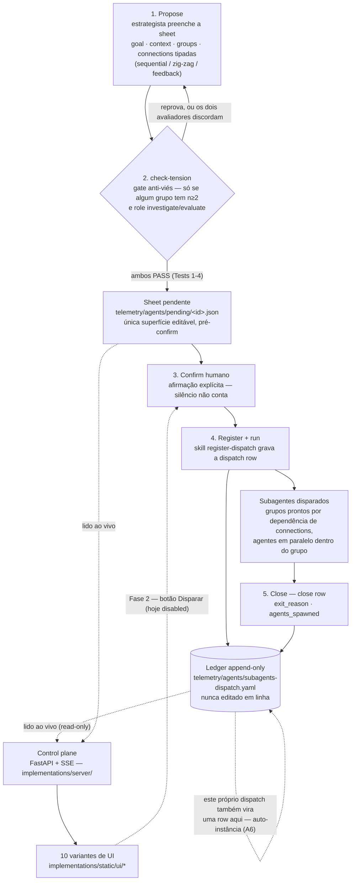
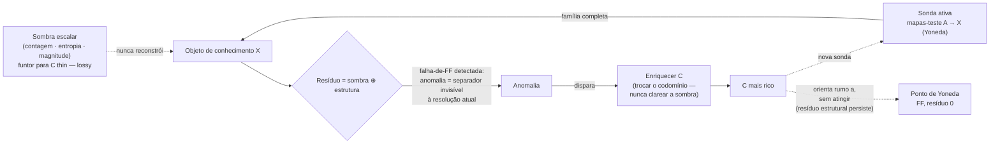

# cyberalchemy-orchestrator *(nome provisório)*

> **Estatuto:** semente / brainstorm, **não-revisado**, local (sem remote, sem push).
> `Claim ≤ proof`: toda afirmação abaixo vale só até onde o arquivo linkado prova — leia
> "é uma categoria" como "candidato a tipar", não como resultado. **Nada neste repo está
> tipado em Lean**; as âncoras Lean apontam para o repo-irmão `domainspec-lean-formalization`.
> A disciplina de dispatch (check-tension → confirm → ledger → close) roda de verdade; o
> control plane que **lê** o ledger (Fase 1) está construído e testado; o botão que
> **escreve** (Fase 2) existe na UI mas está `disabled` por design. Criado 2026-07-18,
> primeira sessão de trabalho real 2026-07-20.

Este README orienta quem abre o repo pela primeira vez: **o que é isto, o que já roda hoje
vs. o que ainda é tese, como subir a peça concreta, e quais três documentos ler primeiro.**

## O que é isto?

Este repo tem duas camadas, e confundi-las é o erro mais fácil de cometer na primeira
leitura.

A camada **concreta** é um **orquestrador de subagentes**: uma disciplina de dispatch
(grupos de agentes + conexões tipadas `sequential` / `zig-zag` / `feedback`, registradas
num ledger append-only) e, sobre ela, um **control plane** — um servidor FastAPI + SSE com
dez variantes de UI que leem, ao vivo, o que está pendente de confirmação humana e o que já
foi disparado. Isso roda hoje, tem testes, e você pode subir localmente em minutos (ver
[Quick Start](#quick-start--como-rodar)).

A camada **tese** é mais ambiciosa e muito menos madura: a aposta de que essa própria
linguagem de orquestração (grupos, conexões, dispatches) **é** uma categoria matemática —
objetos, morfismos, composição, identidade — e que ascender no conhecimento significa
enriquecer o codomínio dessa categoria rumo ao ponto de Yoneda, nunca resumi-la a um número.
Essa tese ainda não foi provada em lugar nenhum; ela vive em [`FRAMINGS.md`](FRAMINGS.md),
[`MAPPING.md`](MAPPING.md) e no alvo falsificável único de [`OBLIGATIONS.md`](OBLIGATIONS.md).

As duas camadas se tocam num ponto: o próprio trabalho de construir este repo é feito por
dispatches gravados no **mesmo ledger** que o orquestrador opera — a tese chama isso de
*"framework as its own instance"* (BACKLOG A6). A ambição de fundo por trás de tudo é
modelar **conhecimento** — o que é, que propriedades tem, como se relaciona, quem age sobre
ele — com estrutura suficiente para produzir sistemas, inclusive a si mesmo; o orquestrador é
a primeira fatia executável dessa ambição, não o projeto inteiro (ver
[`PLAN.md §1`](PLAN.md#1-problema)).

> **Meta de design (nova, 2026-07-20):** a camada concreta deve ser **genérica — dropável
> em qualquer repo com integração próxima de zero**, independente do domínio daquele repo. A
> tese categórica é o conteúdo *particular* deste repositório; o substrato de orquestração
> (schema de dispatch, skills, ledger, control plane, pool de agentes) não deveria depender
> dela. Que propriedades isso exige, e o que já é evidência disso hoje, está em
> [Meta: dropável em qualquer repo](#meta-dropável-em-qualquer-repo-genérico-por-design) —
> levantado ali como hipóteses falsificáveis, não como fato consumado.

## Como as peças se encaixam



O ledger só é escrito **depois** do confirm humano — é o gate. Uma UI que lesse só o ledger
sempre chegaria tarde, porque nunca poderia *ser* o gate; por isso a Fase 1 lê também a sheet
pendente (`telemetry/agents/pending/`), o único artefato pré-confirm e editável. Os dois lados
têm posturas opostas por design: o **appender** da skill `register-dispatch` é **estrito**
(recusa gravar fora do schema v0.6.0 e se recusa a escrever num ledger já corrompido — ele
protege o arquivo), enquanto o **leitor** do control plane é **leniente** (mostra até rows
antigas prettificadas que o appender rejeitaria — ver [as duas decisões](#duas-decisões-que-os-dados-reais-forçaram)).
Um hook bloqueia leitura do ledger via Bash direto; a leitura estrutural passa sempre pelo
`server/ledger.py`.

## O que já roda hoje vs. o que é tese

Este é o ponto onde vale ser mais honesto do que empolgado.

**Roda hoje (código, com testes, você pode executar agora):**

- O **control plane de leitura** (Fase 1): servidor FastAPI + SSE em
  [`implementations/`](implementations/), com dez variantes de UI sobre a mesma API,
  parser leniente do ledger, testes de parser (`tests/test_ledger.py`) e testes Playwright
  contra as dez variantes (`tests/test_ui.py`).
- O **ledger real**: [`telemetry/agents/subagents-dispatch.yaml`](telemetry/agents/subagents-dispatch.yaml)
  já tem ~700 dispatches reais registrados em 11 repos-irmãos pela skill `register-dispatch` —
  incluindo, literalmente, os dispatches que construíram e revisaram o próprio control plane.
- O **agent-pool-mcp**: servidor MCP rodável em [`tools/agent-pool-mcp/`](tools/agent-pool-mcp/)
  (`npm run smoke` não precisa de chave de API), que seleciona `agent_name` a partir do pool
  canônico de [`telemetry/agents/agent-pool.yaml`](telemetry/agents/agent-pool.yaml)
  (419 entradas tagueadas).
- As **skills operacionais** em [`.claude/skills/`](.claude/skills/) —
  `register-dispatch`, `check-tension`, `robot-talks`, `domainspec-subagents-strategy` —
  executáveis via Claude Code hoje, não roteiro futuro.

**É tese / candidato, não prova:**

- **[OBLIGATIONS.md](OBLIGATIONS.md)** — a pergunta "a linguagem de orquestração é uma
  categoria de verdade?" (OBL-E3) está **OPEN**. Sem ela descarregada, todo paralelo em
  `MAPPING.md` é candidato tipado, não resultado.
- **[MAPPING.md](MAPPING.md)** e **[FRAMINGS.md](FRAMINGS.md)** — os paralelos entre
  construtos do orquestrador (sonda, verbo, resíduo, zig-zag) e teoria das categorias são
  hipóteses com âncora (frequentemente em `domainspec-lean-formalization`), não teoremas
  deste repo.
- **[`vault/hypothesis/orquestracao-anti-ruido.md`](vault/hypothesis/orquestracao-anti-ruido.md)**
  (`HYP-ORCH-NOISE`) — a tese de que o orquestrador é uma "máquina de redução de ruído" —
  status `candidate` / `exploratory` explícito no frontmatter, com seções marcadas `PENDENTE`.
- A **portabilidade genérica** (a meta abaixo) — hoje é evidência parcial + hipótese, não uma
  garantia empírica; ver os collapse-tests de cada `H-PORT-*`.
- A **Fase 2 do control plane** (o botão "Disparar" que grava o confirm) não está
  implementada; todo botão nas dez UIs está `disabled` de propósito.
- **Nada neste repo está tipado em Lean** — as âncoras Lean citadas apontam para o repo-irmão
  `domainspec-lean-formalization`; aqui são referência, não prova local.

## Quick Start / Como rodar

### 1. Control plane (o leitor)

```sh
cd implementations
pip install -r requirements.txt
python -m server.main
# http://127.0.0.1:8765  — a raiz serve o hub de seleção das dez variantes de UI
```

`requirements.txt` vive dentro de `implementations/`, não na raiz — entre na pasta **antes**
de instalar. É **somente leitura**: nenhum comando aqui escreve no ledger. Sem `config.json`,
o servidor **auto-descobre** — varre o diretório pai atrás de qualquer pasta-irmã com
`telemetry/agents/`; para fixar a lista, copie `implementations/config.example.json` para
`implementations/config.json`.

### 2. Testes

```sh
python implementations/tests/test_ledger.py       # parser + smoke contra os ledgers reais
python implementations/tests/test_ui.py           # Playwright nas dez variantes
python implementations/tests/test_ui.py terminal  # só uma variante
```

Screenshots caem em `implementations/tests/screenshots/`.

### 3. MCP agent-pool (seleção de `agent_name`)

```sh
cd tools/agent-pool-mcp
npm install
npm run smoke          # caminhos determinísticos, sem chave de API
```

Registro cross-repo, escopo de usuário — em `~/.claude.json` (ou `.mcp.json` de um repo):

```json
{
  "mcpServers": {
    "agent-pool": {
      "command": "node",
      "args": ["C:\\Users\\victo\\cyberalchemy-orchestrator\\tools\\agent-pool-mcp\\src\\server.mjs"],
      "env": { "ANTHROPIC_API_KEY": "sk-ant-..." }
    }
  }
}
```

Sem `ANTHROPIC_API_KEY`, `recommend_agents` degrada para o pré-filtro determinístico (modo
`deterministic-fallback`); `search_pool` e `check_vocab` nunca precisam de chave.

## API do control plane

| Endpoint | O quê |
|---|---|
| `GET /api/snapshot` | Estado inteiro, janela recente por repo (até `limit`=40 por repo). |
| `GET /api/stream` | SSE — emite `event: snapshot` sempre que o disco muda; conecte com `EventSource`. |
| `GET /api/dispatch/{repo}/{dispatch_id}` | Uma dispatch sem truncar prompts (painel de detalhe). 404/500 conforme o caso. |
| `GET /api/overview` | Agregados de TODOS os repos + filas de atenção humana (pendentes, abertas hoje, todas abertas — cap 200). Nada truncado por `limit`. |
| `GET /api/repo/{name}` | Drill-down de um repo: histórico completo `slim` + `summary` + `series` (histograma diário). Filtros `?state=open\|closed\|all` e `?type=<dispatch_type>` filtram só a lista, nunca o `summary`/`series`. |

Contrato completo (formas exatas, `data-testid` obrigatórios, convenção de prefixo `_` para
campos calculados, referencial de dia em UTC): [`implementations/UI-CONTRACT.md`](implementations/UI-CONTRACT.md).

#### Duas decisões que os dados reais forçaram

1. **O leitor é leniente; o appender é estrito.** Rows antigas prettificadas (JSON
   multi-linha, vírgulas finais) que o appender rejeitaria ainda precisam aparecer — em modo
   estrito o leitor devolvia 0 dispatches para o repo `domainspec`; leniente, devolve 55.
2. **Prefixo `_` é escopado a objetos com FORMA DE ROW.** `status` é uma chave real de rows
   pré-v0.5.2; um campo calculado com esse nome, num objeto que compartilha o namespace de
   uma row, sobrescreveria dado histórico. Agregados que não são rows (`summary`, `series`,
   `totals`) não têm esse namespace a proteger e usam chaves sem prefixo.

## Anatomia de uma dispatch row / close row

Cada dispatch contribui **exatamente dois appends** no mesmo ledger (Principle 3 da
constituição de subagents-strategy): a **dispatch row** no disparo e a **close row** no
fechamento. `groups`/`connections` (dispatch) e `agents_spawned`/`feedback_prompts` (close)
são colunas JSON dentro da linha YAML. Os campos que carregam o peso — a forma completa (e os
enums) vive na skill [`register-dispatch`](.claude/skills/register-dispatch/SKILL.md):

| Campo (dispatch row) | O quê |
|---|---|
| `dispatch_id` | `YYYY-MM-DD-<slug>` — chave de dedup. |
| `schema_version` | `"0.6.0"` exato. |
| `dispatch_type` | `research \| review \| experiment` (LIVE); `code \| plan \| suggestion` reservados. |
| `goal` / `context` | objetivo (1-2 frases) / framing (2-4 frases) — o único canal que os subagentes recebem. |
| `groups` | array JSON: cada grupo tem `group_id`, `agents[]`, `n`, `robot_talks`, `anti_bias` (obrigatório se `n≥2`). |
| `connections` | array de arestas `{from, to, type, loop_cap?}` — `type` ∈ `sequential \| zig-zag \| feedback`; `loop_cap` só em loops. |
| `final_approver` | `"parent"` ou o `agent_name` de um aprovador dedicado (nunca membro do grupo de trabalho). |
| `anti_bias_global` | eixo de tensão do dispatch inteiro (obrigatório com ≥2 grupos em fan-out). |

Cada `agents[]` carrega `role` (`explorer \| skeptic \| writer \| auditor`), `model`,
`token_budget`, `initial_prompt`, `agent_name` (do pool ou `null`) e `angle` (obrigatório se
`n≥2`). A **close row** fecha com `close_of` (o `dispatch_id`), `exit_reason`
(`resolved \| loop_ceiling_reached \| dissent_irreconcilable \| user_abort \| error`),
`agents_spawned` (`{total, tree, loops_used}`) e `feedback_prompts` (cada pedido de uma aresta
`feedback`, verbatim). Timestamps (`created`, `closed`) são carimbados pelo appender — enviá-los
é rejeitado.

## Fases

| Fase | O quê | Estado |
|---|---|---|
| **Fase 1 — o leitor** | FastAPI + SSE somente-leitura sobre o ledger e as sheets pendentes; dez variantes de UI sobre um contrato de testids único. | **Feita** — testada (`test_ledger.py`, `test_ui.py`). |
| **Fase 2 — o botão** | `POST /confirm` grava o confirm; o Claude, esperando via `Monitor`, segue a cadeia normal (`check-tension` → `register-dispatch` → agentes → close row). Quem dispara continua sendo o Claude na sessão — preserva contexto e a cadeia de skills. | Planejada — o botão "Disparar" já existe em toda UI, `disabled`. |
| **Fase 3 — edição** | Editar a sheet pendente antes do confirm (hoje só leitura). | Planejada. |

## Meta: dropável em qualquer repo *(genérico por design)*

Uma meta de primeira classe deste projeto: o **substrato de orquestração** deve servir
qualquer repositório com integração próxima de zero — independente do domínio do alvo. Vale
separar o que é **substrato** (genérico, portável) do que é **conteúdo** (particular deste
repo):

| Camada | O que é | Portável? |
|---|---|---|
| **Substrato** | schema de dispatch (`schema_version 0.6.0`), skills (`register-dispatch`, `check-tension`, `subagents-strategy`), ledger append-only, control plane, pool de agentes | **é a meta** — deveria dropar em qualquer repo |
| **Conteúdo** | a tese categórica (FRAMINGS/MAPPING/OBLIGATIONS/DEFINITIONS), o vault, `HYP-ORCH-NOISE`, os ensaios | **não** — é o assunto deste repositório específico |

### O que já é evidência de genericidade hoje

Não é só aspiração — parte do design já aponta para lá, e isso é verificável:

- O control plane **auto-descobre** qualquer repo-irmão que tenha `telemetry/agents/` (ledger
  ou pending), lendo-o **read-only**, sem nenhuma instrumentação no alvo — puro filesystem
  ([`implementations/server/config.py`](implementations/server/config.py), `_scan_repos`).
- O ledger já atravessa **11 repos** sob um único `schema_version` — não é single-repo por
  acidente, é multi-repo por construção.
- O `agent_name` é resolvido contra **um** pool canônico via um servidor MCP cross-repo;
  outros repos são **consumidores**, não portam cópias que derivam
  ([`tools/agent-pool-mcp/README.md`](tools/agent-pool-mcp/README.md)).
- As skills vivem em `.claude/skills/` — unidades de copy-in, não código acoplado a este repo.

### Hipóteses de portabilidade (candidatas, falsificáveis)

Seguindo a disciplina `claim ≤ proof` do repo, cada propriedade necessária vira uma hipótese
com seu **collapse-test**. Nenhuma está descarregada; são o que teria que valer para "genérico
por design" deixar de ser slogan.

- **H-PORT-1 — Substrato ⊥ domínio.** A camada de orquestração é separável de todo conteúdo
  de domínio: um repo *sem* o vault/tese ainda opera a disciplina inteira. *Collapse:* se
  alguma skill (`register-dispatch`/`check-tension`) hard-codar conceitos da tese CT a ponto de
  não rodar sem `definitions/` ou `FRAMINGS.md`, o substrato não é separável.
- **H-PORT-2 — O schema é o único contrato.** Um repo é "observável" **se e somente se** tem
  `telemetry/agents/` com um ledger conforme o `schema_version` — nada mais. *Collapse:* se
  observar um repo novo exigir qualquer coisa além da pasta + schema (config manual, código no
  alvo), o contrato não é o schema sozinho. *(Evidência a favor hoje: a auto-descoberta dispara
  exatamente sobre esse sinal.)*
- **H-PORT-3 — Observação read-only = zero-integração.** O plano observa sem o repo-alvo fazer
  nada: sem hook no alvo, sem emissão de eventos, sem SDK — só o disco. *Collapse:* se algum
  repo precisar instrumentar/emitir para aparecer, a integração não é zero.
- **H-PORT-4 — Vocabulário único, N consumidores.** O `agent_name` é resolvido contra UM pool
  canônico compartilhado; repos não portam cópias divergentes. *Collapse:* se pools por-repo
  derivarem e não reconciliarem, a genericidade do vocabulário quebra — que é justamente a razão
  declarada de o MCP existir.
- **H-PORT-5 — Skills copy-in, config-free.** Dropar
  `.claude/skills/{register-dispatch, check-tension, domainspec-subagents-strategy}` num repo
  basta para operar a disciplina; nenhum fio por-repo. *Collapse:* se qualquer wiring específico
  do repo for necessário, "copy-in" é falso e o substrato precisa de um **instalador** (e aí a
  pergunta vira: qual é o kit mínimo de portabilidade? — ver OQ-PORT abaixo).
- **H-PORT-6 — Genericidade = a tese A6/CT no nível da ferramenta** *(especulativa; ponte com
  a tese)*. Se a linguagem de orquestração for mesmo uma categoria `ORCH` (OBL-E3), então
  `ORCH` é a **categoria-base domínio-independente** e o conteúdo de cada repo é um funtor
  *saindo* de `ORCH` para o codomínio daquele domínio — a genericidade seria uma *consequência*
  da tese, não um acidente de engenharia. *Collapse:* se OBL-E3 bater seu collapse-test (só o
  fragmento `sequential` é categoria), essa ponte cai a analogia — e a genericidade prática
  continua valendo mesmo assim, porque **H-PORT-1..5 não dependem de H-PORT-6**.

> **OQ-PORT (pergunta aberta).** Qual é o **kit mínimo de portabilidade** e como ele é
> entregue — submódulo git, script instalador (como o `copilot/install.sh` do `domainspec`),
> ou cópia manual? E o que, exatamente, um repo-alvo precisa ter *antes* (só a pasta
> `telemetry/agents/`? um `.mcp.json`? nada?). Ainda não decidido; candidato a virar a próxima
> obrigação `OBL-PORT` se a meta de genericidade for priorizada.

---

## Camada de profundidade — a tese categórica *(opcional)*

*Tudo a partir daqui é para quem quer a tese. Se você só vem usar o control plane, pode parar
antes desta seção — nada aqui muda como a peça concreta roda.*

### O fio comum

Toda a anatomia do repositório — resíduo, sombra, separação, sonda, verbo — circula uma única
alavanca: **thin vs. não-thin, a escolha do codomínio `C`**.

Um objeto de conhecimento `X` é visto através de um funtor para algum codomínio `C`. Se `C` é
**thin** (entre dois objetos há no máximo um morfismo — o caso degenerado de uma ordem ou de
um conjunto), a leitura que se obtém é uma **sombra**: contagem, entropia, magnitude — um
número que resume o objeto e joga fora o objeto. Se `C` é **não-thin** (morfismos carregam
estrutura — tipos, regras, composições distintas), a leitura preserva a **estrutura** que a
sombra descarta. O **resíduo** — o que qualquer tradução ou síntese deixa de preservar —
decompõe-se exatamente nessas duas faces: `resíduo = sombra ⊕ estrutura`
([FRAMINGS.md F1](FRAMINGS.md#f1--resíduo--sombra--estrutura)).

Ascender no conhecimento, sob essa alavanca, **nunca** significa clarear a sombra — apurar a
métrica. Significa **enriquecer `C`**: trocar o codomínio thin por um mais rico, até que a
interrogação ativa do objeto por mapas-teste (`A → X`, uma **sonda**, no sentido de Yoneda) se
torne *fully faithful* — o **ponto de Yoneda**. Uma **anomalia** — duas coisas que a lente
atual identificava revelando-se distintas sob uma sonda nova — é o motor que aponta onde `C`
precisa crescer ([FRAMINGS.md F6](FRAMINGS.md#f6--o-ponto-de-yoneda-como-alvo-a-anomalia-como-motor-a-dinâmica)).



**Nota de honestidade sobre o diagrama.** A leitura ingênua — "o ponto de Yoneda é um alvo que
se atinge no fim de uma escada finita" — já caiu num debate registrado em
[FRAMINGS.md F6 (status 2026-07-20)](FRAMINGS.md#f6--o-ponto-de-yoneda-como-alvo-a-anomalia-como-motor-a-dinâmica):
`y` é *fully faithful* de graça e o endpoint resíduo-zero é vacuoso. O que sobrevive não é a
chegada, é a **trajetória ordenada de enriquecimento** — e mesmo essa trajetória tem estrutura:
[F7](FRAMINGS.md#f7--duas-espécies-de-sonda--os-dois-eixos-independentes-com-ordem-de-apresentação)
distingue uma sonda-de-reconhecimento (que acha *quais objetos existem*) de uma sonda-de-ligação
(que estabelece *as relações* entre eles), com a segunda dependendo de tipagem da primeira — não
uma escada linear, um poset graduado.

### Vocabulário normativo — as 5 definições

Fonte única: [`definitions/DEFINITIONS.md`](definitions/DEFINITIONS.md). Cada termo carrega
Status · Voz científica/formal · Interpretação operacional · Fronteira · Tipo categórico + âncora
Lean — todas `status: candidato`, nenhuma promovida a premissa.

| ID | Termo | O traço, em uma linha |
|---|---|---|
| DEF-ORCH-001 | **resíduo** | O objeto de duas faces (sombra ⊕ estrutura) que um verbo deixa de preservar — não o relatório da perda, a coisa em si. |
| DEF-ORCH-002 | **separação** | O primitivo anterior à contagem: sem sinal individuante, indiscernível = idêntico; contar é derivado, nunca fundacional. |
| DEF-ORCH-003 | **sombra** | A face escalar do resíduo — funtor para uma categoria *thin*; separa, mas não reconstrói. |
| DEF-ORCH-004 | **sonda** | Interrogação ativa por mapas-teste `A → X`; a família completa reconstrói o objeto (Yoneda *fully faithful*). |
| DEF-ORCH-005 | **verbo** | Um morfismo mais a condição sob a qual preserva a simetria do objeto; fora dela, gera resíduo — mensurável por-verbo. |

### Construto ⟷ tipo categórico (a espinha do vault)

A regra herdada é dura: **todo construto da linguagem-de-agentes precisa de um tipo em teoria
das categorias e de uma âncora num arquivo Lean real**. A tabela completa (ledger vivo, com
estatuto e força por linha) vive em [`MAPPING.md`](MAPPING.md); esta é a amostra que carrega o
peso argumentativo:

| Construto (linguagem-de-agentes) | Tipo CT candidato | Força |
|---|---|---|
| `concat` de resultados (sem `robot_talks`) | **coproduto** — thin, count-shaped | estrutural |
| `synthesis` (com `robot_talks: true`, tensão) | **pushout / colimit** — identifica sobreposição, **gera resíduo mensurável** | candidato forte |
| conexão `sequential` | composição `∘` | estrutural |
| conexão `zig-zag` | identidades triangulares / `EqvGen` ida-e-volta | candidato forte |
| conexão `feedback` | **NÃO** um morfismo de 1-nível — 2-célula (fora do 1-esqueleto) | candidato — evidência para o risco de OBL-E3 |
| dispatch (grupos + conexões) | diagrama tipado `J → Cat` | candidato |
| `check-tension` / eixos anti-viés (n≥2) | família de sondas jointly-faithful — cada eixo, um separador ortogonal | candidato forte |
| `meta:true` + `parent_dispatch_id` (linhagem) | endofunctor / **free monad** sobre árvore bem-fundada — mecaniza a tese A6 | candidato forte |
| resíduo de uma síntese | `FunctorialResidueStructure` — unit de Lan não-iso | estrutural |

O achado central — **concat = coproduto vs. synthesis = pushout** — liga a mecânica do
`robot_talks` diretamente a DEF-ORCH-001: uma síntese sob tensão *literalmente* produz o objeto
de duas faces que o repo chama de resíduo. É também metade do caminho para descarregar a
sub-obrigação 3 de OBL-E3.

### OBL-E3 — o teste que decide tudo

Nada neste vault é resultado até que uma obrigação específica seja descarregada. Ela vive em
[`OBLIGATIONS.md`](OBLIGATIONS.md):

> Existe uma categoria `ORCH` onde **objetos** = grupos de dispatch, **morfismos** =
> `connections` tipadas (`sequential` / `zig-zag` / `feedback`), **composição** = concatenação
> de pipeline, **identidade** = grupo pass-through?

Três sub-obrigações, todas precisam valer: (1) associatividade das conexões encadeadas;
(2) leis de identidade do grupo pass-through; (3) o resíduo de uma síntese ser o **mesmo objeto**
que `FunctorialResidueStructure` — não apenas um resíduo count-shaped.

O risco está nomeado no próprio documento: `zig-zag` e `feedback` são *loops*, e o palpite
honesto é que só o fragmento `sequential` é categoria de cara; os outros dois são provavelmente
estrutura extra (2-células? uma bicategoria?), não morfismos de 1-nível. O **collapse-test é
duplo**: (a) se `zig-zag`/`feedback` não compõem associativamente, `ORCH` é categoria só no
fragmento `sequential` (um DAG) e o paralelo CT vira decoração para as outras arestas; (b) se o
resíduo-de-síntese for demonstravelmente count-shaped, a sub-obrigação 3 colapsa a analogia.

**Status: OPEN.** Até descarregar OBL-E3 (ou bater um dos dois collapse-tests), tudo neste vault
é candidato tipado, não resultado — inclusive as tabelas acima. Essa é a disciplina que separa
este repositório de um glossário decorado com setas.

---

## Estrutura do repositório

```
cyberalchemy-orchestrator/
├── PLAN.md                        # o objeto enxuto: problema + plano por etapas E0-E4, com collapse-tests
├── FRAMINGS.md, MAPPING.md, OBLIGATIONS.md   # a camada tese (enquadramentos, mapping CT, alvo falsificável)
├── definitions/DEFINITIONS.md     # protocolo de definições, termos DEF-ORCH-*
├── .claude/skills/                # skills operacionais deste repo (substrato portável)
│   ├── register-dispatch/         # dono da forma da sheet + o appender (append-dispatch.cjs)
│   ├── check-tension/             # o gate anti-viés init-time (Tests 1-4)
│   ├── domainspec-subagents-strategy/  # o router: quando dispatchar, lifecycle de 4 passos
│   └── ...                        # dezenas de outras skills (research, review, close-session, ...)
├── telemetry/agents/
│   ├── subagents-dispatch.yaml    # O LEDGER — append-only, ~700 rows reais, 11 repos
│   ├── agent-pool.yaml            # pool canônico de agent_name (419 entradas tagueadas)
│   └── pending/                   # sheets pré-confirm (1 fixture de demonstração hoje)
├── implementations/               # o dispatch control plane (Fase 1)
│   ├── server/                    # main.py, ledger.py, config.py (auto-descoberta cross-repo)
│   ├── static/ui/<slug>/          # dez variantes de UI (aurora, blueprint, brutalist, cyberpunk,
│   │                              #  grimoire, linear, mission-control, radar, swiss, terminal)
│   ├── UI-CONTRACT.md             # contrato normativo (API + testids)
│   └── tests/                     # test_ledger.py, test_main.py, test_ui.py (Playwright)
├── tools/agent-pool-mcp/          # servidor MCP — seleção de agent_name cross-repo
├── vault/constitution/, vault/hypothesis/   # regras ratificadas e hipóteses exploratórias
├── research/, sessions/           # investigações pontuais e nós de sessão fechados
└── docs/                          # features, ensaios, e os candidatos de README (docs/readme-candidates/)
```

### Navegação

| Caminho | O quê |
|---|---|
| [`PLAN.md`](PLAN.md) | O objeto enxuto: problema, mapa do material bruto, plano E0-E4 com collapse-tests, protocolo de definições. |
| [`FRAMINGS.md`](FRAMINGS.md) | Ledger dos enquadramentos F1–F7 — a anatomia da tese categórica. |
| [`MAPPING.md`](MAPPING.md) | Ledger vivo construto ⟷ tipo CT, com força e collapse-test por linha. |
| [`OBLIGATIONS.md`](OBLIGATIONS.md) | O alvo falsificável único (OBL-E3). |
| [`definitions/DEFINITIONS.md`](definitions/DEFINITIONS.md) | Vocabulário normativo (resíduo, separação, sombra, sonda, verbo) — fonte única por termo. |
| [`implementations/`](implementations/) | O control plane rodável. Ver [`implementations/README.md`](implementations/README.md) e o contrato [`implementations/UI-CONTRACT.md`](implementations/UI-CONTRACT.md). |
| [`tools/agent-pool-mcp/`](tools/agent-pool-mcp/) | MCP cross-repo que seleciona `agent_name` do pool canônico. |
| [`telemetry/agents/subagents-dispatch.yaml`](telemetry/agents/subagents-dispatch.yaml) | O ledger append-only — o coração operacional. Nunca editar em linha; só via `register-dispatch`. |
| [`telemetry/agents/agent-pool.yaml`](telemetry/agents/agent-pool.yaml) | Pool canônico de personas (`agent_name`), com tags e `role_fit`. |
| [`telemetry/agents/pending/`](telemetry/agents/pending/) | Sheets pré-confirm — a única superfície editável antes do ledger. |
| [`vault/hypothesis/`](vault/hypothesis/) | Hipóteses exploratórias, ainda não promovidas a constituição (ex.: `HYP-ORCH-NOISE`). |
| [`vault/constitution/`](vault/constitution/) | Regras já ratificadas; ver também [`vault/ontology-conventions.md`](vault/ontology-conventions.md). |
| [`docs/essays/orquestrador-anti-ruido/`](docs/essays/orquestrador-anti-ruido/) | Ensaio derivado da `HYP-ORCH-NOISE` — o orquestrador como máquina de redução de ruído (viés ⊕ ruído). |
| [`docs/features/ui-studio/`](docs/features/ui-studio/) | Feature em design: harness de fitness para as variantes de UI. |
| [`.claude/skills/`](.claude/skills/) | Skills executáveis via Claude Code — `register-dispatch`, `check-tension`, `robot-talks`, entre dezenas de outras. |

## Por onde começar

Se esta é sua primeira visita, leia estes três documentos **nesta ordem**:

1. **[`implementations/README.md`](implementations/README.md)** — a peça que já roda: o que o
   control plane é, por que existe (o ledger só é escrito pós-confirm, então uma UI que só o lê
   sempre chega tarde), e como subir localmente.
2. **[`PLAN.md`](PLAN.md)** — o objeto enxuto por trás de tudo: o problema, o material bruto já
   espalhado por outros repos, e o plano em etapas (E0-E4, cada uma com seu collapse-test).
3. **[`OBLIGATIONS.md`](OBLIGATIONS.md)** — se você quiser a profundidade da tese: o único alvo
   falsificável (OBL-E3) que decide se a linguagem de orquestração é matemática ou metáfora.
   Leitura opcional para quem só quer usar o control plane.

Para a definição de qualquer termo (`sonda`, `zig-zag`, `resíduo`, `dispatch`, ...):
[`definitions/DEFINITIONS.md`](definitions/DEFINITIONS.md).
