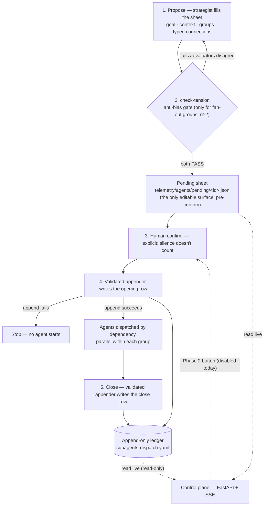

# cyberalchemy-orchestrator *(provisional name)*

> **Local, unreviewed, no remote.** Created 2026-07-18; first working session 2026-07-20.
> The read side runs and is tested; the write side is built but **disabled by design**
> (a known ledger defect gates it). `Claim ≤ proof`: any claim here holds only as far as the
> file it links proves it — read every strong claim as *candidate*, not result.

This README is a map, not a manifesto. It tells a first-time reader **what this repo is, what
actually runs today, how to bring it up, and where to go next** — and routes into the deeper
material without pulling it up front.

## What is this?

**cyberalchemy-orchestrator** is a substrate for **organizing, dispatching, and observing fleets of
LLM subagents**. In practice: you have Claude Code split a job across several AI agents, every
hand-off is logged to an append-only ledger, and a small local dashboard lets you watch it live.
Concretely, three things run today:

1. A **dispatch discipline** — a schema and an append-only **ledger** that records every fan-out of
   work to agents (who was dispatched, on what angle, how they connect, how it closed), plus a gate
   that pairs agents on deliberately opposed angles before they run.
2. A **control plane** — a read-only FastAPI + SSE server with ten UI variants that shows, live,
   what is pending human confirmation and what has already been dispatched, **across every sibling
   repo it auto-discovers**.
3. An **agent pool** — a canonical roster of 414 named personas, served over an MCP server, so
   `agent_name` is resolved from one shared vocabulary instead of per-repo copies that drift.

The orchestration itself happens **inside a Claude Code session** through skills — there is no
standalone daemon. The loop is: propose a dispatch → pass the anti-bias gate → human confirms →
append the opening row → agents run → append the close row.

*(There is a research thesis underneath — that good orchestration is a decision-hygiene problem with
category-theoretic types. That is deliberately **not** the entry point; see
[Going deeper](#going-deeper--the-thesis-optional).)*

## What runs today vs. what is still thesis

Worth being honest about the line.

**Runs today — code, with tests, you can run it now:**

- The **control plane** (Phase 1, the reader): FastAPI + SSE in [`implementations/`](implementations/),
  ten UI variants over one API contract, with parser/endpoint/Playwright tests
  ([`implementations/tests/`](implementations/tests/)).
- The **ledger**: [`telemetry/agents/subagents-dispatch.yaml`](telemetry/agents/subagents-dispatch.yaml)
  — append-only, holding this repo's own dispatches (including the ones that built the control plane),
  with the `register-dispatch` appender as its only sanctioned write path (a known bypass is the
  gating defect noted below).
- The **agent-pool MCP**: [`tools/agent-pool-mcp/`](tools/agent-pool-mcp/) — selects `agent_name`
  from [`telemetry/agents/agent-pool.yaml`](telemetry/agents/agent-pool.yaml) (414 tagged entries);
  `npm run smoke` needs no API key.
- The **operational skills** in [`.claude/skills/`](.claude/skills/) — `register-dispatch`,
  `check-tension`, `robot-talks`, `domainspec-subagents-strategy` — invokable in Claude Code today.

**Still thesis / candidate — not proof:**

- The **write path** (Phase 2, the "Dispatch" button): present in every UI but `disabled`. A ledger
  defect ([`vault/audit/ledger-enum-drift-finding.md`](vault/audit/ledger-enum-drift-finding.md))
  holds the engine's single-writer rule at `veracity: medium` and gates it.
- The **decision-science loop** (anti-bias runs; anti-noise mostly on paper) —
  [`vault/hypothesis/anti-noise-orchestration.md`](vault/hypothesis/anti-noise-orchestration.md).
- The **category-theory typing** of the orchestration language — one open obligation decides it:
  [`OBLIGATIONS.md`](OBLIGATIONS.md) (OBL-E3). **Nothing in this repo is typed in Lean**; the anchors
  point to the sibling repo, indexed in [`lean-formalization/`](lean-formalization/README.md).

## Quick start

**1 — Control plane (the reader).** Read-only; nothing here writes the ledger.

```sh
cd implementations
pip install -r requirements.txt
python -m server.main
# http://127.0.0.1:8765 — the root serves the hub over ten UI variants
```

Without a `config.json` it **auto-discovers**: it scans the parent directory for any sibling folder
that has a `telemetry/agents/subagents-dispatch.yaml` ledger or a `telemetry/agents/pending/` folder.
To pin the list, copy `implementations/config.example.json` to
`implementations/config.json`.

**2 — Tests.**

```sh
python implementations/tests/test_ledger.py       # parser + smoke over the real ledgers
python implementations/tests/test_ui.py           # Playwright across the ten variants
```

**3 — agent-pool MCP (`agent_name` selection).**

```sh
cd tools/agent-pool-mcp
npm install
npm run smoke     # deterministic, no API key
```

To register cross-repo, add it to `~/.claude.json` (or a repo's `.mcp.json`) — see
[`tools/agent-pool-mcp/README.md`](tools/agent-pool-mcp/README.md). Without `ANTHROPIC_API_KEY`,
recommendation degrades to the deterministic pre-filter; search and vocab checks never need a key.

## How a dispatch flows

The path that runs today. The opening row is appended **after** the human confirms and **before**
any agent starts; if that append fails, nothing runs. Closing appends a second row — the opening is
never mutated.



The two sides have opposite postures by design: the **appender is strict** (refuses any row outside
schema `v0.6.1`, or any structurally corrupt ledger), while the control plane's **reader is lenient**
(it still shows old prettified rows the appender would now reject). A hook blocks reading the ledger
via direct Bash; structured reads go through `server/ledger.py`. Full field-by-field anatomy of a row
lives in the [`register-dispatch`](.claude/skills/register-dispatch/SKILL.md) skill; the API contract
lives in [`implementations/UI-CONTRACT.md`](implementations/UI-CONTRACT.md).

## Why it matters

- **Auditable by construction.** Every dispatch leaves an append-only, schema-validated trace — you
  can reconstruct what ran, on what framing, and how it ended. The repo even builds itself through
  its own ledger ("framework as its own instance").
- **Generic by design.** The substrate (schema, skills, ledger, control plane, agent pool) is meant
  to drop into any repo with near-zero integration — the control plane observes read-only, no
  instrumentation on the target, just the filesystem. What's portable vs. what's particular to this
  repo, and the falsifiable hypotheses behind that goal, are tracked in [`BACKLOG.md`](BACKLOG.md).
- **Honest about its own limits.** A strict `claim ≤ proof` discipline keeps runnable fact and
  research thesis visibly apart, so nobody mistakes a candidate for a result.

## 📁 Navigation

**Orientation & method**

| Path | What |
|---|---|
| [`docs/PLAN.md`](docs/PLAN.md) | The master orientation: business problem → hypothesis → three fronts → what runs vs. thesis. Start here for the "why." |
| [`FRAMINGS.md`](FRAMINGS.md) | The category-theory ledger (F1–F7 framings + construct⟷CT-type mapping + open items). |
| [`OBLIGATIONS.md`](OBLIGATIONS.md) | The single falsifiable target, OBL-E3 — does the orchestration language form a category? |
| [`BACKLOG.md`](BACKLOG.md) | Parking lot of named-but-unplanned candidates and the portability hypotheses. |
| [`definitions/DEFINITIONS.md`](definitions/DEFINITIONS.md) | Normative vocabulary (residue, separation, shadow, probe, verb) — single source per term. |
| [`lean-formalization/`](lean-formalization/README.md) | Index mapping this repo's constructs to theorems in the sibling Lean repo (no Lean here). |

**What runs**

| Path | What |
|---|---|
| [`implementations/`](implementations/) | The runnable control plane (Phase 1). See its [README](implementations/README.md) and [`UI-CONTRACT.md`](implementations/UI-CONTRACT.md). |
| [`implementations/static/ui/`](implementations/static/ui/) | The ten UI variants served by the control plane (aurora, blueprint, brutalist, cyberpunk, grimoire, linear, mission-control, radar, swiss, terminal). |
| [`tools/agent-pool-mcp/`](tools/agent-pool-mcp/) | Cross-repo MCP that selects `agent_name` from the canonical pool. |
| [`telemetry/agents/subagents-dispatch.yaml`](telemetry/agents/subagents-dispatch.yaml) | THE ledger — append-only; never edited in place, only via `register-dispatch`. |
| [`telemetry/agents/agent-pool.yaml`](telemetry/agents/agent-pool.yaml) | The 414-entry canonical pool of `agent_name` personas, with tags and `role_fit`. |
| [`telemetry/agents/pending/`](telemetry/agents/pending/) | Pre-confirm sheets — the only editable surface before the ledger. |
| [`.claude/skills/`](.claude/skills/) | ~70 skills invokable in Claude Code — `register-dispatch`, `check-tension`, `robot-talks`, and more. |

**Knowledge & investigations**

| Path | What |
|---|---|
| [`vault/`](vault/) | The governed knowledge store — see below. |
| [`vault/axioms/axioms.md`](vault/axioms/axioms.md) | The assumed axioms (AX-1..5), incl. the T0 method root and "framework as its own instance." |
| [`vault/constitution/`](vault/constitution/) | Candidate constitutions — [`engine-constitution.md`](vault/constitution/engine-constitution.md) (EG-1..8) and [`frontend-constitution.md`](vault/constitution/frontend-constitution.md); unreviewed, not ratified. |
| [`vault/hypothesis/`](vault/hypothesis/) | Exploratory hypotheses (anti-noise, infra, claim-graph, self-similarity) — not yet promoted. |
| [`vault/audit/`](vault/audit/) | Ledger audits — [`ledger-enum-drift-finding.md`](vault/audit/ledger-enum-drift-finding.md) is the live defect that gates the write path. |
| [`research/`](research/) | Investigations (never auto-promoted): agent-name-selection-arch, agent-events-infra-hypothesis, meta-ontology, permguard-kernel, document-merge-debate, and more. |
| [`docs/`](docs/) | Feature specs, essays, discovery, signals, and [`docs/archive/`](docs/archive/) (the retired detailed roadmap with the OBL/BL/EG codes). |
| [`internal-tools/`](internal-tools/) | Auxiliary experiments — the [UI-experimentation](internal-tools/ui-experimentation/) source and a document-information-estimator. |
| [`tools/`](tools/) | Engineering tooling beyond the MCP: validators, spec constitution, a test-derivation engine, and validation fixtures. |
| [`sessions/`](sessions/) | 33 dated working-session records (close-session outputs). |

## Where to start

If this is your first visit, read these three, in order:

1. **[`implementations/README.md`](implementations/README.md)** — the piece that already runs: what
   the control plane is, why it exists, and how to bring it up locally.
2. **[`docs/PLAN.md`](docs/PLAN.md)** — the orientation behind everything: the problem, the
   hypothesis, the three fronts, what runs vs. what is still being gathered.
3. **[`OBLIGATIONS.md`](OBLIGATIONS.md)** — only if you want the depth: the one falsifiable test that
   decides whether the orchestration language is mathematics or metaphor.

For any term (`probe`, `zig-zag`, `residue`, `dispatch`): [`definitions/DEFINITIONS.md`](definitions/DEFINITIONS.md).

## Going deeper — the thesis *(optional)*

Everything above is enough to use the repo. Underneath sits a research bet, in three fronts, none of
it required reading to run the concrete piece:

- **Decision-making (the why).** Treat orchestration as *decision hygiene* — countering correlated
  bias, noise, and framing, à la Kahneman and Thaler. → [`docs/PLAN.md`](docs/PLAN.md),
  [`vault/hypothesis/anti-noise-orchestration.md`](vault/hypothesis/anti-noise-orchestration.md).
- **Category theory (the formal ground).** Give the orchestration constructs categorical types
  (probe→Yoneda, synthesis→pushout/residue, connections→composition/2-cells) — a candidate, decided
  by OBL-E3. → [`FRAMINGS.md`](FRAMINGS.md), [`OBLIGATIONS.md`](OBLIGATIONS.md).
- **System architecture (the how).** An event/bus/journal runtime that would make those principles
  enforceable end-to-end — largely a proposal today. → [`docs/features/`](docs/features/).
