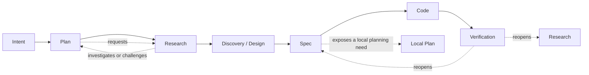

# A Composable Language for Governed Agent Work

> This is the high-level system view. It explains the shape and stakes of the proposed system for
> readers who do not yet know its vocabulary. Terms remain provisional until an ontology view owns
> them, and load-bearing choices remain open until an engineer view owns their verdicts.

## 1. The idea in one page

We want a person to be able to express work, progressively describe it, connect it to other work,
delegate bounded parts to agents, and observe what is happening without losing authority,
provenance, uncertainty, or history.

Today, much of that structure is implicit. An instruction lives in a conversation. A plan lives in
a document. Research may live in another folder. A Dispatch may exist only after confirmation.
Execution state may be visible in one tool while its rationale remains somewhere else. Relationships
among these things are often reconstructed from names, paths, prompts, or memory.

The proposed system gives independently identifiable work objects explicit properties and typed
relationships. It permits cheap, incomplete description through tags and later refinement into
stronger contracts. It records claims as claims, evidence as evidence, accepted decisions as
accepted decisions, and execution authority as execution authority. It preserves the paths by
which one became another.

The system is composable and recursively usable. A Plan may request Research. Research may
investigate or challenge a Plan. A Spec may expose a new local planning problem. Verification may
reopen Research or Design. These recurrences do not require an agent to receive the entire system
or an orchestrator to invoke another orchestrator. A root orchestrator can compile a recursive work
graph into small, bounded assignments.

### Alternative framings considered

| Framing | Why it is insufficient on its own |
|---|---|
| A better task manager | It does not explain evolving definitions, authority, evidence, or recursive composition. |
| A multi-agent workflow engine | It starts too late: the meaning and legitimacy of the work are already assumed. |
| An ontology platform | It may describe the world without governing effects, execution, and live work. |
| A document methodology | It cannot by itself make runtime state, capabilities, and provenance observable. |

## 2. The human experience

A user should be able to say, “investigate this,” “make a plan,” “implement this specification,” or
“review why this task never started.” The system should capture the request at the appropriate
commitment level, ask for confirmation when authority is required, and keep later activity linked
to the original intent.

The user should be able to answer:

- What work has been requested?
- Which work is only proposed, and which is authorized?
- What is waiting for me?
- What has started, stalled, completed, or never launched?
- Why was this agent given this context and these tools?
- Which evidence supports this decision?
- Which Plan, Research, Spec, or rule does this work relate to?
- What changed, and what was believed before it changed?
- Can I view the same material by project, purpose, system level, status, or physical folder?

An actionable Dispatch candidate should not disappear merely because it was never confirmed or
launched. It should remain visible until it receives an attributable disposition such as declined,
superseded, expired, blocked, cancelled, or not launched for a recorded reason. Reminders should
help prevent forgotten work without silently confirming or executing it.

### Alternative framings considered

| Framing | Why set aside |
|---|---|
| Treat every utterance as a task | Conversation, exploration, and authorized work would collapse into one noisy stream. |
| Record only executed work | Important pending, rejected, and abandoned decisions would disappear. |
| Let agents manage their own state | The user would lose a stable, independent account of authority and progress. |

## 3. Objects, descriptions, and hypotheses

The working model separates identity, description, relationship, and operational acceptance.
Objects remain addressable while their names, descriptions, classifications, locations, or
relationships change. Tags allow low-cost descriptions before the system or its users know enough
to commit to a stronger type or rule.

Descriptions are hypotheses rather than timeless truth. A person or agent may assert that a
construct is valid, useful, related, complete, or ready. The assertion remains distinguishable from
its evidence, its contextual acceptance, and any authority to produce effects.

This distinction makes progressive definition possible:

```text
partially described object
  -> additional tags and observations
  -> candidate properties and relations
  -> reviewed or accepted contracts
  -> operational use under explicit authority
```

The arrows do not mean that every object must follow one maturity ladder. They show increasing
commitment that a workflow profile may govern.

### Alternative framings considered

| Framing | Why set aside |
|---|---|
| Require complete schemas at creation | It makes early capture expensive and encourages users to keep knowledge outside the system. |
| Treat all tags as authoritative facts | Cheap description would silently acquire operational force. |
| Make names or paths the identity | Renaming, moving, and presenting alternative views would rewrite meaning. |

## 4. Relations and composition

Relationships are first-class because several different meanings can connect the same two objects.
A Dispatch may be generated from another object, authorized by a confirmation, contained in a Plan,
and reviewed by a separate process. None of those relationships safely implies the others.

Accepted relations need enough semantics to support validation and derived views. The research
program currently expects relation contracts to address type, direction, source, destination,
scope, version, provenance, cardinality, transitivity, inheritance, and cycle policy. Different
relation types may form trees, forests, DAGs, or controlled cyclic graphs.

Relations can also compose. A useful composition must preserve the path that justified a derived
claim or action. The system should be able to explain whether a result follows from direct
relations, a permitted transitive closure, a translation between vocabularies, or a user-approved
rule.

Physical placement is one projection of these properties and relationships. The same objects may
appear in a repository-root view, an `internal_tools` view, a project view, a research view, or a
task-oriented dashboard without acquiring different identities merely because they appear in
different places.

## 5. A recursive grammar of work

The familiar sequence below is a useful first reading:

```text
Intent
  -> Plan
  -> Research
  -> Discovery / Design
  -> Spec
  -> Code
  -> Verification
```

It is not a universal irreversible pipeline. It is a candidate grammar of work kinds whose
instances can recur at different scopes and connect through typed relations.



Research for a Plan is therefore ordinary, not exceptional. A Plan can identify uncertainty and
request Research. Research can evaluate the assumptions, feasibility, precedents, or consequences
of that Plan. Its findings may support the Plan, revise it, split it, or make it unnecessary.

A workflow profile may still require a default progression. It can state which work kinds,
evidence, reviews, and approvals are required before a more expensive or authoritative commitment.
The invariant candidate is not one global order. It is that the applicable profile, transitions,
evidence, authority, bypasses, and reopenings are explicit and historically reconstructable.

### Alternative framings considered

| Framing | Why set aside |
|---|---|
| One global lifecycle | It cannot naturally represent Research for a Plan or local planning inside a Spec. |
| Completely free graph | It makes obligations, promotion, and completion too easy to evade. |
| Folder nesting as workflow | It confuses navigation with semantic and operational relationships. |

## 6. Recursive work without recursive orchestrator authority

Recursive structure does not imply recursive orchestration. An invoked orchestrator must not invoke
another orchestrator. Instead, the root orchestrator resolves the work graph and materializes small
WorkPackages for leaf agents.

Each assignment should receive only what its task needs: an objective, selected context, source
responsibilities, a small tool profile, a budget, an expected output, applicable gates, and explicit
authority boundaries. A parent relationship does not automatically transmit tools, budget,
evidence, approval, or terminal state.

This allows deep work structures with shallow execution authority:

```text
recursive work graph
  -> root orchestration and confirmation
  -> bounded leaf assignments
  -> attributable outputs and observations
  -> reconstructed progress over the original graph
```

## 7. Plans as revisable priors

A Plan records the best current route, not an immutable prediction of the future. Research may
change its assumptions. New constraints may move its stopping point. Implementation may expose a
missing Design decision. Verification may show that the Spec or the Plan needs to be reopened.

Revisions should create new attributable facts and versions rather than silently rewriting what was
previously believed. The system can then distinguish failure to follow a Plan from justified
revision of the Plan.

Program phases work similarly. A phase groups questions, dependencies, and readiness conditions
that are useful to consider together. It is not necessarily a permanent product layer. Phases may
overlap, split, merge, move, or be superseded as the program learns.

## 8. From a request to observable work

A possible operational shape is:

```text
conversation statement
  -> candidate WorkIntent
  -> admitted WorkIntent
  -> Plan / Research / WorkPackage / DispatchCandidate
  -> confirmed Dispatch
  -> TaskRun / AgentAttempt
  -> append-only lifecycle facts
  -> current-work, audit, and reminder projections
```

The original request is not mutated into a status field. Accepted facts record that something was
admitted, confirmed, started, blocked, completed, cancelled, or never launched. Read models derive
the current view and expose freshness when the system does not know what happened recently.

This separation matters because a dashboard must not create authority by displaying a button,
status, or inferred relationship. It presents accepted facts and identified uncertainty.

## 9. The kernel is a research question

“Kernel” currently means a possible minimal contract that allows independently evolving parts of
the system to interoperate and remain auditable. It does not yet name a selected component.

The first research phase must compare:

- one universal kernel;
- several specialized kernels connected by protocols;
- a microkernel with extensions;
- a kernel-of-kernels that governs compatibility and translation;
- or an architecture in which “kernel” is not a useful organizing concept.

Candidate invariants include identity, versioning, provenance, relative validity, typed relations,
explicit authority, traceable composition, and historical preservation. Each remains a hypothesis
until research tests its necessity, scope, compatibility with the others, and behavior under
composition.

Lean is included because it is already important in the surrounding work. The research must
separate Lean as explanatory notation, Lean as a checker or generator of selected artifacts, and
Lean-checked results as governed evidence. A proof relative to definitions and premises does not by
itself show that those definitions match the product, that the premises hold at runtime, or that an
action is authorized.

## 10. Candidate architecture by responsibility

The architecture can be understood as collaborating responsibilities rather than fixed product
layers:

1. **Authoring and interaction** captures user intent, incomplete descriptions, questions,
   proposals, and decisions.
2. **Knowledge and relationship management** preserves identities, properties, tags, typed
   relations, definitions, provenance, and alternative projections.
3. **Governance and authority** distinguishes claims, evidence, acceptance, promotion,
   confirmation, capabilities, and effect authorization.
4. **Planning and orchestration** resolves recursive work graphs into bounded, confirmable
   assignments and schedules.
5. **Execution** invokes tools and agents under materialized capabilities and records attempts.
6. **Event history and projections** preserve accepted lifecycle facts and build current views.
7. **Verification and formalization** check selected contracts through runtime validators,
   tests, reviews, and potentially Lean.
8. **Observability and product views** expose pending, active, blocked, completed, abandoned, and
   unknown work at multiple levels.

These responsibilities may be deployed together or separately. The research must determine which
boundaries are semantic, which are authority boundaries, and which are merely implementation
choices.

### Alternative framings considered

| Framing | Why set aside |
|---|---|
| Declare these as permanent layers | The layer model itself remains an open, configurable projection. |
| Put all semantics in one central service | It may turn a minimal interoperability contract into a product monolith. |
| Let every subsystem define everything locally | Translation, audit, and authority could become implicit or contradictory. |

## 11. Candidate tool families

Tool selection comes after responsibility boundaries. The following is an option inventory, not a
recommendation:

| Responsibility | Candidate options to compare | Main research question |
|---|---|---|
| Identity, metadata, and transactional authority | PostgreSQL; document databases; append-oriented stores | Which facts require transactions, constraints, and authoritative ownership? |
| Relationship traversal and alternative views | Relational edge tables; graph databases such as Neo4j; derived graph indexes | Is graph traversal authoritative or a rebuildable projection? |
| Durable event history | Database outbox/event tables; dedicated event stores; Kafka- or NATS-style streams | Which events are authoritative, and which transport observations are replayable? |
| Workflow orchestration | Purpose-built runtime; Temporal-style workflow engines; Dagster/Prefect-style orchestrators | Can the engine preserve confirmation, capabilities, recursive work, and explicit authority? |
| Policy and authorization | Application-owned policies; OPA; Cedar-style policy evaluation | How are policy versions and decisions bound to an execution attempt? |
| Search and retrieval | Database search; Elasticsearch/OpenSearch-style indexes; embedding-assisted retrieval | Which retrieval results are evidence, and how is freshness shown? |
| Observability | OpenTelemetry-compatible traces and metrics; journal-derived operational views | How are rich histories separated from bounded-cardinality health signals? |
| Formalization and validation | Lean; schema validators; property tests; model checking | Which claims deserve formalization, and how do formal artifacts connect to runtime evidence? |
| Artifact history and collaboration | Git; database versions; hybrid GitOps | Which changes need branching and review, and which live facts cannot wait for commits? |

The final architecture may use several tools for one responsibility or one tool for several
responsibilities. The selection criterion is whether authority, provenance, replay, and
interoperability remain explicit—not whether a tool can store a similar shape.

## 12. A representative walkthrough

Suppose a user asks: “Plan how to introduce a new governed research capability.”

1. The statement is captured as a candidate WorkIntent.
2. A Plan is created as a revisable prior.
3. The Plan identifies uncertainty and requests Research about existing capabilities.
4. The Research targets the Plan, returning evidence that revises its assumptions.
5. Discovery/Design synthesizes the evidence into alternatives and explicit open decisions.
6. A Spec records an accepted contract for one bounded capability.
7. The root orchestrator prepares a DispatchCandidate for implementation and review.
8. If it waits for confirmation, it remains visible and can trigger a reminder.
9. Once confirmed, the runtime creates bounded agent attempts with explicit context and tools.
10. Code is linked to the Spec version it attempts to realize.
11. Verification checks the implementation and may reopen Research or Spec.
12. The dashboard reconstructs current state from accepted lifecycle facts while preserving the
    complete history of revisions and non-launched candidates.

The walkthrough is intentionally recursive. Research did not merely follow the Plan; it acted on
the Plan and changed it.

## 13. What remains open

The research program must still determine:

- whether stable object identity survives changes to function or objective;
- which work names are artifact kinds, activity kinds, session kinds, or contextual roles;
- the typed relation grammar and permitted recursive compositions;
- how workflow profiles require, skip, or reopen work;
- whether `Spec` and `Code` are the only universally required work kinds, with the route through
  Plan, Research, Experiment, Discovery, Design, Verification, or other kinds selected through a
  user-confirmed installation profile;
- whether installation is the right confirmation boundary for that profile or whether the route
  must remain adjustable per project, risk, and context;
- whether there is one kernel, several, or none;
- the boundary between loose tags and accepted operational relations;
- how candidate validity becomes contextual acceptance or executable authority;
- how pending Dispatch candidates are registered and reminded without entering the executable
  ledger;
- which semantics Lean should own, check, generate, or merely explain;
- and which infrastructure choices preserve these distinctions with acceptable complexity.

Every governed explanatory, research, planning, design, specification, formalization, review, or
decision artifact must retain an explicit `Open Questions` section. An empty section records that
no questions are currently known; it does not assert completeness. Resolved or deferred questions
remain in history with their later status.

## 14. Named architectural stances

This view names but does not decide the following tensions:

- `stance:kernel-topology` → `engineer-view#decision-kernel-topology`
- `stance:recursive-work-grammar` → `engineer-view#decision-recursive-work-grammar`
- `stance:workflow-profile-authority` → `engineer-view#decision-workflow-profile-authority`
- `stance:minimal-universal-work-contract` → `engineer-view#decision-minimal-universal-work-contract`
- `stance:dispatch-candidate-registry` → `engineer-view#decision-dispatch-candidate-registry`
- `stance:relation-authority` → `engineer-view#decision-relation-authority`
- `stance:projection-vs-authority` → `engineer-view#decision-projection-authority`
- `stance:lean-runtime-boundary` → `engineer-view#decision-lean-runtime-boundary`
- `stance:formalization-correspondence` → `engineer-view#decision-formalization-correspondence`
- `stance:storage-and-orchestration-tools` → `engineer-view#decision-tool-boundaries`

Provisional terms used here defer to a future ontology view, including `WorkIntent`, `Plan`,
`Research`, `Discovery`, `Design`, `Spec`, `WorkPackage`, `DispatchCandidate`, `Dispatch`,
`TaskRun`, `WorkflowProfile`, `kernel`, `relation`, `validity`, and `authority`.

## 15. What this view does not cover

This document does not own canonical definitions, record schemas, field-level contracts, failure
codes, validator behavior, infrastructure selection, or implementation verdicts. Those belong in
the future ontology and engineer views and in the governed research artifacts that precede them.

## 16. Mathematical and Lean formalization appendix — planned

The final part of this document will formalize the proposed system only after the preceding
conceptual and architectural questions have been made explicit enough to support a faithful model.
It will proceed in two ordered forms:

1. a human-readable mathematical formalization with declared notation, assumptions, structures,
   laws, counterexamples, and proof obligations;
2. a Lean formalization of the accepted subset, with every machine-checked statement linked back to
   its mathematical claim and infrastructure responsibility.

Category theory will be used wherever it clarifies objects, typed relations, admissible
composition, translations, projections, recursive structure, or compatibility across bounded
contracts. Other mathematics may be used where it is a better fit. Every formal construct must
state:

- the original infrastructure concept and source artifact it corresponds to;
- the responsibility it models;
- the assumptions and authority boundary under which the correspondence holds;
- whether the relationship is direct, adapted, analogy-only, conflicting, or still unsupported;
- the operational or explanatory question the formalization answers; and
- what the mathematics or Lean proof does not authorize or establish.

The appendix must end with its own `Open Questions` section covering unresolved definitions,
correspondence gaps, unmodeled residue, missing countermodels, undecided axioms, and Lean proof or
dependency gaps. A later answer changes the question's status; it does not erase the question.

The appendix will not equate mathematical elegance with product truth. It must distinguish model
soundness from correspondence with the implementation, and correspondence from execution
authority. Its detailed content is intentionally deferred until the formalization research and
staged reviews are complete.

## system-view Result

- Status: flag
- Target boundary: high-level product and architecture shape for the composable agent-work system
- Stakeholder altitude: project owner and technically literate first-time reader
- Lane handles:
  - surface: Sections 1–2
  - shape: Sections 3–12 and the planned appendix in Section 16
  - layering: Section 10, expressed as responsibilities rather than fixed layers
  - stances: Section 14
  - alternative_framings: Sections 1–5 and 10
  - shape_diagrams: Sections 5–6
  - deferrals: Sections 14–16
- Stances named: ten, each routed to a future engineer-view decision row
- Decided-nothing check: pass; candidate shapes and options are presented without verdicts
- Term-deferral check: flag; the ontology view does not yet exist
- Evidence boundary: conversation-established constraints and local plan material; tool options are
  an unverified candidate inventory pending research
