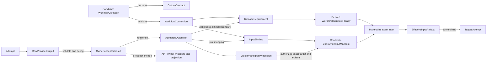

# Workflow Graph

## Objective

Define the executable workflow model as a composition of confirmed structure, owner-accepted
runtime facts, and derived readiness without making a graph edge itself an execution or delivery
authority. Establish the evidence chain by which an accepted upstream output may become an exact
downstream input while preserving producer identity, content integrity, target authorization,
retry, cancellation, and replay.

**Status:** v0.1.0 — inconclusive discovery; two-round review completed with post-ceiling corrections

**Owner:** @VictorBoscaro

**Companion:** [Workflow Graph — Discovery Brief](README.md) — the brief owns the investigation
questions and evidence expectations; this discovery records a partial model, explicit coverage,
and recommendation-blocking gaps rather than claiming the brief is fully answered.

## 1. Business Context

The repository's governing objective is to keep work connected to the objective, decision, and
evidence that license reliance on it, rather than reconstructing those links after execution
([project overview](../../../README.md#what-is-this)). A workflow model therefore fails even when it
schedules correctly if it cannot explain why one output was eligible to release and inform another
piece of work.

**Why now**

The current compatibility compiler launches declared seats but does not compile their declared
connections into readiness or input delivery. At the same time, the runtime can validate a file by
digest as a `binding-output`, while its terminal binding receipt does not name the output bytes or
artifact. That combination permits operational parent relay but does not establish the end-to-end
claim that a particular accepted producer result authorized the exact input consumed by a
downstream Attempt. The existing brief requires this release-authority trace explicitly
([brief §WGQ-4](README.md#wgq-4--which-node-and-edge-kinds-are-required)).

**What's broken (as of 2026-08-04)**

1. `compile_bound_launch_plan` iterates groups and agents, creates every launch at turn ordinal zero,
   and writes `slots: []`; it never consumes the record's `connections`
   ([`dispatch_workflow.py:115`](../../../implementations/server/runtime/dispatch_workflow.py#L115),
   [`test_dispatch_workflow.py:85`](../../../implementations/tests/runtime/test_dispatch_workflow.py#L85)).
   The independent migration inventory consequently rejects describing it as a DAG scheduler
   ([migration findings §Convergent findings](../../features/agents-communication-infra/research/runtime-v2-migration-inventory/findings.md#convergent-findings)).
2. `WorkflowInputManifest` accepts `binding-output` sources only when their path, SHA-256, size,
   producer binding, same-Dispatch identity, and terminal producer state validate
   ([`RuntimeService._validate_workflow_manifest`](../../../implementations/server/runtime/service.py#L5286)).
   This proves the supplied bytes and the existence of a terminal producer binding, but it does not
   prove that those bytes were the producer's accepted output.
3. `complete_host_workflow_turn` persists terminal state and `agent_id`, but its input and terminal
   payload contain no output artifact, output digest, schema, ordering, or publication receipt
   ([`RuntimeService.complete_host_workflow_turn`](../../../implementations/server/runtime/service.py#L5736)).
4. The ACI domain already distinguishes immutable `RawProviderOutput` from accepted contribution
   and from `EffectiveInputArtifact` ([ACI domain §RawProviderOutput](../../features/agents-communication-infra/specs/domain.md#rawprovideroutput)); accepting a terminal turn or matching a digest cannot collapse those boundaries.
5. The Bus discovery proposes `work_result.committed`, `ConsumerInputManifest`, and a handoff keyed
   by result digest and connection version, but remains a discovery whose promotion gates have not
   been discharged ([Bus §Release gates](../../features/agents-communication-infra/discovery/bus-contracts/README.md#release-gates-por-classe-de-consumidor),
   [§Critério para promoção](../../features/agents-communication-infra/discovery/bus-contracts/README.md#critério-para-promoção)). It is design precedent, not current runtime authority.

**What stays the same**

- ACI remains the owner of finalized immutable artifact metadata, Attempt identity, invocation
  sealing, journal acceptance, and exact effective-input evidence
  ([ACI domain §Artifact](../../features/agents-communication-infra/specs/domain.md#artifact),
  [ACI operations §Input and sealing pipeline](../../features/agents-communication-infra/specs/operations.md#input-and-sealing-pipeline)).
- Raw provider output remains evidence rather than an official contribution; the accepted persisted
  contribution remains the result that may count toward quorum
  ([ACI operations §RecordAttemptObservation](../../features/agents-communication-infra/specs/operations.md#internal-transition--recordattemptobservation)).
- Work Bus publication, review, visibility, and delivery semantics remain owned by their promoted
  ACI contracts or, where still draft, by the Bus discovery. This document declares seams and does
  not create a second bus.
- Host workflow binding remains a compatibility adapter. Its current `binding-output` support may be
  preserved during migration, but it is not promoted here into the canonical output-acceptance
  boundary.
- APT remains a projection consumer. Its required `host.AgentActivationBinding` /
  `producer_resolution` contract is specified but not implemented, and it cannot mint missing host
  authority ([APT queries §AgentReferenceLineage](../../features/agent-provenance-telemetry/specs/queries.md#agentreferencelineage)).
- Provider launch, a production scheduler, dispatch-schema migration, and protocol-recipe authorship
  are outside this discovery.

## 2. Core Concepts

The following concepts are provisional modeling vocabulary, not a recommended persistence schema.
Their canonical owner and total lifecycle mapping remain recommendation-blocked by **OQ-WG1**,
**OQ-WG2**, and **OQ-WG4**. A later amendment may replace a candidate with a named projection of an
existing ACI or protocol artifact instead of promoting a new type.

### WorkflowDefinition

`WorkflowDefinition` is a provisional **Value Object** candidate for the immutable confirmed
structure that names nodes, connections, output contracts, release requirements, and input bindings
without containing mutable run state. This discovery does not select it as a new canonical artifact:
its mapping to `ProtocolRecipe`, `DispatchCandidate`, `ConfirmationProjection`, and `DispatchSpec`
is blocked in §9.

Separating definition from runtime state prevents retry, cancellation, or a newly accepted output
from mutating the topology that explains an earlier run. This applies decision **WGD-1**.

### WorkflowNodeDefinition

`WorkflowNodeDefinition` is a **Value Object** describing one logical obligation or deterministic
operation, including its node kind, executor requirement, input contract, output contract, and
completion policy. A node is not universally an agent: one logical node may create several Attempts,
require several participants, or execute without a model.

### WorkflowConnection

`WorkflowConnection` is a versioned **Value Object** connecting source and target node definitions.
It names a `ReleaseRequirement` and an `InputBinding`, but it neither certifies source completion nor
delivers content. This narrow meaning prevents the same edge from becoming topology, runtime fact,
ACL, and transport simultaneously; it applies **WGD-2**.

```text
WorkflowConnection = {
  connection_id,
  connection_version,
  source_node_id,
  target_node_id,
  release_requirement_ref,
  input_binding_ref,
  ordering_key
}
```

### ReleaseRequirement

`ReleaseRequirement` is a **Policy** that declares which owner-accepted fact and cardinality make a
target eligible. It is evaluated against accepted runtime facts at a pinned journal boundary. A
release requirement may refer to success, failure, cancellation, timeout, quorum, or human approval,
but those are distinct typed outcomes rather than strings inferred from agent prose.

### InputBinding

`InputBinding` is a **Mapping** from fields or artifact references in one or more accepted source
results to named slots in a downstream input contract. It defines cardinality, canonical order,
schema, size ceiling, visibility policy, and missing-input behavior. It does not resolve bytes or
authorize access by itself.

### WorkflowRunState

`WorkflowRunState` is a replayable **State Machine** projection of node eligibility, acquisition,
active Attempts, accepted outcomes, and terminal workflow status for one confirmed
`WorkflowDefinition`. It derives readiness from pinned accepted facts and never substitutes its
projection for those facts.

### AcceptedOutputRef

`AcceptedOutputRef` is a workflow-facing **Value Object** that references, without redefining, the
external owner's accepted result and immutable artifacts. It carries the owner namespace and
contract version, logical operation/generation, accepted event or receipt reference, artifact
identities and digests, and accepted journal boundary. It is not a new persisted result authority;
the final external owner and wire name remain open in **OQ-WG1**.

## 3. Semantic and Authority Decomposition

The executable model is a composition of structures rather than one universal graph. Each structure
answers a different question and has a separate canonical owner.

| Dimension | Canonical concern | This discovery's representation | Authority boundary |
|---|---|---|---|
| reusable structure | what may depend on what | `WorkflowDefinition` and node/connection values | confirmed workflow owner |
| execution allocation | which concrete identity may act | ACI `Group`, `Seat`, `Attempt`, invocation plan | ACI runtime/scheduler authority |
| result evidence | what bytes were observed | ACI `RawProviderOutput` and `Artifact` | artifact and adapter observation boundary |
| result acceptance | which logical output is official | external accepted result referenced by `AcceptedOutputRef` | ACI/Work Bus owner selected by **OQ-WG1** |
| readiness | which node is eligible at a boundary | derived `WorkflowRunState` | pure replay projection over owner facts |
| communication permission | who may publish/read which work message | Work Bus capabilities, phase, ACL, visibility | Work Bus owner |
| delivery | what exact accepted result entered which target | owner delivery fact plus finalized effective input | reconciler and ACI Attempt/input acceptance |
| provenance projection | how accepted identities are queried later | APT owner wrappers and pure reducers | host/ACI evidence owners; APT consumes |

This decomposition applies **WGD-1**: multiple graphs or relations may share identifiers, but no
projection may silently promote its own view into another owner's fact. Total mappings and pinned
digests connect the structures; visual or naming similarity does not.

### Digest semantics

A digest proves equality only for bytes under the named canonicalization and algorithm. It does not
prove authorship, logical acceptance, freshness, target authorization, release eligibility, or
consumption. Those claims require independent owner facts and exact joins; this is decision
**WGD-4**.

| Evidence | Proves | Does not prove |
|---|---|---|
| artifact digest | exact immutable bytes | producer or acceptance |
| terminal Attempt fact | observed terminal lifecycle outcome | official output or downstream release |
| publication/acceptance receipt | official logical result under its owner contract | delivery to a target |
| connection version | confirmed dependency semantics | satisfaction at runtime |
| delivery/input receipt | exact target materialization/acceptance | declared use or semantic support |
| APT producer wrapper | producer/Attempt lineage at a boundary | raw output acceptance or access observation |

## 4. Output-to-Release Contract

The release trace is a sequence of independently owned claims. Skipping any link must fail closed.

| Stage | Required evidence | Sole decision owner | Failure disposition |
|---|---|---|---|
| output declared | node output contract and schema/version | confirmed workflow definition | node cannot acquire execution without a closed contract |
| bytes observed | finalized artifact and optional `RawProviderOutput` | ACI artifact/observation boundary | retain failure evidence; no official result |
| output validated | schema, operation, producer, generation, capability, digest | accepted-result owner | reject or retain candidate; no release |
| output accepted | accepted event/receipt plus immutable artifact refs | accepted-result owner | no `AcceptedOutputRef` |
| release satisfied | exact accepted fact matches connection requirement at pinned boundary | workflow reducer applying confirmed policy | target remains not-ready |
| input selected | `InputBinding` maps the complete accepted source set in canonical order | workflow definition plus owner evidence reader | missing/extra/ambiguous input fails |
| visibility authorized | target and artifact access decision | Work Bus/policy owner | do not resolve protected bytes |
| input materialized | complete ordered manifest and digest | input materializer under ACI contract | no target Attempt acceptance |
| consumption accepted | target Attempt atomically binds finalized input | ACI runtime | no launch/effect authority |

The central invariant is **WGD-3**:

```text
ready(target, boundary)
  only if
forall incoming required connection c:
  exists exact ownerAcceptedResult r
  where satisfies(r, c.release_requirement_ref, boundary)
  and totalMap(r, c.input_binding_ref)
```

Neither `terminal(binding)` nor `hash(file) = declared_hash` is sufficient. An error or cancelled
binding cannot satisfy a success-result requirement merely because the current compatibility
validator treats all three terminal states as eligible producer states.

### Materialization and acceptance

The downstream input must be finalized before the target Attempt is accepted. ACI already specifies
the analogous atomic boundary for peer input: official contributions, immutable artifact hashes,
manifest order, policy filtering, `EffectiveInputArtifact`, `MaterializedAgentInvocation`, sealed
request, target Attempt, and delivery fact commit as one unit
([ACI operations §MaterializeAuthorizedPeerInput](../../features/agents-communication-infra/specs/operations.md#materializeauthorizedpeerinput)).

This discovery reuses that property rather than generalizing the current file-path convention. It
applies **WGD-5**: the exact schema and operation may differ, but downstream launch authority must
bind the accepted source set and finalized target input atomically or acknowledge nothing.

## 5. Node and Connection Model

### Node kinds

The illustrative candidate semantic families are organized by execution and completion behavior,
not by agent persona. They are not a closed taxonomy:

| Node kind | Executor | Output/completion shape | Examples |
|---|---|---|---|
| `work` | one or more authorized Attempts | accepted typed result | research, synthesis, implementation |
| `review` | independent reviewer Attempts | accepted verdict set under a review rule | fidelity and architecture review |
| `deterministic` | trusted local operation | verified calculation/artifact receipt | compile, validate, transform |
| `gate` | no ordinary executor | derived decision from pinned facts or human decision | quorum, policy, promotion |
| `human_decision` | authenticated human principal | owner-bound decision fact | blocker choice, approval |
| `integration` | authorized integrator operation | committed aggregate/change result | merge or release composition |
| `terminal_outcome` | none | derived workflow outcome fact | resolved, cancelled, failed, escaped |

These are discovery-level families, not registry values. Their exact enum and extensibility remain
open in **OQ-WG2**. The rule that survives promotion is that every admitted kind must specify
identity, readiness, acquisition, retry, output/completion, failure, and equality—or name a
substitute invariant.

### Connection semantics

Connections are separated by the condition they impose:

| Connection family | Release meaning | Input meaning |
|---|---|---|
| `success_dependency` | one accepted success result satisfies the requirement | maps declared outputs |
| `barrier` | all declared members reach their required accepted outcomes | optional aggregate mapping |
| `quorum` | a confirmed threshold over an accepted member set passes | maps the accepted verdict set |
| `failure_branch` | a typed failed outcome is accepted | maps bounded diagnostic evidence only |
| `cancellation_branch` | cancellation is accepted at the required scope | normally no source output |
| `human_gate` | an owner-bound human decision passes | maps the decision reference, not prose |
| `conditional` | a deterministic predicate over accepted values selects one branch | maps only values licensed by the selected branch |

Ordering is part of the confirmed connection/input-binding contract; directory order, agent return
time, or artifact discovery order is never canonical. A connection change creates a new
`connection_version` and requires confirmation; it does not reinterpret an earlier run.

### Dependency is not permission

A dependency without communication permission may release a target whose input contains only a
decision/result reference. Communication permission without dependency may allow an agent to read a
message without changing readiness. Workflow and Work Bus relations therefore share stable
participant/result identifiers but neither relation implies the other. This applies **WGD-2** and
preserves the boundary requested by [brief §WGQ-5](README.md#wgq-5--what-belongs-to-workflow-versus-communication).

## 6. Runtime State, Retry, and Failure

### Attempt and logical operation identity

A retry creates a new physical `attempt_id` while retaining the logical operation and seat identity,
matching ACI's existing start rule
([ACI operations §Input and sealing pipeline](../../features/agents-communication-infra/specs/operations.md#input-and-sealing-pipeline)).
Only one accepted result may satisfy a single-result logical operation. Losing a response and
replaying the same acceptance key/digest returns the original receipt; changing the digest conflicts.

Decision **WGD-7** fixes release identity as at least:

```text
source logical result/generation
+ accepted result identity/digest
+ connection_id/connection_version
+ target node generation
```

Attempt ID remains lineage evidence, not the sole release key.

### Cancellation and late output

Cancellation revokes acquisition of new Attempts and invalidates pending target generations under
the confirmed policy. A late provider observation remains evidence but cannot reverse a terminal
aggregate transition, consistent with ACI rule `O-OBS-3`. A late candidate may be retained for
audit, but it cannot become the accepted success result of a cancelled operation or release its
former downstream target.

### Error and partial output

Decision **WGD-6** separates outcome facts:

- success requirements accept only official outputs satisfying the complete output contract;
- failure branches consume a typed failure fact and only explicitly authorized diagnostic evidence;
- cancellation branches consume cancellation identity, not incidental output bytes;
- partial output never silently satisfies a complete-output contract;
- a policy that admits partial output must name its schema, standing, target classes, and missingness
  semantics as a distinct accepted result kind.

### Fan-in

A fan-in target evaluates its complete declared predecessor set at one pinned boundary. Missing,
duplicate, future, wrong-generation, wrong-connection-version, schema-invalid, or visibility-denied
members cannot be dropped to make the set pass. The exact failure algebra—fail-fast, wait, degraded
branch, or compensating path—belongs to the confirmed release requirement and remains open in
**OQ-WG3**.

## 7. Existing-System Mapping

| Existing element | Reuse status | Workflow role | Limitation |
|---|---|---|---|
| ACI `Artifact` | already deployed | immutable byte evidence | does not prove acceptance or release |
| ACI `RawProviderOutput` | specified | physical output evidence | distinct from official result |
| ACI contribution acceptance/receipt | specified and partly deployed by message type | accepted logical result precedent | not yet a general workflow-output contract |
| ACI `GroupResult` / `CommitGroupResult` | specified bounded owner seam | one immutable protocol commitment per group version with participants, dissent, payload artifact and commit fact | group-scoped; not a general node-output contract |
| ACI `PublishConnectionHandoff` | specified bounded handoff operation | deduplicated group-result delivery by source aggregate and connection identity | depends on committed groups and declared downstream connection; general workflow mapping remains unresolved |
| ACI `EffectiveInputArtifact` | specified | exact downstream input boundary | general workflow handoff integration remains absent |
| ACI peer-input materialization | implemented bounded precedent | atomic delivery/input/Attempt pattern | group reveal-specific, not a general scheduler |
| host `WorkflowInputManifest` | implemented compatibility primitive | validates current downstream source bytes | path plus terminal producer is not output acceptance |
| `complete_host_workflow_turn` | implemented compatibility primitive | terminal host-binding observation | records no output artifact/receipt |
| `compile_bound_launch_plan` | implemented compatibility compiler | creates bound turn-zero launches | ignores connections and readiness |
| Bus `work_result.committed` | draft design precedent | candidate official release fact | not promoted or implemented as general workflow owner |
| Bus `ConsumerInputManifest` | draft design precedent | candidate delivery/input manifest | promotion probes outstanding |
| APT `producer_resolution` | specified, not implemented | producer lineage query input | projection dependency, not result acceptance |

Decision **WGD-8** classifies `binding-output` as a compatibility seam. It may be migrated by
resolving an accepted artifact into a workflow-only manifest, but a bare path/digest plus terminal
producer check cannot become the canonical success criterion.

### Required migration invariant

Any future adapter from a host binding to the canonical workflow path must prove a total mapping:

```text
terminal host binding
+ accepted output receipt/event
+ immutable artifact refs/digests
+ logical operation/generation
  -> AcceptedOutputRef
```

When any source field is unavailable, the adapter reports `unavailable` or blocks; it does not infer
the missing value from path, timestamp, role, agent label, or equal text.

## 8. Counterexamples and Promotion Evidence

The model is not ready for SPEC promotion until the following cases have contract-level expected
outcomes and executable evidence where the owner implementation exists.

| Counterexample | Required result |
|---|---|
| correct digest, file never accepted as producer output | reject; no release |
| correct bytes attributed to another terminal binding | reject producer mismatch |
| producer `error` or `cancelled` with a success connection | target remains not-ready |
| output accepted after cancellation boundary | retain late evidence; no former-target release |
| retry returns identical accepted receipt | same release/materialization identity |
| same logical key with changed digest | conflict; no second acceptance |
| fan-in omits one required member | wait or take explicit failure branch; never implicit success |
| fan-in includes extra/future/wrong-generation member | fail closed |
| connection version changes after source acceptance | old run uses old version; new confirmation required |
| delivery succeeds but target Attempt acceptance fails | atomic rollback or recoverable unconsumed delivery; never claim consumption |
| target generation replaced before consumption | old delivery cannot launch or satisfy replacement |
| APT wrapper missing while execution evidence is complete | execution may remain valid; lineage query reports unavailable/fails by its contract |

The honest-gate rule is: discovering a missing owner or non-atomic seam during discovery costs a
design amendment; discovering it after scheduler implementation risks false release, duplicated
execution, or irreproducible lineage. Promotion should therefore stop at an explicit open question
rather than fill an authority field heuristically.

## 9. Brief Coverage and Outcome

**Outcome: `inconclusive`.** The output-to-release boundary has an evidence-backed recommended
shape, but this discovery does not recommend a `DispatchSpec` schema or closed workflow taxonomy.
All ten WGQs retain at least one recommendation-blocking requirement, including the canonical
topology owner and total compilation mapping. The model in §§2–8 is therefore a constrained
candidate that later work may reuse, not a promoted executable graph.

Two independent reviewers examined the artifact for two rounds. Their second-round findings were
corrected after the confirmed review ceiling, so no third-round `NO_OBJECTION` was obtained. The
remaining review residue is the absence of that terminal re-review, not a claim that the open
questions below have been settled.

### WGQ dispositions

| WGQ | Disposition | Evidence or blocker |
|---|---|---|
| WGQ-1 | `blocked` | §3 separates candidate responsibilities, but the canonical topology owner and total `DispatchSpec`/`RoutingPlan` compilation mapping remain unresolved; **OQ-WG2** and **OQ-WG6**. |
| WGQ-2 | `blocked` | §5 provides illustrative node families, but their complete per-kind contracts and independently authored workflow witness are absent; **OQ-WG2**. |
| WGQ-3 | `blocked` | The cardinality baseline below separates logical operation, Seat, Attempt, and agent instance, but multi-executor node/group mapping is unresolved; **OQ-WG2**. |
| WGQ-4 | `blocked` | §§4–6 answer output release and propose connection families, but the full closed taxonomy/property matrix is not proven; **OQ-WG2** and **OQ-WG3**. |
| WGQ-5 | `blocked` | §5 separates workflow dependency from Work Bus permission, but the `RoutingPlan`, visibility, default-deny, and delivery boundary lacks a total owner mapping; **OQ-WG4** and **OQ-WG6**. |
| WGQ-6 | `blocked` | ACI `GroupResult` is a bounded precedent, but general membership, quorum, reveal, budget, dissent, and multi-review coordination mapping is incomplete; **OQ-WG7**. |
| WGQ-7 | `blocked` | Attempt terminal, workflow outcome, Run terminal, and audit close are distinguished below, but their total state machine and winning terminal rule are not selected; **OQ-WG8**. |
| WGQ-8 | `blocked` | §6 separates retry from result generation, but rework traversal, loop ceilings, and reconsideration need a confirmed state-machine design; **OQ-WG8**. |
| WGQ-9 | `blocked` | The bidirectional lifecycle mapping below contains unexplained/owner-unresolved paths; **OQ-WG1**, **OQ-WG2**, and **OQ-WG4**. |
| WGQ-10 | `blocked` | Two candidate simplified views are constrained below, but derivable-equality fixtures do not yet exist; **OQ-WG9**. |

No WGQ is `proven-not-applicable`: every question affects at least one proposed concept, decision,
or lifecycle seam.

### Blocker classification

| Blocker | Classification | Reason |
|---|---|---|
| OQ-WG1 — general accepted-output owner | `recommendation-blocking` | Determines authority, identity, acceptance validation, and lifecycle of `AcceptedOutputRef`. |
| OQ-WG2 — closed node/connection taxonomy and protocol mapping | `recommendation-blocking` | Determines semantics, fields, cardinality, equality, and executable topology mapping. |
| OQ-WG3 — fan-in, failure, rework, and completion policy | `recommendation-blocking` | Determines readiness and terminal state-machine behavior. |
| OQ-WG4 — Bus manifest to ACI effective-input boundary | `recommendation-blocking` | Determines delivery authority, target-input validation, and atomic acceptance. |
| OQ-WG5 — legacy migration evidence | `non-blocking` for the conceptual model; `recommendation-blocking` for migration | The new-model boundary can be understood without choosing historical backfill, but no migration schema or rollout may proceed. |
| OQ-WG6 — communication and `RoutingPlan` ownership | `recommendation-blocking` | Determines how dependency, visibility, permission, responsibility, and delivery compose without implicit grants. |
| OQ-WG7 — collective coordination contract | `recommendation-blocking` | Determines membership, quorum, reveal, budget, dissent, and multi-review semantics. |
| OQ-WG8 — completion, rework, and generations | `recommendation-blocking` | Determines winning terminal facts, rework traversal, loop ceilings, and audit closure. |
| OQ-WG9 — simplified projection equivalence | `recommendation-blocking` | Determines whether simplified views preserve authority, blockers, and digest-bound identity. |

### Provisional glossary

The PascalCase entries in §2 form the provisional glossary. `WorkflowDefinition`,
`WorkflowNodeDefinition`, `WorkflowConnection`, `ReleaseRequirement`, `InputBinding`,
`WorkflowRunState`, and `AcceptedOutputRef` are discovery vocabulary only. `Artifact`,
`RawProviderOutput`, `GroupResult`, `AgentInvocationPlan`, `EffectiveInputArtifact`, `Attempt`, and
APT `producer_resolution` retain their external owners and meanings.

### Evidence inventory

| Source | Standing | Contribution | Limitation |
|---|---|---|---|
| [Workflow Graph brief](README.md) | draft investigation authority for this folder | WGQ coverage, evidence bar, 24 counterexamples, outcome rule | supplies obligations, not answers |
| [Runtime v2 findings](../../features/agents-communication-infra/research/runtime-v2-migration-inventory/findings.md) | accepted research finding | current compiler is not a DAG scheduler; reusable runtime substrate exists | inventory does not select successor architecture |
| [ACI Domain](../../features/agents-communication-infra/specs/domain.md) | feature domain contract | artifacts, raw output, `GroupResult`, Attempts, plans and effective input | some successor slices remain specified, not implemented |
| [ACI Operations](../../features/agents-communication-infra/specs/operations.md) | operation contract | acceptance, retry, atomic input, `CommitGroupResult`, `PublishConnectionHandoff` | bounded group/peer contracts are not a general scheduler |
| [Bus Contracts](../../features/agents-communication-infra/discovery/bus-contracts/README.md) | draft discovery | release gates, `work_result.committed`, `ConsumerInputManifest`, handoff candidate | promotion probes are outstanding |
| [APT Queries](../../features/agent-provenance-telemetry/specs/queries.md) | specified query contract | producer resolution and upstream-digest scope | current pilot does not implement the required owner wrapper |
| [`dispatch_workflow.py`](../../../implementations/server/runtime/dispatch_workflow.py) and tests | implemented compatibility code | bound turn-zero launch generation | does not consume connections; slots are empty |
| [`service.py`](../../../implementations/server/runtime/service.py) and binding tests | implemented compatibility code | digest/size/source validation and terminal producer check | terminal receipt does not bind accepted output bytes |

### Alternatives considered

| Candidate | Authority separation | Replay | Existing reuse | Main failure | Disposition |
|---|---|---|---|---|---|
| one universal mutable graph | poor; topology, ACL, state, and delivery converge | historical meaning can drift | low | duplicate/conflicting owners | rejected |
| connection edge as delivery authority | poor; structural edge grants runtime effect | edge cannot prove accepted bytes | low | terminal/digest false release | rejected |
| preserve parent relay as canonical | none beyond operator convention | incomplete and non-portable | high short-term | no authoritative producer-output join | compatibility only |
| compile structure + owner facts + derived state | strong if total mappings close | deterministic at pinned boundary | reuses ACI/Bus/APT seams | mappings and owner still blocked | recommended conceptual direction; no schema recommendation |
| make Work Bus own workflow topology | mixes dependency with communication permission | possible but authority inflated | reuses Bus concepts | permission and readiness collapse | rejected |
| make APT infer execution/release from lineage | projection becomes command authority | query boundary contaminated | reuses lineage wrappers | APT cannot mint host/ACI authority | rejected |

### Identity and cardinality baseline

| Relation | Cardinality | Standing |
|---|---|---|
| `WorkflowNodeDefinition` → logical operation generation | `1:N` across run/rework generations | candidate; generation model blocked by WGQ-8 |
| logical operation generation → physical `Attempt` | `1:N` under retry | supported by ACI retry rule |
| `Attempt` → provider/runtime agent instance | `1:1` | existing ACI Attempt invariant; deterministic operations require a separate executor contract and may have `WorkflowNodeDefinition` → `Attempt` cardinality `0:N` |
| `Group` → `Seat` | `1:N` under confirmed group version | existing ACI concept |
| `Seat` → `Attempt` | `1:N` under retry/replacement | existing ACI identity precedent |
| workflow node → `Group`/`Seat` | `0..N` | recommendation-blocking for multi-executor and collective nodes |
| `agent_name` → identity | no authority cardinality | label only; cannot substitute for Seat, Attempt, or instance ID |

### Lifecycle authority and bidirectional mapping

| Stage/path | Source disposition | Destination provenance and owner | Status |
|---|---|---|---|
| `ProtocolRecipe.nodes/edges` → `DispatchCandidate` | copied/transformed only under promoted compiler rules | candidate bytes/digest owned by protocol compilation; no execution grant | existing bounded precedent |
| `DispatchCandidate` → `ConfirmationProjection` | candidate evidence, never authority by digest alone | user-visible projection must retain source lineage | successor mapping blocked |
| confirmation input/projection → `DispatchSpec` | resolve capabilities and confirm exact authoritative values; forbidden implicit grants | `DispatchSpec` owner must name every source/policy/user contribution | recommendation-blocking WGQ-9 |
| `DispatchSpec` topology → `WorkflowDefinition` candidate | must be copied or rejected by total path mapping | canonical owner unresolved; no second topology authority allowed | recommendation-blocking OQ-WG2 |
| `DispatchSpec`/workflow node → `Run`, `Group`, `Seat`, `AgentInvocationPlan` | runtime-derived identities under confirmed authority | ACI runtime owns mutable facts and invocation decisions | partial existing precedent |
| accepted Attempt/message/group result → `AcceptedOutputRef` | retain owner identity, receipt/event, generation, artifacts and boundary | accepted-result owner unresolved for general workflow output | recommendation-blocking OQ-WG1 |
| accepted result + connection → release projection | pure evaluation at pinned boundary | workflow reducer owns derived readiness only | conceptual answer; state-machine details blocked |
| accepted result + visibility → consumer manifest | total ordered mapping, no implicit ACL | Work Bus/policy candidate owns delivery evidence | recommendation-blocking OQ-WG4 |
| consumer manifest → `EffectiveInputArtifact`/target Attempt | transformed under exact plan/schema/policy and atomically accepted | ACI owns finalized input and Attempt acceptance | bounded peer-input precedent exists |
| Run terminal → audit close | terminal result retained; audit status derived separately | runtime owns Run terminal; audit owner owns verified closure | total mapping blocked WGQ-7 |

Every destination not listed is rejected rather than implicitly copied. This table is not yet total:
the rows marked recommendation-blocking forbid schema promotion.

### Schema-decision-to-WGQ/evidence matrix

| Decision | WGQs | Evidence | Remaining blocker |
|---|---|---|---|
| WGD-1 | 1, 5, 9, 10 | §3 authority decomposition; ACI/Bus/APT owner boundaries | total lifecycle mapping and projection fixtures |
| WGD-2 | 4, 5, 9 | brief release trace; Bus dependency/permission distinction | closed connection schema |
| WGD-3 | 4, 6, 7 | ACI accepted contribution and `GroupResult`; Bus release-gate precedent | general accepted-output owner |
| WGD-4 | 3, 4, 5 | ACI Artifact/raw-output/receipt distinctions; runtime code | none for semantic rule; field mapping still blocked |
| WGD-5 | 4, 7, 9 | ACI peer-input atomic acceptance precedent | Bus-to-ACI general interface |
| WGD-6 | 2, 4, 7, 8 | ACI observation/cancellation rules; brief counterexamples | complete outcome state machine |
| WGD-7 | 3, 4, 7, 8 | ACI retry identity and idempotency rules; Bus generations | rework/generation schema |
| WGD-8 | 4, 5, 9 | current compiler/service/tests and migration inventory | legacy migration variant |

### Candidate-by-counterexample matrix

| # | Candidate-model verdict | Evidence or blocker |
|---:|---|---|
| 1 | representable | one `work` node, accepted result, derived terminal outcome; closed taxonomy still blocked |
| 2 | representable but blocked | two review nodes plus barrier and synthesis; independence/quorum contract remains WGQ-6 |
| 3 | representable | sequential connections from one executor's distinct logical operations |
| 4 | answered | one logical operation to many Attempts under retry; WGD-7 |
| 5 | representable but blocked | `deterministic` candidate exists; executor/capability contract incomplete |
| 6 | representable | `human_gate` requires owner-bound human fact, never agent prose |
| 7 | answered | workflow dependency can exist without communication permission; WGD-2 |
| 8 | answered | Work Bus permission can exist without a dependency edge; WGD-2 |
| 9 | bounded precedent only | ACI `GroupResult`, reveal and dissent cover a fixed group; general quorum mapping blocked |
| 10 | blocked | new generation is distinct from retry, but rework traversal/ceiling state machine is open |
| 11 | representable but blocked | typed unresolved/awaiting-human outcome candidate; winning Run terminal mapping open |
| 12 | blocked | Run terminal and audit close are distinct, but total closure mapping is absent |
| 13 | representable | cancellation prevents new acquisition; exact workflow reducer transition remains open |
| 14 | representable but blocked | conditional edge selects one branch; complete skipped-node state vocabulary open |
| 15 | answered conceptually | fan-in cannot drop missing/failed members; policy selection blocked by OQ-WG3 |
| 16 | blocked | node-to-many-executor/group cardinality is unresolved in WGQ-3/WGQ-6 |
| 17 | blocked | reusable subworkflow invocation identity and namespace mapping are not defined |
| 18 | representable but blocked | timeout is a typed outcome; deadline/ceiling ownership mapping remains WGQ-7 |
| 19 | representable | escalation consumes an owner-bound human decision; agent gains no human authority |
| 20 | answered conceptually | policy version is frozen per run; changed policy requires new confirmation |
| 21 | answered conceptually | connection/topology version is frozen; change requires new confirmation |
| 22 | answered | missing/schema-invalid output creates no accepted result and no success release; WGD-3/WGD-6 |
| 23 | answered | late output remains evidence and cannot regain cancelled release authority; §6 |
| 24 | blocked | distinct review obligations are representable, but anti-correlation/collective semantics remain WGQ-6 |

### Simplified projections

Two views may project the same eventual authority only when every visible aggregate retains stable
source IDs and every hidden element remains retrievable:

- an operator view may show all system operations, gates, deliveries, and terminal facts;
- an agent-centric view may show work/review nodes while marking hidden system operations and gates
  as summarized counts with links to their exact IDs.

Neither view may compute readiness, rewrite edges, omit a blocking gate without an explicit marker,
or become confirmation input after simplification. Because no derivable-equality fixture currently
proves both views reduce to the same authority, WGQ-10 remains recommendation-blocking.

## Open Questions

### OQ-WG1

**Question:** Which promoted owner and exact event/receipt provide the general accepted workflow
output referenced by `AcceptedOutputRef`?

**Recommendation:** Reuse ACI artifact and contribution-acceptance primitives and evaluate the Bus
discovery's `work_result.committed` as the workflow-level aggregate candidate. Treat ACI
`GroupResult`, `CommitGroupResult`, and `PublishConnectionHandoff` as the closest existing bounded
owner seam: preserve their one-result-per-group, dissent, provenance, and content-addressed handoff
properties, but do not generalize their group scope silently. Do not ratify a new name or owner until
the Bus promotion gates and cross-document ownership review pass.

**Settlement stage:** architecture decision before SPEC authoring.

### OQ-WG2

**Question:** What is the smallest closed node/connection taxonomy, and how does it map to the
promoted protocol recipe and future `DispatchSpec` without changing protocol-compilation v1?

**Recommendation:** Exercise the discovery families against the brief's complete counterexample set
and one independently authored real workflow before selecting enum values.

**Settlement stage:** discovery amendment before schema proposal.

### OQ-WG3

**Question:** Which fan-in failure policies are admitted, and which facts release degraded,
compensating, or terminal branches?

**Recommendation:** Admit only explicitly confirmed policies with total outcomes for missing,
failed, cancelled, timed-out, and late members; keep fail-fast versus wait configurable only through
a versioned policy reference.

**Settlement stage:** workflow state-machine design before TEST-SPEC generation.

### OQ-WG4

**Question:** Does the target input contract reuse the Bus discovery's `ConsumerInputManifest`
directly or map it into an ACI-owned effective-input preparation command?

**Recommendation:** Preserve `ConsumerInputManifest` as Work Bus delivery evidence and map it
totally into ACI `EffectiveInputArtifact`; avoid one object jointly owning delivery policy and
Attempt acceptance.

**Settlement stage:** Bus/ACI interface review before implementation layering.

### OQ-WG5

**Question:** What compatibility evidence is required to migrate current `binding-output` sources
without treating historical parent relay as accepted Work Bus delivery?

**Recommendation:** Require an explicit legacy variant with honest missingness and no backfilled
acceptance claim; only new outputs accepted through the promoted boundary receive canonical release
standing.

**Settlement stage:** migration ADR after the canonical owner contract is selected.

### OQ-WG6

**Question:** What is the canonical relationship between workflow/`DispatchSpec`, `RoutingPlan`,
and the Work Bus projection for visibility, schema, reveal phase, responsibility, and delivery?

**Recommendation:** Model dependency/release, visibility/permission, responsibility, and delivery as
separately owned relations composed into a compiled projection. Require a total source-to-destination
mapping and default deny; no dependency edge may imply communication permission.

**Settlement stage:** cross-owner workflow/Bus architecture review before SPEC authoring.

### OQ-WG7

**Question:** How do group membership, quorum, reveal, budget, dissent, and multi-review
coordination map from workflow nodes to ACI `Group`, `Seat`, and `GroupResult`?

**Recommendation:** Reuse the bounded ACI `GroupResult` precedent and require an explicit,
versioned group policy for every collective node; do not infer collective semantics from node count.

**Settlement stage:** collective-coordination design before taxonomy or state-machine promotion.

### OQ-WG8

**Question:** Which facts end an Attempt, select a workflow outcome, terminate a Run, close an audit,
or start a rework generation, and what loop ceilings apply?

**Recommendation:** Keep the workflow definition acyclic and model rework as a versioned run-state
generation. Retries remain Attempts of the same logical operation; rework creates a new generation.
Require a total mapping for winning terminal selection and audit closure.

**Settlement stage:** workflow state-machine design before TEST-SPEC generation.

### OQ-WG9

**Question:** Which simplified workflow projections are permitted, and what proves that they preserve
the authority and blockers of the full graph?

**Recommendation:** Build paired fixtures for the full and agent-centric views and require equality of
authority IDs, accepted result digests, and release decisions; hidden blockers must remain explicit.

**Settlement stage:** UI/projection contract before discovery promotion.

## Decisions Baked In

| ID | Decision | Where |
|---|---|---|
| WGD-1 | Executable workflow is a composition of immutable definition, owner facts, and derived state—not one universal authority graph. | §3 |
| WGD-2 | `WorkflowConnection` names release and input mappings but does not itself accept output, authorize communication, or deliver content. | §2, §5 |
| WGD-3 | Downstream readiness requires an exact owner-accepted result satisfying the confirmed release requirement; terminal state or digest alone is insufficient. | §4 |
| WGD-4 | Digest equality proves bytes only; producer, acceptance, target, release, and consumption require separate evidence. | §3 |
| WGD-5 | Finalized downstream input and target Attempt acceptance must share an atomic or fail-closed boundary. | §4 |
| WGD-6 | Success, failure, cancellation, timeout, and partial output are distinct typed outcomes; none silently substitutes for another. | §6 |
| WGD-7 | Retry/release identity binds logical result generation, accepted digest, connection version, and target generation; Attempt ID alone is insufficient. | §6 |
| WGD-8 | Current `binding-output` is a compatibility seam, not the canonical output-acceptance contract. | §7 |

## Connections

| Document | Type | Description |
|---|---|---|
| [Discovery intention](discovery-intention.md) | `framed-by` | Owner-confirmed purpose and boundaries; not evidence. |
| [Workflow Graph — Discovery Brief](README.md) | `answers` | Supplies investigation questions, counterexamples, and evidence expectations. |
| [Bus Contracts](../../features/agents-communication-infra/discovery/bus-contracts/README.md) | `composes-with` | Owns the draft Work Bus, release-gate, handoff, and consumer-manifest precedent. |
| [ACI Domain](../../features/agents-communication-infra/specs/domain.md) | `bounded-by` | Owns artifacts, Attempts, raw output, invocation plans, and effective inputs. |
| [ACI Operations](../../features/agents-communication-infra/specs/operations.md) | `reuses-invariants-from` | Supplies accepted-result, retry, observation, and atomic input-materialization precedents. |
| [APT Queries](../../features/agent-provenance-telemetry/specs/queries.md) | `boundary-with` | Consumes producer-resolution authority for lineage without owning output acceptance. |
| [Runtime v2 Migration Inventory](../../features/agents-communication-infra/research/runtime-v2-migration-inventory/findings.md) | `builds-from` | Establishes current compiler/runtime reuse and no-scheduler boundaries. |

Pending inverse-edge updates, outside this writer's authorized target:
`docs/discovery/workflow-graph/README.md`,
`docs/features/agents-communication-infra/discovery/bus-contracts/README.md`,
`docs/features/agents-communication-infra/specs/domain.md`,
`docs/features/agents-communication-infra/specs/operations.md`,
`docs/features/agent-provenance-telemetry/specs/queries.md`, and
`docs/features/agents-communication-infra/research/runtime-v2-migration-inventory/findings.md`.

## Flow Diagram



The definition states what evidence is required, while external owners accept the output and the
workflow reducer derives readiness. Input selection and an explicit visibility/policy decision feed
the candidate Bus `ConsumerInputManifest` before materialization, and ACI binds the finalized
effective input to the target Attempt. APT projects lineage from accepted owner evidence without
becoming part of the release authority.

## Appendix — Changelog

| Version | Date | Changes |
|---|---|---|
| 0.1.0 | 2026-08-04 | Initial evidence-backed workflow model; two-round independent review added an explicit inconclusive outcome, WGQ/blocker coverage, lifecycle and decision matrices, all 24 counterexamples, bounded GroupResult/handoff precedent, visibility flow, corrected Attempt cardinality, and explicit owner questions. Round-two corrections were applied after the review ceiling without a third terminal review. |
