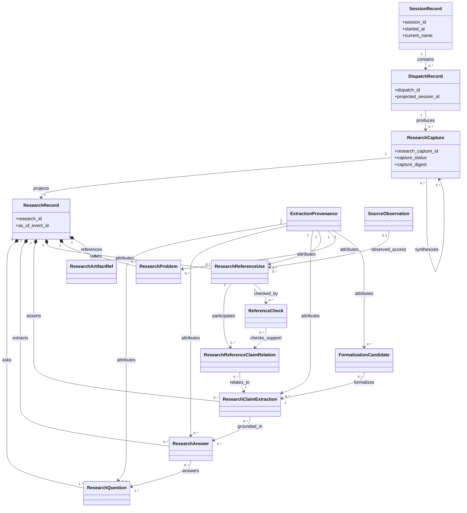
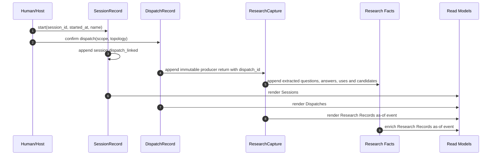

# Session, Dispatch and Research Records

## Objective

Define three linked provenance levels—Session, Dispatch and Research—that
enrich the current dispatch ledger without replacing it or introducing the full communication
runtime. An immutable `ResearchCapture` preserves the returned witness, append-only research facts
enrich it, and `ResearchRecord` projects questions, answers, references, problems, claims and
candidate mathematical or logical notation; the upper levels identify and summarize that work.

**Status:** `v0.1.0`, focused companion to the feature's
[active discovery](../discovery.md), derived from the current ledger, research corpus, assertion
capture discovery and the human decision recorded on 2026-07-23.  
**Owner:** @victor  
**Companion:** the [coarse session registry](../session-registry.md) owns start-time session facts;
the [active feature discovery](../discovery.md) owns conversation, topic and source-observation
telemetry; and [Agent assertion capture](../../../discovery/agent-assertion-capture/README.md) owns
the possible future assertion-level source stream. This document owns only the Session–Dispatch–
Research seam and treats assertion capture as a finer-grained extension.

## 1. Business Context

This work serves the repository's goal of making agent work observable and auditable without
confusing operational counts with structured knowledge, as described in the
[project README](../../../../README.md).

### Why now

The repository can reconstruct which dispatch was proposed, which agents and prompts were selected,
and whether the dispatch closed, but it cannot reconstruct the questions actually answered, the
final responses returned, which references were genuinely consulted, or which formal expression an
agent proposed for an idea. Building the larger bus/runtime before representing these already
available facts would increase mechanism without increasing the information retained from current
research work.

### What's broken (as of 2026-07-23)

1. `telemetry/agents/subagents-dispatch.yaml:1-4` defines one dispatch row plus one close row, with
   JSON columns for groups, connections, spawned-agent counts and feedback prompts, but no session
   identity or research-result relationship.
2. `.claude/skills/register-dispatch/append-dispatch.cjs:114-138` uses closed key sets for dispatch,
   close and agent records. It accepts `initial_prompt` but no final response, observed reference,
   research question, problem or result reference.
3. `.claude/skills/register-dispatch/append-dispatch.cjs:257-269` requires close rows to retain only
   termination and aggregate execution facts; the semantic outcome is not part of the close
   contract.
4. `implementations/server/ledger.py:163-214` joins dispatch and close rows and derives lifecycle
   state, but has no third join surface for research records.
5. `sessions/2026-07-22-1752-bus-contracts-discovery.md:11` shows that current session nodes are
   durable retrospective documents with a date, while `.claude/skills/close-session/SKILL.md:10-12`
   creates them conditionally at close. There is no minimal start-time identity containing an ID,
   timestamp and name.
6. `research/agent-events-infra-hypothesis/research.md:12-109` demonstrates that research prose can
   preserve a question and a rich discussion, but its rounds, answers, references and formal ideas
   are not independently addressable records.
7. `docs/discovery/agent-assertion-capture/README.md:209-216` requires writer-stamped session,
   agent and dispatch lineage, while its own open gap at `:326-328` says the resolution path for
   `session_id` and `dispatch_id` is undefined.
8. `../domainspec/internal_tools/agents-telemetry/scripts/schema.sql:6-30` is useful local prior art
   for event, session and agent correlation, but it captures invocation telemetry rather than the
   structured epistemic result of research.
9. `docs/features/agent-provenance-telemetry/research/current-state-inventory.md:50-75` confirms
   that the strict ledger has no result/reference/problem manifest and that persona names cannot
   serve as execution identity.
10. `docs/features/agent-provenance-telemetry/probes/reference-probe-tool.md:121-140` already
    distinguishes source class, content digest, access state and navigation anchor. A research
    model that invents a second incompatible reference vocabulary would create immediate drift.

### What stays the same

- `subagents-dispatch.yaml` remains the append-only lifecycle ledger owned by
  `register-dispatch`; this discovery does not replace or silently rewrite historical rows.
- The current dispatch row continues to own confirmed intent, topology, prompts, roles, models and
  budgets. A research record does not redefine its assignment.
- The close row continues to own dispatch termination, spawned-agent counts, loops and feedback
  prompts. It may later point to results, but it does not embed full answers.
- Research prose and `findings.md` remain useful human-readable artifacts. Structured records
  identify their content; they do not require immediate migration of the historical corpus.
- The start-time session contract remains the one in
  [coarse session registry](../session-registry.md); this discovery consumes its `session_id`,
  `started_at` and current name rather than defining a second registry.
- Host-observed source access remains owned by the active discovery and
  [reference-probe contract](../probes/reference-probe-tool.md). Research adds attributed citation
  and epistemic evaluation; it does not relabel `opened` as proof that a source was read or supports
  a claim.
- The event journal, Work Bus, receipt gate, artifact service, assertion emitter and knowledge
  promotion lifecycle remain outside this incremental cut. Their ownership stays with the
  [Agents Communication Infra discovery](../../agents-communication-infra/discovery/feature-discovery/agents-communication-infra.md)
  and [assertion capture companion](../../../discovery/agent-assertion-capture/README.md) (APT-D8).
- This discovery does not choose SQLite, JSONL or a broker. It defines information ownership before
  a persistence implementation.

## 2. Core Concepts

| Concept | Meta-type | What it does | Why this boundary |
|---|---|---|---|
| `SessionRecord` | externally owned Entity | Consumed projection of the start/name/link facts defined by the session registry. | Gives dispatches a stable parent without redefining session authority here. |
| `DispatchRecord` | Entity | Keeps the existing dispatch lifecycle and assigned reference/problem/question scope. | Preserves the current operational heart instead of inventing a parallel dispatch model. |
| `ResearchCapture` | Event / Information Object | Seals one expected contribution outcome, producer lineage, raw return or missing/partial evidence, origins and digest. | Makes the source witness immutable and idempotent before any later extraction or review. |
| `ResearchRecord` | Query / Information Object | Rebuilds the current research aggregate from one capture and append-only child facts. | Allows later enrichment without mutating the capture or creating another source of truth. |
| `FactEnvelope` | Value Object | Supplies immutable fact/version identity, stable subject, operation idempotency, occurrence time and explicit predecessor. | Gives every append and revision the same retry and compare-and-swap semantics. |
| `ExtractionProvenance` | Value Object | Attributes an extracted child to actor/method/version and a digest-bound raw selector. | Prevents inferred or normalized structure from masquerading as verbatim agent authorship. |
| `ResearchQuestion` | Value Object | Preserves the exact question, its stable local ID and optional parent question. | Prevents a prompt, a research question and a later reformulation from being treated as the same text. |
| `ResearchAnswer` | Value Object | Extracts a question-addressing answer from the exact raw return and points back to its span/reference. | Preserves queryable Q→A structure without creating a second copy of the witness. |
| `SourceObservation` | externally owned Event | Records tool/runtime-observed acquisition and access at the mediated boundary. | Reuses the active feature contract; an agent cannot self-stamp trusted access. |
| `ResearchReferenceUse` | Entity | Attributes one mention, citation or claimed consultation and its anchoring within one research. | Separates content-derived use from host-observed source access. |
| `ResearchReferenceClaimRelation` | Entity | Records one typed relation between an exact reference use and one research claim extraction. | Allows the same use to support one claim and contradict another without mutation or duplication. |
| `ReferenceCheck` | Entity | Records a distinct check of source identity, access evidence or claim support. | Avoids collapsing “the source exists” and “the source supports this claim” into one `verified` boolean. |
| `ResearchProblem` | Entity | Records a gap, contradiction, blocker, uncertainty or failed check surfaced by the research. | Problems need identity and disposition so dispatch summaries can point to them without copying prose. |
| `ResearchClaimExtraction` | Entity | Extracts one addressable proposition from a raw return with support, attributed confidence and relations. | Reserves global claim authority for future assertion capture. |
| `FormalizationCandidate` | Entity | Associates notation, legend, reading, assumptions and scope with exactly one claim. | Mathematical symbols remain reviewable candidates rather than decorative or automatically canonical truth. |
| `ProbeRecommendationRef` | Value Object | Pins one delivered recommendation, bundle/profile digest and its source-observation references. | Completes probe-to-research lineage without conflating recommendation with source access. |
| `ResearchArtifactRef` | Value Object | Points to raw returns, reports, code, datasets or other immutable output with digest and media/schema type. | Keeps large bodies out of the dispatch ledger while retaining integrity and provenance. |

The three primary levels form a strict containment spine (APT-D1):

```text
SessionRecord 1 ── 0..N DispatchRecord 1 ── 0..N ResearchCapture
                                               1 ── 1 ResearchRecord projection
```

A session may exist before it has a dispatch. A dispatch may legitimately expect no research.
Every `ResearchCapture` belongs to exactly one dispatch; session membership is joined through the
authoritative `session.dispatch_linked` fact rather than copied into the dispatch or capture.



Composition marks child facts assembled by the `ResearchRecord` projection, not bytes inside the
sealed `ResearchCapture`. Every child is append-only and carries extraction/actor provenance.
Cross-record checks and synthesis links remain separately attributable relations; nullable
source-observation links are explicitly represented as absent rather than inferred.

## 3. Identity, Authority and Projection Boundaries

### 3.1 Session identity (APT-D2)

The minimum start-time projection is intentionally small and is owned by
[session-registry.md](../session-registry.md):

```yaml
session_id: "session:<opaque-id>"
started_at: "2026-07-23T10:15:30.000-03:00"
current_name: "incremental-provenance-discovery"
```

`session_id` is identity, `started_at` is an immutable instant with offset, and `current_name` is a
projection of the start/name-change facts. Renaming a session does not change its ID. Retrospective
session documents may later reference the ID and add summary, decisions and close metadata, but
they are not the mechanism that creates the identity.

### 3.2 Dispatch ownership

The existing dispatch's current `goal`, `context` and initial prompts own confirmed assignment intent
(APT-D3). Proposed structured `input_reference_scope`, `problem_statements` and
`research_questions` become Dispatch-owned only after TODO-APT3 passes the strict appender and
reader round-trip; the first cut must not pretend those fields already exist.

`session.dispatch_linked` is the sole authority for Session→Dispatch. `ResearchCapture.dispatch_id`
is the sole authority for Dispatch→Research. A displayed `session_id`, `research_refs` or summary on
a dispatch is a rebuildable projection, never another ledger write (APT-D5).

A researcher can refine declared scope into `ResearchQuestion` and `ResearchProblem` facts linked
with `derives_from`; it must not overwrite the original assignment text.

### 3.3 Research ownership

`ResearchCapture` owns the exact returned witness and immutable capture lineage. Append-only child
facts own extracted structure; `ResearchRecord` is their as-of projection (APT-D4, APT-D9):

- exact questions investigated;
- exact final response or an immutable artifact reference plus digest;
- structured answers linked to questions;
- attributed reference uses/checks linked to host-owned source observations;
- problems, claims and counterclaims surfaced;
- candidate mathematical/logical formalizations;
- output artifacts and provenance.

The human-readable research document can be rendered from, or point to, this structure. A
`findings.md` synthesis remains a separate artifact and pins each input by
`research_capture_id + capture_digest`.

The raw answer and the structured children are not interchangeable. `raw_return` is the sole exact,
attributed witness, represented by the exclusive union `inline | artifact_ref` plus digest.
`ResearchAnswer` records an extraction that answers one or more questions and points back to a
span/reference in that witness; it never repeats the whole response. The raw answer is the attributed
witness of what returned; questions, claims, problems and formalizations are extractions with their
own `asserted_by` or `extracted_by` provenance. A correction appends a replacement/supersession
record and never silently rewrites the captured return.

### 3.4 Authority matrix

| Fact | Authoritative owner | Upper-level projection |
|---|---|---|
| Session ID and start/name history | `session.started` / `session.name_changed` owned by session registry | session list/detail |
| Dispatch intent, topology, initial prompts and requested corpus | `DispatchRecord` | session dispatch summary |
| Dispatch close reason and execution counts | dispatch close row | session status summary |
| Session→Dispatch relation | `session.dispatch_linked` | `DispatchRecord.session_id` display field |
| Dispatch→Research relation and exact final return | `ResearchCapture` | dispatch research list/count |
| Extracted research question/answer | append-only child fact + `ExtractionProvenance` | `ResearchRecord` |
| Source acquisition/access | host-owned `SourceObservation` | research/dispatch access summary |
| Mention, citation or claimed consultation | `ResearchReferenceUse` | dispatch reference summary |
| Source identity/access/support verification | `ReferenceCheck` | verified-check summary |
| Problem statement and disposition | `ResearchProblem` | dispatch open-problem count |
| Claim extraction and candidate notation | `ResearchClaimExtraction` / `FormalizationCandidate` | dispatch/research badges and counts |
| Promoted knowledge or accepted mathematical vocabulary | future governed store | never inferred from telemetry alone |

## 4. Research Capture and Fact Contracts

### 4.1 Immutable ResearchCapture

The host mints opaque IDs inside versioned namespaces. `expected_contribution_id` identifies the
logical seat/generation outcome; `capture_operation_id` makes its capture idempotent. The unique key
is `(dispatch_id, expected_contribution_id, capture_operation_id)`. The first capture for an
expectation is accepted once. Any later operation for that expectation must name its current
predecessor in `supersedes_capture_id` or conflict.

```yaml
schema_ref: "apt.research-capture@1"
research_capture_id: "research-capture:<opaque-id>"
expected_contribution_id: "expected:<dispatch>:<seat>:<generation>"
capture_operation_id: "operation:<opaque-id>"
dispatch_id: "2026-07-23-example"
origin_refs:
  - "probe:probe-01"
  - "probe-bundle:sha256:..."
producer_ref:
  kind: "seat | host_actor"
  group_id: "researchers"
  seat_id: "seat:01"
  attempt_id: "attempt:01"
  activation_id: "activation:01"
capture_status: "captured"
raw_return:
  storage: "artifact_ref"
  artifact_ref: "artifact:..."
  media_type: "text/markdown"
  digest: "sha256:..."
failure_reason: null
supersedes_capture_id: null
synthesizes:
  - research_capture_id: "research-capture:source-01"
    capture_digest: "sha256:..."
captured_at: "2026-07-23T10:28:00.000-03:00"
capture_digest: "sha256:..."
```

`raw_return` is an exclusive `inline | artifact_ref` union and is required for `captured` or
`partial`. `missing` forbids a raw return and requires an expectation, failure reason and timestamps.
The immutable capture status is `captured | partial | missing`; a newer capture points backward with
`supersedes_capture_id`, while `superseded` is derived for the older projection. Capture state never
changes Dispatch lifecycle (APT-D11).

Supersession is a compare-and-swap transition: predecessor and successor have the same
`(dispatch_id, expected_contribution_id)`, the predecessor must be current, each capture has at most
one successor, and cycles are invalid. Rework that is not a correction mints a new contribution
generation instead of silently replacing the old one.

A synthesis pins `research_capture_id + capture_digest` for every input. The first cut permits only
same-dispatch, current inputs at append time; wider synthesis requires a later authorization/manifest
decision. Later supersession never removes a pinned input or changes historical synthesis. The
projection only marks that input `input_now_superseded`.

### 4.2 Append-only child facts and ExtractionProvenance

Questions, structured answers, reference uses, problems, claim extractions and formalizations are
append-only facts outside `capture_digest`. Each carries a common immutable envelope:

```yaml
fact:
  fact_id: "fact:<opaque-id>"
  subject_id: "research-question:<stable-id>"
  operation_id: "operation:<opaque-id>"
  occurred_at: "..."
  supersedes_fact_id: null
extraction:
  mode: "verbatim | declared | inferred"
  actor_ref: "agent:... | host-parser:... | reviewer:..."
  method_ref: "extractor-name@version"
  extracted_at: "..."
  source_capture_id: "research-capture:..."
  source_capture_digest: "sha256:..."
  selector:
    schema_ref: "apt.raw-selector@1"
    unit: "utf8-byte"
    start_inclusive: 0
    end_exclusive: 58
    selected_text_digest: "sha256:..."
```

`fact_id` identifies an immutable version; `subject_id` identifies the stable subject. A revision
must point to the current `fact_id` with compare-and-swap semantics. For disposition-bearing
subjects, the preferred shape is a typed `*.disposition_recorded` fact keyed by `subject_id`;
created/extracted facts remain unchanged. Reverse links are always derived from edge facts.

Selectors address exact stored bytes: UTF-8, no newline or Unicode normalization, half-open
offsets, and the capture/raw digest both verified before selection. Confidence is omitted unless its
actor and method are recorded.

The assignment prompt is not automatically the research question. A `ResearchQuestion` says whether
its text is verbatim, declared or inferred; `derives_from` may point to dispatch scope or another
question. A `ResearchAnswer` links one or more questions to a digest-bound raw selector and never
copies the complete return.

### 4.3 Reference uses and checks

Reference lineage is an explicit typed chain:

`SourceObservation <- ProbeRecommendationRef? <- ResearchReferenceUse -> ResearchClaimExtraction?`

The probe link is optional because a producer may use a source without a probe. The observation
link is nullable and is never inferred from a matching locator (APT-D6, APT-D10):

```yaml
reference_use_id: "reference-use:<opaque-id>"
fact:
  fact_id: "fact:<opaque-id>"
  subject_id: "reference-use:<opaque-id>"
  operation_id: "operation:<opaque-id>"
  occurred_at: "..."
  supersedes_fact_id: null
reference_id: "ref:<opaque-id>"
kind: "file | url | paper | commit | dataset | command-output"
locator_observed: "docs/example.md#section"
source_observation_ref: "source-observation:..." # nullable; never inferred
probe_recommendation_ref:                  # nullable
  probe_id: "probe:..."
  recommendation_id: "recommendation:..."
  bundle_digest: "sha256:..."
  protocol_profile_digest: "sha256:..."
use_kind: "mentioned | cited | claimed_consulted"
anchor_quality: "none | locator | span | digest"
extraction: { ... } # required for content-derived uses
```

`claimed_consulted` is an attributed producer statement; it is not inferred from `opened`.
Anchoring quality is independent of a source's relation to a claim. Acquisition/tool failure remains
a host observation, while `irrelevant` or contradictory evidence remains a research relation; the
two are never compressed into one `failed` value.

A content-derived `ResearchReferenceUse` carries `ExtractionProvenance`; independently observed
access remains on `source_observation_ref`. Claim semantics use a separate immutable edge:

```yaml
relation_id: "reference-claim-relation:<opaque-id>"
fact:
  fact_id: "fact:<opaque-id>"
  subject_id: "reference-claim-relation:<opaque-id>"
  operation_id: "operation:<opaque-id>"
  occurred_at: "..."
  supersedes_fact_id: null
reference_use_id: "reference-use:..."
research_claim_id: "research-claim:..."
relation: "supports | partially_supports | contradicts | contextualizes | irrelevant"
extraction: { ... }
```

Thus one use may have different relations to different claims without duplication. A
`ResearchClaimExtraction` links exact `reference_use_ids` only as a derived reverse view, never as
stored mutable lists and never through generic reference identities. A distinct append-only
`ReferenceCheck` records:

```yaml
reference_check_id: "reference-check:<opaque-id>"
fact:
  fact_id: "fact:<opaque-id>"
  subject_id: "check-subject:<kind>:<use>:<relation?>:<checker-method>"
  operation_id: "operation:<opaque-id>"
  occurred_at: "..."
  supersedes_fact_id: null
check_kind: "source_identity | access_evidence | claim_support"
reference_use_id: "reference-use:..."
relation_id: null
checked_by: "agent:... | deterministic-check:..."
method_ref: "checker-name@version"
result: "pass | fail | indeterminate"
evidence_ref: "artifact:..."
```

`claim_support` requires exactly one
`relation_id`; `source_identity` and `access_evidence` forbid a claim relation. The UI may display
"verified", but the stored check must say what was verified.

The dispatch's requested corpus and the research's observed references are different sets. Their
difference is useful: requested-but-unread and unrequested-but-consulted references should be
queryable rather than silently reconciled.

### 4.4 Problems and claims

```yaml
event_type: "research_problem.created"
problem_id: "problem:..."
fact:
  fact_id: "fact:problem-created"
  subject_id: "problem:..."
  operation_id: "operation:..."
  occurred_at: "..."
  supersedes_fact_id: null
kind: "gap | contradiction | blocker | uncertainty | failed_check"
statement: "..."
blocks: []
evidence_refs: []
extraction: { ... } # ExtractionProvenance

---
event_type: "research_problem.disposition_recorded"
fact:
  fact_id: "fact:problem-disposition"
  subject_id: "problem:..."
  operation_id: "operation:..."
  occurred_at: "..."
  supersedes_fact_id: null
disposition: "observed | validated | resolved | accepted_risk | refuted"
recorded_by: "agent:... | host:..."
policy_ref: "apt.problem-disposition-policy@1"

---
event_type: "research_claim_extraction.created"
research_claim_id: "research-claim:..."
fact:
  fact_id: "fact:claim-created"
  subject_id: "research-claim:..."
  operation_id: "operation:..."
  occurred_at: "..."
  supersedes_fact_id: null
statement: "..."
confidence: null
extraction: { ... } # ExtractionProvenance
answer_ids: ["a:1"]

---
event_type: "research_claim_extraction.disposition_recorded"
fact:
  fact_id: "fact:claim-disposition"
  subject_id: "research-claim:..."
  operation_id: "operation:..."
  occurred_at: "..."
  supersedes_fact_id: null
disposition: "proposed | supported | contested | refuted"
recorded_by: "agent:... | host:..."
policy_ref: "apt.claim-disposition-policy@1"
```

A problem is not a free-text `blockers` field and does not change dispatch state by itself.
`ResearchClaimExtraction` is a research-local extraction, not promoted knowledge merely because it
has high confidence or a formalization. Future assertion capture may create an explicit typed
promotion/mapping edge, but must not silently reuse this identity. Confidence is permitted only
when its actor and method are present in `ExtractionProvenance`.

### 4.5 Mathematical and logical notation

Every notation must carry its own interpretation:

```yaml
event_type: "formalization_candidate.created"
formalization_id: "formalization:..."
fact:
  fact_id: "fact:formalization-created"
  subject_id: "formalization:..."
  operation_id: "operation:..."
  occurred_at: "..."
  supersedes_fact_id: null
research_claim_id: "research-claim:..."
notation: "P ∧ R ⇒ O"
latex: "P \\land R \\Rightarrow O"
legend:
  P: "publication persisted"
  R: "receipt verified"
  O: "result official"
reading: "A result becomes official only after persistence and receipt verification."
logic_family: "propositional"
assumptions: []
scope: "agents-communication-infra"
extraction: { ... } # ExtractionProvenance
syntax_checker_ref: null
proof_check_ref: null
governance_ref: null

---
event_type: "formalization_candidate.disposition_recorded"
fact:
  fact_id: "fact:formalization-disposition"
  subject_id: "formalization:..."
  operation_id: "operation:..."
  occurred_at: "..."
  supersedes_fact_id: null
disposition: "candidate | reviewed | rejected"
recorded_by: "agent:... | host:..."
policy_ref: "apt.formalization-disposition-policy@1"
```

`notation` without `legend`, `reading` and `scope` is incomplete (APT-D7). Research-local status
never means canonical acceptance: a later governance system may expose acceptance through
`governance_ref`, without rewriting this candidate. Syntax checking, proof/type checking and
conceptual governance are distinct. A formalization can be rejected while the natural-language
claim remains useful. Every formalization targets exactly one `research_claim_id`; an untyped
"idea" is not an addressable target.

A single current disposition exists only on an explicitly superseding chain written by an actor
authorized under `policy_ref`. Independent reviewers append `*.assessment_recorded` facts with
distinct subject IDs; projections retain the set and derive disagreement. Append order alone never
adjudicates epistemic status.

### 4.6 Minimal module and ACI binding

The first persistable increment is an ACI-subordinate module, not a parallel bus or ledger. It
provides versioned APT schemas, canonical digest rules, a validated `ProvenanceAppendPort`, one
local storage adapter and deterministic read projections. The port:

- validates the schema and protocol profile before append;
- computes or verifies the canonical digest;
- requires an idempotency key and appends durably before acknowledging;
- returns an append receipt that can be verified on retry;
- maps each APT fact one-to-one to the existing ACI event boundary.

For coupled invariants such as session rollover, the port also exposes
`append_atomic_batch(facts, operation_id, preconditions[])`. The operation verifies compare-and-swap
preconditions, canonicalizes the whole ordered set, and returns one batch receipt; either every
one-to-one ACI fact becomes visible or none does. An identical retry returns the same receipt and a
changed set under the same operation ID conflicts.

This cut does not add Work Bus/group runtime and does not add `session_id` or `research_refs` to the
dispatch ledger. Any later dispatch declared-scope keys must pass the complete
pending-to-appender-to-reader-to-detail-to-list round-trip. Probe requests, lifecycle events and
bundles carry `protocol_profile_id`, `protocol_profile_version` and
`protocol_profile_digest`; the exact profile must be registered with ACI before enablement.

## 5. Three-Level Read Models

The first UI increment needs only three tables; finer tables are derived later.

Every projection is evaluated at an explicit `as_of_event_id`. For each
`expected_contribution_id`, its current capture is the latest capture not superseded by another
capture at or before that offset. Counts use stable fact IDs, not event-row counts:

- `research_expected_count` counts current expected contributions in any capture status;
- `research_returned_count` counts current `captured` and `partial` captures;
- `research_missing_count` counts current `missing` captures;
- answer and extraction counts include facts attached to current captures only;
- source observations, reference uses and formalizations are deduplicated by their opaque IDs;
- every independent check subject remains visible; latest applies only within that subject's
  explicit supersession chain, and disagreement is derived across current subjects;
- a verification badge is produced only by a named aggregation policy over the current check set;
- an open problem has authorized current disposition `observed` or `validated`; absent adjudication,
  the projection exposes attributed assessments rather than choosing one;
- a formalization count includes an authorized current disposition `candidate` or `reviewed`,
  never `rejected`; independent reviews remain a visible assessment set;
- a synthesis pins inputs that were current and same-dispatch at append time, retains them
  historically, and marks later supersession without changing composition.

Replay fixtures must prove these formulas at multiple offsets before UI promotion.

### 5.1 Sessions

| Column | Source |
|---|---|
| session ID | `SessionRecord.session_id` |
| datetime | session projection `started_at` |
| name | session projection `current_name` |
| dispatches | distinct dispatches from `session.dispatch_linked` |
| researches | sum of current expected contributions |
| returned / missing | sums by current capture status |
| open problems | latest-disposition formula above |
| as of | projection `as_of_event_id` |

### 5.2 Dispatches

The current dispatch table remains and gains:

| Column | Authority |
|---|---|
| session | projection from `session.dispatch_linked` |
| requested references | dispatch input scope |
| references consulted / verified | research projection |
| declared questions/problems | dispatch assignment scope |
| research results | projection from `ResearchCapture.dispatch_id` |
| answers returned | research projection |
| open problems | research projection |
| formalizations proposed | research projection |
| as of | projection `as_of_event_id` |

The full prompt, answer, reference evidence or notation must not be copied into this row.

### 5.3 Research Records

| Column | Source |
|---|---|
| capture ID / producer | immutable capture identity and lineage |
| question | `ResearchQuestion` |
| final answer | exact answer or bounded excerpt with artifact link |
| references | uses grouped separately by access state and evaluation |
| problems | open/resolved dispositions |
| claims | addressable propositions and confidence |
| notation | candidate expression plus human-readable legend |
| artifacts | immutable result references |
| capture status | current capture for the expected contribution |
| as of | projection `as_of_event_id` |

Later granular views—Answers, References, Problems, Claims and Formalizations—must be projections
over these same records, not new manually maintained tables.

## 6. Lifecycle and Compatibility



Historical dispatch rows without an authoritative `session.dispatch_linked` or matching
`ResearchCapture.dispatch_id` remain readable and are marked `unlinked`, not assigned invented
identities. Historical research documents may be indexed through
an explicit backfill process that records provenance and uncertainty; filenames or dates alone do
not prove a join.

No new dispatch ledger key is required by the first cut. A future declared-scope enrichment still
requires a schema-version decision and complete writer/reader round trip. This discovery does not
bypass unknown-key rejection or edit the ledger manually.

## 7. Deferred Decisions and Validation TODO

This user-requested TODO is a settlement register, not an implementation sequence:

| ID | Decision or validation still needed | Required evidence | Settlement stage |
|---|---|---|---|
| TODO-APT1 | Ratify opaque ID minting, idempotency keys and cardinalities for Session–Dispatch–ResearchCapture. | Schema examples validate; retries deduplicate; contradictory joins fail. | SPEC |
| TODO-APT2 | Ratify `ensure_session` plus authorized `start_new_session` rollover. | Repeated ensure reuses one ID and explicit rollover creates exactly one replacement context. | Preregistered experiment → SPEC |
| TODO-APT3 | Define only the remaining additive dispatch declared problem/question/reference scope. | Full pending→appender→reader→detail→list fixtures pass; no duplicate session/research joins are stored. | SPEC |
| TODO-APT4 | Freeze ResearchCapture, raw-return, child-fact, supersession and synthesis fixtures. | Every expected producer outcome is captured, partial or missing; supersession is derived from a newer immutable capture. | SPEC |
| TODO-APT5 | Reconcile SourceObservation, ResearchReferenceUse and ReferenceCheck. | Access, source identity and claim-support examples cannot be mistaken for one another. | SPEC |
| TODO-APT6 | Validate formalization capture on genuinely mathematical/logical research. | Every expression has claim target, legend, reading, assumptions, scope and distinct proof/governance refs. | Preregistered experiment |
| TODO-APT7 | Specify deterministic Sessions, Dispatches and Research Records projections. | Replay fixtures prove dedupe, exclusions, latest-fact precedence and `as_of_event_id`. | Implementation plan |
| TODO-APT8 | Specify later granular Answer, Reference, Problem, ResearchClaimExtraction and Formalization projections. | Each row traces to one capture child fact; no manually duplicated truth. | Implementation plan |
| TODO-APT9 | Choose historical backfill policy. | Backfilled joins remain distinguishable from natively captured provenance. | SPEC |
| TODO-APT10 | Reconcile ResearchClaimExtraction with future assertion capture and the ACI append/profile boundary. | Promotion is an explicit mapping; the local adapter remains subordinate to ACI and never becomes a parallel bus. | SPEC |

## 8. Open Questions

### OQ-APT1 — Research unit

**Question:** What is the stable unit behind one projected `ResearchRecord`?  
**Recommendation:** one immutable producer `ResearchCapture`; represent synthesis as another capture
that pins `{research_capture_id, capture_digest}` inputs from the same dispatch. **Settle in SPEC.**

### OQ-APT2 — Exact answer storage

**Question:** Should the full answer be inline or stored as an immutable artifact?  
**Recommendation:** require a digest in all cases; allow bounded inline answers and use an artifact
reference above a configurable size/privacy threshold. **Settle in implementation plan.**

### OQ-APT3 — Session naming

**Question:** Who chooses the start-time session name, and can it change?  
**Recommendation:** allow a human-provided or host-suggested alias, record its source, and permit
rename without changing `session_id`. **Settle in SPEC.**

### OQ-APT4 — Reference verification authority

**Question:** Which checks can promote `located` to `verified`?  
**Recommendation:** store typed `ReferenceCheck` records for source identity, access evidence and
claim support; require a distinct verifier identity or named deterministic check. An agent's own
claim that it read a source stops at attributed `claimed_consulted`. **Settle in SPEC.**

### OQ-APT5 — Formalization acceptance

**Question:** Where does a notation become accepted vocabulary rather than a research candidate?  
**Recommendation:** keep acceptance outside telemetry in a later ontology/definition governance
process; this feature records the proposal and review trail only. The future governance owner
remains unresolved. **Settle in a dedicated ontology/definitions discovery before SPEC promotion.**

### OQ-APT6 — Parent-only research

**Question:** How is research performed directly by the parent represented when no subagent group
exists?  
**Recommendation:** preserve a normal dispatch and represent the parent/host as an explicit
`producer_ref.kind: host_actor`; do not claim the current appender accepts a group-less dispatch.
The compatibility rule for its required non-empty `groups` remains part of the decision.
**Settle in SPEC.**

### OQ-APT7 — Extraction authorship

**Question:** Who extracts claims, problems and formalizations from a raw answer?  
**Recommendation:** permit the producer, a host parser or a reviewer, but require the uniform
`ExtractionProvenance` envelope and digest-bound selector so no extraction is misrepresented as the
original author's exact structure. **Settle in SPEC.**

### OQ-APT8 — Reference identity and deduplication

**Question:** When do two observed locators denote the same reference?  
**Recommendation:** mint opaque reference IDs and preserve observed locators/digests now; defer
bibliographic equivalence or canonicalization to a reversible derived projection with its own
evidence. **Settle by preregistered experiment before any registry SPEC.**

## Decisions Baked In

| APT-D | Decision | Where |
|---|---|---|
| APT-D1 | The initial model has three primary levels: Session, Dispatch and Research. | §2 |
| APT-D2 | A SessionRecord is created at the beginning with ID, datetime and name. | §3.1 |
| APT-D3 | The existing dispatch lifecycle remains authoritative and is enriched additively. | §1, §3.2 |
| APT-D4 | Research owns questions, the raw final return, attributed reference uses/checks, problems, claims and candidate notation. | §3.3, §4 |
| APT-D5 | Dispatch-level research counts and statuses are derived projections, not duplicated truth. | §3.2–§3.4 |
| APT-D6 | Host source access, attributed research use and typed verification checks remain distinct. | §4.3 |
| APT-D7 | Mathematical/logical notation is incomplete without legend, reading and scope, and defaults to candidate. | §4.5 |
| APT-D8 | Finer assertion capture, bus/runtime implementation and promoted knowledge remain outside this incremental cut. | §1, §7 |
| APT-D9 | Research capture is raw-first and append-only; structured children retain extraction authorship and never replace the raw return. | §3.3, §4 |
| APT-D10 | Reference access and epistemic evaluation are separate axes; verification is a typed check, not a boolean. | §4.3 |
| APT-D11 | Research capture states are host-owned telemetry and never mutate Dispatch lifecycle. | §4.2 |
| APT-D12 | `session.dispatch_linked` solely owns Session→Dispatch; `ResearchCapture.dispatch_id` solely owns Dispatch→Research. Opposite-side fields are projections. | §3, §5 |
| APT-D13 | Immutable ResearchCapture bytes are separate from append-only extracted facts; ResearchRecord is their as-of projection. | §2, §4 |
| APT-D14 | The first module is a validated, idempotent ACI-subordinate append port and local adapter, not a second bus or dispatch ledger schema. | §4.6 |
| APT-D15 | Every read model has deterministic as-of, dedupe, supersession and latest-fact rules verified by replay fixtures. | §5 |

## Connections

| Document | Type | Description |
|---|---|---|
| [Active APT discovery](../discovery.md) | `refines` | Adds the Research level while reusing its conversation, topic, source-observation and session contracts. |
| [Coarse session registry](../session-registry.md) | `depends-on` | Supplies the authoritative start-time session facts consumed here. |
| [Reference-probe contract](../probes/reference-probe-tool.md) | `depends-on` | Supplies host-observed access state, content digest and navigation-anchor vocabulary. |
| [Current-state inventory](../research/current-state-inventory.md) | `derives-from` | Grounds the ledger, identity and reader constraints used by this discovery. |

## Appendix — Changelog

| Version | Date | Change |
|---|---|---|
| 0.2.0 | 2026-07-23 | Splits immutable capture from extracted facts, establishes single join authorities, adds ACI-subordinate append/profile binding and freezes deterministic as-of projection rules after two adversarial review rounds. |
| 0.1.0 | 2026-07-23 | Initial three-level Session–Dispatch–Research discovery; records APT-D1–APT-D11 and TODO-APT1–APT10. Two independent pre-draft audits and the mandatory post-draft Review Gate were applied. No APT-D decision is locked by a SPEC yet. |

## Flow Diagram

```mermaid
flowchart TD
    S[SessionRecord] -- session.dispatch_linked --> D[DispatchRecord]
    D <-- dispatch_id authority --- C[ResearchCapture]
    C --> R[ResearchRecord as-of projection]

    C --> RAW[raw_return]
    C --> Q[ResearchQuestion fact]
    C --> A[ResearchAnswer fact]
    A --> Q

    SO[SourceObservation] -. optional .-> PR[ProbeRecommendationRef]
    PR -. optional .-> RU[ResearchReferenceUse fact]
    C --> RU
    RU --> RC[ReferenceCheck]

    C --> CL[ResearchClaimExtraction fact]
    C --> P[ResearchProblem fact]
    CL --> F[FormalizationCandidate fact]
    RU --> RCR[ResearchReferenceClaimRelation fact]
    RCR --> CL
    RC -. checks claim support .-> RCR

    S --> SP[Sessions projection]
    D --> DP[Dispatches projection]
    C --> RP[Research Records projection]
    A --> GP[Later granular projections]
    RU --> GP
    RC --> GP
    CL --> GP
    P --> GP
    F --> GP
```

Read the authority spine from `session.dispatch_linked` to `DispatchRecord`, then through the
capture-owned `dispatch_id` to immutable `ResearchCapture`. Append-only extracted facts enrich the
as-of `ResearchRecord` projection without changing captured bytes. Probe and source-observation
links remain optional and typed; projections derive all opposite-direction joins and aggregates.
