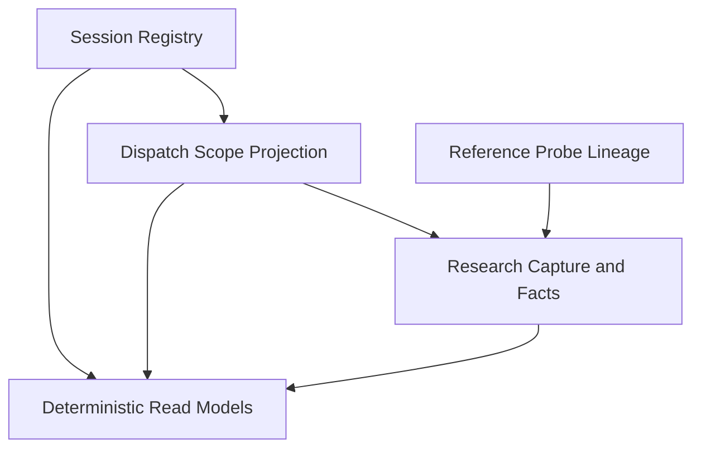

# Agent Provenance Telemetry

## What This Module Owns

Agent Provenance Telemetry (APT) owns the incremental contracts that connect a coarse Session to the
existing Dispatch and to immutable Research captures plus append-only extracted facts. It owns
deterministic provenance read models and reference-probe lineage, but remains subordinate to Agents
Communication Infra (ACI) for journal, bus, artifact, canonicalization and receipt authority.

This specification ratifies information ownership and behavior, not a deployed runtime. No APT
runtime, store, ACI profile registration or UI wiring exists merely because this corpus is accepted;
the [work-pack mutation gate](../WORK-PACK.md#mutation-gate-authority-and-evidence) remains blocked.

## Module Map

## Capabilities

| Capability | What | Key Aspects | First-Cut Boundary |
|---|---|---|---|
| Session Registry | Ensures one coarse session per execution context and supports explicit authorized rollover. | `EnsureSession`, `StartNewSession`, `LinkSessionDispatch`, `SessionRecord` | ID, start instant, current name and sole Session-to-Dispatch link only. |
| Dispatch Scope Projection | Reads current dispatch intent and projects session/research joins without mutating the strict ledger. | `DispatchScopeProjection`, `ProvenanceFactsToReadModels` | No new dispatch keys, reverse joins or lifecycle owner. |
| Research Capture & Facts | Seals one artifact-backed producer outcome and appends attributed questions, answers, uses, checks, problems, claim extractions and formalizations. | `AppendResearchCapture`, `AppendResearchFact`, `ResearchCapture` | Raw return is artifact-only at L0; facts never rewrite capture bytes. |
| Reference Probe Lineage | Maps an ACI-committed, profile-bound probe recommendation into typed research lineage. | `AppendReferenceProbeLineage`, `ProbeBundleToReferenceLineage`, `ACIProtocolProfileBinding` | Small profile only; no second bus and no claim adjudication. |
| Deterministic Read Models | Rebuilds Session, Dispatch and Research projections at an explicit event offset. | `SessionRecord`, `DispatchScopeProjection`, `ResearchRecord` | As-of, dedupe and supersession formulas are replay-tested; granular views remain derived. |

### Session Registry

`EnsureSession` is idempotent by execution-context key. `StartNewSession` atomically starts a
successor and rebinds the context after compare-and-swap; it does not close or mutate the predecessor.
`session.dispatch_linked` is the sole persisted Session-to-Dispatch relation.

### Dispatch Scope Projection

`DispatchScopeProjection` consumes the current dispatch authority and APT facts. It may display a
session, research counts and declared scope already present in the dispatch, but cannot add ledger
keys, infer joins from timestamps or make research status a dispatch lifecycle state.

### Research Capture & Facts

One `ResearchCapture` is the immutable, identity-bearing outcome for an expected contribution and
capture operation. Its raw witness is a classified content-addressed artifact reference. Extracted
facts are separate identity-bearing Entities with `FactEnvelope` and `ExtractionProvenance`; a
revision appends a predecessor-linked fact.

### Reference Probe Lineage

APT accepts probe lineage only after exact ACI protocol-profile and bundle receipts verify. A
`ResearchReferenceUse` distinguishes attributed mention/citation/claimed consultation from the
external host-owned source observation, and `ReferenceCheck` says exactly which check was performed.

### Deterministic Read Models

`SessionRecord`, `DispatchScopeProjection` and `ResearchRecord` are Queries/read models, not
additional write authorities. Each returns `as_of_event_id`, applies explicit current-capture and
fact-supersession rules, retains disagreement, and performs no provider/tool effect during replay.

## Domain Concepts

| Concept | Type | Key Constraints |
|---|---|---|
| [Session](domain.md#session) | Entity | Opaque identity; one start per `session_id` and `ensure_key`; rename does not change identity. |
| [SessionDispatchLink](domain.md#sessiondispatchlink) | Entity | One authoritative Session-to-Dispatch relation; duplicate retry is idempotent. |
| [ResearchCapture](domain.md#researchcapture) | Entity | Exactly one Dispatch; immutable artifact-backed witness; predecessor-CAS supersession; stable digest. |
| [ResearchQuestion](domain.md#researchquestion) | Entity | Stable local identity; exact extraction provenance; optional typed derivation. |
| [ResearchAnswer](domain.md#researchanswer) | Entity | Answers at least one question and selects exact raw bytes without copying the witness. |
| [ResearchReferenceUse](domain.md#researchreferenceuse) | Entity | Attributed use is distinct from host access and from claim relation. |
| [ReferenceCheck](domain.md#referencecheck) | Entity | Typed identity/access/support check; never a generic verified boolean. |
| [ResearchProblem](domain.md#researchproblem) | Entity | Identity and append-only disposition; cannot mutate Dispatch state. |
| [ResearchClaimExtraction](domain.md#researchclaimextraction) | Entity | Research-local proposition; not promoted knowledge or a global assertion. |
| [FormalizationCandidate](domain.md#formalizationcandidate) | Entity | Exactly one claim target plus notation, legend, reading, assumptions and scope. |
| [FactEnvelope](domain.md#factenvelope) | Value Object | Immutable fact/version, stable subject, operation idempotency, time and predecessor. |
| [ExtractionProvenance](domain.md#extractionprovenance) | Value Object | Actor, method/version, mode, capture digest and exact selector. |
| [RawSelector](domain.md#rawselector) | Value Object | UTF-8 byte, half-open offsets; selected bytes and raw artifact digest must verify. |
| [ArtifactReference](domain.md#artifactreference) | Value Object | Content digest, media type, classification, redaction, retention and tombstone policy. |
| [ProbeRecommendationRef](domain.md#proberecommendationref) | Value Object | Pins probe/recommendation, bundle digest, profile digest and source-observation refs. |
| [CaptureStatus](domain.md#capturestatus) | Enum / Type | `captured`, `partial`, `missing`; `superseded` is derived, never stored status. |

## Concept Registry

Every concept has exactly one DomainSpec meta-type. IDs below are the candidate registry authority
for this feature and remain non-runtime until registry synchronization passes.

| Concept | ID | Type |
|---|---|---|
| [Session](domain.md#session) | `agent-provenance-telemetry.Session` | Entity |
| [SessionDispatchLink](domain.md#sessiondispatchlink) | `agent-provenance-telemetry.SessionDispatchLink` | Entity |
| [ResearchCapture](domain.md#researchcapture) | `agent-provenance-telemetry.ResearchCapture` | Entity |
| [ResearchQuestion](domain.md#researchquestion) | `agent-provenance-telemetry.ResearchQuestion` | Entity |
| [ResearchAnswer](domain.md#researchanswer) | `agent-provenance-telemetry.ResearchAnswer` | Entity |
| [ResearchReferenceUse](domain.md#researchreferenceuse) | `agent-provenance-telemetry.ResearchReferenceUse` | Entity |
| [ResearchReferenceClaimRelation](domain.md#researchreferenceclaimrelation) | `agent-provenance-telemetry.ResearchReferenceClaimRelation` | Entity |
| [ReferenceCheck](domain.md#referencecheck) | `agent-provenance-telemetry.ReferenceCheck` | Entity |
| [ResearchProblem](domain.md#researchproblem) | `agent-provenance-telemetry.ResearchProblem` | Entity |
| [ResearchClaimExtraction](domain.md#researchclaimextraction) | `agent-provenance-telemetry.ResearchClaimExtraction` | Entity |
| [FormalizationCandidate](domain.md#formalizationcandidate) | `agent-provenance-telemetry.FormalizationCandidate` | Entity |
| [FactEnvelope](domain.md#factenvelope) | `agent-provenance-telemetry.FactEnvelope` | Value Object |
| [ExtractionProvenance](domain.md#extractionprovenance) | `agent-provenance-telemetry.ExtractionProvenance` | Value Object |
| [RawSelector](domain.md#rawselector) | `agent-provenance-telemetry.RawSelector` | Value Object |
| [ContentDigest](domain.md#contentdigest) | `agent-provenance-telemetry.ContentDigest` | Value Object |
| [ArtifactReference](domain.md#artifactreference) | `agent-provenance-telemetry.ArtifactReference` | Value Object |
| [ProbeRecommendationRef](domain.md#proberecommendationref) | `agent-provenance-telemetry.ProbeRecommendationRef` | Value Object |
| [CaptureStatus](domain.md#capturestatus) | `agent-provenance-telemetry.CaptureStatus` | Enum / Type |
| [ExtractionMode](domain.md#extractionmode) | `agent-provenance-telemetry.ExtractionMode` | Enum / Type |
| [ReferenceUseKind](domain.md#referenceusekind) | `agent-provenance-telemetry.ReferenceUseKind` | Enum / Type |
| [ReferenceCheckKind](domain.md#referencecheckkind) | `agent-provenance-telemetry.ReferenceCheckKind` | Enum / Type |
| [ReferenceCheckResult](domain.md#referencecheckresult) | `agent-provenance-telemetry.ReferenceCheckResult` | Enum / Type |
| [ProblemDisposition](domain.md#problemdisposition) | `agent-provenance-telemetry.ProblemDisposition` | Enum / Type |
| [ClaimDisposition](domain.md#claimdisposition) | `agent-provenance-telemetry.ClaimDisposition` | Enum / Type |
| [FormalizationDisposition](domain.md#formalizationdisposition) | `agent-provenance-telemetry.FormalizationDisposition` | Enum / Type |
| [EnsureSession](operations.md#ensuresession) | `agent-provenance-telemetry.EnsureSession` | Operation |
| [StartNewSession](operations.md#startnewsession) | `agent-provenance-telemetry.StartNewSession` | Operation |
| [LinkSessionDispatch](operations.md#linksessiondispatch) | `agent-provenance-telemetry.LinkSessionDispatch` | Operation |
| [AppendResearchCapture](operations.md#appendresearchcapture) | `agent-provenance-telemetry.AppendResearchCapture` | Operation |
| [AppendResearchFact](operations.md#appendresearchfact) | `agent-provenance-telemetry.AppendResearchFact` | Operation |
| [AppendReferenceProbeLineage](operations.md#appendreferenceprobelineage) | `agent-provenance-telemetry.AppendReferenceProbeLineage` | Operation |
| [SessionRecord](queries.md#sessionrecord) | `agent-provenance-telemetry.SessionRecord` | Query |
| [DispatchScopeProjection](queries.md#dispatchscopeprojection) | `agent-provenance-telemetry.DispatchScopeProjection` | Query |
| [ResearchRecord](queries.md#researchrecord) | `agent-provenance-telemetry.ResearchRecord` | Query |
| [ProvenanceAppendPort](interfaces.md#provenanceappendport) | `agent-provenance-telemetry.ProvenanceAppendPort` | Interface |
| [ProvenanceQueryPort](interfaces.md#provenancequeryport) | `agent-provenance-telemetry.ProvenanceQueryPort` | Interface |
| [ACIProtocolProfileBinding](interfaces.md#aciprotocolprofilebinding) | `agent-provenance-telemetry.ACIProtocolProfileBinding` | Interface |
| [APTFactToACIEvent](mappings.md#aptfacttoacievent) | `agent-provenance-telemetry.APTFactToACIEvent` | Mapping |
| [ProbeBundleToReferenceLineage](mappings.md#probebundletoreferencelineage) | `agent-provenance-telemetry.ProbeBundleToReferenceLineage` | Mapping |
| [ProvenanceFactsToReadModels](mappings.md#provenancefactstoreadmodels) | `agent-provenance-telemetry.ProvenanceFactsToReadModels` | Mapping |
| [StartOrReuseSession](workflows.md#startorreusesession) | `agent-provenance-telemetry.StartOrReuseSession` | Workflow |
| [CaptureAndEnrichResearch](workflows.md#captureandenrichresearch) | `agent-provenance-telemetry.CaptureAndEnrichResearch` | Workflow |
| [IngestReferenceProbeLineage](workflows.md#ingestreferenceprobelineage) | `agent-provenance-telemetry.IngestReferenceProbeLineage` | Workflow |
| [SingleJoinAuthorityRule](rules.md#apt-r1--single-join-authority) | `agent-provenance-telemetry.SingleJoinAuthorityRule` | Rule |
| [IdempotentAppendRule](rules.md#apt-r2--idempotent-append) | `agent-provenance-telemetry.IdempotentAppendRule` | Rule |
| [ArtifactOnlyRawReturnRule](rules.md#apt-r3--artifact-only-raw-return) | `agent-provenance-telemetry.ArtifactOnlyRawReturnRule` | Rule |
| [ExtractionProvenanceRule](rules.md#apt-r4--extraction-provenance) | `agent-provenance-telemetry.ExtractionProvenanceRule` | Rule |
| [CaptureSupersessionRule](rules.md#apt-r5--capture-supersession) | `agent-provenance-telemetry.CaptureSupersessionRule` | Rule |
| [ReplayDeterminismRule](rules.md#apt-r6--replay-determinism) | `agent-provenance-telemetry.ReplayDeterminismRule` | Rule |
| [ProtocolProfileBindingRule](rules.md#apt-r7--protocol-profile-binding) | `agent-provenance-telemetry.ProtocolProfileBindingRule` | Rule |
| [TelemetryNonAuthorityRule](rules.md#apt-r8--telemetry-non-authority) | `agent-provenance-telemetry.TelemetryNonAuthorityRule` | Rule |
| [SessionStarted](events.md#sessionstarted) | `agent-provenance-telemetry.SessionStarted` | Event |
| [SessionContextRebound](events.md#sessioncontextrebound) | `agent-provenance-telemetry.SessionContextRebound` | Event |
| [SessionDispatchLinked](events.md#sessiondispatchlinked) | `agent-provenance-telemetry.SessionDispatchLinked` | Event |
| [ResearchCaptureAppended](events.md#researchcaptureappended) | `agent-provenance-telemetry.ResearchCaptureAppended` | Event |
| [ResearchFactAppended](events.md#researchfactappended) | `agent-provenance-telemetry.ResearchFactAppended` | Event |
| [ReferenceProbeLineageAppended](events.md#referenceprobelineageappended) | `agent-provenance-telemetry.ReferenceProbeLineageAppended` | Event |

## Feature Concept Graph

Only canonical DomainSpec relationships are used.

| From | Edge | To | Evidence | Notes |
|---|---|---|---|---|
| `agent-provenance-telemetry.ProvenanceAppendPort` | exposes | `agent-provenance-telemetry.EnsureSession` | `interfaces.md#provenanceappendport` | Internal contract; no runtime claim. |
| `agent-provenance-telemetry.ProvenanceAppendPort` | exposes | `agent-provenance-telemetry.StartNewSession` | `interfaces.md#provenanceappendport` | Authorized atomic rollover. |
| `agent-provenance-telemetry.ProvenanceAppendPort` | exposes | `agent-provenance-telemetry.AppendResearchCapture` | `interfaces.md#provenanceappendport` | Durable append-before-ack. |
| `agent-provenance-telemetry.ProvenanceQueryPort` | exposes | `agent-provenance-telemetry.SessionRecord` | `interfaces.md#provenancequeryport` | Read-only projection. |
| `agent-provenance-telemetry.ProvenanceQueryPort` | exposes | `agent-provenance-telemetry.DispatchScopeProjection` | `interfaces.md#provenancequeryport` | Read-only projection. |
| `agent-provenance-telemetry.ProvenanceQueryPort` | exposes | `agent-provenance-telemetry.ResearchRecord` | `interfaces.md#provenancequeryport` | Read-only projection. |
| `agent-provenance-telemetry.SingleJoinAuthorityRule` | enforces | `agent-provenance-telemetry.LinkSessionDispatch` | `rules.md#apt-r1--single-join-authority` | Rejects duplicate/contradictory joins. |
| `agent-provenance-telemetry.IdempotentAppendRule` | enforces | `agent-provenance-telemetry.AppendResearchCapture` | `rules.md#apt-r2--idempotent-append` | Same key/digest reuses receipt. |
| `agent-provenance-telemetry.ArtifactOnlyRawReturnRule` | enforces | `agent-provenance-telemetry.AppendResearchCapture` | `rules.md#apt-r3--artifact-only-raw-return` | Inline raw forbidden at L0. |
| `agent-provenance-telemetry.ExtractionProvenanceRule` | enforces | `agent-provenance-telemetry.AppendResearchFact` | `rules.md#apt-r4--extraction-provenance` | Exact author/method/selector. |
| `agent-provenance-telemetry.CaptureSupersessionRule` | enforces | `agent-provenance-telemetry.AppendResearchCapture` | `rules.md#apt-r5--capture-supersession` | Predecessor CAS, no cycles. |
| `agent-provenance-telemetry.ProtocolProfileBindingRule` | enforces | `agent-provenance-telemetry.AppendReferenceProbeLineage` | `rules.md#apt-r7--protocol-profile-binding` | Exact ACI profile receipt. |
| `agent-provenance-telemetry.EnsureSession` | produces | `agent-provenance-telemetry.SessionStarted` | `operations.md#ensuresession` | Only when ensure key is new. |
| `agent-provenance-telemetry.StartNewSession` | produces | `agent-provenance-telemetry.SessionContextRebound` | `operations.md#startnewsession` | Atomic with successor start. |
| `agent-provenance-telemetry.LinkSessionDispatch` | produces | `agent-provenance-telemetry.SessionDispatchLinked` | `operations.md#linksessiondispatch` | Sole relation event. |
| `agent-provenance-telemetry.AppendResearchCapture` | produces | `agent-provenance-telemetry.ResearchCaptureAppended` | `operations.md#appendresearchcapture` | Captured, partial or missing. |
| `agent-provenance-telemetry.AppendResearchFact` | produces | `agent-provenance-telemetry.ResearchFactAppended` | `operations.md#appendresearchfact` | Append-only extraction. |
| `agent-provenance-telemetry.AppendReferenceProbeLineage` | produces | `agent-provenance-telemetry.ReferenceProbeLineageAppended` | `operations.md#appendreferenceprobelineage` | Receipt-verified lineage. |
| `agent-provenance-telemetry.ResearchCapture` | contains | `agent-provenance-telemetry.ArtifactReference` | `domain.md#researchcapture` | Raw witness metadata only. |
| `agent-provenance-telemetry.ResearchCapture` | contains | `agent-provenance-telemetry.ContentDigest` | `domain.md#researchcapture` | Canonical integrity. |
| `agent-provenance-telemetry.ResearchQuestion` | contains | `agent-provenance-telemetry.ExtractionProvenance` | `domain.md#researchquestion` | Attributed extraction. |
| `agent-provenance-telemetry.ResearchAnswer` | contains | `agent-provenance-telemetry.RawSelector` | `domain.md#researchanswer` | Exact witness selection. |
| `agent-provenance-telemetry.ResearchReferenceUse` | contains | `agent-provenance-telemetry.ProbeRecommendationRef` | `domain.md#researchreferenceuse` | Optional typed origin. |
| `agent-provenance-telemetry.SessionRecord` | queries | `agent-provenance-telemetry.Session` | `queries.md#sessionrecord` | Explicit as-of offset. |
| `agent-provenance-telemetry.DispatchScopeProjection` | queries | `agent-provenance-telemetry.SessionDispatchLink` | `queries.md#dispatchscopeprojection` | Never persists reverse join. |
| `agent-provenance-telemetry.ResearchRecord` | queries | `agent-provenance-telemetry.ResearchCapture` | `queries.md#researchrecord` | Query/read model only. |
| `agent-provenance-telemetry.APTFactToACIEvent` | maps | `agent-provenance-telemetry.ProvenanceAppendPort` | `mappings.md#aptfacttoacievent` | One APT fact to one ACI event boundary. |
| `agent-provenance-telemetry.ProbeBundleToReferenceLineage` | maps | `agent-provenance-telemetry.ResearchReferenceUse` | `mappings.md#probebundletoreferencelineage` | Does not infer source access. |
| `agent-provenance-telemetry.StartOrReuseSession` | orchestrates | `agent-provenance-telemetry.EnsureSession` | `workflows.md#startorreusesession` | Idempotent normal path. |
| `agent-provenance-telemetry.CaptureAndEnrichResearch` | orchestrates | `agent-provenance-telemetry.AppendResearchCapture` | `workflows.md#captureandenrichresearch` | Capture precedes extraction. |
| `agent-provenance-telemetry.CaptureAndEnrichResearch` | orchestrates | `agent-provenance-telemetry.AppendResearchFact` | `workflows.md#captureandenrichresearch` | Facts remain independently append-only. |
| `agent-provenance-telemetry.IngestReferenceProbeLineage` | orchestrates | `agent-provenance-telemetry.AppendReferenceProbeLineage` | `workflows.md#ingestreferenceprobelineage` | Profile and receipt gated. |

## Decisions Ratified From Focused Discovery v0.2.0

APT-D1 through APT-D15 are ratified as specification constraints exactly as summarized in the
[focused discovery](../discovery/session-dispatch-research-records.md#decisions-baked-in). In
particular, APT-D12 fixes the two sole join authorities, APT-D13 separates immutable capture from
facts and query projection, APT-D14 forbids a parallel bus/ledger, and APT-D15 requires deterministic
as-of replay. Ratification does not assert implementation.

## Open-Question Disposition

| Question | Disposition for this specification |
|---|---|
| OQ-APT1 | Settled: one `ResearchCapture` is the stable write unit; `ResearchRecord` is its as-of Query/read model. |
| OQ-APT2 | Settled for L0: raw return is never inline; it is an ACI content-addressed artifact reference with digest and governance metadata. |
| OQ-APT3 | Settled: human-provided or host-suggested initial name; rename appends a fact and never changes identity. |
| OQ-APT4 | Settled: identity, access-evidence and claim-support checks are distinct; producer self-report never proves access. |
| OQ-APT5 | Deferred outside APT: formalization remains a candidate until a future ontology/definition authority accepts it. |
| OQ-APT6 | Settled narrowly: `host_actor` may produce a capture for an already valid Dispatch; APT does not authorize a group-less dispatch. |
| OQ-APT7 | Settled: producer, host parser or reviewer may extract only with uniform digest-bound `ExtractionProvenance`. |
| OQ-APT8 | Deferred: opaque reference IDs preserve observed locators/digests; bibliographic equivalence is a reversible future projection. |

TODO-APT1, TODO-APT2, TODO-APT4, TODO-APT5, TODO-APT7 and TODO-APT10 are assigned to the planned
aspect contracts and derived tests. TODO-APT3 is deferred because L0 adds no dispatch ledger keys.
TODO-APT6 remains an empirical validation obligation, not permission to promote notation.
TODO-APT8 remains a later projection slice, and TODO-APT9 remains out of scope because L0 performs
no historical backfill.

## Aspect Docs

These are planned W1 links under the approved `specs/` layout; they become authoritative only after
their individual review gates pass.

| Aspect | Contains | Key Concepts |
|---|---|---|
| [Architecture](architecture.md) | ACI-subordinate boundaries, layers and evidence flows | authority spine, append port, projections |
| [Glossary](glossary.md) | Distilled feature language | capture, fact, use, check, projection |
| [Domain](domain.md) | Entities, value objects and enums | Session, ResearchCapture, extracted facts |
| [States](states.md) | Derived currentness and authorized context binding | capture currentness, session binding |
| [Operations](operations.md) | Mutation contracts and formal rules | ensure, rollover, link, append |
| [Interfaces](interfaces.md) | Internal module and ACI profile contracts | append/query ports, profile binding |
| [Events](events.md) | Immutable accepted fact envelopes | session, capture, fact, probe lineage events |
| [Workflows](workflows.md) | Bounded multi-step coordination | session reuse, capture/enrich, probe ingest |
| [Queries](queries.md) | Deterministic read models | SessionRecord, DispatchScopeProjection, ResearchRecord |
| [Mappings](mappings.md) | ACI/event, probe and projection transforms | fact-to-event, bundle lineage, read models |
| [Rules](rules.md) | Testable authority and integrity invariants | APT-R1 through APT-R8 |
| [Persistence and Replay](persistence-and-replay.md) | Local adapter, atomicity, receipts and replay proofs | idempotency, CAS, offsets, crash recovery |
| [Observability](observability.md) | Non-authoritative logs, traces and metrics | correlation, redaction, signal boundaries |

## Cross-Feature Dependencies

| Capability | Depends On | Via | Why |
|---|---|---|---|
| Session Registry | [ACI Confirmed runtime authority](../../agents-communication-infra/specs/SPEC.md#capabilities) | ACI event/journal append contract | Reuses one writer, canonical event and receipt authority. |
| Research Capture & Facts | [ACI Recovery and official closure contracts](../../agents-communication-infra/specs/persistence-and-replay.md#4-atomic-command-acceptance) | append-before-ack event and artifact references | Makes capture durable without a second store authority. |
| Reference Probe Lineage | [ACI Receipt-gated publication](../../agents-communication-infra/specs/SPEC.md#receipt-gated-deliberation) | exact protocol profile, publication and receipt evidence | Accepts only committed probe lineage. |
| Deterministic Read Models | [ACI Read and accountability](../../agents-communication-infra/specs/SPEC.md#operator-projection-and-usage-accountability) | cursor/offset and replay contract | Preserves explicit staleness and deterministic reconstruction. |

## Produces For

| Consumer | Consumes Capability | Via | What |
|---|---|---|---|
| Existing orchestration read surfaces | Deterministic Read Models | `ProvenanceQueryPort` | Session, Dispatch and Research rows with explicit as-of cursor. |
| Research authors and reviewers | Research Capture & Facts | `ResearchRecord` | Exact artifact witness plus attributed structured extractions. |
| Future assertion capture | Research Capture & Facts | explicit future mapping only | Research-local claim extraction with provenance; never implicit promotion. |
| Future ontology/definition governance | Research Capture & Facts | `FormalizationCandidate` | Interpreted notation and review trail, not accepted vocabulary. |

## Stories and Tests

Planned acceptance scenarios live in [User Stories](../STORIES.md). Exact rule, operation, query,
workflow and negative-path coverage will be derived in [Test Specification](../TEST-SPEC.md). Neither
file may authorize implementation before its own review receipt and the work-pack mutation gate.

## References

- [Focused discovery v0.2.0](../discovery/session-dispatch-research-records.md)
- [Approved work-pack](../WORK-PACK.md)
- [ACI specification](../../agents-communication-infra/specs/SPEC.md)
- [ACI architecture scope](../../agents-communication-infra/specs/architecture.md#scope-boundary)
- [ACI atomic command acceptance](../../agents-communication-infra/specs/persistence-and-replay.md#4-atomic-command-acceptance)
