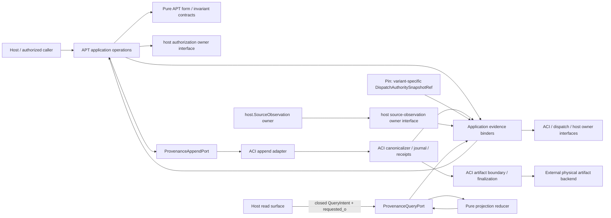
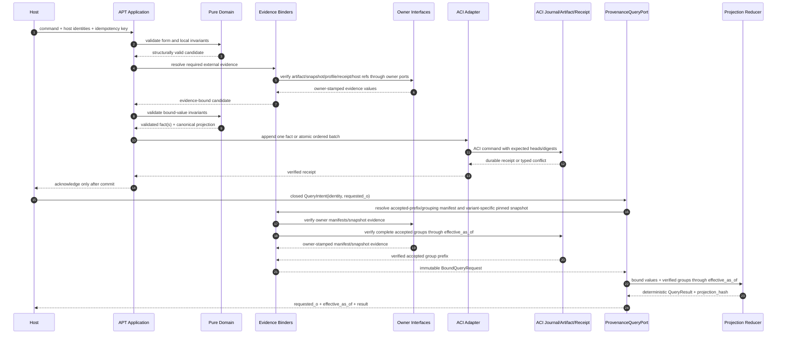

# Agent Provenance Telemetry Architecture

This document is the feature-level architecture companion to [SPEC.md](SPEC.md). It explains the
architecture implied by the current DomainSpec contracts and does not claim that an APT runtime,
store, ACI profile, UI integration or deployment exists.

## Architecture Intent

Make Session, existing Dispatch and structured Research provenance durably appendable and
deterministically readable through one small module. APT supplies pure schemas, validation,
fact-to-event mappings and read projections; ACI remains the sole owner of canonical bytes, the
artifact boundary/finalization contract, bus/journal append and durable receipts. The artifact
boundary may use an external physical backend; APT neither selects nor writes that backend.

## Scope Boundary

APT owns:

- Session, research-capture and extracted-fact schemas and invariants;
- application operations and ACI-subordinate append/query ports;
- mapping accepted Reference Scout evidence into typed research lineage;
- deterministic Session, Dispatch and Research projections at an explicit event offset.

APT does not own the Work Bus, event journal, receipt store, canonicalizer, artifact boundary,
dispatch ledger/appender, host source-observation boundary or knowledge-promotion authority. L0
forbids inline raw returns and dispatch-ledger schema changes. `host.SourceObservation` is an
external Event reference, never an APT event. Every projection that claims determinism pins a
`DispatchAuthoritySnapshotRef`; separately fetched current external dispatch data is display-only
and excluded from its deterministic hash. Entity-fact identity is globally unique by `fact_id`;
`subject_id` is collision evidence, not part of the unique key.

L0 also requires the ACI-owned binding
`{profile_id=aci.transactional-semantic-uniqueness-result-mapping, profile_version=1,
profile_digest=<ACI-registered digest>}`. Until ACI registers and a reviewer verifies the exact
digest/receipt, fact append and probe-lineage implementation remain blocked.

At the agent boundary, capability definitions and executions are separate:
`ReferenceScoutTool -> ScoutRun -> recommendations[]` and
`ProbeTool -> ProbeRun(lens_ref) -> observations[]`. Scout discovers navigation targets; Probe
observes a target through an explicit lens. Neither mutates its target or promotes its output to a
fact. They may reuse the same Session/optional-Dispatch, ACI bus, receipt and replay services without
an inheritance relationship; Reference Scout is not specified as a Probe subtype in this version.
**Sonda** is only the pt-BR product label for `ProbeTool`/`ProbeRun`, not a third domain concept.

## Source Contracts

| Contract ID | Source | Required | Notes |
|---|---|---:|---|
| SC-APT-01 | [Feature SPEC](SPEC.md) | yes | Capability and concept registry source. |
| SC-APT-02 | [Focused discovery v0.2.0](../discovery/session-dispatch-research-records.md) | yes | APT-D1 through APT-D15, authority spine and capture/fact contracts. |
| SC-APT-03 | [Work-pack](../WORK-PACK.md) | yes | Documentation-only gate, artifact-only L0 and mutation evidence predicate. |
| SC-APT-04 | [Coarse session registry](../session-registry.md) | yes | Ensure, rollover and sole Session-to-Dispatch relation. |
| SC-APT-05 | [Reference Scout contract](../probes/reference-scout-tool.md) | yes | Product naming, profile-bound bundle and source-observation lineage; frozen v1 wire identifiers retain `reference-probe`. |
| SC-APT-06 | [Experimental runtime E0](experimental-runtime-l0.md) | yes | Shadow-only SQLite proof; journal/receipts are authority and semantic tables are projections. |
| SC-ACI-01 | [ACI SPEC](../../agents-communication-infra/specs/SPEC.md) | yes | Sole runtime, journal, bus, artifact-finalization boundary and receipt authority. |
| SC-ACI-02 | [ACI architecture](../../agents-communication-infra/specs/architecture.md#scope-boundary) | yes | Disjoint ownership and interface boundaries. |
| SC-ACI-03 | [ACI atomic acceptance](../../agents-communication-infra/specs/persistence-and-replay.md#4-atomic-command-acceptance) | yes | Transaction, idempotency, CAS, effect and receipt semantics. |
| SC-ACI-04 | [ACI trace/log correlation](../../agents-communication-infra/specs/observability.md#trace-and-log-correlation) | yes | Operational telemetry is correlated but non-authoritative. |
| SC-DS-01 | [DomainSpec architecture index](../../../../domainspec/architecture/ARCHITECTURE.md) | yes | Layer and dependency retrieval authority. |

## Design Goals and Non-Goals

| Type | Item | Why |
|---|---|---|
| Goal | Preserve exact producer outcome before extraction. | Later structure must remain attributable to sealed evidence. |
| Goal | Append once, acknowledge after durable ACI acceptance, replay without effects. | Lost responses and restarts must converge. |
| Goal | Keep authority edges singular and projections rebuildable. | Avoid contradictory Session/Dispatch/Research truth. |
| Goal | Make direct references and probe-origin references coexist. | Direct use must not require a fictional probe profile. |
| Non-goal | Build another bus, journal, artifact-finalization boundary, physical artifact backend or dispatch appender. | Those remain ACI/external-backend/current-ledger responsibilities. |
| Non-goal | Promote claims, formalizations or checks to canonical knowledge. | APT records attributed evidence, not truth. |
| Non-goal | Rename sessions, backfill history or canonicalize bibliographic identity in L0. | Each requires a later bounded contract. |

## View 1: Context View

| Actor or System | Relationship to Feature | Contract Source |
|---|---|---|
| Human/project owner `@victor` | Solely owns mutation-gate elevation with an independent receipt; has no implicit runtime rollover privilege. | [Work-pack gate authority](../WORK-PACK.md#mutation-gate-authority-and-evidence) |
| Authenticated orchestration host or human principal | Calls APT operations and may request rollover; only the host-owned authorization port can bind policy and expected-context evidence. | [Session Registry capability](SPEC.md#capabilities) |
| Existing dispatch ledger/appender | Owns immutable dispatch/close rows and audit compatibility; lifecycle is derived from those rows. | [Focused discovery scope](../discovery/session-dispatch-research-records.md#what-stays-the-same) |
| ACI runtime boundary | Owns canonicalization, journal, bus, artifact boundary/finalization, atomic acceptance and receipts. | [ACI high-level structure](../../agents-communication-infra/specs/architecture.md#view-2-high-level-structure-view) |
| Host source-observation boundary | Owns `host.SourceObservation`; APT may hold a validated nullable reference only. | [Reference lineage](../discovery/session-dispatch-research-records.md#43-reference-uses-and-checks) |
| Reference Scout caller/profile registry | Supplies committed profile-bound recommendation evidence. | [Reference Scout bus slice](../probes/reference-scout-tool.md#bus-slice) |
| Existing read surfaces | Consume non-authoritative Session, Dispatch and Research projections. | [Deterministic Read Models](SPEC.md#capabilities) |

## View 2: High-Level Structure View



| Component | Primary Contracts | Responsibility |
|---|---|---|
| Pure APT domain | [Domain Concepts](SPEC.md#domain-concepts) | Validate only versioned form, value equality and invariants; no evidence lookup, clock, I/O or ACI import. |
| APT application services | [Capabilities](SPEC.md#capabilities) | Validate form, call binders/owner interfaces, construct evidence-bound command, then submit through ports. |
| `ProvenanceAppendPort` | [Concept Registry](SPEC.md#concept-registry) | Stable application boundary for validated append and atomic batch receipts. |
| ACI append adapter | [ACI dependency rules](../../agents-communication-infra/specs/architecture.md#dependency-and-interface-rules) | Map each APT fact to one ACI event payload; submit a command containing one payload or an ordered atomic batch. |
| Evidence binders | [Research Capture & Facts](SPEC.md#capabilities) | Application-layer verification of artifact finalization, dispatch snapshot, profile, receipt and optional host-observation refs through owner interfaces. |
| Pure projection reducer | [Deterministic Read Models](SPEC.md#capabilities) | Fold complete verified accepted groups plus the pinned variant-specific Dispatch snapshot through `effective_as_of(requested_o)`. |
| `ProvenanceQueryPort` | [Concept Registry](SPEC.md#concept-registry) | Accept a closed QueryIntent with `requested_o`; bind owner manifests/snapshot, derive the verified `effective_as_of`, and expose an immutable QueryResult without an independent cursor. |

## View 3: Low-Level Components View

| Component | Owns | Consumes | Collaboration Rule |
|---|---|---|---|
| Schema module | APT entity/value/enum schemas and schema refs | No infrastructure | Unknown fields, schema versions and invalid unions fail closed. |
| Domain validators | APT-R1 through APT-R8 form/invariant predicates | Schema and already-bound evidence values only | Pure, deterministic, side-effect free and unable to resolve external evidence. |
| Digest projection builder | APT canonical projection shape | ACI canonicalization policy | Prepares fields but never claims canonical bytes independently of ACI. |
| Session application service | `EnsureSession`, `StartNewSession`, `LinkSessionDispatch` | Generic host authorization owner interface and append port | Rollover consumes owner-bound authorization evidence, then sends ordered start+rebound batch under one operation/receipt. |
| Host authorization dependency | External authorization evidence binding | Authenticated host/human policy owner interface | Returns `{principal, action, context_id, expected_session_id, policy_version, policy_digest, expires_at, nonce, authorization_evidence_digest}`; it is not an APT concept or owned interface. |
| Research application service | `AppendResearchCapture`, `AppendResearchFact` | Append port, evidence binders | Capture acceptance precedes child facts; child failure cannot rewrite capture. |
| Probe-lineage service | `AppendReferenceProbeLineage` partition and ordered batch construction | ACI profile/bundle receipt verifier; transactional semantic registry; generic host source-observation owner interface | Partition into `existing_exact`, `submitted_new`, or conflict; only new members enter the atomic command/receipt, while total result is `existing_exact ∪ accepted(submitted_new)`. |
| Host source-observation dependency | Bound foreign observation evidence | External host-owned source-observation owner interface | Resolves optional ID to an owner-stamped evidence value for application; it is not an APT concept or owned interface, and domain never calls it. |
| ACI append adapter | Per-fact event-payload mapping and command batching | ACI journal/artifact/receipt interfaces | One payload per fact; one command may carry one payload or an ordered atomic batch. |
| Dispatch snapshot adapter | `DispatchAuthoritySnapshotRef` discriminated union verification | ACI-managed snapshot owner or legacy-ledger reader | Verify `aci_managed` or `legacy_ledger`; deterministic hash includes discriminator and every selected variant field. |
| Projection reducer | Session/Dispatch/Research projection formulas | Accepted ACI fact stream and pinned snapshot | No wall clock, provider, tool, network or current mutable dispatch read. |
| Read adapter | Closed internal QueryIntent/QueryResult binding | Projection reducer and owner-evidence binders | Internal only; no pagination, cursor or API transport contract, and cannot write, repair or infer authority. |

`DispatchAuthoritySnapshotRef` is a closed discriminated union:

```text
aci_managed  = {kind, dispatch_id, artifact_ref, artifact_digest, accepted_event_id, accepted_offset}
legacy_ledger = {
  kind,
  ledger_row_identity: {dispatch_id, row_kind, appender_identity, contract_version},
  row_digest,
  non_authoritative_locator?: {row_index}
}
aci_snapshot_hash = ACI_canonical_digest(complete_aci_managed_variant)
legacy_snapshot_hash = ACI_canonical_digest(kind + ledger_row_identity + row_digest)
```

No authority field may be dropped before hashing. The legacy row index is only a lookup hint and is
excluded from identity and hash. Contract fixtures must cover both variants, field tampering, wrong
discriminator, omitted authority fields and ledger-row reorder with unchanged identity/digest/hash.

## View 4: Workflow Process View



| Flow | Happy Path | Failure or Compensation | Contract Source |
|---|---|---|---|
| Ensure session | Validate ensure key; append `SessionStarted` only when absent; return stable receipt. | Same key/digest returns receipt; same key/different digest conflicts; pre-commit failure acknowledges nothing. | [Session registry](../session-registry.md#ensure-do-not-duplicate) |
| Start new session | Application obtains owner-bound rollover evidence from the external host authorization interface; host/binder validates expiry with its external clock, then APT validates bound action/context/session/policy/digest/nonce and appends start+rebound atomically. | Forged, stale, replayed-nonce or cross-context evidence rejects before append; any failed member rolls back both; race has one winner. | [Session registry rollover](../session-registry.md#ensure-do-not-duplicate) |
| Link dispatch | Verify existing dispatch and absence of another link; append `SessionDispatchLinked`. | Duplicate identical link is idempotent; contradictory session link rejects without a fact. | [Authority matrix](../discovery/session-dispatch-research-records.md#34-authority-matrix) |
| Append capture | Verify dispatch pin/status evidence; for captured/partial verify exactly one governed artifact; append immutable capture. | Missing artifact, forbidden inline raw, invalid missing evidence, digest mismatch or stale predecessor rejects before append. | [Capture contract](../discovery/session-dispatch-research-records.md#41-immutable-researchcapture) |
| Append child fact | Verify current capture digest, exact selector and extraction actor/method; append fact or predecessor revision. | Dangling capture, normalized/mismatched bytes, stale predecessor or forbidden self-adjudication rejects; capture remains intact. | [Extraction provenance](../discovery/session-dispatch-research-records.md#42-append-only-child-facts-and-extractionprovenance) |
| Append Scout lineage | Bind receipt/profile/optional host refs; transactionally partition the request; submit one fact per `submitted_new` item and return `existing_exact ∪ accepted(submitted_new)` plus a receipt covering only `submitted_new`. | Missing/mismatched evidence, global fact-ID mismatch, forward/dangling refs or any pre-commit failpoint makes no new fact visible; existing refs remain outside the failed/new receipt; post-commit retry returns the persisted partition/mapping. | [Scout invocation/profile](../probes/reference-scout-tool.md#invocation) |
| Replay/read | Host sends a closed QueryIntent with `requested_o`; the query binder resolves verified grouping/owner manifests and the variant-specific immutable Dispatch snapshot, derives the last complete verified `effective_as_of`, then invokes the pure reducer. | Unknown variant, omitted authority field, digest/snapshot mismatch or invalid group fails closed; ledger reorder changes locator only; current mutable external Dispatch state never enters the result/hash. | [Read-model rules](../discovery/session-dispatch-research-records.md#5-three-level-read-models) |

There is no semantic rollback of an accepted fact. Correction appends a CAS-linked successor.
Infrastructure retry is compensation for uncertain delivery, not deletion or mutation of history.

## View 5: Decision Flow View

| Decision Point | Options or Branches | Selection Rule | Outcome |
|---|---|---|---|
| Session context | inherited / absent / explicit rollover | Inherited reuses; absent ensures; rollover consumes single-use owner-bound evidence matching principal, action, context and expected session after external expiry validation. | Existing session, new start, authorization failure or conflict. |
| Capture status | captured / partial / missing | Captured/partial require exactly one governed artifact; missing forbids raw and requires expectation/failure evidence. | One immutable valid capture or rejection. |
| Capture correction | new generation / supersede current | Correction names current predecessor; independent rework mints generation. | One CAS successor or conflict. |
| Reference origin | direct / probe-origin | Probe ref present implies exact registered profile binding and bundle receipt; direct use has neither requirement. | Attributed use with optional typed origin. |
| Host access evidence | no observation / observation ref supplied | Absence remains null; supplied ref must resolve to host-owned evidence and is never inferred by locator. | Nullable trusted link or rejection. |
| Reference check | identity / access / claim support | Claim support requires exactly one claim relation; other kinds forbid it. | Typed check, never generic verified flag. |
| Dispatch input to projection | `aci_managed` / `legacy_ledger` / current external | ACI-managed hashes all authority fields; legacy hashes `{kind, ledger_row_identity, row_digest}` and treats row index as non-authoritative locator; current external is never hashed. | Deterministic result across ledger reorder plus optional non-hashed context. |
| Historical row | linked / unlinked | Only authoritative edges create membership; dates/names never infer. | Linked projection or explicit `unlinked`. |

## View 6: Dependency Interface View

| Dependency or Interface | Direction | Contract | Boundary Rule |
|---|---|---|---|
| `ProvenanceAppendPort` | inbound/internal | File-gate-reviewed [interfaces.md](interfaces.md); [SPEC graph](SPEC.md#feature-concept-graph) | Accepts validated domain commands; implementation cannot expose direct store handles. |
| `ProvenanceQueryPort` | inbound/internal | File-gate-reviewed [interfaces.md](interfaces.md); [SPEC registry](SPEC.md#concept-registry) | Read-only, closed `requested_o` intent and verified boundary/snapshot result, no repair side effect. |
| Host authorization owner interface | outbound external dependency | Host-owned authorization contract | Returns bound evidence for one principal/action/context/expected session under exact policy version/digest, expiry, nonce and evidence digest; APT neither defines nor owns it. |
| ACI command/journal writer | outbound | [Atomic acceptance](../../agents-communication-infra/specs/persistence-and-replay.md#4-atomic-command-acceptance) | Sole durable event writer and receipt authority. |
| ACI canonicalizer | outbound | [ACI canonical contract](../../agents-communication-infra/specs/persistence-and-replay.md#4-atomic-command-acceptance) | APT does not mint competing canonical bytes. |
| ACI artifact boundary/finalizer | outbound | [ACI data/evidence artifacts](../../agents-communication-infra/specs/architecture.md#data-and-evidence-artifacts) | ACI owns validation/finalization and may delegate physical bytes to an external backend hidden from APT. |
| Physical artifact backend | transitive external | Selected behind ACI artifact boundary | APT has no direct credential, client, path or write dependency. |
| Existing dispatch reader/appender | outbound | [Focused compatibility boundary](../discovery/session-dispatch-research-records.md#what-stays-the-same) | Read pinned snapshot; never write YAML or add L0 keys/joins. |
| Host source-observation owner interface | outbound external dependency | [Reference lineage](../discovery/session-dispatch-research-records.md#43-reference-uses-and-checks) | Route external host owner → binder → application → bound value/domain; APT neither defines nor owns the interface or event. |
| ACI profile/receipt verifier | outbound | [Scout bus slice](../probes/reference-scout-tool.md#bus-slice) | Scout-origin append rejects unless exact profile and receipt verify. |
| ACI transactional semantic registry/result mapper | outbound | Required `aci.transactional-semantic-uniqueness-result-mapping@1` profile | Enforces global `fact_id` uniqueness; compares canonical payload digest, `subject_id` and `supersedes_fact_id`; commits total request mapping while command/receipt covers only `submitted_new`. |
| Existing UI/read surfaces | outbound | [Three-level read models](../discovery/session-dispatch-research-records.md#5-three-level-read-models) | Consume projections; cannot become write authority. |

## Constraints

| Constraint | Source | Impact |
|---|---|---|
| One authority per edge type: `session.dispatch_linked` for Session-to-Dispatch and `ResearchCapture.dispatch_id` for Dispatch-to-Research | [APT-D12](../discovery/session-dispatch-research-records.md#decisions-baked-in) | A Dispatch has `0..N` captures; singularity applies to edge ownership, not capture cardinality. Reverse fields are derived only. |
| Capture bytes and extracted facts are separate | [APT-D13](../discovery/session-dispatch-research-records.md#decisions-baked-in) | Extraction may evolve without mutating evidence. |
| APT is ACI-subordinate | [APT-D14](../discovery/session-dispatch-research-records.md#decisions-baked-in) | No parallel writer, bus, journal or canonicalizer. |
| Replay is deterministic and as-of | [APT-D15](../discovery/session-dispatch-research-records.md#decisions-baked-in) | External current state cannot enter the hash. |
| L0 raw is artifact-only when present | [SPEC status matrix](SPEC.md#stories-and-tests) | Captured/partial have exactly one artifact; missing has none. |
| Operational telemetry is not authority | [ACI observability](../../agents-communication-infra/specs/observability.md#trace-and-log-correlation) | Logs/traces/metrics cannot advance or repair state. |

## Dependency And Interface Rules

| Rule ID | Rule | Applies To | Enforcement |
|---|---|---|---|
| APT-AR1 | Domain schemas/validators accept values and enforce form/invariants only; they import or call no binder, owner interface, infrastructure, clock, network, filesystem or provider. | Pure domain components | Static dependency test, deterministic unit/property tests and `external_calls(domain)=0`. |
| APT-AR2 | Application services call declared binders/owner interfaces, then submit evidence-bound values through ports; binders never run inside domain code. | Session, research and probe-lineage services | Import-boundary audit and interaction-order tests. |
| APT-AR3 | Every APT fact maps to exactly one ACI event payload; an ACI command may carry one payload or an ordered atomic batch. | ACI append adapter | Per-fact mapping fixtures plus single/batch accepted-event and receipt reconciliation. |
| APT-AR4 | No APT component writes the journal, artifact backend or dispatch ledger except through their owner boundary; APT never addresses the physical artifact backend. | All adapters | Writer inventory, negative direct-write tests and layering audit. |
| APT-AR5 | Query/projection paths cannot call append operations or external effects. | Projection reducer/read adapter | Dependency test and replay external-call counter equals zero. |
| APT-AR6 | `host.SourceObservation` remains foreign and nullable; only external host owner interface → binder → application → bound value may reach domain validation, and locator match cannot synthesize it. | External source-observation dependency, evidence binder, probe mapper | Forged/dangling/missing-link and domain-zero-owner-call fixtures. |
| APT-AR7 | Raw artifact bodies never enter APT events, projections, logs, traces or metrics. | Adapter, read and observability paths | Schema allowlists, redaction and no-body tests. |
| APT-AR8 | Adapter receipt is returned only after ACI durable commit; uncertain response retries same identity. | ACI append adapter | Pre/post-commit failpoints and byte-stable receipt tests. |
| APT-AR9 | Probe lineage submits one ordered atomic batch containing only `submitted_new`: each new fact maps to one event, every intra-batch ref points backward or to a preexisting accepted fact, and one receipt covers exactly the accepted new batch. `existing_exact` appears only in the total result mapping and is not reaccepted. | Probe-lineage service/ACI adapter | Forward/dangling-ref negatives, mixed-result receipt-membership checks, per-member/commit failpoints and same-batch retry fixtures. |
| APT-AR10 | Host owner/binder validates `expires_at` with an external clock; pure domain receives owner-bound evidence and never reads time. Accepted rollover facts pin policy version/digest plus `authorization_evidence_digest`; replay verifies pinned values and never reexecutes authorization policy. | External host authorization dependency, binder, session service, pure reducer | External-clock expiry, domain-zero-clock, forged evidence digest, stale, replayed nonce, cross-context/session and replay-no-policy-call tests. |
| APT-AR11 | Semantic unique key is global `fact_id`; a collision is exact only when stored canonical payload digest, `subject_id` and `supersedes_fact_id` all match. | Direct fact append and probe-lineage service | Cross-subject same-ID, predecessor mismatch, payload mismatch, exact collision and concurrent-loser tests. |
| APT-AR12 | Probe result is exactly `existing_exact ∪ accepted(submitted_new)`. Atomicity, head changes and receipt membership cover only `submitted_new`; total mapping preserves preexisting status/ref without reacceptance. | Probe-lineage service/ACI adapter | Mixed, zero-new, crash-before-submit, crash-after-commit and receipt-membership tests. |

## Data and Evidence Artifacts

| Artifact | Produced By | Used For | Contract Source |
|---|---|---|---|
| Validated APT command candidate | Pure validator/application service | Request to ACI adapter; not yet a fact. | [SPEC graph](SPEC.md#feature-concept-graph) |
| Accepted APT event in ACI envelope | ACI journal writer | Authoritative replay input. | [ACI atomic acceptance](../../agents-communication-infra/specs/persistence-and-replay.md#4-atomic-command-acceptance) |
| Append/batch receipt | ACI receipt authority | Lost-response retry, acceptance proof and gate evidence. | [ACI crash outcomes](../../agents-communication-infra/specs/persistence-and-replay.md#5-crash-boundaries-and-observable-outcomes) |
| Raw-return artifact finalization receipt/ref | ACI artifact boundary backed by an opaque external physical store | Exact captured/partial witness; never event/log body or direct APT backend write. | [L0 work-pack boundary](../WORK-PACK.md#scope-and-authority-boundary) |
| `DispatchAuthoritySnapshotRef` | Dispatch snapshot adapter | Discriminated `aci_managed` or `legacy_ledger` pinned reference; deterministic hash covers discriminator and every variant field. | [SPEC capability boundary](SPEC.md#capability-boundaries) |
| `host.SourceObservation` reference | Host acquisition boundary | Optional trusted access evidence. | [Host-owned external concept](SPEC.md#host-owned-external-concept) |
| Owner-bound rollover authorization evidence | External host authorization owner interface | One authorized session-binding CAS; application consumes the value before domain-bound submission, while accepted fact pins policy version/digest and evidence digest. | [Session capability](SPEC.md#capabilities) |
| Scout bundle/profile/receipt evidence | ACI Scout publication/profile authority | Authorize Scout-origin lineage mapping. | [Scout output bundle](../probes/reference-scout-tool.md#output-bundle) |
| Probe-lineage atomic batch receipt | ACI receipt authority | Proves exactly the ordered `submitted_new` lineage facts committed together; `existing_exact` remains only in the total result mapping, retains original acceptance and is never a receipt member or reaccepted. | [ACI atomic acceptance](../../agents-communication-infra/specs/persistence-and-replay.md#4-atomic-command-acceptance) |
| Transactional semantic result mapping | ACI semantic uniqueness/result-mapping profile | Maps every request key to an exact preexisting ref or newly accepted ref; only the latter appear in the command receipt. | [Required profile](../WORK-PACK.md#required-aci-transactional-semantic-uniquenessresult-mapping-profile) |
| Read-model snapshot/hash/cursor | Pure projection reducer | Session, Dispatch and Research read surfaces. | [Read models](../discovery/session-dispatch-research-records.md#5-three-level-read-models) |
| Gate review receipt | Independent reviewer/project owner workflow | Prove documentation/readiness conditions; not runtime state. | [Mutation gate](../WORK-PACK.md#mutation-gate-authority-and-evidence) |

## Extension Points

| Extension Point | Allowed Variation | Guardrail |
|---|---|---|
| ACI adapter implementation | Local pilot adapter may change behind the same port. | Must retain sole-writer, canonicalization, receipt and failpoint conformance. |
| Versioned research fact family | Add a new child-fact schema. | New schema/ID, extraction provenance, mapping and replay fixtures; never mutate capture. |
| Projection consumers | Add granular Answer/Reference/Problem/Claim/Formalization views. | Derive from the same accepted facts and explicit as-of offset. |
| Reference equivalence | Add evidence-backed reversible canonicalization projection. | Preserve opaque source IDs and observed locators. |
| Session rename | Add future `RenameSession`. | Separate reviewed spec; append-only history; same session identity. |
| Probe shape | Add tensioned/future profiles. | Separate exact ACI profile registration and budget/reveal tests. |
| Historical backfill | Add explicit imported-provenance workflow. | Never infer joins from date, filename or similar text. |

## Trade-offs and Guardrails

| Trade-off | Benefit | Cost | Guardrail |
|---|---|---|---|
| Artifact-only raw return | Strong privacy/retention boundary and smaller events. | Artifact-boundary finalization dependency even for small answers. | Missing has no artifact; captured/partial verify one finalized governed reference. |
| Immutable capture plus append-only facts | Exact original evidence and attributable refinement. | More events and projection work. | Stable subjects, predecessor CAS and deterministic folds. |
| Discriminated pinned dispatch snapshot | Reproducible query hash across ACI-managed and legacy-ledger authorities. | Two variant fixtures and variant-specific hashing are required. | Hash all ACI authority fields; for legacy hash canonical row identity+digest and exclude reorderable index locator. |
| ACI-subordinate adapter | One authority and recovery model. | APT cannot ship independently of ACI contracts. | Contract tests and no-direct-write audit. |
| Nullable host observation | Honest absence and direct-source support. | Some uses lack trusted access evidence. | Never infer; display attribution/access separately. |

## Decision Log

| Decision ID | Decision | Options Considered | Reason |
|---|---|---|---|
| APT-D12 | Keep one owner per Session-to-Dispatch and Dispatch-to-Research edge type; permit `0..N` captures per Dispatch. | Duplicate FKs/arrays vs derived reverse views. | Prevent contradictory joins without collapsing research cardinality. |
| APT-D13 | Separate immutable capture, append-only facts and read Query. | Mutable aggregate document vs layered evidence. | Preserve witness while enriching structure. |
| APT-D14 | Implement only through an ACI-subordinate port/adapter. | New local bus/store vs existing ACI authority. | Avoid parallel infrastructure. |
| APT-D15 | Pin explicit offsets and deterministic projection formulas. | Current-state reads vs reproducible as-of reads. | Replay and audit require stable answers. |
| APT-ARCH-D1 | Pin a complete discriminated `aci_managed | legacy_ledger` dispatch authority variant for deterministic projections. | Read live dispatch vs one generic ref vs explicit union. | External mutable reads cannot enter a deterministic hash; both authority modes stay replayable. |
| APT-ARCH-D2 | Consume rollover authorization evidence bound by an external host owner interface before submitting the operation. | Caller-declared `policy_ref` vs externally owner-bound evidence. | Prevent APT/caller self-authorization and cross-context replay without creating an APT-owned authorization concept. |
| APT-WP-D3 | Forbid inline raw in L0. | Inline/artifact union vs artifact-only pilot. | Bounded-pilot data risk control. |
| APT-E0-D1 | Permit an isolated SQLite shadow proof with journal/receipts as experimental authority and semantic tables as rebuildable projections. | Wait for production ACI adapter vs experimental local proof. | Tests the minimum durability/replay decision without cutover or a competing production owner. |
| APT-E0-D2 | Keep Session distinct from host Conversation and store only opaque origin references. | Session equals conversation vs explicit boundary. | Hosts may originate work through conversations, CLI, jobs or API requests; no transcript is needed for identity. |
| APT-E0-D3 | Rename the product concept to Reference Scout while retaining frozen v1 `reference-probe` identifiers. | Physical mass rename vs compatibility alias. | Removes ambiguity with technical probes without invalidating registered evidence. |
| APT-E0-D4 | Keep the two residue constructions separate and add no `residue_score`. | Unify/compress now vs preserve typed states. | No theorem establishes commensurability; compression/masking is deferred. |

No decision in this log elevates the runtime or mutation gate.

## Risks

| Risk ID | Risk | Mitigation | Owner |
|---|---|---|---|
| APT-RK1 | Adapter becomes a disguised second journal/store. | One-to-one mapping, writer inventory, negative direct-write tests and layering audit. | APT/ACI architecture owners |
| APT-RK2 | Current dispatch data, reorderable legacy index or incomplete authority fields contaminate deterministic replay. | Explicit union; canonical legacy row identity+digest; both-variant/tamper/reorder fixtures; exclude current context. | Projection owner |
| APT-RK3 | Raw answer leaks through event/log/projection fields. | Artifact-only schemas, allowlists, redaction and no-body tests. | Security/observability owners |
| APT-RK4 | Source use is mistaken for host-observed access or support. | Separate external observation, use, relation and typed check. | Domain owner |
| APT-RK5 | Lost response duplicates capture/facts. | ACI idempotency key+digest, append-before-ack and crash fixtures. | Adapter owner |
| APT-RK6 | Missing capture is rejected as absent artifact or captured is accepted without one. | Status/cardinality truth table and positive/negative fixtures. | Domain/test owners |
| APT-RK7 | Profile mismatch admits unverifiable probe lineage. | Exact profile ID/version/digest and committed receipt gate. | Probe/ACI owners |
| APT-RK8 | Partial probe-lineage batch or ambiguous mixed-result receipt makes existing facts appear newly accepted. | Partition before submit; atomic batch of `submitted_new`; total status/ref mapping outside receipt membership; member/commit failpoints. | Probe/ACI owners |
| APT-RK9 | Caller forges/replays rollover authority or crosses context/session binding. | Host-owned bound evidence with exact policy digest, expiry and nonce; forged/stale/replay/cross-context tests. | Host/session owners |
| APT-RK10 | The experimental SQLite adapter is mistaken for the production ACI authority. | Explicit `experimental` receipt namespace, shadow-only gate, no ledger writes and no cutover path. | E0 runtime owner |
| APT-RK11 | Session origin references drift into transcript storage. | Closed command allowlists and negative tests for prompt/message/response/body fields. | E0 runtime owner |

## Downstream Planning Notes

- Implementation-plan inputs: accepted aspect corpus, exact coverage IDs, ACI adapter/profile
  contract, artifact-boundary governance policy, pinned-dispatch adapter and gate receipts.
- Test implications: derive status/cardinality, forged/stale/replayed/cross-context rollover
  authorization, idempotency,
  CAS/crash, probe batch failpoints/references, selector, host-observation, profile, both dispatch
  snapshot variants with canonical legacy identity/reorder cases, `external_calls(domain)=0` and
  zero-effect replay cases.
- Observability implications: correlate operation/receipt/event IDs; never record raw bodies; expose
  conflicts, replay gaps and rejected foreign evidence without making signals authoritative.
- Documentation implications: `domain.md`, `rules.md`, `operations.md`, `interfaces.md`,
  `events.md`, `workflows.md`, `queries.md`, `mappings.md`, `persistence-and-replay.md` and
  `observability.md` must preserve these component and authority boundaries.

## Design Transport Notes

Follow-on aspects must reuse the exact concept IDs from [SPEC.md](SPEC.md#concept-registry).
Operations and events must preserve one-fact-to-one-event mapping, ordered atomic probe batches and
atomic authorized rollover. Rules/tests must formalize status/cardinality, both complete snapshot
variants, binder-before-submit ordering, zero domain external calls and external-evidence rejection.
Queries must make `requested_o`, the last complete verified `effective_as_of` group boundary and
the exact variant-specific snapshot manifest/digests visible. They admit no current mutable
external Dispatch context. Observability and UI specs must treat projections and signals as
non-authoritative.
Implementation tasks must reference APT-AR rules and cannot lift the mutation gate themselves.

## Gate Result

- Status: `in-review`
- Reason: the aspect corpus, storage/artifact contracts and TEST-SPEC now exist and completed their
  individual file-review gates. TEST-SPEC remains `planned/not-run`; the corpus-wide review receipt,
  profile digests, executable evidence and implementation-readiness verdict remain outstanding.
- Required follow-up: close corpus-wide objections, freeze the exact ACI profile evidence, execute
  the derived tests during authorized implementation readiness, close work-pack blockers, then
  obtain the independent receipts required by `MUTATION_READY`.
