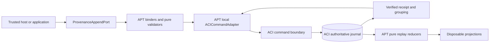

# Persistence and Replay: Agent Provenance Telemetry

This aspect specifies how APT binds its six mutation Operations and deterministic Queries to the
existing Agents Communication Infra (ACI) persistence and replay authority. It refines the
[APT scope boundary](SPEC.md#what-this-module-owns) and depends on, but does not copy or supersede,
the [ACI persistence and replay contract](../../agents-communication-infra/specs/persistence-and-replay.md).

This is a documentation contract only. It does not claim that an APT adapter, ACI profile,
projection, checkpoint, migration or runtime implementation exists. The
[WORK-PACK mutation gate](../WORK-PACK.md#mutation-gate-authority-and-evidence) remains blocked.

## Authority Boundary

ACI's journal is the sole persistence authority for accepted APT events, command idempotency,
global offsets, aggregate heads, semantic uniqueness, atomic grouping, result mappings and
receipts. APT owns domain validation, closed command binding, pure reducers and the local
[ACICommandAdapter](interfaces.md#acicommandadapter) implementation role. That adapter is
subordinate to the ACI command boundary.



The diagram introduces no new bus, store, journal, transaction coordinator or persisted saga.
In particular:

- APT does not maintain a command-receipt table, semantic fact registry, aggregate-head table,
  event mirror or transactional outbox;
- the existing ACI Work Bus is not duplicated, and five of the six Operations do not publish a bus
  message merely to persist an APT fact;
- [ProbeLineageIngress](interfaces.md#probelineageingress) consumes an already committed,
  profile-bound ACI probe delivery and does not create another transport;
- operational logs, traces and metrics are never write, replay or recovery authority; and
- any materialized APT view is disposable and reconstructible from a verified ACI prefix.

## APT-to-ACI Append Adapter Mapping

[ProvenanceAppendPort](interfaces.md#provenanceappendport) exposes the complete L0 mutation surface.
After authentication, owner-evidence resolution and pure validation, it delegates exactly once to
the local adapter. The adapter exposes neither a physical journal handle nor a generic append API.

| APT method | Adapter request | ACI transactional obligation | Verified APT result |
|---|---|---|---|
| `ensure_session` | `submit_single` only when no exact current binding exists | Command lookup, creation-key uniqueness, Session head CAS, one [SessionStarted](events.md#sessionstarted), grouping and receipt atomically | `accepted_new` or `submitted_retry`; semantic reuse returns the existing Session without submission or a new receipt |
| `start_new_session` | `submit_atomic` with exactly two ordered candidates | Command lookup, predecessor/binding CAS, [SessionStarted](events.md#sessionstarted) then [SessionContextRebound](events.md#sessioncontextrebound), heads, grouping and one receipt atomically | One verified two-event outcome; no member is independently visible |
| `link_session_dispatch` | `submit_single` | Command lookup, link uniqueness/CAS, one [SessionDispatchLinked](events.md#sessiondispatchlinked), grouping and receipt atomically | Exact link acceptance/retry or typed conflict |
| `append_research_capture` | `submit_single` | Command lookup, capture-chain CAS, one [ResearchCaptureAppended](events.md#researchcaptureappended), grouping and receipt atomically | Exact immutable capture acceptance/retry |
| `append_research_fact` | `submit_single` with Entity semantic guard or aggregate CAS guard | Command lookup; for Entity facts, global semantic registry; for disposition/assessment, aggregate-head CAS; new event/head/grouping/receipt atomically | `accepted_new`, `submitted_retry`, `semantic_existing` or typed conflict, without reaccepting an existing fact |
| `append_reference_probe_lineage` | `submit_atomic` with a nonempty canonical `submitted_new` subsequence | Command lookup, transactional partition, delivery/fact uniqueness and heads, all new events, total request mapping, grouping and receipt atomically | [ProbeAppendOutcome](interfaces.md#probeappendoutcome); zero-new returns `semantic_existing` without command or receipt |

The exact payload/envelope transformation is
[APTFactToACIEvent](mappings.md#aptfacttoacievent). APT proposes owner-bound event IDs and exact
payload values. ACI validates the registered schema, canonicalizes accepted bytes, owns the runtime
envelope, assigns acceptance metadata and persists the result.

### Local Adapter Boundary

The adapter may:

- translate a validated bound command into the closed ACI command request;
- present exact command identity/digest, expected target and prerequisite heads, semantic guards and
  verified profile bindings;
- submit one request to the ACI command boundary;
- verify the returned result partition, receipt, group range, ordered event IDs and digests; and
- map ACI failures to the closed [InterfaceError](interfaces.md#interfaceerror) taxonomy.

The adapter may not:

- open or expose an ACI database transaction;
- perform semantic lookup as an authoritative preflight outside the submit transaction;
- reserve IDs or heads in a local store;
- append an event separately from its receipt, head or semantic key;
- fabricate `accepted_new`, `submitted_retry` or `semantic_existing` from a cache;
- register or emulate a missing ACI profile;
- upload/finalize artifacts or insert artifact metadata directly;
- publish an additional bus message as a persistence step; or
- acknowledge success before the durable ACI result and applicable grouping verify.

Any diagnostic read before submission is advisory. ACI must repeat command lookup, semantic
collision handling and CAS inside the single journal transaction.

## Required ACI Profiles

| Dependency | Required binding | Used by | Failure behavior |
|---|---|---|---|
| Atomic command receipt/read grouping | Exact ACI-registered profile ID, version, digest and registration receipt for the shape in [Atomic Command Receipt and Read Grouping](states.md#atomic-command-receipt-and-read-grouping) | Every submitted command; especially rollover and probe multi-event groups | Missing or mismatched binding blocks mutation and verified replay |
| Transactional semantic uniqueness/result mapping | `aci.transactional-semantic-uniqueness-result-mapping@1` plus the exact ACI-registered digest and receipt | Entity branch of `append_research_fact` and Entity-use members of `append_reference_probe_lineage` | `SEMANTIC_REGISTRY_PROFILE_UNAVAILABLE`; no event, key, head, mapping or receipt |
| Reference-probe protocol | Exact [ACIProtocolProfileBinding](domain.md#aciprotocolprofilebinding) carried by the committed recommendation plus matching ACI registry/acceptance receipts | `append_reference_probe_lineage` | `PROFILE_BINDING_INVALID`; the preexisting probe publication remains visible without APT lineage |
| Event schema/canonicalizer registry | Exact registered event schema refs/digests and canonicalizer profile evidence | All submitted APT event candidates | Unknown or divergent schema/canonicalizer blocks append and replay |

The atomic grouping profile and semantic-uniqueness profile are distinct dependencies. Acceptance
of one never implies the other. Placeholder digests are not defaults; implementation remains
blocked until exact registration evidence verifies through
[ACIProfileReceiptVerifier](interfaces.md#aciprofilereceiptverifier).

## Artifact-Only Persistence

APT persists no raw research return inline. The status matrix and evidence bindings are defined by
[ResearchCapture](domain.md#researchcapture) and
[ArtifactOnlyRawReturnRule](rules.md#apt-r3--artifact-only-raw-return):

All four conditional slots are present in the canonical closed shape:

| Capture status | `raw_return` | `partial_reason` | `failure_reason` | `failure_evidence_ref` |
|---|---|---|---|---|
| `captured` | Exactly one already-finalized UTF-8 textual [ArtifactReference](domain.md#artifactreference) | canonical null | canonical null | canonical null |
| `partial` | Exactly one already-finalized UTF-8 textual artifact reference | non-empty | canonical null | selected committed evidence ref or canonical null |
| `missing` | canonical null | canonical null | non-empty | required selected committed evidence ref |

Artifact bytes and authoritative artifact metadata remain behind the ACI artifact boundary described
by the [ACI artifact contract](../../agents-communication-infra/specs/persistence-and-replay.md#7-publication-reveal-and-artifact-persistence).
APT verifies an already-finalized reference through
[ArtifactFinalizationVerifier](interfaces.md#artifactfinalizationverifier). Only an
extraction-bearing Entity validator may read exact UTF-8 bytes transiently through
[ArtifactEvidenceReader](interfaces.md#artifactevidencereader) to validate a
[RawSelector](domain.md#rawselector).

Raw bytes never enter an APT event, command result, projection, checkpoint, operational log, trace
or metric. The adapter never copies the physical storage locator into an APT-owned table and never
uses artifact presence as proof of journal acceptance. Orphan or uncommitted uploads are not APT
facts.

## Canonicalization and Digests

APT validation closes unions, injects owner-bound values, rejects duplicate set members, preserves
semantic lists and constructs the exact preimages defined in
[mappings.md](mappings.md). ACI remains the canonicalization and accepted-digest authority.

| Digest/evidence | Preimage and authority | Persistence role |
|---|---|---|
| Command digest | Exact closed bound command, including command identity, expected/prerequisite heads, profile bindings and canonical candidate order; ACI canonicalizer owns final bytes | Same identity and digest returns the stored submitted receipt; changed digest conflicts |
| Event payload digest | Registered exact APT event payload preimage, excluding receipt/grouping fields; ACI canonicalizer owns final bytes | Binds event identity, ordered group digest and replay verification |
| `capture_digest` | Complete closed [ResearchCapture](domain.md#researchcapture) preimage except the digest slot itself | Immutable capture identity/content evidence and synthesis pin |
| Entity fact semantic digest | Complete exact Entity payload including [FactEnvelope](domain.md#factenvelope) | Compared with `subject_id` and `supersedes_fact_id` on global `fact_id` collision |
| Ordered payload digest | Ordered list of canonical event payload preimages in inclusive journal-offset order | Proves complete atomic group membership |
| Projection hash | Canonical query value plus exact pinned manifests/digests defined by [queries.md](queries.md#external-snapshot-and-hash-rules) | Detects replay divergence; never authorizes mutation |

Unknown fields, omitted required null/list slots, duplicate members, unregistered schema versions or
canonicalizer mismatches fail before acceptance. APT never recomputes a different digest algorithm
to override an ACI result.

## Global Entity Fact Registry

The ACI journal transaction owns one global semantic key namespace for `fact_id`, shared by
[AppendResearchFact](operations.md#appendresearchfact) and Entity-use members of
[AppendReferenceProbeLineage](operations.md#appendreferenceprobelineage).

```text
semantic_key = fact_id
exact_collision =
  same(canonical_entity_payload_digest, subject_id, supersedes_fact_id)
```

| Collision result | Required transaction behavior |
|---|---|
| Key absent | Classify as `submitted_new`; validate fact-head CAS and append atomically |
| Key present and exact tuple equal | Classify as `existing_exact`; return original accepted ref without new envelope/event/head/receipt membership |
| Key present and any tuple member differs | Reject with `FACT_IDENTITY_CONFLICT`; commit no new member of the command |
| Concurrent insert race | Losing transaction rereads the authoritative key inside the journal transaction and applies the same exact/conflict classification |

`fact_id` uniqueness applies to the eight Entity variants. Disposition and assessment payloads have
no [FactEnvelope](domain.md#factenvelope) and use aggregate CAS instead. A local cache or projection
cannot serve as the registry or decide a collision winner.

## Aggregate and Predecessor CAS

Every mutable-looking notion is represented by append-only events plus an ACI-owned head:

| Guarded stream/key | Expected guard | Success effect |
|---|---|---|
| Session origin binding | Exact current predecessor Session/binding head | Atomic successor plus rebound group |
| Session-to-Dispatch link | Current Session/link absence or exact head and pinned Dispatch snapshot | One immutable authoritative link |
| Capture chain `(dispatch_id, expected_contribution_id)` | `supersedes_capture_id=current_capture_head` or canonical null for initial | One new immutable capture head |
| Entity subject | `FactEnvelope.supersedes_fact_id=current_fact_head` or canonical null for initial | One new fact revision head |
| Disposition/assessment aggregate | Exact aggregate type/ID, expected accepted-event head and expected version | One contiguous aggregate event/version |
| Probe delivery subject | Exact pre-command delivery predecessor | One delivery head per new canonical member |

ACI compares all target and declared prerequisite heads in the same transaction that accepts the
events. A stale guard returns the typed CAS/version conflict and produces no event, head, semantic
key, receipt or result mapping. APT does not lock a future head through
[AcceptedProvenanceStateReader](interfaces.md#acceptedprovenancestatereader).

## Atomic Commands, Results and Receipts

For every nonempty submitted command, the indivisible acceptance unit is:

```text
command lookup
+ semantic classification/unique keys where applicable
+ target and prerequisite head CAS
+ ordered new event envelope(s)
+ head transitions and synchronous constrained mappings
+ total request-result mapping where applicable
+ atomic grouping metadata
+ stable command receipt
```

All members commit or none commits. A receipt is returned only after commit and verification.
Operational telemetry emitted before or after this boundary cannot change the result.
`required_keys_and_mappings(command)` means only the semantic keys and total result mappings
declared by that Operation and its verified profile; it is the empty conjunction where neither is
applicable.

| Branch | New journal command | Receipt rule |
|---|---:|---|
| `accepted_new` / nonempty `submitted_new` | yes | Non-null stable receipt; members equal exactly `accepted(submitted_new)` |
| `submitted_retry` with same identity/digest | no new command | Return the byte-stable stored receipt/result |
| `semantic_existing` before any submission | no | Null new receipt; return original accepted refs only |
| Same submitted identity with changed digest | no | `IDEMPOTENCY_CONFLICT`; prior receipt remains unchanged |
| Any schema/profile/evidence/CAS/semantic conflict | no | No new receipt or partial acceptance |

For probe batches:

```text
result = existing_exact ∪ accepted(submitted_new)
submitted_new ≠ ∅ ⇒ receipt ≠ null
                   ∧ receipt.members = accepted(submitted_new)
                   ∧ existing_exact ∩ receipt.members = ∅
submitted_new = ∅ ⇒ no_command ∧ receipt = null
```

A preexisting probe publication receipt and the later APT lineage receipt are separate commitments.
The former is evidence input; it never becomes a member of the latter.

## Replay, Checkpoints and Projections

APT read execution has two explicit phases:

1. `replay_input_binding` performs owner-authorized ACI prefix reads and checkpoint/profile/schema
   verification. It may read and verify checkpoint artifact bytes only through the ACI-authorized
   checkpoint/artifact boundary. It never reads a raw research artifact body and performs no
   append, mutation, bus publication or repair.
2. `pure_reducer` consumes only those bound immutable inputs. It performs zero external calls and
   zero effects or I/O.

The whole read execution performs zero mutations, publications or repairs. Operational logs,
projections and artifact presence never supplement missing authoritative replay input.

### Verified Group Boundary

Given caller-supplied inclusive `requested_o`:

```text
effective_as_of(requested_o) =
  max({g.last_offset | verified(g) ∧ g.last_offset ≤ requested_o} ∪ {genesis})
```

A group verifies only when command identity, contiguous range, count, unique ordered event IDs and
`ordered_payload_digest` all agree with the ACI receipt/read profile. A request inside a multi-event
range exposes the preceding verified boundary. Public results return both `requested_o` and
`effective_as_of`; there is no independent APT cursor authority. Here `genesis` is the logical
empty-reducer boundary used when no verified group ends by `requested_o`, never a persisted
checkpoint.

### Replay Algorithm

#### `replay_input_binding`

1. Authorize the read and bind `requested_o` through the ACI-owned read boundary.
2. Verify the exact ACI profile/schema/canonicalizer registry bindings for the requested prefix.
3. Select the latest checkpoint whose artifact, state hash, reducer version, spec digest, recipe
   digest, exact prefix binding and complete boundary group all verify **and** whose
   `journal_offset ≤ effective_as_of(requested_o)`. If none is eligible, bind the checkpoint slot
   as canonical null and start from the reducer's closed empty state.
4. Read subsequent accepted APT event groups through `effective_as_of` in increasing global
   `last_offset` order.
5. Verify each complete group and each event identity, schema digest, payload digest and applicable
   aggregate-version contiguity.
6. Freeze the checkpoint, complete groups and pinned external manifests as one immutable reducer
   input. No owner port remains callable by the reducer.

#### `pure_reducer`

1. Apply each complete bound group exactly once to the pure reducers in
   [states.md](states.md).
2. Build the exact pinned manifests and canonical values in [queries.md](queries.md).
3. Compare the resulting projection/checkpoint hash and source offset; fail closed on mismatch.

An invalid checkpoint is ignored only in favor of an earlier verified checkpoint or replay from the
closed empty state with the checkpoint slot canonical null. It never permits skipping an invalid
authoritative prefix. Missing, overlapping, forked or digest-invalid journal data produces
`READ_INTEGRITY_FAILURE`; a projection cannot repair it.

### Checkpoint Contract

APT introduces no authoritative checkpoint store. If ACI's authorized checkpoint/artifact facility
is used, each APT checkpoint must bind at least:

```text
projection_or_reducer_name
projection_key
journal_offset = verified complete boundary_group.last_offset
source_prefix_digest
boundary_group_command_id
boundary_group_receipt_ref
boundary_group_ordered_payload_digest
state_artifact_ref
state_hash
reducer_version
spec_digest
recipe_digest
required_profile_bindings
```

Every non-null checkpoint's `journal_offset` must equal the `last_offset` of one complete verified
command group and therefore be an effective replay boundary. The exact source prefix digest and
boundary-group command/receipt/payload-digest binding must verify together. A checkpoint positioned
inside a group, at an unverified offset, or against a different prefix/group is rejected and
contributes no state.

Eligibility is request-relative:

```text
eligible(checkpoint, requested_o) =
  verified(checkpoint)
  ∧ compatible(checkpoint)
  ∧ checkpoint.journal_offset = checkpoint.boundary_group.last_offset
  ∧ checkpoint.journal_offset ≤ effective_as_of(requested_o)
```

A valid checkpoint from the future of the requested historical boundary is ineligible for that
read. The binder selects an earlier eligible checkpoint or canonical null; it never leaks future
state into a historical projection.

There is no genesis-checkpoint exception or special checkpoint variant. The replay input shape
always contains the checkpoint slot: canonical null means no checkpoint and requires replay from
the reducer's closed empty state. In this document, `genesis` is only shorthand for that exact
absence-of-checkpoint case; it is not a persisted checkpoint or an alternative input shape.

Checkpoint bytes are stored behind an artifact reference, not inline APT state. During
`replay_input_binding`, the ACI-authorized checkpoint/artifact boundary may return those exact bytes
for verification and decoding. The binder passes only the verified decoded checkpoint state and
binding metadata to `pure_reducer`; the reducer performs no artifact I/O. Checkpoints are optional
optimizations, disposable and never uniqueness tombstones, command receipts, aggregate heads or
retention authority. Replay from the empty state and from every accepted checkpoint must yield the
same canonical value/hash at the same `effective_as_of`.

### Projection Persistence

[SessionRecord](queries.md#sessionrecord),
[DispatchScopeProjection](queries.md#dispatchscopeprojection) and
[ResearchRecord](queries.md#researchrecord) may be materialized only as rebuildable projections
behind the existing ACI-authorized projection facility. A projection row must expose its exact
`source_through_offset`, reducer/recipe version and hash. It must not persist:

- a second Session-to-Dispatch or Dispatch-to-Research authority;
- reverse joins as mutation guards;
- current external Dispatch data without its immutable snapshot pin;
- raw artifact bodies;
- semantic fact uniqueness or aggregate-head ownership; or
- a success state not derivable from verified accepted groups.

Deleting and rebuilding a projection changes no accepted fact. A Query never rebuilds a projection:
it rejects the stale/incompatible projection or, where its closed contract permits, falls back to
pure replay over newly bound verified inputs from an earlier verified checkpoint or the empty
state. Projection rebuild is an external maintenance action only and may not silently mix versions
or offsets.

## Crash, Race and Recovery Invariants

| Boundary | Required durable outcome | Recovery |
|---|---|---|
| Crash before ACI transaction or before commit | APT observes no new event, head, semantic key, mapping or receipt | ACI owns transaction rollback/recovery; APT may retry the exact identity/digest |
| Crash after journal commit but before adapter response | APT observes the whole atomic acceptance after ACI recovery | Exact retry through ACI returns the stored stable receipt/result without duplicate |
| Adapter receives timeout/unknown response | No success may be inferred from logs, projection or artifact | Retry the same submitted identity/digest through the command boundary |
| Same identity races with different digests | At most one digest can own the command receipt | Loser receives permanent `IDEMPOTENCY_CONFLICT` |
| Same `fact_id` races across fact and probe Operations | ACI global registry chooses one authoritative key outcome | Exact loser becomes `existing_exact`; divergent loser conflicts |
| Two capture/fact/aggregate predecessors race | One matching CAS may advance the head | Stale loser appends nothing and rereads only for a new caller intent |
| Crash during multi-event/group acceptance | ACI recovery exposes either no group or the complete committed group | APT re-reads the owner-authorized prefix; incomplete visibility returns `READ_INTEGRITY_FAILURE` and APT never repairs |
| Receipt/group data is incomplete or digest-invalid on read | No member changes a projection | Return `READ_INTEGRITY_FAILURE`; APT never completes, deletes, rewrites or repairs the group |
| Checkpoint is absent | Checkpoint slot is canonical null | Bind the closed empty reducer state; no synthetic genesis checkpoint |
| Checkpoint is corrupt/incompatible | Checkpoint contributes no state | Use an earlier verified checkpoint or the empty state; never repair journal from it |
| Projection write/rebuild crashes | Authoritative journal remains unchanged | Query rejects or falls back to pure replay; only external maintenance may discard/rebuild the projection |
| Artifact exists without accepted capture/fact | Artifact is not APT authority | Retain/expire under ACI artifact policy; never synthesize an event |
| ACI reports unknown migration/profile/schema digest | Mutation and replay fail closed | Operator supplies reviewed compatible migration/registration evidence |

The required equalities are:

```text
Replay(empty_state, accepted≤o, reducer_version)
  = Replay(verified_checkpoint≤o, accepted_after_checkpoint≤o, reducer_version)

external_calls(pure_reducer) = 0
external_effects(pure_reducer) = 0
mutations_or_publications_or_repairs(read_execution) = 0
accepted(command) ⇔ durable(receipt ∧ events ∧ heads
                              ∧ required_keys_and_mappings(command))
```

ACI alone owns journal rollback, startup recovery and committed-transaction visibility. APT only
observes the post-recovery all-or-none boundary through authorized reads. It never repairs journal
rows, receipts, group metadata, heads, semantic keys or result mappings.

## Migration Contract

APT does not own a second authoritative database migration stream. Physical journal, receipt,
artifact, aggregate-head, semantic-registry and profile-registry migrations remain ACI-owned under
the [ACI migration policy](../../agents-communication-infra/specs/persistence-and-replay.md#2-required-database-policy).

| Change class | Required treatment |
|---|---|
| APT event schema | Register a new immutable schema version/digest with ACI; retain readers for accepted old versions or provide a reviewed deterministic upcast recipe |
| Canonicalization/digest profile | New registered version and exact migration/compatibility evidence; never reinterpret stored digest bytes in place |
| Required ACI protocol profile | Monotonic registered version/digest plus receipt; unknown/divergent bindings block writes and replay |
| Reducer/query recipe | New reducer/recipe version and spec digest; external maintenance invalidates/rebuilds incompatible projections and checkpoints |
| Rebuildable projection shape/index | Checksummed monotonic migration within the existing authorized projection facility; safe full rebuild by external maintenance must remain possible |
| Artifact policy metadata | ACI artifact-owner migration; never copy bytes or authority into an APT table |
| Authoritative identity/head/receipt semantics | Requires a superseding reviewed DomainSpec/ACI contract and new migration evidence; cannot be introduced as an adapter-local patch |

Migrations never rewrite accepted event meaning, renumber offsets, delete uniqueness evidence,
convert a projection into authority or fabricate receipts. Startup must reject an unknown,
out-of-order or checksum-divergent required migration. Rollback means restoring compatible code and
external maintenance rebuilding disposable projections; it does not reverse accepted facts.

## Persistence and Replay Invariants

| ID | Invariant | Formal |
|---|---|---|
| APT-PR-I1 | ACI journal is the sole accepted-fact authority. | `authority(events,receipts,heads,semantic_keys,offsets)=ACI_journal` |
| APT-PR-I2 | The local adapter is subordinate and stateless with respect to authority. | `adapter_state ∉ authority ∧ success⇒verify(ACI_result)` |
| APT-PR-I3 | Submitted acceptance is all-or-none, including only the semantic keys/result mappings required by that command. | `commit(command)⇔commit(events∧heads∧group∧receipt∧required_keys_and_mappings(command))` |
| APT-PR-I4 | Exact submitted retry is stable. | `same(command_identity,digest)⇒same(receipt,result) ∧ Δjournal=0` |
| APT-PR-I5 | Changed digest cannot replace a receipt. | `same(command_identity)∧different(digest)⇒IDEMPOTENCY_CONFLICT ∧ Δjournal=0` |
| APT-PR-I6 | Entity fact identity is global across ingestion paths. | `unique_key(EntityFact)=fact_id` |
| APT-PR-I7 | Exact fact collision is closed. | `existing_exact⇔same(payload_digest,subject_id,supersedes_fact_id)` |
| APT-PR-I8 | Aggregate advancement is CAS-guarded inside acceptance. | `accepted(aggregate_event)⇒expected_head=current_head_before ∧ expected_version=current_version_before` |
| APT-PR-I9 | Raw research returns are artifact-only and never enter replay/checkpoint state. | `raw_research_artifact_body∉events∪results∪projections∪checkpoints∪telemetry` |
| APT-PR-I10 | Replay uses only complete verified groups. | `¬verified(group)⇒Δprojection=0` |
| APT-PR-I11 | Replay boundary is explicit. | `response.exposes(requested_o,effective_as_of(requested_o))` |
| APT-PR-I12 | An eligible non-null checkpoint is bound to an exact complete verified boundary not after the request's effective boundary and agrees with empty-state replay; canonical null selects that empty state. | `eligible(c,requested_o)⇒c.offset=verified_group.last_offset ∧ c.offset≤effective_as_of(requested_o) ∧ same(prefix,group_binding) ∧ Replay_empty(o)=Replay_c(o); no_eligible_checkpoint⇒checkpoint=null ∧ start=empty_state` |
| APT-PR-I13 | Projections are disposable non-authority. | `delete(projection)⇒Δaccepted_state=0` |
| APT-PR-I14 | Input binding may perform authorized ACI reads/verifications, including checkpoint artifact bytes but never raw research bodies; the reducer has zero I/O/calls/effects and the whole read has zero mutations/publications/repairs. | `calls(replay_input_binding)⊆authorized_ACI_reads_and_verifiers ∧ ¬reads(replay_input_binding,raw_research_artifact_body) ∧ IO(pure_reducer)=0 ∧ effects(pure_reducer)=0 ∧ mutations_or_publications_or_repairs(read_execution)=0` |
| APT-PR-I15 | No second bus/store exists. | `APT_authoritative_stores=∅ ∧ APT_bus_instances=∅` |
| APT-PR-I16 | Unknown migrations/profiles fail closed. | `¬verified(version,digest,checksum)⇒block(write,replay)` |

## Planned/Not-Run Test Coverage

The file-gate-reviewed [TEST-SPEC](../TEST-SPEC.md) registers planned/not-run coverage for:

1. same identity/same digest lost-response retries with byte-stable receipt and unchanged event
   count;
2. same identity/different digest conflict for every submitted Operation;
3. crash failpoints before each atomic member, before commit and after commit/before response;
4. complete versus partial two-event rollover and mixed probe group visibility;
5. global `fact_id` exact and divergent races across direct fact and probe ingestion;
6. stale capture, fact, disposition, assessment and delivery-head CAS races;
7. zero-new, mixed and all-new probe partitions with exact receipt membership;
8. captured/partial/missing artifact matrix, no-inline-byte and orphan-artifact cases;
9. replay from empty state/checkpoint parity at offsets before, inside and after atomic groups,
   including canonical-null checkpoint input and rejection of a valid future checkpoint whose
   `journal_offset > effective_as_of(requested_o)` with no future-state leak;
10. incomplete, overlapping, forked, schema-invalid and ordered-digest-invalid replay inputs;
11. query rejection/pure-replay fallback for stale projections plus external-maintenance rebuild
    parity and proof that projections cannot authorize writes;
12. adapter timeout/retry behavior with no log, trace, metric or cache inference;
13. missing/mismatched profile and migration checksum startup blocking; and
14. migration compatibility across retained event schema and reducer/checkpoint versions.

All test links remain planned/not-run: no executable suite, execution receipt or passing verdict is
claimed. The TEST-SPEC file gate does not complete corpus-wide review, implementation readiness or
the runtime mutation gate.

## Connections

| Document | Type | Description |
|---|---|---|
| [SPEC.md](SPEC.md) | `derives-from` | Owns the APT concept registry and ACI-subordinate scope. |
| [Architecture](architecture.md) | `constrained-by` | Defines the authority spine and layer boundaries. |
| [Interfaces](interfaces.md) | `implements-boundary-for` | Defines ProvenanceAppendPort, ACICommandAdapter and owner evidence ports. |
| [Operations](operations.md) | `persists-results-of` | Defines the six command contracts and typed outcomes. |
| [Events](events.md) | `stores-through-ACI` | Defines the six immutable APT event payload contracts. |
| [Mappings](mappings.md) | `binds-through` | Defines intent, owner evidence, payload and ACI envelope transformations. |
| [States](states.md) | `replays-into` | Defines atomic-group and reducer semantics. |
| [Queries](queries.md) | `projects-into` | Defines deterministic values, manifests and hashes. |
| [Rules](rules.md) | `governed-by` | Defines authority, idempotency, artifact, CAS and replay invariants. |
| [ACI persistence/replay](../../agents-communication-infra/specs/persistence-and-replay.md) | `depends-on` | Owns the physical journal, artifact boundary, transactions, receipts and migrations. |
| [WORK-PACK](../WORK-PACK.md) | `planned-by` | Keeps implementation blocked pending reviewed readiness evidence. |
