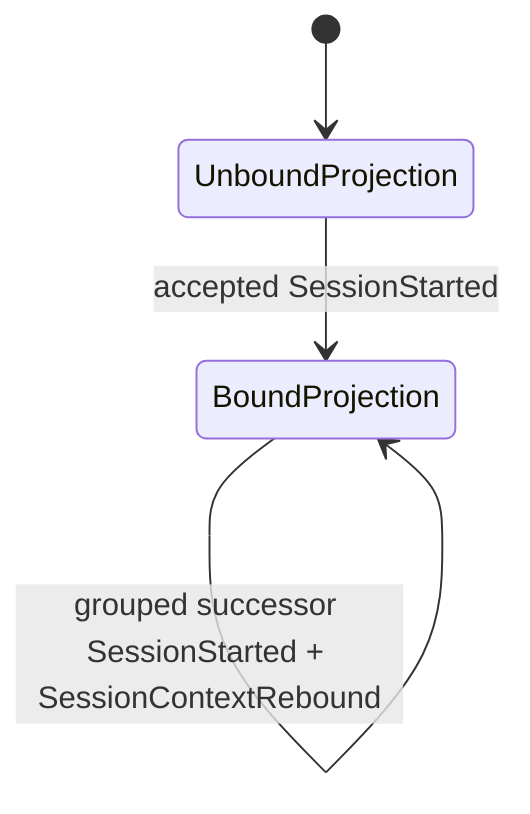
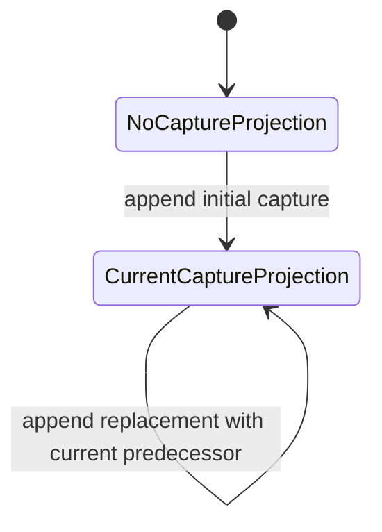

# State and Projection Semantics: Agent Provenance Telemetry

This document adapts the DomainSpec state template for test derivation without registering a State
Machine concept. The L0 [Concept Registry](SPEC.md#concept-registry) contains no State Machine:

- [CaptureStatus](domain.md#capturestatus) is an immutable Enum value on each
  [ResearchCapture](domain.md#researchcapture), not mutable lifecycle state;
- session context binding and capture currentness are deterministic replay-derived projections over
  accepted events;
- diagrams below describe reducer inputs and outputs, not mutation of an Entity; and
- no transition, command, event, status, rename operation or lifecycle concept beyond
  [SPEC.md](SPEC.md) is introduced here.

For an inclusive replay offset `o`, `accepted≤o` means the canonical ACI journal prefix through the
latest verified atomic command group's `last_offset` at or before `o`. A reducer is a pure fold over
that prefix: it performs no external lookup, append or repair.

## Atomic Command Receipt and Read Grouping

APT requires this exact ACI atomic-command receipt/read-grouping shape:

```text
{
  command_id,
  first_offset,
  last_offset,
  event_count,
  ordered_event_ids,
  ordered_payload_digest
}
```

This shape is a **required proposed ACI protocol-profile dependency and an L0 implementation
blocker** until ACI registers it with an exact profile ID, version and digest. This document does
not claim that the shape, adapter or runtime exists today. It is ACI-owned receipt/read metadata,
not a new APT Event or a barrier journal row.

`ordered_event_ids` has exactly `event_count` unique entries in inclusive journal-offset order, and
`event_count = last_offset - first_offset + 1`. The digest preimage is exactly:

```text
[
  canonical_event_payload_preimage(event_id_at_first_offset),
  ...,
  canonical_event_payload_preimage(event_id_at_last_offset)
]
```

Each event payload preimage excludes the atomic receipt/grouping and any receipt/batch/group digest
field. `ordered_payload_digest` is the ACI canonical digest of that ordered list. APT uses existing
command/operation and event identities where the registered event contract already provides them;
it does not require every event payload to repeat invented receipt fields.

There is no commit-barrier event. A caller supplies `requested_o`; the reducer exposes
`effective_as_of(requested_o)`, defined as the greatest verified group `last_offset` not greater
than `requested_o`, or the explicit genesis boundary when no such group exists. A complete,
verified grouping applies all grouped events exactly once as one logical change at its
`last_offset`. A scan requested inside `[first_offset,last_offset)` buffers the incomplete group
and exposes the preceding verified boundary (or genesis). Every public projection returns both
`requested_o` and `effective_as_of`. Missing/duplicate event IDs, missing offsets, a noncontiguous
range, count mismatch, command/event-identity mismatch or ordered-payload digest mismatch fails
closed without applying any member.

Single-event commands use `event_count=1`, one event ID, and `first_offset=last_offset`. Multiple
verified command groups reduce deterministically by global `last_offset` order; overlapping ranges
or reused `command_id` with different grouping content fail closed. Offset order validates grouping
and global command order only; members never become intermediate logical transitions.

A preexisting committed probe bundle/publication receipt is independently visible before APT
lineage exists. A later
[AppendReferenceProbeLineage](operations.md#appendreferenceprobelineage) produces a separate atomic
lineage command group containing
[ReferenceProbeLineageAppended](events.md#referenceprobelineageappended). Bundle-visible with no APT
lineage is valid; a partial or digest-invalid lineage group is buffered or rejected and contributes
no lineage projection.

### Transactional Semantic Uniqueness and Result Mapping Profile

Entity-fact append and probe-lineage ingestion require a second, distinct proposed ACI profile:

```text
profile_id      = aci.transactional-semantic-uniqueness-result-mapping
profile_version = 1
profile_digest  = <exact digest published by the ACI registry>
```

It is an L0 implementation blocker until the exact digest and registration receipt verify. Its
semantic unique key is global `fact_id`. On collision, ACI compares the stored canonical payload
digest, `subject_id` and `supersedes_fact_id`; all three equal means `existing_exact`, while any
mismatch is an identity conflict.

```text
operation_result = existing_exact ∪ accepted(submitted_new)
receipt.members   = accepted(submitted_new)
existing_exact ∩ receipt.members = ∅
```

The total probe request-key mapping records both sets, but only `submitted_new` participates in
new-event atomicity, head changes, offsets, grouping digest and receipt. An existing exact member
remains visible through its original acceptance and is not reaccepted.

| ID | Invariant | Formal |
|---|---|---|
| APT-SEM-I1 | Fact identity is globally unique. | `unique_key(fact)=fact_id` |
| APT-SEM-I2 | Exact collision compares all semantic identity evidence. | `existing_exact ⇔ same(payload_digest,subject_id,supersedes_fact_id)` |
| APT-SEM-I3 | Probe result is total without reacceptance. | `result=existing_exact∪accepted(submitted_new) ∧ existing_exact∩accepted(submitted_new)=∅` |
| APT-SEM-I4 | Atomic grouping and receipt cover only new submissions. | `receipt.members=accepted(submitted_new) ∧ atomic_scope=submitted_new` |
| APT-SEM-I5 | Missing/mismatched profile fails before mutation. | `¬verified(profile_binding) ⇒ Δ(unique_registry,journal,heads,receipt,result_mapping)=0` |

### Atomic Group Invariants

| ID | Invariant | Formal |
|---|---|---|
| APT-GROUP-I1 | No grouped member affects a projection before the complete receipt/read grouping verifies. | `¬verified(g) ⇒ Δprojection_g=0` |
| APT-GROUP-I2 | A verified command group changes logical state exactly once at `last_offset`. | `verified(g) ⇒ apply_count(g)=1` |
| APT-GROUP-I3 | Group membership is complete, contiguous, unique and payload-digest-bound. | `count=last-first+1=|unique(ordered_event_ids)| ∧ verify(ordered_payload_digest)` |
| APT-GROUP-I4 | Public replay accepts any requested offset but exposes the greatest verified boundary not after it, or genesis before the first verified group. | `effective_as_of(requested_o)=max({g.last_offset | verified(g) ∧ g.last_offset≤requested_o}∪{genesis}) ∧ response.exposes(requested_o,effective_as_of)` |
| APT-GROUP-I5 | Command groups have one deterministic total reduction order. | `g₁≺g₂ ⇔ g₁.last_offset<g₂.last_offset` |
| APT-GROUP-I6 | Probe publication and APT lineage are separate commitments. | `visible(bundle) ⇏ visible(lineage) ∧ partial(lineage_group) ⇒ Δlineage=0` |

## Session Context Binding

The session binding projection maps the exact host context tuple
`c=(origin_kind, origin_ref)` from [Session](domain.md#session) to its current Session. An optional
materialized `context_binding_key` is only the ACI canonical digest of
`{origin_kind, origin_ref}`. The host stamps it; callers cannot choose or override it, and replay
recomputes it when present. This projection key role is distinct from the Session's unique
creation-deduplication `ensure_key`. Initial
binding is reduced from
[SessionStarted](events.md#sessionstarted). Authorized rollover is reduced only from one verified
atomic command grouping containing the successor `SessionStarted` and matching
[SessionContextRebound](events.md#sessioncontextrebound).



These labels are reducer conditions, not registered states.

### Reduction

For context tuple `c=(origin_kind, origin_ref)`:

```text
binding_o(c) =
  null                                      if no accepted SessionStarted for c exists by o
  initial_session_id                        after the first valid SessionStarted for k
  successor_session_id                     after each later valid atomic rebound command group
```

Replay first validates uniqueness of `session_id` and `ensure_key`. Initial `SessionStarted` pins
the same `(origin_kind, origin_ref)` stored by the new Session. Rollover preserves that exact tuple
while the successor uses a new `session_id` and new `ensure_key`; both `SessionStarted` and
`SessionContextRebound` pin the tuple. A rebound group is applicable only when its predecessor
equals the current `binding(c)`, its successor is the new Session in the same verified atomic
command grouping, and any optional derived context key recomputes correctly. The prior Session
remains an immutable historical Entity.

### Transition Table

| From projection | Accepted input | To projection | Guard | Reducer effect |
|---|---|---|---|---|
| unbound | `EnsureSession` acceptance represented by grouped `SessionStarted` | bound to new Session | New `ensure_key`, new `session_id`, canonical payload, exact context tuple unbound, optional derived key valid. | At `last_offset`, add immutable Session and bind its exact context tuple. |
| bound to predecessor | authorized `StartNewSession` atomic acceptance | bound to successor | Both events pin the same context tuple; expected current Session matches; successor ID/ensure key are new; one verified atomic command grouping and authorization evidence. | At common `last_offset`, add immutable successor and rebind the tuple exactly once. |

Both rollover events pin identical `authorized_actor_ref`, `authorization_policy_ref`,
`authorization_policy_digest`, `authorization_evidence_ref`, and
`authorization_evidence_digest`, and the same `(origin_kind, origin_ref)`. Their existing event IDs
are members of one receipt/read grouping. Replay verifies field equality, group membership and all
pinned digests/identities; it never reruns the authorization policy or consults its current version.

Idempotent command retries are not reducer transitions because they append no event. The
command-boundary property
`same(operation_id, canonical_payload_digest) ⇒ Δjournal=0 ∧ same(receipt)` is specified by the
planned operation/rule contracts and tested separately from replay.

### Rejection Table

| Input or attempted transition | Rejection semantics |
|---|---|
| Same ensure/operation identity with a different canonical payload | Idempotency conflict; append nothing. |
| Existing `ensure_key` presented as a different Session identity | Uniqueness conflict; append nothing. |
| Rollover without authorization | Authorization failure; append nothing. |
| Rollover whose expected predecessor is not the current tuple binding | Stale-binding CAS conflict; append nothing. |
| Caller supplies a context binding key, or a supplied host key does not equal the canonical tuple digest | Authority/digest failure; append nothing. |
| Successor start and rebound pin different origin tuples, or successor Session stores another tuple | Context-locality failure; apply neither event. |
| Rebound to an existing, identical-to-predecessor or otherwise invalid successor | Identity/invariant failure; append nothing. |
| Successor start without its rebound, or rebound without its successor start | Atomic-group validation failure; append neither event. |
| Command receipt/grouping does not contain exactly the matching successor and rebound events | Atomic-group validation failure; apply neither event. |
| Rollover events differ in actor, authorization policy/evidence refs, or either digest | Authorization-pin/group validation failure; apply neither event. |
| Replay would require rerunning a policy or resolving an unpinned current policy version | Non-deterministic evidence failure; fail closed. |
| Rename or mutation of `initial_name` | Unsupported in L0; reject. |
| Any input not listed in the transition table | Closed transition surface; reject with no event or projection change. |

### Invariants

| ID | Invariant | Formal |
|---|---|---|
| APT-STATE-I1 | An origin tuple has at most one current Session at any valid replay boundary. | `∀c,o: |binding_o(c)| ≤ 1` |
| APT-STATE-I2 | Creation dedupe and context binding are distinct key roles. | `role(ensure_key)=creation_dedupe ∧ binding_key=H_canonical(origin_kind,origin_ref)` |
| APT-STATE-I3 | A successful rollover is one atomic command group. | `accepted(rebound) ⇔ accepted(successor_start)` within one verified grouping |
| APT-STATE-I4 | A rebound consumes the current tuple head only. | `rebound.predecessor_session_id = binding_(o-1)(c)` |
| APT-STATE-I5 | Replay never mutates or deletes predecessor Sessions. | `Sessions_(o-1) ⊆ Sessions_o` |
| APT-STATE-I6 | The initial Session name is immutable in L0. | `∀s,o₂≥o₁: initial_name_o₂(s)=initial_name_o₁(s)` |
| APT-STATE-I13 | Rollover pins one authorization decision in both events. | `auth_fields(start)=auth_fields(rebound) ∧ verified_digests` |
| APT-STATE-I14 | Logical rebinding occurs only at the verified grouping boundary. | `o < group.last_offset ⇒ binding_o(c)=binding_before_group(c)` |
| APT-STATE-I15 | Context identity is host-derived from the exact origin tuple. | `context_key(c)=H_canonical(c) ∧ caller_override(context_key)=false` |

## Research Capture Currentness

Currentness is a replay-derived head projection over immutable
[ResearchCaptureAppended](events.md#researchcaptureappended) events. The chain key is
`(dispatch_id, expected_contribution_id)`. Each capture retains its original `CaptureStatus`;
replacement never changes `captured`, `partial` or `missing` into another value.



`CurrentCaptureProjection` denotes a reducer result. `superseded` is only a derived label applied to
a non-head capture and is not a fourth [CaptureStatus](domain.md#capturestatus) value.

### Reduction

For chain key `k=(dispatch_id, expected_contribution_id)`:

```text
head_o(k) =
  null                         if no accepted capture for k exists by o
  capture_id                   for a valid initial append
  successor_capture_id         when successor.supersedes_capture_id = head_(o-1)(k)

current_o(c)     ⇔ head_o(chain_key(c)) = c.research_capture_id
superseded_o(c)  ⇔ accepted_o(c) ∧ ¬current_o(c)
```

The reducer verifies the exact capture digest before applying an event. Later supersession of an
input capture does not rewrite a synthesis pin; `input_now_superseded` is derived at query time.

### Transition Table

| From projection | Accepted input | To projection | Guard | Reducer effect |
|---|---|---|---|---|
| no head for chain | grouped initial `ResearchCaptureAppended` | new capture is head | `supersedes_capture_id=null`; schema/status matrix/digest valid; operation identity unused. | At the verified group's `last_offset`, add immutable capture and set chain head. |
| current head | grouped replacement `ResearchCaptureAppended` | replacement is head; predecessor is derived superseded | New operation/capture ID; same chain key; `supersedes_capture_id` equals current head; expected-head CAS succeeds. | At the verified group's `last_offset`, add immutable capture and replace only the derived head pointer. |

As with Session ensure, an idempotent `AppendResearchCapture` command retry appends no event and is
therefore a command-boundary property, not a reducer transition.

### Rejection Table

| Input or attempted transition | Rejection semantics |
|---|---|
| Initial append when the chain already has a head | Missing-predecessor conflict; append nothing. |
| Replacement names a stale or non-current predecessor | CAS/fork conflict; append nothing. |
| Replacement names a capture from another Dispatch or expected contribution | Cross-chain predecessor conflict; append nothing. |
| Capture supersedes itself, names an unknown predecessor or would create a cycle | Structural conflict; append nothing. |
| Same operation identity with a different canonical payload/capture digest | Idempotency conflict; append nothing. |
| Existing capture ID with different content | Identity conflict; append nothing. |
| Invalid schema, omitted canonical slot, status matrix, artifact, evidence or digest | Contract validation failure; append nothing. |
| Attempt to mutate a prior capture's bytes, status, timestamp or predecessor | Immutable-history violation; append nothing. |
| Attempt to persist `superseded` as `CaptureStatus` | Enum validation failure; append nothing. |
| Any input not listed in the transition table | Closed transition surface; reject with no event or projection change. |

### Invariants

| ID | Invariant | Formal |
|---|---|---|
| APT-STATE-I7 | A chain has at most one head at an offset. | `∀k,o: |head_o(k)| ≤ 1` |
| APT-STATE-I8 | Replacement consumes exactly the current head. | `successor.supersedes_capture_id = head_(o-1)(k)` |
| APT-STATE-I9 | Capture status is immutable and closed. | `status(c) ∈ {captured,partial,missing} ∧ □(status(c)=initial_status(c))` |
| APT-STATE-I10 | Currentness is derived only from the accepted prefix. | `current_o = fold(accepted≤o)` |
| APT-STATE-I11 | An event outside a verified complete command grouping cannot fork or advance a chain. | `¬verified(group(event)) ⇒ head_o=head_before_group` |
| APT-STATE-I12 | A rejected append has no partial effect. | `rejected(x) ⇒ Δjournal=0 ∧ Δprojection=0` |

## Disposition Read Projections

The following headings satisfy the domain links but do not add State Machine concepts. Each label is
a read projection of explicit ACI aggregates described in
[domain.md](domain.md#disposition-and-assessment-payload-variants). Entity rows are never mutated.

For each local `TargetRef t`, replay exposes two separate outputs:

```text
adjudication_heads_by_policy_o(t) =
  canonical_sorted_set {
    policy_ref -> (aggregate_id, head_accepted_event_id, aggregate_version, disposition)
  }

assessment_heads_by_o(t) =
  canonical_sorted_set {
    (actor_ref, method_ref, policy_ref) ->
      (aggregate_id, head_accepted_event_id, aggregate_version, assessment)
  }
```

The first map reduces only `aggregate_type=apt.disposition-chain`; the second reduces only
`aggregate_type=apt.assessment-chain`. Keys and entries use ACI canonical byte order, duplicates are
rejected, and order of journal arrival across independent aggregates is non-semantic. A disagreement
label/set is derived when current assessment heads contain distinct assessment values; no head is
dropped or overwritten by another assessor.

There is no singular `current_disposition` or `current_assessment` output in L0. A consumer may
derive one only under a separately registered unique-authority policy; absent that authority, the
singular field is omitted rather than guessed, set to the latest append, or synthesized from
assessment order.

### Aggregate Reduction and Validation

| Input | Validation | Projection effect at verified `last_offset` |
|---|---|---|
| Initial disposition event | Target exists in its named `research_capture_id`; aggregate type matches; aggregate ID equals canonical digest of `(TargetRef, policy_ref)`; expected head is null; expected version is `0`. | Insert policy-keyed adjudication head at version `1`. |
| Successor disposition event | Same target locality/type/key digest; expected head equals current accepted event; expected aggregate version equals current version. | Replace only that policy-keyed adjudication head with version `current+1`. |
| Initial assessment event | Target exists locally; aggregate type matches; aggregate ID equals canonical digest of `(TargetRef, actor_ref, method_ref, policy_ref)`; expected head is null; expected version is `0`. | Insert assessor-keyed assessment head at version `1`. |
| Successor assessment event | Same target locality/type/key digest; expected head equals current accepted event; expected aggregate version equals current version. | Replace only that assessor-keyed assessment head with version `current+1`; retain all independent assessor heads. |

Target locality requires the event `TargetRef`, target Entity and aggregate chain key to name the
same `research_capture_id`. Replay also verifies the accepted event predecessor/head, aggregate
version continuity and atomic receipt/read-grouping evidence. The payload's
`expected_head_accepted_event_id` is
the declared predecessor and must equal the predecessor recorded by the accepted ACI aggregate
append. An unknown predecessor, missing version, version gap,
duplicate version, stale head, fork, cycle, wrong aggregate type/digest, cross-target or
cross-capture edge fails closed: the reducer stops at the preceding valid grouping boundary, reports
an integrity error and does not select or merge a branch.

### Problem Disposition Projection

For a [ResearchProblem](domain.md#researchproblem), the two maps contain only events whose
`TargetRef.target_kind=problem` and values conform to
[ProblemDisposition](domain.md#problemdisposition). With no valid event, both maps are empty.

### Claim Disposition Projection

For a [ResearchClaimExtraction](domain.md#researchclaimextraction), the maps contain only events
whose `TargetRef.target_kind=claim` and values conform to
[ClaimDisposition](domain.md#claimdisposition). Labels remain research-local and do not promote
knowledge.

### Formalization Disposition Projection

For a [FormalizationCandidate](domain.md#formalizationcandidate), the maps contain only events whose
`TargetRef.target_kind=formalization` and values conform to
[FormalizationDisposition](domain.md#formalizationdisposition). Projected values never imply
ontology or governance acceptance.

## Test Derivation Contract

- Each valid transition-table row yields at least one happy-path test and one replay-from-zero versus
  checkpoint parity test.
- Each rejection-table row yields a no-append/no-projection-change test.
- Each invariant yields a property-based test over event-order-preserving accepted prefixes.
- Atomic-group tests cover missing/duplicate/reordered event IDs, noncontiguous range,
  count/command/digest mismatch, mid-group `as_of`, exactly-once application and deterministic
  ordering of multiple `last_offset` boundaries.
- As-of tests cover `requested_o` between two verified groups and before the first group; responses
  expose both offsets and select the preceding verified `last_offset` or genesis respectively.
- Enablement tests require the exact registered ACI receipt/read-grouping profile ID, version and
  digest; absent or mismatched registration keeps the runtime gate blocked.
- Fact/probe enablement tests separately require the exact
  `aci.transactional-semantic-uniqueness-result-mapping@1` registration digest and receipt; absent
  or mismatched registration keeps implementation blocked.
- Semantic-race tests use global `fact_id` collisions and compare canonical payload digest,
  `subject_id` and `supersedes_fact_id`.
- Mixed probe tests assert `result=existing_exact∪accepted(submitted_new)`, while event grouping,
  head changes and receipt membership contain only `submitted_new`.
- Probe tests accept a committed bundle with no APT lineage, and reject/buffer incomplete or
  digest-invalid lineage groups without hiding the bundle.
- Idempotent same-payload command retries are tested at the append boundary as zero-journal-delta
  receipt reuse, not as reducer transitions.
- Every non-listed transition or input is rejected; absence from a table is not implicit
  authorization.
- Tests assert a verified `last_offset` replay boundary and atomic command receipt identity so later
  or incomplete-group events cannot leak into an earlier projection.
