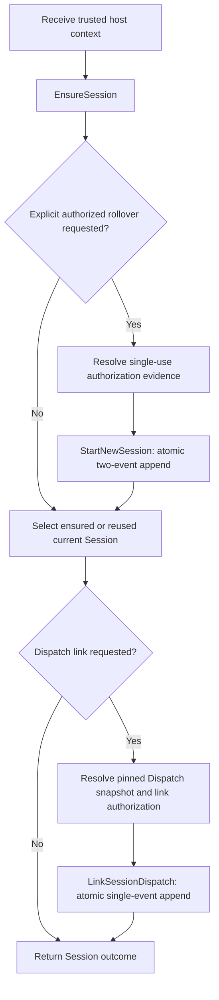
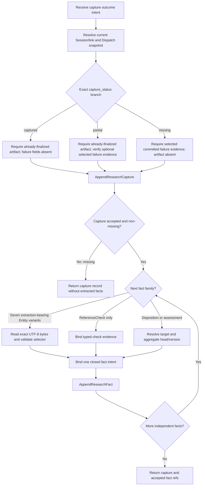
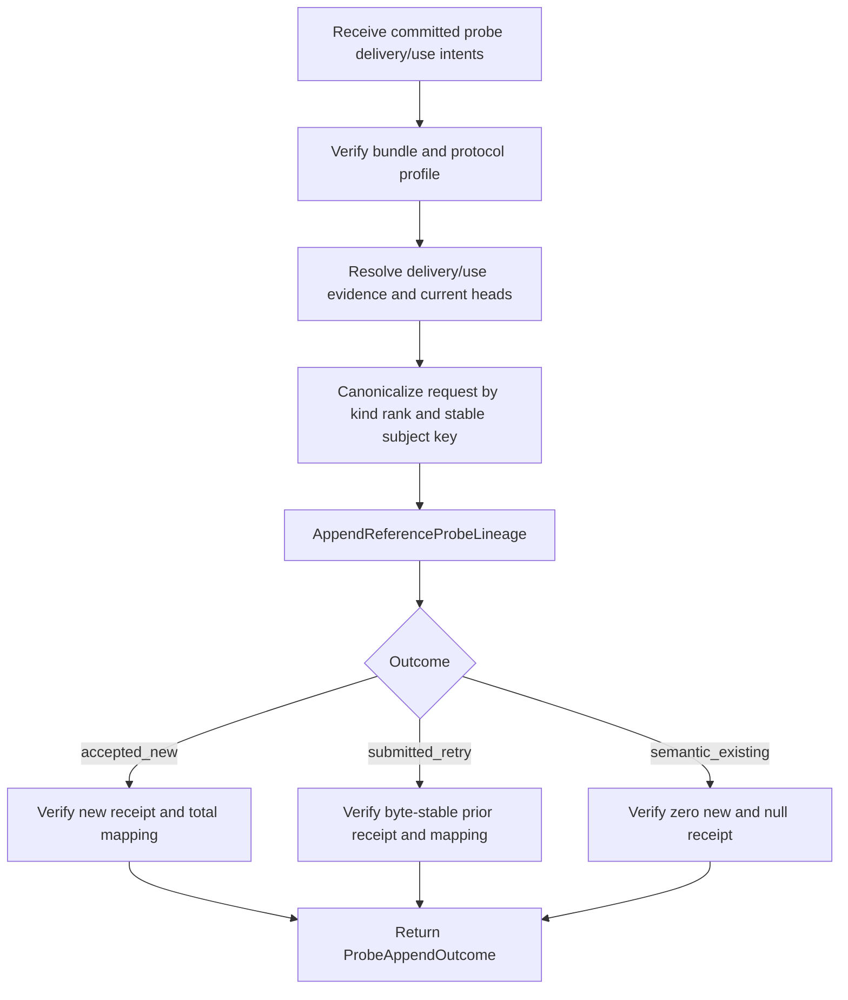
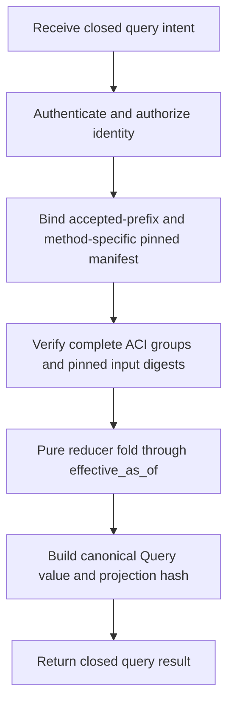

# Workflows: Agent Provenance Telemetry

This aspect specifies exactly the three Workflow concepts registered by
[SPEC.md](SPEC.md#concept-registry). A Workflow coordinates existing Operations and owner ports; it
is not an Operation, transaction, Event, bus, persisted saga state or authority source. Each
Operation retains its own validation, idempotency and ACI transaction boundary.

APT uses no reverse compensation. Accepted facts are immutable. A later correction is an explicit
forward append through an existing Operation, never deletion, rollback of a prior receipt or
projection repair.

## StartOrReuseSession

**Type:** Workflow  
**Triggers:** A trusted host execution context starts, requests an authorized context rollover, or
needs to link its current Session to an existing Dispatch.  
**Orchestrates:** [EnsureSession](operations.md#ensuresession),
[StartNewSession](operations.md#startnewsession),
[LinkSessionDispatch](operations.md#linksessiondispatch)  
**Compensation Strategy:** none; accepted Session/link facts are immutable. Explicit rollover is a
forward transition, not compensation.  
**Idempotency:** conditional: exact Operation command identities/digests are retry-safe; a changed
intent requires a new command identity.

### Steps

The workflow never rolls over automatically because ensure or link failed. Rollover is selected
only by an explicit caller intent plus valid owner authorization.

### Step Table

| # | Step | Actor | Operation / owner action | Atomic boundary | On success | On failure | Compensation |
|---:|---|---|---|---|---|---|---|
| 1 | Bind invocation/context evidence | Trusted host/orchestrator | [TrustedInvocationContext](interfaces.md#trustedinvocationcontext) and host origin owner | none; read/bind only | Continue with a closed ensure intent. | Return typed authentication/evidence error. | none |
| 2 | Ensure coarse Session | Authenticated host/orchestrator | [EnsureSession](operations.md#ensuresession) | One ACI command transaction only when a new Session is required. | `accepted_new`, exact `submitted_retry`, or semantic reuse selects the immutable Session. | Stop; no event was accepted. | none |
| 3 | Evaluate rollover decision | Authenticated principal | plain workflow-local branch (no Operation/Policy concept) | none | Skip or continue to step 4. | Missing explicit intent selects skip, not rollover. | none |
| 4 | Resolve rollover authorization | Host authorization owner | [HostAuthorizationEvidencePort](interfaces.md#hostauthorizationevidenceport) | none; owner evidence read | Produce exact policy/decision evidence bound to action/origin/predecessor/nonce/expiry. | Stop; ensured Session remains current. | none |
| 5 | Replace current Session | Authorized principal | [StartNewSession](operations.md#startnewsession) | One ACI transaction containing exactly ordered [SessionStarted](events.md#sessionstarted) + [SessionContextRebound](events.md#sessioncontextrebound). | New Session becomes current only at verified group boundary. | Neither event applies; prior binding remains current. | none |
| 6 | Evaluate link decision | Authenticated host/orchestrator | plain workflow-local branch (no Operation/Policy concept) | none | Skip or continue to step 7. | Missing Dispatch intent selects skip. | none |
| 7 | Resolve snapshot/link evidence | Dispatch and host authorization owners | [DispatchSnapshotReader](interfaces.md#dispatchsnapshotreader), [HostAuthorizationEvidencePort](interfaces.md#hostauthorizationevidenceport) | none; owner evidence read | Produce exact Dispatch snapshot and action evidence. | Stop; Session remains usable and unmodified. | none |
| 8 | Link current Session/Dispatch | Authenticated host/orchestrator | [LinkSessionDispatch](operations.md#linksessiondispatch) | One ACI command transaction. | Exact immutable link accepted/retried/reused. | No link event; no inferred membership. | none |
| 9 | Return workflow result | APT application | Combine Operation outcomes without creating a new receipt | none | Return Session and optional exact link refs/receipts. | Preserve the last typed failure and all independently accepted prior steps. | none |

### Success and Failure Semantics

- Ensure success may be semantic reuse without a command/receipt.
- Rollover success requires one verified two-event group; an individual group member is invisible.
- Link success never mutates Dispatch and cannot create a second reverse-join authority.
- If link fails after a newly accepted Session, the Session remains accepted. Retrying the exact
  link command is safe; rolling back the Session is forbidden.
- If the caller needs a different Session name/context outcome, it uses a new explicitly authorized
  [StartNewSession](operations.md#startnewsession); there is no rename/undo step in L0.

### Workflow-Local Decision Policy

This is plain decision logic inside the Workflow, not a registered Policy concept.

| Condition | Selected behavior | Notes |
|---|---|---|
| No current Session for exact origin tuple | Run [EnsureSession](operations.md#ensuresession) creation branch. | Owner mints identity/time/event. |
| Current Session already bound | Reuse it through Ensure semantic-existing result. | No event/receipt. |
| Explicit rollover intent and verified single-use authorization | Run [StartNewSession](operations.md#startnewsession). | Never an automatic retry strategy. |
| Dispatch requested and exact snapshot/link authorization verified | Run [LinkSessionDispatch](operations.md#linksessiondispatch). | Dispatch identity comes from pinned authority. |
| Any evidence missing/mismatched | Stop before the affected Operation. | Already accepted earlier steps remain visible. |

### Invariants

| ID | Invariant | Formal |
|---|---|---|
| APT-WF-S1 | Ensure precedes optional rollover/link selection for a starting context. | `link ∨ rollover ⇒ ensured(current_origin)` |
| APT-WF-S2 | Rollover is explicit and authorized. | `StartNewSession ⇒ explicit_intent ∧ verified(single_use_authorization)` |
| APT-WF-S3 | Rollover has no partial visibility. | `visible(start_successor) ⇔ visible(rebound) ⇔ verified(two_event_group)` |
| APT-WF-S4 | Link uses the exact current Session and pinned Dispatch. | `link.session_id=binding_effective(origin) ∧ snapshot.dispatch_id=intent.dispatch_id` |
| APT-WF-S5 | No workflow compensation deletes accepted state. | `accepted(step) ⇒ ¬workflow_delete(step)` |

### External Owners

| Owner | Supplies | APT may not |
|---|---|---|
| Host invocation/authentication owner | origin tuple, principal, correlation and authentication evidence | accept request-body authority |
| Host authorization owner | rollover/link policy and decision evidence | rerun current policy during replay |
| Dispatch authority owner | exact `aci_managed | legacy_ledger` snapshot | mutate Dispatch or infer a link |
| ACI | canonicalization, journal transaction, offsets, envelope, grouping and receipts | expose a transaction handle to the Workflow |

---

## CaptureAndEnrichResearch

**Type:** Workflow  
**Triggers:** One expected Dispatch contribution returns captured/partial evidence, reports a
missing outcome, or appends a correction; structured facts may then be extracted/reviewed.  
**Orchestrates:** [AppendResearchCapture](operations.md#appendresearchcapture),
[AppendResearchFact](operations.md#appendresearchfact)  
**Compensation Strategy:** none. A capture correction or fact revision is a forward append through
the same Operations.  
**Idempotency:** conditional: a rerun is retry-safe only for the same closed intent, command
identity and canonical digest. A new capture/fact ID, changed intent/digest or additional
enrichment item is a new Operation.

### Steps

The loop denotes repeated independent Operation calls, not one multi-fact transaction or saga.
Previously accepted facts do not roll back when a later fact fails.

### Step Table

| # | Step | Actor | Operation / owner action | Atomic boundary | On success | On failure | Compensation |
|---:|---|---|---|---|---|---|---|
| 1 | Bind current research context | Authenticated producer/host | [AcceptedProvenanceStateReader](interfaces.md#acceptedprovenancestatereader), [DispatchSnapshotReader](interfaces.md#dispatchsnapshotreader) | none; read/bind only | Exact current Session, link, Dispatch and capture-chain head. | Stop before append. | none |
| 2 | Validate exact status/evidence branch | ACI artifact/evidence owners | [ArtifactFinalizationVerifier](interfaces.md#artifactfinalizationverifier), [ACIProfileReceiptVerifier](interfaces.md#aciprofilereceiptverifier), [HostSourceObservationEvidencePort](interfaces.md#hostsourceobservationevidenceport) as selected by the discriminator | none; evidence verification | `captured`: required already-finalized artifact and no failure fields; `partial`: required already-finalized artifact plus optional selected committed failure evidence; `missing`: no artifact and required selected committed failure evidence. Artifact finalization is an external precondition; the verifier never uploads or finalizes. | Any other combination returns `EVIDENCE_INVALID`/artifact error; no event. | none |
| 3 | Bind predecessor/synthesis pins | APT application with accepted state | [AcceptedProvenanceStateReader](interfaces.md#acceptedprovenancestatereader) | none | Exact current predecessor and immutable input IDs/digests. | Capture CAS/synthesis error; no event. | none |
| 4 | Append immutable capture | Authenticated producer/host | [AppendResearchCapture](operations.md#appendresearchcapture) | One ACI command transaction. | Capture accepted/retried; current head advances only on new acceptance. | No capture event/head change. | none |
| 5 | Decide enrichment eligibility | APT application | plain workflow-local status branch (no Operation/Policy concept) | none | Non-missing continues; missing ends successfully without facts. | Invalid status matrix would already have failed step 4. | none |
| 6 | Select fact family | APT application | plain workflow-local family branch (no Operation/Policy concept) | none | Select exactly one typed binding path. | Unknown/ambiguous family stops this fact. | none |
| 7 | Validate extraction-bearing Entity evidence | Authorized extractor/reviewer application | [ArtifactEvidenceReader](interfaces.md#artifactevidencereader) | none; transient read only on this branch | Exact UTF-8 bytes, digest metadata and selector validation for the seven variants: `research_question`, `research_answer`, `reference_use`, `reference_claim_relation`, `research_problem`, `research_claim` and `formalization_candidate`. | Stop this fact; accepted capture remains. | none |
| 8 | Resolve disposition/assessment guards | Authenticated extractor/reviewer/host | [AcceptedProvenanceStateReader](interfaces.md#acceptedprovenancestatereader) | none; accepted-state read only on this branch | Exact target plus aggregate type/ID/head/version CAS guards; no artifact body read. | Stop this fact; accepted capture remains. | none |
| 9 | Bind exact fact variant | Authenticated extractor/reviewer/host | fact binder in [ProvenanceAppendPort](interfaces.md#provenanceappendport) | none | Exact payload/[FactEnvelope](domain.md#factenvelope) or aggregate payload and guards. `ReferenceCheck`, the only non-extraction Entity variant, binds typed check evidence without reading capture artifact bytes. | Stop this fact; accepted prior state remains. | none |
| 10 | Append one fact/assessment/disposition | Authenticated principal | [AppendResearchFact](operations.md#appendresearchfact) | One ACI command transaction per call. | Accepted/retried/existing-exact fact ref or aggregate event ref. | This fact appends nothing; continue only by caller decision. | none |
| 11 | Repeat or finish | APT application | plain workflow-local loop/finish branch (no Operation/Policy concept) | none | Return exact accepted refs/receipts. | Preserve typed item failure; never claim all facts succeeded. | none |

### Success and Failure Semantics

- The stable persistable unit is [ResearchCapture](domain.md#researchcapture); fact enrichment never
  mutates its status, bytes, producer, snapshot, predecessor or digest.
- `captured` requires an already-finalized UTF-8 artifact reference and null failure fields.
- `partial` requires an already-finalized UTF-8 artifact reference and non-empty partial reason; its
  selected committed failure evidence is optional.
- `missing` requires no artifact plus committed non-null selected failure evidence and cannot own
  extracted facts.
- Artifact finalization is an external precondition: APT's verifier never uploads or finalizes an
  artifact, and raw bytes exist only transiently during extraction-bearing Entity selector
  validation.
- A fact failure after capture acceptance leaves the capture accepted. A later correction uses a
  new capture with `supersedes_capture_id=current_head`; a fact correction uses a new
  [FactEnvelope](domain.md#factenvelope)
  naming the current same-subject predecessor.
- There is no workflow-level “all facts” receipt. Each direct fact append has its own receipt or
  existing-exact result.

### Workflow-Local Decision Policy

This is plain decision logic inside the Workflow, not a registered Policy concept.

| Condition | Selected behavior | Notes |
|---|---|---|
| `capture_status=captured`, artifact verifies and failure fields are null | Append capture, then permit enrichment. | The already-finalized artifact is required. |
| `capture_status=partial`, artifact verifies and optional selected failure evidence verifies when present | Append capture, then permit enrichment. | The already-finalized artifact and non-empty partial reason are required. |
| `capture_status=missing`, artifact is absent and selected failure evidence verifies | Append capture, then end without extraction. | Non-empty failure reason and committed failure evidence are required. |
| New outcome corrects current chain head | Bind exact predecessor and append new capture. | Forward correction only. |
| Any of the seven extraction-bearing Entity fact intents | Read exact artifact bytes transiently, validate its selector, then bind [FactEnvelope](domain.md#factenvelope)/current fact head. | Covers every Entity variant except `reference_check`; artifact-body access is required. |
| `reference_check` intent | Bind typed check evidence and [FactEnvelope](domain.md#factenvelope)/current fact head. | This is the only non-extraction Entity variant; no capture artifact-body read and no aggregate fields. |
| Disposition/assessment intent | Resolve the exact target and bind explicit aggregate type/ID/head/version CAS guards. | No artifact-body read and no [FactEnvelope](domain.md#factenvelope). |
| More facts after one item failure | Caller explicitly decides whether to continue independent items. | Workflow never reports failed item as accepted. |

### Invariants

| ID | Invariant | Formal |
|---|---|---|
| APT-WF-R1 | Capture acceptance precedes every local fact. | `accepted(fact) ⇒ accepted(capture(fact))` |
| APT-WF-R2 | Missing capture owns no fact/extraction. | `capture.status=missing ⇒ facts(capture)=∅` |
| APT-WF-R3 | Every direct fact call is independently atomic. | `tx(fact_i) ∩ tx(fact_j)=∅` for distinct commands |
| APT-WF-R4 | Later failure cannot undo earlier acceptance. | `accepted(capture ∨ fact_i) ∧ fail(fact_j) ⇒ still_accepted(capture ∨ fact_i)` |
| APT-WF-R5 | Corrections are forward append-only revisions. | `correction ⇒ new_id ∧ predecessor=current_head` |
| APT-WF-R6 | Raw bytes do not cross the validator. | `raw_bytes ∉ events ∪ results ∪ logs ∪ traces ∪ metrics` |

### External Owners

| Owner | Supplies | APT may not |
|---|---|---|
| Host/Dispatch | current context, contribution intent, producer and exact snapshot | invent current membership/scope |
| ACI artifact boundary | already-finalized artifact and transient verified bytes | expose physical backend, duplicate bytes, or ask APT's verifier to upload/finalize |
| ACI acceptance/host observation owners | committed failure evidence | accept a selector as owner evidence |
| ACI journal/canonicalizer | global fact uniqueness, CAS, envelopes, grouping and receipts | emulate uniqueness in a local cache/store |

---

## IngestReferenceProbeLineage

**Type:** Workflow  
**Triggers:** An already committed, profile-bound ACI probe recommendation delivery is ingested,
optionally with fully evidenced [ResearchReferenceUse](domain.md#researchreferenceuse) intents.  
**Orchestrates:** [AppendReferenceProbeLineage](operations.md#appendreferenceprobelineage)  
**Compensation Strategy:** none; the one Operation atomically commits only its `submitted_new`
portion. Preexisting exact refs retain their original acceptance.  
**Idempotency:** yes for the same command identity/digest and for zero-new semantic-existing input.

### Steps

### Step Table

| # | Step | Actor | Operation / owner action | Atomic boundary | On success | On failure | Compensation |
|---:|---|---|---|---|---|---|---|
| 1 | Decode closed request | Authenticated ingestion principal | [ProbeLineageIngress](interfaces.md#probelineageingress) | none | Nonempty unique delivery/use intents. | Reject unknown/duplicate/owner fields. | none |
| 2 | Verify recommendation/profile | ACI profile/receipt owner | [ACIProfileReceiptVerifier](interfaces.md#aciprofilereceiptverifier) | none | Exact committed bundle/recommendation/profile evidence. | Stop; bundle remains independently visible. | none |
| 3 | Resolve evidence/current heads | APT application + external owners | [AcceptedProvenanceStateReader](interfaces.md#acceptedprovenancestatereader), [ArtifactFinalizationVerifier](interfaces.md#artifactfinalizationverifier), [ArtifactEvidenceReader](interfaces.md#artifactevidencereader), [HostSourceObservationEvidencePort](interfaces.md#hostsourceobservationevidenceport) | none | Complete bound delivery/use items. | Stop before submit. | none |
| 4 | Derive keys/order/dependencies | APT pure binder | [ProbeBundleToReferenceLineage](mappings.md#probebundletoreferencelineage) | none | Unique canonical request; every use has valid delivery predecessor. | Lineage/dependency error; no submit. | none |
| 5 | Submit lineage command | Authenticated ingestion principal | [AppendReferenceProbeLineage](operations.md#appendreferenceprobelineage) | One ACI transaction for all `submitted_new`; zero-new submits no command. | Receive transactional partition, total mapping and applicable receipt. | No new member/mapping/receipt commits. | none |
| 6 | Reconcile outcome | APT application | [ProbeAppendOutcome](interfaces.md#probeappendoutcome) invariants | none; read/verify result | Exact branch returned only after receipt/mapping verification. | Typed integrity error; never fabricate success. | none |

### Success and Failure Semantics

- `accepted_new`: `submitted_new≠∅`; only new delivery/use events, heads, semantic keys and total
  mapping commit; receipt members equal the newly accepted refs.
- `submitted_retry`: same command identity/digest returns the byte-stable prior receipt and total
  mapping; it emits no event.
- `semantic_existing`: every item is exact existing, new set empty, receipt canonical null and no
  command submitted.
- A conflict in any prospective new member rejects the entire new portion. Original preexisting
  refs remain visible but are neither hidden nor recommitted.
- Delivery lineage alone never means source access, consultation or support.

### Retry Policy

This is plain retry decision logic inside the Workflow, not a registered Policy concept.

| Condition | Selected behavior | Notes |
|---|---|---|
| Same command identity and digest after uncertain response | Retry the exact [AppendReferenceProbeLineage](operations.md#appendreferenceprobelineage) command. | ACI transaction lookup occurs inside submit. |
| Same command identity, changed digest | Return `IDEMPOTENCY_CONFLICT`. | Never mutate/reuse prior receipt. |
| Never-submitted request, all semantic members existing | Return `semantic_existing`. | No receipt/idempotency claim. |
| Owner evidence/profile mismatch | Refresh owner evidence only when typed retryability permits. | Do not bypass verification. |
| Partial/integrity-invalid group | Fail closed at preceding verified boundary. | No repair/compensation. |

### Invariants

| ID | Invariant | Formal |
|---|---|---|
| APT-WF-P1 | Result partition is total and disjoint. | `result=existing_exact ⊎ accepted(submitted_new)` |
| APT-WF-P2 | A nonempty new portion has one non-null receipt covering only its accepted members. | `submitted_new≠∅ ⇒ receipt≠null ∧ receipt.members=accepted(submitted_new)` |
| APT-WF-P3 | Zero-new submits nothing. | `submitted_new=∅ ⇒ no_command ∧ receipt=null` |
| APT-WF-P4 | Use depends on accepted/preceding delivery. | `use ⇒ delivery∈accepted_before ∪ preceding_submitted` |
| APT-WF-P5 | Workflow has one mutation Operation and no saga state. | `mutations={AppendReferenceProbeLineage}` |

### External Owners

| Owner | Supplies | APT may not |
|---|---|---|
| Probe/ACI publication | committed recommendation/bundle evidence | recommit or hide bundle visibility |
| ACI profile registry | exact registered protocol profile | emulate a missing profile |
| Host SourceObservation owner | optional committed observation evidence | infer observation from locator similarity |
| ACI journal | semantic uniqueness, atomic partition/mapping and receipt | split the new portion into staged transactions |

---

## Workflow Coverage and Required Checks

### Deterministic Replay and Read Execution (Not a Workflow)

**Classification:** internal application read flow; not a fourth registered Workflow concept.  
**Triggers:** An authorized caller invokes one method of
[ProvenanceQueryPort](interfaces.md#provenancequeryport).  
**Mutation/compensation:** none.

#### Step Table

| # | Step | Actor | Operation / query action | Atomic boundary | On success | On failure | Compensation |
|---:|---|---|---|---|---|---|---|
| 1 | Decode/auth query | Host read boundary | closed [QueryIntent](interfaces.md#query-request-and-result) in [ProvenanceQueryPort](interfaces.md#provenancequeryport) | none | Authorized schema-specific identity/requested offset. | Closed [QueryError](interfaces.md#query-authorization-and-errors). | none |
| 2 | Bind owner inputs | APT query binder | method-specific manifest from [queries.md](queries.md#common-deterministic-query-contract) | none | Exact accepted-prefix/snapshot/capture digests. | `PINNED_INPUT_INVALID`/not found. | none |
| 3 | Select verified boundary | ACI read grouping owner | [ACIProfileReceiptVerifier](interfaces.md#aciprofilereceiptverifier) and [effective-as-of formula](queries.md#intent-binding-and-replay-boundary) | none | Greatest verified group boundary not after request. | `READ_INTEGRITY_FAILURE`. | none |
| 4 | Fold projection | Pure reducer | [SessionRecord](queries.md#sessionrecord), [DispatchScopeProjection](queries.md#dispatchscopeprojection), or [ResearchRecord](queries.md#researchrecord) | none | Canonical value/current heads/counts. | Stop at integrity error; no repair. | none |
| 5 | Hash/return | Pure query result builder | [projection hash](queries.md#external-snapshot-and-hash-rules) | none | Exact `requested_o`, `effective_as_of`, manifest/digests/value/hash returned. | Typed error; no partial authoritative result. | none |

#### Read Policy and Invariants

| Condition/invariant | Required behavior |
|---|---|
| Request falls inside an atomic group | Use preceding verified boundary or genesis. |
| Current external Dispatch differs | Ignore it; only pinned snapshot participates. |
| Same `requested_o`, accepted prefix and manifests | Same `effective_as_of`, value and projection hash; `requested_o` is echoed exactly. |
| Incomplete/forked/digest-invalid input | Fail closed; never choose/merge/repair. |
| Reducer execution | Zero external calls, appends, writes, wall-clock reads or side effects. |
| Raw artifact bodies | Never enter Query values or hashes. |

### Registered Workflow Coverage

| Registered Workflow | Exact anchor | Operation coverage |
|---|---|---|
| `agent-provenance-telemetry.StartOrReuseSession` | [StartOrReuseSession](#startorreusesession) | Ensure plus explicit authorized rollover/link continuations |
| `agent-provenance-telemetry.CaptureAndEnrichResearch` | [CaptureAndEnrichResearch](#captureandenrichresearch) | Capture then zero-or-more independent fact appends |
| `agent-provenance-telemetry.IngestReferenceProbeLineage` | [IngestReferenceProbeLineage](#ingestreferenceprobelineage) | One atomic probe-lineage Operation |

- Workflow registry coverage is exactly `3/3`; no additional Workflow concept is introduced.
- Mutation Operation coverage across the three Workflows is `6/6`.
- Every Operation call has its own explicit ACI transaction/no-command boundary.
- Retry fixtures cover accepted-new, submitted retry, semantic existing, changed-digest conflict and
  crash before/after durable acceptance.
- Failure fixtures prove no reverse compensation, deletion, projection authority or partial atomic
  group visibility.
- Replay/read fixtures prove zero external calls/effects during the reducer fold.
- The planned [TEST-SPEC](../TEST-SPEC.md) remains unchanged and not-run.

## Connections

| Document | Type | Description |
|---|---|---|
| [SPEC.md](SPEC.md) | `derives-from` | Registers exactly three Workflow concepts. |
| [operations.md](operations.md) | `orchestrates` | Supplies the six exact mutation contracts and atomic boundaries. |
| [interfaces.md](interfaces.md) | `uses` | Supplies caller/query intents, owner ports, outcomes and errors. |
| [mappings.md](mappings.md) | `binds-through` | Defines intent/bound/event/result transformations. |
| [events.md](events.md) | `observes` | Defines accepted payloads and verified grouping visibility. |
| [queries.md](queries.md) | `reads-through` | Defines deterministic read models and hashes. |
| [states.md](states.md) | `constrained-by` | Defines current binding/capture/aggregate heads. |
| [rules.md](rules.md) | `constrained-by` | Defines authority, idempotency, replay and privacy invariants. |
