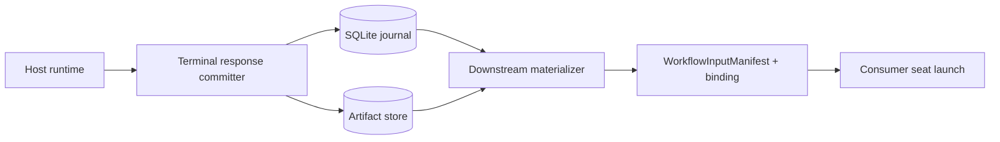
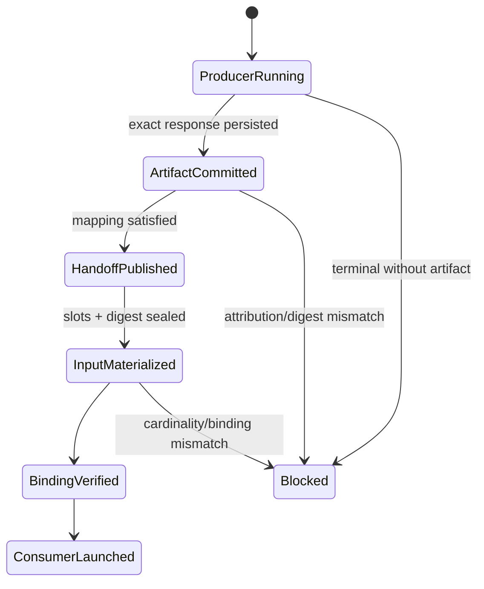

# Architecture Bundle: Bounded Terminal-Output Handoff

## Design intent

Replace caller-attributed path binding with host-attributed terminal-response evidence. The smallest coherent unit is: terminal response capture → content-addressed commit → accepted artifact receipt → slot materialization → verified binding → downstream launch.

## 1. Context view

The agent returns its response once. No agent moves bytes between folders or authors producer attribution.

## 2. Capability view

- `TerminalResponseCommit`: captures the exact host-observed terminal bytes and atomically records producer identity, digest, size, and artifact reference.
- `PublishConnectionHandoff`: derives a handoff only after the producer artifact receipt is accepted.
- `MaterializeDownstreamInput`: resolves the pre-confirmed mapping into ordered manifest slots.
- `AuthorizeDownstreamLaunch`: admits launch only when the manifest and binding verify.
- `ConnectedTopologyFence`: keeps the legacy compiler fail-closed until these capabilities are available.

## 3. Concept/type view

`Artifact` owns immutable content plus SHA-256. `HostTerminalResponseArtifact` is the separate producer-turn evidence record and may share one payload artifact with another byte-identical response. `HostTerminalResponseReceipt` binds that evidence to `(dispatch_id, group_id, seat_id, turn_ordinal)`. `SourceToSlotMapping` binds one confirmed L0 consumer slot to the evidence. `WorkflowInputManifest` and `HostWorkflowTurnBinding` seal the ordered input and prerequisite heads.

Important separation: a `Connection` expresses topology; it is not automatically a data dependency. Only a pre-confirmed slot mapping can turn an accepted artifact into consumer input.

## 4. Operation/flow view

1. The host receives the producer's exact terminal response bytes.
2. In one governed commit, the runtime writes content-addressed bytes and a producer-owned receipt, then marks completion against that receipt.
3. The scheduler detects a satisfied, pre-confirmed downstream mapping and publishes a deduplicated handoff keyed by source receipt and connection.
4. The materializer creates ordered slots, recomputes the manifest digest, and creates a downstream binding.
5. The launch gate verifies same parent dispatch, producer terminality, artifact membership, digest/size, cardinality, and binding digest.
6. Only then does the host launch the consumer seat.

Forbidden flows: terminal-state-only satisfaction; caller-supplied repository path as output; mutation of a confirmed mapping; launch with a missing required slot; treating an order-only connection as data.

## 5. State view

Retries with identical identity and bytes return the existing receipt. Divergent bytes for the same producer turn are a conflict. Restart resumes from journaled accepted facts; it never infers success from filesystem presence.

## 6. Dependency/interface view

- Host → runtime: exact terminal response bytes plus the already-bound producer turn identity.
- Runtime → artifact store: immutable content-addressed write.
- Runtime → journal: artifact receipt, lifecycle transition, handoff, delivery, and binding identities.
- Materializer → Stage F bridge: `WorkflowInputManifest` with ordered slots and exact source digests.
- Stage F bridge → host launch: verified binding receipt.

The artifact reference is versioned. Stage F may consume it as a bounded compatibility seam; future ACI materialization may adopt the same reference shape, but the two evidence claims remain distinct.

## Significant behavior scenario

In the L0 scenario, one producer finishes and its exact response bytes are finalized. Producer-turn evidence and receipt commit once. One pre-confirmed mapping materializes exactly one required slot for one consumer. The consumer is not launchable until its manifest, binding, visibility policy and prerequisite heads verify. A crash after any commit resumes from accepted facts without duplicating the launch intent. Multi-producer review fan-in is deferred to L2.

## Triggered extensions

- Authority/trust: host observation plus producer-turn binding is the only attribution authority.
- Security/abuse: reject path substitution, digest drift, cross-parent producer, stale turn, and forged receipt.
- Persistence/concurrency: artifact and receipt commit must not expose a receipt without durable bytes; all downstream identities are idempotent.
- Failure/compensation: partial states remain non-launchable; recovery is replay, not rollback of immutable artifacts.
- Integration/versioning: introduce `HostTerminalResponseArtifact@1`; reject unsupported versions.
- Migration/rollout: first ship capture and verification dark, then enable materialization for one sequential topology; retain the compiler fence elsewhere.
- Quality: replay must produce the same receipts, manifests, digests, and launch count.

## Planned validation contracts

| Witness | Expected design obligation |
| --- | --- |
| TOH-001 | Exact host response produces an attributable immutable artifact receipt. |
| TOH-002 | Arbitrary repository path cannot satisfy `binding-output`. |
| TOH-003 | Terminal producer without committed artifact leaves consumer blocked. |
| TOH-004 | Digest or size drift fails verification. |
| TOH-005 | Identical retry returns the existing receipt and binding. |
| TOH-006 | Restart publishes/materializes once. |
| TOH-007 | Consumer cannot launch before all required slots exist. |
| TOH-008 | One completed producer response materializes exactly one required consumer slot and authorizes one launch intent. |

These are planned witnesses, not executed evidence.
