# Agent Tools and Delegated Supervision

## Objective

Define the seam by which logical agent-tool proposals could become effective runtime grants, preserve send-only sealed collection, and explore candidate stateless vault reads and session-delegated concrete resolution. Preserve the existing ownership and confirmation boundaries of ACI, APT, the vault, and the workflow without claiming that candidate tool, vault, or delegation contracts are specified or implemented.

**Status:** v0.2.0 — exploratory discovery with one human-ratified skill-to-DAG ownership boundary; all remaining candidate contracts still require their own promotion

**Owner:** @victor

**Companion:** [Agent communication protocols](agents-communication-protocols/README.md) investigates the protocol semantics that ACI Protocol Governance owns through `SkillExecutionProfile`, profile binding, recipe/DAG, and deterministic compilation to a non-authoritative `DispatchCandidate`; ATD-9 closes OQ-ATD3 without transferring capability resolution or execution authority. [Bus contracts](bus-contracts/README.md) owns the draft bus-delivery contract; this discovery owns the tool, vault-read, and delegated-supervision integration seams.

## 1. Business Context

The repository's [orchestration goal](../../../../README.md) is to preserve human judgment while delegating bounded work, so tool and supervision authority must remain inspectable at every handoff.

**Why now**

The protocol discovery proposes immutable skill execution profiles, while draft ACI SPEC aspects describe ratified boundaries for `tool_profile_ref`, effective inputs, publication receipts, and reveal materialization; these documents are not evidence of a live runtime-managed ACI implementation. The live bootstrap workflow distinguishes structural planning from concrete resolution but deliberately stops before delegated execution because no ratified delegation envelope exists ([strategy](../../../../.claude/skills/domainspec-subagents-strategy/SKILL.md) §Confirmation).

**What's broken (as of 2026-07-23)**

- The agent gateway already freezes an exact `tool_profile_ref` and resolves capabilities during draft confirmation, but the corpus lacks integrated ownership and tool-profile guidance that maps the single confirmed capability resolution into a per-attempt representation without creating another grant authority ([interfaces](../specs/interfaces.md) §POST /dispatches/{dispatch_id}/confirm and §Invocation materialization; [domain](../specs/domain.md) §DispatchSpec and §AgentInvocationPlan).
- Scheduler waiting and later-invocation input materialization are already draft-specified; the gap is their integration with proposed logical tools, effective tool-profile representation, and bootstrap delegation evidence, not missing scheduler semantics ([interfaces](../specs/interfaces.md) §External; [queries](../specs/queries.md) §GetVisibleGroupMessages).
- The workflow distinguishes bootstrap proposals from real-dispatch proposals and explicitly defers delegated execution, but the mapping from either workflow lane into draft ACI confirmation remains unsettled ([strategy](../../../../.claude/skills/domainspec-subagents-strategy/SKILL.md) §Two-level).
- The inventory skill defines an optional `.arcanum/inventory/index.json` package when installed, but the current repository has no canonical vault query API or required root registry that ACI can depend on ([inventory](../../../../.claude/skills/inventory/SKILL.md) §Machine-first).
- The current server reads dispatch ledgers and writes only pending confirmation markers; it exposes neither vault selectors nor a durable delegated-resolution receipt (`implementations/server/main.py:1`; `implementations/server/ledger.py:21`).

**What stays the same**

- `DispatchSpec` and runtime resolution remain the executable authority; proposed tools never self-grant.
- During sealed collection, an agent may publish but may not list, search, poll, or read peer contributions.
- Workflow owns resolution provenance; the host/runtime owns source-observation facts; APT owns extraction and research reference-use/check semantics; draft ACI aspects own the proposed runtime mechanics, artifacts, receipts, and journal effects.
- Discoveries remain separate nodes connected by explicit ownership edges instead of being merged into one document.
- File path, line, byte span, symbol, and declaration ordinal remain source locators, not identifiers in a second registry.

## 2. Core Concepts

### SkillExecutionProfile

A candidate immutable profile owned by ACI Protocol Governance that declares a skill's logical tool needs, parameter provenance, response contract, and compilation inputs. The same bounded context owns its digest-bound profile binding, reusable recipe/DAG contract, registry lifecycle, and deterministic compilation into a non-authoritative `DispatchCandidate`; none of these artifacts constitutes an effective runtime grant or authorizes execution.

### AgentToolProfile

A candidate ACI value object, proposed concept ID `agents-communication-infra.AgentToolProfile`, that would represent the per-attempt deterministic materialization of the single authoritative capability resolution already frozen by draft `DispatchSpec`. It would bind one concrete invocation to the resolved tool names, schemas, command classes, permissions, scopes, limits, and enforcement observability used by the runtime, and would be referenced by the existing `AgentInvocationPlan.tool_profile_ref`; it is not an existing ACI contract or a parallel grant record.

### VaultReadAPI

A candidate application service, proposed concept ID `agents-communication-infra.VaultReadAPI`, that would perform bounded, stateless reads over canonical vault files through a minimal recommended four-selector surface. It is neither specified nor implemented and would not require or maintain a registry.

### VaultNodeProjection

A candidate read-model value, proposed concept ID `agents-communication-infra.VaultNodeProjection`, that would project selected frontmatter, body metadata, and `Connections` rows from one eligible vault document together with its content digest and source selector. Current vault conventions define frontmatter and `Connections`; they do not define this projection or a canonical artifact declaration.

### VaultEdgeDeclarationProjection

A candidate raw read-model value, proposed concept ID `agents-communication-infra.VaultEdgeDeclarationProjection`, projected from one `Connections` row. It preserves the declaring source selector, declaration ordinal, observed direction/type/target text, parse residue, and source digest without claiming canonical endpoint identity.

### LogicalVaultEdgeProjection

A candidate deduplicated read-model value, proposed concept ID `agents-communication-infra.LogicalVaultEdgeProjection`, with canonical endpoint keys, a canonical relation key, and every supporting `VaultEdgeDeclarationProjection` selector. Inverse-pair mapping and endpoint canonicalization remain OQ-ATD1.

### VaultSourceSelector

A candidate value object, proposed concept ID `agents-communication-infra.VaultSourceSelector`, that would locate evidence by authorized `VaultSourceSnapshot` digest, repository-relative path, governed selector form, content digest, and projection/parser/canonicalization versions. It is a snapshot-bound locator into canonical source, not a separately governed identity; precedence among line, byte span, symbol, heading, and declaration ordinal remains a SPEC question.

### VaultSourceSnapshot

A candidate value object, proposed concept ID `agents-communication-infra.VaultSourceSnapshot`, that would freeze the authorized roots, resolved paths, file digests, exclusion policy, and snapshot digest used by one paginated vault query. It prevents later pages from silently mixing filesystem states.

### ListVaultArtifacts

A candidate query, proposed concept ID `agents-communication-infra.ListVaultArtifacts`, recommended on the wire as `list_artifacts`; it would scan an authorized frozen source snapshot and return bounded `VaultNodeProjection` results and continuation state.

### GetVaultArtifact

A candidate query, proposed concept ID `agents-communication-infra.GetVaultArtifact`, recommended on the wire as `get_artifact`; it would resolve one snapshot-bound authorized source selector against the supplied `VaultSourceSnapshot` or immutable snapshot reference and return one `VaultNodeProjection` over the exact source bytes and digest, or a typed miss/stale/conflict.

### ListLogicalVaultEdges

A candidate query, proposed concept ID `agents-communication-infra.ListLogicalVaultEdges`, recommended on the wire as `list_edges`; it would return bounded deduplicated `LogicalVaultEdgeProjection` results with all supporting raw declaration selectors.

### GetLogicalVaultEdge

A candidate query, proposed concept ID `agents-communication-infra.GetLogicalVaultEdge`, recommended on the wire as `get_edge`; it would resolve one snapshot-bound logical edge key plus projection/parser/canonicalization versions and an optional expected logical-projection digest against the supplied `VaultSourceSnapshot` or immutable snapshot reference. It would return canonical endpoints/relation plus ordered supporting raw declaration selectors, or a typed miss/stale/conflict; internal list/get access to `VaultEdgeDeclarationProjection` may support implementation but does not add a fifth public selector.

### DelegatedResolutionEnvelope

A future value object, concept ID `agents-communication-infra.DelegatedResolutionEnvelope`, that would bind a user's session-scoped delegation to one structural proposal revision, allowed resolution dimensions, constraints, expiry, and gate requirements. It is a proposed SPEC settlement and is not implemented.

### DelegatedResolutionPolicy

A future policy, concept ID `agents-communication-infra.DelegatedResolutionPolicy`, that would decide whether a supervising orchestrator's concrete resolution remains inside a confirmed delegation envelope. It is not current runtime authority.

### DelegatedGateRequirement

A future value object, concept ID `agents-communication-infra.DelegatedGateRequirement`, that would declare which human or deterministic confirmations remain mandatory before registration or execution. It is not implemented.

### DelegatedResolutionEvaluated

A future non-authoritative evidence event or artifact, proposed concept ID `agents-communication-infra.DelegatedResolutionEvaluated`, that could record the exact envelope, concrete proposal revision and digest, evaluator, and policy result. It cannot confirm, authorize, register, or launch a dispatch; producer, aggregate ownership, idempotency, and persistence shape remain deferred to SPEC.

The bootstrap workflow concepts `DiscoveryBootstrapStructuralProposal` and `DiscoveryBootstrapConcreteProposal`, the real-dispatch workflow concepts `StructuralGraphProposal`, `ConcreteDispatchProposal`, and `ResolutionProvenance`, plus the draft-specified ACI concepts `PublicationCandidate`, `PublicationReceipt`, `VerifyPublicationReceipt`, `Contribution`, `GetVisibleGroupMessages`, `ConfirmedDispatch`, `DispatchSpec`, and `EffectiveInputArtifact`, are referenced as their owners define them; this discovery does not redefine them or claim they share implementation status.

Current maturity is deliberately split into independent lanes:

| Status | Concepts or boundary | Meaning here |
|---|---|---|
| `implemented-live` | Audit/dispatch ledger reader, pending marker/sheet surface, validated appender boundary, and session bootstrap workflow | Current operational lane; user delegation remains non-durable bootstrap workflow evidence. |
| `draft-specified` | Runtime-managed ACI aspects for `ConfirmRuntimeDispatch`, `ConfirmedDispatch`, `DispatchSpec`, `PublicationCandidate`, `PublicationReceipt`, `VerifyPublicationReceipt`, accepted `Contribution`, `GetVisibleGroupMessages`, and `EffectiveInputArtifact` | Draft specification lane containing ratified boundaries; not a claim that the runtime exists. |
| `specified-bounded-slice; not-implemented` | `SkillExecutionProfile`, its profile binding and recipe/DAG, the compiler contract, and `DispatchCandidate` | ACI Protocol Governance ownership is ratified by ATD-9 and the bounded schemas, canonicalization and compilation behavior are promoted in `specs/protocol-compilation.md`; persistent lifecycle and implementation remain absent. |
| `candidate` | `AgentToolProfile`, all `Vault*` and four vault-query concepts, `DelegatedResolutionEnvelope`, `DelegatedResolutionPolicy`, `DelegatedGateRequirement`, `DelegatedResolutionEvaluated` | Discovery recommendations pending SPEC settlement; none may be described as runtime-available. |
| `absent` | Runtime-managed ACI implementation evidenced by this corpus, durable delegated-resolution authority, implemented vault API, generic peer inbox | No current implementation claim is permitted. |

## 3. Ownership-Link Integration

The three discoveries remain separate because each contributes orthogonal information:

| Owner | Owns | This discovery's integration rule |
|---|---|---|
| ACI Protocol Governance, informed by the protocol discovery | `SkillExecutionProfile`, digest-bound profile binding, reusable recipe/DAG, their registry lifecycle, and deterministic compilation through `DispatchCandidate` | Own the protocol-level compilation contract under ATD-9 while keeping every compiler output non-authoritative until the existing confirmation boundary accepts a concrete dispatch. |
| ACI confirmation boundary and runtime contracts | Effective semantic capability resolution, `ConfirmRuntimeDispatch`, `ConfirmedDispatch`, `DispatchSpec`, `Run`, publication verification, journal, reveal and `EffectiveInputArtifact` | Own effective semantic capability resolution and retain the sole confirmation/runtime-effect authority; protocol compilation cannot grant capabilities, confirm, register, launch or execute. |
| This ATD discovery and its draft contracts | Candidate per-attempt `AgentToolProfile` schema, canonicalization and deterministic materialization seam | Preserve OQ-ATD4 only as the candidate representation of capability resolution already frozen by ACI confirmation, never as a capability-resolution or grant owner. |
| Bus-contract discovery | Sealed collection, publish-before-ack, group close/reveal, later materialization | Keep collection send-only and delivery scheduler-mediated. |
| Host/runtime plus APT discovery | Host/runtime-owned `SourceObservation`; APT-owned `ExtractionProvenance`, `ResearchReferenceUse`, `ReferenceCheck`, and their observation mappings | Map attributed research semantics without letting APT self-stamp observed access or create another bus/ledger. |
| Live workflow and discovery-writing | Session proposals, current confirmation modes, `ResolutionProvenance`, pending sheets, validated appender handoff | Hold non-durable proposal, resolution, and user-delegation evidence in the bootstrap lane. |
| Vault conventions | Current frontmatter fields and declared `Connections` rows | Supply the only current convention evidence from which a candidate projection could be designed. |

Under ATD-1, the new discovery therefore adds ownership links, not copied definitions. Its future SPEC must use ACI events and artifacts for durable effects while importing APT-owned provenance semantics by reference.

Under ATD-9, ACI Protocol Governance owns the reusable protocol chain from `SkillExecutionProfile` through its digest-bound binding and recipe/DAG to deterministic `DispatchCandidate` production. Workflow may carry only digest-bound references or non-authoritative proposal projections; the ACI confirmation boundary owns effective semantic capability resolution, while this discovery and its draft contracts retain only candidate `AgentToolProfile` schema, canonicalization and deterministic materialization. Only the confirmation/runtime lane may turn a candidate into executable authority.

## 4. Proposed and Effective Tool Authority

Under ATD-9, ACI Protocol Governance compiles the digest-bound `SkillExecutionProfile`, binding, and recipe/DAG only as far as a deterministic `DispatchCandidate`. That candidate and the applicable lane's concrete proposal may describe requested logical capabilities: `DiscoveryBootstrapConcreteProposal` for this unregistered discovery bootstrap, or `ConcreteDispatchProposal.proposed_capability_profile` for a real dispatch. They may say that a seat needs `bus_publish`, candidate `list_artifacts`, or another declared tool, but they cannot state that the tool is available, credentialed, enforced, confirmed, or executable.

Draft ACI already requires `ConfirmRuntimeDispatch` to resolve adapter/model/tool capabilities server-side while processing the final confirmation request, persist the immutable `capability_resolution_ref`, and freeze the resolved adapter/model/tool decisions and digests as `DispatchSpec.capability_resolution` ([interfaces](../specs/interfaces.md) §POST /dispatches/{dispatch_id}/confirm; [domain](../specs/domain.md) §DispatchSpec). ATD-2 adopts that existing draft requirement; it does not introduce a second extension or confirmation boundary. The referenced artifact bytes and inline `DispatchSpec.capability_resolution` projection must have one authoritative canonical capability-resolution digest, and required resolution failure creates neither `ConfirmedDispatch` nor `Run`.

After confirmation, each attempt may only deterministically refine/represent that single frozen resolution as the candidate `AgentToolProfile`, then map its immutable reference to the existing `AgentInvocationPlan.tool_profile_ref`. This per-attempt materialization occurs before the launch fence and cannot choose new semantic tools, permissions, providers, adapters, or fallback behavior. A profile may have a projection-integrity digest and attempt binding, but those do not become another grant digest or parallel authority; they must cite and verify the authoritative `capability_resolution_ref` and digest. The candidate profile should record:

| Field family | Required meaning |
|---|---|
| Identity | profile ID, version, digest, invocation/attempt binding |
| Tools | exact tool names and schemas, including wire-selector versions |
| Authority | command classes, repository/domain scope, write/network/sandbox permissions |
| Limits | calls, bytes, tokens, time, result cardinality, continuation bounds |
| Enforcement | `observable` or `non_observable`, plus the observed provider/adapter/runtime semantics |
| Provenance | proposal/profile inputs and workflow-owned `ResolutionProvenance`; mapped APT `ExtractionProvenance` or source/reference evidence only when those semantics apply |

Required and optional capability semantics must be explicit in the capability resolution frozen by the confirmed `DispatchSpec`. A missing required capability, or unverifiable enforcement of a required restriction, rejects confirmation when discovered during semantic resolution and otherwise blocks launch during deterministic verification. Optional degradation is permitted only when that degraded alternative was explicitly frozen in the confirmed resolution; the runtime cannot silently reclassify a required capability as optional.

An observable semantics-changing mismatch between the frozen resolution and materialized profile fails closed. When effective enforcement is not observable, the runtime reports the gap and does not describe requested providers, adapters, models, or tools as effective. A new attempt may rematerialize and reverify only the same frozen semantics; any semantic tool or authority change re-enters `ConfirmRuntimeDispatch` with a newly confirmed proposal and `DispatchSpec` through a future ratified reconfiguration gate.

## 5. Send-Only Collection and Later Materialization

Under ATD-3, in the draft-specified bus lane, `bus_publish` is the only peer-communication tool exposed during a sealed collection turn. After `publication.persisted`, the ACI boundary has a `PublicationCandidate(status=active)` and returns a `PublicationReceipt(status=persisted_candidate)`; neither object is yet an officially accepted contribution.

`bus_publish` is send-only. It does not return peer content, group state, search results, listener handles, or a subscription cursor. The collecting invocation ends after its work is published; there is no long-idle listener and no generic peer inbox.

The required lifecycle is:

1. `bus_publish` completes `publication.persisted`, yielding `PublicationCandidate(status=active)`;
2. the boundary returns `PublicationReceipt(status=persisted_candidate)`;
3. `VerifyPublicationReceipt` verifies the durable candidate and receipt and performs the guarded compare-and-set `active → officially_accepted`;
4. only that successful transition produces the official `Contribution`;
5. only accepted contributions may participate in collection completion, followed by `collection.closed`;
6. reveal authorization produces a `reveal.published` manifest;
7. the scheduler uses that manifest and internal `GetVisibleGroupMessages` to materialize a later invocation's `EffectiveInputArtifact`.

There is no edge from `PublicationCandidate`, `PublicationReceipt`, or an unverified contribution directly to quorum, release, or reveal. Waiting belongs to the scheduler/runtime described by the draft ACI aspects. Delivery changes the input of a new invocation, not the authority or prompt template of an already running collector.

## 6. Stateless Canonical Vault Reads

The bounded 2026-07-23 inspection in §9 was performed as a read-only `helper_probe`: it found the named registry and index candidates explicitly absent and found no canonical vault query API in the scoped server/source basis. This acquisition was not a `tool_probe`, the proposed bus-backed `reference-probe`, a runtime receipt, or a host/runtime `SourceObservation`; its bounded, non-global limitations remain explicit in §9. The compatible discovery recommendation is therefore a candidate stateless scanner over authorized canonical roots. An installed inventory may later accelerate discovery, but its `index.json` remains a read model and cannot become required authority for these queries.

The following four names are a minimal candidate surface, not a proven or versioned wire contract:

| Candidate wire selector | Proposed DomainSpec query | Required input | Result |
|---|---|---|---|
| `list_artifacts` | `ListVaultArtifacts` | authorized `VaultSourceSnapshot` or immutable snapshot ref, filters, limit, continuation | bounded `VaultNodeProjection` results |
| `get_artifact` | `GetVaultArtifact` | authorized snapshot/ref plus one snapshot-bound `VaultSourceSelector` and optional expected projection digest | one `VaultNodeProjection` or typed miss/stale/conflict |
| `list_edges` | `ListLogicalVaultEdges` | authorized snapshot/ref, endpoint/relation filters, projection/parser/canonicalization versions, limit, continuation | bounded deduplicated `LogicalVaultEdgeProjection` results with supporting declaration selectors |
| `get_edge` | `GetLogicalVaultEdge` | authorized snapshot/ref plus snapshot-bound logical edge key, projection/parser/canonicalization versions, and optional expected logical-projection digest | one `LogicalVaultEdgeProjection` with supporting declaration selectors, or typed miss/stale/conflict |

Under ATD-4, every selector receives the same authorized snapshot bytes or immutable snapshot reference; there is no direct-get bypass that rereads the live filesystem. Direct gets apply the same authenticated principal, authorized roots, admission, privacy, exclusion, size, and disclosure context as lists. Unless that policy explicitly authorizes existence disclosure, absent and disallowed targets share a non-enumerating typed result.

A logical edge is a snapshot-scoped projection identity, not a durable registry identity. Its complete identity scope is `(snapshot_digest, projection_schema_version, parser_version, canonicalization_version, canonical_source_endpoint_key, canonical_relation_key, canonical_target_endpoint_key)` after the versioned inverse-pair rule has normalized direction. `get_edge` supplies that tuple and may supply `expected_logical_projection_digest`; a changed version/snapshot or source selector returns typed `selector_stale`/`snapshot_conflict`, while unequal projection bytes under the same claimed identity return `projection_conflict`.

`list_artifacts` sorts by normalized repository-relative path. `list_edges` sorts by `(canonical_source_endpoint_key, canonical_relation_key, canonical_target_endpoint_key)`; each logical edge's supporting declarations sort by `(normalized_repository_relative_path, declaration_ordinal, source_content_digest)`. The declaration ordinal is calculated by the versioned parser over admitted `Connections` rows in source order, including malformed rows preserved as typed residue, so duplicate declarations remain stable and inspectable.

Every continuation is opaque to clients but binds the selector name, canonical filters, requested limit, admission/privacy policy digest, projection/parser/canonicalization versions, full canonical request digest, frozen snapshot manifest/digest, and last emitted complete sort key. Resume is strictly after that key within the same materialized snapshot; a changed request, limit, policy, version, snapshot, or cursor yields typed `continuation_mismatch`, `selector_stale`, `snapshot_conflict`, or `snapshot_unavailable`, never a rescan or mixed-state page.

SPEC fixtures must mutate, add, remove, and symlink-retarget files between page requests and prove stable artifact and logical-edge ordering, stable supporting-declaration order, no duplicate/omitted declarations within one snapshot, authority-root confinement, direct-get/list authorization parity, optional expected-digest conflict detection, continuation mismatch rejection, typed unavailable/stale/conflict outcomes, and bounded limits. Reads remain subject to the effective `AgentToolProfile` root, privacy, size, and cardinality limits.

Under ATD-5, raw path, line, byte span, symbol, heading, and ordinal answer “where was this declaration observed?” They do not mint a second artifact or edge registry. Logical edge deduplication is a reversible projection over those raw declaration selectors. If source bytes change, a stale digest yields a typed stale/conflict or privacy-preserving miss rather than silently retargeting the selector.

## 7. Two-Level Confirmation and Delegated Supervision

The workflow first separates the unregistered bootstrap from actual dispatches. This discovery bootstrap uses only `DiscoveryBootstrapStructuralProposal` and `DiscoveryBootstrapConcreteProposal`; those objects authorize the bounded session workflow, never become real-dispatch sheets, never receive an `ExecutionAuthorityMode`, and never enter either execution branch. A real dispatch uses `StructuralGraphProposal` and `ConcreteDispatchProposal`.

Under ATD-6, every real dispatch selects exactly one immutable `ExecutionAuthorityMode` before confirmation, and that choice creates exclusive branches:

| Exclusive branch | Confirmation authority | Opening and execution path | Forbidden crossover |
|---|---|---|---|
| `legacy-managed` (current live dispatch/session lane) | workflow final confirmation over the concrete real-dispatch sheet | final confirmation → live `register-dispatch` append → session-owned scheduling/execution → current close append | no `ConfirmRuntimeDispatch`, `ConfirmedDispatch`, runtime `Run`, or `AuditLedgerMaterializer` traversal |
| `runtime-managed` (future draft-specified ACI lane) | `ConfirmRuntimeDispatch` | draft confirmation → `ConfirmedDispatch`/`DispatchSpec` and exactly one `Run` → `AuditLedgerMaterializer` exact opening through the existing validated appender → runtime-owned scheduling/execution behind `ExecutionAuthorityFence` | no live `register-dispatch`/session execution traversal |

The current legacy/session route is a predecessor to, and remains outside, the future ACI runtime-confirmation boundary: `legacy-managed` deliberately avoids `ConfirmRuntimeDispatch` and produces no ACI `ConfirmedDispatch` or runtime `Run`. The future materializer may reuse the existing validated appender port, but that shared physical writer does not join the branches: it consumes runtime journal `EffectIntent`, not the live session's confirmed sheet. A dispatch cannot execute legacy/session work and then “handoff” into a runtime `Run`, nor can a runtime-managed dispatch fall back through `register-dispatch`; rollback applies only to not-yet-confirmed future dispatches. A chat acknowledgment, pending-sheet marker, supervising-orchestrator statement, envelope evaluation, or policy result is not draft ACI runtime confirmation.

Under ATD-7, a user may currently state that a supervising orchestrator should resolve concrete details for this discovery session. That statement remains bootstrap workflow evidence and may guide `DiscoveryBootstrapConcreteProposal`; it neither becomes a real-dispatch `ConcreteDispatchProposal` nor transfers authority into the draft ACI lane. Any later real dispatch re-enters its own proposal and confirmation path, selects one authority mode, and follows only that mode's execution branch; `structure_only` never authorizes execution.

The future `DelegatedResolutionEnvelope` could make the resolution evidence durable. It should bind:

- the user/session and structural proposal revision plus digest;
- allowed and forbidden concrete-resolution dimensions;
- provider, model, tool, source, budget, privacy, and topology constraints;
- expiry, reuse count, and revocation semantics;
- the `DelegatedGateRequirement` set;
- the supervising orchestrator identity and evaluated `DelegatedResolutionPolicy` version.

The future policy should reject any resolution outside the envelope, any semantic change to frozen structure, and any missing required gate. A successful evaluation may create immutable, non-authoritative `DelegatedResolutionEvaluated` evidence referenced by the input to `ConfirmRuntimeDispatch`; only that existing operation may produce the authoritative `ConfirmedDispatch` and `DispatchSpec` in the `runtime-managed` branch. Runtime opening and launch remain fenced on those ACI authorities and verified materializer output, never on the envelope or evaluation evidence; the `legacy-managed` branch does not consume this draft ACI evidence.

Exact envelope mapping, policy order, producer/aggregate ownership, revocation race and compare-and-set behavior, expiry, reuse, retry, receipt, replay, and proposal-invalidation mechanics remain SPEC settlements.

## 8. APT Semantics Through ACI Effects

Under ATD-8, workflow and discovery-writing own `ResolutionProvenance`: who proposed or resolved a workflow value, from which proposal revision, and under which session-local gate. The host/runtime owns `SourceObservation` facts because an agent cannot self-stamp trusted access. APT owns `ExtractionProvenance`, `ResearchReferenceUse`, `ReferenceCheck`, and the mappings that relate those attributed research facts to host/runtime observations. Draft ACI aspects define how an effective profile, publication, receipt, input artifact, confirmed dispatch, and journal entry would be validated and persisted.

The mapping seam keeps these namespaces distinct. Workflow `ResolutionProvenance` may reference APT evidence when a resolved value was derived from a research extraction or checked source, but it does not absorb or redefine that evidence. The APT records retain extraction authorship, attributed use, selector, and evaluation; the linked host/runtime `SourceObservation` retains observed access. Those semantics may travel by reference inside artifacts and events proposed by the draft ACI lane.

The APT adapter remains subordinate to the ACI append boundary, just as its discovery requires; it does not write a parallel bus, dispatch ledger, tool registry, or vault-edge registry. Source locators remain evidence selectors, while ACI artifact/event IDs remain durable runtime identities.

## 9. Source Snapshot and Bounded Repository Inspection

The historical acquisition basis for v0.1.x is the following exact 2026-07-23 path-to-SHA-256
snapshot. Bindings are by path, never table position; these hashes are not claims about current
workspace bytes.

| Repository-relative path | SHA-256 |
|---|---|
| `.claude/skills/domainspec-subagents-strategy/SKILL.md` | `ca836620345733808a9c9080c9cc92c109bcb04e9a34767dd4e0bd6619e6c78d` |
| `.claude/skills/discovery-writing/SKILL.md` | `902d0730d19f31c4d6e50fdb0d3a8e79afb4b8d87e209485911a076ee74c1762` |
| `.claude/skills/inventory/SKILL.md` | `da87d1ed5def4e246aee01a941fd6d2cbec6e7a44e1a7a5b5901b7a9c9676645` |
| `docs/features/agents-communication-infra/discovery/agents-communication-protocols/README.md` | `e365aa804f82b280c13b12a48e69931c103ab736db632a5c5070f621e6d3f02a` |
| `docs/features/agents-communication-infra/discovery/bus-contracts/README.md` | `70d587a0f5252d44dabe42cfc030e0e41730bf3c9d6e920908be2b2625c517d6` |
| `docs/features/agents-communication-infra/specs/interfaces.md` | `56bd400ea9d8df2f511e6a8f5dbda5ab10936c9d1f8e572db94b9c226b05fe1f` |
| `docs/features/agents-communication-infra/specs/domain.md` | `3bcdfd9f33b8dd41ace1b084fe78205a4a0f263a02d715dc4a781f5e67de3fe5` |
| `docs/features/agents-communication-infra/specs/queries.md` | `6702da6a8637130f1094c426e63ea4409bdcbf63994f8c5f339ce031d6c410bd` |
| `docs/features/agents-communication-infra/specs/workflows.md` | `f99e2ad7008003d8ca11cce06f955a909f48d5dcafb69c1f2ca408edcc3bc4f1` |
| `docs/features/agent-provenance-telemetry/discovery/session-dispatch-research-records.md` | `9bb4104a4ed99ac23ae1bd0029abc49399d0198d858925f9de0b2d80c6896277` |
| `docs/features/agent-provenance-telemetry/probes/reference-probe-tool.md` | `176141abecfc68750dbe0ddae9547f5093af36cdc6b800b1db29c3b5201873a3` |
| `vault/ontology-conventions.md` | `04124df6842c367437bf43c9321320f420a0712f5b17b910602c4335dd39d0ef` |
| `implementations/server/main.py` | `f839c0cb80d1a9a2e0d8b0d7897af8f704f8e3e9fee6c7c9913095db61306a07` |
| `implementations/server/ledger.py` | `7db977c553a8a96251a5d5c429ecf20493747b7378c1c8e636b66ec7b73ba7ba` |

The v0.2.0 ownership amendment uses this separate evidence snapshot:

| Repository-relative path | Version / decision | SHA-256 |
|---|---|---|
| `docs/decisions/aci-protocol-governance-ownership.md` | `ACI-PG-001`, accepted 2026-08-03 | `7ba61f22e13fc9277de56406b6a924ff4de3f51682f78fbcbdf31897327d493f` |
| `docs/features/agents-communication-infra/discovery/agents-communication-protocols/README.md` | `0.5.0` | `9c5a1338b5d098c1f770e8e455366ad546f076a25ebe59317c4b96159c2435ed` |

On 2026-07-23, a bounded read-only `helper_probe` checked `docs/registry.md`; `.arcanum`, `.arcanum/inventory`, and `.arcanum/inventory/index.json`; root vault candidates `vault/index.{md,json,yaml,yml}` and `vault/registry.{md,json}`; depth-two vault files named `index`, `registry`, or `catalog`; the `.claude` inventory contract and validator; and route/function/API terms in `implementations/server/main.py` and `implementations/server/ledger.py`. Its durable location is this §9 source-snapshot and inspection record. It was a workflow acquisition helper, not a `tool_probe`, the proposed bus-backed `reference-probe`, a runtime receipt, or a host/runtime `SourceObservation`. The named `docs/registry.md`, `.arcanum*`, and root vault index/registry candidates were explicitly absent. The inventory contract instead defines `.arcanum/inventory/` as an install-time default and its machine index as a non-authority read model; the scoped server implements dispatch/ledger reads and a pending confirmation marker.

The inspection did not exhaust every repository file, dependency, branch, generated artifact, plugin, deployment, or external service. Accordingly, “no vault API” means only that no canonical vault query API was evidenced in the 14-source basis or the scoped current server/API inspection; it is not a repository-global or ecosystem-global proof of nonexistence. The `.claude/skills/inventory/scripts/validate-index-json.sh` observation supports the bounded absence/context check but is not promoted into the durable 14-source basis.

## 10. Validation and Alternatives

The delivery proposal validator did not select a dedicated acquisition probe, because the supplied ACI protocol, bus, interface, domain, query, and workflow sources already settle the send-only and materialization boundary. The canonical-query validator required a narrower vault-only question; the resulting repository inspection found no canonical registry or vault API, supporting exploration of a four-selector stateless surface rather than a new indexed authority. The names and mechanics remain candidate pending SPEC.

Alternatives rejected:

| Alternative | Why rejected |
|---|---|
| Merge protocol, bus, provenance, and tool discoveries | Erases ownership and creates overlapping truth. |
| Treat proposed tools as effective grants | Lets workflow text self-authorize runtime capabilities. |
| Keep collectors alive to poll a peer inbox | Violates sealed collection and the later-input-artifact contract. |
| Require `.arcanum/inventory/index.json` | Makes an optional inventory package a hidden runtime dependency. |
| Create canonical node and edge registries from raw locators | Duplicates vault source files and their current `Connections` rows, introducing synchronization drift. |
| Treat session delegation as durable authority | Claims an envelope, policy, event, and receipt that do not yet exist. |
| Store APT extraction/source/reference provenance in a separate runtime ledger | Duplicates ACI's durable append boundary. |

## Open Questions

### OQ-ATD1 — Vault Wire Contract

**Question:** Who owns the canonical vault-root declaration, and what versioned request/response and parser schemas make the candidate `list_artifacts`, `get_artifact`, `list_edges`, and `get_edge` surface safe and deterministic? Settlement must cover eligible, ignored, hidden, and symlinked files; root/path normalization and escape rules; selector precedence; malformed or duplicate documents and `Connections` rows; broken edge targets; projection fields; snapshot authorization/reference lifetime; logical-edge identity scope; list sort keys; supporting-declaration ordering; cursor resume semantics; declaration-ordinal calculation; endpoint and relation canonicalization; inverse-pair mapping; privacy/admission policy parity for direct gets and lists; typed errors; pagination; limits; and mutation between pages.

**Recommendation:** assign a single canonical-root policy owner; version the shared wire envelope, Markdown/frontmatter/`Connections` parser, node/raw-declaration/logical-edge projection schemas, canonicalization/inverse catalog, and ordinal algorithm; require every list or get to carry the same authorized `VaultSourceSnapshot` or immutable snapshot ref and admission/privacy context; define logical-edge identity exactly as snapshot digest plus projection/parser/canonicalization versions and the normalized source/relation/target tuple; sort artifacts by normalized repository-relative path, logical edges by their normalized source/relation/target tuple, and supporting declarations by normalized path, declaration ordinal, then source digest. Preserve malformed rows and broken targets as typed residue rather than silently dropping them; bind every continuation to selector, canonical filters, limit, policy and schema versions, canonical request digest, frozen snapshot manifest/digest, and the last complete sort key, resuming strictly after that key. Require `get_edge` to carry the snapshot-bound logical key and versions plus an optional expected logical-projection digest; reject root escape, disallowed hidden files, symlink retargeting, stale selectors, expected-digest drift, changed limits/policy/versions, snapshot unavailability, and mixed snapshots with closed typed outcomes. Preregister duplicate same-direction rows, inverse-pair declarations, supporting-order ties, broken targets, malformed content, privacy non-enumeration, direct-get/list parity, all stale/conflict classes, mutation-between-pages, and cursor replay/mismatch fixtures before accepting the four names as sufficient.

**Settlement stage:** Preregistered experiment → SPEC.

### OQ-ATD2 — Delegated Evidence and ACI Confirmation

**Question:** How should a future `DelegatedResolutionEnvelope`, policy evaluation, and non-authoritative `DelegatedResolutionEvaluated` evidence map into `ConfirmRuntimeDispatch` while handling revocation races/compare-and-set, expiry and reuse, retry/receipt/replay, and structural-versus-concrete proposal invalidation?

**Recommendation:** preserve `ConfirmRuntimeDispatch` as the sole authority boundary; make envelope evaluation immutable evidence referenced by its input; bind revisions and digests; require compare-and-set against revocation/expiry state; define reuse and idempotency explicitly; and prove that structural changes invalidate every derived concrete/evaluation artifact while concrete-only changes preserve only still-matching structural evidence.

**Settlement stage:** SPEC.

### OQ-ATD3 — Skill Profile Ownership (closed and ratified)

**Status:** settled by human decision on 2026-08-03. ACI Protocol Governance owns the
`SkillExecutionProfile`, its digest-bound profile binding and reusable recipe/DAG, their registry
lifecycle, and deterministic compilation through a non-authoritative `DispatchCandidate`.

**Recommendation:** the bounded v1 profile/binding/recipe schemas, canonicalization, calculation and
invalidation lineage are now promoted by `specs/protocol-compilation.md`. Keep workflow limited to
digest-bound references or non-authoritative proposal projections; defer registry lifecycle and
candidate-to-confirmation mapping; keep effective semantic capability resolution owned by the ACI
confirmation boundary; keep only candidate `AgentToolProfile` schema, canonicalization and
deterministic materialization in this discovery and its draft contracts; and require the existing
confirmation/runtime boundary before any candidate can become executable authority.

**Settlement evidence:** [ACI-PG-001](../../../decisions/aci-protocol-governance-ownership.md).
Ownership is ratified and the bounded v1 schemas/calculation are promoted; registry lifecycle,
candidate-to-`DispatchSpec`, capability resolution and runtime operations remain pending.

### OQ-ATD4 — Capability Resolution and Attempt Profiles

**Question:** What versioned schema, canonicalization and deterministic materialization rules govern the candidate per-attempt `AgentToolProfile` representation of effective semantic capability resolution already frozen by the ACI confirmation boundary, including the single authoritative digest, exact compatibility/migration mapping, semantic-equivalence test, attempt binding, effective-enforcement observability, closed failure vocabulary, idempotency/retry, and concurrent final-confirmation behavior?

**Recommendation:** preserve the current draft fields without inventing a parallel grant record: `ConfirmRuntimeDispatch.capability_resolution_ref` identifies immutable canonical resolution bytes, `DispatchSpec.capability_resolution` is the compiled authoritative representation of those same bytes/decisions, and both verify against one `capability_resolution_digest`. The existing `AgentInvocationPlan.tool_profile_ref` should reference the candidate deterministic per-attempt `AgentToolProfile`, whose `source_capability_resolution_ref` and `source_capability_resolution_digest` map back exactly to that authority; its attempt/projection digest proves representation integrity only. For compatibility, readers should accept the current inline `DispatchSpec.capability_resolution`; a future ref-backed schema may replace storage of the inline body only after dereferencing and canonicalizing to the same digest, while a transition document carrying both must reject inequality and never merge them. Writers should emit one selected representation per schema version, preserve the existing `tool_profile_ref` field name, and migrate cached/per-attempt profiles by rematerializing from the frozen resolution rather than copying an independent grant. Make semantic equivalence a named versioned policy rather than digest coincidence; bind attempt, provider/adapter, sandbox, permissions, required/optional classification, and observability evidence; reject missing required capabilities and unverifiable required restrictions closed; use idempotency plus compare-and-set so concurrent confirmations cannot freeze different resolutions; and preregister inline-current, ref-backed-migration, dual-form-equal, dual-form-conflict, required-success, required-missing, optional-confirmed-degradation, retry, lost-response, concurrency, and semantic-drift fixtures.

**Settlement stage:** Preregistered experiment → SPEC.

## Decisions Baked In

| ID | Decision | Where |
|---|---|---|
| ATD-1 | Keep protocol, bus, APT, vault, and this discovery separate and ownership-linked. | §3 |
| ATD-2 | Reuse the semantic capability resolution already required by draft `ConfirmRuntimeDispatch` as the single authority in `DispatchSpec`; candidate `AgentToolProfile` only represents its deterministic per-attempt materialization through existing `AgentInvocationPlan.tool_profile_ref`, with compatibility/equivalence left to OQ-ATD4. | §4 |
| ATD-3 | Keep `bus_publish` send-only and require candidate persistence, receipt verification, official contribution acceptance, collection close, reveal manifest, then scheduler materialization. | §5 |
| ATD-4 | Explore a minimal stateless four-selector vault-read surface in which every list/get is snapshot-bound under one authorization/privacy context and public edge reads return versioned, deduplicated logical edges with ordered supporting declarations; the supporting acquisition was the bounded, non-global `helper_probe` durably recorded in §9, not a `tool_probe`, bus-backed `reference-probe`, runtime receipt, or `SourceObservation`; schemas and sufficiency remain OQ-ATD1. | §6 |
| ATD-5 | Treat raw path, line, byte, symbol, heading, and ordinal data as source locators. | §6 |
| ATD-6 | Preserve the bootstrap seam and require each real dispatch to choose one exclusive `ExecutionAuthorityMode`: the current predecessor `legacy-managed` route uses workflow final confirmation → live `register-dispatch`/session execution and produces no ACI `ConfirmedDispatch` or `Run`; only future `runtime-managed` crosses `ConfirmRuntimeDispatch` → exactly one `ConfirmedDispatch` plus `Run` → verified `AuditLedgerMaterializer` opening/runtime execution; no dispatch traverses both. | §7 |
| ATD-7 | Treat current user delegation as non-durable workflow evidence; future envelope evaluation stays non-authoritative and must enter the existing ACI confirmation boundary. | §7 |
| ATD-8 | Keep workflow `ResolutionProvenance` separate from APT extraction/source/reference semantics while mapping both by reference into ACI-owned durable effects. | §8 |

### Post-v0.1.1 amendments

| ID | Decision | Where | Amends / motivated by |
|---|---|---|---|
| ATD-9 | Assign ACI Protocol Governance ownership of `SkillExecutionProfile`, digest-bound profile binding, reusable recipe/DAG, their registry lifecycle, and deterministic compilation through non-authoritative `DispatchCandidate`; retain effective semantic capability resolution with the ACI confirmation boundary; retain only candidate `AgentToolProfile` schema, canonicalization and deterministic materialization in ATD and its draft contracts; and reserve execution authorization to the existing confirmation/runtime boundary. | §3, §4; OQ-ATD3 | Closes OQ-ATD3 after the human ownership decision; refines the ownership seam established by ATD-1 while leaving ATD-2 and ATD-6 unchanged. |

## Connections

| Document | Type | Description |
|---|---|---|
| [Agent communication protocols](agents-communication-protocols/README.md) | `depends-on` | Supplies investigated protocol semantics; under ATD-9, ACI Protocol Governance owns the profile/binding/recipe-DAG registry lifecycle and compilation through non-authoritative `DispatchCandidate`. |
| [ACI-PG-001 ownership decision](../../../decisions/aci-protocol-governance-ownership.md) | `derives-from` | Settles OQ-ATD3 without transferring capability resolution or execution authority. |
| [Bus contracts](bus-contracts/README.md) | `depends-on` | Supplies sealed collection, publish-before-ack, reveal, and later-invocation materialization. |
| [ACI interfaces](../specs/interfaces.md) | `depends-on` | Supplies the draft-specified agent gateway and sole runtime confirmation boundary that candidate seams must preserve. |
| [ACI domain](../specs/domain.md) | `depends-on` | Supplies draft-specified runtime authorities; this discovery only proposes candidate additions. |
| [ACI queries](../specs/queries.md) | `depends-on` | Reuses internal `GetVisibleGroupMessages` solely for authorized reveal materialization. |
| [ACI workflows](../specs/workflows.md) | `depends-on` | Supplies draft-specified collection, close, reveal, receipt-verification, and effective-input sequencing. |
| [Session–Dispatch–Research records](../../agent-provenance-telemetry/discovery/session-dispatch-research-records.md) | `depends-on` | Supplies APT-owned extraction/source/reference semantics and the subordinate-adapter boundary. |
| [Reference-probe tool](../../agent-provenance-telemetry/probes/reference-probe-tool.md) | `contextualizes` | Provides proposal-level evidence for bounded publish, reveal, receipt, delivery, and source locators; it does not implement this discovery. |
| [Vault conventions](../../../../vault/ontology-conventions.md) | `depends-on` | Supplies current frontmatter and `Connections` conventions only; the candidate node projection and scanner remain unsettled. |
| [Dispatch control-plane server](../../../../implementations/server/main.py) | `contextualizes` | Shows that current confirmation is a pending marker, not a delegated-resolution receipt. |
| [Ledger reader](../../../../implementations/server/ledger.py) | `contextualizes` | Shows the current append-only dispatch reader boundary and absence of vault/delegation APIs. |

The protocol discovery now points back to this companion. Pending inverse-edge updates remain for the bus-contract discovery, ACI SPEC documents, APT discovery, and vault conventions; the reference-probe proposal may add an inverse `exemplifies` edge to this discovery. Those companion edits are intentionally outside this writer invocation.

## Flow Diagram

```mermaid
flowchart LR
    SP[SkillExecutionProfile schema candidate; ACI Protocol Governance owner] --> PB[Digest-bound profile binding]
    PB --> RD[Reusable recipe/DAG candidate]
    RD --> COMP[Deterministic protocol compilation]
    COMP --> DC[Non-authoritative DispatchCandidate]
    DC -. proposal input only .-> BCP[DiscoveryBootstrapConcreteProposal]
    BSP[DiscoveryBootstrapStructuralProposal] --> BCP
    DE[Current user delegation evidence] -. bootstrap only .-> BCP
    BCP --> BWE[Bootstrap workflow evidence only]
    DC -. candidate input only .-> CP[ConcreteDispatchProposal]
    SG[StructuralGraphProposal] --> CP
    CP --> MODE{Exclusive ExecutionAuthorityMode}
    MODE -->|legacy-managed current predecessor; no ACI confirmation or Run| FCR[Workflow final confirmation]
    FCR --> RDR[Live register-dispatch append]
    RDR --> SESS[Session-owned execution and close append]
    MODE -->|runtime-managed future; sole ACI runtime-confirmation lane| CRT[Draft ConfirmRuntimeDispatch with existing semantic capability resolution]
    CRT -->|success freezes one authority digest| CD[ConfirmedDispatch and DispatchSpec plus Run]
    CRT -->|resolution failure| NR[Reject confirmation and create no run]
    CD --> ALM[AuditLedgerMaterializer via validated appender]
    ALM --> ATP[AgentInvocationPlan tool_profile_ref to candidate per-attempt AgentToolProfile]
    ATP --> LF[Runtime ExecutionAuthorityFence and launch]
    SG -. revision binding .-> ENV[DelegatedResolutionEnvelope candidate]
    ENV -. non-authoritative evaluation .-> DRE[DelegatedResolutionEvaluated candidate]
    DRE -. evidence only .-> CRT
    LF --> INV[Sealed collection invocation]
    INV -->|bus_publish then publication.persisted| PC[PublicationCandidate status active]
    PC --> PR[PublicationReceipt status persisted_candidate]
    PC --> VPR[VerifyPublicationReceipt CAS active to officially_accepted]
    PR --> VPR
    VPR --> CON[Officially accepted Contribution]
    CON --> CC[collection.closed]
    CC --> RM[reveal.published manifest]
    RM --> SCH[Scheduler and input materialization]
    SCH -->|GetVisibleGroupMessages| EIA[EffectiveInputArtifact]
    EIA --> NEXT[New invocation]
    ATP -. candidate representation .-> VRA[VaultReadAPI candidate]
    VRA -. all four selectors carry snapshot or ref .-> VSS[Authorized VaultSourceSnapshot candidate]
    VSS -. reads .-> VS[Canonical vault sources]
    VS -. projects .-> VNP[VaultNodeProjection]
    VS -. projects rows .-> VED[VaultEdgeDeclarationProjection]
    VED -. versioned identity and ordered support .-> LE[LogicalVaultEdgeProjection]
    RP[Workflow ResolutionProvenance] -. referenced by .-> CP
    SO[Host runtime SourceObservation] -. observed access mapping .-> APT[APT extraction and reference semantics]
    APT -. mapped by reference .-> RP
    APT -. referenced by .-> CON
    APT -. referenced by .-> EIA
```

ACI Protocol Governance owns deterministic compilation from the profile/binding/recipe-DAG chain only through a non-authoritative `DispatchCandidate`; compilation itself has no path to launch. The bootstrap proposal pair terminates in workflow evidence. A real dispatch selects one immutable authority mode: the current legacy/session predecessor route avoids `ConfirmRuntimeDispatch` and produces no ACI `ConfirmedDispatch` or `Run`, while only the future draft ACI branch crosses `ConfirmRuntimeDispatch` and creates exactly one `ConfirmedDispatch` plus `Run` before verified audit opening and runtime execution. In that runtime branch, per-attempt tool profiles only represent the single frozen capability resolution, and every candidate vault selector is bound to one authorized snapshot while logical edges retain ordered supporting declarations.

## Appendix — Changelog

| Version | Date | Changes |
|---|---|---|
| 0.2.0 | 2026-08-03 | Closes OQ-ATD3 by human ratification: ACI Protocol Governance owns profile/binding/recipe-DAG lifecycle and deterministic compilation through non-authoritative `DispatchCandidate`; the ACI confirmation boundary owns effective semantic capability resolution; ATD and its draft contracts retain only candidate `AgentToolProfile` schema, canonicalization and deterministic materialization. No implementation is claimed, OQ-ATD4 remains open on that representation seam, and ATD-1 through ATD-8 remain unchanged. |
| 0.1.1 | 2026-07-23 | Clarifies the exclusive runtime-only ACI confirmation lane and records the bounded repository acquisition explicitly as a `helper_probe` with its durable location and limitations; ATD-1 through ATD-8 remain otherwise unchanged. |
| 0.1.0 | 2026-07-23 | Initial integrated discovery under review; separates bootstrap, real-dispatch, and draft ACI lanes; records exact candidate/receipt acceptance states; splits raw and logical vault-edge projections; adds capability-resolution OQ-ATD4; and settles ATD-1 through ATD-8 only at seam level. |

**Source basis:** [domainspec subagent strategy](../../../../.claude/skills/domainspec-subagents-strategy/SKILL.md); [discovery writing](../../../../.claude/skills/discovery-writing/SKILL.md); [inventory](../../../../.claude/skills/inventory/SKILL.md); [agent communication protocols](agents-communication-protocols/README.md); [bus contracts](bus-contracts/README.md); [ACI interfaces](../specs/interfaces.md); [ACI domain](../specs/domain.md); [ACI queries](../specs/queries.md); [ACI workflows](../specs/workflows.md); [session dispatch research records](../../agent-provenance-telemetry/discovery/session-dispatch-research-records.md); [reference probe tool](../../agent-provenance-telemetry/probes/reference-probe-tool.md); [vault ontology conventions](../../../../vault/ontology-conventions.md); [control-plane server](../../../../implementations/server/main.py); [ledger reader](../../../../implementations/server/ledger.py)
