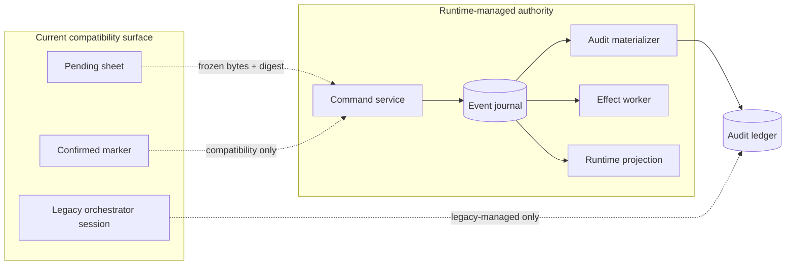
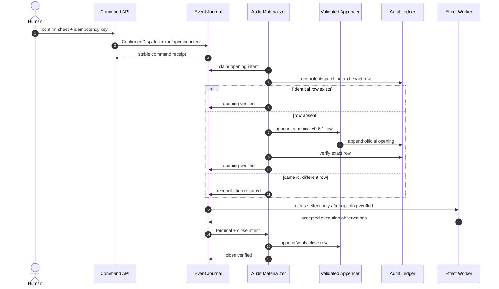
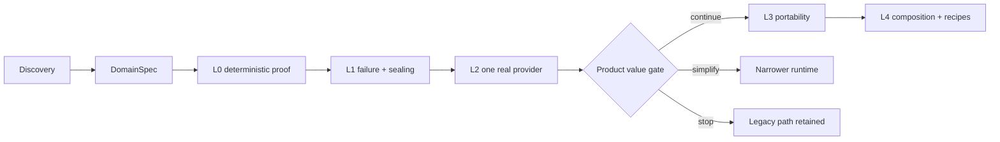
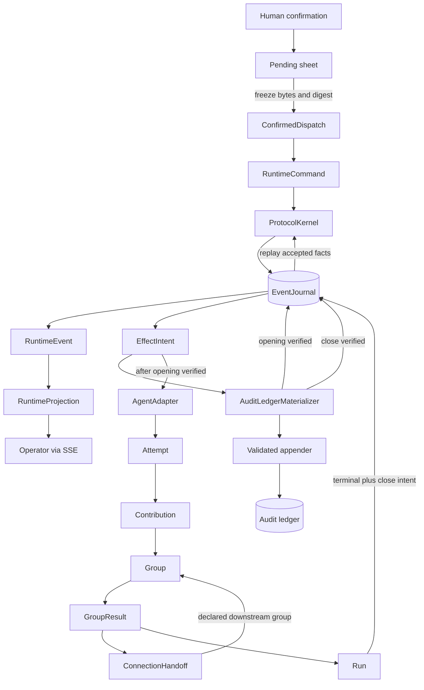

# Discovery — Agents Communication Infra

## Objective

Move the existing human-gated, skill-led dispatch discipline into a single-host recoverable runtime while preserving the audit ledger's authorization boundary. The end state accepts one immutable confirmed dispatch, persists its runtime facts, starts effects only after verified audit opening, and reaches one officially closed outcome that can be reconstructed after restart. Provider portability, richer deliberation and reusable recipes extend this same contract rather than creating parallel runtimes.

**Status:** v0.1.1 — synthesized from the candidate feature architecture, implemented Phase-2 confirmation seam, executable bus-publication probe, engine constitution and draft/blocked planning boundary; runtime claims remain candidate until ratified and proven by their gates.  
**Owner:** @victor  
**Companion:** [`../README.md`](../README.md) owns the full target architecture, including group protocol, bus, connection and adapter semantics in §§4–6; this discovery owns the migration problem, candidate concept seams and decision/OQ trace that the future SPEC will ratify.

## 1. Business Context

This feature serves the repository's central goal of making multi-agent judgment explicit, human-gated and auditable, as described in the project [README](../../../../README.md#what-is-this).

### Why now

The operational dispatch discipline exists, and the control plane can already receive human confirmation, but execution still depends on an active Claude session noticing an ephemeral marker and manually conducting registration, agents and close. This prevents restart recovery, deterministic protocol state and provider-neutral execution, so further communication features would otherwise accumulate on a session-owned seam rather than a runtime-owned one.

### What's broken (as of 2026-07-21)

1. `implementations/server/main.py:229` implements confirmation by writing a `.confirmed` marker only; it does not create an immutable run or accepted runtime event.
2. `docs/features/agents-communication-infra/phase-2-confirm-handoff.md` §“Arming the watch” assigns marker consumption to a live orchestrator session, not a durable worker.
3. `implementations/server/main.py:279` serves full disk-derived snapshots over SSE; it has no ordered runtime cursor or gap-recovery contract.
4. `implementations/server/ledger.py:388` reads pending sheets and historical audit rows but no runtime journal can reconstruct commands, attempts, transitions or messages.
5. `.claude/skills/register-dispatch/append-dispatch.cjs:358` and `:378` treat an existing identity as an idempotent no-op without proving that the existing row is content-identical; a materializer therefore needs an independent exact-row reconciliation check.
6. `vault/constitution/engine-constitution.md:153` and `:376` keep EG-1 at medium veracity because historical close rows bypassed the validated appender and no sole-writer guard exists yet.
7. `implementations/server/` contains a reader/control-plane server but no kernel, event journal, durable effect outbox, provider adapter contract or recovery loop.

### Explicit capability gaps after the publication probe

The executable bus-publication probe validates append-before-ack publication, receipt verification,
idempotency, logical uniqueness and late-publication rejection in a constrained JSONL/MCP setup. It
does **not** make those mechanisms production runtime capabilities. As of 2026-07-21, the following
remain unimplemented or unproven:

- a complete runtime that owns confirmed runs, protocol transitions, effects and terminal outcomes;
- the production SQLite/WAL schema and atomic transactions for command receipts, events, aggregate
  heads and outbox intents;
- end-to-end recovery after process or host failure, including unknown external effects,
  reconciliation and resumable observation;
- authorized reveal and delivery of sealed contributions between agents after the collection
  barrier closes;
- strong sandbox, credential and tool-capability isolation that fails closed independently of
  prompt compliance;
- safe concurrency for multiple publishers or worker processes while retaining one controlled
  physical writer boundary per authoritative store;
- a Codex CLI adapter integrated with the runtime, native MCP bus injection and mandatory
  parent-side receipt acceptance;
- provider portability demonstrated by a second adapter and by mixed-provider runs without kernel
  or event-schema forks;
- immutable persistence and aggregation of model usage and cost observations by attempt, operation,
  seat, group, run and dispatch.

These are delivery gaps, not claims that every item belongs in the first slice. The wave gates in
§6 determine their order: persistence and deterministic fake adapters precede recovery and sealing;
those precede the first real provider, telemetry validation, provider portability and composition.

### What stays the same

- Human confirmation remains explicit; silence and marker existence alone never authorize a runtime-managed dispatch.
- The current audit ledger remains the permanent high-level record of official opening and closing; historical rows are not rewritten or revalidated.
- The validated appender remains the **intended mandatory boundary** for the audit ledger's only physical writer, governed by [`engine-constitution.md`](../../../../vault/constitution/engine-constitution.md) §EG-1. Its exclusivity is not yet proven: materializer cutover remains blocked until the historical drift is traced and a sole-writer guard exists.
- The lenient historical reader, aggregate semantics and computed-field namespace remain owned by the same constitution and current `ledger.py` implementation.
- Pending JSON remains the current editable pre-confirm surface during migration; today it stays mutable until the legacy session consumes it. Freezing exact bytes/digest at runtime confirmation is a target change defined in §4, not current behavior.
- The existing [Phase-2 confirm handoff](../phase-2-confirm-handoff.md) remains the owner of current marker semantics. This feature touches it through a compatibility adapter and does not redefine the legacy session loop.
- Decision-science claims about bias/noise reduction remain owned by [`anti-noise-orchestration.md`](../../../../vault/hypothesis/anti-noise-orchestration.md); this discovery defines execution guarantees, not statistical independence.
- Multi-host workers, high availability, multi-tenancy, arbitrary executable recipes, mutating code workflows and autonomous knowledge promotion are out of this discovery's initial delivery boundary.

## 2. Core Concepts

| Concept | Meta-type | What it does | Design rationale |
|---|---|---|---|
| `ConfirmedDispatch` | Entity | Immutable, digested version of the human-approved dispatch input. | Separates editable intent from the exact authorization used by a run. |
| `Run` | Entity | Owns the lifecycle of one confirmed dispatch version. | Prevents a mutable sheet or marker from doubling as runtime state. |
| `RuntimeCommand` | Operation | Requests one authorized state change with identity, digest and expected version. | Makes retries distinguishable from conflicting reuse. |
| `RuntimeEvent` | Event | Records an immutable accepted fact that reducers can replay. | Replay must reduce facts rather than re-run decisions or effects. |
| `AggregateVersion` | Value Object | Provides contiguous per-aggregate compare-and-set ordering. | Makes concurrent command conflicts explicit. |
| `JournalOffset` | Value Object | Orders accepted events within the local journal stream. | Gives queries and future realtime cursors a stable position without using timestamps as authority. |
| `EventJournal` | Interface | Atomically accepts events, aggregate-head changes and effect intents. | Keeps workflow authority in one recoverable local transaction. |
| `EffectIntent` | Entity | Durable request for an external or cross-store effect. | Prevents replay from invoking the appender, provider or tool directly. |
| `AuditLedgerMaterializer` | Workflow | Projects verified opening and close rows through the current appender. | Preserves the sole-writer rule while handling the SQLite/YAML consistency gap. |
| `ReconciliationState` | Enum | Distinguishes pending, already-applied, divergent and repair-required projections. | A partial failure must remain visible instead of silently authorizing execution. |
| `AgentAdapter` | Interface | Normalizes start, events, result, cancel and status across providers. | Provider behavior stays outside the kernel state machine. |
| `ProtocolKernel` | State Machine | Applies finite, deterministic lifecycle and group transitions. | Coordination remains reproducible without making a model the protocol authority. |
| `RuntimeProjection` | Query | Reconstructs operator-facing run state from accepted facts. | UI/SSE can be rebuilt and never become a second source of truth. |
| `ExecutionAuthorityMode` | Enum | Assigns a dispatch to `legacy-managed` or `runtime-managed` execution. | Prevents the marker watcher and the new worker from executing the same dispatch. |
| `DispatchSpec` | Value Object | Carries the immutable executable graph, participants, policies and resolved capabilities for one run. | Keeps authoring inputs separate from the protocol instance consumed by the kernel. |
| `Group` | Entity | Owns one bounded stage of agent participation and its protocol state. | Gives quorum, rounds and result commitment one aggregate boundary. |
| `Seat` | Entity | Represents one logical participation slot independent of physical retries or replacement agents. | Prevents retries from counting as extra judgments. |
| `Attempt` | Entity | Records one physical execution of a logical adapter operation. | Separates provider retries from logical contributions. |
| `Contribution` | Entity | Stores one accepted position or vote for a seat, round and message type. | Makes uniqueness and reveal policy enforceable without interpreting prose. |
| `GroupResult` | Entity | Commits the protocol verdict, participants, quorum, dissent and payload references for a group. | Preserves protocol evidence separately from any narrative synthesis artifact. |
| `ConnectionHandoff` | Workflow | Delivers one committed group result to a declared downstream group. | Makes inter-stage delivery deduplicable and replayable. |
| `DeliberationBus` | Interface | Accepts and reveals authorized messages according to principal, group and phase. | Agents publish logically without becoming physical journal writers. |

These names are intended to survive into the DomainSpec registry as `agents-communication-infra.<ConceptName>` unless SPEC authoring finds a concrete collision. Detailed semantics for `Group`, `Seat`, `Contribution`, `GroupResult`, `ConnectionHandoff` and `DeliberationBus` remain owned by the companion [`README`](../README.md) §§4–6; this discovery declares their migration seams rather than a competing protocol definition.

## 3. Authority and Data Boundaries

ACI-D1 establishes that the feature owns one runtime, while ACI-D2 separates its stores by the facts they are allowed to own.

| Boundary | Owns | Does not own | Physical writer |
|---|---|---|---|
| Command service + journal | Confirmed runtime intent, accepted transitions, attempts, messages and effect intents | Official audit rows or knowledge promotion | Journal writer |
| Audit ledger | Official confirmed opening and terminal outcome | Runtime transitions, messages or provider details | Existing validated appender |
| Adapter | Observations and execution mechanics for one provider attempt | Run/group state decisions | Provider-specific worker through command boundary |
| Projection/SSE | Reconstructible read state and cursors | Workflow authority | Projection reducer/materializer |
| Pending/marker compatibility | Editable draft and legacy transport signal | Immutable confirmation or runtime state | Current control-plane compatibility surface |



The dashed join from the current surface is `ConfirmedDispatch.digest`. ACI-D9 requires mode ownership to be selected before execution, so the session and worker never consume the same dispatch.

## 4. Confirmation, Execution and Cross-Store Consistency

ACI-D3 freezes confirmation; ACI-D4 makes the journal the workflow authority; ACI-D5 and ACI-D6 preserve the audit writer and verified-opening barrier.



The journal transaction can make event append, aggregate version and effect intent atomic locally, but it cannot transact with the YAML audit ledger. ACI-D11 therefore brings a minimal durable materialization and reconciliation path into the first proof: a crash after physical append but before journal acknowledgement re-reads by identity and exact content; identical counts as applied, divergent becomes `reconciliation_required`.

Externally observable lifecycle states remain distinct:

```text
confirmed
  -> opening_pending
  -> ready
  -> running
  -> execution_terminal
  -> close_pending
  -> closed

opening_pending | close_pending -> reconciliation_required
```

`execution_terminal` means the protocol elected a terminal fact; it does not claim that official close materialization succeeded. Only `closed` carries that claim.

## 5. Kernel, Effects and Extensibility

ACI-D8 uses deterministic fake adapters before real providers so persistence and transition defects cannot hide behind nondeterministic output. The first protocol profile is finite and fixed; its purpose is to prove command/event/effect separation, not product value or statistical independence.

The `ProtocolKernel`, whose richer group semantics remain owned by the companion [`README`](../README.md) §4:

- validates command identity, policy and expected aggregate version;
- derives events and effect intents without performing effects;
- accepts one logical contribution and one terminal winner per declared key;
- treats clock, provider output, timeout, cancellation and human decisions as observations that become events before state depends on them;
- never branches on provider name or semantic workflow type (ACI-D10).

The `AgentAdapter` owns translation into a provider and declares capabilities. A missing capability either rejects the confirmed combination or requires an explicitly reconfirmed spec; it does not silently change protocol semantics. Provider-specific metadata remains namespaced and cannot govern kernel transitions directly.

Later sequential groups and built-in recipes recompose from the same core. `ConnectionHandoff` follows the companion [`README`](../README.md) §6, while bus visibility follows its §5:

```text
ConfirmedDispatch
  -> finite group graph
  -> kernel operations
  -> adapter effects
  -> committed group result
  -> deduplicated handoff
  -> terminal Run
```

Generic user recipes, `feedback`, `zig-zag`, mutating tools and distributed workers remain outside the initial contract because they introduce independent supply-chain, authority and recovery decisions.

## 6. Phases and Honest Gates

The discovery fixes decision boundaries rather than implementation tasks. Each gate asks what is learned before adding the next source of uncertainty. ACI-D7 constrains the initial proof and pilot to one host and one tenant; distribution is not an implicit requirement of these gates.



| From → To | Mandatory criteria |
|---|---|
| Discovery → SPEC | Decisions ACI-D1–ACI-D11 are traced; OQ recommendations are ratified, amended or explicitly deferred; concept names and authority seams are preserved. |
| SPEC → L0 proof | Persistence, terminal, snapshot, decision-rule, exact-row reconciliation and cutover contracts are versioned and testable. |
| L0 → L1 | Replay is pure; duplicate/conflicting commands behave distinctly; crashes converge; no effect precedes verified opening; one terminal and close win. |
| L1 → L2 | Sealing holds across controlled surfaces; races have one allowed terminal; recovery and cursor projection are proven; sandbox/credential boundary fails closed. |
| L2 → product gate | One provider passes the common adapter contract with explicit unknown-effect and resource behavior; evaluation is preregistered. |
| Product gate → L3 | The preregistered quality/dissent benefit meets its cost and latency threshold. |
| L3 → L4 | Second and mixed providers require no kernel, event-schema, store or realtime fork. |
| Any → ESCAPE | Mark affected dispatches `legacy-managed`, disable runtime ownership before confirmation, retain the validated appender flow and open a narrower replacement decision; never run both authorities or reinterpret partial runtime state as legacy success. |

The honest-gate rule is: discovering non-replayability, authority overlap or provider coupling at the current gate costs fixtures and local migration; discovering it one phase later costs audit repair, provider effects and potentially ambiguous user-visible outcomes. Promotion therefore stops on the earlier falsifier even when later functionality appears to work.

## 7. Open Questions

The source architecture's IDs remain canonical for cross-document traceability. Discovery IDs split them into ratifiable questions as follows:

| Source question | Discovery question | Settlement owner |
|---|---|---|
| `OQ-PERSISTENCE` | OQ-ACI1 and OQ-ACI7 | SPEC persistence contract |
| `OQ-STREAM` | OQ-ACI1 | SPEC event/journal contract |
| `OQ-DECISION` | OQ-ACI2 | SPEC policy/state contract |
| `OQ-TERMINAL` | OQ-ACI3 | SPEC terminal mapping |
| `OQ-SNAPSHOT` | OQ-ACI4 | SPEC domain/event contract |
| `OQ-LEDGER-CONSISTENCY` | OQ-ACI5 | SPEC mapping/workflow contract |
| New migration seam from Phase 2 | OQ-ACI6 | SPEC operation/interface contract |

### OQ-ACI1 — Persistence boundary

**Question:** Which SQLite/WAL schema and transaction boundary govern command receipts, events, aggregate heads and effect intents?  
**Recommendation:** Use one local SQLite database in WAL mode, one writer boundary, a global integer `JournalOffset`, per-aggregate contiguous `AggregateVersion`, and one transaction for command receipt + events + head + effect intents. Use `same idempotency key + same command digest` as replay and a different digest as permanent conflict.  
**Settlement:** Ratify or amend in SPEC `persistence-and-replay`; implementation must not choose implicitly.

### OQ-ACI2 — Initial decision rule

**Question:** How does the fixed two-seat proof distinguish verdict, explicit dissent and missing quorum?  
**Recommendation:** Require two valid contributions; matching votes commit, conflicting valid votes commit an explicit dissent outcome, and a missing/invalid contribution is no quorum rather than dissent. Do not generalize this rule beyond the proof profile.  
**Settlement:** Ratify in SPEC `states`/`operations`; richer quorum policies remain later decisions.

### OQ-ACI3 — Terminal mapping

**Question:** How do attempt, group and run terminal facts map to the audit ledger's five `exit_reason` values?  
**Recommendation:** Attempt and group terminals never map directly to the audit ledger; they remain journal facts until one run terminal wins. Use this closed run-level rule: committed positive, negative or qualified result → `resolved`; committed irreconcilable dissent → `dissent_irreconcilable`; bounded protocol/round ceiling, including timeout with no technical fault and no quorum, → `loop_ceiling_reached`; explicit human cancellation → `user_abort`; exhausted provider retries, corrupted state, resource/budget exhaustion that prevents a valid protocol outcome, or other technical prevention → `error`. A partial result is `resolved` only when policy explicitly commits it as the qualified result; otherwise it follows the terminal cause above.  
**Settlement:** Ratify the full cause/level/precedence matrix in SPEC and enumerate negative fixtures before close materialization code.

### OQ-ACI4 — Frozen input snapshot

**Question:** Which external inputs must be captured for auditable reduction without promising deterministic model output?  
**Recommendation:** Freeze the confirmed sheet bytes/digest, schema and recipe/profile versions, decision policy, prompt/snapshot references, fake/adapter version and capability resolution. Record clock/provider/tool observations as later events rather than pretending they were reproducible inputs.  
**Settlement:** Ratify in SPEC `domain`/`events`.

### OQ-ACI5 — Audit-ledger reconciliation

**Question:** What proves that an opening or close was already applied after a crash?  
**Recommendation:** Compare the existing identity and canonical row content against the row derived from the frozen authority. Identical is acknowledged; absent invokes the existing appender and verifies afterward; divergent enters `reconciliation_required` and never releases effects or official closure.  
**Settlement:** Ratify in SPEC `mappings`/`workflows`; this blocks L0 rather than waiting for the broader L1 reconciler.

### OQ-ACI6 — Legacy/runtime cutover

**Question:** How is dual execution prevented while marker-based sessions remain available?  
**Recommendation:** Assign `ExecutionAuthorityMode` before confirmation. Runtime-managed confirmation freezes the sheet and makes the marker a compatibility projection ignored by legacy watchers; legacy-managed dispatches never create a runtime `Run`. Cleanup of sheet/marker is a retryable compatibility effect after verified opening.  
**Settlement:** Ratify in SPEC `operations`/`interfaces` and preserve a tested rollback to legacy mode.

### OQ-ACI7 — Journal durability setting

**Question:** Which SQLite synchronous policy is accepted for the proof and pilot?  
**Recommendation:** Start with `synchronous=FULL` for every transaction in the proof/pilot event journal; measure the cost before considering `NORMAL`. Any relaxation requires fault evidence and an explicit decision because it changes the replay/durability claim for the entire transaction, not only authorization or terminal rows.  
**Settlement:** Ratify in SPEC `persistence-and-replay` and revisit only at a measured performance gate.

## Decisions Baked In

This is a **candidate baseline**, not a ratified decision record. Status `candidate` means the source architecture proposes the decision; `required-boundary` means an existing constitution requires the boundary but its enforcement evidence is incomplete. The DomainSpec writer must ratify, amend or keep each row open with an authority citation; no row here authorizes implementation while the work-pack gate is blocked.

| ID | Candidate decision | Status | Source authority | Where |
|---|---|---|---|---|
| ACI-D1 | `agents-communication-infra` owns the target runtime; no parallel runtime feature is created. | candidate | Feature README §§2–3; user-selected planning boundary | §3 |
| ACI-D2 | Journal, audit ledger, adapters, projections and pending compatibility own disjoint facts. | candidate | Feature README §§8–9 | §3 |
| ACI-D3 | Human confirmation freezes an immutable `ConfirmedDispatch` with a digest. | candidate | Feature README §3 target flow | §4 |
| ACI-D4 | The event journal is workflow authority; replay reduces persisted facts only. | candidate | Feature README §§4, 9 | §4 |
| ACI-D5 | The current validated appender is the required sole physical audit-ledger writer; cutover waits for the missing enforcement evidence. | required-boundary | Engine constitution EG-1, veracity medium | §3–§4 |
| ACI-D6 | No provider/tool effect starts before verified official opening. | candidate | Feature README §9.1 | §4 |
| ACI-D7 | The initial runtime is single-host and single-tenant. | candidate | Feature README §§1.1, 12 | §6 |
| ACI-D8 | Deterministic fake adapters precede any real provider. | candidate | Feature README §12 | §5 |
| ACI-D9 | Each dispatch has exactly one execution authority mode during migration. | candidate | Phase-2 seam plus work-pack cutover guard | §3, §7 OQ-ACI6 |
| ACI-D10 | Provider and business workflow types do not create kernel branches. | candidate | Feature README §§3–4 | §5 |
| ACI-D11 | Minimal durable outbox/materializer reconciliation is part of L0 because SQLite and YAML cannot share a transaction. | candidate amendment | Feature README §9.1 plus work-pack L0 reconciliation gap | §4 |

The IDs become locked when a downstream SPEC cites discovery v0.1.0; locking preserves traceability, not candidate status. Later decisions must be appended as versioned amendments rather than renumbering ACI-D1–ACI-D11.

## Connections

| Document | Type | Description |
|---|---|---|
| [`../README.md`](../README.md) | derives-from | Target architecture, invariants, MVP slices and original open-question register. |
| [`../phase-2-confirm-handoff.md`](../phase-2-confirm-handoff.md) | derives-from | Implemented confirmation marker seam and legacy session ownership. |
| [`../../../../vault/constitution/engine-constitution.md`](../../../../vault/constitution/engine-constitution.md) | governed-by | Audit-ledger writer, historical-reader and authority-boundary rules. |
| [`../IMPLEMENTATION-LAYERING.md`](../IMPLEMENTATION-LAYERING.md) | informs | Decision layers and promotion evidence that this discovery explains without turning into tasks. |
| [`../WORK-PACK.md`](../WORK-PACK.md) | informs | Existing executable plan consumes this discovery after DomainSpec ratification. |

## Flow Diagram



Leia o fluxo a partir da confirmação humana, que congela o `ConfirmedDispatch` e entrega o `RuntimeCommand` ao `ProtocolKernel`. O `EventJournal` registra `RuntimeEvent` e `EffectIntent`, enquanto o `AuditLedgerMaterializer` verifica a abertura oficial antes de liberar o `AgentAdapter`. As contribuições formam um `GroupResult`, que pode seguir por `ConnectionHandoff` ou levar o `Run` ao terminal e à materialização do fechamento. `RuntimeProjection` expõe ao operador somente estado reconstruível, e o replay devolve fatos aceitos ao kernel sem repetir efeitos.
