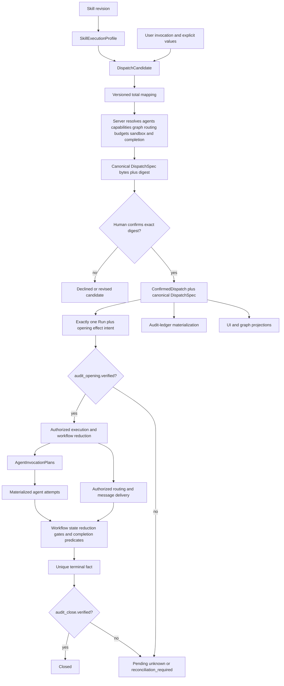

# Agents Communication Protocols — Discovery

## Objective

Definir, para a futura lane `runtime-managed`, como uma skill contribui semântica reutilizável para
uma estrutura concreta que o usuário inspeciona e confirma, e como essa mesma autoridade canônica
persistida origina todas as projeções, configurações de agentes e ações da infraestrutura sem
depender do agente do chat durante a run. A lane live `legacy-managed` permanece fora desse boundary
e conserva a autoridade de workflow/session definida pelo contrato de cutover.

**Status:** v0.6.0 — discovery draft para a futura lane `runtime-managed`; a decisão de ownership de protocol compilation está ratificada, enquanto a decomposição candidata de `DispatchSpec`, schemas, lifecycle persistente e runtime permanecem sujeitos à promoção e aos gates indicados abaixo

**Owner:** @victorboscaro

**Owner email:** `victorboscaro@outlook.com`

**Companion:** ACI confirmation owns effective capability resolution; [Agent Tools and Delegated Supervision](../agent-tools-and-delegated-supervision.md) documents the candidate per-attempt tool-profile materialization seam without owning grants or resolution. [Bus Contracts](../bus-contracts/README.md) owns routing, visibility and work-message delivery; [Dispatch Audit-Ledger Cutover](../dispatch-audit-ledger-cutover-contract.md) owns YAML materialization and migration boundaries.

## 1. Business Context

O [objetivo do repositório](../../../../../README.md) é manter o trabalho dos agentes conectado à
intenção, às decisões e às evidências que o tornam significativo; isso exige que a estrutura
confirmada pelo usuário seja a mesma autoridade transportada até a execução.

**Why now**

O fluxo atual permite descrever grupos, connections, agentes e prompts, mas ainda depende do agente
do chat para interpretar retornos, decidir follow-ups e coordenar transições. Ao mesmo tempo, a
discovery v0.3.0 distribuía autoridade entre `SkillExecutionProfile`, `recipe_ref` e `DispatchSpec`,
impedindo uma resposta inequívoca à pergunta: “qual objeto exato o usuário confirmou e a
infraestrutura executou?”.

**What's broken (as of 2026-08-04)**

- A v0.3.0 chamava `recipe_ref` de autoridade única sobre grafo, mensagens, ferramentas e resultados,
  mas depois atribuía a execução aos bytes confirmados do `DispatchSpec`
  (`agents-communication-protocols/README.md` v0.3.0, §§ “Ownership e precedência propostos” e
  “Onboarding quando o perfil não existe ou é incompatível”).
- O compilador atual materializa apenas launches iniciais com prompts e `turn_ordinal: 0`; ele não
  percorre um grafo autônomo (`implementations/server/runtime/dispatch_workflow.py:57`).
- Antes da decisão humana de 2026-08-03, a compilação, o registry e o lifecycle do
  `SkillExecutionProfile` permaneciam sem owner assentado
  ([Agent Tools and Delegated Supervision](../agent-tools-and-delegated-supervision.md) §OQ-ATD3).
- O contrato de routing exige um plano imutável derivado da autoridade confirmada, mas a tabela
  normativa atual de `DispatchSpec` ainda não declara um campo fechado para essa estrutura; a
  v0.3.0 também repetia partes da semântica como se pertencessem ao protocolo da skill
  ([Bus Contracts](../bus-contracts/README.md) §H5; [ACI Domain](../../specs/domain.md) §DispatchSpec).
- O audit ledger possui regras próprias de autoridade e cutover; tratá-lo apenas como uma view ou
  como a fonte da execução apagaria a separação vigente entre fatos runtime e registro oficial
  (`dispatch-audit-ledger-cutover-contract.md:14`; [Dispatch Audit-Ledger
  Cutover](../dispatch-audit-ledger-cutover-contract.md) §§Decision–Authority matrix).
- A interface draft atual recebe bytes de uma pending sheet e compila/finaliza um `DispatchSpec` na
  confirmação; ela ainda não prova que a estrutura visualizada antes do aceite e a estrutura
  persistida/executada são literalmente a mesma projeção canônica
  (`specs/interfaces.md:51`; [ACI interfaces](../../specs/interfaces.md) §POST /dispatches/{dispatch_id}/confirm).
- O `DispatchSpec` vigente tipa `group_graph`, `decision_policies`, `capability_resolution` e
  `budgets` apenas como `object`; não existe schema fechado que diga como nodes e edges do
  `DispatchCandidate` viram participantes, grants, routing ou estados executáveis
  (`docs/features/agents-communication-infra/specs/domain.md:452`; [ACI Domain](../../specs/domain.md) §DispatchSpec).
- O fixture v1 de `DispatchCandidate` contém os nodes `work` e `done`, a edge `work_to_done` e
  `terminal_node_ids: ["done"]`, mas não atribui executor a nenhum node. Portanto, ele prova a
  topologia candidata, não prova que todo node seja um agente nem que o terminal seja sem executor
  (`docs/features/agents-communication-infra/specs/fixtures/protocol-compilation-v1/candidate.json:1`;
  [candidate fixture](../../specs/fixtures/protocol-compilation-v1/candidate.json)).
- O YAML de telemetria oferece um precedente útil para envelope, grupos, agentes e connections,
  mas é uma superfície legacy de auditoria. Sua estrutura não pode ser adotada como autoridade
  executável sem mapping, schemas e ownership explícitos
  (`telemetry/agents/subagents-dispatch.yaml:6`; [Dispatch Audit-Ledger Cutover](../dispatch-audit-ledger-cutover-contract.md)).

**What stays the same**

- `ConfirmedDispatch`, `DispatchSpec`, `Run`, `AgentInvocationPlan` e a mecânica de confirmação,
  journal, scheduling e execução continuam pertencendo à
  [ACI SPEC](../../specs/domain.md); esta discovery não os redefine.
- Capabilities, providers, tools, permissões, sandbox e sua materialização por attempt continuam
  pertencendo a [Agent Tools and Delegated Supervision](../agent-tools-and-delegated-supervision.md)
  e às interfaces ACI citadas por ela.
- Routing, visibility, publicação, reveal e entrega de mensagens continuam pertencendo a
  [Bus Contracts](../bus-contracts/README.md).
- A escrita e a reconciliação de `telemetry/agents/subagents-dispatch.yaml` continuam pertencendo a
  [Dispatch Audit-Ledger Cutover](../dispatch-audit-ledger-cutover-contract.md); esta discovery
  declara somente o requisito de derivação a partir da autoridade confirmada.
- APT continua observando provenance e lineage sem decidir topologia ou próxima transição.
- Esta alteração ratifica somente o owner da compilação até `DispatchCandidate`; não ratifica
  schemas por si só, não implementa runtime, não habilita recipes arbitrárias ou mutantes e não
  altera skills existentes.

## 2. Core Concepts

### SkillExecutionProfile

Value Object candidato, imutável e ligado a uma revisão exata da skill. Preserva obrigações de
domínio, entregáveis, critérios, espaço válido de decomposição, parâmetros permitidos e requisitos
lógicos de capability; restringe a compilação, mas não autoriza uma run.

### SkillProtocolBinding

Entity candidata append-only que seleciona exatamente uma revisão ativa de
`SkillExecutionProfile` para `(skill_id, skill_revision_digest)`. Ela permite resolver compatibilidade
e histórico sem tornar o perfil uma segunda autoridade executável.

### DispatchCandidate

Value Object candidato e ainda não autorizativo cujo schema v1 contém apenas `schema`,
`source_binding`, `invocation_values`, `nodes`, `edges`, `terminal_node_ids`, `obligation_dispositions`,
`capability_requirements` e `outputs`. Seats/agentes, policies efetivas, budgets, sandbox, routing e
grants não existem nesse objeto; precisam ser resolvidos ou adicionados por regra versionada durante
a futura projeção para `DispatchSpec`. É evidência legível anterior à confirmação, nunca autoridade
executável.

### ConfirmationProjection

Projeção de confirmação produzida pelo servidor depois de resolver capabilities e compilar o
`DispatchCandidate`. Ela contém os bytes canônicos completos do `DispatchSpec`, seu digest e uma
visualização derivada desses mesmos bytes. O usuário confirma esse digest exato; a visualização e o
`DispatchCandidate` que a originou não são autoridades substitutas.

### CanonicalDispatchAuthority

Rule que exige que a confirmação congele uma única representação canônica e seu digest no
`ConfirmedDispatch`. No vocabulário runtime já existente, essa representação é o `DispatchSpec`;
“Dispatch Image” pode ser usado apenas como nome de produto para esses mesmos bytes, nunca como uma
entidade paralela.

### DispatchDerivation

Mapping determinístico que produz tabelas normalizadas, linhas do audit ledger, visualizações,
`AgentInvocationPlan`s e effective inputs a partir da autoridade confirmada e de fatos runtime
posteriores. Receipt/fact families não são um agregado indistinto: confirmação e publication
receipts, delivery facts, materializer acknowledgements e appender outcomes retêm os owners e
efeitos de aceitação definidos nos respectivos companions. Uma derivação pode acrescentar
identidade e observações runtime, mas não pode alterar a semântica executável congelada.

### RuntimeInterpretation

Workflow pertencente ao runtime que reduz estado persistido, libera nós prontos, materializa
invocações e inputs, aplica routing/gates e produz um resultado terminal. Ele interpreta a
autoridade confirmada; não pede ao agente do chat que redesenhe o trabalho durante a run.

## 3. One Canonical Authority

ACPD-1 propõe a invariável central para uma dispatch `runtime-managed`:

> Em uma dispatch `runtime-managed`, uma autoridade canônica persistida; todas as visualizações,
> registros, configurações e ações runtime dessa lane são derivações verificáveis dela.

A autoridade não é o grafo isolado nem a recipe isolada. É o `DispatchSpec` concreto completo,
incluído no `ConfirmedDispatch`, porque execução também depende de prompts, snapshots, policies,
capabilities resolvidas, schemas e budgets. O `group_graph` e o `RoutingPlan` são o núcleo
estrutural dessa autoridade, não um documento independente que possa divergir dela.

```text
SkillExecutionProfile + invocation + user values
                         |
                         v
                 DispatchCandidate
                         |
             server compile + resolve
                         |
                         v
             ConfirmationProjection
     { canonical DispatchSpec bytes, digest, derived view }
                         |
               human confirms digest
                         |
                         v
       ConfirmedDispatch { canonical DispatchSpec, digest }
                         |
       +-----------------+------------------+
       |                 |                  |
       v                 v                  v
 normalized state   audit effect intent user projections
       |
       v
 audit_opening.verified -> scheduling -> invocations -> messages
                                                    |
                                                    v
                                           unique terminal fact
                                                    |
                                                    v
                                           audit_close.verified -> closed
```

As seguintes regras são requisitos candidatos obrigatórios para promover a futura lane
`runtime-managed`; elas não descrevem a autoridade live `legacy-managed`:

1. Persistência conserva os bytes canônicos confirmados e o digest; tabelas normalizadas são índices
   operacionais, não uma reconstrução livre da autoridade.
2. Toda derivação identifica o `dispatch_id`, o `ExecutionAuthorityMode` e o digest de origem ou uma
   cadeia verificável até eles.
3. Nenhuma projeção pode acrescentar nodes, edges, recipients, tools, permissões, gates ou terminal
   behavior que não estejam autorizados pelo `DispatchSpec`.
4. Qualquer mudança material gera outro `DispatchCandidate`, outra confirmação e outro
   `ConfirmedDispatch`; atualização in-place é proibida.
5. Observações não determinísticas de provider, tool, clock e filesystem entram como fatos da
   `Run`; não reescrevem o plano confirmado.

## 4. Skill-to-Dispatch Compilation

A skill permanece dona da intenção de domínio, dos entregáveis, das fontes autoritativas e do que
significa trabalho de qualidade. Por decisão humana de 2026-08-03, ACI Protocol Governance possui
o schema e lifecycle de `SkillExecutionProfile` e `SkillProtocolBinding`, o `ProtocolRecipe`/DAG
reutilizável e a compilação determinística até um `DispatchCandidate` não autoritativo. Capability resolution,
a finalização dos bytes canônicos de `DispatchSpec`, a confirmação humana, `ConfirmedDispatch`,
`Run`, scheduling e execução permanecem com seus owners existentes. A decisão resolve a premissa
de ownership registrada por OQ-ATD3, cuja sincronização pertence ao companion. Os schemas, a
calculation e o mapping da bounded v1 já foram promovidos em `specs/protocol-compilation.md`;
registry lifecycle, candidate-to-`DispatchSpec` e operações de runtime continuam pendentes.

O fluxo candidato é:

1. Selecionar exatamente um `ExecutionAuthorityMode` imutável antes da confirmação. `legacy-managed`
   segue o workflow/session live e não cria ACI `ConfirmedDispatch` ou `Run`; os passos seguintes
   pertencem exclusivamente a `runtime-managed`.
2. Resolver `skill_id`, `skill_source_manifest` e `skill_revision_digest` sobre a closure transitiva
   de dependências intrínsecas alcançáveis.
3. Resolver um `SkillProtocolBinding` ativo e compatível e registrar no candidato a revisão do
   perfil, a revisão do binding e seu token compare-and-swap; ausência, stale ou revogação bloqueiam
   a execução e abrem autoria de protocolo.
4. Combinar perfil, invocação e valores explícitos do usuário sem inferência; no v1, qualquer valor
   obrigatório ausente é rejeitado.
5. Compilar um `DispatchCandidate` fechado, incluindo `source_binding.recipe_digest` e uma
   disposição para cada obrigação material conforme as regras fechadas da recipe.
6. Resolver capabilities efetivas no boundary ACI; falha de capability obrigatória rejeita a
   confirmação, sem criar `ConfirmedDispatch` ou `Run`.
7. Compilar no servidor o `DispatchSpec` final, canonicalizar seus bytes e emitir a
   `ConfirmationProjection`; mostrar ao usuário o digest, os bytes completos e a visualização
   derivada antes do aceite.
8. Confirmar por compare-and-swap o digest exibido, o mode e as revisões de profile/binding. Qualquer
   mudança ou revogação concorrente invalida a projeção e exige nova compilação e novo aceite.
9. Em uma única transação idempotente, keyed por `(dispatch_id, dispatch_spec_digest)`, criar ou
   retornar o mesmo `ConfirmedDispatch`, exatamente uma `Run`, `run.created`,
   `audit_opening.requested`, seu effect intent e receipt estável. Recovery nunca cria outra run.
10. Liberar scheduling e execução somente depois de `audit_opening.verified`; a infraestrutura passa
    então a ser a única coordenadora da execução.

`preserved` mantém a obrigação; `compiled` a traduz para estrutura executável; `superseded` exige
autoridade explícita superior; `unsupported` bloqueia. O compilador nunca corrige silenciosamente
uma ambiguidade da skill, inventa critérios ou trata uma interpretação do modelo como decisão do
usuário.

## 5. Graph and Agent Provisioning

O grafo confirmado precisa conter ou referenciar tudo que altera a execução:

- nodes de trabalho, validação, decisão, integração, projeção e terminal;
- edges de dependência, fan-out, fan-in, reveal, review, feedback e rework;
- ownership de artifacts e paths, incluindo um único writer por path em cada geração;
- role, seat, prompt snapshot, input/output contract, source responsibility e budget;
- requirements de capabilities que serão resolvidos na confirmação;
- visibility e allowed communication paths;
- release conditions, convergence predicates, loop ceilings e invalidation rules;
- outputs oficiais e estados terminais, incluindo não resolvido e aguardando usuário.

O agente do chat pode interpretar a intenção, propor bundles, explicar inferências e apresentar a
visualização antes da confirmação. Depois dela, não escolhe destinatários, não decide qual node
executar, não sintetiza retornos informalmente e não aprova em nome do grafo. O scheduler reduz o
estado da `Run`, encontra nodes prontos e deriva `AgentInvocationPlan`s; cada adapter materializa a
invocação exata e o bus entrega apenas conteúdo autorizado.

O runtime pode criar IDs de attempt, timestamps, receipts e observações que não existiam na
proposta. Esses valores são fatos posteriores, não liberdade para alterar a configuração semântica.

### Candidate `DispatchSpec` decomposition

Esta subseção registra uma resposta de trabalho para OQ-ACP3; ela não altera o `DispatchSpec`
normativo e não reutiliza `aci.dispatch-spec@1` para um shape incompatível. A promoção precisa
escolher uma nova versão ou amendment compatível e provar um mapping total.

A recomendação atual é separar cinco preocupações dentro de um único envelope canônico:

| Concern | Candidate contents | Constraint before promotion |
|---|---|---|
| `dispatch` | goal, context, working folder, assurance/review policy, loop ceiling and approver policy | No duplicate `final_approver`; one canonical owner and one field. |
| `agents` | logical participant identity, display name, role contract, prompt body snapshot, resolved execution references, budget and sandbox/resource grants | An agent is not universally equal to a workflow node. The exact relation to existing `Seat` remains open. |
| `workflow` | typed nodes, typed dependency edges, executor reference where applicable, inputs, outputs, gates and terminal nodes that reference `completion.outcome_id` | Agent work, deterministic operations and human gates remain representable; workflow owns terminal topology, not outcome definitions. |
| `communication` | default-deny typed routes with sender, recipient, message schema, phase, reveal and delivery policy references | Dependency never implies permission to communicate. Work Bus owns delivery semantics. |
| `completion` | canonical typed outcome definitions, convergence predicates, required outputs, loop exhaustion and human-wait states | Completion is the single owner of outcome definitions; agent process completion is evidence, not semantic success by itself. |

Collective semantics are orthogonal to layout. `groups` should not be required merely to express
parallelism; absence of dependency edges already permits parallel scheduling. When quorum,
independent reveal, eligible membership, group budgets or aggregation rules matter, the spec needs
an optional typed `coordination_scopes` collection (or an equivalent owner-approved construct).
That construct must map explicitly to existing `Group`, `Seat`, `GroupResult` and the versioned
`Group` identity carried by `group_aggregate_id`, rather than silently deleting their semantics.

The candidate per-agent configuration is:

| Field | Meaning | Current recommendation |
|---|---|---|
| `agent_id` | Stable opaque logical participant ID within the dispatch | Keep separate from `agent_name` and `role`; settle whether it aliases or references `seat_id`. |
| `agent_name` | Nominal identity used in the semantic prompt and human-facing views | Required; never use a role such as `synthesizer` as the ID. |
| `role_contract_ref` | Digest-pinned functional contract | Prefer a reference over an unconstrained role string; a display `role` may be derived. |
| `prompt_body_ref` | Content-addressed semantic prompt body | The body begins with `Voce e <agent_name> e seu objetivo e...`; the host materializer prepends the mandatory `ACI-WORKFLOW-BINDING-V1:<base64>` transport line, so that binding remains the first line of the launched prompt. |
| `execution_resolution` | Frozen provider, adapter and model references | Use immutable `VersionedReference`s produced by confirmation, not free-form names. |
| `tool_profile_ref` | Frozen effective tool contract | Keep tool authorization distinct from launcher isolation and derive the reference from the confirmed capability resolution. |
| `resource_budget` | Typed finite execution limits | Reuse the full `ResourceBudget`; any requested unlimited value requires a separate policy decision and cannot be encoded as an omitted limit. |
| `sandbox_policy` | Filesystem, process, network and credential isolation/grants | Reuse `SandboxPolicy` or a digest-pinned extension; absence means deny. Mutating grants remain gated by OQ-ACP4. |

Filesystem policy should distinguish readable paths, writable paths and creation roots, use
repository-relative canonical paths where possible, and bind external inputs by immutable artifact
reference. Concurrent mutation additionally requires path ownership, generation, invalidation and
reconciliation rules; a permissive glob alone is not enough.

Workflow nodes should therefore carry `node_id`, `node_kind`, contracts and an optional
`executor_ref`, rather than deriving `node_id == agent_id`. A work or review node may reference an
agent; a deterministic operation may reference a service; a human gate may reference an approval
policy; a terminal node can carry no executor and references one canonical outcome definition in
`completion`. The current v1 candidate fixture does not decide which executor semantics apply to
`done` and does not define that outcome reference.

Before totality can be tested, promotion must close both the source and destination schemas,
including canonical locations for communication and effective grants. The mapping must then carry
one verifiable row per source and destination path:
`source_path -> disposition -> rule_ref -> destination_path`, where disposition is exactly one of
`preserved`, `resolved`, `policy_added`, `derived` or `rejected`. It retains source digests and fails
closed on any uncovered path. In particular:

| Candidate input | Candidate disposition into `DispatchSpec` |
|---|---|
| `nodes`, `edges`, `terminal_node_ids` | Preserve their protocol meaning, then resolve executor, gate and outcome semantics without changing the source graph silently. |
| `capability_requirements` | Resolve into effective grants during confirmation; never copy requirements as if they were grants. |
| `outputs` and obligation dispositions | Bind to executable schemas, required outputs and completion predicates. |
| `source_binding` | Preserve as lineage evidence; it never becomes execution authority. |
| agent, routing, budget and sandbox fields absent from the candidate | Add only through an explicit versioned policy or user-supplied confirmed value; otherwise reject the projection as incomplete. |

This makes the YAML precedent useful without copying its authority model: the top-level dispatch
envelope and nested agent records remain recognizable, while workflow dependencies, communication
authorization and collective coordination become separate typed structures.

## 6. Derived Surfaces and Ownership

| Surface | Owner | Derivation rule | Maturity |
|---|---|---|---|
| `SkillExecutionProfile`, `SkillProtocolBinding` and `ProtocolRecipe`/DAG | ACI Protocol Governance, ratified by human decision on 2026-08-03 | derived from exact skill revision and governed protocol-authoring lifecycle; compilation terminates at non-authoritative `DispatchCandidate` | bounded v1 schemas/calculation promoted; registry lifecycle deferred |
| `ConfirmationProjection` | ACI confirmation workflow | server-resolved canonical `DispatchSpec` bytes/digest plus a disposable view; user accepts that exact digest | candidate; mapping/schema pending promotion |
| `ConfirmedDispatch` and canonical `DispatchSpec` | ACI runtime contracts | frozen from the exact accepted `ConfirmationProjection` digest | draft-specified; not generic-runtime implemented |
| Normalized graph/state tables | ACI persistence/runtime | equality-preserving indexes over confirmed authority plus journal facts | partly specified; incomplete implementation |
| Agent/tool configuration | ACI capability resolution | deterministic per-attempt materialization of frozen capability resolution | candidate/draft-specified by companion |
| Routing and work-message delivery | Work Bus contracts | immutable plan from `DispatchSpec`; mutable state from journal commands | discovery/draft-specified |
| Accepted workflow facts and YAML effect intents | ACI journal/runtime | append-only `run.created`, terminal facts, requested effects and stable identities | draft-specified runtime lane |
| Canonical YAML row derivation and reconciliation | `AuditLedgerMaterializer` | derive exact row bytes from frozen authority/facts; classify `absent`, `identical` or `divergent` | cutover blocked |
| Physical YAML mutation | validated appender | sole writer invoked only for an `absent` exact derived row; independent re-read required | legacy live port; future materializer adapter |
| Live/historical `subagents-dispatch.yaml` rows | legacy workflow/session and audit-ledger contract | current rows retain their assigned legacy authority; they are not reconstructed as ACI `ConfirmedDispatch` or `Run` | live compatibility/audit surface |
| UI/Mermaid/control-center graph | read projection | disposable view over canonical spec and runtime state | partial/read-only |
| Provenance and lineage | APT | observation and projection of accepted facts | bounded local pilot |

Essa matriz contém uma única decisão de ownership ratificada: ACI Protocol Governance possui
profiles, bindings, recipe/DAG e compilação até `DispatchCandidate`. As demais linhas continuam
explicando boundaries existentes ou propostas ainda sujeitas aos respectivos owners. Referências
podem atravessar boundaries, mas definições não são copiadas. Em particular, o YAML não provisiona
agentes, a UI não autoriza transições e o `DispatchCandidate` não autoriza execução.

## 7. Profile Identity, Versioning, and Compatibility

Cada skill possui um `skill_id` lógico e estável, separado de nome, path e revisão. O
`skill_revision_digest` cobre bytes canônicos do entrypoint e dependências intrínsecas alcançáveis;
recipe, compiler, taxonomias e schemas pertencem ao `protocol_dependency_manifest`.

Uma revisão do perfil referencia exatamente `(skill_id, skill_revision_digest)` e possui um
`protocol_revision_digest` sobre sua projeção canônica, o digest da skill e suas dependências de
protocolo. Receipts e o binding mutável ficam fora desse digest. Mais de uma revisão imutável pode
existir, mas o `SkillProtocolBinding` seleciona exatamente uma como ativa por revisão da skill.

Mudança na skill ou em dependência intrínseca produz `compatibility: stale`. Mudança em recipe,
compiler ou schema produz nova revisão de protocolo sem alterar a identidade da revisão da skill.
Ativação, supersessão e revogação são append-only, idempotentes e compare-and-swap; histórico nunca
é reescrito.

O lifecycle candidato fecha a corrida de autorização assim:

| Estado | Efeito de supersessão/revogação |
|---|---|
| proposto ou aguardando confirmação | invalida a `ConfirmationProjection`; nova resolução e novo aceite são obrigatórios |
| confirmação concorrente | o compare-and-swap falha sem criar `ConfirmedDispatch` ou `Run` |
| confirmado, ainda não iniciado | a autoridade congelada não é reinterpretada; qualquer cancelamento exige um comando/policy runtime explícito e atribuível |
| in-flight | continua sob a autoridade congelada ou termina por um controle de segurança explícito; nunca migra silenciosamente de profile |
| retry da mesma `Run` | usa exatamente a semântica congelada e os limites de retry confirmados |
| nova execução | requer binding ativo e nova confirmação |
| replay auditável | reduz somente fatos e autoridade congelados, sem consultar binding ativo nem emitir efeitos externos |

Para o MVP, uma revisão ativa seleciona exatamente uma `recipe_ref`. Parâmetros podem variar dentro
dos bounds confirmados; uma variação que exige outro grafo, outro gate ou outra semântica terminal
exige nova revisão de protocolo.

## 8. Work, Review, and Convergence

O perfil identifica tarefas obrigatórias, unidades de ownership, dependências, decisões e outputs
que exigem review. A invocação concreta resolve quantidade de workers, bundles e assignments antes
da confirmação, preservando:

- um writer por path e por geração;
- separação entre producer, reviewer e final approver;
- submissões e reviews ligados a versões e digests exatos;
- julgamento independente antes de reveal ou discussão quando houver agregação;
- dissenso e rationale como evidência preservada;
- rework como nova geração, nunca edição de história aceita.

Toda agregação de julgamentos deve referenciar critérios, response schema, independence policy e
aggregation rule versionados. Discussão pode ocorrer somente depois do registro imutável das
posições iniciais; reconsideração abre nova rodada. Uma posição única não é consenso.

Atingir um loop ceiling nunca implica aprovação. O contrato atual sustenta apenas que a `Run`
produz exatamente um fato terminal vencedor. A taxonomia candidata — aprovada, rejeitada, não
resolvida, bloqueada ou aguardando decisão humana — e suas transições precisam ser fechadas pelo
schema/state machine de OQ-ACP3.G e não são apresentadas como ratificadas. O fato terminal não é
sinônimo de `closed`: o close effect pode permanecer `pending`, `unknown` ou
`reconciliation_required`, e o status oficial só passa a `closed` depois de
`audit_close.verified` por exact re-read.

## 9. Validation Direction

A promoção desta discovery exige provas separadas, porque fidelidade de compilação, execução e
qualidade multiagente são claims diferentes:

1. **Fidelidade:** compilar skills distintas e demonstrar uma matriz completa
   `obrigação -> origem -> disposição -> elemento do DispatchSpec`, rejeitando omissões materiais.
2. **Identidade:** alterar entrypoint e dependências intrínsecas e verificar stale/binding sem
   reescrever histórico; alterar recipe/compiler/schema e verificar nova revisão de protocolo.
3. **Derivação:** produzir tabela normalizada, linha de audit ledger, visualização e
   `AgentInvocationPlan`s a partir dos mesmos bytes e provar igualdade/digest lineage.
4. **Execução:** executar uma recipe read-only pequena sem decisão do agente do chat depois da
   confirmação, incluindo restart, retry e terminal não resolvido.
5. **Boundary:** tentar introduzir recipient, tool, permission, path, gate ou follow-up não
   confirmado e verificar fail-closed ou retorno a nova confirmação.
6. **Valor:** comparar a recipe multiagente a um baseline single-agent com critérios
   preregistrados de qualidade, dissent preservation, custo e latência.

Probes documentais e harnesses read-only podem anteceder implementação. Provider real, filesystem
mutante, runtime-managed cutover e recipes arbitrárias dependem dos respectivos work-pack gates e
não podem ser apresentados como disponíveis por esta discovery.

## Open Questions

### OQ-ACP1 — Registry settlement synchronization

**Status:** settled by human decision on 2026-08-03.

**Question:** Quem possui profiles, bindings, recipe/DAG e a compilação determinística, e em qual
artefato termina essa autoridade antes da confirmação executável?

**Recommendation:** atribuir a ACI Protocol Governance o lifecycle e a compilação somente até o
`DispatchCandidate` não autoritativo, preservando capability resolution e `DispatchSpec` final no
owner de confirmação existente.

**Decision:** ACI Protocol Governance compila e mantém profiles, bindings e recipe/DAG até um
`DispatchCandidate` não autoritativo. A confirmação ACI continua responsável por capability
resolution, bytes/digest finais de `DispatchSpec`, aceite humano e criação de autoridade executável.
O contrato é promovido por referência para evitar uma segunda definição de `DispatchSpec`.

**Settlement evidence:** [ACI-PG-001 — ACI Protocol Governance ownership](../../../../decisions/aci-protocol-governance-ownership.md).
The companion amendment and bounded SPEC promotion are complete through
[Protocol Compilation Candidate v1](../../specs/protocol-compilation.md). The bounded contract has
accepted normative review; implementation still requires work-pack readiness and executable
conformance evidence.

**Settlement stage:** settled → decision record and bounded SPEC promotion complete.

### OQ-ACP2 — Transitive skill closure

**Question:** Qual algoritmo fecha dependências diante de globs, symlinks, ciclos, includes
dinâmicos e dependências externas não snapshotáveis?

**Recommendation:** começar por referências estáticas alcançáveis e bloquear dependências dinâmicas
não congeláveis, em vez de fingir completude.

**Settlement stage:** preregistered compiler experiment.

### OQ-ACP3 — Candidate-to-confirmation schema

**Question:** Qual schema versionado e qual mapping total convertem o `DispatchCandidate` na
`ConfirmationProjection` que carrega os bytes canônicos completos do `DispatchSpec`, seu digest e a
visualização derivada, sem criar uma segunda autoridade?

**Recommendation:** tratar `DispatchCandidate` apenas como input não autoritativo; a confirmação
aceita o digest dos bytes de `DispatchSpec` já resolvidos e canonicalizados pelo servidor, com uma
matriz explícita de campos preservados, resolvidos e runtime-added.

Para responder esta pergunta uma decisão por vez, o settlement deve fechar:

| Subquestion | Question | Current recommendation |
|---|---|---|
| OQ-ACP3.A — participant identity | `agent_id` é um alias de `seat_id`, uma referência a `Seat` ou uma identidade lógica anterior ao seat? | Não igualar a node; preservar `agent_id`, `agent_name` e `role_contract_ref` como conceitos distintos e escolher uma única relação explícita com `Seat`. |
| OQ-ACP3.B — workflow graph | Quais node kinds e edge kinds são fechados, e como cada node encontra agente, serviço ou gate executor? | Manter nodes e edges tipados; usar `executor_ref` opcional e validar cada combinação por `node_kind`. |
| OQ-ACP3.C — collective coordination | Como representar quorum, elegibilidade, reveal independente, agregação e budget coletivo sem usar groups apenas como layout? | Paralelismo não cria group; acrescentar `coordination_scopes` somente quando houver semântica coletiva e mapear aos agregados ACI existentes. |
| OQ-ACP3.D — communication grants | Quais pares podem trocar quais mensagens, em que fase e sob quais políticas de reveal/delivery? | Topologia separada, default deny, endpoints por identidade estável e referências versionadas aos schemas e policies do Work Bus. |
| OQ-ACP3.E — prompt materialization | Quais bytes pertencem ao prompt semântico e quais são adicionados pelo host? | Snapshot do corpo começa com a identidade e o objetivo; materialização adiciona a linha `ACI-WORKFLOW-BINDING-V1` antes dele e registra ambos sem ambiguidade. |
| OQ-ACP3.F — execution grants | Como budgets, tools, filesystem, network, process e credentials são representados? | Reusar `ResourceBudget` e `SandboxPolicy`, com `tool_profile_ref` separado e referências resolvidas; ausência nega, e mutação continua bloqueada por OQ-ACP4. |
| OQ-ACP3.G — completion | Terminal nodes permanecem ou são substituídos por outro state machine? | Manter terminal nodes e outcomes tipados no primeiro schema; substituir somente mediante prova de equivalência para gates, unresolved, loop exhaustion e awaiting-human. |
| OQ-ACP3.H — total mapping and versioning | Como provar que nenhuma obrigação ou autoridade surgiu, sumiu ou mudou silenciosamente? | Matriz total de dispositions, regra/digest de cada resolução, canonicalização determinística, nova versão/amendment e testes negativos fail-closed. |

Essas recomendações são respostas candidatas, não decisões ratificadas. OQ-ACP3 só pode ser
promovida quando todas as oito subquestões tiverem contrato fechado, exemplos canônicos e testes de
mapping; resolver apenas o shape JSON não resolve a fronteira de autoridade.

**Settlement stage:** discovery experiment → SPEC.

### OQ-ACP4 — Mutating workflows

**Question:** Quais regras adicionais permitem code/document writes, path ownership, integração,
invalidation e rework sem ampliar autoridade depois da confirmação?

**Recommendation:** provar primeiro uma recipe read-only e promover mutação somente com sandbox,
single-writer, invalidation e reconciliation testados.

**Settlement stage:** post-read-only runtime amendment.

### OQ-ACP5 — Convergence and human gates

**Question:** Quais predicates o kernel avalia mecanicamente e quais exigem contribuição de um
adjudicador ou decisão humana?

**Recommendation:** usar vocabulário fechado de predicates e representar qualquer decisão humana
como node/gate explícito; loop ceiling permanece terminal não aprovado.

**Settlement stage:** recipe and judgment-policy experiments.

### OQ-ACP6 — Cancellation and safety after confirmation

**Question:** Quais comandos e policies runtime podem cancelar uma dispatch já confirmada ou
interromper uma run por segurança sem reinterpretar sua autoridade congelada?

**Recommendation:** preservar a matriz de §7, separar reconstrução auditável de nova execução
autorizada e representar cancelamento/interrupção como fatos explícitos, atribuíveis e sem mutação
do `DispatchSpec`.

**Settlement stage:** persistence/replay SPEC amendment.

### OQ-ACP7 — Assurance variants

**Question:** Light, Medium e High são parâmetros dentro de uma recipe ou revisões de protocolo
distintas?

**Recommendation:** no MVP, qualquer variante que altere grafo ou gates é outra revisão; presets só
podem ser promovidos depois de provar equivalência dentro de bounds.

**Settlement stage:** skill-protocol compilation experiment.

### OQ-ACP8 — Agent interaction execution model

**Question:** A colaboração runtime entre seats será implementada exclusivamente como uma sequência
de attempts finitos, em que cada mensagem aceita é materializada no input de uma invocação posterior,
ou algum protocolo exigirá sessões de provider persistentes ou múltiplos exchanges dentro do mesmo
attempt? Como `seat_id`, `agent_instance_id`, `attempt_id`, histórico observável, budgets, timeout,
cancelamento, restart e replay se comportam em cada modelo sem criar um canal de comunicação fora do
Work Bus ou uma autoridade paralela ao `DispatchSpec`?

**Recommendation:** adotar no MVP o modelo já favorecido pelos contratos draft: attempts finitos e
inputs content-addressed materializados pelo scheduler, com toda comunicação oficial passando por
publicação, verificação, reveal/delivery autorizada e nova invocação. Tratar sessão persistente ou
multi-exchange como extensão posterior, permitida somente após definir identidade, captura exata de
histórico, contabilização de budget, fencing, recuperação e equivalência de replay.

**Settlement stage:** runtime/bus protocol experiment → SPEC amendment.

## Candidate Decisions Proposed by This Discovery

| ID | Decision | Where |
|---|---|---|
| ACPD-1 | In the future `runtime-managed` lane, one persisted canonical authority governs a run; every runtime-managed view, ledger effect/row, configuration and runtime action is a verifiable derivation. Legacy-managed and historical rows retain the authorities assigned by the cutover contract. | §3 |
| ACPD-2 | The confirmed authority is the complete canonical `DispatchSpec` inside `ConfirmedDispatch`; the graph is its structural nucleus, not a parallel authority. | §3 |
| ACPD-3 | The skill profile restricts compilation but never authorizes execution; `DispatchCandidate` remains non-authoritative until confirmation. | §§2–4 |
| ACPD-5 | After confirmation, infrastructure interprets the graph and coordinates agents; the chat parent does not choose transitions, recipients or follow-ups. | §5 |
| ACPD-6 | Capability, bus, audit-ledger and provenance semantics remain in separate ownership-linked documents and are imported by reference. | §6 |
| ACPD-7 | The MVP binds one active profile revision to exactly one digest-pinned recipe; graph-changing variants require another protocol revision. | §7 |
| ACPD-8 | Loop exhaustion never implies approval, and rework always creates new attributable state. | §8 |

## Decisions Baked In

| ID | Decision | Where |
|---|---|---|
| ACPD-4 | ACI Protocol Governance owns `SkillExecutionProfile`, `SkillProtocolBinding`, `ProtocolRecipe`/DAG and deterministic compilation through non-authoritative `DispatchCandidate`; capability resolution, final `DispatchSpec`, confirmation and execution retain their existing owners. | §§4, 6 and OQ-ACP1 |

## Connections

| Document | Type | Description |
|---|---|---|
| [ACI-PG-001 ownership decision](../../../../decisions/aci-protocol-governance-ownership.md) | `derives-from` | Ratifies ACI Protocol Governance as owner through non-authoritative `DispatchCandidate` while preserving confirmation and runtime ownership. |
| [Agent Tools and Delegated Supervision](../agent-tools-and-delegated-supervision.md) | `depends-on` | Records the candidate per-attempt tool-profile materialization seam and the same ratified ownership boundary; ACI confirmation retains effective capability resolution and grants. |
| [Bus Contracts](../bus-contracts/README.md) | `depends-on` | Owns immutable routing-plan semantics, visibility, publication, reveal and delivery. |
| [Dispatch Audit-Ledger Cutover](../dispatch-audit-ledger-cutover-contract.md) | `depends-on` | Owns YAML materialization, sole-writer rules and legacy/runtime cutover. |
| [ACI Domain](../../specs/domain.md) | `depends-on` | Owns `ConfirmedDispatch`, `DispatchSpec`, `Run`, invocation and execution entities. |
| [ACI Workflows](../../specs/workflows.md) | `depends-on` | Owns confirmation, materialization, reconciliation and runtime workflows. |
| [Skill Protocol Compilation Experiment](../../experiments/skill-protocol-compilation/README.md) | `created-by` | Supplies the current non-ratified graph prototype and candidate compiler boundary. |
| [Agent Dispatch Protocol notebook](../../../../temps/agent-dispatch-protocol/README.md) | `contextualizes` | Records provisional profile/recipe/DispatchSpec composition notes pending promotion. |

## Flow Diagram



Na futura lane `runtime-managed`, o usuário confirma o digest de uma única estrutura canônica já
resolvida pelo servidor. Persistência, audit ledger, visualizações, provisionamento e comunicação
derivam dela; apenas fatos da run evoluem depois da confirmação. A lane `legacy-managed` não
atravessa esse fluxo.

## Appendix — Changelog

| Version | Date | Changes |
|---|---|---|
| 0.6.0 | 2026-08-04 | Added the non-ratified candidate `DispatchSpec` decomposition and split OQ-ACP3 into eight settlement questions covering participant identity, workflow, collective coordination, communication, prompt materialization, grants, completion and total mapping/versioning. Two independent review rounds corrected the exact v1 candidate inventory and no-inference rule, separated tool authorization from sandbox, removed an unsupported aggregate type, made completion the sole owner of outcome definitions, marked the outcome taxonomy as candidate, and placed routing behind the audit-opening barrier. The prompt rule now preserves the mandatory host-binding first line; agents and workflow nodes remain distinct. No new decision was ratified; ACPD-4 is unchanged. |
| 0.5.0 | 2026-08-03 | Ratified ACPD-4 by explicit human decision: ACI Protocol Governance owns profile, binding, recipe/DAG and deterministic compilation through non-authoritative `DispatchCandidate`; capability resolution, final `DispatchSpec`, confirmation and execution remain outside that owner. Settled OQ-ACP1, synchronized the ownership matrix and corrected the flow-node collision. |
| 0.4.2 | 2026-08-03 | Added OQ-ACP8 to make the agent interaction execution model explicit: finite scheduler-materialized attempts for the MVP versus any future persistent or multi-exchange provider session, including identity, history, budget, fencing, recovery and replay constraints. |
| 0.4.1 | 2026-08-03 | Scoped the invariant to `runtime-managed`; made confirmation digest-bound over server-resolved `DispatchSpec` bytes; added idempotent confirmation, audit opening/close barriers and revocation-state rules; split YAML ownership; relabeled ownership and ACPD entries as candidate proposals after independent review. No decisions are ratified or locked by this draft. |
| 0.4.0 | 2026-08-03 | Reframed the discovery around one canonical persisted authority; separated profile, candidate, confirmed runtime authority and derived surfaces; proposed settlement of profile compiler/registry ownership; replaced duplicated bus/tool/ledger definitions with owned seams; added candidate decisions, open questions, connections and flow diagram. |
| 0.3.0 | 2026-07-22 | Proposed `SkillExecutionProfile`, skill/protocol digests, one active binding, recipe compilation, review/rework semantics and validation directions. |
