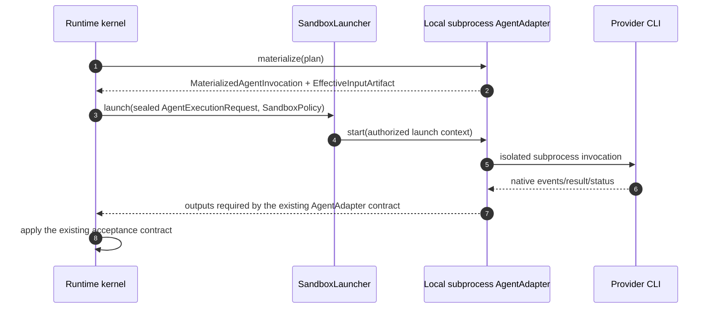
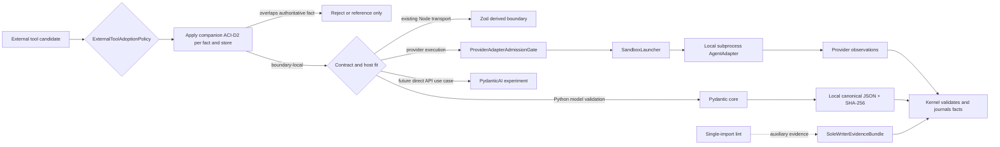

# Discovery — External Tool Adoptions

## Objective

Define which external tools may participate in `agents-communication-infra` without transferring authority away from its journal, audit-ledger writer, artifact boundary or sandbox. The target keeps the runtime in Python/FastAPI, uses Pydantic core for canonical contract validation and admits a real provider first through a repository-local subprocess adapter behind `SandboxLauncher`.

**Status:** v0.1.0 — promoted from the completed `external-tools-verification` findings after explicit user confirmation; adoption claims are bounded by the evidence and do not release runtime implementation gates.  
**Owner:** @victor  
**Companion:** [`feature-discovery/agents-communication-infra.md`](feature-discovery/agents-communication-infra.md) v0.2.1 owns the runtime, persistence, protocol, adapter and recovery architecture; this document owns only external-tool adoption boundaries and treats the companion contracts as defined.

## 1. Business Context

This adoption boundary supports the repository goal of making multi-agent judgment explicit, auditable and recoverable, as described in the repository [README](../../../../README.md#what-is-this), without introducing a second runtime authority for convenience.

### Why now

The feature has reached the point where schema validation, durable execution, evidence helpers and model adapters could be bought or built. The investigated tools expose similarly named capabilities, but adopting one at the wrong layer could duplicate facts already assigned to `EventJournal`, bypass the validated audit appender or let provider-native state become authoritative. A decision boundary is therefore needed before the SPEC and implementation work consume those tools.

### What's broken (as of 2026-07-21)

1. [`research/external-tools-verification/adopt-case.md`](../../../../research/external-tools-verification/adopt-case.md) §“Layer 3 — Schemas” and [`build-case.md`](../../../../research/external-tools-verification/build-case.md) §“Layer 3 — Schemas” reason from a TypeScript runtime premise, while [`implementations/server/main.py`](../../../../implementations/server/main.py) lines 22–25 already host FastAPI and Pydantic in Python.
2. [`research/external-tools-verification/findings.md`](../../../../research/external-tools-verification/findings.md) §“Acordos fortes” shows that neither Eve nor the other evaluated libraries supplies the CLI adapter contract already owned by [`AgentAdapter`](../interfaces.md#internal-agentadapter).
3. [`research/external-tools-verification/findings.md`](../../../../research/external-tools-verification/findings.md) §“Acordos fortes” shows that Octopus wrappers and a single-import lint can detect or channel some calls but cannot prove the physical sole-writer property EG-1.
4. [`research/external-tools-verification/findings.md`](../../../../research/external-tools-verification/findings.md) §“Matriz de decisão” shows that schema validation alone supplies neither canonical versioning nor immutability and digest of an accepted artifact.
5. [`WORK-PACK.md`](../WORK-PACK.md#control-fields) still has `workPackGateStatus=block`; no external-tool selection currently supplies the missing W0 decisions, sandbox evidence or sole-writer proof.

### What stays the same

- The [companion discovery](feature-discovery/agents-communication-infra.md) v0.2.1 remains the sole discovery owner of `EventJournal`, `AuditLedgerMaterializer`, `ArtifactBoundary`, `AgentAdapter`, `SandboxLauncher`, replay and protocol behavior. This document only constrains which external implementations may touch those seams.
- [`SPEC.md`](../SPEC.md) and its aspect files remain the behavioral authority after ratification; this discovery does not silently amend their gates.
- The audit ledger remains authoritative only for official opening and closing, through the validated appender; the journal remains authoritative for runtime commands, events, aggregate heads, intents and replay.
- Provider-native process state remains an external observation until a command and journal transaction accept it as a fact.
- The fake adapter, W0/W1/W2 evidence and fail-closed sandbox requirements remain prerequisites owned by the companion delivery model.
- Multi-host execution, a Node runtime rewrite, Octopus/Eve as kernel replacements and a direct-model API adapter are outside this adoption slice.

## 2. Core Concepts

| Concept | Meta-type | What it does | Why this design |
|---|---|---|---|
| `ExternalToolAdoptionPolicy` | Policy | Classifies an external tool as kernel dependency, boundary-local dependency, experimental adapter or reference-only. | Adoption is decided by authority and seam fit, not by overlapping vocabulary. |
| `CanonicalContractPolicy` | Policy | Keeps Pydantic core validation distinct from local schema versioning, canonical JSON, immutability and SHA-256 sealing. | A valid model instance is not yet an accepted, reproducible artifact. |
| `BoundaryValidationPolicy` | Policy | Allows language-native validators such as Zod only at an existing non-authoritative transport boundary. | It prevents a second normative schema implementation while retaining boundary safety. |
| `ProviderAdapterAdmissionGate` | Rule | Admits a real provider adapter only after contract conformance, sandbox enforcement and recovery evidence. | Provider convenience cannot bypass kernel acceptance or launch isolation. |
| `SoleWriterEvidenceBundle` | Value Object | Combines process identity, filesystem permissions, writer inventory, negative tests and optional lint evidence for EG-1. | A source-code lint alone cannot establish a runtime capability boundary. |

## 3. Adoption Boundary

### 3.1 Decision matrix

| Tool or capability | Classification | Allowed seam | Prohibited authority | Re-evaluation trigger |
|---|---|---|---|---|
| Pydantic core | Adopt | Python boundary models for canonical requests, results, receipts and events | Canonicalization, immutability, digest acceptance or persistence authority | Pin and serialization policy fail W0 vectors |
| Local canonical JSON + SHA-256 | Build | `ArtifactBoundary` sealing and cross-boundary fixtures | Provider-specific reinterpretation of accepted bytes | An ADR accepts a standard with equivalent cross-language vectors |
| Repository-local subprocess adapter | Build | `AgentAdapter` behind `SandboxLauncher` | Journal writes, audit-ledger writes, self-acceptance of observations | A provider-native adapter proves the full contract with equal isolation |
| Octopus Runtime | Reference only | Names, tests and architectural comparison | Kernel ports, journal, audit governance or effect authority | Exclusive Python-compatible capability with non-bypassable enforcement is demonstrated |
| `octopus-evidence` | Defer | Canonicalization comparison vectors only | A mandatory Node boundary or normative evidence store | Benchmark and interoperability proof beat the reviewed local helper |
| Eve | Reject for kernel | Comparative research only | Session, workflow replay, journal or CLI adapter authority | It delegates replay to the external journal and implements the full adapter/recovery contract |
| PydanticAI | Experimental future adapter | Direct model-API adapter after a real use case exists | Kernel schema dependency or subprocess adapter replacement | Cost, cancellation, isolation, observability and conformance comparison passes |
| Zod | Boundary-local | Existing Node transport boundary, if one is inventoried | Canonical schema authority | A real Node consumer needs generated bindings and shared fixtures |
| Single-import lint | Auxiliary evidence | CI check for known imports | Sole proof of EG-1 | Never sufficient alone |

The classifications above implement `ExternalToolAdoptionPolicy` and decisions ETD-1 through ETD-7. “Reference only” permits learning from an API shape; it does not permit importing its runtime or accepting its store as authoritative.

### 3.2 Applying the companion's authority ownership

This adoption assessment applies [ACI-D2 and the authority boundaries owned by the companion](feature-discovery/agents-communication-infra.md#3-authority-and-data-boundaries); it does not define another authority matrix.

| Fact | Authoritative owner from companion | Permitted tool role |
|---|---|---|
| Commands, runtime events, aggregate heads, effect intents and workflow replay | `EventJournal` | Validate transport or return observations; never reconstruct a competing truth |
| Official opening and closing | Validated audit-ledger appender | Request and reconcile exact rows; never become a second writer |
| Immutable input/output bytes and manifests | `ArtifactBoundary` | Validate decoded shapes; never replace accepted digests |
| Native process/provider status | Provider through `AgentAdapter` | Produce an observation; never mutate authoritative state |
| Usage projections and derived cost | Reducers and versioned rollups | Supply raw attributed observations; never invent missing counters or authorize effects |

Under ACI-D2, journal and audit ledger may coexist because the companion assigns them different facts and explicit reconciliation. For adoption purposes, an external runtime conflicts when it claims lifecycle or replay facts already assigned to the journal, even if its storage technology is otherwise sound. This is an evaluation consequence of ACI-D2, not a second ownership decision in this discovery.

## 4. Contract and Validation Boundary

### 4.1 Canonical Python contracts

Pydantic core is the validation mechanism for Python models because it is already present in the FastAPI host. Under ETD-2, validation succeeds before sealing but does not itself define canonical ordering, Unicode normalization, numeric representation, omitted-versus-null behavior, schema version selection or digest acceptance.

```text
provider/transport bytes
  -> Pydantic boundary validation
  -> versioned canonical projection
  -> canonical JSON bytes
  -> local SHA-256 digest
  -> ArtifactBoundary acceptance
```

The normative vectors must make the last four transitions reproducible. A model library upgrade cannot silently change an accepted digest; W0 pins the version and serialization policy first.

### 4.2 Node boundaries

ETD-6 allows Zod only when an existing Node consumer is identified. That consumer validates its transport view against generated schemas or shared fixtures derived from the canonical Python contract; it does not hand-author a competing normative schema. With no real Node consumer, adding Zod creates cost without an admitted seam.

## 5. Provider Adapter and Sandbox Boundary

The first real provider follows ETD-3 by implementing the seam already owned by the companion's [§5 kernel boundary](feature-discovery/agents-communication-infra.md#5-kernel-effects-and-extensibility) and [§5.1 agent input flow](feature-discovery/agents-communication-infra.md#51-agent-input-bus-publication-and-reveal-delivery), with the normative interfaces in [`AgentAdapter`](../interfaces.md#internal-agentadapter) and [`SandboxLauncher`](../interfaces.md#internal-sandboxlauncher):



This document selects a repository-local subprocess implementation for those existing interfaces; it does not redefine their operations, output types, write restrictions or fail-closed semantics.

PydanticAI remains outside this flow. ETD-5 permits a later direct-API adapter experiment only as another implementation of the same provider-neutral contract, with its own isolation, cancellation, recovery, observability and cost evidence.

## 6. Evidence and Admission Gates

| From → To | Mandatory criteria |
|---|---|
| Research → SPEC amendment | Every ETD decision maps to an existing or new concept without duplicating companion ownership; W0 pins Pydantic and canonicalization semantics. |
| SPEC amendment → fake adapter | Contract vectors cover canonicalization, round-trip, rejected provider fields, terminal results and recovery; runtime gate is explicitly released by its owner. |
| Fake adapter → subprocess adapter | Fake conformance and deterministic recovery pass; `SandboxPolicy` has fail-closed fixtures for each supported host. |
| Subprocess adapter → production provider | `materialize/start/events/result/cancel/status`, process-tree cleanup, credential isolation, receipt acceptance and usage attribution pass negative and restart tests. |
| First provider → PydanticAI experiment | A direct-API use case exists and a comparison covers cost, cancellation, observability, isolation and conformance without kernel forks. |
| Python contract → Node/Zod boundary | A real Node consumer is inventoried; generated bindings/shared fixtures prove parity and Python remains normative. |
| Any → ESCAPE | Keep the dispatch `legacy-managed` or retain the fake adapter, disable the candidate dependency, preserve accepted artifacts and open a narrower ADR; never weaken authority or sandbox rules silently. |

The honest-gate rule is that a failed fixture or unsupported host blocks adoption at its current boundary. Discovering that failure before provider launch costs an adapter or dependency choice; discovering it after launch can corrupt authority, expose credentials or make recovery ambiguous.

## 7. Open Questions

### OQ-ETA1 — Pydantic and canonical serialization

**Question:** Which Pydantic version and canonical JSON rules are accepted for nulls, Unicode, numbers and omitted fields?  
**Recommendation:** Pin the Pydantic version and ratify an ADR containing serialization rules, version bytes, SHA-256 inputs, golden vectors and cross-boundary round-trip tests.  
**Settlement stage:** W0 / SPEC amendment, before runtime implementation.

### OQ-ETA2 — Physical proof of EG-1

**Question:** Which host mechanism proves that only the validated appender can write the audit ledger?  
**Recommendation:** Ratify `SoleWriterEvidenceBundle` with a dedicated process identity, file/directory ACL, inventory of legacy writers, negative bypass tests and lint as defense in depth only.  
**Settlement stage:** W0 architecture decision and implementation proof before materializer cutover.

### Canonical dependency — OQ-SANDBOX

The companion's [`OQ-SANDBOX`](feature-discovery/agents-communication-infra.md#7-open-questions) remains the sole question and owner for cross-platform sandbox enforcement. Its adoption impact here is fixed: until that question is settled by the companion's Slice-1/2 ADR and evidence gate, the subprocess adapter remains classified as **build, blocked for a real provider**; no library selection may supply a silent fallback.

### OQ-ETA4 — Real Node consumer

**Question:** Does an existing Node MCP or appender boundary need these canonical contracts?  
**Recommendation:** Inventory current Node consumers; add Zod only for an identified consumer and derive its fixtures/bindings from the normative Python schema.  
**Settlement stage:** Integration planning; absence of a consumer settles the question as “do not add”.

### OQ-ETA5 — Direct model API

**Question:** Is there a use case after the subprocess adapter that justifies a PydanticAI adapter?  
**Recommendation:** Defer it until a named API-provider use case can pass the same conformance suite and demonstrate acceptable cost, cancellation, recovery, observability and isolation.  
**Settlement stage:** Post-first-provider roadmap decision.

### OQ-ETA6 — Research aggregate

**Question:** Is the absent `research/external-tools-verification/research.md` required as a physical dispatch aggregate?  
**Recommendation:** Treat the four concrete research siblings and `findings.md` as provenance now; materialize an index only if the research pipeline requires a resolvable aggregate edge.  
**Settlement stage:** Research-pipeline maintenance, non-blocking for SPEC amendment.

## Decisions Baked In

| ID | Decision | Where |
|---|---|---|
| ETD-1 | Keep the feature runtime in the existing Python/FastAPI host. | §3.1 |
| ETD-2 | Use Pydantic core for validation while keeping canonicalization, versioning, immutability and digest local to the runtime. | §4.1 |
| ETD-3 | Build the first real provider as a repository-local subprocess adapter behind `SandboxLauncher`, after fake-adapter and gate evidence. | §5 |
| ETD-4 | Keep Octopus Runtime and Eve outside the kernel and all authoritative stores. | §3.1, §3.2 |
| ETD-5 | Defer PydanticAI to a future direct-API adapter experiment, not a kernel schema dependency. | §5 |
| ETD-6 | Use Zod only at an identified Node boundary, derived from the normative Python contract. | §4.2 |
| ETD-7 | Treat single-import lint as auxiliary evidence, never sole proof of EG-1. | §3.1, §7 OQ-ETA2 |

### Alternatives considered

| ID | Alternative | Disposition and evidence |
|---|---|---|
| A-1 | Adopt Octopus ports, governance and evidence packages in the kernel. | Rejected by ETD-4: the reusable surface is smaller than the authority overlap, and wrappers/lint do not close EG-1. |
| A-2 | Use Eve as the durable execution host. | Rejected by ETD-4: its lifecycle/replay facts overlap `EventJournal`, and it does not supply the required CLI adapter contract. |
| A-3 | Make PydanticAI the schema layer. | Rejected by ETD-2/ETD-5: Pydantic core already validates the host contracts, while PydanticAI does not seal artifacts. |
| A-4 | Make Zod the canonical schema implementation. | Rejected by ETD-1/ETD-6: it assumes a Node runtime and would create a second normative contract. |
| A-5 | Close EG-1 with a single-import lint. | Rejected by ETD-7: dynamic imports, alternate processes and direct filesystem access remain bypasses. |
| A-6 | Forbid journal and audit ledger coexistence because I1 means “one log”. | Rejected by application of companion decision ACI-D2 in §3.2: they may coexist when each owns distinct facts and exact reconciliation is specified. |

## Connections

| Document | Type | Description |
|---|---|---|
| [`research/external-tools-verification/findings.md`](../../../../research/external-tools-verification/findings.md) | `derives-from` | Evidence synthesis and decision matrix promoted by this discovery. |

## Appendix — Changelog

| Version | Date | Change | Locked decisions |
|---|---|---|---|
| 0.1.0 | 2026-07-21 | Initial promotion of the verified external-tool recommendations; target normalized to the existing plural feature path to avoid creating a duplicate feature. Review removed duplicate ownership of ACI-D2 and OQ-SANDBOX and retained only the bidirectional source edge allowed by this write scope. | ETD-1–ETD-7 introduced; none previously locked. |

**Source dispatch:** `external-tools-verification`; promoted from [`research/external-tools-verification/findings.md`](../../../../research/external-tools-verification/findings.md) after explicit user confirmation.

## Flow Diagram



The policy first applies companion decision ACI-D2 and rejects any tool that would own a fact already assigned there. Boundary-local validators may participate without becoming normative, while provider execution must pass `ProviderAdapterAdmissionGate` and the existing `SandboxLauncher` contract. Pydantic core validates shapes, but the runtime-owned canonicalization and digest seal accepted artifacts. Lint contributes to `SoleWriterEvidenceBundle`; it never proves EG-1 alone.
