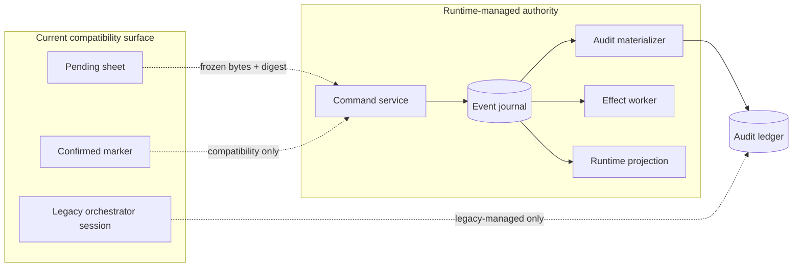
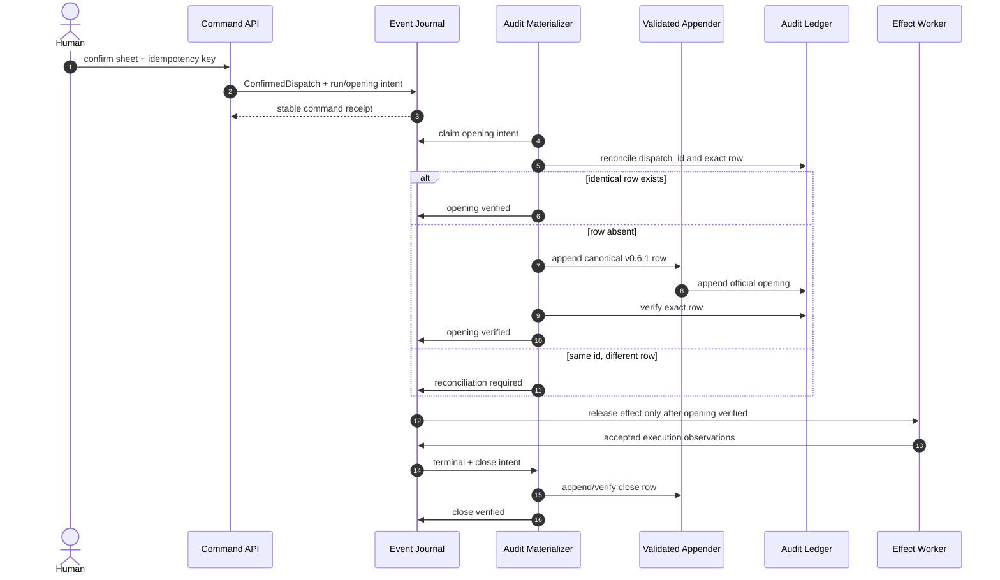
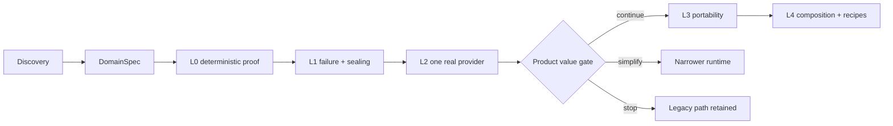
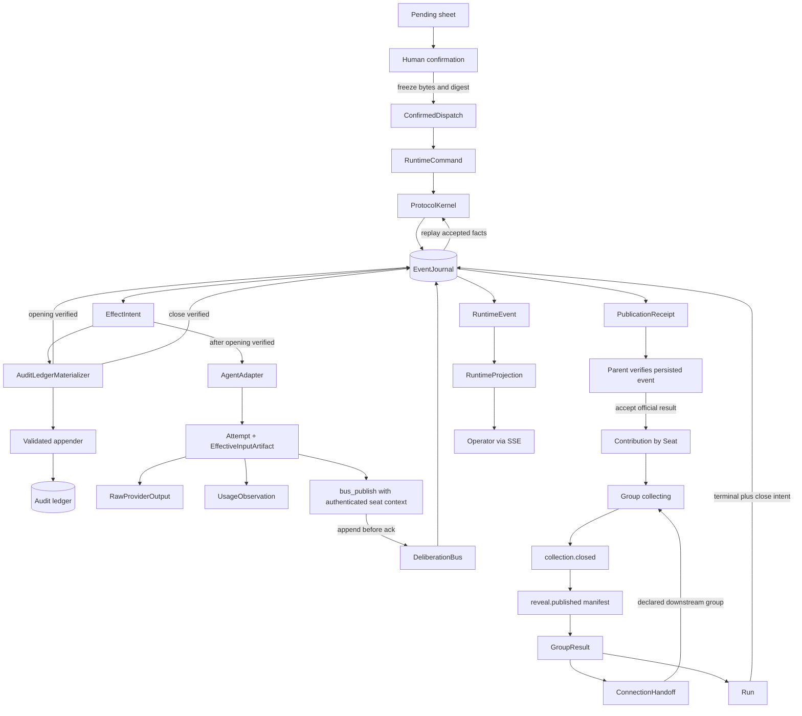

# Discovery — Agents Communication Infra

## Objective

Move the existing human-gated, skill-led dispatch discipline into a single-host recoverable runtime while preserving the audit ledger's authorization boundary. The end state accepts one immutable confirmed dispatch, persists its runtime facts, starts effects only after verified audit opening, and reaches one officially closed outcome that can be reconstructed after restart. Provider portability, richer deliberation and reusable recipes extend this same contract rather than creating parallel runtimes.

**Status:** v0.2.1 — synthesized from the candidate feature architecture, implemented Phase-2 confirmation seam, executable bus-publication probe, engine constitution and draft/blocked planning boundary; runtime claims remain candidate until ratified and proven by their gates.  
**Owner:** @victor  
**Companion:** [`../../README.md`](../../README.md) owns the full target architecture, including group protocol, bus, connection and adapter semantics in §§4–6; this discovery owns the migration problem, candidate concept seams and decision/OQ trace that the future SPEC will ratify.

## 1. Business Context

This feature serves the repository's central goal of making multi-agent judgment explicit, human-gated and auditable, as described in the project [README](../../../../../README.md#what-is-this).

### Why now

The operational dispatch discipline exists, and the control plane can already receive human confirmation, but execution still depends on an active Claude session noticing an ephemeral marker and manually conducting registration, agents and close. This prevents restart recovery, deterministic protocol state and provider-neutral execution, so further communication features would otherwise accumulate on a session-owned seam rather than a runtime-owned one.

### What's broken (as of 2026-07-21)

1. `implementations/server/main.py:229` implements confirmation by writing a `.confirmed` marker only; it does not create an immutable run or accepted runtime event.
2. `docs/features/agents-communication-infra/phase-2-confirm-handoff.md` §“Arming the watch” assigns marker consumption to a live orchestrator session, not a durable worker.
3. `implementations/server/main.py:279` serves full disk-derived snapshots over SSE; it has no ordered runtime cursor or gap-recovery contract.
4. `implementations/server/ledger.py:95`, `:340` and `:388` parse historical audit rows and pending sheets, but no runtime journal can reconstruct commands, attempts, transitions or messages.
5. `.claude/skills/register-dispatch/append-dispatch.cjs:358` and `:378` treat an existing identity as an idempotent no-op without proving that the existing row is content-identical; a materializer therefore needs an independent exact-row reconciliation check.
6. `vault/constitution/engine-constitution.md:153` and `:376` keep EG-1 at medium veracity because historical close rows bypassed the validated appender and no sole-writer guard exists yet.
7. [`../../README.md`](../../README.md) §3 records that the current `implementations/server/main.py` and `ledger.py` are a reader/control-plane surface, not a kernel, event journal, durable effect outbox, provider adapter contract or recovery loop.

### Explicit capability gaps after the publication probe

The executable [bus-publication probe](../../experiments/bus-publication-probe/README.md) validates
append-before-ack publication, receipt verification, idempotency, logical uniqueness and
late-publication rejection in a constrained JSONL/MCP setup. Ten contract tests passed, and the
[source session](../../../../../sessions/2026-07-21-1411-agents-communication-bus-probe.md) records
one real Codex subagent publication whose receipt matched exactly one persisted event. This evidence
does **not** make those mechanisms production runtime capabilities. As of 2026-07-21, the following
remain unimplemented or unproven:

- a complete runtime that owns confirmed runs, protocol transitions, effects and terminal outcomes;
- the production SQLite/WAL schema and atomic transactions for command receipts, events, aggregate
  heads and outbox intents;
- end-to-end recovery after local process restart, including unknown external effects,
  reconciliation and resumable observation; recovery after host loss remains outside the MVP;
- authorized reveal and delivery of sealed contributions between agents after the collection
  barrier closes;
- strong sandbox, credential and tool-capability isolation that fails closed independently of
  prompt compliance;
- safe same-host concurrency for multiple publishers or worker processes while retaining one
  controlled physical writer boundary per authoritative store;
- a Codex CLI adapter integrated with the runtime, native MCP bus injection and mandatory
  parent-side receipt acceptance;
- provider portability demonstrated by a second adapter and by mixed-provider runs without kernel
  or event-schema forks;
- immutable persistence and aggregation of model usage and cost observations by attempt, operation,
  seat, group, run and dispatch.

These are delivery gaps, not claims that every item belongs in the first slice. The wave gates in
§6 determine their order: persistence and deterministic fake adapters precede recovery and sealing;
those precede the first real provider, telemetry validation, provider portability and composition.

### What stays the same

- Human confirmation remains explicit; silence and marker existence alone never authorize a runtime-managed dispatch.
- The current audit ledger remains the permanent high-level record of official opening and closing; historical rows are not rewritten or revalidated.
- The validated appender remains the **intended mandatory boundary** for the audit ledger's only physical writer, governed by [`engine-constitution.md`](../../../../../vault/constitution/engine-constitution.md) §EG-1. Its exclusivity is not yet proven: materializer cutover remains blocked until the historical drift is traced and a sole-writer guard exists.
- The lenient historical reader, aggregate semantics and computed-field namespace remain owned by the same constitution and current `ledger.py` implementation.
- Pending JSON remains the current editable pre-confirm surface during migration; today it stays mutable until the legacy session consumes it. Freezing exact bytes/digest at runtime confirmation is a target change defined in §4, not current behavior.
- The existing [Phase-2 confirm handoff](../../phase-2-confirm-handoff.md) remains the owner of current marker semantics. This feature touches it through a compatibility adapter and does not redefine the legacy session loop.
- Decision-science claims about bias/noise reduction remain owned by [`anti-noise-orchestration.md`](../../../../../vault/hypothesis/anti-noise-orchestration.md); this discovery defines execution guarantees, not statistical independence.
- Multi-host workers, high availability, multi-tenancy, arbitrary executable recipes, mutating code workflows and autonomous knowledge promotion are out of this discovery's initial delivery boundary.

## 2. Core Concepts

| Concept | Meta-type | What it does | Design rationale |
|---|---|---|---|
| `ConfirmedDispatch` | Entity | Immutable, digested version of the human-approved dispatch input. | Separates editable intent from the exact authorization used by a run. |
| `Run` | Entity | Owns the lifecycle of one confirmed dispatch version. | Prevents a mutable sheet or marker from doubling as runtime state. |
| `RuntimeCommand` | Operation | Requests one authorized state change with identity, digest and expected version. | Makes retries distinguishable from conflicting reuse. |
| `RuntimeEvent` | Event | Records an immutable accepted fact that reducers can replay. | Replay must reduce facts rather than re-run decisions or effects. |
| `AggregateVersion` | Value Object | Provides contiguous per-aggregate compare-and-set ordering. | Makes concurrent command conflicts explicit. |
| `JournalOffset` | Value Object | Orders accepted events within the local journal stream. | Gives queries and future realtime cursors a stable position without using timestamps as authority. |
| `EventJournal` | Interface | Atomically accepts events, aggregate-head changes and effect intents. | Keeps workflow authority in one recoverable local transaction. |
| `EffectIntent` | Entity | Durable request for an external or cross-store effect. | Prevents replay from invoking the appender, provider or tool directly. |
| `AuditLedgerMaterializer` | Workflow | Projects verified opening and close rows through the current appender. | Preserves the sole-writer rule while handling the SQLite/YAML consistency gap. |
| `ReconciliationState` | Enum | Distinguishes pending, already-applied, divergent and repair-required projections. | A partial failure must remain visible instead of silently authorizing execution. |
| `AgentAdapter` | Interface | Normalizes start, events, result, cancel and status across providers. | Provider behavior stays outside the kernel state machine. |
| `ProtocolKernel` | State Machine | Applies finite, deterministic lifecycle and group transitions. | Coordination remains reproducible without making a model the protocol authority. |
| `RuntimeProjection` | Query | Reconstructs operator-facing run state from accepted facts. | UI/SSE can be rebuilt and never become a second source of truth. |
| `ExecutionAuthorityMode` | Enum | Assigns a dispatch to `legacy-managed` or `runtime-managed` execution. | Prevents the marker watcher and the new worker from executing the same dispatch. |
| `DispatchSpec` | Value Object | Carries the immutable executable graph, participants, policies and resolved capabilities for one run. | Keeps authoring inputs separate from the protocol instance consumed by the kernel. |
| `Group` | Entity | Owns one bounded stage of agent participation and its protocol state. | Gives quorum, rounds and result commitment one aggregate boundary. |
| `Seat` | Entity | Represents one logical participation slot independent of physical retries or replacement agents. | Prevents retries from counting as extra judgments. |
| `Attempt` | Entity | Records one physical execution of a logical adapter operation. | Separates provider retries from logical contributions. |
| `Contribution` | Entity | Stores one accepted position or vote for a seat, round and message type. | Makes uniqueness and reveal policy enforceable without interpreting prose. |
| `PublicationReceipt` | Value Object | Identifies one accepted publication by message ID, payload hash and idempotency key. | Lets a parent accept an agent result only after independently matching persisted journal evidence. |
| `EffectiveInputArtifact` | Entity | Stores the immutable input actually presented to one provider attempt. | Separates confirmed intent from the system instructions, history, tools and context materialized at execution time. |
| `RawProviderOutput` | Entity | Stores the immutable provider-native output for one attempt or exchange. | Preserves evidence without treating provider prose or metadata as an accepted protocol message. |
| `UsageObservation` | Event | Records provider-reported input, cached-input, output and reasoning usage with provenance and nullable dimensions. | Enables immutable rollups without presenting reported usage as billing truth. |
| `AgentExecutionRequest` | Value Object | Carries the canonical provider-neutral task, effective-input reference, model selection, tools, schema, deadline and budget for one attempt. | Gives every adapter the same execution contract while preserving explicit provider variation. |
| `BusPublication` | Operation | Submits one schema-typed contribution without accepting runtime authority fields from the agent. | Separates agent-authored content from authenticated run/group/seat/attempt context. |
| `RevealManifest` | Entity | Freezes the accepted message set and hashes made visible after a collection barrier. | Makes reveal an auditable delivery input rather than an unrestricted peer-read channel. |
| `GroupResult` | Entity | Commits the protocol verdict, participants, quorum, dissent and payload references for a group. | Preserves protocol evidence separately from any narrative synthesis artifact. |
| `ConnectionHandoff` | Workflow | Delivers one committed group result to a declared downstream group. | Makes inter-stage delivery deduplicable and replayable. |
| `DeliberationBus` | Interface | Accepts and reveals authorized messages according to principal, group and phase. | Agents publish logically without becoming physical journal writers. |

These names are intended to survive into the DomainSpec registry as `agents-communication-infra.<ConceptName>` unless SPEC authoring finds a concrete collision. Detailed semantics for `Group`, `Seat`, `Contribution`, `GroupResult`, `ConnectionHandoff` and `DeliberationBus` remain owned by the companion [`README`](../../README.md) §§4–6; this discovery declares their migration seams rather than a competing protocol definition.

## 3. Authority and Data Boundaries

ACI-D1 establishes that the feature owns one runtime, while ACI-D2 separates its stores by the facts they are allowed to own.

| Boundary | Owns | Does not own | Physical writer |
|---|---|---|---|
| Command service + journal | Confirmed runtime intent, accepted transitions, attempts, messages and effect intents | Official audit rows or knowledge promotion | Journal writer |
| Audit ledger | Official confirmed opening and terminal outcome | Runtime transitions, messages or provider details | Existing validated appender |
| Adapter | Observations and execution mechanics for one provider attempt | Run/group state decisions | Provider-specific worker through command boundary |
| Projection/SSE | Reconstructible read state and cursors | Workflow authority | Projection reducer/materializer |
| Pending/marker compatibility | Editable draft and legacy transport signal | Immutable confirmation or runtime state | Current control-plane compatibility surface |



The dashed join from the current surface is `ConfirmedDispatch.digest`. ACI-D9 requires mode ownership to be selected before execution, so the session and worker never consume the same dispatch.

## 4. Confirmation, Execution and Cross-Store Consistency

ACI-D3 freezes confirmation; ACI-D4 makes the journal the workflow authority; ACI-D5 and ACI-D6 preserve the audit writer and verified-opening barrier.



The journal transaction can make event append, aggregate version and effect intent atomic locally, but it cannot transact with the YAML audit ledger. ACI-D11 therefore brings a minimal durable materialization and reconciliation path into the first proof: a crash after physical append but before journal acknowledgement re-reads by identity and exact content; identical counts as applied, divergent becomes `reconciliation_required`.

Externally observable lifecycle states remain distinct:

```text
confirmed
  -> opening_pending
  -> ready
  -> running
  -> execution_terminal
  -> close_pending
  -> closed

opening_pending | close_pending -> reconciliation_required
```

`execution_terminal` means the protocol elected a terminal fact; it does not claim that official close materialization succeeded. Only `closed` carries that claim.

## 5. Kernel, Effects and Extensibility

ACI-D8 uses deterministic fake adapters before real providers so persistence and transition defects cannot hide behind nondeterministic output. The first protocol profile is finite and fixed; its purpose is to prove command/event/effect separation, not product value or statistical independence.

The `ProtocolKernel`, whose richer group semantics remain owned by the companion [`README`](../../README.md) §4:

- validates command identity, policy and expected aggregate version;
- derives events and effect intents without performing effects;
- accepts one logical contribution and one terminal winner per declared key;
- treats clock, provider output, timeout, cancellation and human decisions as observations that become events before state depends on them;
- never branches on provider name or semantic workflow type (ACI-D10).

The `AgentAdapter` owns translation into a provider and declares capabilities. A missing capability either rejects the confirmed combination or requires an explicitly reconfirmed spec; it does not silently change protocol semantics. Provider-specific metadata remains namespaced and cannot govern kernel transitions directly.

Later sequential groups and built-in recipes recompose from the same core. `ConnectionHandoff` follows the companion [`README`](../../README.md) §6, while bus visibility follows its §5:

```text
ConfirmedDispatch
  -> finite group graph
  -> kernel operations
  -> adapter effects
  -> committed group result
  -> deduplicated handoff
  -> terminal Run
```

Generic user recipes, `feedback`, `zig-zag`, mutating tools and distributed workers remain outside the initial contract because they introduce independent supply-chain, authority and recovery decisions.

### 5.1 Agent input, bus publication and reveal delivery

An agent does not receive a database row or an unrestricted bus client. The runtime first freezes a
provider-neutral `AgentInvocationPlan`. The selected adapter deterministically materializes the
provider-native invocation and exact `EffectiveInputArtifact`; only then does the runtime seal an
`AgentExecutionRequest` that binds both digests and may be passed to the sandbox launcher. No effect
may start from the plan alone or before the artifact and request are durable.

| Invocation contract field | Supplied by | Meaning |
|---|---|---|
| `attempt_id`, `operation_id`, `seat_id` | runtime | Authenticated execution and logical-contribution identities. |
| `provider_ref`, `adapter_ref`, `model_ref` | confirmed spec + scheduler | Exact provider, adapter and model selected for this agent instance. |
| `role_contract_ref`, `task_ref` | compiled recipe/profile | Local objective, allowed output type and role-specific delta. |
| `base_snapshot_ref` | runtime | Content-addressed context shared by the declared peer set. |
| `materialized_invocation_ref`, `effective_input_ref`, `effective_input_digest` | adapter materializer, then runtime sealing | Provider-native invocation plus ordered manifest of actual instructions, history, tools, schemas and context. |
| `response_schema_ref` | confirmed spec | Schema the raw provider result must satisfy before it can become a publication candidate. |
| `tool_profile_ref` | capability resolver | Exact allowed tools; during sealed collection this includes `bus_publish` but no peer-read capability. |
| `deadline`, `resource_budget` | confirmed policy | Explicit time, token, tool, payload and storage limits. |

The immutable effective-input manifest includes system/developer/user instructions, ordered history,
tool names/descriptions/input schemas, response schema, context artifact hashes and adapter-generated
wrappers. Agents in the same group receive the same `base_snapshot_ref` unless the confirmed role
contract declares a hashed `role_delta_ref`; equality is never inferred merely because prompts look
similar.

The agent-authored `BusPublication` contains only:

| Field | Agent may supply | Validation |
|---|---:|---|
| `idempotency_key` | yes | Non-empty and unique within authenticated run/group/version/seat scope. |
| `operation_id` | yes, but must match capability | Must equal the operation bound to the attempt. |
| `round_id` | yes, but must match capability | Must name the active allowed round. |
| `message_type` | yes, from allowlist | Must be permitted by group phase and schema. |
| `reply_to_message_ids` | yes | Every reference must already be visible to the principal. |
| `payload` or `payload_ref` | yes | Schema-valid, size-bounded and content-hashed. |
| `run_id`, `dispatch_id`, `group_id/version`, `seat_id`, `agent_instance_id`, `attempt_id`, `actor_principal_id`, `phase` | **no** | Derived from the authenticated MCP/capability context; conflicting payload fields are rejected. |

The publish call returns a byte-stable `PublicationReceipt` only after the candidate event and its
authoritative reservation commit. That receipt proves durable candidate persistence, not official
acceptance; the parent must verify it before the official message/event can commit. During
`collect`, the agent receives no peer contribution through the bus. After `collection.closed`, the
kernel freezes a `RevealManifest`; authorized messages are delivered as a content-addressed input to
a later attempt/turn and therefore appear in that turn's `EffectiveInputArtifact`. The initial proof
does not expose a generic peer-read tool.

### 5.2 Heterogeneous models

Provider, adapter and model are selected per `agent_instance_id`, so one group may mix Codex and
Claude without changing the group protocol. Every adapter consumes the same `AgentInvocationPlan`
schema and emits a provider-native materialization that the runtime seals into a protocol-equivalent
`AgentExecutionRequest`, plus the same canonical result/usage observation contracts. Provider
differences remain in namespaced metadata and the recorded effective input; missing capabilities are
rejected or explicitly reconfirmed rather than silently changing tools, reveal or output semantics.

### 5.3 Candidate SQLite table boundary

The production schema remains a W0 contract, but its ownership split is explicit enough for SPEC
authoring. These are logical tables; the persistence ADR may combine projections or normalize
payloads without changing their authority:

| Table | Authority | Minimum owned data |
|---|---|---|
| `command_receipts` | authoritative dedupe | command/idempotency identity, digest, status and stable result receipt. |
| `events` | authoritative journal | global offset, aggregate/version, event/schema identity, causation/correlation and payload/artifact reference. |
| `aggregate_heads` | authoritative concurrency guard | aggregate identity, current version and state hash. |
| `effect_intents` | authoritative outbox | effect identity/type, payload digest, retry class, claim epoch and outcome status. |
| `artifacts` | authoritative artifact metadata | artifact ID, content hash, media/schema type, classification, size and storage reference. |
| `attempts` | rebuildable index/projection | operation/attempt/agent/model identities and canonical lifecycle status. |
| `publication_candidates` | authoritative logical reservation | candidate status/version, attempt/operation/logical key, candidate event, payload reference/hash and idempotency key; at most one active reservation per logical key. |
| `messages` | rebuildable constrained projection | logical message key, seat/round/type, official accepted event, source candidate, payload reference and visibility state. |
| `publication_receipts` | rebuildable projection | byte-stable canonical receipt bytes/digest, event/candidate IDs, payload hash and idempotency key; transport replay metadata is external. |
| `reveal_manifests` | rebuildable constrained projection | group/version/round, frozen message IDs/hashes and reveal event. |
| `usage_observations` | immutable event projection | attempt/provider/model counters, nullable dimensions, source event and pricing reference when any. |
| `runtime_projections` | disposable read model | cursor-addressable run/group/attempt state for API and SSE. |

`command_receipts`, `events`, `aggregate_heads` and newly requested `effect_intents` commit in one
SQLite transaction. Audit-ledger rows remain outside SQLite authority and are written only through
the validated appender, then independently verified and acknowledged through journal events.

## 6. Phases and Honest Gates

The discovery fixes decision boundaries rather than implementation tasks. Each gate asks what is learned before adding the next source of uncertainty. ACI-D7 constrains the initial proof and pilot to one host and one tenant; distribution is not an implicit requirement of these gates.



| From → To | Mandatory criteria |
|---|---|
| Discovery → SPEC | Decisions ACI-D1–ACI-D15 are traced; OQ recommendations are ratified, amended or explicitly deferred; concept names, agent I/O contracts and authority seams are preserved. |
| SPEC → L0 proof | Persistence, terminal, snapshot, decision-rule, exact-row reconciliation and cutover contracts are versioned and testable. |
| L0 → L1 | Replay is pure; duplicate/conflicting commands behave distinctly; crashes converge; no effect precedes verified opening; one terminal and close win. |
| L1 → L2 | Sealing holds across controlled surfaces; races have one allowed terminal; recovery and cursor projection are proven; sandbox/credential boundary fails closed. |
| L2 → product gate | One provider passes the common adapter contract with explicit unknown-effect and resource behavior; immutable usage observations are persisted with provenance; evaluation is preregistered. |
| Product gate → L3 | The preregistered quality/dissent benefit meets its cost and latency threshold. |
| L3 → L4 | Second and mixed providers require no kernel, event-schema, store or realtime fork; usage rollups by attempt, operation, seat, group, run and dispatch preserve provider-specific nullability and semantics. |
| Any → ESCAPE | Mark affected dispatches `legacy-managed`, disable runtime ownership before confirmation, retain the validated appender flow and open a narrower replacement decision; never run both authorities or reinterpret partial runtime state as legacy success. |

The honest-gate rule is: discovering non-replayability, authority overlap or provider coupling at the current gate costs fixtures and local migration; discovering it one phase later costs audit repair, provider effects and potentially ambiguous user-visible outcomes. Promotion therefore stops on the earlier falsifier even when later functionality appears to work.

## 7. Open Questions

The source architecture's IDs remain canonical for cross-document traceability. Discovery IDs split them into ratifiable questions as follows:

| Source question | Discovery question | Settlement owner |
|---|---|---|
| `OQ-PERSISTENCE` | OQ-ACI1 and OQ-ACI7 | SPEC persistence contract |
| `OQ-STREAM` | OQ-ACI1 | SPEC event/journal contract |
| `OQ-DECISION` | OQ-ACI2 | SPEC policy/state contract |
| `OQ-TERMINAL` | OQ-ACI3 | SPEC terminal mapping |
| `OQ-SNAPSHOT` | OQ-ACI4 | SPEC domain/event contract |
| `OQ-LEDGER-CONSISTENCY` | OQ-ACI5 | SPEC mapping/workflow contract |
| New migration seam from Phase 2 | OQ-ACI6 | SPEC operation/interface contract |
| Probe effective-input question | OQ-ACI8 | SPEC artifact/snapshot contract |
| `OQ-RETENTION`, `OQ-CREDENTIALS` | OQ-ACI9 | Slice-1/2 security and retention ADRs |
| `OQ-CAPABILITIES`, `OQ-RESOURCE-LIMITS` | OQ-ACI10 | Real-adapter telemetry contract |
| `OQ-SANDBOX`, `OQ-UNKNOWN-EFFECT` | deferred by §6 gates | Slice-1/2 ADRs before implementation |

### OQ-ACI1 — Persistence boundary

**Question:** Which SQLite/WAL schema and transaction boundary govern command receipts, events, aggregate heads and effect intents?  
**Recommendation:** Use one local SQLite database in WAL mode, one writer boundary, a global integer `JournalOffset`, per-aggregate contiguous `AggregateVersion`, and one transaction for command receipt + events + head + effect intents. Use `same idempotency key + same command digest` as replay and a different digest as permanent conflict.  
**Settlement:** Ratify or amend in SPEC `persistence-and-replay`; implementation must not choose implicitly.

### OQ-ACI2 — Initial decision rule

**Question:** How does the fixed two-seat proof distinguish verdict, explicit dissent and missing quorum?  
**Recommendation:** Require two valid contributions; matching votes commit, conflicting valid votes commit an explicit dissent outcome, and a missing/invalid contribution is no quorum rather than dissent. Do not generalize this rule beyond the proof profile.  
**Settlement:** Ratify in SPEC `states`/`operations`; richer quorum policies remain later decisions.

### OQ-ACI3 — Terminal mapping

**Question:** How do attempt, group and run terminal facts map to the audit ledger's five `exit_reason` values?  
**Recommendation:** Attempt and group terminals never map directly to the audit ledger; they remain journal facts until one run terminal wins. Use this closed run-level rule: committed positive, negative or qualified result → `resolved`; committed irreconcilable dissent → `dissent_irreconcilable`; bounded protocol/round ceiling, including timeout with no technical fault and no quorum, → `loop_ceiling_reached`; explicit human cancellation → `user_abort`; exhausted provider retries, corrupted state, resource/budget exhaustion that prevents a valid protocol outcome, or other technical prevention → `error`. A partial result is `resolved` only when policy explicitly commits it as the qualified result; otherwise it follows the terminal cause above.  
**Settlement:** Ratify the full cause/level/precedence matrix in SPEC and enumerate negative fixtures before close materialization code.

### OQ-ACI4 — Frozen input snapshot

**Question:** Which external inputs must be captured for auditable reduction without promising deterministic model output?  
**Recommendation:** Freeze the confirmed sheet bytes/digest, schema and recipe/profile versions, decision policy, prompt/snapshot references, fake/adapter version and capability resolution. Record clock/provider/tool observations as later events rather than pretending they were reproducible inputs.  
**Settlement:** Ratify in SPEC `domain`/`events`.

### OQ-ACI5 — Audit-ledger reconciliation

**Question:** What proves that an opening or close was already applied after a crash?  
**Recommendation:** Compare the existing identity and canonical row content against the row derived from the frozen authority. Identical is acknowledged; absent invokes the existing appender and verifies afterward; divergent enters `reconciliation_required` and never releases effects or official closure.  
**Settlement:** Ratify in SPEC `mappings`/`workflows`; this blocks L0 rather than waiting for the broader L1 reconciler.

### OQ-ACI6 — Legacy/runtime cutover

**Question:** How is dual execution prevented while marker-based sessions remain available?  
**Recommendation:** Assign `ExecutionAuthorityMode` before confirmation. Runtime-managed confirmation freezes the sheet and makes the marker a compatibility projection ignored by legacy watchers; legacy-managed dispatches never create a runtime `Run`. Cleanup of sheet/marker is a retryable compatibility effect after verified opening.  
**Settlement:** Ratify in SPEC `operations`/`interfaces` and preserve a tested rollback to legacy mode.

### OQ-ACI7 — Journal durability setting

**Question:** Which SQLite synchronous policy is accepted for the proof and pilot?  
**Recommendation:** Start with `synchronous=FULL` for every transaction in the proof/pilot event journal; measure the cost before considering `NORMAL`. Any relaxation requires fault evidence and an explicit decision because it changes the replay/durability claim for the entire transaction, not only authorization or terminal rows.  
**Settlement:** Ratify in SPEC `persistence-and-replay` and revisit only at a measured performance gate.

### OQ-ACI8 — Canonical effective input

**Question:** Which system instructions, conversation history, tool descriptions and context artifacts constitute the canonical input actually presented to one attempt?  
**Recommendation:** Persist one content-addressed `EffectiveInputArtifact` manifest per attempt that orders and hashes the exact system/developer/user instructions, history messages, tool schemas, response schema, context artifacts and adapter-generated wrappers. Provider-side transformations that cannot be observed remain named limitations rather than reconstructed claims.  
**Settlement:** Ratify the manifest boundary in SPEC `domain`/`mappings`; finalize provider-specific capture in the real-adapter ADR.

### OQ-ACI9 — Prompt and output governance

**Question:** Which redaction, encryption, access and retention policy governs effective inputs and raw provider outputs?  
**Recommendation:** Treat both as sensitive immutable artifacts referenced from the journal; default access to runtime operators with explicit break-glass audit, encrypt at rest when the pilot leaves local development, prohibit secrets in durable payloads, and defer deletion/crypto-erasure periods to the Slice-1 retention and credential ADRs without weakening journal provenance.  
**Settlement:** Record the boundary in SPEC `rules`/`interfaces`; settle concrete retention periods and key management before Slice 1 exits.

### OQ-ACI10 — Usage completeness and semantics

**Question:** Does CLI-reported usage remain complete across tool-heavy, multi-turn, resumed and retried executions, and how may it be aggregated without implying billing truth?  
**Recommendation:** Persist every provider-reported usage record as a nullable, provider-attributed `UsageObservation`; never synthesize missing counters as zero or cost without an explicit price/version source. Validate completeness across the real-adapter conformance matrix before enabling dispatch-level cost claims.  
**Settlement:** Ratify observation and rollup semantics in SPEC `events`/`observability`; empirical completeness remains a Slice-2 adapter gate.

## Decisions Baked In

This register combines decisions already locked by the execution/work pack, boundaries required by the engine constitution and candidates that the DomainSpec must ratify or defer. `locked` does not authorize runtime implementation: the work-pack gate remains blocked until W0 evidence closes its explicit blockers.

| ID | Decision | Status | Source authority | Where |
|---|---|---|---|---|
| ACI-D1 | `agents-communication-infra` owns the target runtime; no parallel runtime feature is created. | locked | Execution-pack D-001; work-pack D-001 | §3 |
| ACI-D2 | Journal, audit ledger, adapters, projections and pending compatibility own disjoint facts. | locked | Execution-pack D-003; work-pack D-003 | §3 |
| ACI-D3 | Human confirmation freezes an immutable `ConfirmedDispatch` with a digest. | candidate | Feature README §3 target flow | §4 |
| ACI-D4 | The event journal is workflow authority; replay reduces persisted facts only. | locked | Execution-pack D-003; work-pack D-003/D-005 | §4 |
| ACI-D5 | The current validated appender is the required sole physical audit-ledger writer; cutover waits for the missing enforcement evidence. | required-boundary | Engine constitution EG-1, veracity medium | §3–§4 |
| ACI-D6 | No provider/tool effect starts before verified official opening. | candidate | Feature README §9.1 | §4 |
| ACI-D7 | The initial runtime is single-host and single-tenant. | locked | Execution-pack D-005; work-pack D-007 | §6 |
| ACI-D8 | Deterministic fake adapters precede any real provider. | locked | Work-pack D-006 | §5 |
| ACI-D9 | Each dispatch has exactly one execution authority mode during migration. | candidate | Phase-2 seam plus work-pack cutover guard | §3, §7 OQ-ACI6 |
| ACI-D10 | Provider and business workflow types do not create kernel branches. | candidate | Feature README §§3–4 | §5 |
| ACI-D11 | Minimal durable outbox/materializer reconciliation is part of L0 because SQLite and YAML cannot share a transaction. | candidate | Feature README §9.1 plus work-pack L0 reconciliation gap | §4 |
| ACI-D12 | Official agent contributions use append-before-ack publication and are accepted by the parent only after a receipt matches persisted journal evidence. | probe-validated candidate | Bus probe and source session | §1–§5 |
| ACI-D13 | Effective model input, raw provider output and accepted bus message are separate immutable records linked by attempt/exchange/message references. | session-ratified candidate | Source session | §2, §7 OQ-ACI8/9 |
| ACI-D14 | Runtime-generated authenticated context supplies authority identities; agent payloads cannot self-assert run, group, seat, attempt or principal. | probe-validated candidate | Bus probe and source session | §3–§5 |
| ACI-D15 | Provider-reported usage is stored as immutable nullable observations and rolled up without claiming unverified billing equivalence. | session-ratified candidate | CLI usage probe in source session | §2, §6–§7 |

The IDs were introduced in discovery v0.2.0 and become locked when a downstream SPEC cites the current discovery version; locking preserves traceability, not candidate status. Later decisions must be appended as versioned amendments rather than renumbering ACI-D1–ACI-D15.

## Connections

| Document | Type | Description |
|---|---|---|
| [`../../README.md`](../../README.md) | derives-from | Target architecture, invariants, MVP slices and original open-question register; it already links back to this discovery. |
| [`../../phase-2-confirm-handoff.md`](../../phase-2-confirm-handoff.md) | derives-from | Implemented confirmation marker seam and legacy session ownership. |
| [`../../experiments/bus-publication-probe/README.md`](../../experiments/bus-publication-probe/README.md) | validated-by | Executable JSONL/MCP publication and receipt-gate evidence. |
| [`../../../../../sessions/2026-07-21-1411-agents-communication-bus-probe.md`](../../../../../sessions/2026-07-21-1411-agents-communication-bus-probe.md) | created-by | Session that produced the architecture, probe decisions and CLI usage evidence. |
| [`../../../../../vault/constitution/engine-constitution.md`](../../../../../vault/constitution/engine-constitution.md) | governed-by | Audit-ledger writer, historical-reader and authority-boundary rules. |
| [`../../../../../vault/hypothesis/anti-noise-orchestration.md`](../../../../../vault/hypothesis/anti-noise-orchestration.md) | cites | Owns decision-science claims that this runtime does not redefine. |
| [`../../IMPLEMENTATION-LAYERING.md`](../../IMPLEMENTATION-LAYERING.md) | informed-by | Decision layers and promotion evidence that this discovery explains without turning into tasks. |
| [`../../WORK-PACK.md`](../../WORK-PACK.md) | informed-by | Existing executable plan consumes this discovery after DomainSpec ratification. |
| [`../../EXECUTION-PACK.md`](../../EXECUTION-PACK.md) | informed-by | Locked decisions, waves and delivery gates used by this discovery. |

## Appendix — Changelog

| Version | Date | Change |
|---|---|---|
| 0.1.0 | 2026-07-21 | Initial application discovery synthesized from the candidate architecture, Phase-2 seam, engine constitution and blocked work-pack. |
| 0.1.1 | 2026-07-21 | Added explicit post-probe capability gaps, receipt/input/output/usage concepts and decisions, probe open questions, evidence links and review corrections. Existing ACI-D1–ACI-D11 IDs were preserved; ACI-D12–ACI-D15 were appended. The operator-designated nested path `discovery/feature-discovery/` is intentional even though the imported direct-child discovery glob requires explicit-path invocation. |
| 0.2.0 | 2026-07-21 | Added normative candidate contracts for agent input, bus publication, receipt/reveal delivery, heterogeneous model materialization and the W0 SQLite table boundary. Existing ACI-D1–ACI-D15 IDs remain unchanged. |
| 0.2.1 | 2026-07-21 | Refined input ordering to plan → materialization/artifact → sealed request, separated durable publication candidates from official messages, and made receipt replay metadata transport-only. Decision IDs remain unchanged. |

## Flow Diagram



Read the flow from the editable pending sheet through human confirmation, which freezes the `ConfirmedDispatch` before the kernel accepts runtime commands. Verified audit opening releases the adapter; the agent publishes through the authenticated bus, which appends before returning a receipt that the parent independently verifies. Accepted seat contributions remain sealed until `collection.closed` and `reveal.published`, after which a committed result may hand off or close the run. Runtime projection and replay consume accepted journal facts without repeating effects.
