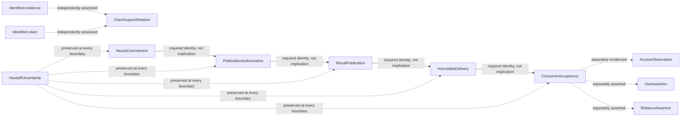

# Generic Stage Handoff

## Objective

Define the evidence-bounded meaning of one governed producer-to-consumer stage handoff so an exact producer result can become immutable input accepted for one identified consumer without collapsing publication, delivery, access, use, reliance, or claim support. The end state is a conceptual contract that later specifications can implement while preserving the proof boundary of every fact and receipt.

**Status:** v0.1.0 — evidence-bounded discovery from the confirmed source basis
**Owner:** @victorboscaro

## 1. Business Context

This discovery serves the repository's objective of keeping work connected to the authority and evidence that make it safe to rely on ([project overview](../../../../README.md#what-is-this)).

**Why now**

The current turn-zero workflow compiler emits empty input slots and treats declared connections as topology rather than data edges, while the bounded handoff implementation evidence shows only specialized transports and no generic producer-owned commitment-to-acceptance lifecycle ([comparison findings](../../../../research/agent-orchestration-project-comparison/findings.md#decision-surface); [comparison research](../../../../research/agent-orchestration-project-comparison/research.md#gap-boundary-or-undecided-rq6-rq8-rq10); [as-built synthesis](../../../../implementations/AS-BUILT.md#7-memória-handoffs-e-recuperação)). A later runtime decision therefore needs a stable account of what each transition means before it can choose a mechanism. The source basis supports the gap and the existing proof boundaries; it does not authorize implementation or establish that an external project already supplies the local contract.

**What's broken (as of 2026-09-01)**

1. `research/agent-orchestration-project-comparison/research.md:23-25` records that staged synthesis has no producer-output-to-consumer-input binding: generated manifests contain `slots: []`, and a connection does not carry data. A declared dependency can therefore exist without exact downstream input.
2. `implementations/AS-BUILT.md:86-90` records that the three current delivery contracts stop at different boundaries and that no generic committed-result, publication, delivery, and recipient-acceptance cycle exists. The specialized paths must not be generalized beyond their evidence.
3. `implementations/as-built/pairs/pair-05-handoff-integrity.json` §HANDOFF-01, §HANDOFF-05, and §HANDOFF-06 distinguish producer association from producer commitment, sealed effective input from provider delivery, and specialized transport from a generic lifecycle. Without one shared semantic model, the same word can overstate three different facts.
4. `implementations/AS-BUILT.md:96-100` records that exact retained bytes, a terminal binding, or a producer declaration do not prove prompt inclusion, delivery, access, use, or epistemic support. A single success status cannot carry those meanings honestly.
5. Existing specifications already expose different success boundaries: a host terminal receipt commits exact producer bytes but grants neither visibility nor launch authority ([operations §CommitHostTerminalResponse](../specs/operations.md#commithostterminalresponse)); input materialization does not launch the consumer ([operations §MaterializeHostWorkflowInput](../specs/operations.md#materializehostworkflowinput)); and reference delivery explicitly establishes neither access, declared use, nor claim support ([mappings §ReferenceScoutBundleToEffectiveInput](../specs/mappings.md#referencescoutbundletoeffectiveinput)). Those distinctions are locally sound but are not yet assembled into one generic handoff interpretation.

**What stays the same**

- This discovery does not decide whether the existing compiler is extended or a new primitive is introduced. That architecture choice remains open.
- It does not select a schema, storage representation, protocol, lifecycle implementation, provider adapter, external interface, or runtime migration path.
- It covers exactly one producing stage, one committed result, one intended consuming stage, and one immutable consumer input. Fan-in, fan-out, cross-dispatch work graphs, remote runtimes, and product expansion remain outside scope; the cross-dispatch candidate remains owned by the [ACI backlog](../BACKLOG.md#aci-bl-001--promotion-gated-cross-dispatch-work-graph).
- Runtime confirmation remains owned by [Runtime Confirmation Authority v1](../specs/confirmation-authority.md#ownership-and-trust-boundary). This discovery uses the seam that an authorized publication must trace to a legitimate authority; it does not redefine confirmation.
- Exact producer-turn bytes, slot mappings, manifests, launch authorization, BUS publication, continuation, and connection-handoff mechanics remain owned by the [ACI specification](../specs/SPEC.md#capabilities) and its domain, state, event, operation, mapping, and workflow aspects. This discovery defines how their facts may be interpreted, not a competing contract.
- Existing evidence remains temporally and surface bounded. A specified contract is not thereby implemented, and an implemented local-pilot path is not thereby universally adopted or production-proven ([ACI implementation baseline](../specs/SPEC.md#implementation-baseline); [as-built synthesis §How to read a claim](../../../../implementations/AS-BUILT.md#12-método-temporalidade-e-índice-de-claims)).

## 2. Core Concepts

The names below are stable conceptual identifiers for later specification work. Meta-types are downstream classification hints from the repository taxonomy, not a schema, lifecycle, or implementation decision.

### ResultCommitment

`ResultCommitment` is the anchor concept: it binds one governed producer outcome to exact bytes before any publication or consumer-side meaning exists. The table completes the concept set and preserves the distinct job of every later relation.

| Concept | Meaning | Why it remains separate | Candidate meta-type |
|---|---|---|---|
| `ResultCommitment` | A producer-bound, authority-scoped commitment that one exact byte sequence is the result of one producing stage outcome. | A terminal producer identity or later file association does not prove that the producer committed those bytes. | Entity |
| `PublicationAuthorization` | An authority decision that one verified `ResultCommitment` may be published through one named handoff to one identified consumer. | Commitment establishes producer attribution; authorization establishes permission. Neither establishes that publication occurred. | Event |
| `ResultPublication` | A durable fact that one exact commitment was made available for the named handoff under one verified `PublicationAuthorization`. | Authorization permits publication; this fact records its occurrence. Publication still does not imply delivery. | Event |
| `ImmutableDelivery` | A durable binding of the published committed bytes, their order and limits into the exact immutable input prepared for the identified consumer boundary. | Publication does not prove that the consumer received an immutable input; delivery does not prove consumer acceptance or provider execution. | Entity |
| `ConsumerAcceptance` | A consumer-bound acknowledgement that the exact `ImmutableDelivery` is admitted as the input for the identified consuming stage. | Acceptance establishes responsibility for a specific input boundary, not attention, reading, reasoning, agreement, or successful completion. | Event |
| `AccessObservation` | Evidence or an explicitly typed assertion that the identified consumer execution crossed a boundary where the delivered bytes were exposed or retrieved. | Access may be unobservable; acceptance alone cannot manufacture it. Agent self-report and host observation have different standing. | Event |
| `UseAssertion` | An attributable statement that the consumer used identified delivered content in its reasoning or action. | Access is compatible with non-use, and use is generally not directly observable from transport evidence. | Entity |
| `RelianceAssertion` | An attributable statement that a consumer outcome materially depended on identified delivered content. | Content may be used for comparison or rejection without being relied on; reliance is a causal or justificatory assertion, not proof that the source is correct. | Entity |
| `ClaimSupportRelation` | A separately assessed, provenance-bearing relation between identified evidence and an identified claim, with its own standing. | Support concerns whether evidence warrants a claim. It does not follow from transport, use, agreement, or reliance. | Entity |
| `HandoffReceipt` | A transition-local canonical acknowledgement containing a shared envelope plus a payload specific to the named transition. | A receipt is verification material, not self-authenticating authority; transition-specific fields cannot be projected as universal handoff evidence. | Value Object |
| `HandoffUncertainty` | The explicit unknown or contested standing of any transition whose evidence is absent, ambiguous, divergent, or not observable. | Preserving uncertainty prevents silence or retry from being promoted into success. | Enum / Type |

`ResultCommitment`, `PublicationAuthorization`, `ResultPublication`, `ImmutableDelivery`, and `ConsumerAcceptance` form the bounded handoff. `AccessObservation`, `UseAssertion`, and `RelianceAssertion` are independently evidenced downstream relations linked to the accepted delivery, not an ordered chain. `ClaimSupportRelation` is orthogonal: it relates identified evidence to an identified claim and is not a later handoff stage.

## 3. Semantic Contract

### 3.1 Independent facts, ordered prerequisites

The five bounded-handoff concepts have an allowed order but not an implication chain. A later handoff fact requires the exact earlier identities as prerequisites; the earlier fact never proves the later one. Access, use, reliance and claim support are not continuations of that ordered path.

| Fact | Minimum warranted statement | Required predecessor | Does not warrant |
|---|---|---|---|
| `ResultCommitment` | The bound producer committed these exact bytes as this result. | Verified producer identity, authority scope, exact bytes and completion condition. | Publication authorization, occurred publication, consumer visibility, delivery, quality or truth. |
| `PublicationAuthorization` | The publishing authority permitted this exact commitment to be published for this handoff and recipient. | One verified `ResultCommitment` and current publication authority. | Occurred publication, delivery, acceptance, access, use, reliance or support. |
| `ResultPublication` | This exact commitment was durably made available for the named handoff under the verified authorization. | One verified `ResultCommitment` and one matching `PublicationAuthorization`. | Delivery, acceptance, access, use, reliance or support. |
| `ImmutableDelivery` | This exact published content became the ordered, bounded immutable input for this consumer boundary. | One verified `ResultPublication`, exact recipient, verified content identity and delivery authority. | Provider start, acceptance, access, use, reliance or support. |
| `ConsumerAcceptance` | This consumer boundary acknowledged this exact immutable delivery as its admitted input. | One verified delivery and authenticated or otherwise governed consumer identity. | Cognitive access, comprehension, use, agreement, reliance, output quality or support. |
| `AccessObservation` | The named observation or assertion supports only the stated access boundary. | Accepted delivery identity and an admitted observation source. | Use, reliance, agreement or support. |
| `UseAssertion` | The named consumer claims it used the identified content. | Accepted delivery identity and attributable consumer statement; no access observation is required or inferred. | Independent observation, reliance, correctness or support. |
| `RelianceAssertion` | The named consumer claims the outcome materially depended on the identified content. | Identified outcome, accepted delivery and attributable assertion; neither access nor use is a prerequisite. | Truth of the source or sufficiency for a claim. |
| `ClaimSupportRelation` | The identified evidence bears the recorded support standing for the identified claim under the named assessment. | Stable claim and evidence identities, assessment authority/method and provenance. | Consumer access, use, reliance, claim truth or final authority. |

This separation is **GSHD-1**. It refines the existing evidence boundary that immutable input inclusion is weaker than access, declared use, and claim support ([ACI SPEC §Bounded target-attempt delivery amendment](../specs/SPEC.md#bounded-spec-amendment-target-attempt-reference-scout-delivery); [handoff integrity evidence](../../../../implementations/as-built/pairs/pair-05-handoff-integrity.json)).

### 3.2 Handoff completion boundary

For this discovery, one generic handoff is complete only when a particular consumer has accepted one exact immutable delivery derived from one occurred `ResultPublication` under a matching `PublicationAuthorization` of one producer commitment. This is **GSHD-2**. It prevents publication permission from being reported as occurred publication, prevents an internal materialization receipt from being called consumer acceptance, and prevents consumer acceptance from being called consumption.

The completion boundary is semantic, not an implementation prescription. A later normative contract must decide which accepted fact and authority satisfy `ConsumerAcceptance`; until then, a path that stops at materialized input or pending provider effect must report its narrower status. Existing peer-input materialization, for example, explicitly stops with an unclaimed effect and no external execution ([operations §MaterializeAuthorizedPeerInput](../specs/operations.md#materializeauthorizedpeerinput)).

### 3.3 Dependency and non-implication map

Only the bounded handoff has an ordered prerequisite path. “Requires identity from” means the later fact must bind and verify the named earlier fact; it never means the earlier fact proves that the later transition occurred.

| Fact | Requires identity from | Independent non-implication |
|---|---|---|
| `ResultCommitment` | Governed producer outcome and exact bytes. | Does not prove authorization or any later transition. |
| `PublicationAuthorization` | `ResultCommitment`. | Does not prove that publication occurred. |
| `ResultPublication` | `ResultCommitment` and matching `PublicationAuthorization`. | Does not prove delivery. |
| `ImmutableDelivery` | `ResultPublication`. | Does not prove consumer acceptance or any provider effect. |
| `ConsumerAcceptance` | `ImmutableDelivery`. | Does not prove access, use, reliance or support. |
| `AccessObservation` | Accepted delivery identity and its own admitted observation source. | Does not require or prove use, reliance or support. |
| `UseAssertion` | Accepted delivery identity and its own attributable assertion. | Does not require an access observation and does not prove reliance or support. |
| `RelianceAssertion` | Accepted delivery identity, identified outcome and its own attributable assertion. | Does not require access or use and does not prove support. |
| `ClaimSupportRelation` | Identified evidence, identified claim and its own assessment provenance. | Has no handoff-stage predecessor; does not prove access, use or reliance. |

The reverse direction is also forbidden. A later use assertion cannot retroactively prove that publication was authorized or occurred; a support assessment cannot prove that the consumer accessed or relied on the source; and a consumer may rely on evidence that a later assessment finds insufficient or contradictory.

## 4. Identity, Authority, and Receipts

### 4.1 Identity axes

Interpretation requires identities that do not alias one another:

| Axis | Required distinction |
|---|---|
| Producer | Producing stage, seat/actor, turn or attempt, and authority scope are distinct from the result commitment. |
| Result | Logical result identity is distinct from exact content digest and artifact identity; equal bytes from different producer outcomes do not collapse attribution. |
| Publication authorization | Authorization decision and publishing principal/authority are distinct from producer identity, occurred publication and transport retry identity. |
| Publication occurrence | Publication identity and durable occurrence fact are distinct from the authorization that permitted them. |
| Consumer | Intended consuming stage, seat/actor, turn or attempt are distinct from the delivery and from any provider session. |
| Delivery | Delivery identity, immutable input identity, ordered entries, bounds and digest remain distinguishable. |
| Acceptance | Accepting principal or boundary, accepted delivery identity and acceptance receipt remain distinguishable. |
| Downstream evidence | Observation/assertion author, method, time, claim/outcome identity and standing remain distinguishable from the underlying delivery. |

The current host-output specification already demonstrates why these axes matter: identical response bytes from two turns must not collapse producer attribution, and a receipt must resolve against the artifact, event and owning turn rather than authenticate itself ([domain §HostTerminalResponseArtifact](../specs/domain.md#hostterminalresponseartifact); [domain §HostTerminalResponseReceipt](../specs/domain.md#hostterminalresponsereceipt)).

### 4.2 Authority split

The producer may commit its result only within its governed producing-stage authority. `PublicationAuthorization` requires a distinct authority decision that selects that commitment and intended consumer. `ResultPublication` separately records that publication occurred under that matching authorization. Delivery requires authority to materialize the published bytes for that consumer. Acceptance requires the governed consumer boundary to acknowledge the exact delivery. Access observations, use assertions, reliance assertions and support assessments each name their own author or observer and must not inherit authority from the handoff.

This is **GSHD-3**: every fact binds the actor or authority responsible for that fact, and no actor may self-assert an authority-owned identity through payload prose. It is consistent with the existing rule that authenticated runtime context, not agent payload, supplies publication authority ([operations §PublishBusContribution](../specs/operations.md#publishbuscontribution)) and with confirmation's separation of human decision, trusted observation, deterministic projection and acceptance ([confirmation authority §Ownership and trust boundary](../specs/confirmation-authority.md#ownership-and-trust-boundary)).

### 4.3 Receipt scope

A `HandoffReceipt` warrants only the transition named by its schema and only after resolution against authoritative evidence. Its common envelope contains only fields meaningful to every transition:

1. receipt schema/version and named transition kind;
2. logical transition identity and idempotency identity;
3. the actor or authority responsible for that transition;
4. the durable named transition fact and its authoritative evidence location;
5. canonical receipt equality and identical/divergent retry semantics.

Each transition then supplies its own payload and proof projection:

| Transition receipt | Transition-specific payload |
|---|---|
| Commitment | Producer outcome identity, exact result artifact/content digest, completion condition and authority scope. |
| Publication authorization | Commitment identity, intended consumer/handoff scope, authorizing principal and authorization decision. |
| Publication occurrence | Commitment and authorization identities plus the durable publication fact; no delivery input fields. |
| Delivery | Publication identity, exact recipient, ordered input entries, limits, immutable input identity and digest. |
| Consumer acceptance | Delivery and consumer identities plus the durable consumer-acceptance fact; ordered input may be referenced from delivery rather than duplicated. |
| Access/use/reliance/support | Their own observation, assertion or assessment provenance; none is projected into a handoff-transition receipt. |

A receipt must not use a generic status such as `success` when the durable fact is only “publication candidate persisted” or “input materialized.” Existing `PublicationReceipt.status=persisted_candidate` is a useful bounded precedent because it expressly refuses to claim official acceptance ([domain §PublicationReceipt](../specs/domain.md#publicationreceipt); [workflow §ReceiptGatedPublicationWorkflow](../specs/workflows.md#receiptgatedpublicationworkflow)).

## 5. Recovery and Uncertainty

### 5.1 Retry and reconciliation meaning

Recovery preserves the logical transition identity and its exact canonical content. An identical retry may return the first accepted receipt; a divergent retry is a conflict, not a new interpretation of the same handoff. If a crash occurs between two transitions, recovery may establish the earlier accepted fact without inferring the later one.

For example:

- a committed result with no publication remains committed and unpublished;
- a publication authorization with no occurrence fact remains authorized and unpublished;
- an occurred publication with no verified delivery remains published and undelivered;
- a durable immutable delivery with no consumer acceptance remains delivered and unaccepted;
- an accepted handoff with no access observation remains accepted with access unknown; and
- a reliance assertion without a support assessment remains asserted reliance with support unknown.

This follows the repository's existing recovery rule that success is never inferred from logs or silence ([workflows §ExternalEffectReconciliationWorkflow](../specs/workflows.md#externaleffectreconciliationworkflow)).

### 5.2 Unknown is a first-class result

Each transition independently permits an unknown or unresolved standing when evidence is missing, the effect boundary cannot be observed, identities diverge, or reconciliation cannot distinguish completion from non-completion. **GSHD-4** requires that unknown remain explicit; absence of a negative event, provider silence, a later consumer output, or successful downstream completion cannot fill the gap.

Assertions and observations also retain their evidence class. A consumer statement may establish `asserted_access`, `asserted_use`, or `asserted_reliance` if the later vocabulary admits those labels, but it cannot be relabeled as host-observed access. This discovery deliberately does not select the final enum values.

### 5.3 Collapse tests

A later contract fails this discovery if any of the following is possible:

- a consumer starts with an empty required manifest despite a declared staged dependency;
- a terminal producer can be associated with bytes it never committed;
- publication authorization can be reported as though publication occurred;
- publication can occur without a verified commitment or matching named publication authorization;
- delivery can substitute mutable current-file contents for committed bytes;
- one status or receipt can be read as both delivery and consumer acceptance;
- acceptance automatically produces access, use, reliance or support facts;
- a retry can change content, producer, consumer, authority or meaning while retaining one logical identity; or
- missing evidence is projected as success rather than unknown or a reason-coded failure.

## 6. Use, Reliance, and Claim Support

### 6.1 Three different questions

These downstream relations answer different questions:

| Relation | Question answered | Appropriate evidence | Inappropriate shortcut |
|---|---|---|---|
| `UseAssertion` | Did the consumer say it considered or applied this input? | Attributable, immutable consumer declaration linked to exact delivered entries. | Delivery, prompt inclusion, textual similarity or mere citation. |
| `RelianceAssertion` | Did the consumer say its outcome materially depended on this input? | Attributable declaration linked to exact outcome/claim and delivered entries, with limitations. | Use alone, agreement, or the source appearing in context. |
| `ClaimSupportRelation` | Does this evidence warrant, contradict, qualify, or fail to bear on this claim under a named assessment? | Stable claim/evidence identities, assessment method/authority, provenance and explicit standing. | Delivery, use, reliance, popularity, signature or producer authority. |

A consumer can access content and reject it; use content only as a counterexample; rely on content that is false; or make a well-supported claim without relying on one particular delivered item. These are not exceptional cases. They are the reason the relations must remain independent.

### 6.2 Support is evaluated, not transported

**GSHD-5** defines claim support as a separately assessed relation, never a property conferred by handoff completion. The assessment may record support, contradiction, qualification, irrelevance or unknown standing, but this discovery does not choose the final vocabulary or authority model. The result must preserve enough provenance to identify the claim, evidence, assessor/method and basis of the standing.

This boundary agrees with the current ACI/APT ownership seam: ACI owns accepted delivery and effective input, while later lineage and claim-support views consume independent facts rather than promoting delivery into support ([mappings §ReferenceScoutBundleToEffectiveInput](../specs/mappings.md#referencescoutbundletoeffectiveinput)).

## Open Questions

### OQ-GSH1

**Question:** What concrete principal or runtime boundary is authorized to issue `PublicationAuthorization`, record `ResultPublication`, and issue `ConsumerAcceptance` for an ordinary stage handoff?

**Recommendation:** Reuse existing authenticated authority and consumer-binding owners where they can produce these exact meanings; do not let a producer result payload self-authorize publication or let the materializer self-assert consumer acceptance.

**Settlement stage:** Later normative architecture/specification decision after this discovery; no implementation selection here.

### OQ-GSH2

**Question:** What evidence can elevate access from unknown to observed for a specific consumer execution?

**Recommendation:** Admit only a named, bounded observation source whose effect boundary is explicit; preserve consumer self-report as an assertion with different standing.

**Settlement stage:** Later host/runtime observability contract, before any interface or implementation claim.

### OQ-GSH3

**Question:** Which closed status vocabulary should distinguish absent, unknown, asserted, observed, verified, contradicted and not-applicable states across access, use, reliance and support?

**Recommendation:** Use separate typed vocabularies per relation and preserve unknown; do not create one universal “consumed” status.

**Settlement stage:** Domain specification and evidence-model review.

### OQ-GSH4

**Question:** Can the existing compiler, mappings and handoff operations satisfy the semantic contract, or is a new staged-handoff primitive required?

**Recommendation:** Apply the collapse tests in §5.3 to both options and prefer the smaller composition only if it preserves every identity, authority split, retry rule and non-implication boundary.

**Settlement stage:** Later architecture decision; explicitly outside this discovery.

## Decisions Baked In

| ID | Decision | Where |
|---|---|---|
| GSHD-1 | Commitment, publication authorization, occurred publication, delivery and acceptance are independently evidenced ordered handoff facts; access, use and reliance independently reference accepted delivery, while claim support is orthogonal. | §3.1 |
| GSHD-2 | The bounded generic handoff completes at consumer acceptance of one exact immutable delivery derived from an occurred, independently authorized publication; downstream evidence relations do not extend the handoff. | §3.2 |
| GSHD-3 | Each fact binds its responsible actor or authority; receipts use a common transition-local envelope and only the named transition's applicable proof payload. | §4 |
| GSHD-4 | Unknown and unresolved outcomes remain explicit; silence, retry or later success cannot invent a missing transition. | §5 |
| GSHD-5 | Claim support is a separately assessed, provenance-bearing relation and never an automatic consequence of transport, acceptance, use or reliance. | §6 |

## Connections

| Document | Type | Description |
|---|---|---|
| [Generic Stage Handoff Discovery Intention](generic-stage-handoff-intention.md) | `created-by` | Owns the confirmed purpose, desired understanding and boundaries; it is framing, not evidence. |
| [Agent-orchestration comparison findings](../../../../research/agent-orchestration-project-comparison/findings.md) | `derives-from` | Establishes the bounded staged-input gap and the required next contract without choosing architecture. |
| [Agent-orchestration comparison research](../../../../research/agent-orchestration-project-comparison/research.md) | `cites` | Supplies the implementation-bounded comparison, caveats and collapse test behind the discovery trigger. |
| [As-built synthesis](../../../../implementations/AS-BUILT.md) | `cites` | Supplies the current trust boundary across exact input, transport, acceptance, use and support. |
| [Pair 05 handoff integrity evidence](../../../../implementations/as-built/pairs/pair-05-handoff-integrity.json) | `cites` | Supplies the atomic handoff claims, counterevidence and generic-lifecycle gap. |
| [ACI specification](../specs/SPEC.md) | `contextualizes` | Owns the current runtime concepts and bounded implementation statuses that this discovery interprets but does not redefine. |
| [Runtime Confirmation Authority v1](../specs/confirmation-authority.md) | `contextualizes` | Owns confirmation and acceptance authority at the runtime-dispatch boundary. |
| [Resumable Agent Continuation](../specs/capabilities/resumable-agent-continuation.md) | `contextualizes` | Shows an adjacent exact-input continuation contract whose scope excludes host workflow materialization. |
| [ACI backlog](../BACKLOG.md) | `contextualizes` | Owns the broader cross-dispatch candidate excluded from this one-to-one handoff discovery. |

Required inverse connection updates remain pending because this writer is authorized to change only this discovery target.

## Flow Diagram

The solid path shows the five bounded handoff facts in prerequisite order, including the separation between authorization and occurred publication. Access, use and reliance independently reference accepted delivery rather than one another. `ClaimSupportRelation` is an orthogonal assessment between evidence and a claim, and uncertainty may stop interpretation at any handoff boundary.

## Appendix — Changelog

| Version | Date | Changes |
|---|---|---|
| 0.1.0 | 2026-09-01 | Established the one-producer/one-consumer semantic contract; review remediation separated publication authorization from occurrence, localized receipt payloads, and made access, use, reliance and claim support independent. |

**Source basis:** [comparison findings](../../../../research/agent-orchestration-project-comparison/findings.md); [comparison research](../../../../research/agent-orchestration-project-comparison/research.md); [as-built synthesis](../../../../implementations/AS-BUILT.md); [handoff integrity evidence](../../../../implementations/as-built/pairs/pair-05-handoff-integrity.json); [ACI SPEC](../specs/SPEC.md); [resumable continuation](../specs/capabilities/resumable-agent-continuation.md); [confirmation authority](../specs/confirmation-authority.md); [ACI backlog](../BACKLOG.md); [domain model](../specs/domain.md); [state machines](../specs/states.md); [events](../specs/events.md); [operations](../specs/operations.md); [mappings](../specs/mappings.md); [workflows](../specs/workflows.md)
