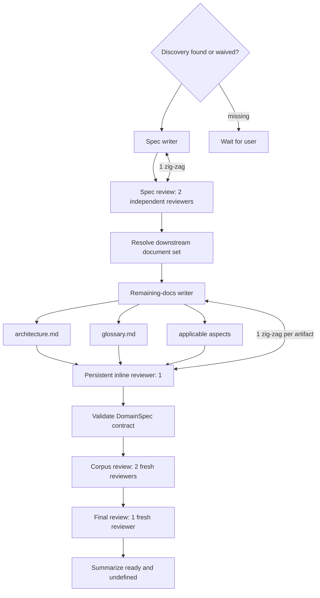
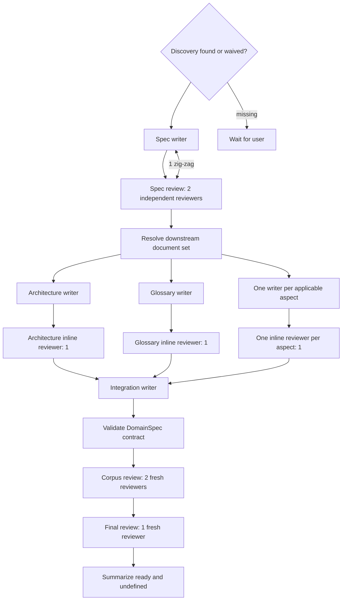

# DomainSpec Spec Feature — Protocol Design

This document is the human-readable source for the protocol graph prototype. It is not yet a
registered protocol or an executable dispatch.

## Stable meaning

Produce a complete, internally consistent and independently reviewed DomainSpec documentation set
for one feature before implementation begins.

The protocol preserves these boundaries:

- Discovery must exist or carry an explicit user waiver before authoring starts.
- SPEC is produced and approved before downstream documents start.
- SPEC review uses more than one independent reviewer.
- Every other produced product artifact receives one inline reviewer.
- After local reviews pass, fresh independent reviewers evaluate the complete corpus.
- One further fresh high-level reviewer performs final approval.
- Exhausted review or rework never implies approval.
- Review evidence is consumed by higher layers but is not recursively reviewed forever.

## Compiler inputs

- `domainspec/TAXONOMY.md`
- `domainspec/RELATIONSHIPS.md`
- `domainspec/templates/*.md`
- the governing discovery or explicit waiver;
- the selected feature and target `docs/features/{feature}/`;
- the exact source-skill and protocol revisions.

## Shared review contract

The two graphs use the same review contract. Work granularity changes ownership and topology, not
these values.

```protocol-review
spec_review:
  reviewers: 2
  robot_talks_rounds: 1
  zig_zag_loops: 1

artifact_review:
  reviewers: 1
  robot_talks_rounds: 0
  zig_zag_loops: 1

corpus_review:
  reviewers: 2
  robot_talks_rounds: 1
  zig_zag_loops: 1

final_review:
  reviewers: 1
```

`robot_talks_rounds` controls deliberation inside a multi-reviewer group after sealed independent
positions. `zig_zag_loops` controls bounded rework between producer ownership and the applicable
review group.

## Explicit source-skill supersessions

The prototype does not pretend that every topology rule came from the current source skill:

- the source's one document-check helper becomes more than one reviewer for SPEC;
- the source's sequential architecture → glossary → aspects order is preserved by Medium but
  superseded by parallel specialist cells in High;
- fresh complete-corpus review and final high-level review are added by user direction.

A promoted protocol would need to bind these decisions to durable authority or update the source
skill before activation.

## Graph primitives

| Primitive | Meaning |
|---|---|
| `owns` | One group has exclusive write ownership over an artifact or coherent bundle |
| `depends_on` | A group starts only after the source output is frozen |
| `inline_review` | A reviewer evaluates each produced artifact immediately |
| `robot_talks` | Reviewers deliberate after sealed independent positions |
| `zig_zag` | Producer and reviewers perform bounded rework |
| `join` | Wait for every incoming branch |
| `corpus_review` | Fresh reviewers evaluate all artifacts and local-review evidence |
| `final_review` | Final independent approval boundary |

## Medium graph

Medium uses persistent agents with broader ownership. One producer owns SPEC. After SPEC approval,
another producer owns all remaining documents. One persistent inline reviewer checks each of those
documents immediately as it is produced.



```protocol-graph
id: domainspec-spec-feature:medium
work_granularity: medium

groups:
  discovery_gate:
    kind: system_gate
    outcomes: [found, waived, waiting_user]

  spec_writer:
    owns: [SPEC.md]

  spec_review:
    reviews: [SPEC.md]
    contract: spec_review

  resolve_downstream_set:
    kind: system_resolution
    resolves: applicable_aspects

  remaining_writer:
    owns: [architecture.md, glossary.md, applicable_aspects]
    production_order: sequential

  remaining_inline_reviewer:
    reviews_each: remaining_writer.outputs
    contract: artifact_review
    identity: persistent

  contract_validation:
    kind: system_validation
    validates: complete_domainspec_contract

  corpus_review:
    reviews: all_product_artifacts
    contract: corpus_review
    identity: fresh

  final_review:
    reviews: complete_evidence
    contract: final_review
    identity: fresh

  summary:
    kind: system_projection
    emits: [ready, undefined, review_evidence, residual_dissent]

edges:
  - "discovery_gate -> spec_writer"
  - "spec_writer -> spec_review"
  - "spec_review -> resolve_downstream_set"
  - "resolve_downstream_set -> remaining_writer"
  - "remaining_writer <-> remaining_inline_reviewer"
  - "remaining_inline_reviewer -> contract_validation"
  - "contract_validation -> corpus_review"
  - "corpus_review -> final_review"
  - "final_review -> summary"
```

## High graph

High partitions downstream work into parallel specialist cells. Architecture, glossary and each
applicable aspect start from the same frozen SPEC snapshot. Each produced artifact has one inline
reviewer. A dedicated integrator reconciles the complete set before corpus review.



```protocol-graph
id: domainspec-spec-feature:high
work_granularity: high

groups:
  discovery_gate:
    kind: system_gate
    outcomes: [found, waived, waiting_user]

  spec_writer:
    owns: [SPEC.md]

  spec_review:
    reviews: [SPEC.md]
    contract: spec_review

  resolve_downstream_set:
    kind: system_resolution
    resolves: applicable_aspects

  architecture_cell:
    owns: [architecture.md]
    inline_review: artifact_review

  glossary_cell:
    owns: [glossary.md]
    inline_review: artifact_review

  aspect_cells:
    foreach: applicable_aspect
    owns: ["{aspect.path}"]
    inline_review: artifact_review

  integration_writer:
    owns: affected_product_artifacts
    rule: changed_artifacts_return_to_inline_review

  contract_validation:
    kind: system_validation
    validates: complete_domainspec_contract

  corpus_review:
    reviews: all_product_artifacts
    contract: corpus_review
    identity: fresh

  final_review:
    reviews: complete_evidence
    contract: final_review
    identity: fresh

  summary:
    kind: system_projection
    emits: [ready, undefined, review_evidence, residual_dissent]

edges:
  - "discovery_gate -> spec_writer"
  - "spec_writer -> spec_review"
  - "spec_review -> resolve_downstream_set"
  - "resolve_downstream_set -> [architecture_cell, glossary_cell, aspect_cells]"
  - "[architecture_cell, glossary_cell, aspect_cells] -> integration_writer"
  - "integration_writer -> contract_validation"
  - "contract_validation -> corpus_review"
  - "corpus_review -> final_review"
  - "final_review -> summary"
```

## Parallelism contract

Architecture, glossary and aspects may run in parallel only when:

- the exact SPEC snapshot is frozen and shared by digest;
- the applicable aspect set is resolved before launch;
- write paths do not overlap;
- the SPEC concept table is the provisional terminology authority;
- integration reconciles cross-document differences;
- every artifact changed by integration returns to inline review.

## Invalidation

- Changing SPEC invalidates every downstream artifact and review.
- Changing one downstream artifact invalidates its inline review, corpus review and final review.
- An integration change returns each affected artifact to its inline reviewer.
- Corpus rework invalidates final review.
- A rejected final review terminates unresolved in this prototype.

## Compilation boundary

The compiler consumes exactly one `protocol-review` block and the selected `protocol-graph` block.
It resolves concrete paths, aspects, seats, prompts, capabilities and budgets; expands `foreach`;
unrolls every bounded interaction; and emits a closed `DispatchSpec`.

Prose and Mermaid explain the design but do not add executable instructions.

## Open decisions

- Whether High always uses one writer per aspect or permits coherent aspect bundles.
- Whether the integration writer itself needs a separate inline reviewer.
- The exact aggregation rule for multi-reviewer verdicts.
- The exact terminal distinction between rejected, unresolved and user-decision-required.
