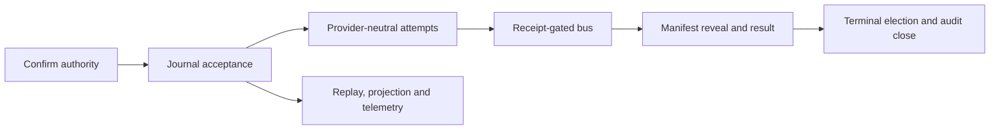

# Agents Communication Infra

## What This Module Owns

This feature owns the single-host, single-tenant runtime that turns one immutable human-confirmed dispatch into journaled protocol facts, controlled effects and one officially closed outcome. It owns authenticated agent publication, sealed reveal, provider-neutral attempts, replay and projections; the existing validated appender remains the only intended physical writer of official audit-ledger rows.

This baseline locks the authority and vocabulary of the operator-designated [discovery v0.2.1](discovery/feature-discovery/agents-communication-infra.md). `specAuthoringGate=pass` means the decisions are specified; `runtimeGate=block` means implementation is not authorized until W0 and EG-1 evidence close.

The external-dependency boundary is additionally ratified from [External Tool Adoptions v0.1.0](discovery/external-tool-adoptions.md): Python/FastAPI remains the runtime host, Pydantic core validates boundary models, and the runtime retains canonicalization, sealing, digest and persistence authority.

## Module Map

## Capabilities

| Capability | Outcome | Key contracts |
|---|---|---|
| Confirmed runtime authority | Freeze one runtime-managed dispatch and verify official opening before effects | [ConfirmRuntimeDispatch](operations.md#confirmruntimedispatch), [RunLifecycle](states.md#runlifecycle), [AuditLedgerMaterializer](workflows.md#auditledgermaterializer) |
| Deterministic execution | Drive groups and physical attempts from facts without provider branches | [AcceptRuntimeCommand](operations.md#acceptruntimecommand), [StartAgentAttempt](operations.md#startagentattempt), [AgentAdapter](interfaces.md#internal-agentadapter) |
| Receipt-gated publication | Accept agent content only after append and parent-side persisted-evidence verification | [PublishBusContribution](operations.md#publishbuscontribution), [VerifyPublicationReceipt](operations.md#verifypublicationreceipt), [bus_publish](interfaces.md#bus_publish) |
| Sealed reveal and commitment | Freeze a collection, publish an authorized manifest, commit one result and hand it off | [GroupDeliberationWorkflow](workflows.md#groupdeliberationworkflow), [GroupLifecycle](states.md#grouplifecycle), [RevealManifest](domain.md#revealmanifest) |
| Recovery and official closure | Recover local effects, reconcile cross-store rows and elect one audit close | [Persistence and replay](persistence-and-replay.md), [ExternalEffectReconciliationWorkflow](workflows.md#externaleffectreconciliationworkflow), [CancelRun](operations.md#cancelrun) |
| Read and accountability | Rebuild cursor-addressable state and preserve immutable usage/evidence semantics | [GetRuntimeProjection](queries.md#getruntimeprojection), [RecordUsageObservation](operations.md#recordusageobservation), [Observability](observability.md) |
| Governed dependency adoption | Admit libraries and real providers only at named seams with authority, sandbox and conformance evidence | [ExternalToolAdoptionPolicy](rules.md#aci-r15--external-tool-adoption-policy), [ProviderAdapterAdmissionGate](rules.md#aci-r18--provider-adapter-admission-gate), [SoleWriterEvidenceBundle](domain.md#solewriterevidencebundle) |

### Recoverable Runtime Authority

Freezes one runtime-managed dispatch, commits its commands and facts atomically, reconciles official audit opening/close and reconstructs the same authoritative state after restart. See [RunExecutionWorkflow](workflows.md#runexecutionworkflow), [Persistence and replay](persistence-and-replay.md) and [RunLifecycle](states.md#runlifecycle).

### Receipt-Gated Deliberation

Accepts agent-authored content only through authenticated append-before-ack publication, keeps collection sealed and grants peer visibility only through a persisted reveal manifest. See [ReceiptGatedPublicationWorkflow](workflows.md#receiptgatedpublicationworkflow), [PublishBusContribution](operations.md#publishbuscontribution) and [GroupLifecycle](states.md#grouplifecycle).

### Provider-Neutral Agent Execution

Runs fake, Codex and later provider adapters through one canonical request, observation and lifecycle contract without provider-specific kernel branches. See [AgentAdapter](interfaces.md#internal-agentadapter), [AgentExecutionRequest](domain.md#agentexecutionrequest) and [AttemptLifecycle](states.md#attemptlifecycle).

### Operator Projection and Usage Accountability

Provides cursor-addressable, rebuildable run views and immutable provider-attributed usage observations while preserving nullable dimensions and avoiding unsupported billing claims. See [GetRuntimeProjection](queries.md#getruntimeprojection), [RecordUsageObservation](operations.md#recordusageobservation) and [Observability](observability.md).

## Authority Locked From Discovery v0.2.1

| Decision | Ratified contract | Where |
|---|---|---|
| ACI-D1 | `agents-communication-infra` owns the single target runtime; no parallel runtime feature is created. | [Architecture scope boundary](architecture.md#scope-boundary) |
| ACI-D2 | Journal, audit ledger, adapters, projections and compatibility surfaces own disjoint facts. | [ACI-R1](rules.md#aci-r1--disjoint-authority-and-one-physical-writer) |
| ACI-D3 | Human confirmation freezes one immutable `ConfirmedDispatch` and digest. | [ConfirmRuntimeDispatch](operations.md#confirmruntimedispatch) |
| ACI-D4 | The event journal is workflow authority and replay reduces persisted facts only. | [Pure replay](persistence-and-replay.md#6-replay-algorithm-and-proof-obligation) |
| ACI-D5 | The current validated appender is the intended sole physical audit-ledger writer; cutover awaits enforcement evidence. | [AuditLedgerMaterializer](workflows.md#auditledgermaterializer) |
| ACI-D6 | No provider or tool effect starts before verified official opening. | [ACI-R13](rules.md#aci-r13--audit-opening-gates-every-providertool-effect) |
| ACI-D7 | The initial runtime is single-host and single-tenant. | [Architecture scope boundary](architecture.md#scope-boundary) |
| ACI-D8 | Deterministic fake adapters precede every real provider integration. | [Heterogeneous-provider conformance](interfaces.md#heterogeneous-provider-conformance) |
| ACI-D9 | Every dispatch has exactly one immutable execution authority mode during migration. | [ExecutionAuthorityCutoverWorkflow](workflows.md#executionauthoritycutoverworkflow) |
| ACI-D10 | Provider and business-workflow names cannot create kernel branches. | [ACI-R10](rules.md#aci-r10--provider-heterogeneity-cannot-fork-protocol) |
| ACI-D11 | Minimal durable outbox and exact-row reconciliation are part of L0. | [Cross-store reconciliation](persistence-and-replay.md#8-cross-store-reconciliation) |
| ACI-D12 | Official contributions use append-before-ack and require parent-side persisted-receipt verification. | [ReceiptGatedPublicationWorkflow](workflows.md#receiptgatedpublicationworkflow) |
| ACI-D13 | Effective model input, raw provider output and accepted bus message are separate immutable records. | [ACI-R9](rules.md#aci-r9--input-output-and-accepted-message-are-distinct-evidence) |
| ACI-D14 | Authenticated runtime context supplies authority identities; agent payloads cannot self-assert them. | [ACI-R2](rules.md#aci-r2--runtime-derived-authority) |
| ACI-D15 | Provider-reported usage is immutable, nullable and aggregated without claiming billing equivalence. | [Usage and cost accountability](observability.md#usage-and-cost-accountability-oq-aci10) |

Candidate labels in the discovery are ratified as DomainSpec contracts by this baseline, but they remain unimplemented claims until their gates pass.

## External-Tool Decisions Ratified From Discovery v0.1.0

| Decision | Ratified contract | Where |
|---|---|---|
| ETD-1 | Runtime code remains in the existing Python/FastAPI host. | [Architecture scope boundary](architecture.md#scope-boundary) |
| ETD-2 | Pydantic core validates Python boundary models; versioned canonical projection, canonical JSON bytes, immutability and SHA-256 sealing remain runtime-owned. | [ACI-R16](rules.md#aci-r16--canonical-contract-policy) |
| ETD-3 | The first real provider is a repository-local subprocess `AgentAdapter` behind `SandboxLauncher`, after fake-adapter and admission evidence. | [Provider implementation boundary](interfaces.md#provider-implementation-and-admission-boundary) |
| ETD-4 | Octopus Runtime and Eve are reference-only and cannot own kernel ports, lifecycle, journal, replay, effects or authoritative stores. | [ACI-R15](rules.md#aci-r15--external-tool-adoption-policy) |
| ETD-5 | PydanticAI is deferred to a future direct-API adapter experiment and is not a kernel schema dependency. | [ACI-R18](rules.md#aci-r18--provider-adapter-admission-gate) |
| ETD-6 | Zod is allowed only at an identified Node transport boundary using generated bindings/shared vectors derived from Python authority. | [ACI-R17](rules.md#aci-r17--derived-boundary-validation-policy) |
| ETD-7 | A single-import lint is auxiliary evidence only; it cannot close EG-1 without the complete sole-writer proof. | [SoleWriterEvidenceBundle](domain.md#solewriterevidencebundle) |

## Open-Question Settlement

| Question | Settlement |
|---|---|
| OQ-ACI1 | One SQLite/WAL database, one writer boundary, global offset, contiguous aggregate versions and atomic receipt/events/head/new-intents acceptance. |
| OQ-ACI2 | Fixed proof requires two valid votes: equal = consensus, conflicting = dissent, fewer than two = no quorum. |
| OQ-ACI3 | One run terminal maps to `resolved`, `dissent_irreconcilable`, `loop_ceiling_reached`, `user_abort` or `error`; lower-level terminals never map directly. |
| OQ-ACI4 | Confirmed bytes, executable versions, policies, snapshots and capability resolution freeze; external observations become later events. |
| OQ-ACI5 | Exact canonical row comparison yields absent/identical/divergent reconciliation; divergence blocks effects or closure. |
| OQ-ACI6 | Immutable pre-confirmation `ExecutionAuthorityMode` prevents dual execution and preserves explicit rollback to legacy. |
| OQ-ACI7 | SQLite uses WAL with `synchronous=FULL` throughout proof and pilot. |
| OQ-ACI8 | One ordered, content-addressed effective-input manifest records observable provider input per attempt. |
| OQ-ACI9 | Sensitive immutable artifact boundary is ratified; concrete retention, encryption and key parameters remain blocking ADR work. |
| OQ-ACI10 | Usage records stay nullable and provider-attributed; cost requires a versioned price source and is never asserted as billing truth. |
| OQ-ETA1 | **Deferred blocker:** W0 must pin the Pydantic version and canonical JSON rules and accept golden digest/round-trip vectors before runtime code. The current transitive, unpinned Pydantic dependency is not evidence. |
| OQ-ETA2 | **Contract ratified, cutover proof open:** W0 freezes the `SoleWriterEvidenceBundle` schema, drift disposition, guard specification and named tests; TASK-020 supplies host/process/ACL/writer-inventory/negative-test evidence before materializer cutover, without blocking TASK-010. |
| OQ-ETA4 | **Disposed for this slice:** no current Node consumer is authorized to consume ACI canonical contracts, so Zod is not added. A later inventoried consumer must use derived bindings/vectors. |
| OQ-ETA5 | **Deferred:** no named direct-model API use case exists; PydanticAI remains outside the plan until after the subprocess adapter and a separate comparison gate. |
| OQ-ETA6 | **Disposed, non-blocking:** `findings.md` and its four concrete siblings are sufficient provenance; a physical `research.md` aggregate is research-pipeline maintenance, not a feature gate. |

## Concept Registry

IDs below are unique and authoritative for registry synchronization.

| Concept | ID | Type |
|---|---|---|
| [ConfirmedDispatch](domain.md#confirmeddispatch) | `agents-communication-infra.ConfirmedDispatch` | Entity |
| [Run](domain.md#run) | `agents-communication-infra.Run` | Entity |
| [Group](domain.md#group) | `agents-communication-infra.Group` | Entity |
| [Seat](domain.md#seat) | `agents-communication-infra.Seat` | Entity |
| [Attempt](domain.md#attempt) | `agents-communication-infra.Attempt` | Entity |
| [Contribution](domain.md#contribution) | `agents-communication-infra.Contribution` | Entity |
| [PublicationCandidate](domain.md#publicationcandidate) | `agents-communication-infra.PublicationCandidate` | Entity |
| [EffectIntent](domain.md#effectintent) | `agents-communication-infra.EffectIntent` | Entity |
| [Artifact](domain.md#artifact) | `agents-communication-infra.Artifact` | Entity |
| [EffectiveInputArtifact](domain.md#effectiveinputartifact) | `agents-communication-infra.EffectiveInputArtifact` | Entity |
| [RawProviderOutput](domain.md#rawprovideroutput) | `agents-communication-infra.RawProviderOutput` | Entity |
| [RevealManifest](domain.md#revealmanifest) | `agents-communication-infra.RevealManifest` | Entity |
| [GroupResult](domain.md#groupresult) | `agents-communication-infra.GroupResult` | Entity |
| [DispatchSpec](domain.md#dispatchspec) | `agents-communication-infra.DispatchSpec` | Value Object |
| [AgentInvocationPlan](domain.md#agentinvocationplan) | `agents-communication-infra.AgentInvocationPlan` | Value Object |
| [MaterializedAgentInvocation](domain.md#materializedagentinvocation) | `agents-communication-infra.MaterializedAgentInvocation` | Value Object |
| [AgentExecutionRequest](domain.md#agentexecutionrequest) | `agents-communication-infra.AgentExecutionRequest` | Value Object |
| [BusPublication](domain.md#buspublication) | `agents-communication-infra.BusPublication` | Value Object |
| [PublicationReceipt](domain.md#publicationreceipt) | `agents-communication-infra.PublicationReceipt` | Value Object |
| [AgentTerminalResult](domain.md#agentterminalresult) | `agents-communication-infra.AgentTerminalResult` | Value Object |
| [EffectiveInputEntry](domain.md#effectiveinputentry) | `agents-communication-infra.EffectiveInputEntry` | Value Object |
| [ResourceBudget](domain.md#resourcebudget) | `agents-communication-infra.ResourceBudget` | Value Object |
| [SandboxPolicy](domain.md#sandboxpolicy) | `agents-communication-infra.SandboxPolicy` | Value Object |
| [ExecutionAuthorityFence](domain.md#executionauthorityfence) | `agents-communication-infra.ExecutionAuthorityFence` | Value Object |
| [RuntimeCommand](domain.md#runtimecommand) | `agents-communication-infra.RuntimeCommand` | Value Object |
| [RuntimeEventEnvelope](domain.md#runtimeeventenvelope) | `agents-communication-infra.RuntimeEventEnvelope` | Value Object |
| [AggregateVersion](domain.md#aggregateversion) | `agents-communication-infra.AggregateVersion` | Value Object |
| [JournalOffset](domain.md#journaloffset) | `agents-communication-infra.JournalOffset` | Value Object |
| [ContentDigest](domain.md#contentdigest) | `agents-communication-infra.ContentDigest` | Value Object |
| [ArtifactId](domain.md#artifactid) | `agents-communication-infra.ArtifactId` | Value Object |
| [SeatId](domain.md#seatid) | `agents-communication-infra.SeatId` | Value Object |
| [VersionedReference](domain.md#versionedreference) | `agents-communication-infra.VersionedReference` | Value Object |
| [ManifestEntry](domain.md#manifestentry) | `agents-communication-infra.ManifestEntry` | Value Object |
| [ExecutionAuthorityMode](domain.md#executionauthoritymode) | `agents-communication-infra.ExecutionAuthorityMode` | Enum / Type |
| [ReconciliationState](domain.md#reconciliationstate) | `agents-communication-infra.ReconciliationState` | Enum / Type |
| [RetryClass](domain.md#retryclass) | `agents-communication-infra.RetryClass` | Enum / Type |
| [EffectStatus](domain.md#effectstatus) | `agents-communication-infra.EffectStatus` | Enum / Type |
| [ArtifactClassification](domain.md#artifactclassification) | `agents-communication-infra.ArtifactClassification` | Enum / Type |
| [SoleWriterEvidenceBundle](domain.md#solewriterevidencebundle) | `agents-communication-infra.SoleWriterEvidenceBundle` | Value Object |
| [AcceptRuntimeCommand](operations.md#acceptruntimecommand) | `agents-communication-infra.AcceptRuntimeCommand` | Operation |
| [ConfirmRuntimeDispatch](operations.md#confirmruntimedispatch) | `agents-communication-infra.ConfirmRuntimeDispatch` | Operation |
| [StartAgentAttempt](operations.md#startagentattempt) | `agents-communication-infra.StartAgentAttempt` | Operation |
| [PublishBusContribution](operations.md#publishbuscontribution) | `agents-communication-infra.PublishBusContribution` | Operation |
| [VerifyPublicationReceipt](operations.md#verifypublicationreceipt) | `agents-communication-infra.VerifyPublicationReceipt` | Operation |
| [CloseCollection](operations.md#closecollection) | `agents-communication-infra.CloseCollection` | Operation |
| [PublishRevealManifest](operations.md#publishrevealmanifest) | `agents-communication-infra.PublishRevealManifest` | Operation |
| [CommitGroupResult](operations.md#commitgroupresult) | `agents-communication-infra.CommitGroupResult` | Operation |
| [CancelRun](operations.md#cancelrun) | `agents-communication-infra.CancelRun` | Operation |
| [RecordUsageObservation](operations.md#recordusageobservation) | `agents-communication-infra.RecordUsageObservation` | Operation |
| [GetRuntimeProjection](queries.md#getruntimeprojection) | `agents-communication-infra.GetRuntimeProjection` | Query |
| [GetRunStatus](queries.md#getrunstatus) | `agents-communication-infra.GetRunStatus` | Query |
| [GetVisibleGroupMessages](queries.md#getvisiblegroupmessages) | `agents-communication-infra.GetVisibleGroupMessages` | Query |
| [RunLifecycle](states.md#runlifecycle) | `agents-communication-infra.RunLifecycle` | State Machine |
| [GroupLifecycle](states.md#grouplifecycle) | `agents-communication-infra.GroupLifecycle` | State Machine |
| [AttemptLifecycle](states.md#attemptlifecycle) | `agents-communication-infra.AttemptLifecycle` | State Machine |
| [EventJournal](interfaces.md#internal-eventjournal) | `agents-communication-infra.EventJournal` | Interface |
| [AgentAdapter](interfaces.md#internal-agentadapter) | `agents-communication-infra.AgentAdapter` | Interface |
| [DeliberationBus](interfaces.md#internal-deliberationbus) | `agents-communication-infra.DeliberationBus` | Interface |
| [RuntimeCommandAPI](interfaces.md#external-runtime-command-api-http-or-equivalent-command-transport) | `agents-communication-infra.RuntimeCommandAPI` | Interface |
| [AgentToolGateway](interfaces.md#external-agent-tool-gateway-mcp-or-equivalent) | `agents-communication-infra.AgentToolGateway` | Interface |
| [ArtifactBoundary](interfaces.md#internal-artifact-boundary) | `agents-communication-infra.ArtifactBoundary` | Interface |
| [SandboxLauncher](interfaces.md#internal-sandboxlauncher) | `agents-communication-infra.SandboxLauncher` | Interface |
| [AuditLedgerAppenderPort](interfaces.md#internal-audit-ledger-appender-port) | `agents-communication-infra.AuditLedgerAppenderPort` | Interface |
| [RunExecutionWorkflow](workflows.md#runexecutionworkflow) | `agents-communication-infra.RunExecutionWorkflow` | Workflow |
| [GroupDeliberationWorkflow](workflows.md#groupdeliberationworkflow) | `agents-communication-infra.GroupDeliberationWorkflow` | Workflow |
| [ReceiptGatedPublicationWorkflow](workflows.md#receiptgatedpublicationworkflow) | `agents-communication-infra.ReceiptGatedPublicationWorkflow` | Workflow |
| [AuditLedgerMaterializer](workflows.md#auditledgermaterializer) | `agents-communication-infra.AuditLedgerMaterializer` | Workflow |
| [ExternalEffectReconciliationWorkflow](workflows.md#externaleffectreconciliationworkflow) | `agents-communication-infra.ExternalEffectReconciliationWorkflow` | Workflow |
| [ExecutionAuthorityCutoverWorkflow](workflows.md#executionauthoritycutoverworkflow) | `agents-communication-infra.ExecutionAuthorityCutoverWorkflow` | Workflow |
| [AgentInvocationPlanToMaterializedInvocation](mappings.md#agentinvocationplantomaterializedinvocation) | `agents-communication-infra.AgentInvocationPlanToMaterializedInvocation` | Mapping |
| [RawProviderOutputToCanonicalObservations](mappings.md#rawprovideroutputtocanonicalobservations) | `agents-communication-infra.RawProviderOutputToCanonicalObservations` | Mapping |
| [BusPublicationToContribution](mappings.md#buspublicationtocontribution) | `agents-communication-infra.BusPublicationToContribution` | Mapping |
| [RevealManifestToEffectiveInput](mappings.md#revealmanifesttoeffectiveinput) | `agents-communication-infra.RevealManifestToEffectiveInput` | Mapping |
| [FrozenAuthorityToAuditLedgerRow](mappings.md#frozenauthoritytoauditledgerrow) | `agents-communication-infra.FrozenAuthorityToAuditLedgerRow` | Mapping |
| [RuntimeTerminalToExitReason](mappings.md#runtimeterminaltoexitreason) | `agents-communication-infra.RuntimeTerminalToExitReason` | Mapping |
| [UsageObservationToRollups](mappings.md#usageobservationtorollups) | `agents-communication-infra.UsageObservationToRollups` | Mapping |
| [UsageObservation](events.md#usageobserved) | `agents-communication-infra.UsageObservation` | Event |
| [PricingSource](persistence-and-replay.md#pricing_sources-usage_rollups-and-cost_calculations) | `agents-communication-infra.PricingSource` | Entity |
| [UsageRollup](persistence-and-replay.md#pricing_sources-usage_rollups-and-cost_calculations) | `agents-communication-infra.UsageRollup` | Value Object |
| [CostCalculation](persistence-and-replay.md#pricing_sources-usage_rollups-and-cost_calculations) | `agents-communication-infra.CostCalculation` | Calculation |
| [ExternalToolAdoptionPolicy](rules.md#aci-r15--external-tool-adoption-policy) | `agents-communication-infra.ExternalToolAdoptionPolicy` | Policy |
| [CanonicalContractPolicy](rules.md#aci-r16--canonical-contract-policy) | `agents-communication-infra.CanonicalContractPolicy` | Policy |
| [BoundaryValidationPolicy](rules.md#aci-r17--derived-boundary-validation-policy) | `agents-communication-infra.BoundaryValidationPolicy` | Policy |
| [ProviderAdapterAdmissionGate](rules.md#aci-r18--provider-adapter-admission-gate) | `agents-communication-infra.ProviderAdapterAdmissionGate` | Rule |

`RuntimeEventType` wire values and the explicitly labeled internal transitions in `operations.md`
are intentionally not registry concepts; they are closed vocabularies/decompositions of registered
contracts rather than independently owned DomainSpec concepts.

## Domain Concepts

The registry is the canonical index of the entities, values, operations, queries, lifecycles,
interfaces, workflows, mappings and evidence records defined by the aspect documents. Behavioral
detail remains authoritative in the linked aspect; this index supplies stable identity and type.

## Cross-Feature Dependencies

- Human confirmation and the pending-sheet UI supply immutable approved bytes but do not execute.
- The engine audit ledger and validated appender retain exclusive physical authority over official
  opening and close rows.
- Provider CLIs/APIs and artifact storage are outbound dependencies behind `AgentAdapter`,
  `SandboxLauncher` and `ArtifactBoundary`.
- Legacy watcher/session execution is a migration dependency fenced by `ExecutionAuthorityMode` and
  `ExecutionAuthorityFence`.

## Produces For

- Runtime projections and cursor streams for operator/UI consumers.
- Verified opening/close materialization requests for the audit-ledger appender.
- Immutable effective-input, raw-output, publication, reveal, usage and cost-evidence records for
  testing, audit and later analytics.
- Provider-neutral invocation and terminal contracts for Codex, Claude and future adapters.

## Stories

Feature stories are **deferred / not created** in this authoring pass. The work-pack tasks remain the
implementation-planning authority until W0 decisions are accepted and evidenced.

## References

- [Discovery v0.2.1](discovery/feature-discovery/agents-communication-infra.md)
- [External Tool Adoptions v0.1.0](discovery/external-tool-adoptions.md)
- [External-tool findings v0.1.1](../../../research/external-tools-verification/findings.md)
- [Architecture](architecture.md)
- [Test specification](TEST-SPEC.md)
- [Work pack](WORK-PACK.md)

## Decision Precedence

The persistence, transaction, terminal, snapshot and repair contracts in these drafts are
**specified/proposed, not W0-accepted**. Discovery decisions ACI-D1 through ACI-D15 retain their
individual identities; accepted W0 ADRs take precedence over proposed details where they amend them.
External-tool decisions ETD-1 through ETD-7 are binding adoption constraints. Their unresolved
version, host-enforcement and evidence parameters remain explicit gates rather than implicit defaults.

## Feature Concept Graph

| From | Edge | To | Evidence |
|---|---|---|---|
| `agents-communication-infra.RunExecutionWorkflow` | orchestrates | `agents-communication-infra.ConfirmRuntimeDispatch` | [workflow](workflows.md#runexecutionworkflow) |
| `agents-communication-infra.RunExecutionWorkflow` | orchestrates | `agents-communication-infra.StartAgentAttempt` | [workflow](workflows.md#runexecutionworkflow) |
| `agents-communication-infra.GroupDeliberationWorkflow` | orchestrates | `agents-communication-infra.PublishBusContribution` | [workflow](workflows.md#groupdeliberationworkflow) |
| `agents-communication-infra.ReceiptGatedPublicationWorkflow` | orchestrates | `agents-communication-infra.VerifyPublicationReceipt` | [workflow](workflows.md#receiptgatedpublicationworkflow) |
| `agents-communication-infra.RuntimeCommandAPI` | exposes | `agents-communication-infra.ConfirmRuntimeDispatch` | [interface](interfaces.md#post-dispatchesdispatch_idconfirm) |
| `agents-communication-infra.AgentToolGateway` | exposes | `agents-communication-infra.PublishBusContribution` | [interface](interfaces.md#bus_publish) |
| `agents-communication-infra.GetRuntimeProjection` | queries | `agents-communication-infra.Run` | [query](queries.md#getruntimeprojection) |
| `agents-communication-infra.GetVisibleGroupMessages` | queries | `agents-communication-infra.Contribution` | [query](queries.md#getvisiblegroupmessages) |
| `agents-communication-infra.BusPublicationToContribution` | maps | `agents-communication-infra.Contribution` | [mapping](mappings.md#buspublicationtocontribution) |
| `agents-communication-infra.AgentInvocationPlanToMaterializedInvocation` | maps | `agents-communication-infra.EffectiveInputArtifact` | [mapping](mappings.md#agentinvocationplantomaterializedinvocation) |
| `agents-communication-infra.ExternalToolAdoptionPolicy` | constrains | `agents-communication-infra.AgentAdapter` | [rule](rules.md#aci-r15--external-tool-adoption-policy) |
| `agents-communication-infra.CanonicalContractPolicy` | seals | `agents-communication-infra.AgentExecutionRequest` | [rule](rules.md#aci-r16--canonical-contract-policy) |
| `agents-communication-infra.BoundaryValidationPolicy` | constrains | `agents-communication-infra.RuntimeCommandAPI` | [rule](rules.md#aci-r17--derived-boundary-validation-policy) |
| `agents-communication-infra.ProviderAdapterAdmissionGate` | gates | `agents-communication-infra.SandboxLauncher` | [rule](rules.md#aci-r18--provider-adapter-admission-gate) |
| `agents-communication-infra.SoleWriterEvidenceBundle` | evidences | `agents-communication-infra.AuditLedgerAppenderPort` | [domain](domain.md#solewriterevidencebundle) |

## Aspect Docs

| Aspect | Contains |
|---|---|
| [Architecture](architecture.md) | Six views, boundaries, decisions, risks and implementation gate |
| [Glossary](glossary.md) | Plain-language definitions for the registry |
| [Domain](domain.md) | Entities, values and enums |
| [Rules](rules.md) | Authority, replay, sealing, durability and evidence invariants |
| [Persistence and replay](persistence-and-replay.md) | SQLite/WAL contract, tables, crash boundaries and replay proof |
| [Operations](operations.md) | Mutation contracts |
| [Interfaces](interfaces.md) | Command, agent-tool, journal, adapter, bus and artifact boundaries |
| [Queries](queries.md) | Rebuildable reads and visibility rules |
| [Mappings](mappings.md) | Canonical transformations and rollups |
| [Workflows](workflows.md) | Run, group, publication, materialization, recovery and cutover |
| [States](states.md) | Run, group and attempt lifecycles |
| [Events](events.md) | Accepted facts and consumers |
| [Observability](observability.md) | Metrics, SLO obligations and alerts |
| [Test Spec](TEST-SPEC.md) | Contract, crash, replay, sealing and conformance fixtures |

## Scope and Dependencies

The feature depends on human confirmation, the current validated audit-ledger appender, provider/tool transports and local artifact storage. It does not own multi-host HA, multi-tenancy, arbitrary executable recipes, mutating code workflows, provider billing truth or autonomous knowledge promotion.

## Gate Result

- Spec authoring: **pass** — ACI-D1–D15, ETD-1–ETD-7 and their OQ dispositions have traceable contracts.
- Runtime implementation: **block** — W0 persistence/schema/canonicalization/crash evidence and its
  contract decisions remain required. Once W0 accepts B-001/B-002 and freezes B-003's bundle,
  drift, guard and test specification, TASK-010 may start; retention/credential ADRs and the complete
  target-host EG-1 proof continue to gate their later slices and audit materializer cutover.

## Change History

See [CHANGELOG.md](CHANGELOG.md).
