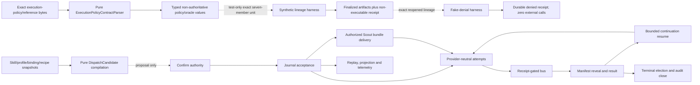

# Agents Communication Infra

## What This Module Owns

This feature owns ACI Protocol Governance and the single-host, single-tenant runtime boundary. Protocol Governance owns `SkillExecutionProfile`, `SkillProtocolBinding`, `ProtocolRecipe`/DAG and deterministic compilation through a non-authoritative `DispatchCandidate`; the bounded v1 slice below admits one frozen built-in package with a compiled case and a required-unsupported case, without creating runtime authority or effects. The runtime boundary turns one immutable human-confirmed dispatch into journaled protocol facts, controlled effects and one officially closed outcome. It owns authenticated agent publication, sealed reveal, provider-neutral attempts, replay and projections; its bus/journal/receipt authority also owns the Reference Scout lifecycle facts and the specified target-attempt delivery of an accepted bundle into canonical effective input. APT owns downstream research lineage/query and `ResearchReferenceUse`; the host owns `host.SourceObservation`. The existing validated appender remains the only intended physical writer of official audit-ledger rows.

This baseline derives authority and vocabulary from the operator-designated
[discovery v0.2.1](../discovery/feature-discovery/agents-communication-infra.md), with the
runtime-only confirmation clarification in
[Agent tools and delegated supervision v0.2.0](../discovery/agent-tools-and-delegated-supervision.md)
refining the earlier generic wording of ACI-D3. `specAuthoringGate=pass` means the decisions are
specified. `runtimeGate=block` now means that the general runtime and cutover are not authorized;
it does not erase the narrower local-pilot authorization and evidence recorded below.

The external-dependency boundary is additionally ratified from [External Tool Adoptions v0.1.0](../discovery/external-tool-adoption/external-tool-adoptions.md): Python/FastAPI remains the runtime host and Pydantic core validates boundary models. Each owning ACI boundary retains its canonical projection and digest authority: Protocol Governance for candidate/result, the runtime for runtime contracts, and ArtifactStore for optional persistence metadata.

The human [ACI-PG-001 decision](../../../decisions/aci-protocol-governance-ownership.md), recorded as ACPD-4 in [Agents Communication Protocols v0.5.0](../discovery/agents-communication-protocols/README.md) and as ATD-9 in [Agent Tools and Delegated Supervision v0.2.0](../discovery/agent-tools-and-delegated-supervision.md), authorizes the bounded [protocol-compilation contract](protocol-compilation.md). It does not authorize capability grants, confirmation, a `ConfirmedDispatch`, a `Run`, providers, scheduling, or runtime-managed execution.

## Implementation Baseline

The specification is no longer only a pre-implementation design. The canonical implementation
target is [`implementations/server/runtime/`](../../../../implementations/server/runtime/); the
separate [`implementations/agent-runtime/`](../../../../implementations/agent-runtime/) package is an
experimental shadow/compatibility probe, not a second authoritative runtime.

| Contract slice | State | Evidence | Limit |
|---|---|---|---|
| Canonical commands, journal, immutable artifacts, exact profiles and replayable projections | Implemented and verified in the bounded runtime | [Stage B receipt](../../agent-provenance-telemetry/integration/stage-b/execution-receipt.md) | Production routes remain disabled. |
| Dedicated loopback composition, preflight, integrity checks and scoped capabilities | Accepted local pilot | [Stage C enablement](../../agent-provenance-telemetry/integration/stage-c/local-pilot-enablement.md) | Explicit opt-in, dedicated database and loopback only. |
| Validated YAML/ACI opening-and-close bridge, source integrity and operator recovery | Accepted local pilot | [Stage E receipt](../../agent-provenance-telemetry/integration/stage-e/execution-receipt.md) | Operator-mediated pilot; not runtime-managed YAML cutover. |
| Claude/Codex project hook wrapper | Implemented and verified after host loading | [Stage F receipt](../../agent-provenance-telemetry/integration/stage-f/execution-receipt.md) | No administrator-enforced loading and no proved model-originated spawn; a host that does not load project hooks is outside the claim. |
| Reference Scout lifecycle and APT input-ingestion lineage | Operational local pilot | [Stage G receipt](../../agent-provenance-telemetry/integration/stage-g/execution-receipt.md) | Reference Scout commit/lifecycle delivery and APT ingestion only; ACI target-attempt delivery is not implemented. |
| Reference Scout bundle delivery into one target Attempt | Specified; not implemented | [AgentReferenceDelivery](domain.md#agentreferencedelivery), [mapping](mappings.md#referencescoutbundletoeffectiveinput) and [tests](../TEST-SPEC.md#t-aci-r22--reference-bundle-target-delivery) | Next bounded slice; inclusion evidence is not access, declared use or claim support. |
| Protocol compilation candidate v1 | Specified; normative review accepted | [Protocol compilation](protocol-compilation.md), [review](../reviews/2026-08-03-protocol-compilation-spec-review/review.md) | Work-pack readiness and executable conformance remain required before implementation is claimed. |
| POLICY-000 execution-policy contract oracle | Specified; implementation separately gated | [Execution-policy contract and synthetic lineage](capabilities/execution-policy-authority.md), [parser interface](interfaces.md#internal-executionpolicycontractparser), [tests](TEST-SPEC.md#policy-000-l0-test-matrix) | Pure strict parsing, canonicalization, digest and mutation vectors only; no implementation claim, DB, service, Run, plan/request, effect or product authority. |
| POLICY-001 synthetic-authority lineage | Specified; implementation separately gated | [Execution-policy contract and synthetic lineage](capabilities/execution-policy-authority.md), [persistence inventory](../development/invoke-runs/20260831-resumable-feedback/plan/evidence/POLICY-001-PERSISTENCE-PATTERN-INVENTORY.md) | Isolated test-only persistence and reopen proof; no production migration/service/API/journal/export, [ConfirmedDispatch](domain.md#confirmeddispatch), [Run](domain.md#run), [AgentInvocationPlan](domain.md#agentinvocationplan), [AgentExecutionRequest](domain.md#agentexecutionrequest), [RuntimeEventEnvelope](domain.md#runtimeeventenvelope), [EffectIntent](domain.md#effectintent) or L2 behavior. |
| POLICY-002 fake deny-all | Specified; implementation separately gated | [Execution-policy capability](capabilities/execution-policy-authority.md#policy-002l2-fake-denial-invariants), [fake-denial interface](interfaces.md#internal-executionpolicyfakedenialharness-test-only), [tests](TEST-SPEC.md#policy-002-l2-test-matrix) | Test-only twelve-label denial and one durable receipt; no external callable/action, production row, provider, product grant, fence or POLICY-003/L3 evidence. |
| General runtime, materializer, provider launch and cutover | Blocked | This SPEC's gate plus TASK-020/EG-1 evidence obligations | No production or portability claim. |

`localPilotGate=pass` applies only to the exact bounded composition and receipts above.
`runtimeGate=block` continues to apply to production serving, runtime-managed YAML materialization,
generic provider launch, administrator-enforced hook loading and cutover.

The SPEC remains above the default 300-line capability-splitting threshold because its length is
dominated by the authoritative Concept Registry and decision tables. Coherent detail is routed
through dedicated [execution-policy](capabilities/execution-policy-authority.md) and
[resumable-continuation](capabilities/resumable-agent-continuation.md) capability files; the inline
entries below are indexes rather than duplicate specifications.

## Protocol Compilation Status

The repository already contains a concrete discovery direction for creating a governed protocol
from a skill:
[Agents Communication Protocols](../discovery/agents-communication-protocols/README.md). It proposes
`Skill Execution Profile`, stable `skill_id`, transitive skill and protocol manifests, immutable
protocol revisions, active bindings, a trust-anchored protocol-authoring command and deterministic
compilation into the existing `DispatchSpec`.

Ownership is ratified by [ACI-PG-001](../../../decisions/aci-protocol-governance-ownership.md).
The pure candidate-compilation slice is specified and independently reviewed in
[Protocol Compilation Candidate v1](protocol-compilation.md); its exact two-case bounded slice is
implemented and independently verified. The complete profile/compiler/registry surface
and every downstream runtime surface remain unratified. Earlier
integration assessments deferred that broader surface and recommended first proving a narrower
read-only boundary: [assessment B](../discovery/spec-integration-assessment/avaliacao-independente-b.md)
and [publication bridge assessment](../discovery/spec-integration-assessment/avaliacao-independente-publication-bridge.md).
Accordingly:

- [`skill-decomposer`](../../../../.agents/skills/skill-decomposer/SKILL.md) and
  [`skill-transcriptor`](../../../../.agents/skills/skill-transcriptor/SKILL.md) are authoring tools
  that extract or convert reusable sigil capabilities; they do not compile an executable skill
  protocol or bind it to a `DispatchSpec`;
- the [L4 implementation layer](../IMPLEMENTATION-LAYERING.md) names a future compiler into canonical
  `DispatchSpec`, but v1 stops earlier at `DispatchCandidate` and defines no trust anchor or
  `ProtocolAuthoringCommand`;
- the v1 compiler receives an exact active binding snapshot and one of two digest-pinned read-only
  cases in a single frozen built-in package as
  immutable inputs; it does not implement registry activation, supersession or revocation;
- the pending sheet remains proposal evidence only. The separate
  [Runtime Confirmation Authority v1](confirmation-authority.md) accepts the exact displayed
  `dispatch_spec_digest`; this protocol-candidate amendment neither produces that digest nor
  promotes the still-deferred candidate-to-confirmation mapping;
- arbitrary recipes, persistent registry lifecycle, candidate-to-`DispatchSpec` compilation,
  capability resolution, confirmation and execution require later promotion.

## Module Map

## Capabilities

| Capability | Outcome | Key contracts | Status |
|---|---|---|---|
| Pure protocol candidate compilation | Deterministically compile exact immutable inputs from one frozen built-in package into either a non-authoritative candidate or a closed required-unsupported result | [Protocol Compilation Candidate v1](protocol-compilation.md), [CompileDispatchCandidate](protocol-compilation.md#compiledispatchcandidate) | Specified; normative review accepted |
| [Closed execution-policy contract oracle](capabilities/execution-policy-authority.md) | Reject ambiguous resource, sandbox and fence documents and reproduce exact golden bytes/digests without creating execution authority | [ExecutionPolicyContractParser](interfaces.md#internal-executionpolicycontractparser), [ACI-R16](rules.md#aci-r16--canonical-contract-policy), [L0 tests](TEST-SPEC.md#policy-000-l0-test-matrix) | POLICY-000 L0 specified; implementation separately gated |
| [Synthetic execution-policy lineage](capabilities/execution-policy-authority.md) | Persist and reopen the exact seven POLICY-000 members plus one closed non-executable receipt as one all-or-none synthetic unit | [ExecutionPolicySyntheticLineageReceipt](domain.md#executionpolicysyntheticlineagereceipt), [L1 rules, harness and tests](capabilities/execution-policy-authority.md#policy-001l1-lineage-invariants) | POLICY-001 L1 specified by this amendment; implementation separately descriptor/readiness/review-gated; L2 behavior is excluded from POLICY-001 and specified separately by POLICY-002; L3 deferred |
| [Fake execution-policy denial](capabilities/execution-policy-authority.md) | Route twelve non-executable action-attempt labels over the exact reopened synthetic lineage to one durable `denied` receipt while every external-action spy remains zero | [ExecutionPolicyFakeDenialReceipt](domain.md#executionpolicyfakedenialreceipt), [ACI-R23](rules.md#aci-r23--synthetic-fake-denial-is-durable-without-attempted-effect), [L2 tests](TEST-SPEC.md#policy-002-l2-test-matrix) | POLICY-002 L2 specified; implementation separately descriptor/readiness/review-gated; product/provider/POLICY-003 deferred |
| Confirmed runtime authority | Freeze one runtime-managed dispatch and request official opening before effects | [Runtime Confirmation Authority v1](confirmation-authority.md), [ConfirmRuntimeDispatch](operations.md#confirmruntimedispatch), [CONF-001 evidence](../development/invoke-runs/20260831-resumable-feedback/evidence/CONF-001.md) | CONF-000 specified; CONF-001 implemented-reviewed only through durable `opening_pending` |
| Deterministic execution | Drive groups and physical attempts from facts without provider branches | [AcceptRuntimeCommand](operations.md#acceptruntimecommand), [StartAgentAttempt](operations.md#startagentattempt), [AgentAdapter](interfaces.md#internal-agentadapter) | Mixed; bounded pilot only |
| Authorized reference delivery | Bind one already lifecycle-delivered Scout bundle to one capability-derived target Attempt and its exact effective-input entry | [AgentReferenceDelivery](domain.md#agentreferencedelivery), [DeliverReferenceScoutBundleToAgent](operations.md#internal-transition--deliverreferencescoutbundletoagent), [target-delivery event](events.md#reference_scoutbundle_delivered_to_agent1) | Specified; not implemented |
| Receipt-gated publication | Accept agent content only after append and parent-side persisted-evidence verification | [PublishBusContribution](operations.md#publishbuscontribution), [VerifyPublicationReceipt](operations.md#verifypublicationreceipt), [bus_publish](interfaces.md#bus_publish) | Bounded local pilot |
| Authorized peer-input materialization | Bind one accepted reveal to one preallocated local target attempt and immutable effective input without claiming a provider effect | [PeerInputDelivery](domain.md#peerinputdelivery), [MaterializeAuthorizedPeerInput](operations.md#materializeauthorizedpeerinput), [`peer_input.materialized`](events.md#peer_inputmaterialized) | Implemented for exact bounded SWU |
| Host terminal-output handoff | Persist exact host-observed completed response bytes as shared content plus producer-turn evidence, then materialize one authorized required downstream slot in L0 | [HostTerminalResponseArtifact](domain.md#hostterminalresponseartifact), [SourceToSlotMapping](domain.md#sourcetoslotmapping), [MaterializeHostWorkflowInput](operations.md#materializehostworkflowinput), [AuthorizeHostWorkflowTurnLaunch](operations.md#authorizehostworkflowturnlaunch) | Specified for 1 producer → 1 required slot; not implemented |
| [Resumable agent continuation](capabilities/resumable-agent-continuation.md) | Park a terminal turn without polling, then resume the same provider session when possible or use an explicit reconstruction fallback | [AgentContinuation](domain.md#agentcontinuation), [AgentContinuationLifecycle](states.md#agentcontinuationlifecycle), [ResumableFeedbackWorkflow](workflows.md#resumablefeedbackworkflow) | Specified for one author-reviewer-author turn graph; not implemented |
| Sealed reveal and commitment | Freeze a collection, publish an authorized manifest, commit one result and hand it off | [GroupDeliberationWorkflow](workflows.md#groupdeliberationworkflow), [GroupLifecycle](states.md#grouplifecycle), [RevealManifest](domain.md#revealmanifest) | Specified; broader runtime gated |
| Recovery and official closure | Recover local effects, reconcile cross-store rows and elect one audit close | [Persistence and replay](persistence-and-replay.md), [ExternalEffectReconciliationWorkflow](workflows.md#externaleffectreconciliationworkflow), [CancelRun](operations.md#cancelrun) | Mixed; cutover blocked |
| Read and accountability | Rebuild cursor-addressable state and preserve immutable usage/evidence semantics | [GetRuntimeProjection](queries.md#getruntimeprojection), [RecordUsageObservation](operations.md#recordusageobservation), [Observability](observability.md) | Bounded local pilot |
| Governed dependency adoption | Admit libraries and real providers only at named seams with authority, sandbox and conformance evidence | [ExternalToolAdoptionPolicy](rules.md#aci-r15--external-tool-adoption-policy), [ProviderAdapterAdmissionGate](rules.md#aci-r18--provider-adapter-admission-gate), [SoleWriterEvidenceBundle](domain.md#solewriterevidencebundle) | Gates specified; broader promotion blocked |

### Recoverable Runtime Authority

Freezes one runtime-managed dispatch, commits its commands and facts atomically, reconciles official audit opening/close and reconstructs the same authoritative state after restart. See [RunExecutionWorkflow](workflows.md#runexecutionworkflow), [Persistence and replay](persistence-and-replay.md) and [RunLifecycle](states.md#runlifecycle).

### Receipt-Gated Deliberation

Accepts agent-authored content only through authenticated append-before-ack publication, keeps collection sealed and grants peer visibility only through a persisted reveal manifest. See [ReceiptGatedPublicationWorkflow](workflows.md#receiptgatedpublicationworkflow), [PublishBusContribution](operations.md#publishbuscontribution) and [GroupLifecycle](states.md#grouplifecycle).

### Provider-Neutral Agent Execution

Runs fake, Codex and later provider adapters through one canonical request, observation and lifecycle contract without provider-specific kernel branches. See [AgentAdapter](interfaces.md#internal-agentadapter), [AgentExecutionRequest](domain.md#agentexecutionrequest) and [AttemptLifecycle](states.md#attemptlifecycle).

### Operator Projection and Usage Accountability

Provides cursor-addressable, rebuildable run views and immutable provider-attributed usage observations while preserving nullable dimensions and avoiding unsupported billing claims. See [GetRuntimeProjection](queries.md#getruntimeprojection), [RecordUsageObservation](operations.md#recordusageobservation) and [Observability](observability.md).

## Authority Derived and Refined From Discovery

| Decision | Ratified contract | Where |
|---|---|---|
| ACI-D1 | `agents-communication-infra` owns the single target runtime; no parallel runtime feature is created. | [Architecture scope boundary](architecture.md#scope-boundary) |
| ACI-D2 | Journal, audit ledger, adapters, projections and compatibility surfaces own disjoint facts. | [ACI-R1](rules.md#aci-r1--disjoint-authority-and-one-physical-writer) |
| ACI-D3 | Runtime-managed human confirmation freezes one immutable `ConfirmedDispatch` and digest; a legacy routing choice stays outside this operation. | [ConfirmRuntimeDispatch](operations.md#confirmruntimedispatch) |
| ACI-D4 | The event journal is workflow authority and replay reduces persisted facts only. | [Pure replay](persistence-and-replay.md#6-replay-algorithm-and-proof-obligation) |
| ACI-D5 | The current validated appender is the intended sole physical audit-ledger writer; cutover awaits enforcement evidence. | [AuditLedgerMaterializer](workflows.md#auditledgermaterializer) |
| ACI-D6 | No provider or tool effect starts before verified official opening. | [ACI-R13](rules.md#aci-r13--audit-opening-gates-every-providertool-effect) |
| ACI-D7 | The initial runtime is single-host and single-tenant. | [Architecture scope boundary](architecture.md#scope-boundary) |
| ACI-D8 | Deterministic fake adapters precede every real provider integration. | [Heterogeneous-provider conformance](interfaces.md#heterogeneous-provider-conformance) |
| ACI-D9 | Every dispatch has exactly one immutable execution authority mode during migration. | [ExecutionAuthorityCutoverWorkflow](workflows.md#executionauthoritycutoverworkflow) |
| ACI-D10 | Provider and business-workflow names cannot create kernel branches. | [ACI-R10](rules.md#aci-r10--provider-heterogeneity-cannot-fork-protocol) |
| ACI-D11 | Minimal durable outbox and exact-row reconciliation are part of L0. | [Cross-store reconciliation](persistence-and-replay.md#8-cross-store-reconciliation) |
| ACI-D12 | Official contributions use append-before-ack and require parent-side persisted-receipt verification. | [ReceiptGatedPublicationWorkflow](workflows.md#receiptgatedpublicationworkflow) |
| ACI-D13 | Effective model input, raw provider output and accepted bus message are separate immutable records. | [ACI-R9](rules.md#aci-r9--input-output-and-accepted-message-are-distinct-evidence) |
| ACI-D14 | Authenticated runtime context supplies authority identities; agent payloads cannot self-assert them. | [ACI-R2](rules.md#aci-r2--runtime-derived-authority) |
| ACI-D15 | Provider-reported usage is immutable, nullable and aggregated without claiming billing equivalence. | [Usage and cost accountability](observability.md#usage-and-cost-accountability-oq-aci10) |
| ACI-CONT-001 | Same-session continuation is preferred but reconstruction evidence is authoritative; the first feedback workflow is a finite author-reviewer-author turn graph. | [Accepted continuation decision](../../../decisions/aci-resumable-agent-continuation.md) |
| ACI-PG-001 / ACPD-4 / ATD-9 | ACI Protocol Governance owns profile, binding, recipe/DAG and deterministic compilation only through non-authoritative `DispatchCandidate`; capability resolution, final `DispatchSpec`, confirmation and execution retain their existing owners. | [Protocol compilation candidate v1](protocol-compilation.md) |
Candidate labels in the discovery are ratified as DomainSpec contracts by this baseline. The
implementation matrix above identifies the subset with bounded local-pilot evidence; all other
contracts remain proposed or blocked until their own gates pass.

### Bounded SPEC amendment: target-attempt Reference Scout delivery

This v0.3.0 amendment applies the discovery's
[OQ-ACI8 canonical-input settlement](../discovery/feature-discovery/agents-communication-infra.md#oq-aci8--canonical-effective-input)
to accepted Stage G Scout source facts without inventing an `ACI-D16` discovery decision. It
specifies [AgentReferenceDelivery](domain.md#agentreferencedelivery), its target-delivery event and
effective-input mapping for the next bounded slice. It is not implemented, and inclusion remains
strictly weaker than access, declared use or claim support.

| Amendment element | Contract | DomainSpec type | Status |
|---|---|---|---|
| Capability | Authorized reference delivery | Capability summary | Specified; not implemented |
| Entity | [AgentReferenceDelivery](domain.md#agentreferencedelivery) | Entity | Specified; not implemented |
| Rule | [ACI-R19](rules.md#aci-r19--reference-bundle-delivery-is-source-bound-and-attempt-atomic) | Rule | Specified; not implemented |
| Internal transition | [DeliverReferenceScoutBundleToAgent](operations.md#internal-transition--deliverreferencescoutbundletoagent) | Operation | Specified; not implemented |
| Event | [`reference_scout.bundle_delivered_to_agent@1`](events.md#reference_scoutbundle_delivered_to_agent1) | Event | Specified; not implemented |
| Mapping | [ReferenceScoutBundleToEffectiveInput](mappings.md#referencescoutbundletoeffectiveinput) | Mapping | Specified; not implemented |
| Interface capability | [ArtifactBoundary target-reference settlement](interfaces.md#internal-artifact-boundary) | Interface | Specified; not implemented |

### Bounded SPEC amendment: authorized local peer-input materialization

This v0.3.1 amendment promotes only the discovery's manifest-bound delivery rule in
[section 5.1](../discovery/feature-discovery/agents-communication-infra.md#51-agent-input-bus-publication-and-reveal-delivery)
into one exact no-provider-effect proof, `SWU-ACI-BUS-DELIVERY-001`. It specifies how an already
accepted `reveal.published` fact becomes immutable observable input for one preallocated local
attempt. It does not promote dynamic `RoutingPlan`/`RoutingState`, inboxes, generic peer reads,
provider launch, voting/commit, audit-ledger materialization, sole-writer evidence or cutover.

| Amendment element | Contract | DomainSpec type | Status |
|---|---|---|---|
| Capability | Authorized peer-input materialization | Capability summary | Implemented for exact bounded SWU |
| Entity | [PeerInputDelivery](domain.md#peerinputdelivery) | Entity | Implemented for exact bounded SWU |
| Value object | [PeerInputDeliveryReceipt](domain.md#peerinputdeliveryreceipt) | Value Object | Implemented for exact bounded SWU |
| Operation | [AuthorizeAgentInvocationPlan](operations.md#authorizeagentinvocationplan) | Operation | Implemented for exact bounded SWU |
| Operation | [MaterializeAuthorizedPeerInput](operations.md#materializeauthorizedpeerinput) | Operation | Implemented for exact bounded SWU |
| Event | [`peer_input.materialized`](events.md#peer_inputmaterialized) | Event | Implemented for exact bounded SWU |
| Interface method | [DeliberationBus.materializeRevealInput](interfaces.md#internal-deliberationbus) | Interface method | Implemented for exact bounded SWU |

### Bounded SPEC amendment: resumable feedback continuation

This v0.5.0 amendment promotes only [ACI-CONT-001](../../../decisions/aci-resumable-agent-continuation.md):
one terminal author turn may be parked without a running attempt and later resumed after one exact
review output satisfies its confirmed slot. The same provider session is preferred, while an
immutable reconstruction snapshot remains the correctness boundary.

| Amendment element | Contract | DomainSpec type | Status |
|---|---|---|---|
| Capability | [Resumable agent continuation](capabilities/resumable-agent-continuation.md) | Capability | Specified; not implemented |
| Entity | [AgentContinuation](domain.md#agentcontinuation) | Entity | Specified; not implemented |
| Entity | [ContinuationInputMapping](domain.md#continuationinputmapping) | Entity | Specified; not implemented |
| Mapping | [ContinuationContributionsToEffectiveInput](mappings.md#continuationcontributionstoeffectiveinput) | Mapping | Specified; not implemented |
| State machine | [AgentContinuationLifecycle](states.md#agentcontinuationlifecycle) | State Machine | Specified; not implemented |
| Operations | [Suspend](operations.md#suspendagentcontinuation), [Resume](operations.md#resumeagentcontinuation), [Reconstruct](operations.md#reconstructagentcontinuation), [Cancel](operations.md#cancelagentcontinuation) | Operations | Specified; not implemented |
| Events | [`continuation.*`](events.md#continuationsuspended) | Events | Specified; not implemented |
| Rule | [ACI-R21](rules.md#aci-r21--continuation-is-resumable-state-never-hidden-authority) | Rule | Specified; not implemented |
| Workflow | [ResumableFeedbackWorkflow](workflows.md#resumablefeedbackworkflow) | Workflow | Specified; not implemented |
| Interface | [AgentAdapter continuation methods](interfaces.md#internal-agentadapter) | Interface extension | Specified; not implemented |
| Tests | [T-ACI-CONT1 through T-ACI-CONT9](../TEST-SPEC.md#bounded-resumable-feedback) | Test obligations | Specified; not implemented |

The bounded graph is exactly `author:0 -> reviewer:0 -> author:1`. Confirmation freezes the two
continuation input mappings, input order, deadline, resume policy, reconstruction permission and loop
ceiling one. Arbitrary cycles, generic inboxes, provider-memory-only correctness and automatic
fallback from an unknown resume effect remain excluded.

### Bounded SPEC amendment: protocol compilation candidate v1

This v0.4.0 amendment routes the accepted ownership decision into one bounded, proposed capability
contract. Detailed schemas, calculations, mappings, failures and verification obligations live only
in [protocol-compilation.md](protocol-compilation.md); this index does not duplicate them.

| Item | Bounded contract |
|---|---|
| Owner | ACI Protocol Governance through non-authoritative candidate compilation only |
| Inputs | Exact immutable profile, active binding snapshot, recipe and invocation from one of the two admitted read-only case tuples, plus the fixed compiler identity |
| Output | Either canonical `DispatchCandidate` proposal bytes/digest for the compiled case or the closed required-unsupported result; only compiled candidate bytes may be stored as a runtime-internal `Artifact` |
| Authority ceiling | No capability resolution, final `DispatchSpec`, confirmation, `ConfirmedDispatch`, `Run`, scheduling, provider, journal or external effect |
| Status | Specified; normative review accepted; work-pack readiness pending |
| Detail | [Protocol Compilation Candidate v1](protocol-compilation.md) |
| Tests | [T-ACI-PC1 through T-ACI-PC12](protocol-compilation.md#verification-obligations) |

## External-Tool Decisions Ratified From Discovery v0.1.0

| Decision | Ratified contract | Where |
|---|---|---|
| ETD-1 | Runtime code remains in the existing Python/FastAPI host. | [Architecture scope boundary](architecture.md#scope-boundary) |
| ETD-2 | Pydantic core validates Python boundary models; versioned canonical projection, canonical JSON bytes and SHA-256 sealing remain owned by the responsible ACI boundary—Protocol Governance for candidate/result and runtime for runtime contracts. | [ACI-R16](rules.md#aci-r16--canonical-contract-policy) |
| ETD-3 | The first real provider is a repository-local subprocess `AgentAdapter` behind `SandboxLauncher`, after fake-adapter and admission evidence. | [Provider implementation boundary](interfaces.md#provider-implementation-and-admission-boundary) |
| ETD-4 | Octopus Runtime and Eve are reference-only and cannot own kernel ports, lifecycle, journal, replay, effects or authoritative stores. | [ACI-R15](rules.md#aci-r15--external-tool-adoption-policy) |
| ETD-5 | PydanticAI is deferred to a future direct-API adapter experiment and is not a kernel schema dependency. | [ACI-R18](rules.md#aci-r18--provider-adapter-admission-gate) |
| ETD-6 | Zod is allowed only at an identified Node transport boundary using generated bindings/shared vectors derived from Python authority. | [ACI-R17](rules.md#aci-r17--derived-boundary-validation-policy) |
| ETD-7 | A single-import lint is auxiliary evidence only; it cannot close EG-1 without the complete sole-writer proof. | [SoleWriterEvidenceBundle](domain.md#solewriterevidencebundle) |

## Open-Question Settlement

| Question | Settlement |
|---|---|
| OQ-ACI1 | One SQLite/WAL database, one writer boundary, global offset, contiguous aggregate versions and atomic receipt/events/head/new-intents acceptance. |
| OQ-ACI2 | Fixed proof requires two valid votes: equal = consensus, conflicting = dissent, fewer than two = no quorum. |
| OQ-ACI3 | One run terminal maps to `resolved`, `dissent_irreconcilable`, `loop_ceiling_reached`, `user_abort` or `error`; lower-level terminals never map directly. |
| OQ-ACI4 | Confirmed bytes, executable versions, policies, snapshots and capability resolution freeze; external observations become later events. |
| OQ-ACI5 | Exact canonical row comparison yields absent/identical/divergent reconciliation; divergence blocks effects or closure. |
| OQ-ACI6 | Immutable pre-confirmation `ExecutionAuthorityMode` prevents dual execution and preserves explicit rollback to legacy. |
| OQ-ACI7 | SQLite uses WAL with `synchronous=FULL` throughout proof and pilot. |
| OQ-ACI8 | One ordered, content-addressed effective-input manifest records observable provider input per attempt. |
| OQ-ACI9 | Sensitive immutable artifact boundary is ratified; concrete retention, encryption and key parameters remain blocking ADR work. |
| OQ-ACI10 | Usage records stay nullable and provider-attributed; cost requires a versioned price source and is never asserted as billing truth. |
| OQ-ETA1 | **Canonical contract accepted; installed dependency proof remains bounded:** ADR-001 and W0 accept the canonical projection and golden vectors, and `implementations/requirements.txt` declares `pydantic==2.13.4` plus `pydantic-core==2.46.4`. Stage A/B do not provide a digest-bound receipt proving resolution/execution of those exact installed versions, so broader dependency or runtime promotion still requires that evidence. |
| OQ-ETA2 | **Contract ratified, cutover proof open:** W0 freezes the `SoleWriterEvidenceBundle` schema, drift disposition, guard specification and named tests; TASK-020 supplies host/process/ACL/writer-inventory/negative-test evidence before materializer cutover, without blocking TASK-010. |
| OQ-ETA4 | **Disposed for this slice:** no current Node consumer is authorized to consume ACI canonical contracts, so Zod is not added. A later inventoried consumer must use derived bindings/vectors. |
| OQ-ETA5 | **Deferred:** no named direct-model API use case exists; PydanticAI remains outside the plan until after the subprocess adapter and a separate comparison gate. |
| OQ-ETA6 | **Disposed, non-blocking:** `findings.md` and its four concrete siblings are sufficient provenance; a physical `research.md` aggregate is research-pipeline maintenance, not a feature gate. |
| OQ-ATD3 / OQ-ACP1 | **Settled and promoted for the bounded slice:** ACI Protocol Governance owns `SkillExecutionProfile`, the binding snapshot, `ProtocolRecipe`/DAG and deterministic compilation through non-authoritative `DispatchCandidate`. Persistent registry lifecycle, capability resolution, final `DispatchSpec`, confirmation and execution remain outside v1. |
| OQ-ACP2 | **Deferred beyond v1:** transitive skill-closure discovery is not implemented; the caller supplies one exact `skill_revision_digest`. |
| OQ-ACP3 | **Still open beyond v1:** candidate-to-confirmation mapping is not promoted. Future confirmation accepts the exact displayed `dispatch_spec_digest`, never the candidate digest. |
| OQ-ACP4 through OQ-ACP8 | **Unchanged / deferred:** mutating workflows, convergence, cancellation, assurance variants and runtime interaction semantics are not part of pure candidate compilation. |

## Bounded SPEC amendment: runtime confirmation authority

The human-approved CONF-000 contract is specified in
[Runtime Confirmation Authority v1](confirmation-authority.md). It adds the immutable
[ConfirmationObservation](domain.md#confirmationobservation), separates pending-sheet,
`DispatchSpec` and complete-authority digests, and freezes the bounded
[ConfirmedTurnGraph](domain.md#confirmedturngraph) plus its two continuation mappings. This is a
contract/golden-vector amendment. CONF-001 subsequently implemented and independently reviewed
migration `012` and the single-writer atomic acceptance unit only through durable
`opening_pending`, with one pending/unclaimed audit-opening intent and zero external action. The
bounded evidence is [CONF-001](../development/invoke-runs/20260831-resumable-feedback/evidence/CONF-001.md)
at `sha256:62e5996089639baee17a2bc9959e8b0376c5978363865cd00cc3b484827fcd14`;
it authorizes no audit materialization/verification, effect claim, provider/tool start, service/API
surface or production cutover.

## Bounded SPEC amendment: POLICY-000 execution-policy contracts

The dedicated [execution-policy capability](capabilities/execution-policy-authority.md) owns the
coherent L0 contract across its domain values, [ACI-R16](rules.md#aci-r16--canonical-contract-policy),
pure [parser](interfaces.md#internal-executionpolicycontractparser),
[T-ACI-POL0-1 through T-ACI-POL0-8](TEST-SPEC.md#policy-000-l0-test-matrix) and reviewed design
evidence. Status remains specified with implementation separately gated: no product selection,
persistence, runtime authority or effect is created.

## Bounded SPEC amendment: POLICY-001 synthetic-authority lineage

The same [execution-policy capability](capabilities/execution-policy-authority.md) owns the L1
lineage invariants, test-only harness boundary and T-ACI-POL1-1 through T-ACI-POL1-8. The digest-pinned
[persistence pattern](../development/invoke-runs/20260831-resumable-feedback/plan/evidence/POLICY-001-PERSISTENCE-PATTERN-INVENTORY.md)
(`sha256:d8eae9829069631caaef769635b3748b5440d5bfab4aacaf682f736eb546d84e`) governs transaction,
replay/conflict, failpoint, reopen and lost-response mechanics. Status remains specified with
implementation separately work-pack/readiness/review-gated; no production surface, runtime
authority row, external action or POLICY-002/L2 behavior is authorized.

## Concept Registry

IDs below are unique and authoritative for registry synchronization.

| Concept | ID | Type |
|---|---|---|
| [ConfirmedDispatch](domain.md#confirmeddispatch) | `agents-communication-infra.ConfirmedDispatch` | Entity |
| [ConfirmedTurnGraph](domain.md#confirmedturngraph) | `agents-communication-infra.ConfirmedTurnGraph` | Entity |
| [Run](domain.md#run) | `agents-communication-infra.Run` | Entity |
| [Group](domain.md#group) | `agents-communication-infra.Group` | Entity |
| [Seat](domain.md#seat) | `agents-communication-infra.Seat` | Entity |
| [Attempt](domain.md#attempt) | `agents-communication-infra.Attempt` | Entity |
| [Contribution](domain.md#contribution) | `agents-communication-infra.Contribution` | Entity |
| [PublicationCandidate](domain.md#publicationcandidate) | `agents-communication-infra.PublicationCandidate` | Entity |
| [EffectIntent](domain.md#effectintent) | `agents-communication-infra.EffectIntent` | Entity |
| [Artifact](domain.md#artifact) | `agents-communication-infra.Artifact` | Entity |
| [ExecutionPolicySyntheticLineageReceipt](domain.md#executionpolicysyntheticlineagereceipt) | `agents-communication-infra.ExecutionPolicySyntheticLineageReceipt` | Entity |
| [ExecutionPolicyFakeDenialReceipt](domain.md#executionpolicyfakedenialreceipt) | `agents-communication-infra.ExecutionPolicyFakeDenialReceipt` | Entity |
| [HostTerminalResponseArtifact](domain.md#hostterminalresponseartifact) | `agents-communication-infra.HostTerminalResponseArtifact` | Entity |
| [SourceToSlotMapping](domain.md#sourcetoslotmapping) | `agents-communication-infra.SourceToSlotMapping` | Entity |
| [HostWorkflowTurnBinding](domain.md#hostworkflowturnbinding) | `agents-communication-infra.HostWorkflowTurnBinding` | Entity |
| [SkillProtocolBinding](protocol-compilation.md#skillprotocolbinding) | `agents-communication-infra.SkillProtocolBinding` | Entity |
| [AgentReferenceDelivery](domain.md#agentreferencedelivery) | `agents-communication-infra.AgentReferenceDelivery` | Entity |
| [EffectiveInputArtifact](domain.md#effectiveinputartifact) | `agents-communication-infra.EffectiveInputArtifact` | Entity |
| [RawProviderOutput](domain.md#rawprovideroutput) | `agents-communication-infra.RawProviderOutput` | Entity |
| [RevealManifest](domain.md#revealmanifest) | `agents-communication-infra.RevealManifest` | Entity |
| [PeerInputDelivery](domain.md#peerinputdelivery) | `agents-communication-infra.PeerInputDelivery` | Entity |
| [GroupResult](domain.md#groupresult) | `agents-communication-infra.GroupResult` | Entity |
| [DispatchSpec](domain.md#dispatchspec) | `agents-communication-infra.DispatchSpec` | Value Object |
| [ConfirmationObservation](domain.md#confirmationobservation) | `agents-communication-infra.ConfirmationObservation` | Entity |
| [ConfirmedAuthorityEnvelope](domain.md#confirmedauthorityenvelope) | `agents-communication-infra.ConfirmedAuthorityEnvelope` | Value Object |
| [ConfirmedDispatchIdentitySeed](domain.md#confirmeddispatchidentityseed) | `agents-communication-infra.ConfirmedDispatchIdentitySeed` | Value Object |
| [SkillExecutionProfile](protocol-compilation.md#skillexecutionprofile) | `agents-communication-infra.SkillExecutionProfile` | Value Object |
| [ProtocolRecipe](protocol-compilation.md#protocolrecipe) | `agents-communication-infra.ProtocolRecipe` | Entity |
| [SkillProtocolInvocation](protocol-compilation.md#skillprotocolinvocation) | `agents-communication-infra.SkillProtocolInvocation` | Value Object |
| [DispatchCandidate](protocol-compilation.md#dispatchcandidate) | `agents-communication-infra.DispatchCandidate` | Value Object |
| [CompiledDispatchCandidate](protocol-compilation.md#compile-result) | `agents-communication-infra.CompiledDispatchCandidate` | Value Object |
| [ObligationDisposition](protocol-compilation.md#obligationdisposition) | `agents-communication-infra.ObligationDisposition` | Enum / Type |
| [AgentInvocationPlan](domain.md#agentinvocationplan) | `agents-communication-infra.AgentInvocationPlan` | Value Object |
| [MaterializedAgentInvocation](domain.md#materializedagentinvocation) | `agents-communication-infra.MaterializedAgentInvocation` | Value Object |
| [AgentExecutionRequest](domain.md#agentexecutionrequest) | `agents-communication-infra.AgentExecutionRequest` | Value Object |
| [BusPublication](domain.md#buspublication) | `agents-communication-infra.BusPublication` | Value Object |
| [PublicationReceipt](domain.md#publicationreceipt) | `agents-communication-infra.PublicationReceipt` | Value Object |
| [PeerInputDeliveryReceipt](domain.md#peerinputdeliveryreceipt) | `agents-communication-infra.PeerInputDeliveryReceipt` | Value Object |
| [HostTerminalResponseReceipt](domain.md#hostterminalresponsereceipt) | `agents-communication-infra.HostTerminalResponseReceipt` | Value Object |
| [HostWorkflowBindingRef](domain.md#hostworkflowbindingref) | `agents-communication-infra.HostWorkflowBindingRef` | Value Object |
| [WorkflowInputManifest](domain.md#workflowinputmanifest) | `agents-communication-infra.WorkflowInputManifest` | Value Object |
| [AgentTerminalResult](domain.md#agentterminalresult) | `agents-communication-infra.AgentTerminalResult` | Value Object |
| [EffectiveInputEntry](domain.md#effectiveinputentry) | `agents-communication-infra.EffectiveInputEntry` | Value Object |
| [ResourceBudget](domain.md#resourcebudget) | `agents-communication-infra.ResourceBudget` | Value Object |
| [SandboxPolicy](domain.md#sandboxpolicy) | `agents-communication-infra.SandboxPolicy` | Value Object |
| [ExecutionAuthorityFence](domain.md#executionauthorityfence) | `agents-communication-infra.ExecutionAuthorityFence` | Value Object |
| [ExecutionAuthorityFenceHarness](domain.md#executionauthorityfenceharness) | `agents-communication-infra.ExecutionAuthorityFenceHarness` | Value Object |
| [ExecutionPolicyOracleFixture](domain.md#executionpolicyoraclefixture) | `agents-communication-infra.ExecutionPolicyOracleFixture` | Value Object |
| [ExecutionPolicySyntheticLineageMember](domain.md#executionpolicysyntheticlineagemember) | `agents-communication-infra.ExecutionPolicySyntheticLineageMember` | Value Object |
| [RuntimeCommand](domain.md#runtimecommand) | `agents-communication-infra.RuntimeCommand` | Value Object |
| [RuntimeEventEnvelope](domain.md#runtimeeventenvelope) | `agents-communication-infra.RuntimeEventEnvelope` | Value Object |
| [AggregateVersion](domain.md#aggregateversion) | `agents-communication-infra.AggregateVersion` | Value Object |
| [JournalOffset](domain.md#journaloffset) | `agents-communication-infra.JournalOffset` | Value Object |
| [ContentDigest](domain.md#contentdigest) | `agents-communication-infra.ContentDigest` | Value Object |
| [ArtifactId](domain.md#artifactid) | `agents-communication-infra.ArtifactId` | Value Object |
| [SeatId](domain.md#seatid) | `agents-communication-infra.SeatId` | Value Object |
| [VersionedReference](domain.md#versionedreference) | `agents-communication-infra.VersionedReference` | Value Object |
| [ManifestEntry](domain.md#manifestentry) | `agents-communication-infra.ManifestEntry` | Value Object |
| [ExecutionAuthorityMode](domain.md#executionauthoritymode) | `agents-communication-infra.ExecutionAuthorityMode` | Enum / Type |
| [ConfirmationChannel](domain.md#confirmationchannel) | `agents-communication-infra.ConfirmationChannel` | Enum / Type |
| [ReconciliationState](domain.md#reconciliationstate) | `agents-communication-infra.ReconciliationState` | Enum / Type |
| [RetryClass](domain.md#retryclass) | `agents-communication-infra.RetryClass` | Enum / Type |
| [EffectStatus](domain.md#effectstatus) | `agents-communication-infra.EffectStatus` | Enum / Type |
| [ArtifactClassification](domain.md#artifactclassification) | `agents-communication-infra.ArtifactClassification` | Enum / Type |
| [SoleWriterEvidenceBundle](domain.md#solewriterevidencebundle) | `agents-communication-infra.SoleWriterEvidenceBundle` | Value Object |
| [AcceptRuntimeCommand](operations.md#acceptruntimecommand) | `agents-communication-infra.AcceptRuntimeCommand` | Operation |
| [ConfirmRuntimeDispatch](operations.md#confirmruntimedispatch) | `agents-communication-infra.ConfirmRuntimeDispatch` | Operation |
| [StartAgentAttempt](operations.md#startagentattempt) | `agents-communication-infra.StartAgentAttempt` | Operation |
| [DeliverReferenceScoutBundleToAgent](operations.md#internal-transition--deliverreferencescoutbundletoagent) | `agents-communication-infra.DeliverReferenceScoutBundleToAgent` | Operation |
| [PublishBusContribution](operations.md#publishbuscontribution) | `agents-communication-infra.PublishBusContribution` | Operation |
| [VerifyPublicationReceipt](operations.md#verifypublicationreceipt) | `agents-communication-infra.VerifyPublicationReceipt` | Operation |
| [CloseCollection](operations.md#closecollection) | `agents-communication-infra.CloseCollection` | Operation |
| [PublishRevealManifest](operations.md#publishrevealmanifest) | `agents-communication-infra.PublishRevealManifest` | Operation |
| [MaterializeAuthorizedPeerInput](operations.md#materializeauthorizedpeerinput) | `agents-communication-infra.MaterializeAuthorizedPeerInput` | Operation |
| [AuthorizeAgentInvocationPlan](operations.md#authorizeagentinvocationplan) | `agents-communication-infra.AuthorizeAgentInvocationPlan` | Operation |
| [CommitGroupResult](operations.md#commitgroupresult) | `agents-communication-infra.CommitGroupResult` | Operation |
| [CommitHostTerminalResponse](operations.md#commithostterminalresponse) | `agents-communication-infra.CommitHostTerminalResponse` | Operation |
| [RecordHostWorkflowTerminalOutcome](operations.md#recordhostworkflowterminaloutcome) | `agents-communication-infra.RecordHostWorkflowTerminalOutcome` | Operation |
| [MaterializeHostWorkflowInput](operations.md#materializehostworkflowinput) | `agents-communication-infra.MaterializeHostWorkflowInput` | Operation |
| [AuthorizeHostWorkflowTurnLaunch](operations.md#authorizehostworkflowturnlaunch) | `agents-communication-infra.AuthorizeHostWorkflowTurnLaunch` | Operation |
| [CancelRun](operations.md#cancelrun) | `agents-communication-infra.CancelRun` | Operation |
| [RecordUsageObservation](operations.md#recordusageobservation) | `agents-communication-infra.RecordUsageObservation` | Operation |
| [CompileDispatchCandidate](protocol-compilation.md#compiledispatchcandidate) | `agents-communication-infra.CompileDispatchCandidate` | Calculation |
| [GetRuntimeProjection](queries.md#getruntimeprojection) | `agents-communication-infra.GetRuntimeProjection` | Query |
| [GetRunStatus](queries.md#getrunstatus) | `agents-communication-infra.GetRunStatus` | Query |
| [GetVisibleGroupMessages](queries.md#getvisiblegroupmessages) | `agents-communication-infra.GetVisibleGroupMessages` | Query |
| [RunLifecycle](states.md#runlifecycle) | `agents-communication-infra.RunLifecycle` | State Machine |
| [GroupLifecycle](states.md#grouplifecycle) | `agents-communication-infra.GroupLifecycle` | State Machine |
| [AttemptLifecycle](states.md#attemptlifecycle) | `agents-communication-infra.AttemptLifecycle` | State Machine |
| [EventJournal](interfaces.md#internal-eventjournal) | `agents-communication-infra.EventJournal` | Interface |
| [AgentAdapter](interfaces.md#internal-agentadapter) | `agents-communication-infra.AgentAdapter` | Interface |
| [DeliberationBus](interfaces.md#internal-deliberationbus) | `agents-communication-infra.DeliberationBus` | Interface |
| [RuntimeCommandAPI](interfaces.md#external-runtime-command-api-http-or-equivalent-command-transport) | `agents-communication-infra.RuntimeCommandAPI` | Interface |
| [AgentToolGateway](interfaces.md#external-agent-tool-gateway-mcp-or-equivalent) | `agents-communication-infra.AgentToolGateway` | Interface |
| [ArtifactBoundary](interfaces.md#internal-artifact-boundary) | `agents-communication-infra.ArtifactBoundary` | Interface |
| [ExecutionPolicyContractParser](interfaces.md#internal-executionpolicycontractparser) | `agents-communication-infra.ExecutionPolicyContractParser` | Interface |
| [ExecutionPolicySyntheticLineageHarness](capabilities/execution-policy-authority.md#executionpolicysyntheticlineageharness-test-only) | `agents-communication-infra.ExecutionPolicySyntheticLineageHarness` | Interface |
| [ExecutionPolicyFakeDenialHarness](interfaces.md#internal-executionpolicyfakedenialharness-test-only) | `agents-communication-infra.ExecutionPolicyFakeDenialHarness` | Interface |
| [SandboxLauncher](interfaces.md#internal-sandboxlauncher) | `agents-communication-infra.SandboxLauncher` | Interface |
| [AuditLedgerAppenderPort](interfaces.md#internal-audit-ledger-appender-port) | `agents-communication-infra.AuditLedgerAppenderPort` | Interface |
| [ProtocolCompiler](protocol-compilation.md#protocolcompiler) | `agents-communication-infra.ProtocolCompiler` | Interface |
| [RunExecutionWorkflow](workflows.md#runexecutionworkflow) | `agents-communication-infra.RunExecutionWorkflow` | Workflow |
| [GroupDeliberationWorkflow](workflows.md#groupdeliberationworkflow) | `agents-communication-infra.GroupDeliberationWorkflow` | Workflow |
| [ReceiptGatedPublicationWorkflow](workflows.md#receiptgatedpublicationworkflow) | `agents-communication-infra.ReceiptGatedPublicationWorkflow` | Workflow |
| [AuditLedgerMaterializer](workflows.md#auditledgermaterializer) | `agents-communication-infra.AuditLedgerMaterializer` | Workflow |
| [ExternalEffectReconciliationWorkflow](workflows.md#externaleffectreconciliationworkflow) | `agents-communication-infra.ExternalEffectReconciliationWorkflow` | Workflow |
| [ExecutionAuthorityCutoverWorkflow](workflows.md#executionauthoritycutoverworkflow) | `agents-communication-infra.ExecutionAuthorityCutoverWorkflow` | Workflow |
| [AgentInvocationPlanToMaterializedInvocation](mappings.md#agentinvocationplantomaterializedinvocation) | `agents-communication-infra.AgentInvocationPlanToMaterializedInvocation` | Mapping |
| [RawProviderOutputToCanonicalObservations](mappings.md#rawprovideroutputtocanonicalobservations) | `agents-communication-infra.RawProviderOutputToCanonicalObservations` | Mapping |
| [BusPublicationToContribution](mappings.md#buspublicationtocontribution) | `agents-communication-infra.BusPublicationToContribution` | Mapping |
| [ContinuationContributionsToEffectiveInput](mappings.md#continuationcontributionstoeffectiveinput) | `agents-communication-infra.ContinuationContributionsToEffectiveInput` | Mapping |
| [RevealManifestToEffectiveInput](mappings.md#revealmanifesttoeffectiveinput) | `agents-communication-infra.RevealManifestToEffectiveInput` | Mapping |
| [ReferenceScoutBundleToEffectiveInput](mappings.md#referencescoutbundletoeffectiveinput) | `agents-communication-infra.ReferenceScoutBundleToEffectiveInput` | Mapping |
| [FrozenAuthorityToAuditLedgerRow](mappings.md#frozenauthoritytoauditledgerrow) | `agents-communication-infra.FrozenAuthorityToAuditLedgerRow` | Mapping |
| [RuntimeTerminalToExitReason](mappings.md#runtimeterminaltoexitreason) | `agents-communication-infra.RuntimeTerminalToExitReason` | Mapping |
| [UsageObservationToRollups](mappings.md#usageobservationtorollups) | `agents-communication-infra.UsageObservationToRollups` | Mapping |
| [ProtocolInputsToDispatchCandidate](protocol-compilation.md#protocolinputstodispatchcandidate) | `agents-communication-infra.ProtocolInputsToDispatchCandidate` | Mapping |
| [UsageObservation](events.md#usageobserved) | `agents-communication-infra.UsageObservation` | Event |
| [`reference_scout.bundle_delivered_to_agent@1`](events.md#reference_scoutbundle_delivered_to_agent1) | `agents-communication-infra.ReferenceScoutBundleDeliveredToAgent` | Event |
| [`peer_input.materialized`](events.md#peer_inputmaterialized) | `agents-communication-infra.PeerInputMaterialized` | Event |
| [PricingSource](persistence-and-replay.md#pricing_sources-usage_rollups-and-cost_calculations) | `agents-communication-infra.PricingSource` | Entity |
| [UsageRollup](persistence-and-replay.md#pricing_sources-usage_rollups-and-cost_calculations) | `agents-communication-infra.UsageRollup` | Value Object |
| [CostCalculation](persistence-and-replay.md#pricing_sources-usage_rollups-and-cost_calculations) | `agents-communication-infra.CostCalculation` | Calculation |
| [ExternalToolAdoptionPolicy](rules.md#aci-r15--external-tool-adoption-policy) | `agents-communication-infra.ExternalToolAdoptionPolicy` | Policy |
| [CanonicalContractPolicy](rules.md#aci-r16--canonical-contract-policy) | `agents-communication-infra.CanonicalContractPolicy` | Policy |
| [ACI-R23 synthetic fake denial](rules.md#aci-r23--synthetic-fake-denial-is-durable-without-attempted-effect) | `agents-communication-infra.SyntheticFakeDenialRule` | Rule |
| [BoundaryValidationPolicy](rules.md#aci-r17--derived-boundary-validation-policy) | `agents-communication-infra.BoundaryValidationPolicy` | Policy |
| [ProviderAdapterAdmissionGate](rules.md#aci-r18--provider-adapter-admission-gate) | `agents-communication-infra.ProviderAdapterAdmissionGate` | Rule |
| [ACI-R19 reference bundle delivery](rules.md#aci-r19--reference-bundle-delivery-is-source-bound-and-attempt-atomic) | `agents-communication-infra.ReferenceBundleDeliveryRule` | Rule |
| [VaultReadScope](canonical-vault-reads.md#vaultreadscope) | `agents-communication-infra.VaultReadScope` | Value Object |
| [VaultSourceSelector](canonical-vault-reads.md#vaultsourceselector) | `agents-communication-infra.VaultSourceSelector` | Value Object |
| [VaultSourceSnapshot](canonical-vault-reads.md#vaultsourcesnapshot) | `agents-communication-infra.VaultSourceSnapshot` | Value Object |
| [VaultNodeProjection](canonical-vault-reads.md#vaultnodeprojection) | `agents-communication-infra.VaultNodeProjection` | Value Object |
| [VaultEdgeDeclarationProjection](canonical-vault-reads.md#vaultedgedeclarationprojection) | `agents-communication-infra.VaultEdgeDeclarationProjection` | Value Object |
| [LogicalVaultEdgeProjection](canonical-vault-reads.md#logicalvaultedgeprojection) | `agents-communication-infra.LogicalVaultEdgeProjection` | Value Object |
| [VaultReadAPI](canonical-vault-reads.md#vaultreadapi) | `agents-communication-infra.VaultReadAPI` | Interface |
| [ListVaultArtifacts](canonical-vault-reads.md#listvaultartifacts) | `agents-communication-infra.ListVaultArtifacts` | Query |
| [GetVaultArtifact](canonical-vault-reads.md#getvaultartifact) | `agents-communication-infra.GetVaultArtifact` | Query |
| [ListLogicalVaultEdges](canonical-vault-reads.md#listlogicalvaultedges) | `agents-communication-infra.ListLogicalVaultEdges` | Query |
| [GetLogicalVaultEdge](canonical-vault-reads.md#getlogicalvaultedge) | `agents-communication-infra.GetLogicalVaultEdge` | Query |
| [AgentContinuation](domain.md#agentcontinuation) | `agents-communication-infra.AgentContinuation` | Entity |
| [ContinuationInputMapping](domain.md#continuationinputmapping) | `agents-communication-infra.ContinuationInputMapping` | Entity |
| [SuspendAgentContinuation](operations.md#suspendagentcontinuation) | `agents-communication-infra.SuspendAgentContinuation` | Operation |
| [ResumeAgentContinuation](operations.md#resumeagentcontinuation) | `agents-communication-infra.ResumeAgentContinuation` | Operation |
| [ReconstructAgentContinuation](operations.md#reconstructagentcontinuation) | `agents-communication-infra.ReconstructAgentContinuation` | Operation |
| [CancelAgentContinuation](operations.md#cancelagentcontinuation) | `agents-communication-infra.CancelAgentContinuation` | Operation |
| [AgentContinuationLifecycle](states.md#agentcontinuationlifecycle) | `agents-communication-infra.AgentContinuationLifecycle` | State Machine |
| [ResumableFeedbackWorkflow](workflows.md#resumablefeedbackworkflow) | `agents-communication-infra.ResumableFeedbackWorkflow` | Workflow |
| [ACI-R21 continuation rule](rules.md#aci-r21--continuation-is-resumable-state-never-hidden-authority) | `agents-communication-infra.AgentContinuationRule` | Rule |
| [`continuation.resumed`](events.md#continuationresumed) | `agents-communication-infra.AgentContinuationResumed` | Event |
| [`continuation.reconstruction_requested`](events.md#continuationreconstruction_requested) | `agents-communication-infra.AgentContinuationReconstructionRequested` | Event |

Other `RuntimeEventType` wire values and explicitly labeled internal transitions in `operations.md`
remain closed vocabularies/decompositions of registered contracts rather than independently owned
DomainSpec concepts. The target-reference event and transition are registered above because this
bounded amendment gives them independently linked contracts and test obligations.

## Domain Concepts

The registry is the canonical index of the entities, values, operations, queries, lifecycles,
interfaces, workflows, mappings and evidence records defined by the aspect documents. Behavioral
detail remains authoritative in the linked aspect; this index supplies stable identity and type.

| Concept | Type | Key Constraints |
|---|---|---|
| [ConfirmationObservation](domain.md#confirmationobservation) | Entity | Immutable issuer-scoped identity `(issuer_ref, observation_id)`; trusted host evidence binds principal, channel, revision and presented digests. |
| [ConfirmedDispatch](domain.md#confirmeddispatch) | Entity | Separates pending-sheet, dispatch-spec and complete-authority digests; identity replay returns the first receipt and divergent authority conflicts. |
| [ConfirmedTurnGraph](domain.md#confirmedturngraph) | Entity | Server-derived `3` nodes, `2` edges, `1` continuation and exactly `2` ordered mappings. |
| [ContinuationInputMapping](domain.md#continuationinputmapping) | Entity | Confirmation-frozen, deterministically identified; exactly two mappings at slot ordinals `0` and `1`. |
| [ConfirmedAuthorityEnvelope](domain.md#confirmedauthorityenvelope) | Value Object | Closed canonical authority bytes exclude transport attempt metadata and define `confirmed_authority_digest`. |
| [DispatchSpec](domain.md#dispatchspec) | Value Object | Canonical server-compiled logical spec; contains no caller-supplied runtime IDs. |
| [ConfirmationChannel](domain.md#confirmationchannel) | Enum | Admitted trusted-host surface; chat and future UI observations share the same authority contract. |
| [ExecutionAuthorityMode](domain.md#executionauthoritymode) | Enum | `runtime-managed` is required for runtime confirmation; `legacy-managed` creates no runtime authority. |
| [ResourceBudget](domain.md#resourcebudget) | Value Object | Closed `aci.resource-budget@1` one-Attempt ceilings; dispatch limits remain separate and cannot be inferred. |
| [SandboxPolicy](domain.md#sandboxpolicy) | Value Object | Closed `aci.sandbox-policy@1`; recursively default-deny, explicit grants only and no coercion/defaults. |
| [ExecutionAuthorityFence](domain.md#executionauthorityfence) | Value Object | Production preimage-bound target-host cutover fact; POLICY-000 validates shape only. |
| [ExecutionAuthorityFenceHarness](domain.md#executionauthorityfenceharness) | Value Object | Separate test schema rejected by the production fence parser before evidence resolution. |
| [ExecutionPolicyOracleFixture](domain.md#executionpolicyoraclefixture) | Value Object | Exact fake deny-all aggregate for parser/digest oracles; never executable authority. |
| [ExecutionPolicySyntheticLineageReceipt](domain.md#executionpolicysyntheticlineagereceipt) | Entity | Closed test-only receipt with independent key/identity replay and one digest over exactly seven ordered content bindings. |
| [ExecutionPolicySyntheticLineageMember](domain.md#executionpolicysyntheticlineagemember) | Value Object | Closed ordinal/name/artifact/digest binding; additions, removals, reordering or drift change the lineage unit. |
| [ExecutionPolicyFakeDenialReceipt](domain.md#executionpolicyfakedenialreceipt) | Entity | Closed durable test-only denial over the exact reopened lineage; two digest domains and exact reasons, with no attempted effect or executable authority. |

## Cross-Feature Dependencies

- Human confirmation and the pending-sheet UI supply immutable approved bytes but do not execute.
- The pending sheet may display protocol-compilation proposal evidence, but it is not an authority
  source. [Runtime Confirmation Authority v1](confirmation-authority.md) accepts the exact
  separately produced `dispatch_spec_digest`; candidate-to-confirmation mapping remains deferred.
- The engine audit ledger and validated appender retain exclusive physical authority over official
  opening and close rows.
- Provider CLIs/APIs and artifact storage are outbound dependencies behind `AgentAdapter`,
  `SandboxLauncher` and `ArtifactBoundary`.
- Legacy watcher/session execution is a migration dependency fenced by `ExecutionAuthorityMode` and
  `ExecutionAuthorityFence`.
- ACI owns executable Scout bus/journal/receipt facts, including `ScoutRun`, recommendations and
  `reference_scout.bundle_committed@1` / `reference_scout.bundle_delivered@1`; it also owns
  [AgentReferenceDelivery](domain.md#agentreferencedelivery), the distinct
  [`reference_scout.bundle_delivered_to_agent@1`](events.md#reference_scoutbundle_delivered_to_agent1)
  fact and inclusion in the target [EffectiveInputArtifact](domain.md#effectiveinputartifact). APT
  owns receipt-gated research-lineage mappings and queries; `host.SourceObservation` remains
  host-owned.

## Produces For

- Runtime projections and cursor streams for operator/UI consumers.
- Verified opening/close materialization requests for the audit-ledger appender.
- Immutable effective-input, raw-output, publication, reveal, usage and cost-evidence records for
  testing, audit and later analytics.
- Provider-neutral invocation and terminal contracts for Codex, Claude and future adapters.
- Canonical non-authoritative `aci.dispatch-candidate@1` runtime-internal artifacts from the exact
  bounded protocol-compilation inputs.
- A distinct accepted target-attempt delivery fact and exact effective-input binding for downstream
  APT lineage queries; this output proves inclusion only, never access, declared use or claim
  support.

## Stories

Feature stories remain **deferred / not created**. Accepted ADRs and execution receipts now evidence
the bounded pilot, while the work-pack remains the implementation-planning authority for unaccepted
general-runtime, materializer, provider and cutover slices.

## References

- [Discovery v0.2.1](../discovery/feature-discovery/agents-communication-infra.md)
- [Agents Communication Protocols discovery](../discovery/agents-communication-protocols/README.md)
- [ACI Protocol Governance ownership decision](../../../decisions/aci-protocol-governance-ownership.md)
- [Protocol compilation candidate v1](protocol-compilation.md)
- [Skill/protocol integration assessment B](../discovery/spec-integration-assessment/avaliacao-independente-b.md)
- [Publication bridge integration assessment](../discovery/spec-integration-assessment/avaliacao-independente-publication-bridge.md)
- [External Tool Adoptions v0.1.0](../discovery/external-tool-adoption/external-tool-adoptions.md)
- [External-tool findings v0.1.1](../../../../research/external-tools-verification/findings.md)
- [Architecture](architecture.md)
- [Feature-wide test specification](../TEST-SPEC.md)
- [Protocol-compilation executable test detail](TEST-SPEC.md)
- [Execution-policy D0](../development/invoke-runs/20260831-resumable-feedback/plan/TECH-POLICY-D0.md)
- [Execution-policy D0 independent review](../development/invoke-runs/20260831-resumable-feedback/plan/evidence/TECH-D0-REVIEW.md)
- [Execution-policy contract and synthetic lineage](capabilities/execution-policy-authority.md)
- [POLICY-001 persistence pattern inventory](../development/invoke-runs/20260831-resumable-feedback/plan/evidence/POLICY-001-PERSISTENCE-PATTERN-INVENTORY.md)
- [Work pack](../WORK-PACK.md)

## Decision Precedence

The persistence and transaction contracts are W0-accepted by ADR-001. ADR-002 is accepted with
`PASS-cycle-5-of-5` and a digest-bound reviewer receipt for the exact local-pilot mutation; its
`runtime_gate: pass-for-exact-swu-mutation-only` does not authorize the broader runtime or cutover.
Discovery decisions ACI-D1 through ACI-D15 retain their individual identities; accepted W0 ADRs
take precedence over proposed details where they amend them.
External-tool decisions ETD-1 through ETD-7 are binding adoption constraints. Their unresolved
version, host-enforcement and evidence parameters remain explicit gates rather than implicit defaults.
ACPD-4 and ATD-9 bind protocol-compilation ownership only through
`DispatchCandidate`. The closed v1 schemas in this SPEC take precedence over proposal details in
their discoveries for the bounded compiler slice; those discoveries remain proposal evidence for
persistent registry lifecycle, candidate-to-confirmation mapping and runtime behavior.
For execution policy, the closed [value shapes](domain.md#resourcebudget),
[ACI-R16](rules.md#aci-r16--canonical-contract-policy), pure
[ExecutionPolicyContractParser](interfaces.md#internal-executionpolicycontractparser) and
[T-ACI-POL0-1 through T-ACI-POL0-8](TEST-SPEC.md#policy-000-l0-test-matrix) specify POLICY-000 L0.
Implementation remains separately descriptor/readiness/review-gated. The digest-pinned POLICY-001
amendment specifies only isolated test persistence, replay/conflict/failpoint/reopen and production-
parser rejection. POLICY-002 adds only twelve non-executable test selectors, one fake-denial table
and one canonical receipt over the exact reopened lineage. These contracts settle no product-owned
values and authorize no external action, real provider, production authority or POLICY-003/L3 work.

## Feature Concept Graph

| From | Edge | To | Evidence |
|---|---|---|---|
| `agents-communication-infra.RunExecutionWorkflow` | orchestrates | `agents-communication-infra.ConfirmRuntimeDispatch` | [workflow](workflows.md#runexecutionworkflow) |
| `agents-communication-infra.RunExecutionWorkflow` | orchestrates | `agents-communication-infra.StartAgentAttempt` | [workflow](workflows.md#runexecutionworkflow) |
| `agents-communication-infra.ResumableFeedbackWorkflow` | orchestrates | `agents-communication-infra.SuspendAgentContinuation` | [workflow](workflows.md#resumablefeedbackworkflow) |
| `agents-communication-infra.ResumableFeedbackWorkflow` | orchestrates | `agents-communication-infra.ResumeAgentContinuation` | [workflow](workflows.md#resumablefeedbackworkflow) |
| `agents-communication-infra.ResumableFeedbackWorkflow` | orchestrates | `agents-communication-infra.ReconstructAgentContinuation` | [workflow](workflows.md#resumablefeedbackworkflow) |
| `agents-communication-infra.AgentContinuationRule` | enforces | `agents-communication-infra.ResumeAgentContinuation` | [rule](rules.md#aci-r21--continuation-is-resumable-state-never-hidden-authority) |
| `agents-communication-infra.ResumeAgentContinuation` | produces | `agents-communication-infra.AgentContinuationResumed` | [event](events.md#continuationresumed) |
| `agents-communication-infra.ContinuationContributionsToEffectiveInput` | maps | `agents-communication-infra.EffectiveInputArtifact` | [mapping](mappings.md#continuationcontributionstoeffectiveinput) |
| `agents-communication-infra.GroupDeliberationWorkflow` | orchestrates | `agents-communication-infra.PublishBusContribution` | [workflow](workflows.md#groupdeliberationworkflow) |
| `agents-communication-infra.ReceiptGatedPublicationWorkflow` | orchestrates | `agents-communication-infra.VerifyPublicationReceipt` | [workflow](workflows.md#receiptgatedpublicationworkflow) |
| `agents-communication-infra.RuntimeCommandAPI` | exposes | `agents-communication-infra.ConfirmRuntimeDispatch` | [interface](interfaces.md#post-dispatchesdispatch_idconfirm) |
| `agents-communication-infra.AgentToolGateway` | exposes | `agents-communication-infra.PublishBusContribution` | [interface](interfaces.md#bus_publish) |
| `agents-communication-infra.GetRuntimeProjection` | queries | `agents-communication-infra.Run` | [query](queries.md#getruntimeprojection) |
| `agents-communication-infra.GetVisibleGroupMessages` | queries | `agents-communication-infra.Contribution` | [query](queries.md#getvisiblegroupmessages) |
| `agents-communication-infra.BusPublicationToContribution` | maps | `agents-communication-infra.Contribution` | [mapping](mappings.md#buspublicationtocontribution) |
| `agents-communication-infra.AgentInvocationPlanToMaterializedInvocation` | maps | `agents-communication-infra.EffectiveInputArtifact` | [mapping](mappings.md#agentinvocationplantomaterializedinvocation) |
| `agents-communication-infra.ReferenceBundleDeliveryRule` | enforces | `agents-communication-infra.DeliverReferenceScoutBundleToAgent` | [rule](rules.md#aci-r19--reference-bundle-delivery-is-source-bound-and-attempt-atomic) |
| `agents-communication-infra.DeliverReferenceScoutBundleToAgent` | produces | `agents-communication-infra.ReferenceScoutBundleDeliveredToAgent` | [operation](operations.md#internal-transition--deliverreferencescoutbundletoagent) |
| `agents-communication-infra.ReferenceScoutBundleToEffectiveInput` | maps | `agents-communication-infra.AgentReferenceDelivery` | [mapping](mappings.md#referencescoutbundletoeffectiveinput) |
| `agents-communication-infra.ReferenceScoutBundleToEffectiveInput` | maps | `agents-communication-infra.EffectiveInputArtifact` | [mapping](mappings.md#referencescoutbundletoeffectiveinput) |
| `agents-communication-infra.ExternalToolAdoptionPolicy` | applies | `agents-communication-infra.StartAgentAttempt` | [rule](rules.md#aci-r15--external-tool-adoption-policy) |
| `agents-communication-infra.CanonicalContractPolicy` | applies | `agents-communication-infra.StartAgentAttempt` | [rule](rules.md#aci-r16--canonical-contract-policy) |
| `agents-communication-infra.BoundaryValidationPolicy` | applies | `agents-communication-infra.AcceptRuntimeCommand` | [rule](rules.md#aci-r17--derived-boundary-validation-policy) |
| `agents-communication-infra.ExecutionPolicySyntheticLineageReceipt` | contains | `agents-communication-infra.ExecutionPolicySyntheticLineageMember` | [domain](domain.md#executionpolicysyntheticlineagereceipt) |
| `agents-communication-infra.ProviderAdapterAdmissionGate` | enforces | `agents-communication-infra.StartAgentAttempt` | [rule](rules.md#aci-r18--provider-adapter-admission-gate) |
| `agents-communication-infra.VaultReadAPI` | exposes | `agents-communication-infra.ListVaultArtifacts` | [vault reads](canonical-vault-reads.md#vaultreadapi) |
| `agents-communication-infra.VaultReadAPI` | exposes | `agents-communication-infra.GetVaultArtifact` | [vault reads](canonical-vault-reads.md#vaultreadapi) |
| `agents-communication-infra.VaultReadAPI` | exposes | `agents-communication-infra.ListLogicalVaultEdges` | [vault reads](canonical-vault-reads.md#vaultreadapi) |
| `agents-communication-infra.VaultReadAPI` | exposes | `agents-communication-infra.GetLogicalVaultEdge` | [vault reads](canonical-vault-reads.md#vaultreadapi) |

The execution-policy capability connects exact bytes to its pure parser and test-only lineage
harness. The canonical relationship taxonomy has no `Interface -> Value Object/Entity`
parsing/persistence edge, so the Feature Concept Graph intentionally does not invent one. The
contract relations are explicit here:

| Interface | Contract relation (not a canonical graph edge) | Value contracts | Evidence |
|---|---|---|---|
| `agents-communication-infra.ExecutionPolicyContractParser` | strictly parses and validates exact supplied bytes without I/O or authority | `ResourceBudget`, `SandboxPolicy`, `ExecutionAuthorityFence`, `ExecutionAuthorityFenceHarness`, `ExecutionPolicyOracleFixture` | [interface](interfaces.md#internal-executionpolicycontractparser), [domain](domain.md#resourcebudget), [tests](TEST-SPEC.md#policy-000-l0-test-matrix) |
| `agents-communication-infra.ExecutionPolicySyntheticLineageHarness` | persists and reopens one exact test-only seven-member unit without a production export or authority row | `ExecutionPolicySyntheticLineageReceipt`, `ExecutionPolicySyntheticLineageMember`, `Artifact` | [capability contract](capabilities/execution-policy-authority.md#policy-001l1-lineage-invariants), [persistence inventory](../development/invoke-runs/20260831-resumable-feedback/plan/evidence/POLICY-001-PERSISTENCE-PATTERN-INVENTORY.md) |
| `agents-communication-infra.ExecutionPolicyFakeDenialHarness` | reopens the exact lineage and routes closed test labels to one durable denied receipt without invoking the named action | `ExecutionPolicyFakeDenialReceipt`, `ExecutionPolicySyntheticLineageReceipt` | [interface](interfaces.md#internal-executionpolicyfakedenialharness-test-only), [rule](rules.md#aci-r23--synthetic-fake-denial-is-durable-without-attempted-effect), [tests](TEST-SPEC.md#policy-002-l2-test-matrix) |

The existing canonical edge `CanonicalContractPolicy applies StartAgentAttempt` remains the later
operational policy relation; it does not make the pure parser a launcher or expose that operation.

## Aspect Docs

| Aspect | Contains |
|---|---|
| [Architecture](architecture.md) | Six views, boundaries, decisions, risks and implementation gate |
| Capability specifications | [Execution-policy contract, synthetic lineage and fake denial](capabilities/execution-policy-authority.md); [resumable agent continuation](capabilities/resumable-agent-continuation.md) |
| [Glossary](glossary.md) | Plain-language definitions for the registry |
| [Domain](domain.md) | Entities, values and enums |
| [Runtime confirmation authority](confirmation-authority.md) | Immutable observation, digest taxonomy, bounded projection, deterministic identities, atomic acceptance and golden vectors |
| [Protocol compilation](protocol-compilation.md) | Bounded profile/binding/recipe/invocation schemas, pure candidate compilation, mapping, storage seam and tests |
| [Canonical vault reads](canonical-vault-reads.md) | W0 stateless source snapshots, read projections, four queries and effect-free rules |
| [Rules](rules.md) | Authority, replay, sealing, durability and evidence invariants |
| [Persistence and replay](persistence-and-replay.md) | SQLite/WAL contract, tables, crash boundaries and replay proof |
| [Operations](operations.md) | Mutation contracts |
| [Interfaces](interfaces.md) | Command, agent-tool, journal, adapter, bus, pure execution-policy parser and artifact boundaries |
| [Queries](queries.md) | Rebuildable reads and visibility rules |
| [Mappings](mappings.md) | Canonical transformations and rollups |
| [Workflows](workflows.md) | Run, group, publication, materialization, recovery and cutover |
| [States](states.md) | Run, group and attempt lifecycles |
| [Events](events.md) | Accepted facts and consumers |
| [Observability](observability.md) | Metrics, SLO obligations and alerts |
| [Test Spec](../TEST-SPEC.md) | Contract, crash, replay, sealing and conformance fixtures |

## Scope and Dependencies

The feature depends on human confirmation, the current validated audit-ledger appender, provider/tool transports and local artifact storage. The pure protocol compilation v1 calculation depends only on four exact canonical documents (profile, binding, recipe and invocation), their digests, and the fixed `compiler_contract_digest`. The optional application seam depends separately on the idempotent Artifact boundary after a compiled result. Protocol compilation does not own multi-host HA, multi-tenancy, arbitrary executable recipes, persistent protocol-registry lifecycle, mutating code workflows, candidate-to-confirmation mapping, provider billing truth or autonomous knowledge promotion.

## Gate Result

- Spec authoring: **pass** — ACI-D1–D15, ETD-1–ETD-7, ACPD-4/ATD-9 and ACI-CONT-001 have traceable contracts; target-agent reference delivery, resumable feedback and protocol compilation v1 are separately gated slices.
- Bounded local ACI/APT pilot: **pass** — Stages B–G provide execution evidence for the exact
  journal/profile/projection, loopback composition, bridge, project hook wrapper after host loading,
  Reference Scout, ingestion, replay and recovery slices listed in the implementation matrix. No
  administrator-enforced hook loading or model-originated spawn has been proved.
- General runtime and cutover: **block** — production serving, runtime-managed YAML materialization,
  generic provider launch, administrator-enforced hook loading and the complete target-host EG-1
  sole-writer proof remain outside the accepted pilot.
- Protocol compilation candidate v1: **specified / normative review accepted** — ownership and the bounded contract are ratified; work-pack readiness and T-ACI-PC1 through T-ACI-PC12 still gate implementation claims.
- Broader skill-to-protocol compiler/runtime: **block** — arbitrary recipes, transitive skill closure,
  persistent registry/trust/authoring lifecycle, capability resolution, candidate-to-`DispatchSpec`
  mapping, confirmation, commands/events, scheduling, providers, `Run` creation and runtime-managed
  execution remain unratified by this amendment.

- Target-attempt Reference Scout delivery: **specified / not implemented** — ACI now owns the
  atomic delivery and effective-input contract, while access, declared use and claim support remain
  separate downstream evidence.
- Resumable feedback continuation: **specified / not implemented** — the finite turn graph,
  reconstruction invariant and adapter seam are ratified; planner/readiness, fake-adapter,
  crash/replay and live restart-retention evidence remain blocking.
- Runtime confirmation authority: **CONF-000 specified-reviewed; CONF-001 implemented-reviewed only
  through durable `opening_pending`**. The writer evidence is
  [CONF-001](../development/invoke-runs/20260831-resumable-feedback/evidence/CONF-001.md) at
  `sha256:62e5996089639baee17a2bc9959e8b0376c5978363865cd00cc3b484827fcd14`.
  One pending/unclaimed audit-opening intent and zero external action are the ceiling; audit
  materialization/verification, effect claims, provider/tool execution, service/API and production
  cutover remain unauthorized.
- POLICY-000 execution-policy oracle: **specified / implementation separately gated** - the
  [execution-policy capability](capabilities/execution-policy-authority.md),
  [canonical rule](rules.md#aci-r16--canonical-contract-policy), [pure parser](interfaces.md#internal-executionpolicycontractparser) and
  [L0 tests](TEST-SPEC.md#policy-000-l0-test-matrix) close the L0 specification. POLICY-000
  authorizes no L2 behavior; POLICY-002 is specified separately below. Product values and L3
  target-host enforcement remain deferred.
- POLICY-001 synthetic-authority lineage: **specified / implementation separately gated** - the
  [L1 invariants, harness and tests](capabilities/execution-policy-authority.md#policy-001l1-lineage-invariants) plus the digest-pinned
  [persistence pattern](../development/invoke-runs/20260831-resumable-feedback/plan/evidence/POLICY-001-PERSISTENCE-PATTERN-INVENTORY.md)
  specify only isolated seven-member atomic persistence, replay/conflict/failpoint/reopen and
  production-parser rejection. No production surface, runtime authority row, external action or L2
  behavior is authorized.
- POLICY-002 fake deny-all: **specified / implementation separately gated** - the exact reopened
  POLICY-001 lineage, closed twelve-label corpus, canonical denial receipt, one-table atomic
  persistence/replay/reopen and zero-action/production/L3 firewalls are defined by
  [ACI-R23](rules.md#aci-r23--synthetic-fake-denial-is-durable-without-attempted-effect) and
  [T-ACI-POL2-1 through T-ACI-POL2-8](TEST-SPEC.md#policy-002-l2-test-matrix). It authorizes no
  product values, external callable/action, real provider, production fence or host enforcement.
- `SWU-ACI-BUS-DELIVERY-001` specification/planner gate: **pass for local no-provider-effect
  mutation only** — deterministic adapter translation is limited to wrapper/materialized-invocation
  construction; provider adapters and effect claim/start, voting/commit, audit-ledger
  materialization, sole-writer proof, administrator hook enforcement and runtime cutover remain
  blocked.

## Change History

| Version | Date | Change |
|---|---|---|
| 0.6.4 | 2026-09-01 | Specifies POLICY-002/L2 fake-only denial over the exact reopened POLICY-001 lineage, including twelve non-executable labels, one canonical durable receipt and zero external/production/L3 authority. |
| 0.6.3 | 2026-09-01 | Routes POLICY-000/L0 and POLICY-001/L1 through one dedicated non-executable capability contract, including the L1 test-only harness and test obligations, without changing their implementation gates or L2-L3 exclusions. |
| 0.6.2 | 2026-09-01 | Specifies POLICY-001 test-only seven-member synthetic lineage, receipt identity/digest, atomic persistence and reopen boundary; leaves implementation separately gated and L2-L3 deferred. |
| 0.6.1 | 2026-09-01 | Registers the pure execution-policy parser and current L0 contract relations/status; aligns CONF-001 only to its digest-pinned durable `opening_pending` evidence ceiling. |
| 0.6.0 | 2026-09-01 | Freezes POLICY-000 L0 closed execution-policy contracts and separate harness/oracle authority domains; leaves product values and L1-L3 operations deferred. |
| 0.5.1 | 2026-08-31 | Adds the CONF-000 runtime-confirmation authority aspect and registers its observation, authority-envelope, identity-seed, confirmed-graph and channel concepts; runtime implementation remains separate. |
| 0.5.0 | 2026-08-31 | Promotes ACI-CONT-001 for one finite author-reviewer-author turn graph with same-session-preferred continuation, exact reconstruction fallback, explicit cancel/expiry semantics and T-ACI-CONT1 through CONT9; implementation remains blocked pending planner/readiness. |
| 0.4.0 | 2026-08-03 | Promotes ACPD-4/ATD-9 and specifies pure, deterministic, non-authoritative protocol compilation candidate v1 for one frozen package with compiled and required-unsupported read-only cases; confirmation and runtime effects remain blocked. |

See [CHANGELOG.md](../CHANGELOG.md) for earlier feature-wide history.
