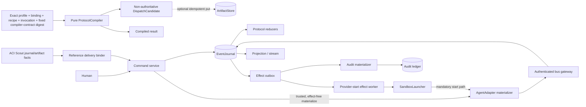
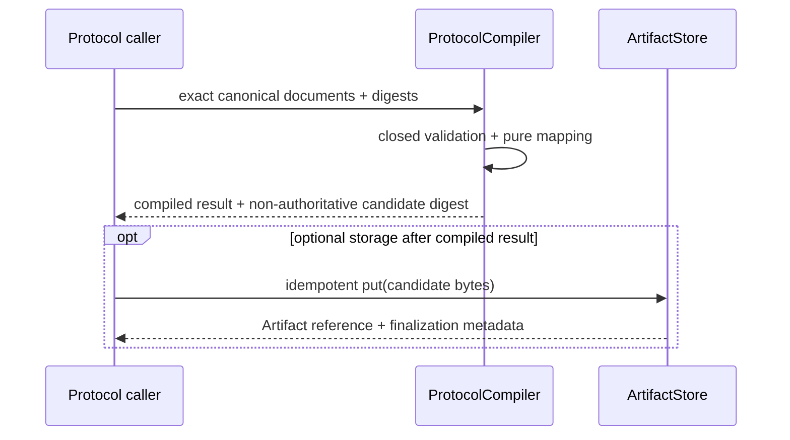
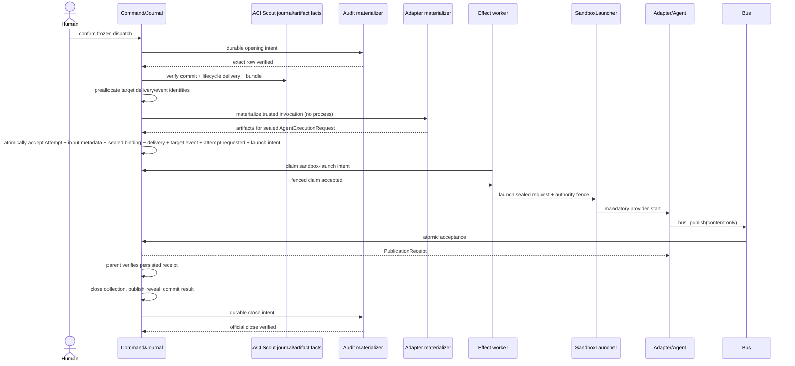

# Agents Communication Infra Architecture

This companion explains the architecture implied by [SPEC.md](SPEC.md); it does not claim a production runtime exists.

## Architecture Intent

Make protocol intent inspectable before authority exists, then make one separately human-confirmed
dispatch recoverable and auditable on one host. ACI Protocol Governance deterministically compiles
exact profile, binding, recipe and invocation documents plus the fixed compiler-contract digest into canonical,
non-authoritative `DispatchCandidate` bytes. The runtime remains a separate boundary: local
transitions commit as immutable journal facts, external work crosses durable effect boundaries,
agents publish through authenticated capabilities, exact Reference Scout input is source-bound to
its target Attempt, and official audit opening/close remain controlled by the existing appender.

## Scope Boundary

Owned by ACI Protocol Governance: the closed `SkillExecutionProfile`, immutable
`SkillProtocolBinding` snapshot, one frozen package with compiled and required-unsupported read-only
`ProtocolRecipe` cases, explicit
`SkillProtocolInvocation`, pure `CompileDispatchCandidate` calculation and canonical
non-authoritative `DispatchCandidate`. Optional candidate persistence is a separate idempotent put
through the existing Artifact boundary; it does not make the candidate authoritative.

Owned by the ACI runtime boundary: runtime commands, event reduction, attempts,
ScoutRun/recommendation bus-journal-receipt
facts, `reference_scout.bundle_committed@1`, `reference_scout.bundle_delivered@1`, target-agent
[AgentReferenceDelivery](domain.md#agentreferencedelivery), effective-input settlement, publication
receipts, sealed reveal, group commitment, effect reconciliation, projections and usage evidence.
APT consumes those facts and owns downstream research lineage/query and
`ResearchReferenceUse`; it does not redefine their runtime authority. The host alone owns
`host.SourceObservation`. External or separately owned: skill intent, effective capability
resolution, candidate-to-`DispatchSpec` mapping, human confirmation, provider execution, physical
artifact storage and official audit ledger. Persistent protocol registries, binding lifecycle,
transitive skill-closure discovery, arbitrary or mutating recipes, `DispatchSpec` production,
`ConfirmedDispatch`/`Run` creation, scheduling and effects are excluded from protocol compilation
v1. Multi-host coordination, multi-tenancy and billing truth remain excluded from the runtime.

## Source Contracts

| ID | Source | Required | Role |
|---|---|---:|---|
| SC-001 | [SPEC.md](SPEC.md) | yes | Capability, registry and gate source |
| SC-002 | [Discovery v0.2.1](../discovery/feature-discovery/agents-communication-infra.md) | yes | Locked authority ACI-D1–D15 and OQ-ACI1–10 |
| SC-003 | [Rules](rules.md) | yes | Cross-cutting invariants |
| SC-004 | [Persistence and replay](persistence-and-replay.md) | yes | Accepted bounded storage/recovery baseline; broader runtime and cutover remain gated |
| SC-005 | [Work pack W0](../work-pack/waves/W0.md) | yes | Accepted runtime baseline only; it is not implementation-entry evidence for protocol compilation v1 |
| SC-006 | [External Tool Adoptions v0.1.0](../discovery/external-tool-adoption/external-tool-adoptions.md) | yes | External dependency and provider-admission authority ETD-1–ETD-7 |
| SC-007 | [Stage G Reference Scout lifecycle](../../agent-provenance-telemetry/integration/stage-g/reference-scout-and-ingestion.md#reference-scout-lifecycle) | yes | Integration evidence is stored under APT, but the implemented Scout bus/journal/receipt lifecycle is ACI-owned and is consumed by the specified/not-implemented [ACI-R19](rules.md#aci-r19--reference-bundle-delivery-is-source-bound-and-attempt-atomic) amendment |

| SC-008 | [ACI-PG-001](../../../decisions/aci-protocol-governance-ownership.md) | yes | Ratified owner and authority boundary for skill-to-candidate compilation |
| SC-009 | [Protocol compilation candidate v1](protocol-compilation.md) | yes | Sole detailed authority for closed schemas, pure calculation, mapping, failures, persistence seam and verification obligations |
| SC-010 | [Agents Communication Protocols v0.5.0](../discovery/agents-communication-protocols/README.md) | yes | Promoted protocol intent and ownership rationale; non-normative where the aspect has settled details |
| SC-011 | [Agent Tools and Delegated Supervision v0.2.0](../discovery/agent-tools-and-delegated-supervision.md) | yes | Preserves capability-resolution and per-attempt tool-profile ownership outside protocol compilation |

## Design Goals and Non-Goals

| Type | Item | Why |
|---|---|---|
| Goal | Deterministic authority | Replay and provider choice cannot invent transitions. |
| Goal | Recoverable effects | Crash outcomes remain visible and reconcilable. |
| Goal | Sealed independent collection | Peer content is unavailable until persisted reveal authority exists. |
| Goal | Source-bound reference delivery | Exact committed Scout membership enters only one same-dispatch target Attempt and stays distinct from access/use evidence. |
| Goal | Pure protocol compilation | Equal exact inputs produce byte-identical candidate/result bytes without authority, effects or environmental dependencies. |
| Goal | Explicit pre-authority lineage | Every candidate binds the exact skill/profile/binding/recipe/invocation/compiler identities that produced it. |
| Non-goal | Deterministic model output | Only inputs, observations and accepted facts are reproducible. |
| Non-goal | Distributed availability | Initial proof is single-host and single-tenant. |
| Non-goal | Candidate execution authority | A recipe or candidate cannot grant capability, satisfy `dispatch_spec_digest`, confirm, create a `Run` or launch work. |
| Non-goal | General protocol registry | V1 admits one frozen built-in package with exactly two read-only cases and consumes snapshots; activation, revocation, arbitrary recipes and compatibility resolution remain deferred. |

## View 1: Context View

| Actor/System | Relationship | Contract |
|---|---|---|
| Skill author/domain owner | Owns skill intent, obligations, outputs, sources and quality criteria; supplies an exact revision for governed profiling | [ACI-PG-001](../../../decisions/aci-protocol-governance-ownership.md) |
| Protocol-governance caller | Supplies exact canonical documents/digests and invokes the pure compiler | [CompileDispatchCandidate](protocol-compilation.md#compiledispatchcandidate) |
| Future confirmation boundary | May later consume candidate evidence, but must independently resolve capabilities and produce canonical `DispatchSpec` bytes/digest | [Ownership boundary](protocol-compilation.md#ownership-and-authority-boundary) |
| Human operator | Confirms/cancels and repairs reconciliation | [Runtime Command API](interfaces.md#external-runtime-command-api-http-or-equivalent-command-transport) |
| Agent/provider | Executes one request and publishes agent-authored content | [AgentAdapter](interfaces.md#internal-agentadapter), [Agent Tool Gateway](interfaces.md#external-agent-tool-gateway-mcp-or-equivalent) |
| ACI Reference Scout runtime | Owns ScoutRun, recommendations and accepted bus/journal/receipt commit/lifecycle-delivery facts | [Stage G source contract](../../agent-provenance-telemetry/integration/stage-g/reference-scout-and-ingestion.md#reference-scout-lifecycle) |
| Host source-observation boundary | Owns `host.SourceObservation`; ACI does not mint or infer access evidence | [APT external ownership contract](../../agent-provenance-telemetry/specs/architecture.md#scope-boundary) |
| APT lineage consumer | Owns `ResearchReferenceUse` and later lineage/query projections; consumes ACI delivery as inclusion evidence only | [ResearchReferenceUse](../../agent-provenance-telemetry/specs/domain.md#researchreferenceuse) |
| Audit ledger/appender | Owns official opening and closing rows | [Audit Ledger Appender Port](interfaces.md#internal-audit-ledger-appender-port) |
| Projection clients | Consume snapshots and cursor deltas without authority | [Queries](queries.md) |
| ArtifactStore | Optionally stores already compiled candidate bytes and returns boundary-owned metadata | [Artifact persistence seam](protocol-compilation.md#artifact-persistence-seam) |

## View 2: High-Level Structure View

| Component | Responsibility | Primary contract |
|---|---|---|
| Protocol compiler | Strictly validate exact canonical inputs, verify digests and graph/obligation closure, substitute declared scalar values and return deterministic candidate/result bytes | [ProtocolCompiler](protocol-compilation.md#protocolcompiler) |
| Protocol input mapping | Trace every candidate field to a validated input or allowed scalar substitution | [ProtocolInputsToDispatchCandidate](protocol-compilation.md#protocolinputstodispatchcandidate) |
| Candidate storage wrapper | Optionally persist successful bytes through ArtifactStore without command, event, confirmation or runtime effect | [Artifact persistence seam](protocol-compilation.md#artifact-persistence-seam) |
| Command service/kernel | Validate command, expected version and derive facts/intents | [Operations](operations.md), [States](states.md) |
| Journal writer | Atomically commit receipts, events, heads and new intents | [EventJournal](interfaces.md#internal-eventjournal) |
| Effect worker | Claim and reconcile provider/tool/cross-store work | [ExternalEffectReconciliationWorkflow](workflows.md#externaleffectreconciliationworkflow) |
| Bus gateway | Bind runtime authority and append before acknowledging | [DeliberationBus](interfaces.md#internal-deliberationbus) |
| Projection reducer | Rebuild authorized cursor-addressable reads | [GetRuntimeProjection](queries.md#getruntimeprojection) |
| Reference delivery binder | Verify accepted source facts, same-dispatch target and exact bundle entry before atomic attempt acceptance | [ReferenceScoutBundleToEffectiveInput](mappings.md#referencescoutbundletoeffectiveinput), [ACI-R19](rules.md#aci-r19--reference-bundle-delivery-is-source-bound-and-attempt-atomic) |

## View 3: Low-Level Components View

| Component | Owns | Consumes | Collaboration rule |
|---|---|---|---|
| Closed protocol validators | Schema acceptance and safety-bound checks for profile, binding, recipe, invocation, request, candidate and result | Exact canonical document bytes and supplied qualified digests | Reject unknown/duplicate/missing fields, noncanonical bytes, coercion and out-of-order semantic sets before compilation. |
| Protocol compiler calculation | `CompiledDispatchCandidate` bytes/digest or one closed failure | Validated documents plus exact compiler identity | Pure: no clock, random, filesystem discovery, registry, network, provider, bus, journal, confirmation or effects. |
| Candidate artifact wrapper | Optional ArtifactStore reference for compiled candidate bytes | Successful compiled result only | Put is idempotent and separate; boundary finalization metadata stays outside candidate/result bytes. |
| Command dedupe/CAS | `RuntimeCommand`, stable receipt, aggregate head | Authenticated command | Same key/digest replays; changed digest conflicts. |
| Run/group/attempt reducers | Three lifecycle states and state hashes | Ordered accepted events | Pure fold; no clocks, providers, tools or appender calls. |
| Artifact boundary | Finalized immutable metadata and sensitive classification | Input/output or already compiled candidate bytes | Runtime journal references only finalized digests; optional candidate storage creates proposal evidence only. |
| Publication acceptance | Contribution and publication receipt | `BusPublication` plus authenticated capability | Agent-supplied authority fields are rejected. |
| Reveal builder | Canonical message/hash set | Closed collection | Close freezes membership; publication grants visibility. |
| Audit materializer | Exact-row reconciliation result | Durable opening/close intent | Only validated appender physically writes ledger. |
| Canonical contract boundary | Versioned projection, canonical JSON bytes and SHA-256 identity | Validated Python values | The owning ACI boundary owns its projection: Protocol Governance for candidate/result and runtime for runtime contracts; validation-library defaults never define accepted bytes. |
| Reference input settlement | `AgentReferenceDelivery`, target event and effective-input binding | ACI-owned commit/lifecycle facts, immutable bundle and authenticated target capability | Membership/order derives from commit + bytes; lifecycle delivery has no membership field; all target identities share the dispatch. |

## View 4: Workflow Process View

There is deliberately no arrow from `DispatchCandidate` to confirmation: candidate-to-`DispatchSpec`
mapping and capability resolution are deferred beyond v1. The existing runtime flow begins only
after confirmation has independently produced and a human has accepted canonical `DispatchSpec`
bytes and digest.

| Flow | Failure/compensation | Source |
|---|---|---|
| Protocol compile | Closed failure or required `unsupported` yields no partial candidate, artifact or mutation; equal requests return byte-identical results. | [CompileDispatchCandidate](protocol-compilation.md#compiledispatchcandidate) |
| Candidate storage | Unequal content at one identity fails `artifact_content_conflict`; storage emits no runtime fact or authority. | [Artifact persistence seam](protocol-compilation.md#artifact-persistence-seam) |
| Candidate to confirmation | No v1 flow exists; a future promoted mapping must produce canonical `DispatchSpec` bytes/digest and cannot accept `candidate_digest` as authority. | [Explicitly deferred contracts](protocol-compilation.md#explicitly-deferred-contracts) |
| Confirm/open | Divergent same-identity ledger row enters `reconciliation_required`; no effects release. | [AuditLedgerMaterializer](workflows.md#auditledgermaterializer) |
| Attempt/publication | Unknown external effect is reconciled; forged/missing receipt cannot satisfy logical work. | [ReceiptGatedPublicationWorkflow](workflows.md#receiptgatedpublicationworkflow) |
| Reference delivery/attempt | Missing, reordered or cross-dispatch source evidence rejects the complete attempt acceptance; no partial delivery/input/event remains. | [DeliverReferenceScoutBundleToAgent](operations.md#internal-transition--deliverreferencescoutbundletoagent) |
| Reveal/commit | Crash after close retains sealed ACL; replay publishes at most one manifest/result. | [GroupDeliberationWorkflow](workflows.md#groupdeliberationworkflow) |
| Terminal/close | First valid run terminal CAS wins; close is official only after exact-row verification. | [RunLifecycle](states.md#runlifecycle) |

## View 5: Decision Flow View

| Decision | Branches | Rule | Outcome |
|---|---|---|---|
| Protocol compile request | compiled / unsupported / typed failure | Exact canonical inputs, digest/cross-reference equality, frozen allowlist, total obligation disposition and closed DAG | Canonical candidate/result, sorted unsupported IDs, or no output/mutation; optional persistence remains separate. |
| Obligation disposition | preserved/compiled/superseded/unsupported | Total mapping; required unsupported blocks; built-in v1 forbids superseded | Complete candidate, closed unsupported result or typed failure. |
| Candidate persistence | skip/put/conflict | Only a successful compiled result may be put; content and policy must agree | No storage, stable content-derived Artifact reference, or closed conflict. |
| Authority transition | candidate evidence / canonical confirmed authority | No transition is specified in v1; only future confirmation may resolve and accept exact `DispatchSpec` digest | Candidate remains non-authoritative. |
| Execution authority | legacy/runtime | Frozen before confirmation | Exactly one owner; legacy mode creates no Run. |
| Command retry | replay/conflict/new | Key, digest and expected version | Stable receipt, permanent conflict or atomic acceptance. |
| Reveal access | sealed/revealed | Persisted manifest plus `reveal.published` | Fail closed or deliver exact listed hashes. |
| Two-seat verdict | consensus/dissent/no quorum | Two schema-valid votes | Commit consensus/dissent; no quorum remains non-verdict. |
| Terminal mapping | five audit reasons | Closed cause/precedence matrix | One immutable run exit reason. |
| Audit reconcile | absent/identical/divergent | Exact canonical row comparison | Append+verify, acknowledge, or block. |
| Reference bundle admission | exact source chain / missing or drifted / cross-dispatch | Commit membership + immutable bytes + lifecycle delivery + authenticated target | Atomic target delivery or fail closed; inclusion does not imply access/use. |

## View 6: Dependency Interface View

| Dependency/interface | Direction | Contract | Boundary rule |
|---|---|---|---|
| ProtocolCompiler | internal | [ProtocolCompiler](protocol-compilation.md#protocolcompiler) | Exact request bytes return canonical result bytes or typed failure; exposes no confirm, resolve, run, launch, schedule, activate or revoke method. |
| Protocol fixture package | inbound/static | [Frozen V1 fixture](protocol-compilation.md#frozen-v1-fixture-and-admission) | Exactly one digest-pinned built-in package is admitted, with one compiled and one required-unsupported read-only case; any third schema-valid tuple is rejected. |
| Candidate ArtifactStore seam | outbound/optional | [Artifact persistence seam](protocol-compilation.md#artifact-persistence-seam) | Stores already compiled bytes only; finalization receipt is storage metadata, not a command/publication/dispatch receipt. |
| ACI confirmation boundary | downstream/deferred | [ACI-PG-001](../../../decisions/aci-protocol-governance-ownership.md) | Owns capability resolution and final `DispatchSpec`; candidate digest cannot cross as executable authority. |
| Runtime Command API | inbound | [interfaces.md](interfaces.md#external-runtime-command-api-http-or-equivalent-command-transport) | Authenticated principals; request body grants no authority. |
| Agent Tool Gateway | inbound | [bus_publish](interfaces.md#bus_publish) | Publish-only during collection; no peer-read tool. |
| AgentAdapter | outbound | [AgentAdapter](interfaces.md#internal-agentadapter) | Same canonical schemas, protocol semantics and observation contract across providers; native invocation bytes may differ. |
| EventJournal | internal | [EventJournal](interfaces.md#internal-eventjournal) | One physical writer boundary and atomic acceptance. |
| Audit appender | outbound | [Audit Ledger Appender Port](interfaces.md#internal-audit-ledger-appender-port) | Materializer cannot write YAML directly. |
| Artifact boundary | internal/outbound | [Artifact Boundary](interfaces.md#internal-artifact-boundary) | Finalize/hash/classify before authoritative reference; optional candidate put creates no command, event, receipt or runtime entity. |
| External libraries | boundary-local/reference | [ExternalToolAdoptionPolicy](rules.md#aci-r15--external-tool-adoption-policy) | Octopus/Eve own no kernel fact; Pydantic validates but does not seal. |
| Real provider subprocess | outbound | [Provider admission](interfaces.md#provider-implementation-and-admission-boundary) | Runs only through `SandboxLauncher` after host-specific admission evidence. |
| ACI Reference Scout facts | internal | [Stage G lifecycle](../../agent-provenance-telemetry/integration/stage-g/reference-scout-and-ingestion.md#reference-scout-lifecycle) | ACI owns ScoutRun/recommendation bus-journal-receipt facts and source events; the target binder verifies and binds them without transferring ownership to APT. |
| Host source observations | downstream/foreign | [APT ownership boundary](../../agent-provenance-telemetry/specs/architecture.md#scope-boundary) | Host hooks alone own `host.SourceObservation`; ACI delivery cannot synthesize access. |
| APT reference lineage | outbound consumer | [ResearchReferenceUse](../../agent-provenance-telemetry/specs/domain.md#researchreferenceuse) | APT owns declared-use/lineage projections and must preserve delivery, access, use and claim support as separate evidence axes. |

## Dependency And Interface Rules

1. Kernel code depends on provider-neutral domain contracts, never provider SDK/native response types.
2. Adapters and launchers return observations; only the command/journal boundary accepts runtime facts.
3. The bus derives identity and authority from authenticated capability context, never agent payloads.
4. The audit materializer calls only `AuditLedgerAppenderPort`; no runtime component receives a raw
   audit-ledger write path.
5. Projection, rollup and stream consumers may lag or rebuild and therefore cannot authorize effects.
6. Artifact references enter accepted events only after bytes, digest, classification and size are finalized.
7. Python/FastAPI is the runtime host; Pydantic core is a validator. Protocol Governance owns candidate/result canonicalization and digest, while the runtime owns its runtime-contract canonicalization and digest.
8. Node validators are derived boundary views only; no second normative schema or runtime authority is permitted.
9. `reference_scout.bundle_delivered@1` remains source-lifecycle evidence; only the distinct
   `reference_scout.bundle_delivered_to_agent@1` can identify target-attempt delivery, and neither
   fact alone proves source access, declared use or claim support.
10. Protocol compilation depends only on caller-supplied canonical bytes/digests and the frozen
    compiler contract; it cannot discover repository state, consult a mutable registry or repair
    invalid input.
11. Candidate persistence is downstream of successful pure compilation and cannot append journal
    facts, mutate pending sheets/YAML, resolve capabilities or create confirmation/runtime objects.
12. No runtime or confirmation component may treat a `ProtocolRecipe`, candidate artifact or
    `candidate_digest` as `DispatchSpec`, confirmation evidence sufficient by itself, or execution
    authority.
13. Protocol compilation cannot resolve capabilities, confirm, run, schedule, launch or append
    runtime facts/effects.

## Constraints and Guardrails

| Constraint | Impact |
|---|---|
| SQLite WAL + `synchronous=FULL` | Durability claim applies to every proof/pilot transaction. |
| One controlled writer per authoritative store | Logical publishers and workers never obtain raw writer authority. |
| Append-before-ack | No receipt exists before its matching accepted event commits. |
| Sensitive immutable artifacts | Secrets prohibited; access audited; retention/key parameters block Slice 1. |
| Provider-neutral kernel | Provider/model metadata cannot select transitions, schemas or verdict rules. |
| Source-bound reference input | Commit membership/order, immutable bytes, source lifecycle fact and target capability must agree; delivery is all-or-none with attempt acceptance. |
| Frozen protocol compiler v1 | Exactly one built-in package with one compiled and one required-unsupported read-only case is admitted; documents are recursively closed, canonical and digest-verified; no default, coercion or inference is allowed; obligation mapping is total and each bounded DAG is closed. |
| Closed deterministic protocol inputs | All schemas, ordering, safety bounds, canonical bytes, digests and cross-references must validate; no coercion, defaults or inference. |
| Zero-authority compiler | Compilation creates no grant, command, event, receipt, confirmation, run, provider call, scheduler action or external effect. |
| One admitted read-only recipe | V1 generalization is blocked until registry/admission lifecycle and separate fixtures are promoted. |

## Data and Evidence Artifacts

| Artifact | Producer | Use |
|---|---|---|
| Skill/profile/binding/recipe/invocation/compiler digests | Skill owner and ACI Protocol Governance inputs | Exact candidate lineage and invalidation; no runtime authority |
| DispatchCandidate bytes/digest | Pure ProtocolCompiler | Inspectable non-authoritative proposal and future mapping input |
| CompiledDispatchCandidate result | Pure ProtocolCompiler | Closed compiled/unsupported outcome and deterministic verification |
| Candidate Artifact reference/finalization metadata | ArtifactStore via separate wrapper | Optional storage locator for candidate bytes; not a dispatch receipt or authority |
| Confirmed dispatch/spec digest | Confirmation | Immutable authorization |
| Effective input | Adapter materializer + artifact boundary | Exact observable input evidence |
| Raw provider output | Adapter + artifact boundary | Provider-native evidence, never automatic contribution |
| Contribution/receipt | Journal acceptance | Logical result and parent acceptance proof |
| Reveal manifest | Kernel | Exact peer-visibility authority |
| Usage observation | Adapter observation command | Nullable provenance-preserving rollups |
| AgentReferenceDelivery + target-delivery event | StartAgentAttempt acceptance | Exact inclusion evidence for one Scout bundle in one target Attempt; specified, not implemented |

## Extension Points

| Point | Allowed variation | Guardrail |
|---|---|---|
| Invocation scalar values | Explicit declared string/integer/boolean values within the profile schema | No defaults, coercion, objects/arrays/floats or undeclared placeholders |
| Candidate persistence | Omit storage or use existing ArtifactStore boundary | Identical content/policy is idempotent; no runtime fact or authority is created |
| Provider adapters | Provider/model invocation and namespaced metadata | Common request, events, result, cancel and status contract |
| Group policies | Later quorum/round profiles | Versioned confirmed policy; no silent semantic fallback |
| Artifact storage | Local implementation may vary | Stable content digest, classification and tombstone provenance |

## Trade-offs and Guardrails

| Choice | Benefit | Cost / guardrail |
|---|---|---|
| Pure compiler before confirmation | Makes protocol semantics and lineage inspectable without granting authority | Requires a later separately specified candidate-to-confirmation mapping; callers cannot execute candidates. |
| One frozen read-only fixture | Proves deterministic mechanics with a narrow admission surface | No arbitrary skill/recipe support; every new fixture or lifecycle capability requires promotion. |
| Separate candidate storage seam | Reuses content-addressed evidence without contaminating compilation | Storage metadata must stay outside candidate/result and cannot be mistaken for confirmation. |
| Single-host SQLite/WAL bounded pilot | Small deterministic authority surface with accepted local evidence | No distributed-worker or production claim; broader cutover still requires host-scoped enforcement evidence. |
| Journal plus separate audit ledger | Preserves established official record | Cross-store atomicity is impossible; exact-row reconciliation gates start/close. |
| Immutable input/output artifacts | Strong audit and reproduction evidence | Retention, encryption and key policy must be accepted before real-provider promotion. |
| Provider-neutral kernel | Mixed-model portability | Capability mismatch fails closed; no provider-name conditionals in protocol code. |
| Local subprocess first provider | Fits CLI providers and preserves the existing Python host | Sandbox, credential, process-tree and recovery evidence must pass before registration. |
| Reference-only Octopus/Eve | Avoids duplicate lifecycle, replay and writer authority | Useful shapes must be re-expressed through local ports/tests, not runtime imports. |
| Separate Scout lifecycle and target delivery facts | Prevents false target/access attribution | Adds an explicit atomic binding and downstream correlation step; tests forbid collapsing evidence axes. |
| Frozen one-fixture protocol compiler | Proves fidelity, determinism and the authority ceiling on a small surface | No registry, general recipe admission or confirmation/runtime integration; each needs separate promotion. |

## Downstream Planning Notes

- Implement protocol compilation only against the exact closed v1 fixture and T-ACI-PC1 through
  T-ACI-PC12; keep the calculation pure and the optional Artifact put in a separate application
  method.
- Do not wire `DispatchCandidate` into confirmation, `dispatch_workflow.py`, scheduling, provider
  launch, pending-sheet/YAML mutation or registry lifecycle in the bounded compiler task.
- A later candidate-to-confirmation amendment must specify the total mapping, capability resolution
  and human acceptance of complete canonical `DispatchSpec` bytes/digest before any integration.
- Preserve the implemented bounded journal, transaction, canonicalization, replay and projection
  baseline and its Stage B regression evidence.
- Installed-version and host-enforcement evidence still gates broader dependency/runtime promotion;
  the declared Pydantic pins alone do not prove the exact resolved/executed versions.
- TASK-020 produces the complete target-host physical sole-writer proof before audit materializer
  cutover. That proof does not block TASK-010 journal work.
- General provider integration remains fake-first and must preserve the already accepted bounded
  replay/crash contracts before any real provider is admitted.
- S-003/L2/W3 must provide sandbox, credential, retention and escape-negative evidence before the
  first real provider; L3 adds a second provider through the same conformance suite and contracts.
- Work-pack coverage is manually synchronized until the absent validator is restored.
- Two independent bounded lanes remain: implement `AgentReferenceDelivery` plus T-ACI-R22 before
  claiming target correlation is operational; and implement only pure protocol compilation plus
  optional candidate artifact storage after exact work-pack readiness, with T-ACI-PC1 through T-ACI-PC12.

## Decision Log

ACI-D1–D15 and OQ-ACI1–10 are adopted without renumbering from
[discovery v0.2.1](../discovery/feature-discovery/agents-communication-infra.md). The bounded
[ACI-R19](rules.md#aci-r19--reference-bundle-delivery-is-source-bound-and-attempt-atomic)
amendment formalizes OQ-ACI8 against the accepted Stage G source lifecycle while preserving
separate source, target-delivery, access, declared-use and claim-support evidence; it is not a new
discovery decision. ETD-1–ETD-7 and
the recorded OQ-ETA dispositions are adopted from
[External Tool Adoptions v0.1.0](../discovery/external-tool-adoption/external-tool-adoptions.md). Later changes require
versioned amendments.

[ACI-PG-001](../../../decisions/aci-protocol-governance-ownership.md), recorded as ACPD-4 and
ATD-9, assigns profile/binding/recipe-DAG lifecycle and deterministic compilation through the
non-authoritative candidate to ACI Protocol Governance. The reviewed bounded v1 implementation
contract is narrower than that complete ownership: consume immutable
snapshots, admit one frozen built-in package with exactly two read-only cases, compile purely, and optionally persist candidate
bytes. Registry lifecycle, capability resolution, `DispatchSpec`, confirmation and runtime
execution remain with their existing owners or deferred.

## Risks

| ID | Risk | Mitigation |
|---|---|---|
| RK-001 | Historical ledger writers bypass intended boundary | EG-1 sole-writer guard and drift disposition before cutover |
| RK-002 | Unknown provider/tool outcome is repeated | Stable identity, retry class, status reconciliation and `unknown` terminal |
| RK-003 | Sensitive prompt/output retention becomes de facto policy | Blocking retention/credential ADRs and audited access |
| RK-004 | Provider-specific behavior leaks into kernel | Fake-first and mixed-provider conformance fixtures |
| RK-005 | Validation library defaults silently change canonical digests | Dependency pin, explicit canonical projection and golden cross-boundary vectors |
| RK-006 | Lint is mistaken for physical sole-writer enforcement | Require the complete host-scoped `SoleWriterEvidenceBundle` before cutover |
| RK-007 | Lifecycle delivery is mistaken for target delivery or target delivery for source use | Distinct event types, exact source/target binding and negative T-ACI-R22 evidence |
| RK-008 | `DispatchCandidate` or its Artifact reference is mistaken for confirmed execution authority | Distinct closed schemas/digests, no direct confirmation mapping, and T-ACI-PC12 boundary negatives |
| RK-009 | Protocol compiler silently becomes a mutable registry, environment-sensitive resolver or runtime orchestrator | Pure interface, frozen fixture allowlist, dependency spies and T-ACI-PC8/T-ACI-PC9 |
| RK-010 | Optional persistence contaminates candidate bytes or emits runtime receipts/facts | Separate application wrapper; Artifact finalization metadata stays outside result; T-ACI-PC10 |
| RK-011 | Discovery proposals and SPEC schemas become competing authorities | `protocol-compilation.md` is the sole detailed bounded-v1 authority; discoveries retain rationale and deferred proposals only. |
| RK-012 | Logical capability requirements are mistaken for effective grants | Byte-equality ceiling, separate confirmation owner and negative T-ACI-PC7 coverage |

## Design Transport Notes

Implementation planning must preserve the protocol-versus-confirmation authority split, pure
compiler boundary, exact candidate lineage, separate Artifact put, store authority split, command transaction, event
envelopes, lifecycle guards, adapter conformance, source/target reference evidence axes and
observability identifiers. [Protocol compilation](protocol-compilation.md), the
[feature-wide TEST-SPEC](../TEST-SPEC.md), and the [protocol-compilation test detail](TEST-SPEC.md)
are the executable-contract handoff; no
implementation task may weaken a cited invariant to make a test pass.
For protocol compilation, transport includes the frozen fixture, literal canonical digests, the
zero-effect boundary and explicit absence of candidate-to-runtime wiring; T-ACI-PC1 through
T-ACI-PC12 are mandatory before an implementation claim.

## Gate Result

- Status: **block for new implementation; existing bounded runtime evidence retained**
- Contract status: **mixed** — the bounded runtime exact-profile/journal/projection pilot and the
  frozen two-case protocol-compilation candidate v1 are implemented and verified; ACI-R19
  target-agent reference delivery remains separately specified and not implemented.
- Protocol-compilation v1: **implemented-verified-bounded**. Ownership, readiness, exact golden
  outputs, Stage-E integrity closure, 131 runtime tests and two independent re-reviews pass.
- Reason: the broader block includes arbitrary recipes, persistent protocol registry/lifecycle,
  candidate-to-`DispatchSpec` mapping, capability resolution, confirmation, scheduling, providers,
  `Run` creation, general runtime, production serving and runtime-managed YAML
  materialization, provider launch and cutover. Those still require TASK-020 target-host EG-1 proof
  and S-003/L2/W3 retention, credential and sandbox evidence; it does not reopen completed bounded
  W0/TASK-010 work.
- Required follow-up: obtain exact work-pack readiness, then implement the bounded
  protocol compiler against T-ACI-PC1 through T-ACI-PC12. Independently implement and verify
  `AgentReferenceDelivery` with T-ACI-R22 while retaining TASK-020 cutover and S-003
  provider-admission gates.
