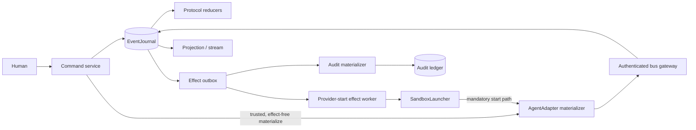
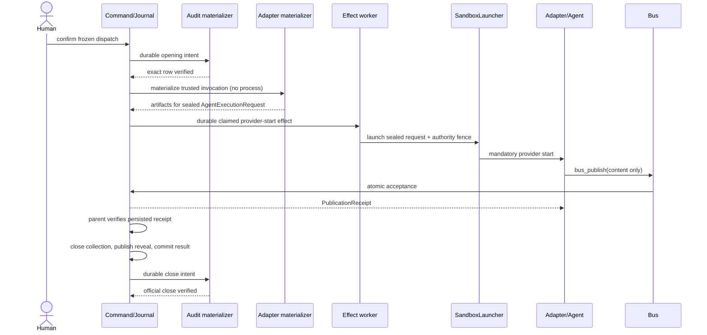

# Agents Communication Infra Architecture

This companion explains the architecture implied by [SPEC.md](SPEC.md); it does not claim a production runtime exists.

## Architecture Intent

Make one human-confirmed dispatch recoverable and auditable on one host: local transitions commit as immutable journal facts, external work crosses durable effect boundaries, agents publish through authenticated capabilities, and official audit opening/close remain controlled by the existing appender.

## Scope Boundary

Owned: runtime commands, event reduction, attempts, publication receipts, sealed reveal, group commitment, effect reconciliation, projections and usage evidence. External: human confirmation UI, provider execution, physical artifact storage and official audit ledger. Multi-host coordination, multi-tenancy, arbitrary recipes and billing truth are excluded.

## Source Contracts

| ID | Source | Required | Role |
|---|---|---:|---|
| SC-001 | [SPEC.md](SPEC.md) | yes | Capability, registry and gate source |
| SC-002 | [Discovery v0.2.1](discovery/feature-discovery/agents-communication-infra.md) | yes | Locked authority ACI-D1–D15 and OQ-ACI1–10 |
| SC-003 | [Rules](rules.md) | yes | Cross-cutting invariants |
| SC-004 | [Persistence and replay](persistence-and-replay.md) | yes | Candidate W0 storage/recovery contract |
| SC-005 | [Work pack W0](work-pack/waves/W0.md) | yes | Implementation-entry evidence |
| SC-006 | [External Tool Adoptions v0.1.0](discovery/external-tool-adoptions.md) | yes | External dependency and provider-admission authority ETD-1–ETD-7 |

## Design Goals and Non-Goals

| Type | Item | Why |
|---|---|---|
| Goal | Deterministic authority | Replay and provider choice cannot invent transitions. |
| Goal | Recoverable effects | Crash outcomes remain visible and reconcilable. |
| Goal | Sealed independent collection | Peer content is unavailable until persisted reveal authority exists. |
| Non-goal | Deterministic model output | Only inputs, observations and accepted facts are reproducible. |
| Non-goal | Distributed availability | Initial proof is single-host and single-tenant. |

## View 1: Context View

| Actor/System | Relationship | Contract |
|---|---|---|
| Human operator | Confirms/cancels and repairs reconciliation | [Runtime Command API](interfaces.md#external-runtime-command-api-http-or-equivalent-command-transport) |
| Agent/provider | Executes one request and publishes agent-authored content | [AgentAdapter](interfaces.md#internal-agentadapter), [Agent Tool Gateway](interfaces.md#external-agent-tool-gateway-mcp-or-equivalent) |
| Audit ledger/appender | Owns official opening and closing rows | [Audit Ledger Appender Port](interfaces.md#internal-audit-ledger-appender-port) |
| Projection clients | Consume snapshots and cursor deltas without authority | [Queries](queries.md) |

## View 2: High-Level Structure View

| Component | Responsibility | Primary contract |
|---|---|---|
| Command service/kernel | Validate command, expected version and derive facts/intents | [Operations](operations.md), [States](states.md) |
| Journal writer | Atomically commit receipts, events, heads and new intents | [EventJournal](interfaces.md#internal-eventjournal) |
| Effect worker | Claim and reconcile provider/tool/cross-store work | [ExternalEffectReconciliationWorkflow](workflows.md#externaleffectreconciliationworkflow) |
| Bus gateway | Bind runtime authority and append before acknowledging | [DeliberationBus](interfaces.md#internal-deliberationbus) |
| Projection reducer | Rebuild authorized cursor-addressable reads | [GetRuntimeProjection](queries.md#getruntimeprojection) |

## View 3: Low-Level Components View

| Component | Owns | Consumes | Collaboration rule |
|---|---|---|---|
| Command dedupe/CAS | `RuntimeCommand`, stable receipt, aggregate head | Authenticated command | Same key/digest replays; changed digest conflicts. |
| Run/group/attempt reducers | Three lifecycle states and state hashes | Ordered accepted events | Pure fold; no clocks, providers, tools or appender calls. |
| Artifact boundary | Finalized immutable metadata and sensitive classification | Input/output bytes | Journal references only finalized digests. |
| Publication acceptance | Contribution and publication receipt | `BusPublication` plus authenticated capability | Agent-supplied authority fields are rejected. |
| Reveal builder | Canonical message/hash set | Closed collection | Close freezes membership; publication grants visibility. |
| Audit materializer | Exact-row reconciliation result | Durable opening/close intent | Only validated appender physically writes ledger. |
| Canonical contract boundary | Versioned projection, canonical JSON bytes and SHA-256 identity | Pydantic-validated Python models | Runtime owns sealing; validation-library defaults do not define accepted bytes. |

## View 4: Workflow Process View

| Flow | Failure/compensation | Source |
|---|---|---|
| Confirm/open | Divergent same-identity ledger row enters `reconciliation_required`; no effects release. | [AuditLedgerMaterializer](workflows.md#auditledgermaterializer) |
| Attempt/publication | Unknown external effect is reconciled; forged/missing receipt cannot satisfy logical work. | [ReceiptGatedPublicationWorkflow](workflows.md#receiptgatedpublicationworkflow) |
| Reveal/commit | Crash after close retains sealed ACL; replay publishes at most one manifest/result. | [GroupDeliberationWorkflow](workflows.md#groupdeliberationworkflow) |
| Terminal/close | First valid run terminal CAS wins; close is official only after exact-row verification. | [RunLifecycle](states.md#runlifecycle) |

## View 5: Decision Flow View

| Decision | Branches | Rule | Outcome |
|---|---|---|---|
| Execution authority | legacy/runtime | Frozen before confirmation | Exactly one owner; legacy mode creates no Run. |
| Command retry | replay/conflict/new | Key, digest and expected version | Stable receipt, permanent conflict or atomic acceptance. |
| Reveal access | sealed/revealed | Persisted manifest plus `reveal.published` | Fail closed or deliver exact listed hashes. |
| Two-seat verdict | consensus/dissent/no quorum | Two schema-valid votes | Commit consensus/dissent; no quorum remains non-verdict. |
| Terminal mapping | five audit reasons | Closed cause/precedence matrix | One immutable run exit reason. |
| Audit reconcile | absent/identical/divergent | Exact canonical row comparison | Append+verify, acknowledge, or block. |

## View 6: Dependency Interface View

| Dependency/interface | Direction | Contract | Boundary rule |
|---|---|---|---|
| Runtime Command API | inbound | [interfaces.md](interfaces.md#external-runtime-command-api-http-or-equivalent-command-transport) | Authenticated principals; request body grants no authority. |
| Agent Tool Gateway | inbound | [bus_publish](interfaces.md#bus_publish) | Publish-only during collection; no peer-read tool. |
| AgentAdapter | outbound | [AgentAdapter](interfaces.md#internal-agentadapter) | Same canonical schemas, protocol semantics and observation contract across providers; native invocation bytes may differ. |
| EventJournal | internal | [EventJournal](interfaces.md#internal-eventjournal) | One physical writer boundary and atomic acceptance. |
| Audit appender | outbound | [Audit Ledger Appender Port](interfaces.md#internal-audit-ledger-appender-port) | Materializer cannot write YAML directly. |
| Artifact boundary | internal/outbound | [Artifact Boundary](interfaces.md#internal-artifact-boundary) | Finalize/hash/classify before authoritative reference. |
| External libraries | boundary-local/reference | [ExternalToolAdoptionPolicy](rules.md#aci-r15--external-tool-adoption-policy) | Octopus/Eve own no kernel fact; Pydantic validates but does not seal. |
| Real provider subprocess | outbound | [Provider admission](interfaces.md#provider-implementation-and-admission-boundary) | Runs only through `SandboxLauncher` after host-specific admission evidence. |

## Dependency And Interface Rules

1. Kernel code depends on provider-neutral domain contracts, never provider SDK/native response types.
2. Adapters and launchers return observations; only the command/journal boundary accepts runtime facts.
3. The bus derives identity and authority from authenticated capability context, never agent payloads.
4. The audit materializer calls only `AuditLedgerAppenderPort`; no runtime component receives a raw
   audit-ledger write path.
5. Projection, rollup and stream consumers may lag or rebuild and therefore cannot authorize effects.
6. Artifact references enter accepted events only after bytes, digest, classification and size are finalized.
7. Python/FastAPI is the runtime host; Pydantic core is a validator, while canonicalization and digest are runtime-owned.
8. Node validators are derived boundary views only; no second normative schema or runtime authority is permitted.

## Constraints and Guardrails

| Constraint | Impact |
|---|---|
| SQLite WAL + `synchronous=FULL` | Durability claim applies to every proof/pilot transaction. |
| One controlled writer per authoritative store | Logical publishers and workers never obtain raw writer authority. |
| Append-before-ack | No receipt exists before its matching accepted event commits. |
| Sensitive immutable artifacts | Secrets prohibited; access audited; retention/key parameters block Slice 1. |
| Provider-neutral kernel | Provider/model metadata cannot select transitions, schemas or verdict rules. |

## Data and Evidence Artifacts

| Artifact | Producer | Use |
|---|---|---|
| Confirmed dispatch/spec digest | Confirmation | Immutable authorization |
| Effective input | Adapter materializer + artifact boundary | Exact observable input evidence |
| Raw provider output | Adapter + artifact boundary | Provider-native evidence, never automatic contribution |
| Contribution/receipt | Journal acceptance | Logical result and parent acceptance proof |
| Reveal manifest | Kernel | Exact peer-visibility authority |
| Usage observation | Adapter observation command | Nullable provenance-preserving rollups |

## Extension Points

| Point | Allowed variation | Guardrail |
|---|---|---|
| Provider adapters | Provider/model invocation and namespaced metadata | Common request, events, result, cancel and status contract |
| Group policies | Later quorum/round profiles | Versioned confirmed policy; no silent semantic fallback |
| Artifact storage | Local implementation may vary | Stable content digest, classification and tombstone provenance |

## Trade-offs and Guardrails

| Choice | Benefit | Cost / guardrail |
|---|---|---|
| Single-host SQLite/WAL proof | Small deterministic authority surface | No distributed-worker claim; `synchronous=FULL` remains proposed pending W0 acceptance. |
| Journal plus separate audit ledger | Preserves established official record | Cross-store atomicity is impossible; exact-row reconciliation gates start/close. |
| Immutable input/output artifacts | Strong audit and reproduction evidence | Retention, encryption and key policy must be accepted before real-provider promotion. |
| Provider-neutral kernel | Mixed-model portability | Capability mismatch fails closed; no provider-name conditionals in protocol code. |
| Local subprocess first provider | Fits CLI providers and preserves the existing Python host | Sandbox, credential, process-tree and recovery evidence must pass before registration. |
| Reference-only Octopus/Eve | Avoids duplicate lifecycle, replay and writer authority | Useful shapes must be re-expressed through local ports/tests, not runtime imports. |

## Downstream Planning Notes

- W0 must accept or amend the proposed persistence, transaction, terminal, snapshot and repair contracts.
- W0 must pin Pydantic and canonical JSON/digest semantics with golden vectors; freeze the complete
  `SoleWriterEvidenceBundle` schema, drift disposition, guard specification and named tests.
- TASK-020 produces the complete target-host physical sole-writer proof before audit materializer
  cutover. That proof does not block TASK-010 journal work.
- L0 uses fake adapters and proves replay/crash boundaries before any real provider is integrated.
- S-003/L2/W3 must provide sandbox, credential, retention and escape-negative evidence before the
  first real provider; L3 adds a second provider through the same conformance suite and contracts.
- Work-pack coverage is manually synchronized until the absent validator is restored.

## Decision Log

ACI-D1–D15 and OQ-ACI1–10 are adopted without renumbering from [discovery v0.2.1](discovery/feature-discovery/agents-communication-infra.md). ETD-1–ETD-7 and the recorded OQ-ETA dispositions are adopted from [External Tool Adoptions v0.1.0](discovery/external-tool-adoptions.md). Later changes require versioned amendments.

## Risks

| ID | Risk | Mitigation |
|---|---|---|
| RK-001 | Historical ledger writers bypass intended boundary | EG-1 sole-writer guard and drift disposition before cutover |
| RK-002 | Unknown provider/tool outcome is repeated | Stable identity, retry class, status reconciliation and `unknown` terminal |
| RK-003 | Sensitive prompt/output retention becomes de facto policy | Blocking retention/credential ADRs and audited access |
| RK-004 | Provider-specific behavior leaks into kernel | Fake-first and mixed-provider conformance fixtures |
| RK-005 | Validation library defaults silently change canonical digests | Dependency pin, explicit canonical projection and golden cross-boundary vectors |
| RK-006 | Lint is mistaken for physical sole-writer enforcement | Require the complete host-scoped `SoleWriterEvidenceBundle` before cutover |

## Design Transport Notes

Implementation planning must preserve the store authority split, command transaction, event envelopes, lifecycle guards, adapter conformance and observability identifiers. [TEST-SPEC.md](TEST-SPEC.md) is the executable-contract handoff; no implementation task may weaken a cited invariant to make a test pass.

## Gate Result

- Status: **block**
- Contract status: **specified/proposed, not W0-accepted**.
- Reason: TASK-010 journal work awaits W0 persistence/schema/canonicalization/crash contracts and
  the W0 portion of B-003. Audit materializer cutover additionally awaits TASK-020's complete
  target-host EG-1 proof; the first real provider separately awaits S-003/L2/W3 retention,
  credential and sandbox evidence.
- Required follow-up: complete W0 and re-evaluate the TASK-010 gate; retain independent TASK-020
  cutover and S-003 provider-admission gates.
