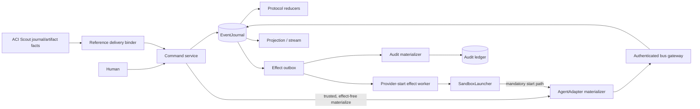
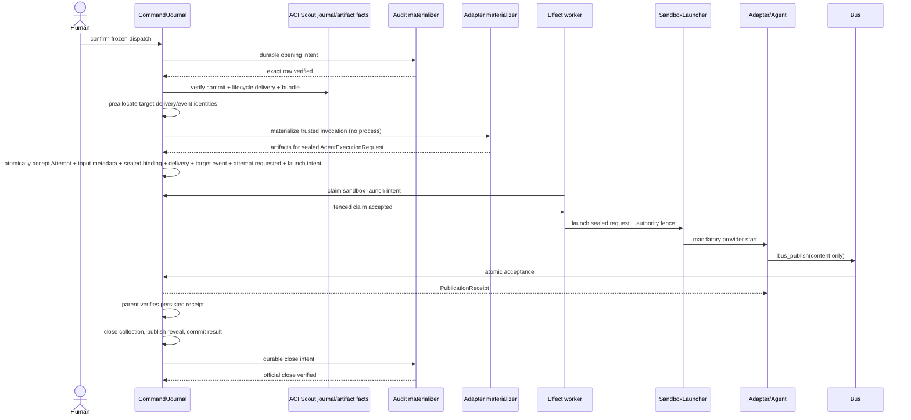

# Agents Communication Infra Architecture

This companion explains the architecture implied by [SPEC.md](SPEC.md); it does not claim a production runtime exists.

## Architecture Intent

Make one human-confirmed dispatch recoverable and auditable on one host: local transitions commit as
immutable journal facts, external work crosses durable effect boundaries, agents publish through
authenticated capabilities, exact Reference Scout input is source-bound to its target Attempt, and
official audit opening/close remain controlled by the existing appender.

## Scope Boundary

Owned: runtime commands, event reduction, attempts, ScoutRun/recommendation bus-journal-receipt
facts, `reference_scout.bundle_committed@1`, `reference_scout.bundle_delivered@1`, target-agent
[AgentReferenceDelivery](domain.md#agentreferencedelivery), effective-input settlement, publication
receipts, sealed reveal, group commitment, effect reconciliation, projections and usage evidence.
APT consumes those facts and owns downstream research lineage/query and
`ResearchReferenceUse`; it does not redefine their runtime authority. The host alone owns
`host.SourceObservation`. External: human confirmation UI, provider execution, physical artifact
storage and official audit ledger. Multi-host coordination, multi-tenancy, arbitrary recipes and
billing truth are excluded.

## Source Contracts

| ID | Source | Required | Role |
|---|---|---:|---|
| SC-001 | [SPEC.md](SPEC.md) | yes | Capability, registry and gate source |
| SC-002 | [Discovery v0.2.1](../discovery/feature-discovery/agents-communication-infra.md) | yes | Locked authority ACI-D1–D15 and OQ-ACI1–10 |
| SC-003 | [Rules](rules.md) | yes | Cross-cutting invariants |
| SC-004 | [Persistence and replay](persistence-and-replay.md) | yes | Accepted bounded storage/recovery baseline; broader runtime and cutover remain gated |
| SC-005 | [Work pack W0](../work-pack/waves/W0.md) | yes | Implementation-entry evidence |
| SC-006 | [External Tool Adoptions v0.1.0](../discovery/external-tool-adoption/external-tool-adoptions.md) | yes | External dependency and provider-admission authority ETD-1–ETD-7 |
| SC-007 | [Stage G Reference Scout lifecycle](../../agent-provenance-telemetry/integration/stage-g/reference-scout-and-ingestion.md#reference-scout-lifecycle) | yes | Integration evidence is stored under APT, but the implemented Scout bus/journal/receipt lifecycle is ACI-owned and is consumed by the specified/not-implemented [ACI-R19](rules.md#aci-r19--reference-bundle-delivery-is-source-bound-and-attempt-atomic) amendment |

## Design Goals and Non-Goals

| Type | Item | Why |
|---|---|---|
| Goal | Deterministic authority | Replay and provider choice cannot invent transitions. |
| Goal | Recoverable effects | Crash outcomes remain visible and reconcilable. |
| Goal | Sealed independent collection | Peer content is unavailable until persisted reveal authority exists. |
| Goal | Source-bound reference delivery | Exact committed Scout membership enters only one same-dispatch target Attempt and stays distinct from access/use evidence. |
| Non-goal | Deterministic model output | Only inputs, observations and accepted facts are reproducible. |
| Non-goal | Distributed availability | Initial proof is single-host and single-tenant. |

## View 1: Context View

| Actor/System | Relationship | Contract |
|---|---|---|
| Human operator | Confirms/cancels and repairs reconciliation | [Runtime Command API](interfaces.md#external-runtime-command-api-http-or-equivalent-command-transport) |
| Agent/provider | Executes one request and publishes agent-authored content | [AgentAdapter](interfaces.md#internal-agentadapter), [Agent Tool Gateway](interfaces.md#external-agent-tool-gateway-mcp-or-equivalent) |
| ACI Reference Scout runtime | Owns ScoutRun, recommendations and accepted bus/journal/receipt commit/lifecycle-delivery facts | [Stage G source contract](../../agent-provenance-telemetry/integration/stage-g/reference-scout-and-ingestion.md#reference-scout-lifecycle) |
| Host source-observation boundary | Owns `host.SourceObservation`; ACI does not mint or infer access evidence | [APT external ownership contract](../../agent-provenance-telemetry/specs/architecture.md#scope-boundary) |
| APT lineage consumer | Owns `ResearchReferenceUse` and later lineage/query projections; consumes ACI delivery as inclusion evidence only | [ResearchReferenceUse](../../agent-provenance-telemetry/specs/domain.md#researchreferenceuse) |
| Audit ledger/appender | Owns official opening and closing rows | [Audit Ledger Appender Port](interfaces.md#internal-audit-ledger-appender-port) |
| Projection clients | Consume snapshots and cursor deltas without authority | [Queries](queries.md) |

## View 2: High-Level Structure View

| Component | Responsibility | Primary contract |
|---|---|---|
| Command service/kernel | Validate command, expected version and derive facts/intents | [Operations](operations.md), [States](states.md) |
| Journal writer | Atomically commit receipts, events, heads and new intents | [EventJournal](interfaces.md#internal-eventjournal) |
| Effect worker | Claim and reconcile provider/tool/cross-store work | [ExternalEffectReconciliationWorkflow](workflows.md#externaleffectreconciliationworkflow) |
| Bus gateway | Bind runtime authority and append before acknowledging | [DeliberationBus](interfaces.md#internal-deliberationbus) |
| Projection reducer | Rebuild authorized cursor-addressable reads | [GetRuntimeProjection](queries.md#getruntimeprojection) |
| Reference delivery binder | Verify accepted source facts, same-dispatch target and exact bundle entry before atomic attempt acceptance | [ReferenceScoutBundleToEffectiveInput](mappings.md#referencescoutbundletoeffectiveinput), [ACI-R19](rules.md#aci-r19--reference-bundle-delivery-is-source-bound-and-attempt-atomic) |

## View 3: Low-Level Components View

| Component | Owns | Consumes | Collaboration rule |
|---|---|---|---|
| Command dedupe/CAS | `RuntimeCommand`, stable receipt, aggregate head | Authenticated command | Same key/digest replays; changed digest conflicts. |
| Run/group/attempt reducers | Three lifecycle states and state hashes | Ordered accepted events | Pure fold; no clocks, providers, tools or appender calls. |
| Artifact boundary | Finalized immutable metadata and sensitive classification | Input/output bytes | Journal references only finalized digests. |
| Publication acceptance | Contribution and publication receipt | `BusPublication` plus authenticated capability | Agent-supplied authority fields are rejected. |
| Reveal builder | Canonical message/hash set | Closed collection | Close freezes membership; publication grants visibility. |
| Audit materializer | Exact-row reconciliation result | Durable opening/close intent | Only validated appender physically writes ledger. |
| Canonical contract boundary | Versioned projection, canonical JSON bytes and SHA-256 identity | Pydantic-validated Python models | Runtime owns sealing; validation-library defaults do not define accepted bytes. |
| Reference input settlement | `AgentReferenceDelivery`, target event and effective-input binding | ACI-owned commit/lifecycle facts, immutable bundle and authenticated target capability | Membership/order derives from commit + bytes; lifecycle delivery has no membership field; all target identities share the dispatch. |

## View 4: Workflow Process View

| Flow | Failure/compensation | Source |
|---|---|---|
| Confirm/open | Divergent same-identity ledger row enters `reconciliation_required`; no effects release. | [AuditLedgerMaterializer](workflows.md#auditledgermaterializer) |
| Attempt/publication | Unknown external effect is reconciled; forged/missing receipt cannot satisfy logical work. | [ReceiptGatedPublicationWorkflow](workflows.md#receiptgatedpublicationworkflow) |
| Reference delivery/attempt | Missing, reordered or cross-dispatch source evidence rejects the complete attempt acceptance; no partial delivery/input/event remains. | [DeliverReferenceScoutBundleToAgent](operations.md#internal-transition--deliverreferencescoutbundletoagent) |
| Reveal/commit | Crash after close retains sealed ACL; replay publishes at most one manifest/result. | [GroupDeliberationWorkflow](workflows.md#groupdeliberationworkflow) |
| Terminal/close | First valid run terminal CAS wins; close is official only after exact-row verification. | [RunLifecycle](states.md#runlifecycle) |

## View 5: Decision Flow View

| Decision | Branches | Rule | Outcome |
|---|---|---|---|
| Execution authority | legacy/runtime | Frozen before confirmation | Exactly one owner; legacy mode creates no Run. |
| Command retry | replay/conflict/new | Key, digest and expected version | Stable receipt, permanent conflict or atomic acceptance. |
| Reveal access | sealed/revealed | Persisted manifest plus `reveal.published` | Fail closed or deliver exact listed hashes. |
| Two-seat verdict | consensus/dissent/no quorum | Two schema-valid votes | Commit consensus/dissent; no quorum remains non-verdict. |
| Terminal mapping | five audit reasons | Closed cause/precedence matrix | One immutable run exit reason. |
| Audit reconcile | absent/identical/divergent | Exact canonical row comparison | Append+verify, acknowledge, or block. |
| Reference bundle admission | exact source chain / missing or drifted / cross-dispatch | Commit membership + immutable bytes + lifecycle delivery + authenticated target | Atomic target delivery or fail closed; inclusion does not imply access/use. |

## View 6: Dependency Interface View

| Dependency/interface | Direction | Contract | Boundary rule |
|---|---|---|---|
| Runtime Command API | inbound | [interfaces.md](interfaces.md#external-runtime-command-api-http-or-equivalent-command-transport) | Authenticated principals; request body grants no authority. |
| Agent Tool Gateway | inbound | [bus_publish](interfaces.md#bus_publish) | Publish-only during collection; no peer-read tool. |
| AgentAdapter | outbound | [AgentAdapter](interfaces.md#internal-agentadapter) | Same canonical schemas, protocol semantics and observation contract across providers; native invocation bytes may differ. |
| EventJournal | internal | [EventJournal](interfaces.md#internal-eventjournal) | One physical writer boundary and atomic acceptance. |
| Audit appender | outbound | [Audit Ledger Appender Port](interfaces.md#internal-audit-ledger-appender-port) | Materializer cannot write YAML directly. |
| Artifact boundary | internal/outbound | [Artifact Boundary](interfaces.md#internal-artifact-boundary) | Finalize/hash/classify before authoritative reference. |
| External libraries | boundary-local/reference | [ExternalToolAdoptionPolicy](rules.md#aci-r15--external-tool-adoption-policy) | Octopus/Eve own no kernel fact; Pydantic validates but does not seal. |
| Real provider subprocess | outbound | [Provider admission](interfaces.md#provider-implementation-and-admission-boundary) | Runs only through `SandboxLauncher` after host-specific admission evidence. |
| ACI Reference Scout facts | internal | [Stage G lifecycle](../../agent-provenance-telemetry/integration/stage-g/reference-scout-and-ingestion.md#reference-scout-lifecycle) | ACI owns ScoutRun/recommendation bus-journal-receipt facts and source events; the target binder verifies and binds them without transferring ownership to APT. |
| Host source observations | downstream/foreign | [APT ownership boundary](../../agent-provenance-telemetry/specs/architecture.md#scope-boundary) | Host hooks alone own `host.SourceObservation`; ACI delivery cannot synthesize access. |
| APT reference lineage | outbound consumer | [ResearchReferenceUse](../../agent-provenance-telemetry/specs/domain.md#researchreferenceuse) | APT owns declared-use/lineage projections and must preserve delivery, access, use and claim support as separate evidence axes. |

## Dependency And Interface Rules

1. Kernel code depends on provider-neutral domain contracts, never provider SDK/native response types.
2. Adapters and launchers return observations; only the command/journal boundary accepts runtime facts.
3. The bus derives identity and authority from authenticated capability context, never agent payloads.
4. The audit materializer calls only `AuditLedgerAppenderPort`; no runtime component receives a raw
   audit-ledger write path.
5. Projection, rollup and stream consumers may lag or rebuild and therefore cannot authorize effects.
6. Artifact references enter accepted events only after bytes, digest, classification and size are finalized.
7. Python/FastAPI is the runtime host; Pydantic core is a validator, while canonicalization and digest are runtime-owned.
8. Node validators are derived boundary views only; no second normative schema or runtime authority is permitted.
9. `reference_scout.bundle_delivered@1` remains source-lifecycle evidence; only the distinct
   `reference_scout.bundle_delivered_to_agent@1` can identify target-attempt delivery, and neither
   fact alone proves source access, declared use or claim support.

## Constraints and Guardrails

| Constraint | Impact |
|---|---|
| SQLite WAL + `synchronous=FULL` | Durability claim applies to every proof/pilot transaction. |
| One controlled writer per authoritative store | Logical publishers and workers never obtain raw writer authority. |
| Append-before-ack | No receipt exists before its matching accepted event commits. |
| Sensitive immutable artifacts | Secrets prohibited; access audited; retention/key parameters block Slice 1. |
| Provider-neutral kernel | Provider/model metadata cannot select transitions, schemas or verdict rules. |
| Source-bound reference input | Commit membership/order, immutable bytes, source lifecycle fact and target capability must agree; delivery is all-or-none with attempt acceptance. |

## Data and Evidence Artifacts

| Artifact | Producer | Use |
|---|---|---|
| Confirmed dispatch/spec digest | Confirmation | Immutable authorization |
| Effective input | Adapter materializer + artifact boundary | Exact observable input evidence |
| Raw provider output | Adapter + artifact boundary | Provider-native evidence, never automatic contribution |
| Contribution/receipt | Journal acceptance | Logical result and parent acceptance proof |
| Reveal manifest | Kernel | Exact peer-visibility authority |
| Usage observation | Adapter observation command | Nullable provenance-preserving rollups |
| AgentReferenceDelivery + target-delivery event | StartAgentAttempt acceptance | Exact inclusion evidence for one Scout bundle in one target Attempt; specified, not implemented |

## Extension Points

| Point | Allowed variation | Guardrail |
|---|---|---|
| Provider adapters | Provider/model invocation and namespaced metadata | Common request, events, result, cancel and status contract |
| Group policies | Later quorum/round profiles | Versioned confirmed policy; no silent semantic fallback |
| Artifact storage | Local implementation may vary | Stable content digest, classification and tombstone provenance |

## Trade-offs and Guardrails

| Choice | Benefit | Cost / guardrail |
|---|---|---|
| Single-host SQLite/WAL bounded pilot | Small deterministic authority surface with accepted local evidence | No distributed-worker or production claim; broader cutover still requires host-scoped enforcement evidence. |
| Journal plus separate audit ledger | Preserves established official record | Cross-store atomicity is impossible; exact-row reconciliation gates start/close. |
| Immutable input/output artifacts | Strong audit and reproduction evidence | Retention, encryption and key policy must be accepted before real-provider promotion. |
| Provider-neutral kernel | Mixed-model portability | Capability mismatch fails closed; no provider-name conditionals in protocol code. |
| Local subprocess first provider | Fits CLI providers and preserves the existing Python host | Sandbox, credential, process-tree and recovery evidence must pass before registration. |
| Reference-only Octopus/Eve | Avoids duplicate lifecycle, replay and writer authority | Useful shapes must be re-expressed through local ports/tests, not runtime imports. |
| Separate Scout lifecycle and target delivery facts | Prevents false target/access attribution | Adds an explicit atomic binding and downstream correlation step; tests forbid collapsing evidence axes. |

## Downstream Planning Notes

- Preserve the implemented bounded journal, transaction, canonicalization, replay and projection
  baseline and its Stage B regression evidence.
- Installed-version and host-enforcement evidence still gates broader dependency/runtime promotion;
  the declared Pydantic pins alone do not prove the exact resolved/executed versions.
- TASK-020 produces the complete target-host physical sole-writer proof before audit materializer
  cutover. That proof does not block TASK-010 journal work.
- General provider integration remains fake-first and must preserve the already accepted bounded
  replay/crash contracts before any real provider is admitted.
- S-003/L2/W3 must provide sandbox, credential, retention and escape-negative evidence before the
  first real provider; L3 adds a second provider through the same conformance suite and contracts.
- Work-pack coverage is manually synchronized until the absent validator is restored.
- The next bounded slice must implement `AgentReferenceDelivery`, the distinct target-delivery event
  and T-ACI-R22 before any runtime or APT consumer may claim this correlation is operational.

## Decision Log

ACI-D1–D15 and OQ-ACI1–10 are adopted without renumbering from
[discovery v0.2.1](../discovery/feature-discovery/agents-communication-infra.md). The bounded
[ACI-R19](rules.md#aci-r19--reference-bundle-delivery-is-source-bound-and-attempt-atomic)
amendment formalizes OQ-ACI8 against the accepted Stage G source lifecycle while preserving
separate source, target-delivery, access, declared-use and claim-support evidence; it is not a new
discovery decision. ETD-1–ETD-7 and
the recorded OQ-ETA dispositions are adopted from
[External Tool Adoptions v0.1.0](../discovery/external-tool-adoption/external-tool-adoptions.md). Later changes require
versioned amendments.

## Risks

| ID | Risk | Mitigation |
|---|---|---|
| RK-001 | Historical ledger writers bypass intended boundary | EG-1 sole-writer guard and drift disposition before cutover |
| RK-002 | Unknown provider/tool outcome is repeated | Stable identity, retry class, status reconciliation and `unknown` terminal |
| RK-003 | Sensitive prompt/output retention becomes de facto policy | Blocking retention/credential ADRs and audited access |
| RK-004 | Provider-specific behavior leaks into kernel | Fake-first and mixed-provider conformance fixtures |
| RK-005 | Validation library defaults silently change canonical digests | Dependency pin, explicit canonical projection and golden cross-boundary vectors |
| RK-006 | Lint is mistaken for physical sole-writer enforcement | Require the complete host-scoped `SoleWriterEvidenceBundle` before cutover |
| RK-007 | Lifecycle delivery is mistaken for target delivery or target delivery for source use | Distinct event types, exact source/target binding and negative T-ACI-R22 evidence |

## Design Transport Notes

Implementation planning must preserve the store authority split, command transaction, event
envelopes, lifecycle guards, adapter conformance, source/target reference evidence axes and
observability identifiers. [TEST-SPEC.md](../TEST-SPEC.md) is the executable-contract handoff; no
implementation task may weaken a cited invariant to make a test pass.

## Gate Result

- Status: **block**
- Contract status: **mixed** — the bounded local journal/profile/projection pilot is implemented and
  verified; ACI-R19 target-agent reference delivery is specified for the next bounded slice and not
  implemented.
- Reason: the block applies to general runtime, production serving, runtime-managed YAML
  materialization, provider launch and cutover. Those still require TASK-020 target-host EG-1 proof
  and S-003/L2/W3 retention, credential and sandbox evidence; it does not reopen completed bounded
  W0/TASK-010 work.
- Required follow-up: implement and verify `AgentReferenceDelivery` with T-ACI-R22, while retaining
  independent TASK-020 cutover and S-003 provider-admission gates.
