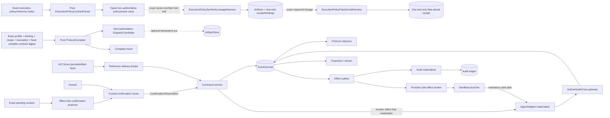
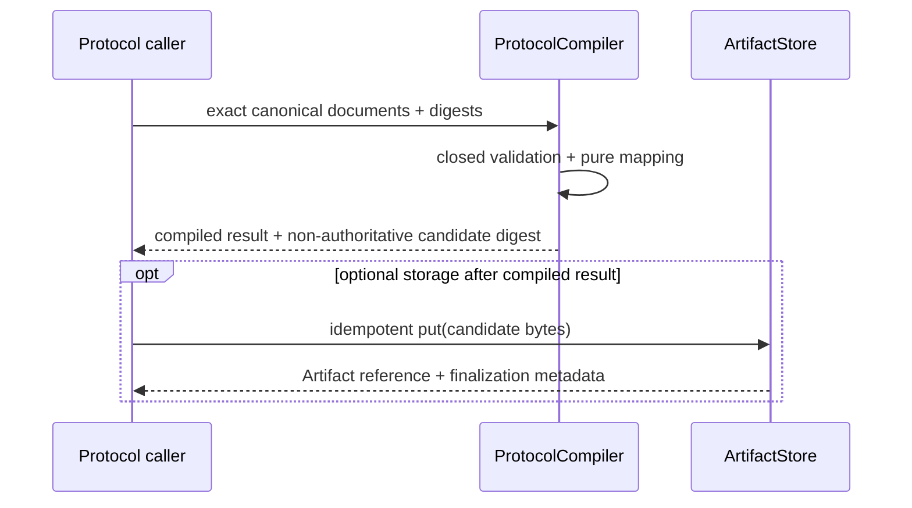
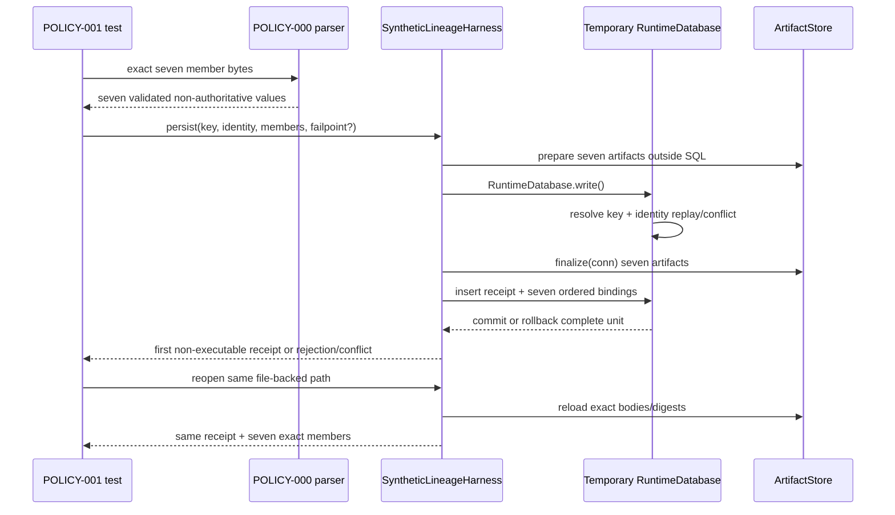
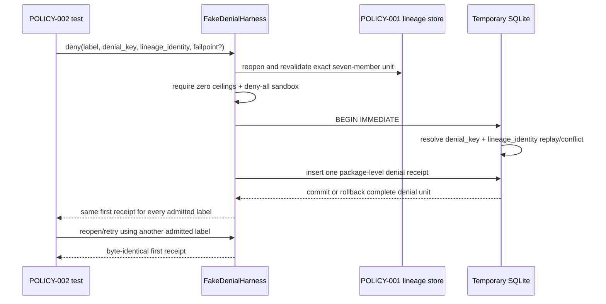

# Agents Communication Infra Architecture

This companion explains the architecture implied by [SPEC.md](SPEC.md); it does not claim a production runtime exists.

## Architecture Intent

Make protocol intent inspectable before authority exists, then make one separately human-confirmed
dispatch recoverable and auditable on one host. ACI Protocol Governance deterministically compiles
exact profile, binding, recipe and invocation documents plus the fixed compiler-contract digest into canonical,
non-authoritative `DispatchCandidate` bytes. The runtime remains a separate boundary: local
transitions commit as immutable journal facts, external work crosses durable effect boundaries,
agents publish through authenticated capabilities, exact Reference Scout input is source-bound to
its target Attempt, and official audit opening/close remain controlled by the existing appender.

## Scope Boundary

Owned by ACI Protocol Governance: the closed `SkillExecutionProfile`, immutable
`SkillProtocolBinding` snapshot, one frozen package with compiled and required-unsupported read-only
`ProtocolRecipe` cases, explicit
`SkillProtocolInvocation`, pure `CompileDispatchCandidate` calculation and canonical
non-authoritative `DispatchCandidate`. Optional candidate persistence is a separate idempotent put
through the existing Artifact boundary; it does not make the candidate authoritative.

Owned by the ACI runtime boundary: runtime commands, event reduction, attempts,
ScoutRun/recommendation bus-journal-receipt
facts, `reference_scout.bundle_committed@1`, `reference_scout.bundle_delivered@1`, target-agent
[AgentReferenceDelivery](domain.md#agentreferencedelivery), effective-input settlement, publication
receipts, sealed reveal, group commitment, effect reconciliation, projections and usage evidence.
APT consumes those facts and owns downstream research lineage/query and
`ResearchReferenceUse`; it does not redefine their runtime authority. The host alone owns
`host.SourceObservation`. External or separately owned: skill intent, trusted-host interaction
evidence, provider execution, physical artifact storage and the official audit ledger.
Candidate-to-`DispatchSpec` mapping remains deferred. Separately, CONF-000 specifies the runtime
path from exact pending bytes through server-side capability resolution, effect-free preview,
trusted [ConfirmationObservation](domain.md#confirmationobservation), deterministic projection and
confirmed authority. CONF-000's contract/golden oracle is independently reviewed `PASS`;
CONF-001 persistence is implemented and independently reviewed within its bounded
`opening_pending` ceiling. Persistent protocol registries,
binding lifecycle, transitive skill-closure discovery and arbitrary or mutating recipes remain
excluded from protocol compilation v1. Multi-host coordination, multi-tenancy and billing truth
remain excluded from the runtime.

POLICY-000 adds one pure [ExecutionPolicyContractParser](interfaces.md#internal-executionpolicycontractparser)
boundary for the closed [ResourceBudget](domain.md#resourcebudget),
[SandboxPolicy](domain.md#sandboxpolicy), production and harness fence, and non-authoritative oracle
fixture. It performs strict parsing, canonicalization and digest/preimage verification only. It does
not belong to `SandboxLauncher`, persist artifacts, create runtime authority or exercise L1-L3
lineage, denial or target-host enforcement.

POLICY-001 adds a separate
[ExecutionPolicySyntheticLineageHarness](interfaces.md#internal-executionpolicysyntheticlineageharness-test-only)
that may persist and reopen only the exact seven reviewed POLICY-000 members plus one closed
non-executable receipt in a temporary file-backed database. It uses one shared transaction and two
test-only tables, creates no production migration/service/API/export or runtime authority row,
performs no external action and includes no POLICY-002/L2 denial behavior.

POLICY-002 adds a separate
[ExecutionPolicyFakeDenialHarness](interfaces.md#internal-executionpolicyfakedenialharness-test-only)
over the exact reopened POLICY-001 unit. It maps the closed twelve-label non-executable test corpus
to one package-level denial, then commits exactly one
[ExecutionPolicyFakeDenialReceipt](domain.md#executionpolicyfakedenialreceipt) in one additional
test-only table. Labels are selectors only and never enter receipt bytes, preimages, replay identity
or authority. Every label therefore converges on the same byte-identical first receipt. This L2
proof rejects any positive budget ceiling or executable sandbox grant and performs no process,
provider, network, credential, tool, workload-filesystem, audit, journal, runtime, clock or
environment call. It creates no `AgentExecutionRequest`, `EffectIntent`, production fence, product
grant, production row or L3 host-enforcement evidence.

## Source Contracts

| ID | Source | Required | Role |
|---|---|---:|---|
| SC-001 | [SPEC.md](SPEC.md) | yes | Capability, registry and gate source |
| SC-002 | [Discovery v0.2.1](../discovery/feature-discovery/agents-communication-infra.md) | yes | Locked authority ACI-D1–D15 and OQ-ACI1–10 |
| SC-003 | [Rules](rules.md) | yes | Cross-cutting invariants |
| SC-004 | [Persistence and replay](persistence-and-replay.md) | yes | Accepted bounded storage/recovery baseline; broader runtime and cutover remain gated |
| SC-005 | [Work pack W0](../work-pack/waves/W0.md) | yes | Accepted runtime baseline only; it is not implementation-entry evidence for protocol compilation v1 |
| SC-006 | [External Tool Adoptions v0.1.0](../discovery/external-tool-adoption/external-tool-adoptions.md) | yes | External dependency and provider-admission authority ETD-1–ETD-7 |
| SC-007 | [Stage G Reference Scout lifecycle](../../agent-provenance-telemetry/integration/stage-g/reference-scout-and-ingestion.md#reference-scout-lifecycle) | yes | Integration evidence is stored under APT, but the implemented Scout bus/journal/receipt lifecycle is ACI-owned and is consumed by the specified/not-implemented [ACI-R19](rules.md#aci-r19--reference-bundle-delivery-is-source-bound-and-attempt-atomic) amendment |

| SC-008 | [ACI-PG-001](../../../decisions/aci-protocol-governance-ownership.md) | yes | Ratified owner and authority boundary for skill-to-candidate compilation |
| SC-009 | [Protocol compilation candidate v1](protocol-compilation.md) | yes | Sole detailed authority for closed schemas, pure calculation, mapping, failures, persistence seam and verification obligations |
| SC-010 | [Agents Communication Protocols v0.5.0](../discovery/agents-communication-protocols/README.md) | yes | Promoted protocol intent and ownership rationale; non-normative where the aspect has settled details |
| SC-011 | [Agent Tools and Delegated Supervision v0.2.0](../discovery/agent-tools-and-delegated-supervision.md) | yes | Preserves capability-resolution and per-attempt tool-profile ownership outside protocol compilation |
| SC-012 | [Runtime Confirmation Authority v1](confirmation-authority.md) | yes | Normative CONF-000 trust, digest, deterministic projection, transaction, replay and effect ceiling |
| SC-013 | [Confirmed-dispatch golden package](fixtures/confirmed-dispatch-v1/manifest.json) | yes | Executable canonical bytes, payload schemas, IDs, negative scenarios and failpoints |
| SC-014 | [Confirmation implementation layering](../development/invoke-runs/20260831-resumable-feedback/plan/confirmation-implementation-layering.md) | yes | Sequencing boundary from contract-only CONF-000 to writer CONF-001; subordinate to SC-012 for exact write-set |
| SC-015 | [TECH-POLICY-D0](../development/invoke-runs/20260831-resumable-feedback/plan/TECH-POLICY-D0.md) at `sha256:522a8cac79335e6190fb4799cbea95c0f58621f4f9ea5f72add2437690b8130e` | yes | POLICY-000 closed schemas, golden digests, parser boundary and L0-L3 allocation |
| SC-016 | [POLICY-000 test contract](TEST-SPEC.md#policy-000-l0-test-matrix) | yes | T-ACI-POL0-1 through T-ACI-POL0-8 pure conformance and zero-effect obligations |
| SC-017 | [TECH-D0 independent review](../development/invoke-runs/20260831-resumable-feedback/plan/evidence/TECH-D0-REVIEW.md) | yes | Digest-pinned PASS receipt and independent reproduction evidence for the SC-015 technical design only; it is not an integrated review of the current DomainSpec amendment |
| SC-018 | [Execution-policy capability](capabilities/execution-policy-authority.md) at `sha256:8b8fa86efbd49ed74dd49da9cd05e33ed183e5194d4c3c27f2d0a08d8f7f241a` | yes | Bounded POLICY-000/L0, POLICY-001/L1 and POLICY-002/L2 capability, interface, rule, test and exclusion routing |
| SC-019 | [POLICY test contract](TEST-SPEC.md) at `sha256:bfd080bc0ec4860d7c5b9f3f028b8bbd0560786e9e61a83ce51168b0d21b985d` | yes | T-ACI-POL1-1 through T-ACI-POL1-8 lineage plus T-ACI-POL2-1 through T-ACI-POL2-8 fake-denial atomicity, replay/reopen, label-collapse and zero-effect obligations |
| SC-020 | [POLICY-001 persistence pattern inventory](../development/invoke-runs/20260831-resumable-feedback/plan/evidence/POLICY-001-PERSISTENCE-PATTERN-INVENTORY.md) at `sha256:d8eae9829069631caaef769635b3748b5440d5bfab4aacaf682f736eb546d84e` | yes | Temporary file-backed database, shared transaction, two-table, failpoint/reopen and enumerated production-authority/runtime zero-row inventory |
| SC-021 | [POLICY-000 implementation review](../development/invoke-runs/20260831-resumable-feedback/plan/evidence/POLICY-000-IMPLEMENTATION-REVIEW.md) at `sha256:76ed9cd9efd6794e7b1d4c40421635db16edc8a580e789f837b415d892b13c8c` | yes | PASS/KEEP bounded L0 parser/oracle evidence; promotes no L1-L3 claim |

## Design Goals and Non-Goals

| Type | Item | Why |
|---|---|---|
| Goal | Deterministic authority | Replay and provider choice cannot invent transitions. |
| Goal | Recoverable effects | Crash outcomes remain visible and reconcilable. |
| Goal | Sealed independent collection | Peer content is unavailable until persisted reveal authority exists. |
| Goal | Source-bound reference delivery | Exact committed Scout membership enters only one same-dispatch target Attempt and stays distinct from access/use evidence. |
| Goal | Pure protocol compilation | Equal exact inputs produce byte-identical candidate/result bytes without authority, effects or environmental dependencies. |
| Goal | Explicit pre-authority lineage | Every candidate binds the exact skill/profile/binding/recipe/invocation/compiler identities that produced it. |
| Goal | Pure execution-policy closure | Exact policy bytes either produce one complete typed, digest-verified L0 value or reject without effects or partial authority. |
| Goal | Synthetic policy-lineage durability | Exact reviewed L0 bytes, ordered content identities and one non-executable receipt commit/reopen as one all-or-none test unit. |
| Goal | Synthetic package-level denial durability | Every member of the closed non-executable label corpus collapses to one byte-identical package denial that commits/reopens once without attempting an effect. |
| Non-goal | Deterministic model output | Only inputs, observations and accepted facts are reproducible. |
| Non-goal | Distributed availability | Initial proof is single-host and single-tenant. |
| Non-goal | Candidate execution authority | A recipe or candidate cannot grant capability, satisfy `dispatch_spec_digest`, confirm, create a `Run` or launch work. |
| Non-goal | General protocol registry | V1 admits one frozen built-in package with exactly two read-only cases and consumes snapshots; activation, revocation, arbitrary recipes and compatibility resolution remain deferred. |
| Non-goal | Execution-policy operational authority | POLICY-002 permits only synthetic fake-denial persistence; real provider admission, host sandboxing/enforcement, cutover evidence, product grants and provider start remain later independently gated layers. |

## View 1: Context View

| Actor/System | Relationship | Contract |
|---|---|---|
| Skill author/domain owner | Owns skill intent, obligations, outputs, sources and quality criteria; supplies an exact revision for governed profiling | [ACI-PG-001](../../../decisions/aci-protocol-governance-ownership.md) |
| Protocol-governance caller | Supplies exact canonical documents/digests and invokes the pure compiler | [CompileDispatchCandidate](protocol-compilation.md#compiledispatchcandidate) |
| POLICY-000 oracle caller | Supplies exact policy/reference bytes to the pure parser and receives a complete typed value or rejection; gains no execution authority | [ExecutionPolicyContractParser](interfaces.md#internal-executionpolicycontractparser) |
| POLICY-001 test harness caller | Supplies a temporary file-backed database, exact seven validated members and synthetic key/identity; receives the first non-executable receipt or rejection/conflict | [ExecutionPolicySyntheticLineageHarness](interfaces.md#internal-executionpolicysyntheticlineageharness-test-only) |
| POLICY-002 test harness caller | Supplies the temporary database path, `denial_key`, persisted `lineage_identity`, one admitted non-executable label and optional failpoint; the harness reopens/revalidates the exact lineage and returns the same first package-level denial receipt for every label, or rejection/conflict | [ExecutionPolicyFakeDenialHarness](interfaces.md#internal-executionpolicyfakedenialharness-test-only) |
| Candidate-to-confirmation boundary | A future mapping may consume candidate evidence, but must independently resolve capabilities and produce canonical `DispatchSpec` bytes/digest | [Ownership boundary](protocol-compilation.md#ownership-and-authority-boundary) |
| Human operator | Approves one exact presentation through an admitted host surface; later cancels or repairs reconciliation | [Runtime Command API](interfaces.md#external-runtime-command-api-http-or-equivalent-command-transport) |
| Trusted confirmation issuer | Derives principal/channel/evidence from authenticated host context and emits an immutable observation; writes no ACI state | [Trusted issuer](interfaces.md#external-dependency-trusted-confirmation-observation-issuer) |
| Confirmation projector/writer | Recompiles the preview, derives graph/mappings/IDs and commits the closed authority batch through the sole journal writer | [Runtime Confirmation Authority v1](confirmation-authority.md) |
| Agent/provider | Executes one request and publishes agent-authored content | [AgentAdapter](interfaces.md#internal-agentadapter), [Agent Tool Gateway](interfaces.md#external-agent-tool-gateway-mcp-or-equivalent) |
| ACI Reference Scout runtime | Owns ScoutRun, recommendations and accepted bus/journal/receipt commit/lifecycle-delivery facts | [Stage G source contract](../../agent-provenance-telemetry/integration/stage-g/reference-scout-and-ingestion.md#reference-scout-lifecycle) |
| Host source-observation boundary | Owns `host.SourceObservation`; ACI does not mint or infer access evidence | [APT external ownership contract](../../agent-provenance-telemetry/specs/architecture.md#scope-boundary) |
| APT lineage consumer | Owns `ResearchReferenceUse` and later lineage/query projections; consumes ACI delivery as inclusion evidence only | [ResearchReferenceUse](../../agent-provenance-telemetry/specs/domain.md#researchreferenceuse) |
| Audit ledger/appender | Owns official opening and closing rows | [Audit Ledger Appender Port](interfaces.md#internal-audit-ledger-appender-port) |
| Projection clients | Consume snapshots and cursor deltas without authority | [Queries](queries.md) |
| ArtifactStore | Optionally stores already compiled candidate bytes and returns boundary-owned metadata | [Artifact persistence seam](protocol-compilation.md#artifact-persistence-seam) |

## View 2: High-Level Structure View



| Component | Responsibility | Primary contract |
|---|---|---|
| Protocol compiler | Strictly validate exact canonical inputs, verify digests and graph/obligation closure, substitute declared scalar values and return deterministic candidate/result bytes | [ProtocolCompiler](protocol-compilation.md#protocolcompiler) |
| Execution-policy contract parser | Strictly parse recursively closed resource, sandbox, production/harness fence and oracle documents; reproduce `aci-cjson-1` bytes and digest domains without calls/effects | [ExecutionPolicyContractParser](interfaces.md#internal-executionpolicycontractparser), [ACI-R16](rules.md#aci-r16--canonical-contract-policy) |
| Synthetic policy-lineage harness | Prepare seven artifacts outside one transaction, then atomically finalize them with one non-executable receipt and seven bindings; replay/reopen exact bytes without production authority/runtime rows or external effects | [ExecutionPolicySyntheticLineageHarness](interfaces.md#internal-executionpolicysyntheticlineageharness-test-only), [POLICY-001 tests](TEST-SPEC.md#policy-001-l1-test-matrix) |
| Fake-denial harness | Reopen and revalidate the exact POLICY-001 lineage, collapse the closed label corpus to one package-level denial and atomically persist/reopen one byte-identical test-only receipt | [ExecutionPolicyFakeDenialHarness](interfaces.md#internal-executionpolicyfakedenialharness-test-only), [POLICY-002 tests](TEST-SPEC.md#policy-002-l2-test-matrix) |
| Protocol input mapping | Trace every candidate field to a validated input or allowed scalar substitution | [ProtocolInputsToDispatchCandidate](protocol-compilation.md#protocolinputstodispatchcandidate) |
| Candidate storage wrapper | Optionally persist successful bytes through ArtifactStore without command, event, confirmation or runtime effect | [Artifact persistence seam](protocol-compilation.md#artifact-persistence-seam) |
| Confirmation projector/verifier | Read exact pending bytes, resolve capabilities, compile `DispatchSpec`, verify trusted observation and derive bounded graph/mappings/IDs without effects | [ConfirmRuntimeDispatch](operations.md#confirmruntimedispatch) |
| Command service/kernel | Validate command, expected version and derive facts/intents | [Operations](operations.md), [States](states.md) |
| Journal writer | Through `acceptConfirmedDispatch`, atomically commit the nine metadata members plus observation, dispatch/run, graph/binding/mappings, events/head, one pending effect and first receipt | [EventJournal](interfaces.md#internal-eventjournal) |
| Effect worker | Claim and reconcile provider/tool/cross-store work | [ExternalEffectReconciliationWorkflow](workflows.md#externaleffectreconciliationworkflow) |
| Bus gateway | Bind runtime authority and append before acknowledging | [DeliberationBus](interfaces.md#internal-deliberationbus) |
| Continuation scheduler | Derive feedback eligibility from journal facts and accept one resume/reconstruction command | [ResumableFeedbackWorkflow](workflows.md#resumablefeedbackworkflow) |
| Continuation input mapper | Resolve two frozen official bus outputs into exact target-turn input | [ContinuationContributionsToEffectiveInput](mappings.md#continuationcontributionstoeffectiveinput) |
| Projection reducer | Rebuild authorized cursor-addressable reads | [GetRuntimeProjection](queries.md#getruntimeprojection) |
| Reference delivery binder | Verify accepted source facts, same-dispatch target and exact bundle entry before atomic attempt acceptance | [ReferenceScoutBundleToEffectiveInput](mappings.md#referencescoutbundletoeffectiveinput), [ACI-R19](rules.md#aci-r19--reference-bundle-delivery-is-source-bound-and-attempt-atomic) |

## View 3: Low-Level Components View

| Component | Owns | Consumes | Collaboration rule |
|---|---|---|---|
| Closed protocol validators | Schema acceptance and safety-bound checks for profile, binding, recipe, invocation, request, candidate and result | Exact canonical document bytes and supplied qualified digests | Reject unknown/duplicate/missing fields, noncanonical bytes, coercion and out-of-order semantic sets before compilation. |
| Execution-policy validators | Complete typed L0 policy/oracle value, canonical bytes and declared digests or one rejection | Exact policy bytes, exact reference-target bytes and explicit tool-profile literal | Pure and recursively closed; production and harness parsers are disjoint; no dispatch-budget inference, partial value, persistence, launcher or effect. |
| Synthetic-lineage transaction harness | Seven finalized artifacts, one [ExecutionPolicySyntheticLineageReceipt](domain.md#executionpolicysyntheticlineagereceipt) and seven ordered bindings, or none | Exact validated L0 member bytes, temporary file-backed database, synthetic key/identity and optional test failpoint | `prepare()` outside and `finalize(conn, ...)` inside one writer transaction; dual replay axes, lost response and reopen converge on the first receipt; two test-only tables, zero production authority/runtime rows and external effects, and no L2 behavior. |
| Fake-denial transaction harness | One [ExecutionPolicyFakeDenialReceipt](domain.md#executionpolicyfakedenialreceipt), or none | Exact reopened L1 lineage, one admitted test-only label, temporary file-backed database and optional denial failpoint | Revalidate lineage before `BEGIN IMMEDIATE`; enforce all-zero budget and deny-all sandbox; labels never enter preimage/identity; dual replay axes, lost response and reopen converge on the first receipt; exactly one additional test-only table and zero executable/runtime/external behavior. |
| Protocol compiler calculation | `CompiledDispatchCandidate` bytes/digest or one closed failure | Validated documents plus exact compiler identity | Pure: no clock, random, filesystem discovery, registry, network, provider, bus, journal, confirmation or effects. |
| Candidate artifact wrapper | Optional ArtifactStore reference for compiled candidate bytes | Successful compiled result only | Put is idempotent and separate; boundary finalization metadata stays outside candidate/result bytes. |
| Command dedupe/CAS | `RuntimeCommand`, confirmed authority, stable receipt, aggregate head | Authenticated command and server-derived batch | Under one `BEGIN IMMEDIATE`: key replay/conflict first, then dispatch/authority replay/conflict; no unlocked identity pre-read. |
| Confirmation acceptance | Nine finalized metadata records and the closed authority rows | Verified observation, exact pending/spec/capability evidence and deterministic projection | All-or-none; success ends at `opening_pending` with one unclaimed audit-opening intent and zero audit/provider/tool/attempt effects. |
| Run/group/attempt reducers | Three lifecycle states and state hashes | Ordered accepted events | Pure fold; no clocks, providers, tools or appender calls. |
| Artifact boundary | Finalized immutable metadata and sensitive classification | Input/output or already compiled candidate bytes | Runtime journal references only finalized digests; optional candidate storage creates proposal evidence only. |
| Publication acceptance | Contribution and publication receipt | `BusPublication` plus authenticated capability | Agent-supplied authority fields are rejected. |
| Continuation reducer | `AgentContinuationLifecycle` and target identity | Ordered continuation, attempt, contribution and effect facts | Unknown and definitive no-start remain different; only the latter enables replacement. |
| Continuation materializer | Prepared target-input bytes plus canonical metadata | Snapshot, two frozen mappings, official contribution receipts and revision task | Bytes may be prepared before SQL and remain non-authoritative orphans; finalized metadata and authority rows commit atomically in resume/reconstruct acceptance. It never reads a host workflow manifest or agent-selected path. |
| Reveal builder | Canonical message/hash set | Closed collection | Close freezes membership; publication grants visibility. |
| Audit materializer | Exact-row reconciliation result | Durable opening/close intent | Only validated appender physically writes ledger. |
| Canonical contract boundary | Versioned projection, canonical JSON bytes and SHA-256 identity | Validated Python values | The owning ACI boundary owns its projection: Protocol Governance for candidate/result and runtime for runtime contracts; validation-library defaults never define accepted bytes. |
| Reference input settlement | `AgentReferenceDelivery`, target event and effective-input binding | ACI-owned commit/lifecycle facts, immutable bundle and authenticated target capability | Membership/order derives from commit + bytes; lifecycle delivery has no membership field; all target identities share the dispatch. |

## View 4: Workflow Process View

### Bounded feedback continuation

```mermaid
sequenceDiagram
  participant A as Author turn 0
  participant B as Bus gateway
  participant J as Command / journal
  participant K as Runtime scheduler
  participant E as Effect worker
  participant X as SandboxLauncher
  participant P as AgentAdapter
  A->>B: bus_publish(author output)
  B->>J: accept candidate; parent verifies official receipt
  K->>J: accept suspend command; no effect
  K->>J: accept reviewer attempt + pending effect from mapped author output
  E->>J: claim reviewer effect
  E->>X: launch sealed reviewer request
  X->>P: adapter start
  P->>B: reviewer agent bus_publish(review content)
  B->>J: accept candidate and return persisted receipt
  P-->>E: canonical terminal observation + receipt
  E->>J: accept terminal provider observation
  K->>J: parent verifies receipt; review becomes official
  K->>J: read facts; prepare exact author-turn-1 bytes
  alt resume capability and handle available
    K->>J: accept resume event + metadata/attempt/request/pending effect
    E->>J: claim resume effect
    E->>X: resume sealed request + opaque handle
    X->>P: adapter resume
    alt provider running
      P-->>E: running observation
      E->>J: AcceptRuntimeCommand(continuation.resumed)
    else definitive no-start
      P-->>E: definitive-no-start observation
      E->>J: AcceptRuntimeCommand(continuation.provider_lost)
      K->>J: accept explicit reconstruction + pending effect
    else unknown
      P-->>E: unknown observation
      E->>J: AcceptRuntimeCommand(continuation.resume_unknown)
    end
  else preconfirmed resume unsupported + terminal no handle
    K->>J: accept capability_absent_no_handle evidence
    K->>J: accept explicit reconstruction + pending effect
  else unexplained missing handle
    Note over K,J: remain suspended; diagnostic only; no resume or replacement fact
  end
```

The bus carries official outputs, but it does not push directly to a provider and agents do not
poll it. The scheduler reacts to committed journal facts, prepares exact authorized bytes and asks
the command boundary to atomically accept authority plus an outbox intent. Only a claiming effect
worker crosses `SandboxLauncher` to the adapter; its observations return through command acceptance.
A parked continuation is durable state, not a process held open.





This sequence has no arrow to confirmation, journal, audit, launcher, provider or effect workers.
`after_commit` simulates only a lost response after the shared transaction exits; identical retry
returns the first receipt. Every earlier named failpoint reopens to the complete synthetic unit or
none.



This sequence has no attempted action arrow. `policy_denial.after_begin`,
`policy_denial.after_receipt` and `policy_denial.before_commit` reopen to zero denial rows;
`policy_denial.after_commit` is a lost response whose retry returns the committed first receipt.

There is deliberately no arrow from `DispatchCandidate` to confirmation: candidate-to-`DispatchSpec`
mapping and capability resolution are deferred beyond v1. The existing runtime flow begins only
after confirmation has independently produced and a human has accepted canonical `DispatchSpec`
bytes and digest.

```mermaid
sequenceDiagram
  actor H as Human
  participant I as Trusted issuer
  participant P as Effect-free projector
  participant J as Command/Journal
  participant R as ACI Scout journal/artifact facts
  participant L as Audit materializer
  participant M as Adapter materializer
  participant E as Effect worker
  participant X as SandboxLauncher
  participant A as Adapter/Agent
  participant B as Bus
  P->>I: exact pending/spec digest presentation
  H->>I: approve exact presentation
  I->>J: immutable ConfirmationObservation
  J->>P: recompile/verify; derive bounded graph/mappings/IDs
  P-->>J: closed confirmation batch candidates
  J->>J: BEGIN IMMEDIATE; key then identity replay; accept all-or-none
  J->>L: durable opening intent
  L-->>J: exact row verified
  J->>R: verify commit + lifecycle delivery + bundle
  J->>J: preallocate target delivery/event identities
  J->>M: materialize trusted invocation (no process)
  M-->>J: artifacts for sealed AgentExecutionRequest
  J->>J: atomically accept Attempt + input metadata + sealed binding + delivery + target event + attempt.requested + launch intent
  E->>J: claim sandbox-launch intent
  J-->>E: fenced claim accepted
  E->>X: launch sealed request + authority fence
  X->>A: mandatory provider start
  A->>B: bus_publish(content only)
  B->>J: atomic acceptance
  J-->>A: PublicationReceipt
  J->>J: parent verifies persisted receipt
  J->>J: close collection, publish reveal, commit result
  J->>L: durable close intent
  L-->>J: official close verified
```

| Flow | Failure/compensation | Source |
|---|---|---|
| Protocol compile | Closed failure or required `unsupported` yields no partial candidate, artifact or mutation; equal requests return byte-identical results. | [CompileDispatchCandidate](protocol-compilation.md#compiledispatchcandidate) |
| Candidate storage | Unequal content at one identity fails `artifact_content_conflict`; storage emits no runtime fact or authority. | [Artifact persistence seam](protocol-compilation.md#artifact-persistence-seam) |
| Candidate to confirmation | No v1 flow exists; a future promoted mapping must produce canonical `DispatchSpec` bytes/digest and cannot accept `candidate_digest` as authority. | [Explicitly deferred contracts](protocol-compilation.md#explicitly-deferred-contracts) |
| Parse POLICY-000 contract | Any schema/type/reference/canonical/digest drift returns one pure rejection with no partial value, external call or effect. | [T-ACI-POL0-1 through T-ACI-POL0-8](TEST-SPEC.md#policy-000-l0-test-matrix) |
| Persist/reopen POLICY-001 lineage | Member/order/body/domain drift rejects; same key or identity plus same unit digest returns the first receipt; drift conflicts; every pre-commit failpoint yields all-or-none and lost response converges after reopen. | [T-ACI-POL1-1 through T-ACI-POL1-8](TEST-SPEC.md#policy-001-l1-test-matrix) |
| Deny/reopen POLICY-002 synthetic attempt | Unknown label, lineage drift, positive ceiling or executable grant rejects before the denial transaction; all admitted labels produce one package-level denial digest/receipt; key or identity replay returns the first receipt, drift conflicts, pre-commit failpoints leave zero rows and lost response converges after reopen. | [T-ACI-POL2-1 through T-ACI-POL2-8](TEST-SPEC.md#policy-002-l2-test-matrix) |
| Confirm runtime dispatch | Trust/digest/projection drift creates no authority; equal identity replay returns the first receipt; divergent authority conflicts; every failpoint yields the nine-member metadata set plus authority unit or none. | [Runtime Confirmation Authority v1](confirmation-authority.md) |
| Materialize audit opening | Divergent same-identity ledger row enters `reconciliation_required`; no execution effects release. | [AuditLedgerMaterializer](workflows.md#auditledgermaterializer) |
| Attempt/publication | Unknown external effect is reconciled; forged/missing receipt cannot satisfy logical work. | [ReceiptGatedPublicationWorkflow](workflows.md#receiptgatedpublicationworkflow) |
| Reference delivery/attempt | Missing, reordered or cross-dispatch source evidence rejects the complete attempt acceptance; no partial delivery/input/event remains. | [DeliverReferenceScoutBundleToAgent](operations.md#internal-transition--deliverreferencescoutbundletoagent) |
| Reveal/commit | Crash after close retains sealed ACL; replay publishes at most one manifest/result. | [GroupDeliberationWorkflow](workflows.md#groupdeliberationworkflow) |
| Terminal/close | First valid run terminal CAS wins; close is official only after exact-row verification. | [RunLifecycle](states.md#runlifecycle) |

## View 5: Decision Flow View

| Decision | Branches | Rule | Outcome |
|---|---|---|---|
| Protocol compile request | compiled / unsupported / typed failure | Exact canonical inputs, digest/cross-reference equality, frozen allowlist, total obligation disposition and closed DAG | Canonical candidate/result, sorted unsupported IDs, or no output/mutation; optional persistence remains separate. |
| Obligation disposition | preserved/compiled/superseded/unsupported | Total mapping; required unsupported blocks; built-in v1 forbids superseded | Complete candidate, closed unsupported result or typed failure. |
| Candidate persistence | skip/put/conflict | Only a successful compiled result may be put; content and policy must agree | No storage, stable content-derived Artifact reference, or closed conflict. |
| Candidate-to-confirmation mapping | candidate evidence / no mapping | No transition from `DispatchCandidate` is specified; a future mapping must independently produce exact `DispatchSpec` bytes | Candidate remains non-authoritative. |
| POLICY-000 parse | complete typed value / typed rejection | Exact schema literal, recursive closure, strict primitives, `aci-cjson-1`, reference and digest-domain verification | Non-authoritative L0 value or no value; no persistence, launcher or effect. |
| POLICY-001 lineage persistence | new / key replay / identity replay / conflict / rollback | Exact seven ordered members and unit digest; both uniqueness checks occur inside one writer transaction | One first non-executable receipt, permanent no-write conflict, or complete rollback; never runtime authority or L2 denial. |
| POLICY-002 fake denial | admitted label / unknown label / replay / conflict / rollback | Exact reopened lineage, all-zero budget, deny-all sandbox and package-level denial preimage; label is excluded from receipt/preimage/identity | One first byte-identical denial receipt across all admitted labels, permanent no-write conflict, or complete rollback; never an action attempt, request, effect or L3 evidence. |
| Runtime confirmation | legacy / trusted runtime authority / rejection | Exact pending/spec presentation, trusted observation, deterministic graph/IDs and closed authority batch | Legacy creates no runtime entity; accepted runtime authority commits atomically to `opening_pending`; drift creates none. |
| Execution authority | legacy/runtime | Frozen before confirmation | Exactly one owner; legacy mode creates no Run. |
| Command retry | replay/conflict/new | Key, digest and expected version | Stable receipt, permanent conflict or atomic acceptance. |
| Reveal access | sealed/revealed | Persisted manifest plus `reveal.published` | Fail closed or deliver exact listed hashes. |
| Two-seat verdict | consensus/dissent/no quorum | Two schema-valid votes | Commit consensus/dissent; no quorum remains non-verdict. |
| Terminal mapping | five audit reasons | Closed cause/precedence matrix | One immutable run exit reason. |
| Audit reconcile | absent/identical/divergent | Exact canonical row comparison | Append+verify, acknowledge, or block. |
| Reference bundle admission | exact source chain / missing or drifted / cross-dispatch | Commit membership + immutable bytes + lifecycle delivery + authenticated target | Atomic target delivery or fail closed; inclusion does not imply access/use. |

## View 6: Dependency Interface View

| Dependency/interface | Direction | Contract | Boundary rule |
|---|---|---|---|
| ProtocolCompiler | internal | [ProtocolCompiler](protocol-compilation.md#protocolcompiler) | Exact request bytes return canonical result bytes or typed failure; exposes no confirm, resolve, run, launch, schedule, activate or revoke method. |
| ExecutionPolicyContractParser | internal/pure | [ExecutionPolicyContractParser](interfaces.md#internal-executionpolicycontractparser) | Exact bytes return one complete typed value or rejection; external calls/effects are empty and harness/oracle outputs cannot cross as production authority. |
| ExecutionPolicySyntheticLineageHarness | internal/test-only | [ExecutionPolicySyntheticLineageHarness](interfaces.md#internal-executionpolicysyntheticlineageharness-test-only) | Temporary file-backed database only; seven prepares precede one transaction; seven finalizations, one receipt and seven bindings commit together; no migration/export/production authority row/external effect or L2 behavior. |
| ExecutionPolicyFakeDenialHarness | internal/test-only | [ExecutionPolicyFakeDenialHarness](interfaces.md#internal-executionpolicyfakedenialharness-test-only) | Reopens exact L1 lineage, admits only the closed label corpus and persists one package-level receipt in one additional test-only table; no action attempt, runtime/API/export, production row or external call. |
| Protocol fixture package | inbound/static | [Frozen V1 fixture](protocol-compilation.md#frozen-v1-fixture-and-admission) | Exactly one digest-pinned built-in package is admitted, with one compiled and one required-unsupported read-only case; any third schema-valid tuple is rejected. |
| Candidate ArtifactStore seam | outbound/optional | [Artifact persistence seam](protocol-compilation.md#artifact-persistence-seam) | Stores already compiled bytes only; finalization receipt is storage metadata, not a command/publication/dispatch receipt. |
| Candidate-to-confirmation mapping | downstream/deferred | [ACI-PG-001](../../../decisions/aci-protocol-governance-ownership.md) | Future owner must produce final `DispatchSpec`; candidate digest cannot cross as executable authority. |
| ACI runtime confirmation boundary | inbound/internal | [Runtime Confirmation Authority v1](confirmation-authority.md) | Trusted issuer supplies evidence only; projector derives semantics; `EventJournal.acceptConfirmedDispatch` remains the sole physical writer. |
| Runtime Command API | inbound | [interfaces.md](interfaces.md#external-runtime-command-api-http-or-equivalent-command-transport) | Authenticated principals; request body grants no authority. |
| Agent Tool Gateway | inbound | [bus_publish](interfaces.md#bus_publish) | Publish-only during collection; no peer-read tool. |
| AgentAdapter | outbound | [AgentAdapter](interfaces.md#internal-agentadapter) | Same canonical schemas, protocol semantics and observation contract across providers; native invocation bytes may differ. |
| EventJournal | internal | [EventJournal](interfaces.md#internal-eventjournal) | One physical writer boundary and atomic acceptance. |
| Audit appender | outbound | [Audit Ledger Appender Port](interfaces.md#internal-audit-ledger-appender-port) | Materializer cannot write YAML directly. |
| Artifact boundary | internal/outbound | [Artifact Boundary](interfaces.md#internal-artifact-boundary) | Finalize/hash/classify before authoritative reference; optional candidate put creates no command, event, receipt or runtime entity. |
| External libraries | boundary-local/reference | [ExternalToolAdoptionPolicy](rules.md#aci-r15--external-tool-adoption-policy) | Octopus/Eve own no kernel fact; Pydantic validates but does not seal. |
| Real provider subprocess | outbound | [Provider admission](interfaces.md#provider-implementation-and-admission-boundary) | Runs only through `SandboxLauncher` after host-specific admission evidence. |
| ACI Reference Scout facts | internal | [Stage G lifecycle](../../agent-provenance-telemetry/integration/stage-g/reference-scout-and-ingestion.md#reference-scout-lifecycle) | ACI owns ScoutRun/recommendation bus-journal-receipt facts and source events; the target binder verifies and binds them without transferring ownership to APT. |
| Host source observations | downstream/foreign | [APT ownership boundary](../../agent-provenance-telemetry/specs/architecture.md#scope-boundary) | Host hooks alone own `host.SourceObservation`; ACI delivery cannot synthesize access. |
| APT reference lineage | outbound consumer | [ResearchReferenceUse](../../agent-provenance-telemetry/specs/domain.md#researchreferenceuse) | APT owns declared-use/lineage projections and must preserve delivery, access, use and claim support as separate evidence axes. |

## Dependency And Interface Rules

1. Kernel code depends on provider-neutral domain contracts, never provider SDK/native response types.
2. Adapters and launchers return observations; only the command/journal boundary accepts runtime facts.
3. The bus derives identity and authority from authenticated capability context, never agent payloads.
4. The audit materializer calls only `AuditLedgerAppenderPort`; no runtime component receives a raw
   audit-ledger write path.
5. Projection, rollup and stream consumers may lag or rebuild and therefore cannot authorize effects.
6. Artifact references enter accepted events only after bytes, digest, classification and size are finalized.
7. Python/FastAPI is the runtime host; Pydantic core is a validator. Protocol Governance owns candidate/result canonicalization and digest, while the runtime owns its runtime-contract canonicalization and digest.
8. Node validators are derived boundary views only; no second normative schema or runtime authority is permitted.
9. `reference_scout.bundle_delivered@1` remains source-lifecycle evidence; only the distinct
   `reference_scout.bundle_delivered_to_agent@1` can identify target-attempt delivery, and neither
   fact alone proves source access, declared use or claim support.
10. Protocol compilation depends only on caller-supplied canonical bytes/digests and the frozen
    compiler contract; it cannot discover repository state, consult a mutable registry or repair
    invalid input.
11. Candidate persistence is downstream of successful pure compilation and cannot append journal
    facts, mutate pending sheets/YAML, resolve capabilities or create confirmation/runtime objects.
12. No runtime or confirmation component may treat a `ProtocolRecipe`, candidate artifact or
    `candidate_digest` as `DispatchSpec`, confirmation evidence sufficient by itself, or execution
    authority.
13. Protocol compilation cannot resolve capabilities, confirm, run, schedule, launch or append
    runtime facts/effects.
14. POLICY-000 parsing is independent of `SandboxLauncher`; it cannot persist, inspect host state,
    fabricate product values, derive Attempt budgets from dispatch ceilings or exercise L1-L3
    operational paths.
15. POLICY-001 consumes only exact POLICY-000-validated bytes through its test-only harness. It may
    persist/reopen one synthetic unit but cannot call a runtime service, journal, appender, resolver,
    launcher/provider/tool/effect boundary or add a production migration, API, CLI or export.
16. POLICY-002 consumes only an exact reopened POLICY-001 unit through its test-only harness. The
    admitted label is a selector, not receipt content or authority. The harness must reject positive
    ceilings and executable grants before its transaction and cannot attempt an action or call a
    process, provider, network, credential, tool, workload-filesystem, audit, journal, runtime,
    clock or environment boundary.

## Constraints and Guardrails

| Constraint | Impact |
|---|---|
| SQLite WAL + `synchronous=FULL` | Durability claim applies to every proof/pilot transaction. |
| One controlled writer per authoritative store | Logical publishers and workers never obtain raw writer authority. |
| Append-before-ack | No receipt exists before its matching accepted event commits. |
| Sensitive immutable artifacts | Secrets prohibited; access audited; retention/key parameters block Slice 1. |
| Provider-neutral kernel | Provider/model metadata cannot select transitions, schemas or verdict rules. |
| Source-bound reference input | Commit membership/order, immutable bytes, source lifecycle fact and target capability must agree; delivery is all-or-none with attempt acceptance. |
| Frozen protocol compiler v1 | Exactly one built-in package with one compiled and one required-unsupported read-only case is admitted; documents are recursively closed, canonical and digest-verified; no default, coercion or inference is allowed; obligation mapping is total and each bounded DAG is closed. |
| Closed deterministic protocol inputs | All schemas, ordering, safety bounds, canonical bytes, digests and cross-references must validate; no coercion, defaults or inference. |
| Zero-authority compiler | Compilation creates no grant, command, event, receipt, confirmation, run, provider call, scheduler action or external effect. |
| Zero-authority execution-policy oracle | Parsing creates no artifact, authority, plan/request, opening, effect, process or provider observation; harness and combined oracle schemas remain test-only. |
| Test-only synthetic lineage | Exactly seven artifacts, one receipt and seven bindings commit together in a temporary database; two local tables and artifact metadata are the only admitted rows, with zero L2/external effects. |
| Test-only synthetic fake denial | Exactly one package-level receipt commits in one additional temporary table after exact lineage reopen; all twelve admitted labels share its bytes and identity, with zero action attempts, production rows, L3 evidence or external calls. |
| One admitted read-only recipe | V1 generalization is blocked until registry/admission lifecycle and separate fixtures are promoted. |

## Data and Evidence Artifacts

| Artifact | Producer | Use |
|---|---|---|
| Skill/profile/binding/recipe/invocation/compiler digests | Skill owner and ACI Protocol Governance inputs | Exact candidate lineage and invalidation; no runtime authority |
| DispatchCandidate bytes/digest | Pure ProtocolCompiler | Inspectable non-authoritative proposal and future mapping input |
| CompiledDispatchCandidate result | Pure ProtocolCompiler | Closed compiled/unsupported outcome and deterministic verification |
| Candidate Artifact reference/finalization metadata | ArtifactStore via separate wrapper | Optional storage locator for candidate bytes; not a dispatch receipt or authority |
| POLICY-000 canonical policy/oracle bytes and digests | Pure ExecutionPolicyContractParser | Strict conformance oracle only; no artifact persistence or executable authority |
| POLICY-001 finalized artifacts, receipt and ordered bindings | ExecutionPolicySyntheticLineageHarness | Synthetic byte/digest durability and replay/reopen evidence only; never consent, plan/request, event/effect or execution authority |
| POLICY-002 fake-denial receipt | ExecutionPolicyFakeDenialHarness | Package-level deny-all durability, label-collapse and replay/reopen evidence only; never an action attempt, product grant, production fence, event/effect or host-enforcement evidence |
| `pending_sheet_digest` | Effect-free confirmation projector | Identity of the exact canonical source bytes approved by the human |
| `dispatch_spec_digest` | Server-side confirmation projector | Identity of the canonical executable logical spec; never a candidate digest |
| `confirmed_authority_digest` | Confirmation authority envelope | Identity-level digest of complete immutable confirmation authority |
| Nine confirmation artifact metadata records | Sole EventJournal writer | Six authority-document artifacts plus two event-payload artifacts and one audit-opening-effect-payload artifact commit all-or-none; capability resolution is prefinalized preview evidence and static schema/derivation contracts are digest-bound |
| Effective input | Adapter materializer + artifact boundary | Exact observable input evidence |
| Raw provider output | Adapter + artifact boundary | Provider-native evidence, never automatic contribution |
| Contribution/receipt | Journal acceptance | Logical result and parent acceptance proof |
| Reveal manifest | Kernel | Exact peer-visibility authority |
| Usage observation | Adapter observation command | Nullable provenance-preserving rollups |
| AgentReferenceDelivery + target-delivery event | StartAgentAttempt acceptance | Exact inclusion evidence for one Scout bundle in one target Attempt; specified, not implemented |

## Extension Points

| Point | Allowed variation | Guardrail |
|---|---|---|
| Invocation scalar values | Explicit declared string/integer/boolean values within the profile schema | No defaults, coercion, objects/arrays/floats or undeclared placeholders |
| Candidate persistence | Omit storage or use existing ArtifactStore boundary | Identical content/policy is idempotent; no runtime fact or authority is created |
| Provider adapters | Provider/model invocation and namespaced metadata | Common request, events, result, cancel and status contract |
| Group policies | Later quorum/round profiles | Versioned confirmed policy; no silent semantic fallback |
| Artifact storage | Local implementation may vary | Stable content digest, classification and tombstone provenance |

## Trade-offs and Guardrails

| Choice | Benefit | Cost / guardrail |
|---|---|---|
| Pure compiler before confirmation | Makes protocol semantics and lineage inspectable without granting authority | Requires a later separately specified candidate-to-confirmation mapping; callers cannot execute candidates. |
| One frozen read-only fixture | Proves deterministic mechanics with a narrow admission surface | No arbitrary skill/recipe support; every new fixture or lifecycle capability requires promotion. |
| Separate candidate storage seam | Reuses content-addressed evidence without contaminating compilation | Storage metadata must stay outside candidate/result and cannot be mistaken for confirmation. |
| Single-host SQLite/WAL bounded pilot | Small deterministic authority surface with accepted local evidence | No distributed-worker or production claim; broader cutover still requires host-scoped enforcement evidence. |
| Journal plus separate audit ledger | Preserves established official record | Cross-store atomicity is impossible; exact-row reconciliation gates start/close. |
| Immutable input/output artifacts | Strong audit and reproduction evidence | Retention, encryption and key policy must be accepted before real-provider promotion. |
| Provider-neutral kernel | Mixed-model portability | Capability mismatch fails closed; no provider-name conditionals in protocol code. |
| Local subprocess first provider | Fits CLI providers and preserves the existing Python host | Sandbox, credential, process-tree and recovery evidence must pass before registration. |
| Reference-only Octopus/Eve | Avoids duplicate lifecycle, replay and writer authority | Useful shapes must be re-expressed through local ports/tests, not runtime imports. |
| Separate Scout lifecycle and target delivery facts | Prevents false target/access attribution | Adds an explicit atomic binding and downstream correlation step; tests forbid collapsing evidence axes. |
| Frozen one-fixture protocol compiler | Proves fidelity, determinism and the authority ceiling on a small surface | No registry, general recipe admission or confirmation/runtime integration; each needs separate promotion. |
| Separate pure execution-policy parser | Makes schema/digest ambiguity testable without coupling L0 to launch authority | Requires later independent persistence, denial and target-host enforcement layers; typed test values cannot be promoted. |
| Separate synthetic-lineage harness | Proves transactional fixture integrity and reopen without touching production aggregates | Adds two test-only tables and local artifact rows; no migration/export/runtime service, authority row or denial behavior may cross the seam. |

## Downstream Planning Notes

- Implement protocol compilation only against the exact closed v1 fixture and T-ACI-PC1 through
  T-ACI-PC12; keep the calculation pure and the optional Artifact put in a separate application
  method.
- Do not wire `DispatchCandidate` into confirmation, `dispatch_workflow.py`, scheduling, provider
  launch, pending-sheet/YAML mutation or registry lifecycle in the bounded compiler task.
- A later candidate-to-confirmation amendment must specify the total mapping, capability resolution
  and human acceptance of complete canonical `DispatchSpec` bytes/digest before any integration.
- Preserve the implemented bounded journal, transaction, canonicalization, replay and projection
  baseline and its Stage B regression evidence.
- Installed-version and host-enforcement evidence still gates broader dependency/runtime promotion;
  the declared Pydantic pins alone do not prove the exact resolved/executed versions.
- TASK-020 produces the complete target-host physical sole-writer proof before audit materializer
  cutover. That proof does not block TASK-010 journal work.
- General provider integration remains fake-first and must preserve the already accepted bounded
  replay/crash contracts before any real provider is admitted.
- S-003/L2/W3 must provide sandbox, credential, retention and escape-negative evidence before the
  first real provider; L3 adds a second provider through the same conformance suite and contracts.
- Work-pack coverage is manually synchronized until the absent validator is restored.
- Two independent bounded lanes remain: implement `AgentReferenceDelivery` plus T-ACI-R22 before
  claiming target correlation is operational; and implement only pure protocol compilation plus
  optional candidate artifact storage after exact work-pack readiness, with T-ACI-PC1 through T-ACI-PC12.
- POLICY-000 remains bounded to its reviewed pure parser/oracle evidence and T-ACI-POL0-1 through
  T-ACI-POL0-8. POLICY-001 remains a separate exact lineage layer. POLICY-002 planning may name
  only its test-only denial harness, oracle and tests, the existing temporary lineage database, one
  additional test-only table and T-ACI-POL2-1 through T-ACI-POL2-8; it requires its own
  descriptor/readiness/review and must not add migration/service/journal/API/export, real action
  attempts or POLICY-003/L3 work.
- Keep POLICY-002 fake denial and POLICY-003 target-host enforcement in separate work and preserve
  PRODUCT-PASS for actual ceilings/grants and any real provider admission.

## Decision Log

ACI-D1–D15 and OQ-ACI1–10 are adopted without renumbering from
[discovery v0.2.1](../discovery/feature-discovery/agents-communication-infra.md). The bounded
[ACI-R19](rules.md#aci-r19--reference-bundle-delivery-is-source-bound-and-attempt-atomic)
amendment formalizes OQ-ACI8 against the accepted Stage G source lifecycle while preserving
separate source, target-delivery, access, declared-use and claim-support evidence; it is not a new
discovery decision. ETD-1–ETD-7 and
the recorded OQ-ETA dispositions are adopted from
[External Tool Adoptions v0.1.0](../discovery/external-tool-adoption/external-tool-adoptions.md). Later changes require
versioned amendments.

[ACI-PG-001](../../../decisions/aci-protocol-governance-ownership.md), recorded as ACPD-4 and
ATD-9, assigns profile/binding/recipe-DAG lifecycle and deterministic compilation through the
non-authoritative candidate to ACI Protocol Governance. The reviewed bounded v1 implementation
contract is narrower than that complete ownership: consume immutable
snapshots, admit one frozen built-in package with exactly two read-only cases, compile purely, and optionally persist candidate
bytes. Registry lifecycle, capability resolution, `DispatchSpec`, confirmation and runtime
execution remain with their existing owners or deferred.

CONF-000 adds a bounded runtime decision without promoting candidate integration: an admitted
trusted-host observation, three non-substitutable digest domains, deterministic 3/2/1/2 projection
and two-layer replay define one single-writer atomic acceptance unit. CONF-001 subsequently
implemented and independently reviewed exactly migration `012` plus the `acceptConfirmedDispatch`
writer through durable `opening_pending`, with one pending/unclaimed audit-opening intent and zero
external action. That bounded result did not materialize or verify the audit opening, claim an
effect, start a provider/tool/attempt, or establish production cutover; those remain future gates
under PRODUCT-PASS and the separately ordered work.

The [C2 technical/product split](../development/invoke-runs/20260831-resumable-feedback/plan/C2-TECH-D0.md)
and its [Robot Talks findings](../robot-talks/2026-09-01-continuation-c2-split/findings.md) establish
the ordered route `HEADS-001 -> BUS-001 -> PRODUCT-PASS -> OPEN -> positive Run -> RESUME -> WORKER
-> VERIFY`. HEADS and BUS are separately bounded component proofs; neither promotes CONT-002.
PRODUCT-PASS requires missing authoritative bytes/policies, a new CONF v2 dispatch identity and new
human confirmation before any real opening or execution step.

BUS-001 closes the C2 technical foundation with the candidate on the Attempt stream and the exact
ordered pair `attempt.result_accepted` plus `position.accepted`/`critique.accepted` on the Group
stream. The Attempt link is non-transitioning and leaves the completed Attempt head unchanged; the
Group advances exactly `+2` to the typed official event. This placement is component evidence, not
production publication reachability.

POLICY-000 ratifies the reversible L0 technical shape from
[TECH-POLICY-D0](../development/invoke-runs/20260831-resumable-feedback/plan/TECH-POLICY-D0.md):
strict pure parsers, exact canonical/digest domains, a production/harness type split and a
non-authoritative oracle. Its exact local parser/oracle implementation is now independently
reviewed PASS/KEEP within that pure L0 ceiling. POLICY-001 separately owns only synthetic
seven-member transaction/reopen lineage under the digest-pinned persistence inventory. POLICY-002
now specifies the distinct L2 test-only package denial over that exact reopened lineage: all twelve
non-executable labels collapse to the same denial receipt, while any positive ceiling or executable
grant rejects. Product-owned limits/grants, real-provider admission and POLICY-003/L3 host evidence
remain open; none of the synthetic fixtures or receipts is consent or executable authority.

## Risks

| ID | Risk | Mitigation |
|---|---|---|
| RK-001 | Historical ledger writers bypass intended boundary | EG-1 sole-writer guard and drift disposition before cutover |
| RK-002 | Unknown provider/tool outcome is repeated | Stable identity, retry class, status reconciliation and `unknown` terminal |
| RK-003 | Sensitive prompt/output retention becomes de facto policy | Blocking retention/credential ADRs and audited access |
| RK-004 | Provider-specific behavior leaks into kernel | Fake-first and mixed-provider conformance fixtures |
| RK-005 | Validation library defaults silently change canonical digests | Dependency pin, explicit canonical projection and golden cross-boundary vectors |
| RK-006 | Lint is mistaken for physical sole-writer enforcement | Require the complete host-scoped `SoleWriterEvidenceBundle` before cutover |
| RK-007 | Lifecycle delivery is mistaken for target delivery or target delivery for source use | Distinct event types, exact source/target binding and negative T-ACI-R22 evidence |
| RK-008 | `DispatchCandidate` or its Artifact reference is mistaken for confirmed execution authority | Distinct closed schemas/digests, no direct confirmation mapping, and T-ACI-PC12 boundary negatives |
| RK-009 | Protocol compiler silently becomes a mutable registry, environment-sensitive resolver or runtime orchestrator | Pure interface, frozen fixture allowlist, dependency spies and T-ACI-PC8/T-ACI-PC9 |
| RK-010 | Optional persistence contaminates candidate bytes or emits runtime receipts/facts | Separate application wrapper; Artifact finalization metadata stays outside result; T-ACI-PC10 |
| RK-011 | Discovery proposals and SPEC schemas become competing authorities | `protocol-compilation.md` is the sole detailed bounded-v1 authority; discoveries retain rationale and deferred proposals only. |
| RK-012 | Logical capability requirements are mistaken for effective grants | Byte-equality ceiling, separate confirmation owner and negative T-ACI-PC7 coverage |
| RK-013 | Forged issuer/principal/channel evidence is accepted as human authority | Closed ConfirmationObservation, admitted issuer context and T-ACI-AUTH3 mutations |
| RK-014 | Pending, spec and complete authority digests collapse into one ambiguous identity | Separate byte domains, schema-bundle lineage and T-ACI-AUTH2/AUTH4 goldens |
| RK-015 | New-key or concurrent replay creates two confirmation units | Key then identity convergence inside the same `BEGIN IMMEDIATE`; T-ACI-AUTH6 concurrency matrix |
| RK-016 | Crash commits a partial nine-metadata unit or confirmation starts external work | Named failpoints, reopen proof and T-ACI-AUTH7/AUTH8 zero-effect spies |
| RK-017 | Harness/oracle policy values are mistaken for product or execution authority | Separate schema/parser domains, no launcher ownership, T-ACI-POL0-7/POL0-8 and explicit L1-L3 promotion gates |
| RK-018 | Persisted POLICY-001 artifacts or receipt are mistaken for runtime authority or an L2 denial result | Test-only interface/export boundary, two local tables, exact zero production authority/runtime rows and external effects, parser re-rejection after reopen and T-ACI-POL1-7/POL1-8 |
| RK-019 | A POLICY-002 label or denial receipt is mistaken for an attempted effect, product decision or host-enforced production denial | Labels are closed test selectors excluded from receipt identity; positive ceilings/grants reject; zero boundary-call spies and exact production-row/L3-evidence emptiness are mandatory in T-ACI-POL2-1 through T-ACI-POL2-8 |

## Design Transport Notes

Implementation planning must preserve the protocol-versus-confirmation authority split, pure
compiler boundary, exact candidate lineage, separate Artifact put, store authority split, command transaction, event
envelopes, lifecycle guards, adapter conformance, source/target reference evidence axes and
observability identifiers. [Protocol compilation](protocol-compilation.md), the
[feature-wide TEST-SPEC](../TEST-SPEC.md), and the [protocol-compilation test detail](TEST-SPEC.md)
are the executable-contract handoff; no
implementation task may weaken a cited invariant to make a test pass.
For POLICY-000, transport includes the exact schema literals, seven reviewed digest goldens,
separate production/harness preimages, strict reference resolution, dispatch/Attempt budget
separation and zero-call/effect spies. Its reviewed implementation evidence does not authorize
persistence, `SandboxLauncher`, confirmation, plan/request integration or any L1-L3 behavior.
For POLICY-001, transport includes the exact seven ordered member bodies/digests, closed receipt and
unit-digest domain, `ArtifactStore.prepare()` before one `RuntimeDatabase.write()` transaction,
seven `finalize(conn, ...)` calls plus receipt/bindings inside it, both replay axes, all failpoints,
lost response, fresh-handle reopen, production-parser rejection, exact empty
production-authority/runtime-table checks and zero-external-effect checks.
It excludes migrations, runtime services, journal/API/CLI/export, authority rows, external action
and all POLICY-002/L2 or POLICY-003/L3 behavior.
For POLICY-002, transport includes exact fresh-handle POLICY-001 reopen/revalidation, the closed
twelve-label corpus, package-level reason order and digest goldens, all-zero budget and deny-all
sandbox predicates, one additional test-only denial table, dual replay axes, four denial failpoints,
lost-response convergence and byte equality across labels. It excludes action requests/intents,
production fences/rows, runtime/journal/audit/service/API/CLI/export, every external boundary call,
real provider context and all POLICY-003/L3 behavior.
For protocol compilation, transport includes the frozen fixture, literal canonical digests, the
zero-effect boundary and explicit absence of candidate-to-runtime wiring; T-ACI-PC1 through
T-ACI-PC12 are mandatory before an implementation claim.
For runtime confirmation, transport includes the confirmed-dispatch manifest, closed payload
schemas, every manifest-enumerated negative case and transaction failpoint, identity
replay/concurrency scenarios and T-ACI-AUTH1 through T-ACI-AUTH8. CONF-000 supplies the reviewed
contract/goldens. CONF-001 completed its independent review, two brownfield audits and
`domainspec-code-readiness@1` gate before landing exactly migration `012` plus the writer through
durable `opening_pending`, with one pending/unclaimed audit-opening intent and zero external action,
as pinned by [CONF-001 evidence](../development/invoke-runs/20260831-resumable-feedback/evidence/CONF-001.md).
Audit materialization/opening verification, effect claiming, provider/tool/attempt start and
production cutover remain future work behind PRODUCT-PASS and their own gates.

## Gate Result

- Status: **block for new operational/product implementation at PRODUCT-PASS; existing bounded
  runtime evidence retained**. POLICY-000/L0 is independently reviewed bounded component evidence.
  POLICY-001/L1 may advance only through its own exact descriptor, readiness and independent review;
  that carve-out selects no product ceiling/grant and does not authorize L2-L3 or runtime execution.
- Contract status: **mixed** — the bounded runtime exact-profile/journal/projection pilot and the
  frozen two-case protocol-compilation candidate v1 are implemented and verified; ACI-R19
  target-agent reference delivery remains separately specified and not implemented.
- Protocol-compilation v1: **implemented-verified-bounded**. Ownership, readiness, exact golden
  outputs, Stage-E integrity closure, 131 runtime tests and two independent re-reviews pass.
- CONF-000: **specified-reviewed-bounded / PASS; no runtime writer evidence**. Its accepted
  contract ceiling for CONF-001 is one durable local `opening_pending` unit.
- CONF-001: **implemented-reviewed-bounded / PASS**. Migration `012` and the sole-writer
  specialization pass 56/56 negative cases, 21/21 failpoints, 66/66 independent red-team
  assertions, the 160/160 runtime suite and independent implementation review. Its accepted result
  is recorded in [CONF-001 evidence](../development/invoke-runs/20260831-resumable-feedback/evidence/CONF-001.md).
  It remains bounded to durable `opening_pending` and may not materialize audit rows, claim effects,
  start providers/tools/attempts or advance continuation.
- TASK-CONT-001: **implemented-reviewed-bounded / PASS**. Migration `013` and the bounded
  continuation consumer pass 9/9 focused tests, 40/40 required regressions, 169/169 runtime
  discovery, 36/36 Control Center canonical tests and independent review. It proves effect-free
  suspension against CONF-001 authority; the production attempt prerequisite, official-input
  resolution, target attempt/effect and resume remain outside this claim. Evidence is recorded in
  [TASK-CONT-001](../development/invoke-runs/20260831-resumable-feedback/plan/evidence/TASK-CONT-001.md).
- HEADS-001: **implemented-reviewed-bounded / PASS-KEEP**. Migration `014` and the harness use exact
  Group identity `(graph_id, group_id, group_version)` and revalidate
  `confirmed_turn_graphs(graph_id).run_id == run_id` inside the journal transaction before either
  head mutation. Both A/B and B/A cross-pairs reject with zero mutation. The focused 8/8, runtime
  177/177, Stage-E 72/72 and independent red-team review pass. Positive opening evidence remains
  harness-only; there is no materializer, production writer, service/API or effect. See
  [final HEADS evidence](../development/invoke-runs/20260831-resumable-feedback/plan/evidence/TASK-HEADS-001.md).
- BUS-001: **implemented-reviewed-bounded / PASS-KEEP**. Migration `015`, pure
  `confirmed_bus.py` and the generic-journal test harness derive the preallocated source message and
  graph-scoped Group aggregate, then atomically accept `attempt.result_accepted` followed by
  `position.accepted` or `critique.accepted`. The Group advances exactly `+2`; the completed Attempt
  and its head do not transition. Focused BUS 23/23, HEADS 8/8, CONT 9/9, CONF 8/8, traceability
  1/1, Stage-C 8/8, bridge 18/18, runtime 200/200, Control Center 36/36, Stage-E 75/75,
  compile/diff and independent red-team review pass. Completed attempts and Group
  phase/visibility remain test-only prerequisites. No service/API, production publisher, opening,
  resume, effect or adapter is authorized. See [final BUS evidence](../development/invoke-runs/20260831-resumable-feedback/plan/evidence/TASK-BUS-001.md).
- POLICY-000: **implemented-reviewed-bounded / PASS-KEEP**. The exact pure parser, seven-vector
  fixture and tests are pinned by the
  [implementation review](../development/invoke-runs/20260831-resumable-feedback/plan/evidence/POLICY-000-IMPLEMENTATION-REVIEW.md)
  at `sha256:76ed9cd9efd6794e7b1d4c40421635db16edc8a580e789f837b415d892b13c8c`;
  focused `37 passed` and runtime regression `237 passed`. This proves only L0 parsing/oracles and
  promotes no persistence, product value, runtime authority or L1-L3 behavior.
- POLICY-001: **L1 specified / implementation separately gated**. The digest-pinned capability,
  [persistence inventory](../development/invoke-runs/20260831-resumable-feedback/plan/evidence/POLICY-001-PERSISTENCE-PATTERN-INVENTORY.md),
  ACI-R16, test-only interface and T-ACI-POL1-1 through T-ACI-POL1-8 define exact synthetic lineage.
  No harness/table/code/test result is claimed here; descriptor, readiness, implementation and
  independent review remain required. POLICY-002/L2, POLICY-003/L3 and every product limit/grant
  remain outside this gate.
- POLICY-002: **L2 fake denial specified / implementation separately gated**. ACI-R23, the
  test-only interface, closed receipt and T-ACI-POL2-1 through T-ACI-POL2-8 define one synthetic
  package-level denial over exact reopened POLICY-001 lineage. No POLICY-002 harness/table/code/test
  result is claimed here; its descriptor, readiness, implementation and independent review remain
  required. This gate authorizes no real action attempt, product ceiling/grant, provider admission,
  production row, sandbox launch or POLICY-003/L3 host-enforcement claim.
- Reason: the broader block includes arbitrary recipes, persistent protocol registry/lifecycle,
  candidate-to-`DispatchSpec` mapping, continuation scheduling, providers,
  accepted `Run` creation, general runtime, production serving and runtime-managed YAML
  materialization, provider launch and cutover. Those still require TASK-020 target-host EG-1 proof
  and S-003/L2/W3 retention, credential and sandbox evidence; it does not reopen completed bounded
  W0/TASK-010 work.
- Required follow-up: resolve PRODUCT-PASS with revision-instruction and prompt bytes/refs/digests,
  role/task/provider references, the exact product-selected `ResourceBudget`, `SandboxPolicy`, tool
  profile and any opaque credential grants, plus the complete canonical audit-opening 0.6.4 mapping.
  Independently, after the complete POLICY-002 DomainSpec review passes and POLICY-001 bounded
  implementation evidence is pinned, issue POLICY-002's exact test-only descriptor/readiness and
  implement only its three approved test paths; this work does not wait for or satisfy PRODUCT-PASS.
  `cutover_epoch` and watcher-disable evidence are not product selections: the cutover verifier must
  supply them later as target-host operational facts, and PRODUCT-PASS cannot synthesize them.
  Because the product-selected authority inputs change `confirmed_authority_digest`, create a new
  dispatch identity, CONF v2 authority package and obtain a new explicit user confirmation; CONF v1
  remains a component fixture. After that gate, issue separate exact work packs
  and readiness for OPEN, positive Run transition, RESUME, WORKER and VERIFY; do not collapse them
  into one CONT-002 implementation unit. Independently retain reference-delivery, TASK-020 cutover
  and S-003 provider-admission gates.
