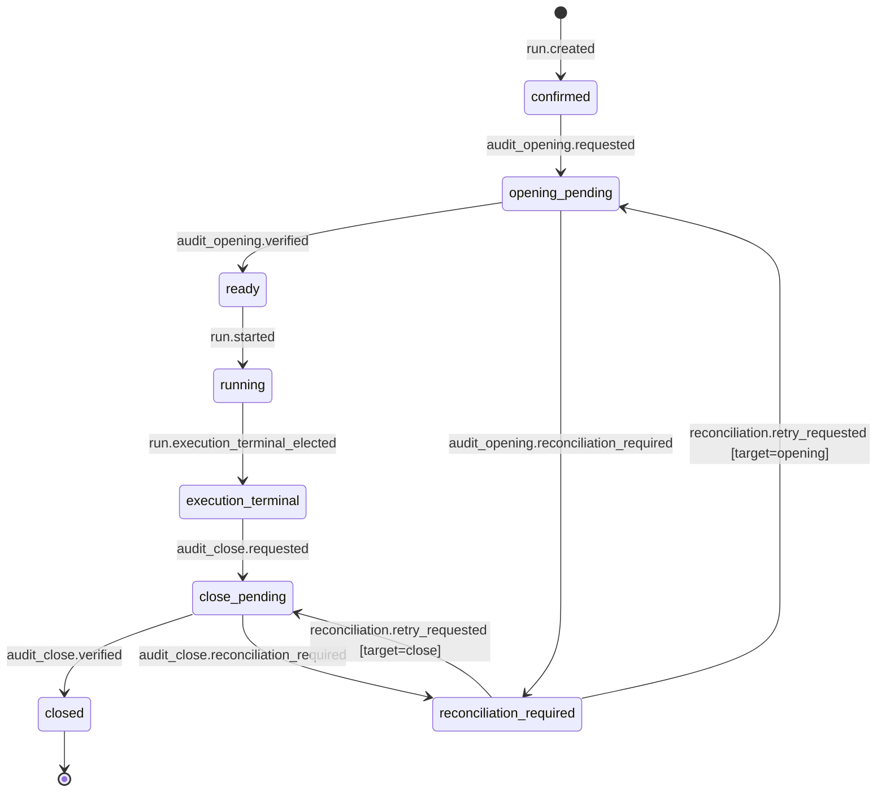
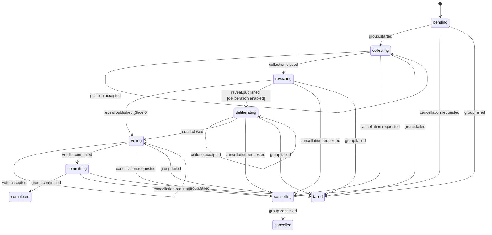
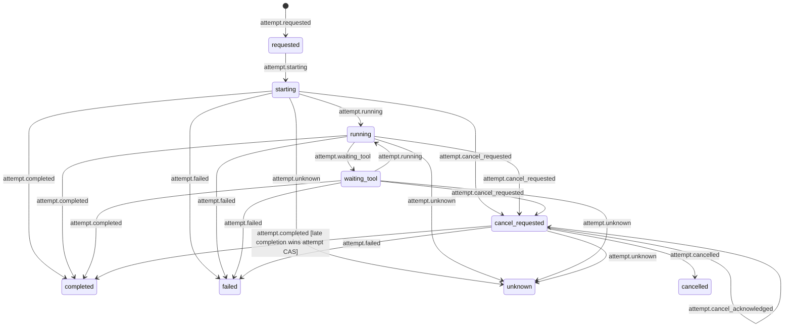

# State Machines: Agents Communication Infra

These state machines ratify the finite protocol in
[discovery v0.2.1](discovery/feature-discovery/agents-communication-infra.md). Reducers are pure:
only committed events move state, every transition uses an expected aggregate version, and any
non-listed transition is rejected. Provider names and semantic workflow types never select a state
machine branch.

## RunLifecycle

### States

| State | Terminal? | Description |
| --- | ---: | --- |
| `confirmed` | no | Immutable runtime-managed dispatch and run identity exist. |
| `opening_pending` | no | Official opening is absent or not yet independently verified; execution effects are blocked. |
| `ready` | no | Exact official opening is verified; execution effects may be released. |
| `running` | no | Protocol groups/attempts may progress. |
| `execution_terminal` | no | One run-level terminal fact won, but official close is not yet materialized. |
| `close_pending` | no | Close materialization/reconciliation is outstanding. |
| `reconciliation_required` | no | Existing audit identity diverges from canonical content; target (`opening` or `close`) is retained. |
| `closed` | yes | Exact official close row is independently verified. |

### Transition table

| From | Event | To | Guard | Effect |
| --- | --- | --- | --- | --- |
| none | [`run.created`](events.md#runcreated) | `confirmed` | Mode was `runtime-managed`; frozen digest unique | Establish 1:1 MVP dispatch/run identity |
| `confirmed` | [`audit_opening.requested`](events.md#audit_openingrequested) | `opening_pending` | Opening intent committed | Block all provider/tool execution |
| `opening_pending` | [`audit_opening.verified`](events.md#audit_openingverified) | `ready` | Exact canonical row exists | Release eligible execution intents |
| `opening_pending` | [`audit_opening.reconciliation_required`](events.md#audit_openingreconciliation_required) | `reconciliation_required` | Same identity, divergent row | Keep execution blocked |
| `reconciliation_required` | `reconciliation.retry_requested` | `opening_pending` | `target=opening`; authorized repair disposition exists | Retry exact-row reconciliation |
| `ready` | [`run.started`](events.md#runstarted) | `running` | Opening remains verified | Enable first group |
| `running` | [`run.execution_terminal_elected`](events.md#runexecution_terminal_elected) | `execution_terminal` | First valid terminal CAS wins | Freeze cause and audit exit reason |
| `execution_terminal` | [`audit_close.requested`](events.md#audit_closerequested) | `close_pending` | Close derives from winning terminal | Enqueue close intent |
| `close_pending` | [`audit_close.verified`](events.md#audit_closeverified) | `closed` | Exact close row exists | Mark official closure |
| `close_pending` | [`audit_close.reconciliation_required`](events.md#audit_closereconciliation_required) | `reconciliation_required` | Same close identity, divergent row | Expose repair requirement |
| `reconciliation_required` | `reconciliation.retry_requested` | `close_pending` | `target=close`; authorized repair disposition exists | Retry exact-row reconciliation |

### Terminal mapping (OQ-ACI3 ratified)

Attempt and group terminals never map directly to the audit ledger. One journal-ordered,
CAS-protected run terminal wins and uses this closed mapping:

| Winning run cause | Audit `exit_reason` |
| --- | --- |
| Committed positive, negative, qualified or explicitly policy-approved partial result | `resolved` |
| Committed irreconcilable dissent after permitted rounds | `dissent_irreconcilable` |
| Bounded round/protocol ceiling, including timeout with no technical fault and no quorum | `loop_ceiling_reached` |
| Explicit authorized human cancellation | `user_abort` |
| Exhausted provider retries, corrupted state, or resource/budget/other technical prevention | `error` |

A missing/invalid contribution is no quorum, not dissent. A negative, falsified or `KILL` result is
still `resolved` when validly committed. Technical prevention maps to `error`, not a protocol
ceiling. Later terminal observations are retained as ignored facts and cannot replace the winner.

### Invariants

| ID | Invariant | Formal |
| --- | --- | --- |
| RUN-I1 | A legacy-managed dispatch never has a runtime run. | `legacyManaged(d) => not exists(run(d))` |
| RUN-I2 | No provider/tool effect starts before verified opening. | `providerOrToolEffectStarted => state in {ready,running,execution_terminal,close_pending,closed}` |
| RUN-I3 | Exactly one run terminal fact wins. | `count(winningTerminal(run)) <= 1` |
| RUN-I4 | `execution_terminal` does not imply official closure. | `state=execution_terminal => not closeVerified` |
| RUN-I5 | Only `closed` asserts exact official close materialization. | `officiallyClosed <=> state=closed` |
| RUN-I6 | Reconciliation divergence never releases effects or claims closure. | `state=reconciliation_required => not releaseEffects and not officiallyClosed` |
| RUN-I7 | Replay is independent of wall clock/provider queries. | `reduce(events) = state` |

## GroupLifecycle

### States

| State | Terminal? | Description |
| --- | ---: | --- |
| `pending` | no | Dependencies or start command are outstanding. |
| `collecting` | no | Sealed initial positions are accepted; peers cannot read them. |
| `revealing` | no | Eligible set is frozen, but visibility remains closed until manifest publication. |
| `deliberating` | no | Authorized critique rounds reference already visible messages. |
| `voting` | no | Immutable votes are collected under the declared policy. |
| `committing` | no | A persisted verdict awaits one typed group result commit. |
| `cancelling` | no | Cancellation is requested; attempts are being reconciled/stopped. |
| `completed` | yes | Exactly one result was committed for this group version. |
| `cancelled` | yes | Cancellation terminal won. |
| `failed` | yes | A declared unrecoverable group cause won; run mapping is still separate. |

### Transition table

| From | Event | To | Guard | Effect |
| --- | --- | --- | --- | --- |
| `pending` | [`group.started`](events.md#groupstarted) | `collecting` | Dependencies delivered; spec valid | Activate declared seats |
| `collecting` | [`position.accepted`](events.md#positionaccepted) | `collecting` | Parent verified matching `publication.persisted`; logical key unused | Add official immutable sealed contribution |
| `collecting` | [`collection.closed`](events.md#collectionclosed) | `revealing` | Eligible set frozen; quorum or persisted deadline policy | Persist frozen set/hash; keep ACL sealed |
| `revealing` | [`reveal.published`](events.md#revealpublished) | `voting` | Slice-0 profile and exact manifest | Enable content-addressed reveal delivery |
| `revealing` | [`reveal.published`](events.md#revealpublished) | `deliberating` | Confirmed profile enables deliberation | Enable declared round |
| `deliberating` | [`critique.accepted`](events.md#critiqueaccepted) | `deliberating` | Reply targets visible; round/schema valid | Add immutable critique |
| `deliberating` | [`round.closed`](events.md#roundclosed) | `voting` | Declared criterion/round limit recorded | Freeze round |
| `voting` | [`vote.accepted`](events.md#voteaccepted) | `voting` | One schema-valid vote per seat/round | Add immutable vote |
| `voting` | [`verdict.computed`](events.md#verdictcomputed) | `committing` | Fixed or declared rule has quorum | Freeze decision evidence |
| `committing` | [`group.committed`](events.md#groupcommitted) | `completed` | Typed result and persisted verdict | Publish unique group result |
| any nonterminal | [`cancellation.requested`](events.md#cancellationrequested) | `cancelling` | Authorized command wins CAS | Request cancellation of active attempts |
| `cancelling` | [`group.cancelled`](events.md#groupcancelled) | `cancelled` | Attempts terminal or cancellation deadline fact exists | Freeze group cancellation |
| any nonterminal except `cancelling` | [`group.failed`](events.md#groupfailed) | `failed` | Declared retries/policy exhausted | Freeze cause as run-terminal evidence |

### Fixed two-seat decision rule (OQ-ACI2 ratified)

For `fixed-two-seat-proof@1`, exactly two valid logical seat votes are required. Equal votes produce
`consensus`; conflicting valid votes produce explicit `dissent`; fewer than two valid votes produce
`no_quorum` and no `verdict.computed`. `no_quorum` may later support a bounded run terminal mapped to
`loop_ceiling_reached`; it is never rewritten as dissent. This rule does not generalize to richer
quorum, abstention, replacement or sealed-vote profiles.

### Invariants

| ID | Invariant | Formal |
| --- | --- | --- |
| GRP-I1 | One logical contribution exists per group version/seat/round/type. | `unique(groupAggregate, seat, round, messageType)` |
| GRP-I2 | Peer content stays invisible until a matching manifest is published. | `peerVisible(m) <=> m in publishedRevealManifest and authorized` |
| GRP-I3 | `collection.closed` alone never changes read authorization. | `closedCollection and not revealPublished => sealed` |
| GRP-I4 | One result commits per immutable group version. | `count(committedResult(group, version)) <= 1` |
| GRP-I5 | Dissent and minority evidence remain referenced by the result. | `commit => preserves(dissentRefs)` |
| GRP-I6 | Provider/adapter/model selection cannot alter states, schema or decision rule. | `sameProfile => sameProtocol` |
| GRP-I7 | Slice 0 follows `collect -> reveal -> vote -> commit` and skips deliberation. | `slice0 => not reachable(deliberating)` |
| GRP-I8 | A durable publication candidate does not change group state or count toward quorum. | `publication.persisted and not officialAccepted => state unchanged and not eligible` |
| GRP-I9 | Collection close counts only message-type-specific official acceptance events. | `eligibleAtClose = receiptVerifiedOfficialContributions` |

## AttemptLifecycle

### States

| State | Terminal? | Description |
| --- | ---: | --- |
| `requested` | no | Plan/materialization digests, sealed request, effective-input artifact and sandboxed start intent are durable. |
| `starting` | no | Current worker epoch claimed the effect and invoked/reconciled provider start. |
| `running` | no | Provider identity/status is confirmed. |
| `waiting_tool` | no | Adapter reports a tool exchange; kernel protocol remains unchanged. |
| `cancel_requested` | no | Cancel was requested; acknowledgement alone is not terminal. |
| `completed` | yes | One valid provider terminal output is stored; official contribution still requires receipt verification. |
| `failed` | yes | Known failure terminal; policy may create a new attempt under the same operation. |
| `unknown` | yes | Outcome cannot be reconciled; non-retryable effects are not repeated automatically. |
| `cancelled` | yes | Provider/local execution is observably cancelled. |

### Transition table

| From | Event | To | Guard | Effect |
| --- | --- | --- | --- | --- |
| none | [`attempt.requested`](events.md#attemptrequested) | `requested` | Plan/materialization validate; sandbox policy and authority fence current | Enqueue durable sandbox-launch/start effect |
| `requested` | [`attempt.starting`](events.md#attemptstarting) | `starting` | Worker wins CAS claim/epoch | Invoke idempotent adapter start |
| `starting` | [`attempt.running`](events.md#attemptrunning) | `running` | Provider identity/status reconciled | Record provider run identity |
| `running` | [`attempt.waiting_tool`](events.md#attemptwaiting_tool) | `waiting_tool` | Tool request allowed by frozen profile | Execute through authorized effect boundary |
| `waiting_tool` | [`attempt.running`](events.md#attemptrunning) | `running` | Tool result observed | Resume provider observation |
| any applicable nonterminal | [`attempt.cancel_requested`](events.md#attemptcancel_requested) | `cancel_requested` | Authorized cancellation; current version | Enqueue idempotent cancel effect |
| `cancel_requested` | [`attempt.cancel_acknowledged`](events.md#attemptcancel_acknowledged) | `cancel_requested` | Matching provider/command | Record acknowledgement only |
| `starting`, `running`, `waiting_tool`, or `cancel_requested` | [`attempt.completed`](events.md#attemptcompleted) | `completed` | First valid terminal attempt fact | Store immutable raw output |
| `starting`, `running`, `waiting_tool`, or `cancel_requested` | [`attempt.failed`](events.md#attemptfailed) | `failed` | Known failure | Expose retry-policy input |
| `starting`, `running`, `waiting_tool`, or `cancel_requested` | [`attempt.unknown`](events.md#attemptunknown) | `unknown` | Status cannot reconcile outcome | Prevent unsafe automatic retry |
| `cancel_requested` | [`attempt.cancelled`](events.md#attemptcancelled) | `cancelled` | Cancellation terminal observed | Close physical attempt |

### Invariants

| ID | Invariant | Formal |
| --- | --- | --- |
| ATT-I1 | Retry preserves operation/seat and creates a new attempt identity. | `retry => same(operation,seat) and new(attempt)` |
| ATT-I2 | Exact effective input exists before authoritative start. | `state != requested => exists(effectiveInputArtifact)` |
| ATT-I3 | A stale worker epoch cannot advance state. | `event.worker_epoch = current_epoch` |
| ATT-I4 | At most one terminal provider result exists per attempt. | `count(terminal(attempt)) <= 1` |
| ATT-I5 | At most one attempt result becomes the logical operation contribution. | `count(acceptedResult(operation)) <= 1` |
| ATT-I6 | Raw provider output is not an accepted bus message. | `rawOutput != contribution` |
| ATT-I7 | Completion does not prove publication; the parent verifies the committed receipt separately. | `officialContribution => receiptVerified` |
| ATT-I8 | Late/superseded observations remain auditable and cannot reverse aggregate terminals. | `late => record and no invalid transition` |
| ATT-I9 | Adapter translation/observation cannot directly accept state. | `adapterOutput => commandInput; journalWriterOnly(transition)` |
| ATT-I10 | Start eligibility is protected against concurrent close/cancel by prerequisite heads. | `startAccepted => all prerequisiteHeads matched atomically` |

## Deferred lifecycle extensions

Detailed pause/human gate, replacement, abstention, sealed voting, multiple deliberation rounds and
distributed leases remain deferred to their gated slices. They must extend these versioned machines
with explicit events and negative fixtures; a recipe cannot inject arbitrary states or transitions.
