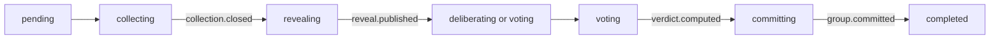
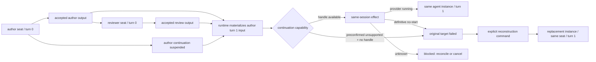

# Workflows: Agents Communication Infra

## RuntimeDispatchConfirmationWorkflow

**Type:** Workflow
**Triggers:** authenticated user asks an admitted chat or UI host to present one pending dispatch
**Orchestrates:** [Trusted confirmation observation issuer](interfaces.md#external-dependency-trusted-confirmation-observation-issuer),
[ConfirmRuntimeDispatch](operations.md#confirmruntimedispatch)
**Compensation Strategy:** reject before authority; accepted facts are immutable and never rolled back
into legacy execution
**Idempotency:** key replay plus dispatch/authority identity convergence inside the single writer

### Steps

1. The admitted issuer requests an effect-free preview. The runtime command boundary reads exact
   canonical pending bytes, validates the closed bounded shape, resolves capabilities server-side,
   compiles the canonical `DispatchSpec` and returns the dispatch/revision plus pending/spec
   digests. No runtime authority or effect exists yet.
2. The issuer displays that exact presentation. An affirmative authenticated user decision may
   arrive through chat or a future UI; free-form message fields do not author principal, channel,
   dispatch identity or digests.
3. The issuer emits one immutable
   [ConfirmationObservation](domain.md#confirmationobservation) binding its admitted identity and
   evidence to the principal, channel, time, dispatch/revision and both displayed digests.
4. The confirmation request submits the source and observation references/digests. The server
   dereferences both, revalidates the observation, recompiles from the finalized source with a
   fresh server-side resolution and requires byte/digest equality with the presentation.
5. The server derives the bounded graph, continuation, mappings and every runtime ID, constructs
   the complete confirmed-authority envelope and evaluates key replay followed by dispatch-authority
   replay under the same `BEGIN IMMEDIATE` transaction.
6. A new authority commits the complete local unit atomically and returns its first stable receipt;
   success ends at run version `2`, `opening_pending`, with one unclaimed `audit_opening` intent and
   zero external effects.

| ID | Invariant | Formal |
|---|---|---|
| WF-CONF-01 | Human approval is presentation-bound | `accepted => observed(dispatch,revision,pendingDigest,specDigest,principal)` |
| WF-CONF-02 | Transport does not own semantics | `chatApproval` and `uiApproval` require the same canonical observation and operation checks |
| WF-CONF-03 | Preview is not authority | `previewed and not accepted => zero(ConfirmedDispatch,Run,event,effect)` |
| WF-CONF-04 | Expanded authority is server-derived | `accepted => graph,mappings,ids = derive(serverProjection)` |
| WF-CONF-05 | Identity replay is writer-serialized | `same(dispatch,authority) => firstReceipt`; `same(dispatch,differentAuthority) => permanentConflict` |
| WF-CONF-06 | Confirmation has a hard effect ceiling | `success => opening_pending and onePendingAuditOpeningIntent and zeroExternalCalls` |

## RunExecutionWorkflow

**Type:** Workflow  
**Triggers:** accepted [RuntimeDispatchConfirmationWorkflow](#runtimedispatchconfirmationworkflow)
**Orchestrates:** [AcceptRuntimeCommand](operations.md#acceptruntimecommand),
[StartRun](operations.md#internal-transition--startrun), [StartGroup](operations.md#internal-transition--startgroup),
[StartAgentAttempt](operations.md#startagentattempt),
[CommitGroupResult](operations.md#commitgroupresult), [CancelRun](operations.md#cancelrun)  
**Compensation Strategy:** durable reconciliation; never roll back accepted facts  
**Idempotency:** the confirmation step converges by both command key/digest and dispatch/authority
identity; later commands use their declared scoped key/digest and expected aggregate version

### Steps

1. [ConfirmRuntimeDispatch](operations.md#confirmruntimedispatch) has already frozen the approved
   source, spec, observation, capability resolution, graph, mappings, versions and
   `runtime-managed` mode in [ConfirmedDispatch](domain.md#confirmeddispatch).
2. The same acceptance transaction has already appended `run.created`,
   `audit_opening.requested`, the version-2 head, one pending audit-opening effect and the stable
   receipt. No audit row has been claimed or appended yet.
3. Run [AuditLedgerMaterializer](#auditledgermaterializer); derive the candidate opening row only
   from the frozen authority. Exact append/reconciliation appends `audit_opening.verified` and
   moves the run `opening_pending -> ready`. An existing divergent row appends
   `audit_opening.reconciliation_required` and moves to `reconciliation_required`; an absent row
   followed by a failed or unknown appender outcome remains blocked without a verification event,
   normally in `opening_pending` with the effect marked `failed` or `unknown`.
4. [StartRun](operations.md#internal-transition--startrun) appends `run.started` and moves the run
   `ready -> running` before any Group or Attempt becomes eligible.
5. For each dependency-eligible [Group](domain.md#group),
   [StartGroup](operations.md#internal-transition--startgroup) appends `group.started` and moves the
   group `pending -> collecting`. Only then execute
   [GroupDeliberationWorkflow](#groupdeliberationworkflow), materialize each
   [AgentInvocationPlan](domain.md#agentinvocationplan), seal its
   [AgentExecutionRequest](domain.md#agentexecutionrequest), and launch through the enforced
   sandbox with a current [ExecutionAuthorityFence](domain.md#executionauthorityfence).
6. Select one run terminal fact by journal order and policy; late observations remain auditable.
7. Materialize and exactly verify the close row; only then project `closed`.

| ID | Invariant | Formal |
|---|---|---|
| WF-RUN-01 | Attempts require the ordered opening, run and phase-eligible group heads | `StartAgentAttempt(operation_id) -> opening_verified and runHead.state=running and groupHead.state=eligible_phase(operation_id) and prerequisite_heads=exact(runHead,groupHead)` |
| WF-RUN-02 | One run terminal | `count(accepted run terminal events) = 1` |
| WF-RUN-03 | Execution terminal differs from official close | `execution_terminal != closed` until close verification event |
| WF-RUN-04 | Replay is pure | `replay(events) -> state` and invokes no provider/tool/appender |
| WF-RUN-05 | Start races are causal | target CAS and all `prerequisite_heads` match atomically |
| WF-RUN-06 | Real starts are fenced and sandboxed | `start -> currentFence and SandboxLauncher(policy)` |

## GroupDeliberationWorkflow

**Type:** Workflow  
**Triggers:** dependencies committed and group spec valid  
**Orchestrates:** [StartAgentAttempt](operations.md#startagentattempt),
[PublishBusContribution](operations.md#publishbuscontribution), [CloseCollection](operations.md#closecollection),
[PublishRevealManifest](operations.md#publishrevealmanifest), [CommitGroupResult](operations.md#commitgroupresult)  
**Compensation Strategy:** reject/record late or invalid observations; no mutation of accepted contributions  
**Idempotency:** logical uniqueness by `(aggregate, seat, round, message_type)`

Each seat receives the same `base_snapshot_ref` unless a hashed role delta was confirmed. During
collection, only own content is visible. [CloseCollection](operations.md#closecollection) freezes the
eligible set but does not open access. [PublishRevealManifest](operations.md#publishrevealmanifest)
persists exact message IDs/hashes; authorized messages then become a content-addressed input in a
later [EffectiveInputArtifact](domain.md#effectiveinputartifact). The kernel commits the typed
[GroupResult](domain.md#groupresult), including quorum, dissent and provenance, without writing a
narrative itself.

| ID | Invariant | Formal |
|---|---|---|
| WF-GRP-01 | Sealed collection | `collecting -> peer_content_visible = false` |
| WF-GRP-02 | Close is not reveal | `collection.closed and not reveal.published -> peer_content_visible = false` |
| WF-GRP-03 | Manifest-bound delivery | `delivered(m) -> m.id/hash in persisted RevealManifest` |
| WF-GRP-04 | One contribution per logical key | uniqueness across retries/attempts |
| WF-GRP-05 | Provider neutrality | transition/rule selection is independent of provider/model name |

## ReceiptGatedPublicationWorkflow

**Type:** Workflow  
**Triggers:** agent calls `bus_publish` through its authenticated capability  
**Orchestrates:** [PublishBusContribution](operations.md#publishbuscontribution),
[VerifyPublicationReceipt](operations.md#verifypublicationreceipt)  
**Compensation Strategy:** reject without state advance; identical retries return the original receipt  
**Idempotency:** yes for same scoped key and digest; conflicting digest is permanently rejected

1. Derive run/group/version/seat/agent/attempt/principal/phase from capability context.
2. Validate operation, round, phase, schema, size, reply visibility and logical uniqueness.
3. Commit `publication.persisted` candidate before returning the complete
   byte-stable [PublicationReceipt](domain.md#publicationreceipt). Retry metadata, if any, is outside
   the receipt.
4. Parse the provider terminal into one versioned [AgentTerminalResult](domain.md#agentterminalresult).
5. Parent independently matches receipt version/status/event/message/offset/hash/key and authenticated
   attempt/operation/logical-key scope in the journal.
6. Atomically CAS the authoritative candidate `active -> officially_accepted`, insert the official
   message and append `attempt.result_accepted` plus the message-type-specific official acceptance.
7. Only that verified official acceptance permits the provider result to count as an official
   [Contribution](domain.md#contribution).

`missing`, `forged`, `altered`, cross-scope, late-phase and logically duplicate receipts/results do
not advance protocol state and remain diagnosable security/protocol observations.

Recovery is idempotent by `(attempt_id, operation_id, logical_message_key)`: after a crash between
publish and provider terminalization, or between terminalization and verification acknowledgement,
the scheduler reloads the candidate and any terminal artifact, then reconciles provider status. If
terminal evidence is recovered, it repeats verification. If the attempt is durably terminal
`unknown`, no terminal evidence is recoverable and retry policy authorizes another attempt, the
writer CASes the active candidate to `abandoned` with
`publication.candidate_abandoned`; only then may another attempt reserve that logical key. The
existing official event pair is returned if already committed; candidate-only or abandoned evidence
never counts toward close or quorum, and a late terminal cannot revive an abandoned candidate.

## ResumableFeedbackWorkflow

**Type:** Workflow
**Triggers:** confirmed finite turn graph containing one bounded feedback edge
**Orchestrates:** [StartAgentAttempt](operations.md#startagentattempt),
[SuspendAgentContinuation](operations.md#suspendagentcontinuation),
[PublishBusContribution](operations.md#publishbuscontribution),
[VerifyPublicationReceipt](operations.md#verifypublicationreceipt),
[ResumeAgentContinuation](operations.md#resumeagentcontinuation),
[ReconstructAgentContinuation](operations.md#reconstructagentcontinuation), and
[CancelAgentContinuation](operations.md#cancelagentcontinuation)
**Compensation Strategy:** journal-ordered cancel/expiry; reconstruct only after definitive
pre-start continuation loss and explicit policy
**Idempotency:** stable continuation, mapping, target-turn, request and effect identities

The author turn-0 attempt is terminal before suspension. Both author output and reviewer feedback
become official bus contributions through receipt verification. The author does not remain as a
running collector and cannot poll the bus. The scheduler observes the two exact mapped receipts in
the journal and applies the
[runtime continuation input materialization contract](operations.md#runtime-continuation-input-materialization-contract),
then accepts one current target attempt and effect. A definitive no-start result may terminalize
that target before one explicit replacement is accepted; there is never more than one claimable
effect at a time. Same-session resume and reconstruction consume the same provider-neutral input
contract. Unknown outcome blocks replacement and waits only for reconciliation or cancellation.

| ID | Invariant | Formal |
|---|---|---|
| WF-CONT-01 | Expanded turn graph has exactly the declared dependencies and no others. | `nodes={author:0,reviewer:0,author:1} and executionEdges={(author:0,reviewer:0),(reviewer:0,author:1)} and DAG(executionEdges)` |
| WF-CONT-02 | Suspension creates no listener or running attempt. | `suspended(author:0) => noBusRead and noActiveAttempt(author)` |
| WF-CONT-03 | Review feedback is exact declared input. | `author:1.review = verifiedOutput(reviewer:0)` |
| WF-CONT-04 | At most one author-turn-1 effect is claimable at a time; one failed no-start effect may precede one reconstruction effect. | `count(claimableEffect(author:1)) <= 1 and count(reconstructionEffect(author:1)) <= 1 and count(historicalEffect(author:1)) <= 2` |
| WF-CONT-05 | Provider handle loss cannot erase reconstruction evidence. | `lost(handle) => retained(contextSnapshot,sourceReceipts)` |
| WF-CONT-06 | Unknown physical outcome blocks replacement. | `resumeEffect=unknown => noAutomaticReplacement` |
| WF-CONT-07 | Continuation input comes from two exact official bus contributions, not host-bound output. | `sources=[official(author:0),official(reviewer:0)]` |
| WF-CONT-08 | Author-turn-1 input has the exact declared order. | `input(author:1)=[reconstructionBase,official(author:0),official(reviewer:0),revisionInstruction]` |

## AuditLedgerMaterializer

**Type:** Workflow  
**Concept ID:** `agents-communication-infra.AuditLedgerMaterializer`  
**Triggers:** durable opening or close [EffectIntent](domain.md#effectintent)  
**Orchestrates:** [AcceptRuntimeCommand](operations.md#acceptruntimecommand) acknowledgements around
the validated audit-ledger appender boundary  
**Compensation Strategy:** exact-row reconciliation; divergent rows require operator repair  
**Idempotency:** identity plus canonical row equality, never identity alone

| Existing row | Action | Journal outcome | Release effect/official close? |
|---|---|---|---|
| absent | invoke validated appender, then re-read/verify | verified or explicit failure/unknown | only if verified |
| identity and exact canonical content match | do not append | already-applied/verified | yes |
| same identity, different canonical content | do not append | [ReconciliationState](domain.md#reconciliationstate) = `reconciliation_required` | no |

The canonical opening/close rows derive only from frozen authority. A crash after physical append but
before journal acknowledgement repeats the read/compare procedure. No adapter, alternate script or
reconciler writes the audit ledger directly.

## ExternalEffectReconciliationWorkflow

**Type:** Workflow  
**Triggers:** restart, expired/stale worker claim, or `effect.unknown` event / `unknown` effect state  
**Orchestrates:** [AcceptRuntimeCommand](operations.md#acceptruntimecommand) and
[StartAgentAttempt](operations.md#startagentattempt), according to the owning effect boundary  
**Compensation Strategy:** retry only when effect policy permits; non-retryable unknown remains unknown  
**Idempotency:** stable effect/attempt identity and request digest

Rebuild state from the journal, reclaim via current worker epoch, then use the owning boundary's
status/exact-read operation. An identical completed effect is acknowledged; an absent retryable
effect may be retried; a divergent or non-reconcilable effect becomes `reconciliation_required` or
the `unknown` state announced by [`effect.unknown`](events.md#effectunknown). Recovery never infers
success from logs or silence.

For publication effects, exact reads use attempt, operation and logical message key. A crash after
`publication.persisted` but before a provider terminal is not treated as success. Recovery first
tries to obtain a versioned terminal envelope from immutable/provider status evidence. When that is
impossible, only a persisted terminal-unknown fact plus an explicit no-recoverable-evidence
determination and retry authorization may abandon the candidate by CAS. Otherwise the active
reservation remains and the run surfaces `unknown`/repair-required rather than inventing success or
silently replacing the publisher.

## ExecutionAuthorityCutoverWorkflow

**Type:** Workflow  
**Triggers:** operator selects migration mode before confirmation  
**Orchestrates:** [ConfirmRuntimeDispatch](operations.md#confirmruntimedispatch),
[AcceptRuntimeCommand](operations.md#acceptruntimecommand)  
**Compensation Strategy:** disable runtime ownership before a new confirmation and return future
dispatches to legacy mode; never reinterpret partial runtime state  
**Idempotency:** the pre-confirmation routing choice is stable for one proposal revision; after
runtime acceptance, `runtime-managed` is immutable in `ConfirmedDispatch`

| Mode | Runtime behavior | Legacy/session behavior | Marker/sheet behavior |
|---|---|---|---|
| `runtime-managed` | creates exactly one `ConfirmedDispatch` and runtime `Run`, then issues a monotonic cutover epoch | watcher disable is verified and evidence-bound before start | marker is compatibility projection; cleanup is retryable only after opening verification |
| `legacy-managed` | creates neither `ConfirmedDispatch` nor runtime `Run` | existing session chain owns execution | existing marker flow remains authoritative transport |

This settles OQ-ACI6: dual execution is forbidden, rollback applies to not-yet-confirmed work, and a
confirmed runtime-managed dispatch cannot be silently handed to the legacy watcher.

Every external start carries an [ExecutionAuthorityFence](domain.md#executionauthorityfence) binding
the run, runtime-managed mode, cutover epoch and immutable watcher-disable evidence. A missing,
changed or stale fence rejects launch. `OQ-SANDBOX` remains a Slice-1 blocker even when this authority
fence passes.

## Workflow Decision Register

| Discovery question | Settlement |
|---|---|
| OQ-ACI5 | exact identity + canonical content reconciliation in [AuditLedgerMaterializer](#auditledgermaterializer) |
| OQ-ACI6 | immutable pre-confirmation [ExecutionAuthorityMode](domain.md#executionauthoritymode) and explicit rollback boundary |
| OQ-ACI8 | reveal delivery and every provider invocation are captured in [EffectiveInputArtifact](domain.md#effectiveinputartifact) |
| OQ-ACI9 | sensitive artifact boundary ratified; concrete retention/encryption/key periods deferred before Slice 1 exit |
| OQ-ACI10 | immutable nullable usage observations ratified; empirical provider completeness remains a Slice 2 gate |
