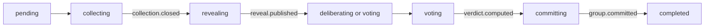

# Workflows: Agents Communication Infra

## RunExecutionWorkflow

**Type:** Workflow  
**Triggers:** accepted [ConfirmRuntimeDispatch](operations.md#confirmruntimedispatch)  
**Orchestrates:** [ConfirmRuntimeDispatch](operations.md#confirmruntimedispatch),
[AcceptRuntimeCommand](operations.md#acceptruntimecommand), [StartAgentAttempt](operations.md#startagentattempt),
[CommitGroupResult](operations.md#commitgroupresult), [CancelRun](operations.md#cancelrun)  
**Compensation Strategy:** durable reconciliation; never roll back accepted facts  
**Idempotency:** conditional on identical command digest and expected aggregate version

### Steps

1. After [ConfirmRuntimeDispatch](operations.md#confirmruntimedispatch) accepts the already selected
   `runtime-managed` mode, freeze the approved bytes, digest, policy/schema/recipe versions and that
   mode into [ConfirmedDispatch](domain.md#confirmeddispatch).
2. Atomically append run creation/opening intent, aggregate head and stable command receipt.
3. Run [AuditLedgerMaterializer](#auditledgermaterializer); do not start an adapter before exact
   opening verification is journaled.
4. Materialize each [AgentInvocationPlan](domain.md#agentinvocationplan), seal its
   [AgentExecutionRequest](domain.md#agentexecutionrequest), and launch only through the enforced
   sandbox with a current [ExecutionAuthorityFence](domain.md#executionauthorityfence).
5. Execute each [Group](domain.md#group) through [GroupDeliberationWorkflow](#groupdeliberationworkflow).
6. Select one run terminal fact by journal order and policy; late observations remain auditable.
7. Materialize and exactly verify the close row; only then project `closed`.

| ID | Invariant | Formal |
|---|---|---|
| WF-RUN-01 | No effect before opening | `StartAgentAttempt -> opening_verified` |
| WF-RUN-02 | One run terminal | `count(accepted run terminal events) = 1` |
| WF-RUN-03 | Execution terminal differs from official close | `execution_terminal != closed` until close verification event |
| WF-RUN-04 | Replay is pure | `replay(events) -> state` and invokes no provider/tool/appender |
| WF-RUN-05 | Start races are causal | target CAS and all `prerequisite_heads` match atomically |
| WF-RUN-06 | Real starts are fenced and sandboxed | `start -> currentFence and SandboxLauncher(policy)` |

## GroupDeliberationWorkflow

**Type:** Workflow  
**Triggers:** dependencies committed and group spec valid  
**Orchestrates:** [StartAgentAttempt](operations.md#startagentattempt),
[PublishBusContribution](operations.md#publishbuscontribution), [CloseCollection](operations.md#closecollection),
[PublishRevealManifest](operations.md#publishrevealmanifest), [CommitGroupResult](operations.md#commitgroupresult)  
**Compensation Strategy:** reject/record late or invalid observations; no mutation of accepted contributions  
**Idempotency:** logical uniqueness by `(aggregate, seat, round, message_type)`

Each seat receives the same `base_snapshot_ref` unless a hashed role delta was confirmed. During
collection, only own content is visible. [CloseCollection](operations.md#closecollection) freezes the
eligible set but does not open access. [PublishRevealManifest](operations.md#publishrevealmanifest)
persists exact message IDs/hashes; authorized messages then become a content-addressed input in a
later [EffectiveInputArtifact](domain.md#effectiveinputartifact). The kernel commits the typed
[GroupResult](domain.md#groupresult), including quorum, dissent and provenance, without writing a
narrative itself.

| ID | Invariant | Formal |
|---|---|---|
| WF-GRP-01 | Sealed collection | `collecting -> peer_content_visible = false` |
| WF-GRP-02 | Close is not reveal | `collection.closed and not reveal.published -> peer_content_visible = false` |
| WF-GRP-03 | Manifest-bound delivery | `delivered(m) -> m.id/hash in persisted RevealManifest` |
| WF-GRP-04 | One contribution per logical key | uniqueness across retries/attempts |
| WF-GRP-05 | Provider neutrality | transition/rule selection is independent of provider/model name |

## ReceiptGatedPublicationWorkflow

**Type:** Workflow  
**Triggers:** agent calls `bus_publish` through its authenticated capability  
**Orchestrates:** [PublishBusContribution](operations.md#publishbuscontribution),
[VerifyPublicationReceipt](operations.md#verifypublicationreceipt)  
**Compensation Strategy:** reject without state advance; identical retries return the original receipt  
**Idempotency:** yes for same scoped key and digest; conflicting digest is permanently rejected

1. Derive run/group/version/seat/agent/attempt/principal/phase from capability context.
2. Validate operation, round, phase, schema, size, reply visibility and logical uniqueness.
3. Commit `publication.persisted` candidate before returning the complete
   byte-stable [PublicationReceipt](domain.md#publicationreceipt). Retry metadata, if any, is outside
   the receipt.
4. Parse the provider terminal into one versioned [AgentTerminalResult](domain.md#agentterminalresult).
5. Parent independently matches receipt version/status/event/message/offset/hash/key and authenticated
   attempt/operation/logical-key scope in the journal.
6. Atomically CAS the authoritative candidate `active -> officially_accepted`, insert the official
   message and append `attempt.result_accepted` plus the message-type-specific official acceptance.
7. Only that verified official acceptance permits the provider result to count as an official
   [Contribution](domain.md#contribution).

`missing`, `forged`, `altered`, cross-scope, late-phase and logically duplicate receipts/results do
not advance protocol state and remain diagnosable security/protocol observations.

Recovery is idempotent by `(attempt_id, operation_id, logical_message_key)`: after a crash between
publish and provider terminalization, or between terminalization and verification acknowledgement,
the scheduler reloads the candidate and any terminal artifact, then reconciles provider status. If
terminal evidence is recovered, it repeats verification. If the attempt is durably terminal
`unknown`, no terminal evidence is recoverable and retry policy authorizes another attempt, the
writer CASes the active candidate to `abandoned` with
`publication.candidate_abandoned`; only then may another attempt reserve that logical key. The
existing official event pair is returned if already committed; candidate-only or abandoned evidence
never counts toward close or quorum, and a late terminal cannot revive an abandoned candidate.

## AuditLedgerMaterializer

**Type:** Workflow  
**Concept ID:** `agents-communication-infra.AuditLedgerMaterializer`  
**Triggers:** durable opening or close [EffectIntent](domain.md#effectintent)  
**Orchestrates:** [AcceptRuntimeCommand](operations.md#acceptruntimecommand) acknowledgements around
the validated audit-ledger appender boundary  
**Compensation Strategy:** exact-row reconciliation; divergent rows require operator repair  
**Idempotency:** identity plus canonical row equality, never identity alone

| Existing row | Action | Journal outcome | Release effect/official close? |
|---|---|---|---|
| absent | invoke validated appender, then re-read/verify | verified or explicit failure/unknown | only if verified |
| identity and exact canonical content match | do not append | already-applied/verified | yes |
| same identity, different canonical content | do not append | [ReconciliationState](domain.md#reconciliationstate) = `reconciliation_required` | no |

The canonical opening/close rows derive only from frozen authority. A crash after physical append but
before journal acknowledgement repeats the read/compare procedure. No adapter, alternate script or
reconciler writes the audit ledger directly.

## ExternalEffectReconciliationWorkflow

**Type:** Workflow  
**Triggers:** restart, expired/stale worker claim, or `effect.unknown` event / `unknown` effect state  
**Orchestrates:** [AcceptRuntimeCommand](operations.md#acceptruntimecommand) and
[StartAgentAttempt](operations.md#startagentattempt), according to the owning effect boundary  
**Compensation Strategy:** retry only when effect policy permits; non-retryable unknown remains unknown  
**Idempotency:** stable effect/attempt identity and request digest

Rebuild state from the journal, reclaim via current worker epoch, then use the owning boundary's
status/exact-read operation. An identical completed effect is acknowledged; an absent retryable
effect may be retried; a divergent or non-reconcilable effect becomes `reconciliation_required` or
the `unknown` state announced by [`effect.unknown`](events.md#effectunknown). Recovery never infers
success from logs or silence.

For publication effects, exact reads use attempt, operation and logical message key. A crash after
`publication.persisted` but before a provider terminal is not treated as success. Recovery first
tries to obtain a versioned terminal envelope from immutable/provider status evidence. When that is
impossible, only a persisted terminal-unknown fact plus an explicit no-recoverable-evidence
determination and retry authorization may abandon the candidate by CAS. Otherwise the active
reservation remains and the run surfaces `unknown`/repair-required rather than inventing success or
silently replacing the publisher.

## ExecutionAuthorityCutoverWorkflow

**Type:** Workflow  
**Triggers:** operator selects migration mode before confirmation  
**Orchestrates:** [ConfirmRuntimeDispatch](operations.md#confirmruntimedispatch),
[AcceptRuntimeCommand](operations.md#acceptruntimecommand)  
**Compensation Strategy:** disable runtime ownership before a new confirmation and return future
dispatches to legacy mode; never reinterpret partial runtime state  
**Idempotency:** the pre-confirmation routing choice is stable for one proposal revision; after
runtime acceptance, `runtime-managed` is immutable in `ConfirmedDispatch`

| Mode | Runtime behavior | Legacy/session behavior | Marker/sheet behavior |
|---|---|---|---|
| `runtime-managed` | creates exactly one `ConfirmedDispatch` and runtime `Run`, then issues a monotonic cutover epoch | watcher disable is verified and evidence-bound before start | marker is compatibility projection; cleanup is retryable only after opening verification |
| `legacy-managed` | creates neither `ConfirmedDispatch` nor runtime `Run` | existing session chain owns execution | existing marker flow remains authoritative transport |

This settles OQ-ACI6: dual execution is forbidden, rollback applies to not-yet-confirmed work, and a
confirmed runtime-managed dispatch cannot be silently handed to the legacy watcher.

Every external start carries an [ExecutionAuthorityFence](domain.md#executionauthorityfence) binding
the run, runtime-managed mode, cutover epoch and immutable watcher-disable evidence. A missing,
changed or stale fence rejects launch. `OQ-SANDBOX` remains a Slice-1 blocker even when this authority
fence passes.

## Workflow Decision Register

| Discovery question | Settlement |
|---|---|
| OQ-ACI5 | exact identity + canonical content reconciliation in [AuditLedgerMaterializer](#auditledgermaterializer) |
| OQ-ACI6 | immutable pre-confirmation [ExecutionAuthorityMode](domain.md#executionauthoritymode) and explicit rollback boundary |
| OQ-ACI8 | reveal delivery and every provider invocation are captured in [EffectiveInputArtifact](domain.md#effectiveinputartifact) |
| OQ-ACI9 | sensitive artifact boundary ratified; concrete retention/encryption/key periods deferred before Slice 1 exit |
| OQ-ACI10 | immutable nullable usage observations ratified; empirical provider completeness remains a Slice 2 gate |
