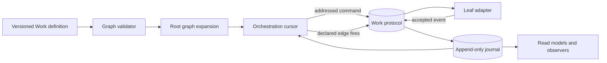

# Thin Recursive Work Orchestrator — Design

“RWO” is shorthand for **Recursive Work Orchestrator**: a candidate runtime kernel that composes
bounded units of work into executable pipelines. “Recursive” describes composition—a composed
pipeline remains usable as a work unit—not recursive scheduler or authority creation.

## Status and claim ceiling

This document proposes a domain-independent orchestration kernel. It is a design, not an
implementation, accepted specification, authority grant, or claim that the runtime exists.

The design deliberately separates two meanings of recursion:

- **recursive composition is required:** a composition of work units is itself a work unit and can
  be nested anywhere a leaf can be used;
- **recursive orchestration authority is forbidden:** one root runtime expands and schedules the
  graph. A composite does not launch another independently authoritative orchestrator.

This preserves a recursive language without creating an unbounded tree of schedulers, inherited
authority, or competing status owners.

## 1. Purpose

The orchestrator should describe and invoke almost any bounded work pipeline while knowing as
little as possible about the work itself.

It offers a small API for arranging work:

- sequence;
- fan-out;
- fan-in;
- gates and routing;
- sidecars;
- bounded repetition;
- arbitrary event-triggered connections; and
- recursive composition.

The orchestrator does not decide whether a piece of work is approved, correct, complete, blocked,
or ready in domain terms. Individual work units own those meanings. The orchestrator observes
declared events and issues declared calls.

## 2. Thesis

> **Everything executable is a `Work`; every pipeline is also a `Work`; orchestration is the
> deterministic interpretation of composition plus the delivery of commands in response to
> events.**

The smallest useful kernel therefore needs only four responsibilities:

1. validate a versioned work graph;
2. expand nested composites into one execution plan;
3. subscribe to declared events and issue idempotent commands; and
4. rebuild its routing cursor from the accepted event history.

Anything that requires domain judgment belongs in a work unit, a gate work unit, or a policy
adapter outside the kernel.

## 3. Non-goals

The kernel does not own:

- business or governance decisions;
- confirmation policy or confirmation state;
- domain-specific lifecycle states;
- artifact meaning or result quality;
- retries, compensation, cancellation policy, or timeout policy;
- agent selection, prompting, tools, credentials, or sandbox policy;
- the authoritative current status of a leaf work unit;
- ontology promotion; or
- user-interface projections.

Those concerns may be implemented as work units, declarative policies, adapters, or subscribers.
The kernel only supplies the composition and invocation boundary they use.

## 4. The uniform `Work` contract

A leaf and a composite share the same outer contract.

```text
Work<I, O> = {
  definition: WorkDefinition<I, O>
  input:      Schema<I>
  output:     Schema<O>
  events:     EventContract
  body:       LeafBinding | WorkGraph<I, O>
}
```

### 4.1 `WorkDefinition`

A definition is immutable and versioned. It declares:

| Field | Meaning |
|---|---|
| `work_ref` | Stable definition identity and version. |
| `input_schema` | Input accepted by an invocation. |
| `output_schema` | Output exposed at the work boundary. |
| `command_contract` | Commands this work may receive. |
| `event_contract` | Events this work may emit, including release and terminal classifications. |
| `body` | A leaf executor binding or a composite graph. |
| `authority_requirements` | References to authority evidence required before a command may be delivered. |
| `limits` | Budget, deadline, or bounded-round requirements applicable to this definition. |

### 4.2 `WorkRun`

A `WorkRun` is one invocation of a `WorkDefinition` with a stable `work_run_id`. A run may have
multiple attempts, but attempts do not change its definition, graph, or authority basis.

Every nested node receives a stable execution address:

```text
<root_work_run_id>/<node_path>/<attempt_id>
```

The path records structural position. It does not grant authority or make a child status equal to
its parent's status.

### 4.3 Leaf work

A leaf binds the uniform contract to an executor adapter. The adapter consumes addressed commands,
does the work, and emits events. The kernel does not call provider-specific APIs directly.

Examples include an agent invocation, shell task, HTTP operation, human approval, deterministic
validator, timer, reducer, or artifact publisher.

### 4.4 Composite work

A composite stores a `WorkGraph` as its body. It declares how root input is mapped into child
inputs, which child events release other nodes, and how selected child outputs form the composite
output.

Because the composite preserves the same outer contract, it can be used anywhere a leaf can be
used. At runtime the root orchestrator expands nested graphs into one addressed plan; it does not
start a child orchestrator.

## 5. The composition algebra

All convenience operators compile to one primitive: an event-triggered connection between work
nodes.

```text
on(source, event_selector)
  -> invoke(target, input_mapping)
```

The public composition API returns `Work` from every operator:

```text
leaf(binding, contract)                         -> Work
sequence(work...)                               -> Work
fanOut(branches...)                             -> Work
fanIn(branches, release_policy, join_work)      -> Work
gate(decision_work, routes)                     -> Work
sidecar(primary, companions, lifecycle_policy)  -> Work
repeat(body, decision_work, max_rounds)         -> Work
compose(graph, boundary_contract)               -> Work
```

### 5.1 Sequence

`sequence(A, B)` maps an event declared by `A` as a release event into an invocation of `B`.
Completion in a domain sense remains whatever `A` declared; the kernel does not infer it from
labels such as `success` or `approved`.

### 5.2 Fan-out

`fanOut(A, B, C)` invokes independent branches from one declared release event. It does not imply
independent judgment, equal authority, or shared inputs. Each branch receives an explicit input
mapping and authority check.

### 5.3 Fan-in

`fanIn` waits for a structural release condition such as `all`, `any`, or `quorum(n)`, then invokes
a join work unit with a canonically ordered input manifest. Semantic reconciliation belongs to the
join work, not the orchestrator.

### 5.4 Gate

A gate is a work unit that emits a declared route label. The kernel matches that label to one
explicit outgoing edge. The gate owns the decision and its evidence; the kernel only routes the
result. Zero matches or multiple matches fail closed.

Human confirmation is one possible gate implementation. The orchestrator may deliver a
confirmation command and observe the gate's event, but it never marks the work confirmed itself.

### 5.5 Sidecar

A sidecar is ordinary work attached to a primary work unit by a declared lifecycle policy:

- start before, with, or after the primary;
- observe selected primary events;
- detach, await, or request cancellation when the primary reaches a declared terminal event; and
- contribute or not contribute to the composite output.

Telemetry, watchdogs, artifact capture, notifications, and lease renewals are typical sidecars.
Attaching a sidecar does not give it authority over the primary unless an explicit gate edge does.

### 5.6 Bounded repetition

Cycles are never implicit. `repeat` requires a decision work, a maximum round or budget, and an
exhaustion route. Rework, retry, polling, and refinement can use this operator without making
arbitrary agent behavior provably terminating.

### 5.7 Escape hatch: explicit graph composition

The convenience operators are syntax. `compose` admits a versioned typed graph of nodes and
event-triggered edges, subject to the same validation rules. This is what supports new composition
patterns without adding business semantics to the kernel.

## 6. Work protocol: commands, events, and the bus

“Bus” is a logical protocol boundary, not necessarily one broker or one process. It has two lanes
that must not be collapsed:

| Lane | Meaning | Examples |
|---|---|---|
| command lane | Addressed request that may still be rejected by the target or its authority adapter. | invoke, cancel-requested, confirmation-provided, signal |
| event lane | Accepted fact emitted by a work unit or trusted runtime adapter. | accepted, waiting-for-confirmation, output-published, failed, completed |

The work protocol transports messages; the connected journal persists accepted history. Neither
decides, authorizes, or executes work.

### 6.1 Common envelope

```yaml
message_id: "..."
message_kind: command | event
message_type: "namespace.name@version"
work_ref: "work:name@version"
work_run_id: "..."
node_path: "root/reviewers/a"
attempt_id: "..."
correlation_id: "..."
causation_id: "..."
actor_ref: "..."
authority_ref: "..."
sequence: 17
occurred_at: "..."
idempotency_key: "..."
payload_schema: "schema:...@version"
payload: {}
```

Not every field is agent-authored. Identity, routing, authority, ordering, timestamps, and digests
should be injected or verified by trusted adapters wherever possible.

### 6.2 Delivery contract

The candidate delivery model is:

- at-least-once delivery;
- mandatory idempotency for commands and event acceptance;
- ordered events per `work_run_id`, with no global ordering claim;
- append-only accepted history;
- outbox/inbox or equivalent atomic delivery boundaries; and
- replayable, versioned reducers.

Exactly-once business effects are not claimed. A work adapter must make repeated delivery safe or
reject it deterministically.

### 6.3 Event classifications

The kernel needs only structural classifications declared by each `EventContract`:

| Class | Kernel use |
|---|---|
| `progress` | Observable; does not release an edge by default. |
| `release` | May enable a declared outgoing edge. |
| `terminal` | Ends the addressed attempt or run according to the work's contract. |
| `diagnostic` | Observable evidence with no routing effect unless explicitly selected. |

Domain event names and payloads remain owned by the work unit. A terminal event is not necessarily
business success, approval, acceptance, or permission for another effect.

## 7. State and ownership

The model separates three kinds of state:

| State | Owner | Orchestrator relationship |
|---|---|---|
| domain state | individual work unit or its adapter | opaque; observed through declared events |
| accepted history | journal/event persistence boundary | consumed for replay and audit |
| orchestration cursor | root orchestrator projection | rebuildable record of delivered commands, satisfied edges, and enabled nodes |

The cursor is necessary: a scheduler cannot safely fan in or avoid duplicate invocation without
remembering what it has observed and delivered. Thinness therefore means **no authoritative domain
state**, not literal memorylessness.

A global pipeline status is a projection over child events. It must expose its reducer version and
freshness and cannot overwrite, reinterpret, or manufacture the state of a child work unit.

## 8. Runtime flow



For each accepted event the root runtime:

1. deduplicates and appends the event;
2. folds it into the versioned orchestration cursor;
3. evaluates only edges subscribed to that event classification and type;
4. materializes the target input through the declared mapping;
5. checks command authority and idempotency; and
6. publishes the addressed command through the command lane.

No step evaluates whether the underlying work was good, true, approved, or complete beyond the
structural meaning explicitly declared in its contract.

## 9. Minimal API example

```ts
const research = leaf("work:research@1", researchContract);
const reviewA = leaf("work:review-a@1", reviewContract);
const reviewB = leaf("work:review-b@1", reviewContract);
const synthesize = leaf("work:synthesize@1", synthesisContract);
const approval = leaf("work:human-approval@1", approvalContract);
const implement = leaf("work:implement@1", implementationContract);
const observe = leaf("work:telemetry-sidecar@1", telemetryContract);

const reviewedResearch = sequence(
  research,
  fanIn(
    fanOut(reviewA, reviewB),
    { release: "all" },
    synthesize,
  ),
);

const delivery = gate(approval, {
  approved: implement,
  revise: repeat(reviewedResearch, approval, { maxRounds: 3 }),
  rejected: leaf("work:close-without-effect@1", closeContract),
});

const pipeline = sidecar(
  sequence(reviewedResearch, delivery),
  [observe],
  { start: "with-primary", finish: "await" },
);
```

`pipeline` is itself a `Work`. It can be invoked directly or nested inside another composition.
The example is illustrative syntax; it does not select an implementation language or final API.

## 10. Validation invariants

| ID | Invariant | Failure posture |
|---|---|---|
| RWO-I01 | Every leaf and composite satisfies one versioned outer `Work` contract. | reject graph |
| RWO-I02 | Nested composites expand to one root execution plan; no nested orchestrator invocation edge exists. | reject graph |
| RWO-I03 | Every routing edge names an event selector, target, and input mapping. | reject graph |
| RWO-I04 | Every gate route is single-valued; zero or multiple matches fail closed. | block route |
| RWO-I05 | Every fan-in declares ordering and release policy. | reject graph |
| RWO-I06 | Every cycle declares a bound and exhaustion route. | reject graph |
| RWO-I07 | Commands and accepted events are idempotent under stable keys. | quarantine conflict |
| RWO-I08 | A projection may report status but cannot create confirmation, authority, or domain facts. | reject effect |
| RWO-I09 | Parentage does not transmit tools, context, budget, evidence, or authority. | reject materialization |
| RWO-I10 | Every external effect crosses an adapter with an accepted authority reference. | reject command |
| RWO-I11 | The same ordered history and reducer version rebuild the same orchestration cursor. | block resume |
| RWO-I12 | Unknown operator, command, event, schema version, or capability fails closed. | reject message |

## 11. Failure and recovery semantics

- **Leaf failure:** the leaf emits its own terminal event. Declared edges decide whether to stop,
  compensate, retry, or continue.
- **Lost delivery:** at-least-once redelivery uses the same idempotency key.
- **Duplicate or divergent message:** identical duplicates converge; the same key with different
  bytes is quarantined as a conflict.
- **Orchestrator restart:** rebuild the cursor from the accepted journal, then reconcile pending
  commands through the outbox/inbox boundary.
- **Stale attempt:** retain the observation but do not let it release current edges.
- **Cancellation:** cancellation is a request delivered to addressed work. Each work owns how it
  reaches and reports a terminal state; parent-child propagation requires explicit edges.
- **Compensation:** compensation is another work graph, never an implicit rollback promise.
- **Sidecar failure:** follow the declared sidecar lifecycle policy; no universal fatality rule is
  inferred.

## 12. Relationship to existing architecture

This proposal narrows and connects existing candidate ideas rather than replacing them:

- [`A Composable Language for Governed Agent Work`](../../../plans/governed-agent-work-infrastructure/essays/agent-language-system-view/essay.md)
  supplies recursive work with shallow orchestrator authority and replayable projections.
- [`Bus Contracts — Discovery`](../agents-communication-infra/discovery/bus-contracts/README.md)
  supplies publication, routing-plan, delivery-manifest, idempotency, journal, and command/control
  separation constraints. This design generalizes the transport boundary; it does not silently
  promote that discovery into a specification.
- [`From Context to Governed Primitives`](../../essays/from-context-to-governed-primitives.md)
  supplies the warning that recursive work composition does not grant recursive invocation
  authority.
- The external DomainSpec Agent Execution Orchestrator remains a DomainSpec-specific policy and
  lifecycle composition. Its branch, retry, cancellation, sandbox, and telemetry semantics should
  become adapters or work units over this kernel rather than kernel responsibilities.

### 12.1 Repository concept alignment

This proposal is one candidate answer to the repository's
[`Workflow Graph` discovery](../../discovery/workflow-graph/README.md), not a silent selection of a
universal graph or a replacement for confirmed runtime authorities. The intended compilation and
runtime relationship is:

```text
SkillExecutionProfile + ProtocolRecipe + invocation
  -> DispatchCandidate
  -> confirmation and capability resolution
  -> DispatchSpec referencing one root WorkDefinition / WorkGraph
  -> one authoritative Run, which is the root WorkRun
  -> addressed node operations
  -> zero or more physical Attempts / AgentInvocationPlans
```

The mapping remains proposal-only and must preserve these boundaries:

| RWO concept | Existing repository concept | Boundary |
|---|---|---|
| `WorkDefinition` | Compiled executable contract derived from profile, recipe, invocation, schemas, and confirmed resolution | It is not confirmation, a capability grant, or a mutable run. |
| `WorkGraph` | Candidate executable-topology portion eventually frozen by `DispatchSpec.group_graph` or its successor | It does not own communication permission, participant visibility, confirmation, or runtime state. |
| root `WorkRun` | ACI `Run` for one `ConfirmedDispatch` | Exactly one root runtime authority; the naming and identity mapping must be closed before schema promotion. |
| addressed child work | `operation_id` plus structural `node_path` inside the root run | Nested composition creates no child ACI `Run` and no second scheduler. |
| RWO `Attempt` | ACI `Attempt` and, for agent leaves, `AgentInvocationPlan` | Retry creates a physical attempt without changing definition or silently granting authority. |
| command/event lanes | Work Bus and accepted journal boundaries | Delivery evidence is not journal acceptance, domain truth, or effect success. |

`ProtocolRecipe` is therefore the closest current reusable-topology precursor to `WorkGraph`, while
`DispatchCandidate` is still pre-authority and `DispatchSpec` is the confirmed executable boundary.
A workflow dependency edge never implies that two agents may communicate; communication
authorization and collective-coordination policy remain separately owned and explicitly bound.

## 13. What “any pipeline” can honestly mean

The design does not claim to express literally every distributed computation. The bounded claim is:

> Any finite or explicitly bounded workflow that can be described as typed work nodes connected by
> declared command/event triggers can be represented without adding domain semantics to the
> orchestrator kernel.

This claim still needs counterexample testing. Dynamic topology, long-lived streaming work,
distributed transactions, and unbounded feedback may require extensions or may remain outside the
kernel.

## 14. Ontology handoff

The ontology must be derived from this design after its distinctions are reviewed. At minimum it
should model:

- `WorkDefinition`, `LeafWork`, `CompositeWork`, `WorkRun`, and `Attempt`;
- `WorkGraph`, `WorkNode`, `EventTriggeredEdge`, and `InputMapping`;
- `Sequence`, `FanOut`, `FanIn`, `Gate`, `Sidecar`, and `BoundedRepeat` as composition forms;
- `Command`, `Event`, `EventContract`, `WorkProtocol`, and `Journal`;
- `OrchestrationCursor` and `StatusProjection` as derived, non-authoritative state;
- `ExecutorAdapter` and `AuthorityReference` as the external-effect boundary; and
- relations that preserve composition, invocation, ownership, observation, derivation, and
  non-inheritance.

The ontology must not redefine repository-wide authority terms or promote this proposal. It should
carry `authority: proposal-only`, source references, negative relations, and open residue.

## 15. Open questions

| ID | Question | Why it matters |
|---|---|---|
| RWO-OQ-001 | Is the journal the authoritative record of emitted work state, or only durable evidence copied from another work-owned store? | Determines reconciliation and conflict ownership. |
| RWO-OQ-002 | May a work definition extend its graph dynamically, and if so what new confirmation binds the changed topology? | Separates flexible work from silent scope expansion. |
| RWO-OQ-003 | Which command/event delivery guarantees are required across processes and hosts? | Determines adapter and storage requirements. |
| RWO-OQ-004 | Which cancellation and compensation patterns deserve standard combinators? | Prevents policy from leaking into the kernel. |
| RWO-OQ-005 | Should `quorum(n)` remain structural, or must every quorum be decided by a gate work unit? | Tests the minimum semantic surface. |
| RWO-OQ-006 | How are schema and reducer migrations replayed without reinterpreting history? | Protects historical meaning. |
| RWO-OQ-007 | What is the minimal authority reference the kernel may verify without owning authorization policy? | Defines the effect boundary. |
| RWO-OQ-008 | Which counterexample suite is sufficient for the bounded “any pipeline” claim? | Sets the proof ceiling. |
| RWO-OQ-009 | Does a long-lived stream fit the `Work` boundary or require a distinct subscription construct? | Tests closure of the uniform contract. |
| RWO-OQ-010 | Which owner may promote the design and its later ontology beyond proposal-only? | Prevents accidental authority. |

## 16. Connections

| Edge | Target |
|---|---|
| derives-from | [`A Composable Language for Governed Agent Work`](../../../plans/governed-agent-work-infrastructure/essays/agent-language-system-view/essay.md) |
| informed-by | [`Bus Contracts — Discovery`](../agents-communication-infra/discovery/bus-contracts/README.md) |
| constrained-by | [`From Context to Governed Primitives`](../../essays/from-context-to-governed-primitives.md) |
| governed-by | [`Vault Conventions`](../../../vault/ontology-conventions.md) |
| precedes | candidate recursive-work ontology (not yet created) |
