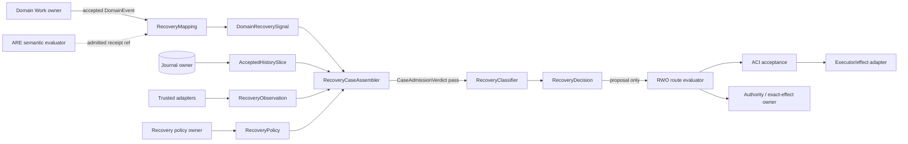

# Stage 06 — Invoke Design: Exact RWO Recovery Model

## Invoke Result

- Mode: `design`
- Spell: `invoke`
- Canonical ID: `invoke`
- Scope: library capability authoring a target-local candidate architecture
- Phase status: `pass`
- Mode contract: `.agents/skills/invoke/design.md`
- Outputs: this architecture bundle; `06-glossary-consistency.md`;
  `06-implementation-layering-seed.md`; `06-design-transport.md`
- Design views: context, high-level structure, low-level components, workflow
  process, decision flow, dependency/interface
- Design selection receipt: `design-selection/design-selection-result.json`
- Design evidence state: `design-validator-pass`
- Evidence ceiling: deterministic Design selection and authored witness
  contracts; no implementation or runtime behavior
- Plan evidence: `plan-evidence-pending`
- Template/profile selection: DomainSpec architecture bundle plus all eight
  validator-selected concern extensions
- Dispatch techniques: `tournament`, `pareto_gate`, `recomposition_proof`,
  `x_ray`, `component_descriptor`, `entity_component_reference`,
  `system_agnostic_standard`, `local_nuance_coordination`,
  `protected_context_flag`
- Distill validation: `pass`; s05 selected `RecoveryDecisionContract`
- Implementation layering: `stages/06-implementation-layering-seed.md`
- Work-pack: n/a at Design
- Next route: approved adversarial helper, then s07 design review

## Status And Claim Ceiling

This is the exact **candidate design model** produced by the Refine run. It is
not the current RWO implementation, canonical definition set, promoted
ontology, accepted cross-repository schema, runtime binding, effect permission,
or production evidence. Every object below has `authority_effect: none` unless
an existing separately owned receipt is referenced.

## Design Intent

Define one total, deterministic boundary that converts separately owned domain
meaning, structural facts, policy, fences, and accepted history into exactly
one non-authorizing recovery treatment. The model must make identity change
explicit, prevent unsafe effect retries, and preserve the existing split among
domain Work, RWO, Journal, ARE, ACI, authority/effect owners, and adapters.

## Design Selection Evidence

| Artifact | Result |
| --- | --- |
| `design-scope-manifest.json` | closed, digest `f74a625bd16b7c49964a1815fb6a0643d6e07dc9742a839a4b8a239ae38cc06c` |
| `design-denominator-receipt.json` | pass; 18 extracted signals, 25 denominator IDs, no missing/unbound signals; digest `d7524ea6d0075f100f509010389c171eba67b456a31f7398e4dad299dfd8b6c4` |
| `design-selection-result.json` | pass; 8 concerns, fixed point true, pass-one equals pass-two; digest `f042b415d560adea22380e3b2040314f1ebf0be66fefca4f54a2b33b55cd8112` |

Selected outputs are the six-view baseline plus authority/trust,
state/event, persistence/concurrency, failure/compensation,
integration/versioning, quality, security/abuse, and validation contracts.

## 1. Context View



Context rules:

- Domain owns event meaning and mapping.
- Journal owns acceptance and history-cut evidence, not unobserved domain truth.
- RWO owns case assembly rules, lifecycle identity allocation, fences, budgets,
  classification, and scheduling proposals.
- ARE may supply separately admitted semantic evidence; it never supplies a disposition.
- ACI accepts lifecycle/effect intents and owns one integrated journal boundary.
- Exact-effect/authority owners permit protected effects; adapters own attempt/outcome evidence.

## 2. High-Level Structure View

```text
RecoveryDecisionContract@candidate-1
├── Input boundary
│   ├── RecoveryObservation
│   ├── DomainRecoverySignal
│   ├── AcceptedHistorySlice
│   ├── RecoveryPolicy
│   └── AttemptFence / RoundFence
├── RecoveryCaseAssembler
│   ├── CaseAdmissionVerdict
│   └── RecoveryCaseUnion
├── RecoveryClassifier
│   ├── common admission/conflict guards
│   ├── freshness and runtime-resume guards
│   ├── effect-uncertainty guard
│   ├── identity-sameness guards
│   ├── per-case decision tables
│   └── emission/owner/budget guards
└── RecoveryDecision
    ├── RecoveryDisposition
    ├── reason code
    ├── IdentityTransition
    ├── BudgetDebit / FenceExpectation
    ├── required next owner
    └── evidence/version bindings
```

### Selected Alternative

The owner-separated composed model wins the tournament. A kernel-centered flat
case is simpler but admits invalid combinations. A domain-contract-centered
model preserves meaning but improperly selects lifecycle transitions. The
selected composition retains a small RWO decision kernel with explicit
domain/journal/ARE/effect interfaces.

### Rejected Alternatives

- ARE-owned retry judgment — killed: routing becomes reasoning.
- Domain mapping returns a disposition — killed: domain meaning becomes lifecycle scheduling.
- Adapter-local state machines only — rejected: identities, fences, budgets, and replay drift.
- Generic policy DSL — deferred: no current variation justifies an executable meta-language.
- Compensation as rollback — killed: external effects may be irreversible or unknown.

## 3. Low-Level Components View

### 3.1 RecoveryObservation

An immutable reference to an already admitted structural fact:

```yaml
observation_ref: event-or-receipt-id
observation_kind: delivery | attempt-terminal | repeat-decision | runtime-restart | effect-outcome | conflict
source_owner: owner-id
source_digest: sha256
accepted_record_ref: journal-record-id
observed_subject:
  work_run_id: run-id
  node_path: root/path
  round_id: round-id | null
  attempt_id: attempt-id | null
  message_id: message-id | null
  effect_intent_id: effect-id | null
  effect_attempt_id: effect-attempt-id | null
observed_fence: fence-value | null
occurred_at: timestamp
```

The assembler never accepts an unadmitted provider response, projection row,
UI status, or freeform model answer as a RecoveryObservation.

### 3.2 DomainRecoverySignal

```yaml
mapping_ref: domain:recovery-mapping@version
mapping_input_digest: sha256
signal_type: domain-controlled-enum
failure_class: transient | permanent | rework | rejected | canceled | already_satisfied | none
rework_intent: none | requested
compensation_intent: none | requested
semantic_constraints: []
semantic_receipt_ref: admitted-receipt-id | null
evidence_refs: []
signal_digest: sha256
```

The mapping is versioned, total over admitted event types, side-effect-free,
and deterministic in this candidate. Unsupported events return a typed mapping
block; they never receive a permissive default. An admitted ARE receipt may be
one evidence reference. It is not copied, reinterpreted, or used as authority.

### 3.3 AcceptedHistorySlice

```yaml
history_cut_id: cut-id
journal_owner: owner-id
head_sequence: integer
head_digest: sha256
reducer_ref: reducer@version
relevant_record_refs: []
prior_recovery_decision_refs: []
pending_delivery_refs: []
pending_effect_refs: []
budget_counters: {}
current_fences: {}
domain_state_ref: owner-reference | null
```

The optional domain-state reference preserves G1: journal evidence and domain
truth can coexist without the candidate design choosing which is authoritative.

### 3.4 RecoveryPolicy

```yaml
policy_ref: rwo:recovery-policy@version
owner_ref: policy-owner
applies_to_work_ref: work:name@version
case_kinds: []
delivery:
  max_redeliveries: integer
  backoff_ref: schedule@version
  recipient_idempotency_contract_ref: contract | null
execution:
  max_attempts: integer
  retryable_failure_classes: []
  effectful_retry_requires_permit: true
repeat:
  max_rounds: integer
  allowed_signal_types: []
  repeat_edge_ref: graph-edge
  exhaustion_route: stop | compensate | escalate
reconciliation:
  work_ref: work:reconcile@version | null
  owner_ref: owner | null
  max_attempts: integer
compensation:
  work_ref: work:compensate@version | null
  mode: never | immediate | after_exhaustion
deadline_ref: deadline-policy
escalation_owner_ref: owner
policy_digest: sha256
```

Policy is explicit input, not hard-coded domain meaning. A missing required
owner or contract prevents the corresponding disposition.

### 3.5 Shared RecoveryCase Header

```yaml
schema_version: rwo-recovery-case.candidate-1
recovery_case_id: sha256(canonical-case-without-id)
case_kind: conflict | runtime_resume | delivery | execution | repeat | effect
subject:
  work_ref: work:name@version
  root_work_run_id: root-run
  work_run_id: run
  node_path: root/path
  round_id: round | null
  attempt_id: attempt | null
observation_ref: observation-id
history_cut_ref: cut-id
policy_ref: policy-id
domain_signal_ref: signal-id | null
current_fence: fence
observed_fence: fence | null
sameness:
  definition: same | changed | unknown | not_applicable
  normalized_input: same | changed | unknown | not_applicable
  authority_basis: same | changed | unknown | not_applicable
  effect_envelope: same | changed | unknown | not_applicable
assembled_by: recovery-case-assembler@version
case_digest: sha256
```

The `case_kind` comes from the trusted observation kind, never the domain signal.

### 3.6 Closed RecoveryCase Variants

| Case kind | Mandatory variant fields | Structurally forbidden combinations |
| --- | --- | --- |
| `conflict` | conflict type; stable identity; expected/observed digests or contradictory record refs | retryability, repeat intent, effect retry permit |
| `runtime_resume` | restart id; verified history cut; reducer version; pending delivery/effect refs | domain failure class as routing input; new attempt request |
| `delivery` | logical message id/digest/key; `delivery_attempt_id`; acceptance state; recipient idempotency contract; redelivery count | effect outcome without accepted effect attempt |
| `execution` | current Attempt; accepted terminal event; failure class; attempt counter; effectful-binding flag; optional effect-retry-safety ref | nonterminal execution event; repeat edge as attempt retry |
| `repeat` | repeat node/edge; accepted decision-work event; current round; requested-scope digest; round counter | message redelivery as a repeat round |
| `effect` | accepted exact effect intent; effect attempt; outcome state; owner/adapter receipts; optional reconciliation contract | `outcome_unknown` without an attempt-start receipt; semantic result as effect verdict |

Every variant uses a closed schema. Missing mandatory facts block case
admission. Impossible combinations are admitted only as a trusted conflict
observation and become `QUARANTINE_CONFLICT`.

### 3.7 CaseAdmissionVerdict

`CaseAdmissionVerdict = pass | reject | quarantine`.

- `reject`: malformed envelope, unknown case schema/version, unaccepted source,
  missing digest, or cross-run substitution. This is protocol rejection before classification.
- `quarantine`: accepted trusted evidence proves divergent bytes,
  contradictory facts, or an impossible state transition. The assembler emits
  a valid `ConflictCase` for classifier/audit handling.
- `pass`: every required reference, digest, owner, fence shape, and variant
  field is present and internally consistent.

This corrects the Define-stage overbreadth: an unknown contract is rejected
before a RecoveryDecision; it is not silently converted into a quarantine decision.

### 3.8 Closed RecoveryDisposition

```text
DEDUPLICATE
REDELIVER_SAME_MESSAGE
RETRY_NEW_ATTEMPT
REPEAT_NEW_ROUND
REVALIDATE_NEW_RUN
RESUME_FROM_JOURNAL
IGNORE_STALE_FOR_ROUTING
RECONCILE_UNKNOWN_EFFECT
COMPENSATE
QUARANTINE_CONFLICT
STOP_TERMINAL
ESCALATE_OWNER
```

### 3.9 Closed Reason Families

| Disposition | Closed reason codes |
| --- | --- |
| DEDUPLICATE | `IDENTICAL_ACCEPTED_DUPLICATE`, `DECISION_ALREADY_ACCEPTED` |
| REDELIVER_SAME_MESSAGE | `COMMAND_NOT_ACCEPTED`, `COMMAND_ACCEPTANCE_UNKNOWN_IDEMPOTENT` |
| RETRY_NEW_ATTEMPT | `TRANSIENT_EXECUTION_FAILURE`, `KNOWN_EFFECT_FAILURE_WITH_RETRY_PERMIT` |
| REPEAT_NEW_ROUND | `DOMAIN_REWORK_REQUESTED` |
| REVALIDATE_NEW_RUN | `DEFINITION_CHANGED`, `NORMALIZED_INPUT_CHANGED`, `AUTHORITY_BASIS_CHANGED`, `EFFECT_ENVELOPE_CHANGED`, `REPEAT_SCOPE_CHANGED` |
| RESUME_FROM_JOURNAL | `RUNTIME_RESTART_WITH_VALID_HISTORY` |
| IGNORE_STALE_FOR_ROUTING | `OLDER_ATTEMPT_FENCE`, `OLDER_ROUND_FENCE`, `SUPERSEDED_RUN` |
| RECONCILE_UNKNOWN_EFFECT | `EFFECT_OUTCOME_UNKNOWN` |
| COMPENSATE | `DECLARED_IMMEDIATE_COMPENSATION`, `DECLARED_EXHAUSTION_COMPENSATION` |
| QUARANTINE_CONFLICT | `DIVERGENT_IDEMPOTENCY_BYTES`, `CONTRADICTORY_TRUSTED_FACTS`, `IMPOSSIBLE_STATE_TRANSITION` |
| STOP_TERMINAL | `PERMANENT_FAILURE`, `POLICY_DENIED`, `ATTEMPT_EXHAUSTED`, `ROUND_EXHAUSTED`, `DEADLINE_ELAPSED`, `CANCELLATION_TERMINAL`, `ALREADY_SATISFIED` |
| ESCALATE_OWNER | `MISSING_POLICY`, `MISSING_REQUIRED_OWNER`, `MISSING_REQUIRED_EVIDENCE`, `AMBIGUOUS_DOMAIN_MAPPING`, `UNKNOWN_SAMENESS`, `BUDGET_STATE_UNKNOWN`, `RECONCILIATION_UNAVAILABLE`, `RESUME_EVIDENCE_MISSING` |

Unknown reason codes reject; they do not map to `ESCALATE_OWNER` implicitly.

### 3.10 RecoveryDecision

```yaml
schema_version: rwo-recovery-decision.candidate-1
recovery_decision_id: sha256(case_digest + policy_digest + classifier_version)
case_ref: recovery-case-id
case_digest: sha256
policy_ref: policy-id
policy_digest: sha256
mapping_ref: mapping-id | null
mapping_digest: sha256 | null
history_cut_id: cut-id
history_head_digest: sha256
classifier_ref: recovery-classifier@candidate-1
disposition: closed-enum
reason_code: closed-enum-member
identity_transition: structured-transition
budget_debit: {counter: id, expected_value: n, debit: 0|1} | null
fence_expectation: {fence_ref: id, expected_value: value} | null
required_next_owner: owner-id | null
proposed_route_ref: route-or-work-ref | null
authority_effect: none
evidence_refs: []
decision_digest: sha256
```

The classifier creates the decision bytes. The journal/ACI route owner must
compare-and-accept the decision against its expected head, budget, and fence
before the scheduler acts. Classification success is not acceptance.

## 4. Workflow Process View

### 4.1 Normal Flow

```text
1. Accept a structural source fact through its owner boundary.
2. If domain meaning is required, run RecoveryMapping over admitted inputs.
3. Obtain an exact verified history cut, current budgets, and current fences.
4. Resolve the versioned RecoveryPolicy.
5. Assemble the closed case variant and compute the case digest.
6. Run CaseAdmissionVerdict.
7. On pass, classify using the ordered algorithm below.
8. Emit one RecoveryDecision with authority_effect:none.
9. Compare-and-accept it against journal head/budget/fence.
10. Only an accepted decision may enable the ordinary declared route.
11. That route still crosses entry, ACI, authority, exact-effect, and adapter gates applicable to its action.
```

### 4.2 Domain Mapping Flow

```text
accepted DomainEvent
  -> verify event contract/version
  -> resolve RecoveryMapping version
  -> resolve explicit domain-state refs and, if required, admitted ARE receipt
  -> execute pure total mapping
  -> DomainRecoverySignal or mapping block
```

A mapping block forms an `ESCALATE_OWNER` case only when the structural
observation and escalation owner are valid; otherwise case admission rejects.

### 4.3 ARE Interaction Flow

```text
ReasoningEntryVerdict pass
  -> proposed ACI reasoning command
  -> ACI acceptance
  -> verified history cut + admitted observations
  -> bounded ARE evaluation
  -> semantic receipt
  -> artifact/observation admission as required
  -> DomainRecoverySignal references admitted receipt
```

Any non-pass stops at its boundary. ARE never receives or returns a
RecoveryDisposition. Historical ARE replay is not current mapping revalidation.

### 4.4 Decision Acceptance And Concurrency

Decision acceptance is a compare-and-append operation owned by the journal/ACI
boundary:

```text
expected = {history_head_digest, counter_values, fence_values}
actual   = read-current-owner-state()

if actual != expected:
    reject decision as stale
    rebuild RecoveryCase from a new history cut
else:
    append RecoveryDecision once by recovery_decision_id
    atomically debit the selected budget
    atomically allocate/advance identity or fence when required
    expose accepted decision to route evaluator
```

Rebuilding after compare failure is not a retry of the selected work. It is a
new classification over newer accepted facts.

## 5. Decision Flow View

### 5.1 Ordered Classifier

```text
classify(case):
  A. Case must already have CaseAdmissionVerdict=pass.
  B. If identical RecoveryDecision already accepted for case/policy/version:
       DEDUPLICATE(DECISION_ALREADY_ACCEPTED).
  C. If case.kind=conflict:
       QUARANTINE_CONFLICT(closed conflict reason).
  D. If observed fence is older than current fence:
       IGNORE_STALE_FOR_ROUTING(closed stale reason).
  E. If case.kind=runtime_resume:
       valid cut + supported reducer -> RESUME_FROM_JOURNAL;
       missing evidence -> ESCALATE_OWNER;
       contradictory digest -> assembler must have produced ConflictCase.
  F. If case.kind=effect and outcome=unknown:
       complete reconciliation owner/policy/work contract -> RECONCILE_UNKNOWN_EFFECT;
       otherwise -> ESCALATE_OWNER(RECONCILIATION_UNAVAILABLE).
  G. For execution/repeat/effect cases, evaluate required sameness:
       any changed -> REVALIDATE_NEW_RUN with exact changed reason;
       any unknown -> ESCALATE_OWNER(UNKNOWN_SAMENESS).
  H. Apply the case-kind table.
  I. Apply cross-cutting deadline, budget, owner, route, and effect-safety guards.
  J. Emit exactly one decision or fail the classifier contract.
```

Steps C–G are ordered. A later rule cannot override an earlier rule.

### 5.2 DeliveryCase Table

| Condition | Required evidence | Decision |
| --- | --- | --- |
| accepted identical duplicate | accepted record with same message/key/bytes | `DEDUPLICATE(IDENTICAL_ACCEPTED_DUPLICATE)` |
| command not accepted | exact logical envelope; current fence; delivery budget; recipient idempotency contract | `REDELIVER_SAME_MESSAGE(COMMAND_NOT_ACCEPTED)` |
| acceptance unknown | same evidence plus contract proving repeat acceptance converges without a new Work Attempt | `REDELIVER_SAME_MESSAGE(COMMAND_ACCEPTANCE_UNKNOWN_IDEMPOTENT)` |
| terminal deterministic rejection | rejection receipt and policy | `STOP_TERMINAL(POLICY_DENIED)` |
| missing idempotency/acceptance evidence | owner route | `ESCALATE_OWNER(MISSING_REQUIRED_EVIDENCE)` |

Redelivery creates at most a new transport `delivery_attempt_id`. It preserves
the logical message, Work Attempt, WorkRun, round, payload bytes, causation,
authority reference, and idempotency key.

### 5.3 ExecutionCase Table

| Condition | Additional guards | Decision |
| --- | --- | --- |
| transient terminal failure | current fence; same definition/input/authority/effect envelope; deadline open; attempt budget; retryable policy | `RETRY_NEW_ATTEMPT(TRANSIENT_EXECUTION_FAILURE)` |
| transient failure of effectful binding | all above plus effect-owner retry-safety receipt proving known safe posture | `RETRY_NEW_ATTEMPT(KNOWN_EFFECT_FAILURE_WITH_RETRY_PERMIT)` |
| permanent failure with immediate compensation policy | declared compensation Work and owner/authority route | `COMPENSATE(DECLARED_IMMEDIATE_COMPENSATION)` |
| permanent failure without compensation | accepted terminal event | `STOP_TERMINAL(PERMANENT_FAILURE)` |
| cancellation terminal | accepted cancellation-terminal event | `STOP_TERMINAL(CANCELLATION_TERMINAL)` |
| already satisfied/completed | accepted domain terminal evidence | `STOP_TERMINAL(ALREADY_SATISFIED)` |
| transient but attempt budget exhausted | exhaustion route | stop, compensate, or escalate exactly as policy declares |
| nonterminal or ambiguous outcome | named owner | `ESCALATE_OWNER(MISSING_REQUIRED_EVIDENCE)` |

### 5.4 RepeatCase Table

| Condition | Additional guards | Decision |
| --- | --- | --- |
| domain rework requested | current round fence; allowed signal; unchanged requested scope; repeat edge; round budget; deadline | `REPEAT_NEW_ROUND(DOMAIN_REWORK_REQUESTED)` |
| requested scope/input changed | changed sameness proof | `REVALIDATE_NEW_RUN(REPEAT_SCOPE_CHANGED)` |
| round exhausted with compensation route | compensation Work and owner route | `COMPENSATE(DECLARED_EXHAUSTION_COMPENSATION)` |
| round exhausted with stop route | exhaustion record | `STOP_TERMINAL(ROUND_EXHAUSTED)` |
| round exhausted with escalation route | escalation owner | `ESCALATE_OWNER(BUDGET_STATE_UNKNOWN)` only if budget truth is missing; otherwise owner-specific exhaustion reason |
| no rework required | accepted decision-work event | `STOP_TERMINAL(ALREADY_SATISFIED)` |

A new round remains inside the containing WorkRun and creates new child
attempts under the declared repeat edge. It cannot extend topology or reset bounds.

### 5.5 EffectCase Table

| Outcome | Required evidence | Decision |
| --- | --- | --- |
| `unknown` | accepted effect intent + attempt-start receipt | reconciliation route or explicit owner escalation; never automatic retry |
| `succeeded` | adapter outcome receipt accepted by owner | `STOP_TERMINAL(ALREADY_SATISFIED)` |
| `failed_known` and retry safe | adapter failure + exact-effect owner retry-safety receipt + attempt policy | `RETRY_NEW_ATTEMPT(KNOWN_EFFECT_FAILURE_WITH_RETRY_PERMIT)` |
| `failed_known` and compensate | compensation policy/work/authority | `COMPENSATE(...)` |
| `failed_known` permanent | accepted failure evidence | `STOP_TERMINAL(PERMANENT_FAILURE)` |
| missing owner/outcome contract | named owner route | `ESCALATE_OWNER(MISSING_REQUIRED_OWNER)` |

### 5.6 Exhaustion Resolution

Exhaustion is deterministic policy evaluation, not a catch-all retry:

```text
if deadline elapsed: STOP_TERMINAL(DEADLINE_ELAPSED)
else if relevant counter truth missing: ESCALATE_OWNER(BUDGET_STATE_UNKNOWN)
else if counter remaining: continue selected route
else switch exhaustion_route:
  stop       -> STOP_TERMINAL(ATTEMPT_EXHAUSTED | ROUND_EXHAUSTED)
  compensate -> COMPENSATE only with complete Work/owner/authority refs,
                otherwise ESCALATE_OWNER(MISSING_REQUIRED_OWNER)
  escalate   -> ESCALATE_OWNER with configured owner
```

## Identity Transition Matrix

| Disposition | WorkRun | Round | Work Attempt | Logical message | Delivery attempt | Effect intent/attempt |
| --- | --- | --- | --- | --- | --- | --- |
| DEDUPLICATE | preserve | preserve | preserve | preserve | none required | preserve |
| REDELIVER_SAME_MESSAGE | preserve | preserve | preserve | preserve exact bytes/key | new receipt allowed | preserve; no new effect attempt |
| RETRY_NEW_ATTEMPT | preserve | preserve | **new Attempt** | new addressed commands | new | new effect attempt only with owner retry permit |
| REPEAT_NEW_ROUND | preserve containing run | **new round** | new child attempts | new | new | governed independently |
| REVALIDATE_NEW_RUN | **new run proposed** | new after entry | new after entry | new | new | fresh authority/effect envelope admission |
| RESUME_FROM_JOURNAL | preserve recorded identities | preserve | preserve | preserve pending identities | reconciliation may redeliver same message | preserve observed state |
| IGNORE_STALE_FOR_ROUTING | preserve | preserve | preserve | none | none | none |
| RECONCILE_UNKNOWN_EFFECT | preserve original run | preserve | preserve original attempt | no effect command redelivery | none | preserve unknown original; new separately addressed ReconciliationWorkRun |
| COMPENSATE | preserve original history | preserve original | preserve original | new compensation commands | new | new compensation WorkRun/effect intents through fresh gates |
| QUARANTINE_CONFLICT | preserve | preserve | preserve | none | none | none |
| STOP_TERMINAL | preserve | preserve | preserve | none | none | none |
| ESCALATE_OWNER | preserve by default | preserve | preserve | none | none | none; declared review Work is a separate accepted route |

## 6. Dependency And Interface View

| Interface | Producer | Consumer | Contract | Failure posture |
| --- | --- | --- | --- | --- |
| accepted DomainEvent | domain Work/adapter via journal acceptance | RecoveryMapping | versioned event + digest + owner | reject unknown/unaccepted event |
| admitted semantic receipt ref | ARE chain after entry/ACI/admission | RecoveryMapping | immutable admitted reference | mapping block; zero fallback reasoning |
| DomainRecoverySignal | domain mapping owner | CaseAssembler | total versioned mapping result | escalate or reject if absent/ambiguous |
| AcceptedHistorySlice | journal owner | CaseAssembler/classifier | verified cut/head/reducer/budgets/fences | block classification if stale/missing |
| RecoveryPolicy | policy owner | CaseAssembler/classifier | versioned applicability and routes | escalate missing policy |
| CaseAdmissionVerdict | CaseAssembler | classifier | pass/reject/quarantine | only pass or trusted ConflictCase reaches classifier |
| RecoveryDecision | classifier | journal/ACI decision acceptance | digest-bound, authority_effect:none | compare failure rebuilds case |
| accepted RecoveryDecision | journal/ACI | RWO route evaluator | current head/budget/fence | only declared route may fire |
| ReconciliationWork proposal | RWO route evaluator | effect/reconciliation owner | exact original intent/attempt refs | absent owner blocks; no effect retry |
| compensation proposal | RWO route evaluator | ordinary Work entry + effect owners | declared WorkDefinition/authority | no implicit rollback |

### Compatibility Rules

- New case/disposition/reason versions are rejected until explicitly supported.
- A disposition addition is a semantic migration, not a backwards-compatible unknown enum.
- Historical decisions retain original classifier/policy/mapping/reducer versions.
- Replay reuses those versions and makes no mutable/external calls.
- Current revalidation uses current source handles and a new WorkRun.
- Cross-repository ARE/ACI/effect schemas remain documentation-only until their owners accept exact versions and conformance receipts.

## State/Event Extension

### Logical Delivery State

```text
prepared -> published -> accepted
                   \-> rejected
                   \-> acceptance_unknown

accepted + identical repeat -> duplicate_converged
same identity + divergent bytes -> conflict_quarantined
```

### Work Attempt State

```text
allocated -> command_accepted -> running -> terminal
terminal -> no transition
new eligible retry -> allocate a different attempt_id
```

### Repeat State

```text
round_n -> decision_work
decision no-rework -> terminal
decision rework + remaining bound -> round_n+1
decision rework + exhausted -> exhaustion route
```

### Effect State

```text
intent_proposed -> intent_accepted -> attempt_started
attempt_started -> succeeded | failed_known | outcome_unknown
outcome_unknown -> reconciliation_work
reconciliation_work -> succeeded | failed_known | still_unknown
```

There is no direct `outcome_unknown -> effect_retry` transition.

### Recovery Decision State

```text
case_admitted -> decision_computed -> decision_accepted -> route_observed
                    |                     |
                    |                     -> compare failure -> superseded
                    -> identical recompute -> same decision bytes
```

## Persistence And Concurrency Extension

- One journal/ACI owner accepts recovery facts and decisions.
- Classifier execution may be concurrent; decision acceptance is serialized or
  compare-and-append guarded by history head, budget, and fence expectations.
- `recovery_decision_id` makes identical classifications converge.
- A head/fence mismatch never retries the work; it invalidates the decision and rebuilds the case.
- Budget debit and identity/fence allocation occur atomically with decision acceptance.
- Late attempt events remain appended and queryable but cannot change current routing.
- Projection rebuild uses decision records and versions; projections cannot originate decisions.

## Authority And Trust Extension

| Boundary | Pass permits | Pass does not permit |
| --- | --- | --- |
| domain event acceptance | mapping input | recovery disposition or effect |
| reasoning entry | bounded ARE evaluation path | ACI acceptance or routing |
| semantic/artifact admission | reference in domain signal | recovery route or effect |
| RecoveryDecision acceptance | evaluation of one declared route | authority, ACI acceptance, or adapter call |
| ordinary Work entry/authority | addressed command proposal/delivery | effect permission outside envelope |
| exact-effect verdict | proposal of exact effect intent | ACI acceptance or successful attempt |
| ACI effect-intent acceptance | adapter invocation eligibility | known external outcome |
| adapter receipt acceptance | recorded attempt/outcome evidence | universal business truth beyond owner contract |

Every pass is local to its next boundary. No pass is transferable.

## Failure And Compensation Extension

- Lost delivery redelivers the exact logical message; it does not create a Work Attempt.
- Transient execution failure creates a new Work Attempt only with sameness,
  current fence, policy, deadline, and budget evidence.
- Domain rework creates a new bounded-repeat round, not an Attempt retry.
- Changed definition/input/authority/effect envelope invalidates reuse and
  proposes new entry under a new WorkRun.
- Runtime restart rebuilds from the journal before classifying pending cases.
- Unknown external effect creates reconciliation work or owner escalation and
  blocks another effect attempt.
- Compensation is a new declared Work graph with fresh authority; it cannot
  erase or rewrite the original outcome.

## Security And Abuse Extension

| Abuse case | Required control |
| --- | --- |
| replay old retry decision after budget/fence advanced | compare expected head, counters, and fences before acceptance |
| submit different bytes under same idempotency key | quarantine conflict; no route |
| forge current attempt or round | trusted adapter-injected fence and accepted history check |
| substitute policy/mapping/history from another run | bind all IDs/digests into case and decision; cross-run mismatch rejects |
| reset budget by requesting new Attempt identity | atomic decision acceptance and owner-held counters |
| use ARE confidence as retry permission | only typed admitted DomainRecoverySignal enters case; semantic receipt is non-authorizing |
| retry payment after timeout with unknown outcome | unknown-effect guard before sameness/attempt logic; zero effect calls |
| smuggle changed input as same retry | canonical normalized input digest; changed result proposes new run |
| turn compensation into rollback claim | append correlated compensation Work; retain original facts |

## Quality Extension

Required design properties:

- totality: every valid case/policy combination selects one disposition;
- determinism: identical versioned inputs yield byte-identical decisions;
- non-overlap: no decision-table row overlaps a higher-precedence guard;
- completeness: every disposition and reason has a fixture;
- safety: effect-unknown and stale cases produce zero ordinary retry/effect calls;
- explainability: decision cites rule, versions, evidence, identity transition, and next owner;
- replayability: historical decision reconstruction requires no mutable/external call;
- boundedness: delivery/attempt/round/reconciliation budgets and deadlines are explicit.

## Significant Behavior Scenario: `payment.outcome-unknown`

### Stimulus

An accepted payment effect intent `pay-17` reached adapter attempt
`pay-attempt-1`. The provider timed out after the request, and no accepted
succeeded/failed outcome exists.

### Preconditions

- original WorkRun/Attempt/effect identities and exact envelope are pinned;
- adapter attempt-start receipt is accepted;
- outcome state is `unknown`;
- current history cut and fences are verified;
- no claim of provider idempotency or exactly-once effect exists.

### Ordered response

1. Assemble `EffectCase(outcome=unknown)`.
2. Conflict/stale/runtime guards pass.
3. The effect-uncertainty guard runs before sameness or retry eligibility.
4. If reconciliation owner, policy, and Work contract exist, select
   `RECONCILE_UNKNOWN_EFFECT`; otherwise select
   `ESCALATE_OWNER(RECONCILIATION_UNAVAILABLE)`.
5. Accepting the decision may create a separately addressed reconciliation
   WorkRun. It cannot redeliver the payment command or create a new payment attempt.
6. Reconciliation emits an owner-accepted `succeeded`, `failed_known`, or
   `still_unknown` fact.
7. Only a new case over that accepted fact may choose terminal stop,
   compensation, or a permit-backed new Attempt.

### Observable evidence

- zero payment adapter calls between unknown outcome and reconciliation result;
- original effect intent/attempt preserved as unknown;
- recovery decision, owner route, reconciliation WorkRun, and outcome receipt
  have distinct identities and causal links.

### Acceptance owner

Recovery-model validation owner for routing safety; exact-effect and payment
domain owners for real reconciliation/effect semantics.

## Planned Witness Contracts

These are Design contracts, not executed Plan evidence.

| Fixture | Input / violation | Expected result |
| --- | --- | --- |
| `RWF-001` | unaccepted command, exact bytes/key, dedup contract | redeliver same logical message; no new Attempt |
| `RWF-002` | identical already-accepted duplicate | deduplicate; no route |
| `RWF-003` | divergent bytes under same key | quarantine conflict |
| `RWF-004` | terminal transient failure, sameness/current fence/budget | new Attempt; same run/round |
| `RWF-005` | accepted domain rework signal and round budget | new repeat round |
| `RWF-006` | changed authority basis | propose new WorkRun entry; no automatic start |
| `RWF-007` | restart with valid history/reducer | rebuild/resume before ordinary classification |
| `RWF-008` | older attempt fence | retain, zero route |
| `RWF-009` | payment outcome unknown | reconcile/escalate; zero payment retry |
| `RWF-010` | declared compensation with complete owner refs | propose new compensation WorkRun |
| `RWF-011` | exhausted attempt/round budget | exact exhaustion route; no retry |
| `RWF-012` | missing policy/owner/evidence | owner escalation or admission reject as specified |
| `RWF-013` | positive ARE semantic receipt without recovery/authority receipts | no direct route/effect |
| `RWF-014` | historical replay | byte-identical decision reconstruction; zero mutable/external calls |
| `RWF-015` | two concurrent classifiers from same head | one decision acceptance; loser rebuilds, not work retry |
| `RWF-016` | impossible case variant combination | admission reject or trusted ConflictCase; never retry |

## Validator Contracts

| Contract | Target | Required checks |
| --- | --- | --- |
| `RWC-CASE-001` | RecoveryCase schema union | closed variants; required fields; illegal combinations; digest identity |
| `RWC-TABLE-001` | classifier rules | precedence totality, non-overlap, closed enums, deterministic digest |
| `RWC-IDENTITY-001` | IdentityTransition | exact changed/preserved IDs per disposition |
| `RWC-OWNER-001` | owner boundary | missing owner fails closed; authority_effect none |
| `RWC-EFFECT-001` | effect safety | unknown outcome has zero effect retry path |
| `RWC-REPLAY-001` | replay | pinned versions; no mutable/external calls |
| `RWC-CONCURRENCY-001` | decision acceptance | head/budget/fence compare; atomic debit/allocation; stale decision rejected |
| `RWC-DOMAIN-001` | RecoveryMapping | total, versioned, deterministic, no lifecycle/effect authority |

## Concern-To-View Trace

| Concern | Disposition | Accountable owner | Selected output | Primary location |
| --- | --- | --- | --- | --- |
| authority | required | exact-effect-authority-owner | authority/trust | Authority And Trust Extension |
| security | required | security-risk-owner | security/abuse | Security And Abuse Extension |
| state-event | required | rwo-workflow-owner | state/event | State/Event Extension |
| persistence | required | journal-owner | persistence/concurrency | Persistence And Concurrency Extension |
| failure | required | domain-recovery-policy-owner | failure/compensation | Failure And Compensation Extension |
| integration | required | interface-contract-owner | integration/versioning | Dependency And Interface View; Compatibility Rules |
| performance | required | service-owner | quality | Quality Extension |
| validation | required | recovery-model-validation-owner | validation contracts | Planned Witness/Validator Contracts |

## Forbidden Topologies And Inferences

- DomainRecoverySignal directly selects a disposition.
- ARE output directly releases an RWO edge or effect.
- RWO classifier accepts ACI commands or authorizes effects.
- Journal history becomes unobserved domain truth.
- Projection/UI state originates recovery decisions.
- Same-message redelivery creates a new Work Attempt.
- New Work Attempt changes definition, normalized input, authority basis, graph, or effect envelope.
- New round silently extends topology or resets its bound.
- Runtime resume creates a new run/attempt without accepted evidence.
- Unknown effect outcome routes to redelivery or retry.
- Compensation rewrites or erases original facts.
- Parent/child identity transfers tools, evidence, policy, or authority.

## Candidate Ontology Delta

The later Ontology Vault route should consider, without automatic promotion:

- nodes: `RecoveryDecisionContract`, `RecoveryObservation`,
  `DomainRecoverySignal`, `RecoveryMapping`, `AcceptedHistorySlice`,
  `RecoveryPolicy`, `RecoveryCase`, six case variants,
  `CaseAdmissionVerdict`, `RecoveryClassifier`, `RecoveryDisposition`,
  `RecoveryDecision`, `IdentityTransition`, `AttemptFence`,
  `ReconciliationWork`, `ExhaustionRoute`;
- directed relations: mapping produces signal; assembler consumes accepted
  facts; case specializes case kind; classifier classifies case under policy;
  decision selects disposition; decision proposes route; decision preserves or
  changes named identity; reconciliation/compensation specialize Work; owner
  gates bound interfaces;
- new forbidden relations matching the topology list above;
- all nodes/relations `authority_effect:none`, source-bound to this candidate
  design and later owner decisions.

Do not add the twelve reason codes as individual ontology nodes unless an
ontology owner proves they need graph addressability rather than enum values.

## Design Decisions

1. Use a closed discriminated case union, not a flat optional-field object.
2. Separate case admission from classification.
3. Use one staged classifier with common guards and per-kind tables.
4. Preserve twelve dispositions because their identity/routing effects differ.
5. Keep reason codes closed but subordinate to dispositions.
6. Make decision acceptance compare-and-append against head, budget, and fence.
7. Treat changed identity basis as a new-run proposal, never authorization.
8. Make effect uncertainty a higher-priority guard than ordinary retry logic.
9. Keep cancellation requests in the existing Work protocol; only accepted
   cancellation terminal facts enter ExecutionCase.
10. Keep ontology/runtime mutation outside Design.

## Open Owner Decisions

- Which owner defines the accepted journal/domain reconciliation contract?
- Which owner publishes `RecoveryPolicy` for each WorkDefinition?
- Which owner accepts reconciliation Work definitions and provider outcome contracts?
- Which exact-effect owner issues retry-safety receipts for known failed effects?
- Which owner accepts the cross-repository DomainRecoverySignal/ARE/ACI schemas?
- Which later route promotes candidate identifiers and dispositions, if any?

The design remains executable as a candidate specification because absent
answers route to explicit escalation/block states. They block real integration.

## Dispatch Technique Trace

| Technique | Design effect |
| --- | --- |
| tournament | compared kernel-centered, domain-centered, and owner-separated models |
| pareto_gate | selected the model with determinism, owner safety, implementation clarity, and current-source fit |
| recomposition_proof | showed the contract feeds ordinary RWO routing without replacing owner boundaries |
| x_ray | exposed all identities, state families, transitions, interfaces, and hidden acceptance step |
| component_descriptor | each low-level component has responsibility and contract |
| entity_component_reference | case/decision objects reference owner-held evidence instead of copying authority |
| system_agnostic_standard | model does not depend on a particular broker, provider, or ARE implementation |
| local_nuance_coordination | RWO, current orchestrator/ACI, and ARE remain distinct owner surfaces |
| protected_context_flag | private bridge informs boundaries but is not copied as authority or implementation proof |

Skipped: UX, migration, rollout, and data-lifecycle extensions. The closed
manifest contains no natural-person/rendered-surface, deployment, stored-format
migration, or data-sink signal selecting them.

## Readiness

`pass` for Design authoring and deterministic selection. This allows the
Refine route to proceed to independent adversarial review and Plan authoring.
It does not authorize implementation. Plan begins at `plan-evidence-pending`
and must produce layering, work-pack, SWUs, validation strategy, and automatic
Distill validation.

