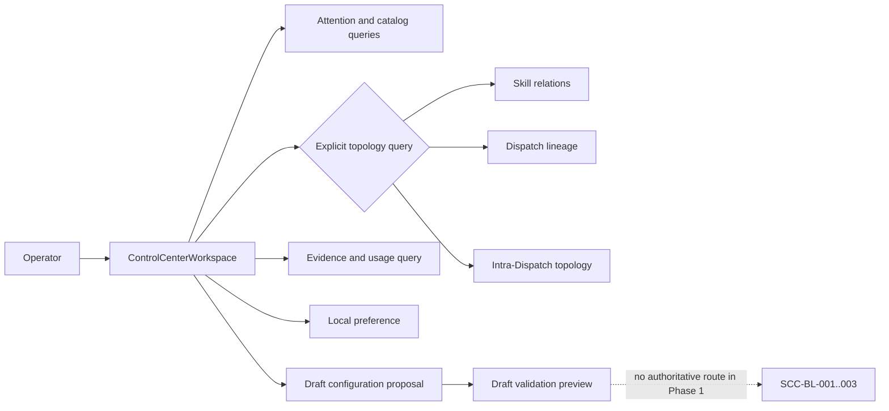

# Skill & Dispatch Control Center

**Status:** Draft for Phase 1 implementation  
**Version:** 0.1.0  
**Owner:** @VictorBoscaro  
**Scope authority:** [Phase 1 scope decision](../../decisions/skill-control-center-phase-1-scope.md)  
**Discovery authority:** [Control Center discovery v0.3.0](discovery/control-center.md)

## What This Module Owns

The Skill & Dispatch Control Center owns a task-led, read-only operator workspace over skills,
Dispatches, their separately governed topology projections, and bounded usage evidence. In Phase 1
it may persist user-local preferences and proposed configuration drafts, but it never changes or
claims to have changed authoritative configuration.

The module owns presentation-safe read models and deterministic query semantics. It does not own
the Dispatch ledger, skill source files, telemetry producers, configuration authority, apply,
retry, reconciliation, receipt acceptance, or statistical promotion of a UI variant.

## Module Map

## Capabilities

| Capability | What | Key Aspects | Phase 1 boundary | Authority |
|---|---|---|---|---|
| Operational orientation | Shows attention, source health, scope and safe next actions before topology. | `GetAttentionQueue`, `AttentionProjection`, task-led workspace | Read-only | [Task-led landing](discovery/control-center.md#task-led-landing) |
| Catalog inspection | Finds and inspects skills and Dispatches without changing the active view on selection. | `SearchCatalog`, `GetObjectDetail`, `StableSelection` | Read-only | [Explicit transitions](discovery/control-center.md#explicit-transitions) |
| Topology inspection | Answers bounded relational questions against exactly one owned model. | `GetTopology`, `FindPath`, topology projections, `TopologyModel` | Read-only | [Separate models](discovery/control-center.md#4-separate-topology-read-models), [path contract](discovery/control-center.md#6-deterministic-path-query-contract) |
| Evidence inspection | Shows evidence class, completeness, freshness, coverage and observed-use lower bounds. | `GetUsageEvidence`, `EvidenceAnswer` | Read-only | [Evidence contract](discovery/control-center.md#5-evidence-and-observation-contract) |
| Safe preparation | Saves local preferences and prepares, diffs and validates a non-authoritative draft. | `SaveLocalPreference`, `ChangeProposal`, `DraftLifecycle` | Local/draft-only | [Phase 1 decision](../../decisions/skill-control-center-phase-1-scope.md#decision) |
| Variant comparison | Provides exactly three structurally distinct shells over one semantic contract. | `VariantContract`, shared test IDs | Descriptive comparison only | [Three variants](discovery/control-center.md#exactly-three-equivalent-variants), [Phase 1 decision](../../decisions/skill-control-center-phase-1-scope.md#decision) |

### Operational Orientation

The first meaningful workspace answers what requires attention in the selected scope. An empty
queue means only that the query returned no actionable item for that scope; it does not assert that
the system has no work.

| Aspect | Concept | Summary |
|---|---|---|
| Query | `GetAttentionQueue` | Returns prioritized attention items with evidence and a safe next action. |
| Interface | `ControlCenterReadAPI` | Exposes versioned read-only responses and typed degraded states. |
| UI | `ControlCenterWorkspace` | Places attention, scope and health before catalogs and topology. |

### Catalog and Topology Inspection

Selection changes `StableSelection` and its URL representation only. Detail and topology require
explicit actions, and `back` restores the prior view, filters, scroll, selection and path query.

| Aspect | Concept | Summary |
|---|---|---|
| Query | `SearchCatalog` | Searches skills and Dispatches with visible match fields and scope. |
| Query | `GetObjectDetail` | Returns one selected skill or Dispatch with evidence and available actions. |
| Query | `GetTopology` | Returns one focal topology model and its semantic list/table mirror. |
| Query | `FindPath` | Returns deterministic bounded paths or one typed non-success state. |
| State | `WorkspaceNavigation` | Defines explicit select/detail/topology/back/deep-link transitions. |

### Evidence Inspection

Evidence is always returned at one `(claim, scope, [start,end))` grain. Proof class,
completeness and freshness are independent and source facts remain inspectable.

| Aspect | Concept | Summary |
|---|---|---|
| Query | `GetUsageEvidence` | Returns accepted logical invocations, attempts and source coverage separately. |
| Rule | `EvidenceRules` | Prevents unknown or partial evidence from becoming zero or exhaustive usage. |
| Value Object | `EvidenceResponse` | Carries window, counts, source facts and qualifiers. |

### Safe Preparation

Phase 1 can save a local preference and create, edit, diff and validate a proposal. Validation is a
preview over an explicit versioned rule set; it grants no capability and produces no authoritative
receipt.

| Aspect | Concept | Summary |
|---|---|---|
| State | `DraftLifecycle` | `clean -> draft-dirty -> draft-saved -> validating -> valid|invalid`. |
| Interface | `LocalPreferencePort` / `DraftPort` | Browser/local persistence boundary with no authoritative mutation binding. |
| UI | `DraftInspector` | Shows target, base, diff, origins, validation and an unavailable apply route. |

## Domain Concepts

| Concept | Type | Key Constraints | Authority |
|---|---|---|---|
| `StableSelection` | Value Object | URL-restorable; selection alone never changes `view`. | [SCD-02](discovery/control-center.md#explicit-transitions) |
| `TopologyModel` | Enum / Type | Exactly `skill-relations`, `dispatch-lineage`, `intra-dispatch`. | [SCD-03](discovery/control-center.md#4-separate-topology-read-models) |
| `SkillRelation` | Value Object | `explicit_path` is strong declared evidence; `named_reference` is a weak mention. | [Skill semantics](discovery/control-center.md#skill-relation-semantics) |
| `DispatchLineageProjection` | Value Object | Parentage derives only from `parent_dispatch_id`; the transport shape is presentation-neutral. | [Dispatch lineage](discovery/control-center.md#dispatch-lineage-semantics) |
| `IntraDispatchProjection` | Value Object | Groups are scoped by `dispatch_id`; edges retain declared direction/type. | [Intra-Dispatch](discovery/control-center.md#intra-dispatch-semantics) |
| `EvidenceClassSet` | Value Object | Positive subset or singleton `unknown-or-unavailable`, never both. | [SCD-05](discovery/control-center.md#5-evidence-and-observation-contract) |
| `EvidenceCompleteness` | Enum / Type | `complete`, `partial`, `unavailable`; independent of freshness. | [SCD-05](discovery/control-center.md#5-evidence-and-observation-contract) |
| `FreshnessState` | Enum / Type | `fresh`, `stale`, `unknown`; aggregate precedence `unknown > stale > fresh`. | [SCD-06](discovery/control-center.md#window-coverage-and-freshness) |
| `ObservationEnvelope` | Event | Delivery, logical invocation and attempt identities are distinct. | [Envelope contract](discovery/control-center.md#envelope-identity-and-retry) |
| `PathResult` | Value Object | One closed state with deterministic path/edge ordering and limits. | [SCD-08](discovery/control-center.md#6-deterministic-path-query-contract) |
| `ChangeProposal` | Entity | Non-authoritative versioned draft with target, base, diff and validation. | [Phase 1 decision](../../decisions/skill-control-center-phase-1-scope.md#decision) |
| `VariantContract` | Interface | Exactly three shells share semantics, fixtures, actions, states and test IDs. | [SCD-11](discovery/control-center.md#exactly-three-equivalent-variants) |
| `ValidationEvidenceBundle` | Value Object | Binds tests and screenshots to exact source/backend/frontend revisions. | [SCD-15](discovery/control-center.md#9-delivery-order-and-final-validation-boundary) |

## Concept Registry

| Concept | ID | Type |
|---|---|---|
| ControlCenterWorkspace | `ui.skill-control-center.ControlCenterWorkspace` | Page |
| AttentionProjection | `skill-control-center.AttentionProjection` | Value Object |
| StableSelection | `skill-control-center.StableSelection` | Value Object |
| TopologyModel | `skill-control-center.TopologyModel` | Enum / Type |
| SkillRelation | `skill-control-center.SkillRelation` | Value Object |
| DispatchLineageProjection | `skill-control-center.DispatchLineageProjection` | Value Object |
| IntraDispatchProjection | `skill-control-center.IntraDispatchProjection` | Value Object |
| EvidenceClassSet | `skill-control-center.EvidenceClassSet` | Value Object |
| EvidenceCompleteness | `skill-control-center.EvidenceCompleteness` | Enum / Type |
| FreshnessState | `skill-control-center.FreshnessState` | Enum / Type |
| ObservationEnvelope | `skill-control-center.ObservationEnvelope` | Event |
| SearchCatalog | `skill-control-center.SearchCatalog` | Query |
| GetAttentionQueue | `skill-control-center.GetAttentionQueue` | Query |
| GetObjectDetail | `skill-control-center.GetObjectDetail` | Query |
| GetTopology | `skill-control-center.GetTopology` | Query |
| FindPath | `skill-control-center.FindPath` | Query |
| GetUsageEvidence | `skill-control-center.GetUsageEvidence` | Query |
| ChangeProposal | `skill-control-center.ChangeProposal` | Entity |
| PathResult | `skill-control-center.PathResult` | Value Object |
| EvidenceAnswer | `skill-control-center.EvidenceAnswer` | Value Object |
| EvidenceRules | `skill-control-center.EvidenceRules` | Rule |
| EvidenceResponse | `skill-control-center.EvidenceResponse` | Value Object |
| SaveLocalPreference | `skill-control-center.SaveLocalPreference` | Operation |
| SaveChangeProposal | `skill-control-center.SaveChangeProposal` | Operation |
| ValidateChangeProposal | `skill-control-center.ValidateChangeProposal` | Operation |
| WorkspaceNavigation | `skill-control-center.WorkspaceNavigation` | State Machine |
| DraftLifecycle | `skill-control-center.DraftLifecycle` | State Machine |
| ControlCenterReadAPI | `skill-control-center.ControlCenterReadAPI` | Interface |
| LocalPreferencePort | `skill-control-center.LocalPreferencePort` | Interface |
| DraftPort | `skill-control-center.DraftPort` | Interface |
| VariantContract | `skill-control-center.VariantContract` | Interface |
| ValidationEvidenceBundle | `skill-control-center.ValidationEvidenceBundle` | Value Object |
| AttentionQueuePanel | `ui.skill-control-center.AttentionQueuePanel` | Component |
| AttentionQueue | `ui.skill-control-center.AttentionQueue` | View Model |
| CatalogWorkspace | `ui.skill-control-center.CatalogWorkspace` | Component |
| TopologyWorkspace | `ui.skill-control-center.TopologyWorkspace` | Component |
| DispatchLineage | `ui.skill-control-center.DispatchLineage` | View Model |
| IntraDispatchTopology | `ui.skill-control-center.IntraDispatchTopology` | View Model |
| DraftInspector | `ui.skill-control-center.DraftInspector` | Component |
| DraftStatusIndicator | `ui.skill-control-center.DraftStatusIndicator` | State Indicator |
| useCatalog | `ui.skill-control-center.useCatalog` | Hook |
| CatalogReadBinding | `ui.skill-control-center.CatalogReadBinding` | Binding |
| useTopology | `ui.skill-control-center.useTopology` | Hook |
| TopologyReadBinding | `ui.skill-control-center.TopologyReadBinding` | Binding |

## Feature Concept Graph

| From | Edge | To | Evidence | Notes |
|---|---|---|---|---|
| `skill-control-center.ControlCenterReadAPI` | exposes | `skill-control-center.GetAttentionQueue` | [Discovery §3](discovery/control-center.md#task-led-landing) | Read-only |
| `skill-control-center.ControlCenterReadAPI` | exposes | `skill-control-center.SearchCatalog` | [Discovery §3](discovery/control-center.md#task-led-landing) | Read-only |
| `skill-control-center.ControlCenterReadAPI` | exposes | `skill-control-center.GetObjectDetail` | [Discovery §3](discovery/control-center.md#explicit-transitions) | Read-only |
| `skill-control-center.ControlCenterReadAPI` | exposes | `skill-control-center.GetTopology` | [Discovery §4](discovery/control-center.md#4-separate-topology-read-models) | One model per query |
| `skill-control-center.ControlCenterReadAPI` | exposes | `skill-control-center.FindPath` | [Discovery §6](discovery/control-center.md#6-deterministic-path-query-contract) | Safe read-only POST |
| `skill-control-center.ControlCenterReadAPI` | exposes | `skill-control-center.GetUsageEvidence` | [Discovery §5](discovery/control-center.md#5-evidence-and-observation-contract) | Coverage-bearing |
| `skill-control-center.LocalPreferencePort` | exposes | `skill-control-center.SaveLocalPreference` | [Phase 1 decision](../../decisions/skill-control-center-phase-1-scope.md#decision) | User-local only |
| `skill-control-center.DraftPort` | exposes | `skill-control-center.SaveChangeProposal` | [Phase 1 decision](../../decisions/skill-control-center-phase-1-scope.md#decision) | Proposal only |
| `skill-control-center.DraftPort` | exposes | `skill-control-center.ValidateChangeProposal` | [Phase 1 decision](../../decisions/skill-control-center-phase-1-scope.md#decision) | Preview only |
| `ui.skill-control-center.ControlCenterWorkspace` | renders | `ui.skill-control-center.AttentionQueuePanel` | [Discovery §3](discovery/control-center.md#task-led-landing) | Task-led first paint |
| `ui.skill-control-center.ControlCenterWorkspace` | renders | `ui.skill-control-center.CatalogWorkspace` | [Discovery §3](discovery/control-center.md#task-led-landing) | Shared semantics |
| `ui.skill-control-center.CatalogWorkspace` | consumes | `ui.skill-control-center.useCatalog` | [Discovery §3](discovery/control-center.md#required-operator-answers) | Search and filters |
| `ui.skill-control-center.CatalogReadBinding` | fetches | `skill-control-center.SearchCatalog` | [Discovery §3](discovery/control-center.md#required-operator-answers) | Versioned binding consumed by the hook implementation |
| `ui.skill-control-center.TopologyWorkspace` | consumes | `ui.skill-control-center.useTopology` | [Discovery §3](discovery/control-center.md#explicit-transitions) | Explicit activation |
| `ui.skill-control-center.TopologyReadBinding` | fetches | `skill-control-center.GetTopology` | [Discovery §4](discovery/control-center.md#4-separate-topology-read-models) | Semantic mirror required |
| `ui.skill-control-center.DraftStatusIndicator` | reflects | `skill-control-center.DraftLifecycle` | [Scope decision](../../decisions/skill-control-center-phase-1-scope.md#decision) | Never “applied” |

## Formal Rules and Invariants

| ID | Rule | Formal / executable meaning | Authority |
|---|---|---|---|
| SCC-R-001 | Selection does not navigate. | `select(x): next.view = current.view` | [SCD-02](discovery/control-center.md#explicit-transitions) |
| SCC-R-002 | One topology model per query. | `query.model in TopologyModel && count(query.models)=1` | [SCD-03](discovery/control-center.md#4-separate-topology-read-models) |
| SCC-R-003 | Weak mentions are not calls. | `edge.kind=named_reference => label=mention && strength=weak` | [Skill semantics](discovery/control-center.md#skill-relation-semantics) |
| SCC-R-004 | Unknown excludes positive evidence. | `unknown in E => E={unknown}` | [SCD-05](discovery/control-center.md#5-evidence-and-observation-contract) |
| SCC-R-005 | Zero usage requires complete observed coverage. | `count=0 => observed in E && completeness=complete && complete_window_coverage` | [SCD-06](discovery/control-center.md#window-coverage-and-freshness) |
| SCC-R-006 | Partial observations are lower bounds. | `observed && partial => exhaustive=false` | [SCD-05](discovery/control-center.md#5-evidence-and-observation-contract) |
| SCC-R-007 | Freshness does not alter proof class. | `reduceFreshness(sources)` has no write to `EvidenceClassSet` | [SCD-06](discovery/control-center.md#window-coverage-and-freshness) |
| SCC-R-008 | Path response is deterministic. | Sort by path length, then lexical edge-identity tuple sequence. | [SCD-08](discovery/control-center.md#6-deterministic-path-query-contract) |
| SCC-R-009 | Incomplete or failed traversal never returns `query_state=no-path`. Discovery outcomes `truncated|error` are abstract response outcomes refined here into envelope and query levels. | `partial_source => query_state ∈ {truncated, absent}; domain_error => result_state=error && query_state=error; transport_or_protocol_error => result_state=error && data=absent && query_state=absent` | [SCD-08](discovery/control-center.md#6-deterministic-path-query-contract), [query state mapping](queries.md#state-mapping) |
| SCC-R-010 | Phase 1 has no authoritative mutation. | No route, binding or enabled control for apply/retry/reconcile; no `applied` claim. | [Scope decision](../../decisions/skill-control-center-phase-1-scope.md#decision) |
| SCC-R-011 | Draft validation is non-authoritative. | `validation_result.authoritative=false` and no receipt/revision mutation | [Scope decision](../../decisions/skill-control-center-phase-1-scope.md#assumptions) |
| SCC-R-012 | Exactly three equivalent variants. | `variants={A,B,C}` and shared contract/test IDs are equal. | [SCD-11](discovery/control-center.md#exactly-three-equivalent-variants) |
| SCC-R-013 | Benchmark is descriptive. | Benchmark output cannot set winner, promotion or acceptance state. | [Scope decision](../../decisions/skill-control-center-phase-1-scope.md#decision) |
| SCC-R-014 | Successful local saves advance exactly one local revision. | `result_revision = expected_revision + 1` | [AD-005](architecture.md#ad-005) |
| SCC-R-015 | Retryable local failures preserve input; terminal validation failures need not. | `retryable(error) => input_retained=true` | [AD-006](architecture.md#ad-006) |
| SCC-R-016 | Local operation results use the closed codes defined by the operation aspect. | `result.code ∈ operations.md declared codes` | [AD-007](architecture.md#ad-007) |

## Fixture Contract

| Fixture ID | Required contents | Purpose | Authority |
|---|---|---|---|
| `FX-SKILL-TOPOLOGY-v1` | Exactly 70 skill nodes, 262 typed edges, 15 `explicit_path`, 247 `named_reference`, source digest. | Skill graph and path determinism | [SCD-13](discovery/control-center.md#separate-scale-fixtures-and-performance) |
| `FX-DISPATCH-CATALOG-v1` | Exactly 700 rows, including at least one valid root/child chain, unresolved parent, legacy row, orphan close, pending/open/closed row and intra-Dispatch topology. | Catalog, lineage, degradation and scale | [SCD-13](discovery/control-center.md#separate-scale-fixtures-and-performance) |
| `FX-EVIDENCE-MIXED-v1` | Complete, partial, unavailable, fresh, stale and unknown source partitions plus dedupe/retry/conflict records. | Evidence algebra | [SCD-05/06](discovery/control-center.md#5-evidence-and-observation-contract) |
| `FX-DRAFT-v1` | Stable target/base, explicit diff, effective values/origins, valid and invalid previews, route unavailable. | Draft-only UI | [Scope decision](../../decisions/skill-control-center-phase-1-scope.md#decision) |
| `FX-INTERFACE-BOUNDARY-v1` | Complete and missing `host_id`, `auth_contract_id`, and `route_owner_id` bindings with a safe recovery explanation. | IF-I5 publication/unavailability behavior | [IF-I5](interfaces.md#interface-invariants) |

Every fixture has `fixture_id`, `schema_version`, `source_revision`, `generated_at_utc` and
`sha256`. The implementation must commit a `fixtures/manifest.json` whose non-null expected digest
for each fixture is `lowercase sha256(RFC8785_JCS(fixture JSON excluding its sha256 member))`.
Contract tests load that manifest, recompute each digest and fail closed on a missing entry,
unrecognized schema or mismatch. The checked-in manifest, not prose or runtime discovery, is the
comparison authority.

## Phase 1 Acceptance Boundary

Phase 1 is ready for implementation only when:

| Gate | Required condition | Authority |
|---|---|---|
| API | Read interfaces and all typed error/degraded states are frozen in the Phase 1 interface aspect. | [SCD-15](discovery/control-center.md#9-delivery-order-and-final-validation-boundary) |
| Query | Ordering, evidence algebra and path rules are executable in the query aspect. | [SCD-05..08](discovery/control-center.md#5-evidence-and-observation-contract) |
| Backend-first | Backend contract tests pass before any of the three frontends is accepted. | [SCD-15](discovery/control-center.md#9-delivery-order-and-final-validation-boundary) |
| Equivalence | Variants A, B and C implement identical semantic actions, fixtures, states and test IDs. | [SCD-11](discovery/control-center.md#exactly-three-equivalent-variants) |
| Evidence | Functional, accessibility, performance and screenshot evidence is revision-bound. | [SCD-14/15](discovery/control-center.md#wcag-22-aa-and-manual-matrix) |
| Safety | No control or copy implies authoritative apply, retry, reconciliation, receipt acceptance or variant promotion. | [Phase 1 decision](../../decisions/skill-control-center-phase-1-scope.md#decision) |

## Deferred and Blocked Work

| Boundary | Status | Required backlog |
|---|---|---|
| Authoritative apply, terminal fencing and late-append safety | BLOCKED | [SCC-BL-001](BACKLOG.md#scc-bl-001--terminal-operation-fencing) |
| Receipt/idempotency reconciliation and terminal failure proof | BLOCKED | [SCC-BL-002](BACKLOG.md#scc-bl-002--reconciliation-and-receipt-lookup) |
| Conflict recovery and revise/revalidate authoritative route | BLOCKED | [SCC-BL-003](BACKLOG.md#scc-bl-003--conflict-recovery-diagram) |
| Action-efficiency acceptance score | DEFERRED | [SCC-BL-004](BACKLOG.md#scc-bl-004--valid-action-efficiency-score) |
| Production-only absolute benchmark acceptance | DEFERRED | [SCC-BL-005](BACKLOG.md#scc-bl-005--production-only-absolute-acceptance) |
| Statistical estimability/convergence gate | DEFERRED | [SCC-BL-006](BACKLOG.md#scc-bl-006--estimability-and-convergence) |
| Assistance taxonomy | DEFERRED | [SCC-BL-007](BACKLOG.md#scc-bl-007--assistance-taxonomy) |
| Withdrawal and worst-case population rules | DEFERRED | [SCC-BL-008](BACKLOG.md#scc-bl-008--withdrawal-and-worst-case-population) |

## Aspect Docs

[Architecture](architecture.md) is the validated architecture companion,
[Glossary](glossary.md) defines the canonical feature language, and
[Operations](operations.md) defines the local-only mutations.
[Queries](queries.md), [Interfaces](interfaces.md), [States](states.md),
[UI](UI-SPEC.md), and [Tests](TEST-SPEC.md) define the remaining Phase 1 contracts.

## Cross-Feature Dependencies

| Capability | Depends On | Via | Why | Authority |
|---|---|---|---|---|
| Dispatch catalog and lineage | Dispatch ledger/read contract | Read adapter | Preserve row identity, partial warnings and `parent_dispatch_id` authority. | [Dispatch lineage](discovery/control-center.md#dispatch-lineage-semantics) |
| Usage evidence | Configured observation sources | Read adapter | Produce evidence without claiming unavailable telemetry. | [Evidence contract](discovery/control-center.md#5-evidence-and-observation-contract) |
| Skill relations | Versioned skill extraction snapshot | Read adapter | Preserve source path, extractor version and edge evidence. | [Skill semantics](discovery/control-center.md#skill-relation-semantics) |
| Draft validation preview | Local draft/validator boundary | Local port | Keep proposals separate from authoritative configuration. | [Phase 1 decision](../../decisions/skill-control-center-phase-1-scope.md#decision) |

## Produces For

| Consumer | Consumes Capability | Via | What | Authority |
|---|---|---|---|---|
| Variants A, B and C | All read capabilities | `ControlCenterReadAPI` | Identical semantic responses and states | [SCD-11](discovery/control-center.md#exactly-three-equivalent-variants) |
| Validation harness | Variant comparison | Fixtures and stable test IDs | Revision-bound conformance evidence | [SCD-15](discovery/control-center.md#9-delivery-order-and-final-validation-boundary) |
| Future authority work | Safe preparation | Draft export only | Proposal input; never an approval or receipt | [Phase 1 decision](../../decisions/skill-control-center-phase-1-scope.md#decision) |

## References

- [Discovery v0.3.0](discovery/control-center.md)
- [Phase 1 scope decision](../../decisions/skill-control-center-phase-1-scope.md)
- [Deferred backlog](BACKLOG.md)
- [DomainSpec taxonomy](../../../domainspec/TAXONOMY.md)
- [DomainSpec relationships](../../../domainspec/RELATIONSHIPS.md)
