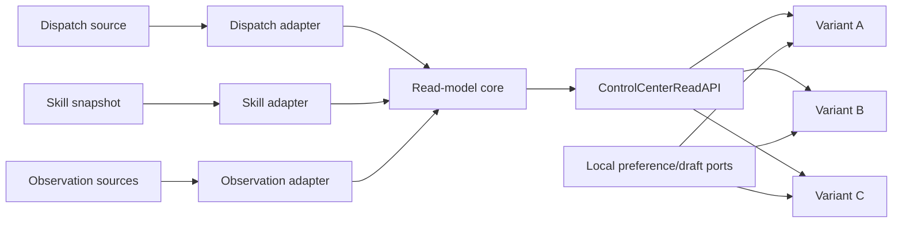
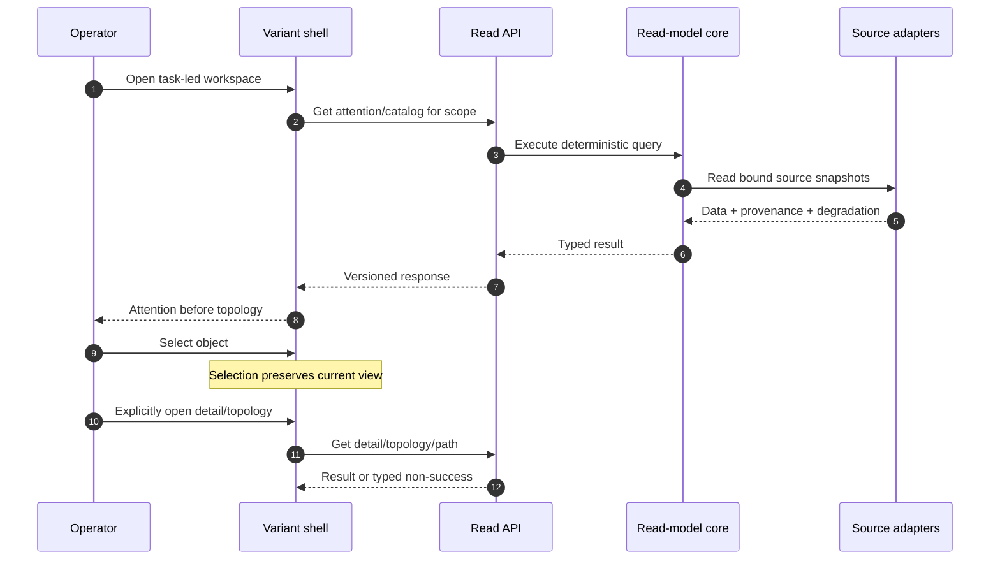

# Skill & Dispatch Control Center Architecture

This companion to [SPEC.md](SPEC.md) defines a backend-first, read-only/draft-only Phase 1.

## Architecture Intent

Provide one deterministic read contract for attention, catalogs, three isolated topology models,
evidence and drafts, then let exactly three frontend shells consume it without reconstructing
lineage, evidence, authority or path semantics.

## Scope Boundary

Owned: source adapters, normalized read models, evidence/path calculations, read interfaces,
user-local preferences, non-authoritative drafts and shared frontend semantics.

Excluded: Dispatch ledger writes, skill-source writes, telemetry production, apply, approval-to-
apply, retry, reconciliation, accepted receipts and benchmark-based promotion. The exclusions are
binding under the [Phase 1 decision](../../decisions/skill-control-center-phase-1-scope.md#decision).

## Source Contracts

| Contract ID | Source | Required | Notes |
|---|---|---|---|
| SC-001 | [SPEC.md](SPEC.md) | yes | Feature concepts, rules and boundary |
| SC-002 | [Discovery v0.3.0](discovery/control-center.md) | yes | SCD-01..15 and read-model semantics |
| SC-003 | [Phase 1 decision](../../decisions/skill-control-center-phase-1-scope.md) | yes | Later authority that narrows SCD-09/10 and SCD-12 |
| SC-004 | [BACKLOG](BACKLOG.md) | yes | Authoritative apply and benchmark-gate blockers |
| SC-005 | `experiments/skill-relationship-graph/graph.json` | fixture only | Current extraction witness, not runtime authority |

## Design Goals and Non-Goals

| Type | Item | Why |
|---|---|---|
| Goal | Deterministic backend answers | Prevent three frontend interpretations |
| Goal | Explain proof, freshness and partiality | Prevent unknown from becoming zero |
| Goal | Preserve source ownership | Avoid invented Dispatch/skill/telemetry authority |
| Goal | Keep variants semantically equivalent | Make structural comparison meaningful |
| Non-goal | Authoritative configuration mutation | Blocked by SCC-BL-001..003 |
| Non-goal | Choose a winning variant statistically | Deferred by SCC-BL-004..008 |
| Non-goal | Merge topology models | No governed cross-model identity exists |

## View 1: Context View

| Actor or System | Relationship to Feature | Contract Source |
|---|---|---|
| Operator | Reads attention, catalogs, evidence and topology; manages local drafts | [SPEC capabilities](SPEC.md#capabilities) |
| Dispatch ledger/reader | Produces Dispatch rows, pending state and parent IDs | [Discovery §4](discovery/control-center.md#dispatch-lineage-semantics) |
| Skill extraction snapshot | Produces skill nodes and evidence-bearing relations | [Discovery §4](discovery/control-center.md#skill-relation-semantics) |
| Observation sources | Produce accepted usage envelopes and ingest facts | [Discovery §5](discovery/control-center.md#5-evidence-and-observation-contract) |
| Browser-local store | Persists preferences and draft proposals only | [Phase 1 decision](../../decisions/skill-control-center-phase-1-scope.md#assumptions) |
| Validation harness | Consumes fixtures, APIs and three shells | [Discovery §9](discovery/control-center.md#9-delivery-order-and-final-validation-boundary) |

## View 2: High-Level Structure View

| Component | Primary Contracts | Responsibility |
|---|---|---|
| Source adapters | SC-002, SC-005 | Validate source revision/schema and preserve provenance |
| Read-model core | [SPEC rules](SPEC.md#formal-rules-and-invariants) | Normalize presentation-neutral catalog, topology, evidence and path query outputs |
| ControlCenterReadAPI | [SPEC concept graph](SPEC.md#feature-concept-graph) | Return versioned typed responses without mutation |
| Local preference/draft ports | [Scope decision](../../decisions/skill-control-center-phase-1-scope.md#decision) | Persist only user-local preference and proposal state |
| Variant shells | [Discovery §8](discovery/control-center.md#exactly-three-equivalent-variants) | Render one semantic contract in three structures |
| Validation harness | [Discovery §9](discovery/control-center.md#9-delivery-order-and-final-validation-boundary) | Bind contract/UI/a11y/performance/screenshot evidence to revisions |

## View 3: Low-Level Components View

| Component | Owns | Consumes | Collaboration Rule |
|---|---|---|---|
| DispatchAdapter | normalized Dispatch rows and source diagnostics | Ledger reader | Never infer parent from prefix/time/actor |
| SkillSnapshotAdapter | nodes, typed relation evidence | Versioned extraction snapshot | Reject unbound schema/digest |
| ObservationAdapter | accepted attempts, coverage and freshness facts | Configured sources and SLA registry | Deduplicate before aggregation |
| CatalogProjector | `AttentionProjection` and catalog/detail query outputs | DispatchAdapter, SkillSnapshotAdapter | Preserve stable IDs and partial warnings |
| TopologyProjector | `DispatchLineageProjection`, `IntraDispatchProjection`, skill projection | DispatchAdapter, SkillSnapshotAdapter | Never join models |
| EvidenceProjector | EvidenceAnswer | ObservationAdapter | Proof, completeness and freshness remain independent |
| PathEngine | PathResult | One TopologyProjector result | Deterministic bounded traversal |
| LocalDraftStore | preferences and ChangeProposal | Browser/local persistence | No authoritative side effect |
| VariantAdapter | `ui.*` view models/actions/test IDs | Read API query outputs | Shape `AttentionQueue`, `DispatchLineage` and `IntraDispatchTopology` without changing semantics |
| SaveChangeProposal | local draft mutation | DraftPort | Persist target/base/diff only; transition to `draft-saved` or `save-failed` |
| ValidateChangeProposal | local validation mutation | DraftPort, versioned validation rules | Produce preview only; never capability, approval or receipt |

## View 4: Workflow Process View

| Flow | Happy Path | Failure or Compensation | Contract Source |
|---|---|---|---|
| Load workspace | Scope returns attention and catalog | Retain trustworthy partitions; name failed source | [Discovery §3/5](discovery/control-center.md#task-led-landing) |
| Open topology | Explicit action selects exactly one model | Unsupported/unavailable is typed; no merged fallback | [Discovery §4/6](discovery/control-center.md#4-separate-topology-read-models) |
| Find path | Deterministic bounded path(s) | Partial source gives `truncated`/`error`, never `no-path` | [Discovery §6](discovery/control-center.md#6-deterministic-path-query-contract) |
| Prepare draft | Save target/base/diff then validate preview | Invalid/save-failed retains draft and safe retry | [Phase 1 decision](../../decisions/skill-control-center-phase-1-scope.md#decision) |

No distributed compensation exists in Phase 1 because no authoritative mutation is exposed.

## View 5: Decision Flow View

| Decision Point | Options or Branches | Selection Rule | Outcome |
|---|---|---|---|
| Topology model | skill, Dispatch lineage, intra-Dispatch | Explicit request names exactly one | One isolated projection |
| Evidence value | positive complete, positive partial, unavailable | Source/interval algebra | Exhaustive value, lower bound or unknown |
| Freshness | fresh, stale, unknown | Reduce expected-source states `unknown > stale > fresh` | Independent qualifier |
| Path state | success/no-path/invalid/truncated/error | Endpoint, bounds, source health and traversal | Closed typed result |
| Configuration action | preference, draft, authoritative | Phase 1 authority matrix | Local save, proposal, or unavailable |
| Variant | A, B, C | Route/config selection only | Same semantics, distinct structure |

## View 6: Dependency Interface View

| Dependency or Interface | Direction | Contract | Boundary Rule |
|---|---|---|---|
| Dispatch source adapter | inbound | Versioned normalized rows | `parent_dispatch_id` is sole lineage edge |
| Skill snapshot adapter | inbound | Versioned nodes/relations/evidence | `named_reference` remains weak mention |
| Observation adapter | inbound | ObservationEnvelope + source intervals | Reject conflicts; count logical invocations once |
| ControlCenterReadAPI | outbound | Versioned JSON read contract | No authoritative mutation routes |
| LocalPreferencePort | internal | Revisioned local values | User/browser scope only |
| DraftPort | internal | `SaveChangeProposal`, `ValidateChangeProposal` | Export/validation does not approve or apply |
| VariantContract | outbound | Shared semantics/fixtures/test IDs | Exactly A, B, C |

## Constraints

| Constraint | Source | Impact |
|---|---|---|
| Backend-first | [SCD-15](discovery/control-center.md#9-delivery-order-and-final-validation-boundary) | Frontends wait for accepted contracts/fixtures |
| Exactly three original structures | [SCD-11](discovery/control-center.md#exactly-three-equivalent-variants) | Existing variants are not references |
| Explicit topology transition | [SCD-02](discovery/control-center.md#explicit-transitions) | Selection cannot navigate |
| No authoritative apply | [Phase 1 decision](../../decisions/skill-control-center-phase-1-scope.md#decision) | No route, binding, enabled control or applied claim |
| Descriptive benchmark only | [Phase 1 decision](../../decisions/skill-control-center-phase-1-scope.md#decision) | Results cannot accept/promote/select |

## Dependency And Interface Rules

| Rule ID | Rule | Applies To | Enforcement |
|---|---|---|---|
| AR-001 | Adapters fail closed on unknown schema/digest. | Source adapters | Contract tests |
| AR-002 | Presentation never reads raw stores directly. | Variants | Dependency/lint test |
| AR-003 | Each topology response names one model and snapshot. | TopologyProjector/API | Schema + contract tests |
| AR-004 | Client never recomputes evidence/path authority. | VariantAdapter | Shared expected-answer tests |
| AR-005 | Draft ports cannot reach ledger/config writers. | LocalDraftStore | Dependency test and route inventory |
| AR-006 | All variant APIs/actions/states/test IDs are equal. | A/B/C | Cross-variant conformance suite |

## Data and Evidence Artifacts

| Artifact | Produced By | Used For | Contract Source |
|---|---|---|---|
| Fixture manifest | Fixture builder | Digest/schema gate | [SPEC fixture contract](SPEC.md#fixture-contract) |
| Read-model snapshot | Source adapters/projectors | Contract and UI fixtures | [Discovery §9](discovery/control-center.md#9-delivery-order-and-final-validation-boundary) |
| Path result | PathEngine | Graph/list parity | [Discovery §6](discovery/control-center.md#6-deterministic-path-query-contract) |
| ValidationEvidenceBundle | Validation harness | Final parent review | [Discovery §9](discovery/control-center.md#9-delivery-order-and-final-validation-boundary) |

## Extension Points

| Extension Point | Allowed Variation | Guardrail |
|---|---|---|
| Source adapters | New versioned read source | Preserve provenance/schema/failure semantics |
| Variant visual system | Typography, spacing, shape, motion and composition | No semantic/API/state/test-ID drift |
| Topology renderer | Canvas/SVG plus semantic mirror | Mirror is complete and keyboard accessible |

Authoritative commands and benchmark promotion are not extension points in Phase 1.

## Trade-offs and Guardrails

| Trade-off | Benefit | Cost | Guardrail |
|---|---|---|---|
| Separate topology models | Honest ownership | No global graph | Explicit model selector |
| Backend-derived semantics | Cross-variant consistency | More contract work first | Backend-first gate |
| Local-only drafts | Delivers preparation safely | No apply | Named local operations plus persistent “route unavailable” explanation |
| Three shells | Tests structural usability | Triple presentation effort | One conformance suite |

## Decision Log

| Decision ID | Decision | Options Considered | Reason | Authority/Basis |
|---|---|---|---|---|
| AD-001 | Ports-and-adapters read core | Direct UI reads vs shared API | Prevent semantic drift | [Backend-first boundary](discovery/control-center.md#9-delivery-order-and-final-validation-boundary) |
| AD-002 | Separate topology projectors | Unified graph vs isolated owners | No governed cross-model identity | [SCD-03](discovery/control-center.md#4-separate-topology-read-models) |
| AD-003 | Local draft boundary | Fake apply vs draft-only | Preserve Phase 1 authority safety | [Phase 1 decision](../../decisions/skill-control-center-phase-1-scope.md#decision) |
| AD-004 | One semantic variant adapter | Independent per-shell semantics vs shared contract | Functional equivalence | [SCD-11](discovery/control-center.md#exactly-three-equivalent-variants) |
| AD-005 | A successful local preference or draft save increments its non-negative integer revision exactly once: `result_revision = expected_revision + 1`. | Opaque revision token; timestamp; monotonic integer | The local store needs a deterministic optimistic-concurrency witness; this choice applies only to Phase 1 local data. | [Local revision input](discovery/control-center.md#7-configuration-authority-and-receipt-boundary), [Phase 1 local scope](../../decisions/skill-control-center-phase-1-scope.md#decision) |
| AD-006 | Every retryable local error or conflict retains the caller input; terminal invalid/not-found results need not retain it. | Retain every input; retain none; retain retryable only | Preserves safe local recovery without turning invalid data into durable state. | [Phase 1 assumptions](../../decisions/skill-control-center-phase-1-scope.md#assumptions) |
| AD-007 | Local operation result/status codes form the closed sets declared in `operations.md`; producer conditions use the operation's declared deterministic first-match precedence, success is eligible only after every validation/CAS gate passes, persistence is attempted only after those gates, and an unknown producer code is handled separately by the consumer as `protocol-error`. | Free-form strings; open extension; unordered closed set; ordered closed set | Makes local operation contracts exhaustive and deterministic without implying authoritative states. | [Phase 1 guardrails](BACKLOG.md#phase-1-guardrails) |

## Risks

| Risk ID | Risk | Mitigation | Owner |
|---|---|---|---|
| RK-001 | Legacy/partial Dispatch rows look complete | Coverage and unresolved-parent qualifiers | Backend |
| RK-002 | Weak mentions are rendered as calls | Typed relation labels and tests | Backend/UI |
| RK-003 | Client invents zero from unavailable telemetry | Evidence schema and negative fixtures | Backend/UI |
| RK-004 | Draft UI implies application | Route inventory, copy assertions, backlog links | UI/QA |
| RK-005 | Variants drift semantically | Shared adapter, fixtures and conformance tests | UI/QA |

## Downstream Planning Notes

- Implementation-plan inputs: accepted query/interface/state/UI/test aspects and committed fixture manifest.
- Test implications: source adapter, evidence algebra, path determinism, route inventory and
  cross-variant parity require independent suites.
- Observability implications: source ingest state and safe aggregate diagnostics may be exposed;
  raw prompts/returns/logs remain excluded.
- Documentation implications: planned aspect docs must be linked from SPEC only after passing their
  individual checks.

## Design Transport Notes

The [operation aspect](operations.md) owns local preference/draft mutations, the query aspect owns read algorithms,
the interface aspect owns transport schemas and local ports, the state aspect owns
navigation/draft transitions, the UI aspect owns the three structural shells, and the test aspect
owns fixture and gate traceability. None may promote deferred backlog work.

## Gate Result

- Status: **pass**
- Reason: all six views, source contracts, dependency rules, decision log, risks and transport
  boundaries are defined for read-only/draft-only Phase 1.
- Required follow-up: materialize and individually validate operation, query, interface, state,
  UI, glossary and test aspects before implementation.
