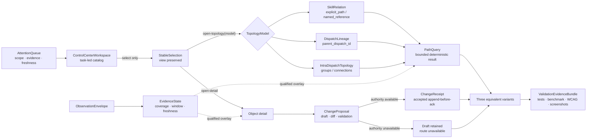

# Skill & Dispatch Control Center

## Objective

Define a task-led Skill & Dispatch Control Center that lets operators find attention, inspect skills and dispatches, answer bounded topology questions, distinguish evidence states, and prepare authority-safe configuration changes. The end state has one shared backend contract and exactly three structurally distinct but functionally equivalent frontend variants, followed by reproducible functional, accessibility, performance, usability, and screenshot validation.

**Status:** v0.1.0 — basis-backed discovery
**Owner:** @VictorBoscaro

## 1. Business Context

This work advances the repository goal of organizing, dispatching, and observing governed fleets of agents while preserving the distinction between runnable fact and research thesis described in the [project overview](../../../../README.md).

**Why now**

The current control plane can show pending sheets and dispatch history, and a separate experiment can display extracted skill relationships, but the repository has no single operator contract that connects task attention, skill discovery, dispatch lineage, topology questions, evidence quality, and authority-safe change review. The corrected research converges on a task-led landing surface with topology opened only for an explicit relational question, while its red-team review requires the interaction, evidence, path, configuration, benchmark, fixture, accessibility, and originality contracts to be frozen before API or UI implementation ([research findings](../../../../experiments/skill-control-center/research/findings.md#information-architecture-decision); [review findings](../../../../experiments/skill-control-center/research-review/review.md#findings)).

**What's broken (as of 2026-07-24)**

1. `implementations/UI-CONTRACT.md` §What the screen needs to communicate defines a Dispatch reader centered on pending sheets and history, but it has no skill catalog, skill relation read model, deterministic A-to-B path query, or observed-usage envelope.
2. `implementations/UI-CONTRACT.md` §Rules keeps the existing screen read-only and §API exposes Dispatch-reader endpoints only; there is no authoritative configuration command contract, capability mapping, approval transition, or accepted receipt for the proposed control center.
3. `experiments/skill-relationship-graph/viewer.html:218` `select()` changes graph focus immediately and the canvas is the primary browsing surface; it does not preserve a task-led view, URL-restorable selection, back state, or an explicit `open-topology` transition.
4. `experiments/skill-relationship-graph/viewer.html:211` `relationList()` and the “Chama / menciona” labels visually collapse strong path references and weak textual mentions, despite `graph.json` containing 15 `explicit_path` edges and 247 `named_reference` edges with materially different proof strength.
5. `experiments/skill-relationship-graph/graph.json:367` contains only skill nodes and extracted skill relations; it cannot prove Dispatch parent lineage, intra-Dispatch group topology, runtime usage, recency, outcomes, or coverage.
6. `docs/features/agent-provenance-telemetry/UI-SPEC.md` §Applicability Decision explicitly registers no APT route, page, component, action, transport, or deployed runtime. A Control Center therefore cannot claim APT query bindings or mutation authority through that sibling feature.
7. [Event-driven initial definitions](../../../../research/event-driven-obligations-and-task-orchestration/research-initial-definitions.md) §Known-Gaps leaves dashboard audiences, layer vocabulary, navigation, freshness, and authority-safe read models unsettled, and also leaves candidate reminders and terminal dispositions unresolved.
8. [Research findings](../../../../experiments/skill-control-center/research/findings.md) §Acceptance-rubric identifies thresholds, but the exact versioned reference environment and authoritative owners of telemetry-source coverage, freshness SLA, and change approval are not established by the available corpus.
9. [Meta-orchestration findings](../../../../experiments/skill-control-center/meta-orchestration/findings.md) §Lineage-limitation records that shared task-name prefixes are not authoritative lineage; a UI that groups them as parent/child would invent identity instead of using `parent_dispatch_id`.
10. `implementations/UI-CONTRACT.md` §UI Contract — Phase 1 still requires ten aesthetics-only variants. The confirmed target requires exactly three structurally distinct variants and therefore needs a new versioned contract before frontend implementation.

**What stays the same**

- The append-only Dispatch ledger, pending-sheet gate, validated appender, hook lifecycle, and append-before-ack rule remain authoritative; this discovery does not replace, repair, or write those stores.
- Existing Dispatch row identity, historical `0.6.0`/`0.6.1` compatibility, LIVE/RESERVED semantics, legacy rows, orphan closes, UTC day semantics, warnings, and partial reader behavior remain visible through the seam defined by the [current UI contract](../../../../implementations/UI-CONTRACT.md) §API.
- `Dispatch` ancestry remains owned by the Dispatch record and is joined only through `parent_dispatch_id`. “Mini-onda” may be a derived presentation label, but no `MiniWave`, `MiniWaveId`, or parallel lineage identity is introduced, consistent with the [meta-orchestration finding](../../../../experiments/skill-control-center/meta-orchestration/findings.md#decision).
- APT Session, Dispatch-scope, and Research projections remain owned by the [APT UI applicability specification](../../agent-provenance-telemetry/UI-SPEC.md) §Future Read-Only Presentation Contract. This feature may show an explicitly unavailable integration seam, but it does not redefine those projections, expose their raw evidence, or create APT routes or operations.
- Obligation, scheduler, candidate, reminder, task-recipe, tag, and general relation semantics remain owned by the future work framed in the [event-driven initial definitions](../../../../research/event-driven-obligations-and-task-orchestration/research-initial-definitions.md) §Known Gaps. This feature does not settle those concepts through presentation.
- The existing skill graph artifact remains a fixture and source witness, not a visual reference, runtime authority, usage ledger, or editable relation store. Derived edges are never edited directly.
- Existing repository UI variants are not creative references, templates, CSS sources, or comparison targets for the three new variants.
- This discovery does not prescribe implementation tasks, choose a frontend framework, create an authentication scheme, select a production host, establish new authority holders, or claim that research precedent proves causal usability.

## 2. Core Concepts

### ControlCenterWorkspace

**Meta-type:** Page.

The routable operator surface answers “what needs attention now?” before it offers catalogs and explicitly invoked relational tools. It is task-led because the current control plane makes the human gate the primary operational object and the research supports progressive disclosure over a global graph.

### AttentionQueue

**Meta-type:** View Model.

A prioritized, non-authoritative projection of pending approvals, blockers, degraded sources, stale evidence, conflicts, and failures, with scope, freshness, coverage, and safe next action visible. It is a view model rather than an entity because it derives from owned records and never authorizes or mutates them.

### StableSelection

**Meta-type:** Value Object.

The URL-restorable tuple of `view`, `object_kind`, `object_id`, `model`, filters, scroll anchor, and optional path query that preserves identity across catalog, detail, and topology surfaces. Separating selection from navigation prevents selection alone from changing the current view.

### TopologyModel

**Meta-type:** Enum / Type.

The closed model selector `skill-relations | dispatch-lineage | intra-dispatch`, which prevents edges from unrelated owners from being projected as one graph. A cross-model relation is absent until a separately governed read model establishes its identity, provenance, and join semantics.

### SkillRelation

**Meta-type:** Value Object.

A directed source-derived relation with `source_skill_id`, `target_skill_id`, `relation_kind`, evidence locations, source snapshot digest, and evidence class. `explicit_path` is a strong declared path reference; `named_reference` is a weak extracted mention and may never be labeled “calls” or “depends on.”

### DispatchLineage

**Meta-type:** View Model.

A parent/child projection derived only from `parent_dispatch_id`, including roots, depth, order, unresolved parents, and source revision. It does not infer lineage from task-name prefixes, timing, shared goals, agent names, or “mini-wave” labels.

### IntraDispatchTopology

**Meta-type:** View Model.

The groups and typed `connections` declared inside one Dispatch, including `sequential`, `zig-zag`, `feedback`, and any declared `loop_cap`. It is scoped to one Dispatch and is not Dispatch ancestry or a skill dependency graph.

### EvidenceState

**Meta-type:** Enum / Type.

The visible, non-collapsing vocabulary `declared | observed | inferred | unknown-or-unavailable`, with `stale` as an independent freshness qualifier. A relation may be both declared and observed, while missing or inaccessible telemetry remains unknown rather than zero or unused.

### ObservationEnvelope

**Meta-type:** Event.

The minimum accepted usage observation carries `event_id`, `object_id`, `object_kind`, `occurred_at_utc`, `received_at_utc`, `producer`, `run_or_correlation_id`, `outcome`, `source`, `schema_version`, and optional `retry_of`. Its identity and timing fields make deduplication, retry treatment, windowing, coverage, and freshness computable.

### PathQuery

**Meta-type:** Query.

A deterministic bounded query over exactly one `TopologyModel`, with explicit endpoints, direction, allowed edge kinds, depth limit, and result limit. It returns evidence-bearing paths or a typed non-success state without converting partial source failure into “no path.”

### ChangeProposal

**Meta-type:** Entity.

An identity-bearing draft containing target identity, base revision or hash, explicit diff, effective configuration with value origins, validation results, requested authority, idempotency key, and lifecycle state. It is distinct from both local preferences and an accepted authoritative change.

### ChangeReceipt

**Meta-type:** Value Object.

The immutable evidence of an accepted authoritative change, including journal or event reference, resulting revision, receipt identifier, correlation or run IDs, target, actor, capability, approval, effective values, and timestamp. Only an append-before-ack accepted receipt permits the UI to display authoritative status as changed.

### VariantContract

**Meta-type:** Interface.

The shared API, fixture, semantic, action, state, command, test-ID, viewport, and expected-answer boundary implemented identically by all three variants. It makes structural originality testable without allowing presentation differences to change meaning or authority.

### ValidationEvidenceBundle

**Meta-type:** Value Object.

A revision-bound package of test results, environment manifest, benchmark records, accessibility matrices, screenshots, visual assessments, and source digests. It prevents a screenshot, passing test, or subjective verdict from floating free of the exact backend and frontend revisions it claims to validate.

## 3. Information Architecture and Interaction Contract

### Task-led landing

SCD-01 fixes the first paint at operational attention rather than topology. The page exposes, in order: pending approvals or blockers; current and partial/degraded state; repository, time window, filters, and loaded scope; provenance, freshness, and coverage; the evidence legend; searchable skill and Dispatch catalogs; and a safe next action. An empty queue says that no actionable item was returned for the visible scope and never implies that the underlying system has no work.

The catalog remains available on first paint but does not displace the attention context. Search identifies which fields matched; cumulative filters remain visible; no-match states repeat the active scope and evidence limitations. Dispatch list semantics preserve the current reader contract’s pending-first behavior and partial-data warnings ([UI contract](../../../../implementations/UI-CONTRACT.md#what-the-screen-needs-to-communicate)).

### Explicit transitions

SCD-02 separates selection from navigation:

| Intent | Result | Preserved state |
|---|---|---|
| `select(object)` | Updates `StableSelection` and URL; current view does not change. | View, filters, scroll, comparison set |
| `open-detail(object)` | Opens the object detail workspace. | Selection, filters, prior-view restoration token |
| `open-topology(object, model)` | Opens a focal topology only after an explicit action. | Selection, filters, model, prior-view restoration token |
| `back` | Restores the previous view exactly. | Filters, scroll, selection, path query |
| Deep-link restore | Restores every supported tuple member and reports unsupported or missing parts. | All valid tuple members |

No single click that merely selects a row or node may implicitly open topology. Within an explicitly opened topology, the selected object is centered, one upstream and downstream hop is initially visible, and depth expansion or global graph display requires another explicit action. A synchronized list or table mirror exposes the same selection and answers; a tree is permitted only for proven single-parent acyclic relations.

### Required operator answers

Every variant must support the same answer contract:

1. What requires attention now?
2. Which skills and Dispatches exist in this scope?
3. What does the selected object relate to in the selected model?
4. Which bounded path connects A to B?
5. What is declared, observed, inferred, unavailable, or stale?
6. How often and how recently was an object observed, with what outcome and coverage?
7. Which source is degraded, excluded, stale, or incomplete?
8. What can this actor change locally, what can only be drafted, and what authority and receipt would an authoritative change require?

The research source owns the evidence comparison that led to this synthesis and remains limited to precedent plus falsifiable local inference ([collected task-first and topology-first returns](../../../../experiments/skill-control-center/research/research.md)).

## 4. Separate Topology Read Models

SCD-03 requires three separately named and separately queried read models:

| Model | Node identity | Edge authority | Permitted initial view | Forbidden inference |
|---|---|---|---|---|
| `skill-relations` | Stable skill ID and source path metadata | Source extraction snapshot | Focal directed neighborhood | Usage, Dispatch lineage, or “calls” from `named_reference` |
| `dispatch-lineage` | `dispatch_id` | `parent_dispatch_id` only | Focal ancestors and descendants | Parentage from prefix, time, goal, group, or shared actor |
| `intra-dispatch` | Group ID scoped by `dispatch_id` | Dispatch `groups` and `connections` | Selected Dispatch topology | Cross-Dispatch lineage or skill dependencies |

The current fixture proves 70 parsed skills, 262 typed edges, no unresolved explicit paths, 15 `explicit_path` edges, and 247 `named_reference` edges; it does not prove execution ([graph fixture](../../../../experiments/skill-relationship-graph/graph.json)). The current graph viewer demonstrates filtering, layout, selection, browser-local drafts, and pointer-oriented canvas behavior, but SCD-04 classifies it solely as negative/current-state evidence rather than a visual reference ([viewer](../../../../experiments/skill-relationship-graph/viewer.html)).

### Skill relation semantics

`explicit_path` is strong declared evidence that a source file names an explicit path to another `SKILL.md`. `named_reference` is a weak extracted textual mention. Both retain their evidence locations and source snapshot digest; weak evidence uses “mentions” language, a non-color marker, and an opt-in inclusive query mode.

### Dispatch lineage semantics

Lineage roots are Dispatches with no `parent_dispatch_id`; an unknown referenced parent is an unresolved parent, not a root. Derived fields such as root, depth, order, aggregate status, and a “mini-wave” label show a derived marker, source revision, and freshness. They never establish a second identity or modify the ledger.

### Intra-Dispatch semantics

Groups are scoped by `(dispatch_id, group_id)`. Connections retain their declared type, direction, and `loop_cap`; the UI does not reinterpret dependency scheduling or robot-talks semantics. A legacy Dispatch without groups is visibly legacy and returns an unavailable intra-Dispatch topology rather than an empty authoritative graph.

## 5. Evidence and Observation Contract

SCD-05 makes evidence language part of every aggregate, edge detail, topology legend, and error state:

| Term | Required meaning | Prohibited rendering |
|---|---|---|
| `declared` | Supported by an identified declarative source and snapshot. | “Executed,” “used,” or “observed” without telemetry |
| `observed` | At least one accepted, deduplicated event in the selected window. | Observation without source, window, or coverage |
| `inferred` | Derived by a visible versioned rule from named inputs. | Unqualified fact |
| `unknown-or-unavailable` | Denominator unknown, access denied, ingestion absent, unsupported, or not returned. | Zero, false, unused, or no path |
| `stale` | Freshness threshold exceeded; qualifies another state. | Replacement of the underlying evidence class |

### Envelope, identity, and retry

The backend accepts an observation only when every mandatory `ObservationEnvelope` field is valid. It deduplicates on `(producer, event_id)`. A repeated delivery with the same key does not increment usage; `retry_of` preserves causal linkage, and a retry counts as a separate use only when it has a new `run_or_correlation_id`.

### Window, coverage, and freshness

SCD-06 defines the selected observation window as `[start_utc, end_utc)`: inclusive start, exclusive end, UTC. Every aggregate returns both bounds, UTC basis, accepted sources, expected sources, exclusions, `last_successful_ingest`, update time, and the configuration revision used.

`coverage = accepted_sources / expected_sources` for the selected scope. Both numerator and denominator are displayed. If the denominator is unknown, access is denied, or ingestion is absent, coverage and usage state are `unknown-or-unavailable`; `0 observed` is legal only when every expected source had complete coverage for the entire window.

Freshness is computed as `now_utc - last_successful_ingest > freshness_sla`. `freshness_sla` and its origin are returned by the backend; the UI never silently chooses a threshold. Partial source failure preserves available declared structure, identifies failed sources, and marks affected observed results partial or unavailable.

### Privacy and non-authority

Observation views expose accepted fields and safe references only. Raw prompts, returns, selectors, credentials, raw artifact bodies, and operational logs do not enter DOM attributes, URLs, client telemetry, screenshots, or cache keys. This seam follows the non-authority and deferred-runtime limits of the [APT UI specification](../../agent-provenance-telemetry/UI-SPEC.md#privacy-and-non-authority-constraints-for-re-entry) without claiming to consume an APT query.

## 6. Deterministic Path Query Contract

SCD-07 defines this request:

```text
PathQuery {
  model,
  source_id,
  target_id,
  direction,
  allowed_edge_kinds,
  max_depth,
  max_paths
}
```

The backend validates both endpoints inside the named model before traversal. Default skill queries are directed and use only `explicit_path`; an explicit inclusive option adds `named_reference` and preserves a weak-evidence marker on every affected edge. Dispatch lineage paths use only parent/child edges from `parent_dispatch_id`; intra-Dispatch paths use only connections declared inside the selected Dispatch.

SCD-08 fixes ordering and termination: return shortest path length first, then lexical order of the complete stable node-ID sequence; visit a node at most once within one candidate path; enforce both limits; and report returned depth, applied limits, and whether additional paths exist. The response state is exactly one of:

| State | Meaning |
|---|---|
| `success` | One or more complete bounded paths returned. |
| `no-path` | Complete healthy traversal found no path within declared limits. |
| `invalid-endpoint` | A source or target is absent from the named model/snapshot. |
| `unsupported-model` | The requested model or edge kind is not supported. |
| `truncated` | Valid paths returned but depth/path limits or source pagination may hide more. |
| `error` | The query could not establish a trustworthy result. |

A partial or failed source can yield `truncated` or `error`, never `no-path`. Each returned edge includes its kind, evidence class, provenance reference, and source snapshot.

## 7. Configuration, Authority, and Receipt Boundary

SCD-09 separates local preference, proposal, validation, approval, application, and receipt:

| Action | Required authority owner | Input/base | State transition | Required evidence/receipt |
|---|---|---|---|---|
| Change filter, layout, pin, comparison set, saved view | Current user in local preference boundary | Preference revision | `clean → saved-local` or `save-failed → retry` | Local save result; never an authoritative receipt |
| Create or edit a proposed configuration | Draft owner; exact registry unsettled in OQ-SCC3 | Stable target and base revision/hash | `clean → draft-dirty → draft-saved` | Versioned draft and explicit diff |
| Validate proposal | Configured validator; exact registry unsettled in OQ-SCC3 | Draft plus resolved effective values/origins | `draft-saved → validating → valid/invalid` | Validator identity/version and complete result |
| Request authoritative change | Capability holder plus required approval; exact mapping unsettled in OQ-SCC3 | Valid proposal and idempotency key | `valid → approval-pending → approved/rejected` | Approval or rejection reference |
| Apply accepted change | Authoritative command handler; not established by this discovery | Approved proposal and current base | `approved → applying → accepted/conflict/failed` | Append-before-ack journal/event reference and `ChangeReceipt` |
| Retry conflict or failure | Same governed route; new base when required | Preserved draft, conflict, idempotency lineage | `conflict/failed → revised → validating` | New validation and linked attempt evidence |

Derived relations are read-only. SCD-10 permits the UI to prepare drafts and show diffs, effective configuration, value origins, validation, capability, approval requirement, idempotency key, and current base revision. It may display an authoritative change only after the authoritative handler returns an accepted append-before-ack receipt; submitted, queued, drafted, approved, or locally saved never means applied.

The current Dispatch server’s separate confirm marker flow and the deferred APT operations do not silently become this route. Until OQ-SCC3 is settled and the resulting authority contract exists, all non-local authoritative controls remain disabled or draft-only with explicit “route unavailable” language.

## 8. Variant, Benchmark, Performance, and Accessibility Contract

### Exactly three equivalent variants

SCD-11 replaces the ten-variant aesthetics-only premise with exactly three new variants. They share the `VariantContract`, never use existing repository variants as visual references, and differ structurally in at least three of four dimensions: layout hierarchy, navigation model, information density/rhythm, and topology treatment.

| Variant | Structural composition | Navigation model | Topology treatment |
|---|---|---|---|
| A | Attention queue and health band above a catalog workspace; detail is an adjacent drawer. | Stable catalog route with explicit detail and topology actions. | Dedicated full-workspace focal mode reached only by `open-topology`. |
| B | Persistent attention rail, central catalog, and contextual inspector in a three-region console. | Region-preserving selection; detail occupies inspector, topology explicitly replaces the center. | Focal canvas and list mirror share the center while attention remains visible. |
| C | Sequential operational stages: attention summary, catalog table, then a full-width detail sheet. | Anchored stage navigation with restorable scroll and deep links. | Dedicated topology stage below/after explicit activation, with table alternative first in reading order. |

These are structural constraints, not reusable visual designs. Each variant receives its own original typography, spacing, shape, motion, and composition treatment without changing API, mandatory content, states, commands, expected answers, semantics, fixtures, or test IDs. A blind reviewer must distinguish all three through at least three of the four structural dimensions.

Every variant covers identical loading, empty, no-match, focal-lineage, observed-overlay, stale/degraded, partial-error, invalid-endpoint, truncated-path, draft, approval-pending, conflict, and accepted-receipt scenarios. Color is never the sole carrier of state or evidence.

### Reproducible UX benchmark

SCD-12 freezes the method before implementation:

- At least 10 representative operators who did not build any variant.
- The same fixed skill and Dispatch fixtures, expected answers, randomized task wording, and counterbalanced variant order.
- Tasks: identify attention, locate a known object, inspect evidence/provenance, find a bounded path, diagnose stale/degraded coverage, review a proposed diff, and identify whether an authoritative receipt exists.
- Timing begins when the task text is revealed and ends only when the participant states the expected answer or obtains the expected accepted receipt.
- Record correctness, unassisted completion, actions, wall-clock time, errors, and assistance; report median and P75 by task and variant.
- Preserve anonymized raw observations, task/fixture digests, environment manifest, bootstrap method, and 95% bootstrap confidence intervals.

Acceptance requires at least 90% correctness and unassisted completion for critical flows, no inference or unavailable state rendered as fact, at most three actions to locate attention or a known object, and at most five actions for path or provenance. A topology-prominent direction may be promoted closer to landing only when it provides a material lineage/path advantage and its 95% bootstrap interval does not cross a 10-percentage-point penalty on location tasks. The exact executable reference environment remains an authority gap governed by OQ-SCC4.

### Separate scale fixtures and performance

SCD-13 requires independent fixtures:

1. A skill topology fixture with exactly 70 nodes and 262 typed edges, preserving the 15/247 strong/weak relation split.
2. A Dispatch catalog fixture with approximately 700 Dispatch rows plus representative valid, unresolved-parent, legacy, orphan-close, pending, open, closed, and intra-Dispatch lineage cases.

Results never combine these fixture costs into one claim. Each run reports source digest, browser and version, OS, CPU/memory class, viewport, cache state, network profile, and cold/warm status. Provisional acceptance targets are first meaningful paint at or below 1.5 seconds P95, filter/selection at or below 100 ms P95, path response at or below 250 ms P95, and no browser long task over 200 ms; final enforceability depends on the settled reference environment in OQ-SCC4.

### WCAG 2.2 AA and manual matrix

SCD-14 requires all applicable WCAG 2.2 Level A and AA success criteria for every critical flow, including at minimum semantic relationships, contrast, non-text contrast, reflow, keyboard operation, no keyboard trap, focus order, focus visible, focus not obscured, label in name, status messages, names/roles/values, error identification, and error suggestion where applicable. Conformance is criterion-based; the product does not invent a “critical WCAG” severity.

The manual evidence matrix crosses every critical flow and mandatory state with:

- complete keyboard operation, visible focus, and focus restoration after detail/topology/back;
- screen-reader names, roles, states, relationships, and live-region announcements;
- 200% zoom and 320 CSS-pixel reflow;
- reduced motion;
- light and dark themes;
- non-color evidence and status meaning; and
- a non-canvas semantic list or table alternative capable of answering every topology question.

Automated checks supplement but do not replace the manual matrix. No variant passes while any applicable A/AA criterion or required manual cell fails.

## 9. Delivery Order and Final Validation Boundary

SCD-15 fixes a dependency boundary, not an implementation task list: the backend and shared contracts must be accepted before frontend variants can be judged. The backend boundary owns source adapters, the three separate read models, observation acceptance and aggregation, deterministic path query, degraded-state behavior, and any eventually authorized change command/receipt interface. Frontends consume versioned contracts and fixtures; they do not reconstruct authority or evidence algebra independently.

The stage sequence is:

| Stage boundary | Exit evidence |
|---|---|
| Discovery → SPEC | Every SCD decision maps to an owned aspect; every OQ is settled or explicitly blocks its dependent aspect; source and ownership seams remain single-owner. |
| SPEC → backend | Schemas, query states, source failures, evidence algebra, fixture contracts, authority boundaries, and receipt interface are testable without frontend invention. |
| Backend → frontend | Contract tests pass on both independent fixtures; read-model snapshots and path results are deterministic; unavailable write authority stays disabled. |
| Frontend → validation | Exactly three variants implement identical fixtures, states, actions, expected answers, commands, test IDs, and viewports with verified structural distinction. |
| Validation → acceptance | Backend, contract, and frontend tests have zero unexplained failures; accessibility and benchmark gates pass; revision-bound screenshots and assessments cover all required scenarios. |
| Any → escape | Preserve the last accepted contract and choose one concrete safe alternative: ship read-only task/catalog scope without topology; ship one internal non-production reference implementation; or defer authoritative configuration while retaining draft/diff review. |

The honest-gate rule is to expose an absent source, authority route, deterministic response, accessibility failure, or benchmark miss at the boundary where it first becomes testable. Discovering it later costs fixture rewrites, cross-variant drift, invalid screenshots, and potentially misleading operator claims; no schedule pressure converts a failed gate into acceptance.

Final validation binds every result to source, backend, and frontend digests. It includes backend tests, contract tests, one shared cross-variant frontend suite, evidence that assertions exercise specified behavior, accessibility automation plus the manual matrix, cold/warm performance runs, the operator benchmark, and screenshots for every variant at the frozen desktop/mobile, light/dark, and mandatory-state matrix. Blind screenshot assessment scores **clarity**, **usability**, **visual consistency**, and **operational efficiency**, plus structural distinctness; reviewers see anonymized variants in randomized order before implementation identity is revealed.

## Open Questions

### OQ-SCC1

**Question:** Which runtime component owns generation, refresh cadence, stable identity, and retention of the skill-relation read model beyond the checked experiment fixture?

**Recommendation:** Define a versioned read-only source adapter that emits generator version, repository revision, snapshot digest, extraction time, and per-edge evidence locations; keep the model unavailable rather than silently reading an unbound file when those fields are absent.

**Settlement stage:** SPEC authority and interface review, before backend acceptance.

### OQ-SCC2

**Question:** Which registry owns `expected_sources` and `freshness_sla` per scope, and who may revise those values?

**Recommendation:** Use an explicit versioned backend configuration with value origins and a named authority; until registered, return unknown denominator and unknown freshness threshold instead of UI defaults.

**Settlement stage:** Backend evidence-contract specification, before observation aggregation is implemented.

### OQ-SCC3

**Question:** Which concrete command handler, capability, approval policy, journal event, and receipt schema authorize each non-local configuration action?

**Recommendation:** Keep the Control Center reader plus draft/diff-only for authoritative targets until a separately governed operation binds all five; do not reinterpret `/api/confirm`, APT operations, hooks, or the document owner as that authority.

**Settlement stage:** Architecture authority review and SPEC operations/interface gate, before any write-capable endpoint or control.

### OQ-SCC4

**Question:** What exact reproducible browser, OS image, hardware runner, viewport set, cache state, and network profile own the performance and UX acceptance measurements?

**Recommendation:** Freeze a versioned environment manifest using the repository’s pinned Playwright Chromium, a named reproducible runner image/hardware class, fixed desktop/mobile viewports, offline/local network profile, and explicit cold/warm procedure.

**Settlement stage:** Validation-design gate before performance implementation and participant recruitment.

### OQ-SCC5

**Question:** Does the Control Center extend the existing Dispatch reader host and routes, or enter through a separately authenticated host and navigation owner?

**Recommendation:** Prefer an explicitly versioned extension seam on the existing reader only if route ownership, access control, and backward compatibility are ratified; otherwise keep the API contract host-neutral.

**Settlement stage:** SPEC interface and deployment-context review.

### OQ-SCC6

**Question:** What historical coverage and validation rules apply to `parent_dispatch_id`, especially for legacy rows and unresolved parents?

**Recommendation:** Audit the fixture and ledger schemas, expose coverage and unresolved-parent counts, and never infer missing ancestry. Treat incomplete historical lineage as partial or unavailable.

**Settlement stage:** Backend fixture audit before dispatch-lineage contract acceptance.

### OQ-SCC7

**Question:** Which full WCAG 2.2 A/AA success-criterion set is applicable to each frozen critical flow and state?

**Recommendation:** Have accessibility review map every flow/state to the normative criteria, retaining the minimum set and manual matrix in §8 while adding any applicable criterion rather than narrowing it.

**Settlement stage:** UI-SPEC accessibility gate before frontend acceptance tests are frozen.

## Decisions Baked In

| ID | Decision | Where |
|---|---|---|
| SCD-01 | The landing surface is task-led and exposes operational attention before topology. | §3 Task-led landing |
| SCD-02 | Selection never changes view; detail, topology, back, and deep-link restoration are explicit transitions. | §3 Explicit transitions |
| SCD-03 | Skill relations, Dispatch lineage, and intra-Dispatch topology are separate read models. | §4 Separate Topology Read Models |
| SCD-04 | The existing graph viewer is current-state/negative evidence, not a visual reference. | §4 Separate Topology Read Models |
| SCD-05 | Evidence uses non-collapsing declared, observed, inferred, unknown-or-unavailable, and stale language. | §5 Evidence and Observation Contract |
| SCD-06 | Observation identity, dedupe, retry, UTC window, coverage, zero, and freshness algebra are backend contracts. | §5 Window, coverage, and freshness |
| SCD-07 | Every path query names one model, endpoints, direction, allowed edge kinds, depth, and path limits. | §6 Deterministic Path Query Contract |
| SCD-08 | Path ordering, cycle handling, truncation, and non-success states are deterministic. | §6 Deterministic Path Query Contract |
| SCD-09 | Local preference, draft, validation, approval, apply, retry, and accepted receipt are distinct authority states. | §7 Configuration, Authority, and Receipt Boundary |
| SCD-10 | Only an accepted append-before-ack receipt changes authoritative status in the UI. | §7 Configuration, Authority, and Receipt Boundary |
| SCD-11 | Exactly three new structurally distinct variants implement one functionally equivalent contract without using repository variants as references. | §8 Exactly three equivalent variants |
| SCD-12 | UX comparison uses a frozen representative-operator benchmark with fixed fixtures, randomized tasks/order, absolute thresholds, and confidence intervals. | §8 Reproducible UX benchmark |
| SCD-13 | Skill topology 70/262 and approximately 700 Dispatch rows are independent performance fixtures. | §8 Separate scale fixtures and performance |
| SCD-14 | Accessibility acceptance is WCAG 2.2 AA criterion-based and includes the full manual matrix and non-canvas alternative. | §8 WCAG 2.2 AA and manual matrix |
| SCD-15 | Shared backend contracts and conformance precede frontend variants; final validation binds tests, screenshots, and four operational quality assessments to exact revisions. | §9 Delivery Order and Final Validation Boundary |

## Connections

| Document | Type | Description |
|---|---|---|
| [Project README](../../../../README.md) | derives-from | Supplies the runnable-vs-thesis boundary and repository goal. |
| [Control-center research findings](../../../../experiments/skill-control-center/research/findings.md) | derives-from | Durable basis for task-led IA, evidence, path, configuration, benchmark, fixture, accessibility, and variant contracts. |
| [Research review](../../../../experiments/skill-control-center/research-review/review.md) | derives-from | Durable basis for corrected limitations and required contract hardening. |
| [Meta-orchestration findings](../../../../experiments/skill-control-center/meta-orchestration/findings.md) | derives-from | Durable basis for lineage ownership, stage boundary, and validation evidence. |
| [Collected research returns](../../../../experiments/skill-control-center/research/research.md) | cites | Preserves competing task-first/topology-first evidence and source-quality limitations. |
| [Skill graph fixture](../../../../experiments/skill-relationship-graph/graph.json) | cites | Supplies the checked 70-node/262-edge extraction witness and relation split. |
| [Skill graph viewer](../../../../experiments/skill-relationship-graph/viewer.html) | cites | Supplies current interaction and labeling limitations; explicitly not a visual reference. |
| [Current UI contract](../../../../implementations/UI-CONTRACT.md) | supersedes | This discovery requires a future contract revision from ten aesthetics-only variants to three structurally distinct equivalent variants while preserving relevant reader seams. |
| [APT UI applicability](../../agent-provenance-telemetry/UI-SPEC.md) | cites | Owns the deferred APT UI/runtime and non-authority boundary. |
| [Event-driven initial definitions](../../../../research/event-driven-obligations-and-task-orchestration/research-initial-definitions.md) | cites | Owns adjacent scheduler, candidate, reminder, relation, and dashboard gaps. |

## Flow Diagram



The flow keeps operational attention ahead of explicit detail and topology actions, and it routes each topology question through exactly one owned model. Observation evidence qualifies read results without becoming authority, while configuration changes become authoritative only through an accepted receipt. All three variants consume the same contracts before revision-bound validation.

## Appendix — Changelog

| Version | Date | Changes |
|---|---|---|
| 0.1.0 | 2026-07-24 | Created the basis-backed discovery with task-led interaction, separate topology models, evidence/observation/path/authority contracts, exactly three equivalent variants, backend-first boundary, reproducible validation, and explicit authority gaps; no prior decisions were locked. |

**Source basis:** [control-center research findings](../../../../experiments/skill-control-center/research/findings.md); [research review](../../../../experiments/skill-control-center/research-review/review.md); [meta-orchestration findings](../../../../experiments/skill-control-center/meta-orchestration/findings.md)
