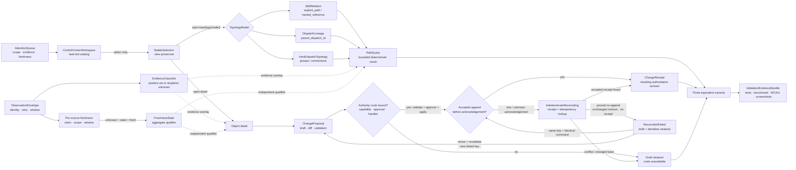

# Skill & Dispatch Control Center

## Objective

Define a task-led Skill & Dispatch Control Center that lets operators find attention, inspect skills and dispatches, answer bounded topology questions, distinguish evidence states, and prepare authority-safe configuration changes. The end state has one shared backend contract and exactly three structurally distinct but functionally equivalent frontend variants, followed by reproducible functional, accessibility, performance, usability, and screenshot validation.

**Status:** v0.3.0 — basis-backed discovery amendment
**Owner:** @VictorBoscaro

## 1. Business Context

This work advances the repository goal of organizing, dispatching, and observing governed fleets of agents while preserving the distinction between runnable fact and research thesis described in the [project overview](../../../../README.md).

**Why now**

The current control plane can show pending sheets and dispatch history, and a separate experiment can display extracted skill relationships, but the repository has no single operator contract that connects task attention, skill discovery, dispatch lineage, topology questions, evidence quality, and authority-safe change review. The corrected research converges on a task-led landing surface with topology opened only for an explicit relational question, while its red-team review requires the interaction, evidence, path, configuration, benchmark, fixture, accessibility, and originality contracts to be frozen before API or UI implementation ([research findings](../research/findings.md#information-architecture-decision); [review findings](../research/review/review.md#findings)).

**What's broken (as of 2026-07-24)**

1. `implementations/UI-CONTRACT.md` §What the screen needs to communicate defines a Dispatch reader centered on pending sheets and history, but it has no skill catalog, skill relation read model, deterministic A-to-B path query, or observed-usage envelope.
2. `implementations/UI-CONTRACT.md` §Rules keeps the existing screen read-only and §API exposes Dispatch-reader endpoints only; there is no authoritative configuration command contract, capability mapping, approval transition, or accepted receipt for the proposed control center.
3. `experiments/skill-relationship-graph/viewer.html:218` `select()` changes graph focus immediately and the canvas is the primary browsing surface; it does not preserve a task-led view, URL-restorable selection, back state, or an explicit `open-topology` transition.
4. `experiments/skill-relationship-graph/viewer.html:211` `relationList()` and the “Chama / menciona” labels visually collapse strong path references and weak textual mentions, despite `graph.json` containing 15 `explicit_path` edges and 247 `named_reference` edges with materially different proof strength.
5. `experiments/skill-relationship-graph/graph.json:367` contains only skill nodes and extracted skill relations; it cannot prove Dispatch parent lineage, intra-Dispatch group topology, runtime usage, recency, outcomes, or coverage.
6. `docs/features/agent-provenance-telemetry/UI-SPEC.md` §Applicability Decision explicitly registers no APT route, page, component, action, transport, or deployed runtime. A Control Center therefore cannot claim APT query bindings or mutation authority through that sibling feature.
7. [Event-driven initial definitions](../../../../research/event-driven-obligations-and-task-orchestration/research-initial-definitions.md) §Known-Gaps leaves dashboard audiences, layer vocabulary, navigation, freshness, and authority-safe read models unsettled, and also leaves candidate reminders and terminal dispositions unresolved.
8. [Research findings](../research/findings.md) §Acceptance-rubric identifies thresholds, but the exact versioned reference environment and authoritative owners of telemetry-source coverage, freshness SLA, and change approval are not established by the available corpus.
9. [Meta-orchestration findings](../meta-orchestration/findings.md) §Lineage-limitation records that shared task-name prefixes are not authoritative lineage; a UI that groups them as parent/child would invent identity instead of using `parent_dispatch_id`.
10. `implementations/UI-CONTRACT.md` §UI Contract — Phase 1 still requires ten aesthetics-only variants. The confirmed target requires exactly three structurally distinct variants and therefore needs a new versioned contract before frontend implementation.

**What stays the same**

- The append-only Dispatch ledger, pending-sheet gate, validated appender, hook lifecycle, and append-before-ack rule remain authoritative; this discovery does not replace, repair, or write those stores.
- Existing Dispatch row identity, historical `0.6.0`/`0.6.1` compatibility, LIVE/RESERVED semantics, legacy rows, orphan closes, UTC day semantics, warnings, and partial reader behavior remain visible through the seam defined by the [current UI contract](../../../../implementations/UI-CONTRACT.md) §API.
- `Dispatch` ancestry remains owned by the Dispatch record and is joined only through `parent_dispatch_id`. “Mini-onda” may be a derived presentation label, but no `MiniWave`, `MiniWaveId`, or parallel lineage identity is introduced, consistent with the [meta-orchestration finding](../meta-orchestration/findings.md#decision).
- APT `SessionRecord`, `DispatchScopeProjection`, and `ResearchRecord` query definitions remain owned by the [APT query specification](../../agent-provenance-telemetry/specs/queries.md) §Query-Coverage-and-Required-Checks, bound for this amendment at `sha256:510277e262371cdae551d94313f5ad6acc56c30660be3a420d6bb910bbebcf1e`. The [APT UI applicability specification](../../agent-provenance-telemetry/UI-SPEC.md) owns only the deferred presentation applicability, privacy, and non-authority boundary; this feature may show an explicitly unavailable integration seam, but it does not redefine those queries, expose their raw evidence, or create APT routes or operations.
- Obligation, scheduler, candidate, reminder, task-recipe, tag, and general relation semantics remain owned by the future work framed in the [event-driven initial definitions](../../../../research/event-driven-obligations-and-task-orchestration/research-initial-definitions.md) §Known Gaps. This feature does not settle those concepts through presentation.
- The existing skill graph artifact remains a fixture and source witness, not a visual reference, runtime authority, usage ledger, or editable relation store. Derived edges are never edited directly.
- Existing repository UI variants are not creative references, templates, CSS sources, or comparison targets for the three new variants.
- This discovery does not prescribe implementation tasks, choose a frontend framework, create an authentication scheme, select a production host, establish new authority holders, or claim that research precedent proves causal usability.

## 2. Core Concepts

### ControlCenterWorkspace

**Meta-type:** Page.

The routable operator surface answers “what needs attention now?” before it offers catalogs and explicitly invoked relational tools. It is task-led because the current control plane makes the human gate the primary operational object and the research supports progressive disclosure over a global graph.

### AttentionQueue

**Meta-type:** View Model.

A prioritized, non-authoritative projection of pending approvals, blockers, degraded sources, stale evidence, conflicts, and failures, with scope, freshness, coverage, and safe next action visible. It is a view model rather than an entity because it derives from owned records and never authorizes or mutates them.

### StableSelection

**Meta-type:** Value Object.

The URL-restorable tuple of `view`, `object_kind`, `object_id`, `model`, filters, scroll anchor, and optional path query that preserves identity across catalog, detail, and topology surfaces. Separating selection from navigation prevents selection alone from changing the current view.

### TopologyModel

**Meta-type:** Enum / Type.

The closed model selector `skill-relations | dispatch-lineage | intra-dispatch`, which prevents edges from unrelated owners from being projected as one graph. A cross-model relation is absent until a separately governed read model establishes its identity, provenance, and join semantics.

### SkillRelation

**Meta-type:** Value Object.

A directed source-derived relation with `source_skill_id`, `target_skill_id`, `relation_kind`, evidence locations, source snapshot digest, and evidence class. `explicit_path` is a strong declared path reference; `named_reference` is a weak extracted mention and may never be labeled “calls” or “depends on.”

### DispatchLineage

**Meta-type:** View Model.

A parent/child projection derived only from `parent_dispatch_id`, including roots, depth, order, unresolved parents, and source revision. It does not infer lineage from task-name prefixes, timing, shared goals, agent names, or “mini-wave” labels.

### IntraDispatchTopology

**Meta-type:** View Model.

The groups and typed `connections` declared inside one Dispatch, including `sequential`, `zig-zag`, `feedback`, and any declared `loop_cap`. It is scoped to one Dispatch and is not Dispatch ancestry or a skill dependency graph.

### EvidenceClass

**Meta-type:** Enum / Type.

The closed evidence vocabulary `declared | observed | inferred | unknown-or-unavailable` applied to one claim, scope, and observation window. It describes proof class only; freshness is not an evidence class.

### EvidenceClassSet

**Meta-type:** Value Object.

A non-empty set of `EvidenceClass` values for one claim, scope, and window. It is either a one-to-three-member subset of `{declared, observed, inferred}` or the singleton `{unknown-or-unavailable}`; `unknown-or-unavailable` is incompatible with every positive class for the same claim/scope/window, while declared, observed, and inferred may coexist when each retains its own source. Availability is evaluated at that exact claim/scope/window grain, so an unavailable source does not erase trustworthy positive evidence from another source.

### EvidenceCompleteness

**Meta-type:** Enum / Type.

The independent qualifier `complete | partial | unavailable` for one claim, scope, and window. `partial` means at least one trustworthy positive fact is available but the configured source/interval basis is incomplete; it permits positive lower-bound claims but forbids exhaustive totals, absence, and zero claims.

### FreshnessState

**Meta-type:** Enum / Type.

The qualifier `fresh | stale | unknown` computed independently for each expected source and then reduced deterministically for one claim, scope, and window. `unknown` applies when a required input is unavailable, aggregate precedence is `unknown > stale > fresh`, and freshness never replaces or upgrades the underlying evidence.

### ObservationEnvelope

**Meta-type:** Event.

The minimum accepted usage observation carries `event_id`, `logical_invocation_id`, `attempt_id`, `attempt_number`, `object_id`, `object_kind`, `occurred_at_utc`, `received_at_utc`, `producer`, `run_or_correlation_id`, `outcome`, `source`, `schema_version`, and optional `retry_of_attempt_id`. Its separate delivery, logical-invocation, and attempt identities make deduplication, conflict handling, retries, windowing, coverage, and freshness computable without presenting delivery attempts as skill usage.

### PathQuery

**Meta-type:** Query.

A deterministic bounded query over exactly one `TopologyModel`, with explicit endpoints, direction, allowed edge kinds, depth limit, and result limit. It returns evidence-bearing paths or a typed non-success state without converting partial source failure into “no path.”

### ChangeProposal

**Meta-type:** Entity.

An identity-bearing draft containing target identity, base revision or hash, explicit diff, effective configuration with value origins, validation results, requested authority, idempotency key, and lifecycle state. It is distinct from both local preferences and an accepted authoritative change.

### ChangeReceipt

**Meta-type:** Value Object.

The immutable evidence of an accepted authoritative change, including journal or event reference, resulting revision, receipt identifier, correlation or run IDs, target, actor, capability, approval, effective values, and timestamp. Only an append-before-ack accepted receipt permits the UI to display authoritative status as changed.

### VariantContract

**Meta-type:** Interface.

The shared API, fixture, semantic, action, state, command, test-ID, viewport, and expected-answer boundary implemented identically by all three variants. It makes structural originality testable without allowing presentation differences to change meaning or authority.

### ValidationEvidenceBundle

**Meta-type:** Value Object.

A revision-bound package of test results, environment manifest, benchmark records, accessibility matrices, screenshots, visual assessments, and source digests. It prevents a screenshot, passing test, or subjective verdict from floating free of the exact backend and frontend revisions it claims to validate.

## 3. Information Architecture and Interaction Contract

### Task-led landing

SCD-01 fixes the first paint at operational attention rather than topology. The page exposes, in order: pending approvals or blockers; current and partial/degraded state; repository, time window, filters, and loaded scope; provenance, freshness, and coverage; the evidence legend; searchable skill and Dispatch catalogs; and a safe next action. An empty queue says that no actionable item was returned for the visible scope and never implies that the underlying system has no work.

The catalog remains available on first paint but does not displace the attention context. Search identifies which fields matched; cumulative filters remain visible; no-match states repeat the active scope and evidence limitations. Dispatch list semantics preserve the current reader contract’s pending-first behavior and partial-data warnings ([UI contract](../../../../implementations/UI-CONTRACT.md#what-the-screen-needs-to-communicate)).

### Explicit transitions

SCD-02 separates selection from navigation:

| Intent | Result | Preserved state |
|---|---|---|
| `select(object)` | Updates `StableSelection` and URL; current view does not change. | View, filters, scroll, comparison set |
| `open-detail(object)` | Opens the object detail workspace. | Selection, filters, prior-view restoration token |
| `open-topology(object, model)` | Opens a focal topology only after an explicit action. | Selection, filters, model, prior-view restoration token |
| `back` | Restores the previous view exactly. | Filters, scroll, selection, path query |
| Deep-link restore | Restores every supported tuple member and reports unsupported or missing parts. | All valid tuple members |

No single click that merely selects a row or node may implicitly open topology. Within an explicitly opened topology, the selected object is centered, one upstream and downstream hop is initially visible, and depth expansion or global graph display requires another explicit action. A synchronized list or table mirror exposes the same selection and answers; a tree is permitted only for proven single-parent acyclic relations.

### Required operator answers

Every variant must support the same answer contract:

1. What requires attention now?
2. Which skills and Dispatches exist in this scope?
3. What does the selected object relate to in the selected model?
4. Which bounded path connects A to B?
5. What is declared, observed, inferred, unavailable, or stale?
6. How often and how recently was an object observed, with what outcome and coverage?
7. Which source is degraded, excluded, stale, or incomplete?
8. What can this actor change locally, what can only be drafted, and what authority and receipt would an authoritative change require?

The research source owns the evidence comparison that led to this synthesis and remains limited to precedent plus falsifiable local inference ([collected task-first and topology-first returns](../research/research.md)).

## 4. Separate Topology Read Models

SCD-03 requires three separately named and separately queried read models:

| Model | Node identity | Edge authority | Permitted initial view | Forbidden inference |
|---|---|---|---|---|
| `skill-relations` | Stable skill ID and source path metadata | Source extraction snapshot | Focal directed neighborhood | Usage, Dispatch lineage, or “calls” from `named_reference` |
| `dispatch-lineage` | `dispatch_id` | `parent_dispatch_id` only | Focal ancestors and descendants | Parentage from prefix, time, goal, group, or shared actor |
| `intra-dispatch` | Group ID scoped by `dispatch_id` | Dispatch `groups` and `connections` | Selected Dispatch topology | Cross-Dispatch lineage or skill dependencies |

The current fixture proves 70 parsed skills, 262 typed edges, no unresolved explicit paths, 15 `explicit_path` edges, and 247 `named_reference` edges; it does not prove execution ([graph fixture](../../../../experiments/skill-relationship-graph/graph.json)). The current graph viewer demonstrates filtering, layout, selection, browser-local drafts, and pointer-oriented canvas behavior, but SCD-04 classifies it solely as negative/current-state evidence rather than a visual reference ([viewer](../../../../experiments/skill-relationship-graph/viewer.html)).

### Skill relation semantics

`explicit_path` is strong declared evidence that a source file names an explicit path to another `SKILL.md`. `named_reference` is a weak extracted textual mention. Both retain their evidence locations and source snapshot digest; weak evidence uses “mentions” language, a non-color marker, and an opt-in inclusive query mode.

### Dispatch lineage semantics

Lineage roots are Dispatches with no `parent_dispatch_id`; an unknown referenced parent is an unresolved parent, not a root. Derived fields such as root, depth, order, aggregate status, and a “mini-wave” label show a derived marker, source revision, and freshness. They never establish a second identity or modify the ledger.

### Intra-Dispatch semantics

Groups are scoped by `(dispatch_id, group_id)`. Connections retain their declared type, direction, and `loop_cap`; the UI does not reinterpret dependency scheduling or robot-talks semantics. A legacy Dispatch without groups is visibly legacy and returns an unavailable intra-Dispatch topology rather than an empty authoritative graph.

## 5. Evidence and Observation Contract

SCD-05 makes evidence class and freshness independent parts of every aggregate, edge detail, topology legend, and error state:

| Contract | Required meaning | Cardinality / exclusion | Prohibited rendering |
|---|---|---|---|
| `EvidenceClass.declared` | Supported by an identified declarative source and snapshot. | May coexist with `observed` and `inferred`. | “Executed,” “used,” or “observed” without telemetry |
| `EvidenceClass.observed` | At least one accepted, deduplicated event in the selected window. | May coexist with `declared` and `inferred`. | Observation without source, window, or coverage |
| `EvidenceClass.inferred` | Derived by a visible versioned rule from named inputs. | May coexist with `declared` and `observed`. | Unqualified fact |
| `EvidenceClass.unknown-or-unavailable` | Required proof was not returned, authorized, ingested, or supported. | Must be the only member of `EvidenceClassSet` for that claim/scope/window. | Zero, false, unused, or no path |
| `FreshnessState.fresh` | Named SLA exists and the last successful ingest is within it. | Independent qualifier. | Proof-strength upgrade |
| `FreshnessState.stale` | Named SLA exists and its threshold is exceeded. | Independent qualifier. | Replacement of the evidence class |
| `FreshnessState.unknown` | SLA or successful-ingest time is unavailable. | Independent qualifier. | Silent UI default |

Every evidence answer is a tuple `(claim_id, scope_id, [start_utc,end_utc), EvidenceClassSet, EvidenceCompleteness, FreshnessState, source facts)`. Its `source facts` contain the exact expected-source set used for that claim/scope/window and one `source_freshness` record per expected source. The algebra is:

- `{unknown-or-unavailable}` pairs only with `EvidenceCompleteness.unavailable` when no trustworthy value can be returned for that exact claim/scope/window.
- A positive class set pairs with `complete` when every required source interval is complete, or with `partial` when at least one trustworthy positive fact survives but the full basis does not.
- `observed + partial` is a valid positive lower bound and reports accepted logical invocations and attempts from covered intervals; it is never rendered as an exhaustive usage total. Unknown source partitions remain named in `source facts` instead of being added to the positive set.
- `0 observed`, “unused,” “none,” and other absence claims require `observed + complete`. Declared or inferred evidence alone cannot establish runtime zero.
- `EvidenceCompleteness` is reduced only from source/interval coverage and remains independent of freshness: a complete result may be stale, and a partial result may be fresh for all sources that returned.

### Envelope, identity, and retry

The backend accepts an observation only when every mandatory `ObservationEnvelope` field is valid. `(producer, event_id)` identifies one delivery record; `(producer, logical_invocation_id, attempt_id)` is the canonical attempt key. The canonical attempt semantic payload is the stable serialization of exactly `attempt_number`, `object_id`, `object_kind`, `occurred_at_utc`, `run_or_correlation_id`, `outcome`, `source`, `schema_version`, and `retry_of_attempt_id` (including an explicit null for the optional predecessor). It excludes the delivery-only identity `event_id` and delivery timing `received_at_utc`; `producer`, `logical_invocation_id`, and `attempt_id` are already carried by the canonical attempt key and are not duplicated in its payload.

- The same delivery key, canonical attempt key, and canonical attempt semantic payload is a redelivery: increment `redelivery_count` only, never usage, attempts, retries, or outcomes.
- The same delivery key with a different canonical attempt key or canonical attempt semantic payload is a conflict: reject or quarantine it, increment `conflict_count`, and change no accepted count.
- The same canonical attempt key and same canonical attempt semantic payload, whether it arrives under the same or a new delivery key, is a duplicate/redelivery: retain delivery diagnostics and increment `redelivery_count`, but do not count the attempt, retry, usage, or outcome again.
- The same canonical attempt key with a different canonical attempt semantic payload is a semantic conflict: reject or quarantine the incoming record, increment `conflict_count`, preserve the originally accepted attempt unchanged, and change no usage, attempt, retry, or outcome count.
- A retry has the same `logical_invocation_id`, a new `attempt_id`, `attempt_number = predecessor.attempt_number + 1`, and `retry_of_attempt_id` naming the immediately preceding accepted attempt. A missing, cross-invocation, branching, or non-consecutive predecessor is invalid and non-counting.
- A new non-retry logical invocation has a new `logical_invocation_id`, `attempt_number = 1`, and no retry predecessor.

Aggregates return `logical_invocation_count` (distinct accepted logical invocations), `attempt_count` (distinct accepted logical attempts), `retry_count` (accepted retry attempts), `redelivery_count`, and `conflict_count` as separately labeled values. “Times used” means `logical_invocation_count`; attempt, retry, delivery, and conflict counts are diagnostics and are never summed into it. Attempt outcomes remain attempt-scoped; a logical invocation outcome is reported only when a versioned resolution rule can identify one terminal accepted attempt, otherwise it is unknown.

### Window, coverage, and freshness

SCD-06 defines the selected observation window as `[start_utc, end_utc)`: inclusive start, exclusive end, UTC, with `start_utc < end_utc`. Inputs with offsets are normalized to UTC instants before comparison. Every aggregate returns both normalized bounds, UTC basis, accepted sources, expected sources, update time, and the configuration revision used. For every expected source it also returns raw coverage intervals, normalized included intervals, ordered `gaps`, ordered `exclusions`, `ingestion_state`, and `last_successful_ingest`.

For each source, clip accepted raw half-open intervals to the selected window, sort them by start/end, and merge overlapping or adjacent intervals into a disjoint union. Overlap contributes duration once. Normalize exclusions the same way, subtract their union from the accepted union, and define gaps as the complement of that effective union inside the selected window. An exclusion therefore remains uncovered even when a raw accepted interval overlaps it. Source-count coverage remains visible as `accepted_sources / expected_sources`, while interval coverage is `duration(effective_union) / duration(window)`; neither ratio substitutes for the other. The backend computes:

```text
source_complete(s, window) =
  s is expected
  and ingestion_state(s) = accepted
  and normalized_effective_union(s, window) = { window }
  and normalized_gaps(s, window) = empty
  and normalized_exclusions(s, window) = empty

complete_window_coverage(window) =
  expected_sources is known and non-empty
  and every expected source satisfies source_complete(source, window)
```

Both source-count numerator and denominator plus each per-source raw interval, normalized union, overlap diagnostic, gap, exclusion, and interval ratio are displayed. If no trustworthy positive observation survives and the denominator is unknown, access is denied, ingestion is absent, or any required interval predicate is unknown, the affected usage evidence is `{unknown-or-unavailable}` with `unavailable`. If accepted observations survive an incomplete basis, the result is `observed + partial` and the counts are labeled lower bounds. `0 observed` is legal only when `complete_window_coverage(window) = true`.

For each expected source `s`, the backend returns `source_freshness(s, claim, scope, window)` with `source_id`, `freshness_sla`, `sla_origin`, `last_successful_ingest`, `evaluated_at_utc`, and state. Its state is `unknown` when the source-specific SLA, SLA origin, or successful-ingest time is unavailable; otherwise it is `stale` when `evaluated_at_utc - last_successful_ingest > freshness_sla`, and `fresh` when that duration is less than or equal to the SLA. Inputs and comparison are UTC instants/durations, and the source record is computed at the same claim/scope/window grain as the answer.

The aggregate `FreshnessState` is a deterministic reduction across exactly the expected sources for the claim/scope/window. It is `unknown` when `expected_sources` is unknown or empty, or when any expected source has `source_freshness = unknown`; it is `stale` when the expected set is known and non-empty, no source is unknown, and at least one source is stale; it is `fresh` only when the expected set is known and non-empty and every expected source is fresh. The ordered precedence is therefore `unknown > stale > fresh`, with no vacuous-fresh result for an empty expected set. The response retains every per-source state so the UI can explain mixed results, and neither this reduction nor a partial source failure changes `EvidenceCompleteness`: freshness and partiality remain independent. `freshness_sla` and its origin are returned by the backend; the UI never silently chooses a threshold. Partial source failure preserves available declared structure, identifies failed sources, and marks affected observed results partial or unavailable.

### Privacy and non-authority

Observation views expose accepted fields and safe references only. Raw prompts, returns, selectors, credentials, raw artifact bodies, and operational logs do not enter DOM attributes, URLs, client telemetry, screenshots, or cache keys. This seam follows the non-authority and deferred-runtime limits of the [APT UI specification](../../agent-provenance-telemetry/UI-SPEC.md#privacy-and-non-authority-constraints-for-re-entry) without claiming to consume an APT query.

## 6. Deterministic Path Query Contract

SCD-07 defines this request:

```text
PathQuery {
  model,
  source_id,
  target_id,
  direction,
  allowed_edge_kinds,
  max_depth,
  max_paths
}
```

The backend validates both endpoints inside the named model before traversal. Default skill queries are directed and use only `explicit_path`; an explicit inclusive option adds `named_reference` and preserves a weak-evidence marker on every affected edge. Dispatch lineage paths use only parent/child edges from `parent_dispatch_id`; intra-Dispatch paths use only connections declared inside the selected Dispatch.

SCD-08 fixes edge identity as `(source_id, edge_kind, evidence_id, target_id)`, so parallel strong/weak or separately evidenced edges remain distinct in inclusive mode. Return shortest path length first, then lexical order of the complete sequence of those edge-identity tuples; visit a node at most once within one candidate path; enforce both limits; and report returned depth, applied limits, and whether additional paths exist. Exact duplicate edge identities are normalized once with their duplicate provenance disclosed; non-identical parallel edges are never collapsed. The response state is exactly one of:

For every model, `evidence_id` is lowercase `sha256(JCS({model, source_id, target_id, edge_kind, evidence_locator, source_snapshot_digest, extractor_schema_version}))`. `evidence_locator` is a canonical repository-relative location or authoritative record locator; arrays and object members are normalized before JCS. The ID is stable across input order, pagination, display grouping, and repeated extraction of identical proof, but changes when the proof location, snapshot, relation kind, endpoints, model, or extraction schema changes. Aggregates may group parallel edges for display only when they retain the ordered member `evidence_id` set and evidence count; traversal and path ordering remain edge-distinct, exact duplicate IDs count once, and strong/weak parallel edges are never merged into one evidence class.

| State | Meaning |
|---|---|
| `success` | One or more complete bounded paths returned. |
| `no-path` | Complete healthy traversal found no path within declared limits. |
| `invalid-request` | A bound is invalid, including `max_paths = 0`, `max_depth < 0`, or an empty required edge-kind set; no traversal occurs. |
| `invalid-endpoint` | A source or target is absent from the named model/snapshot. |
| `unsupported-model` | The requested model or edge kind is not supported. |
| `truncated` | Valid paths returned but depth/path limits or source pagination may hide more. |
| `error` | The query could not establish a trustworthy result. |

A partial or failed source can yield `truncated` or `error`, never `no-path`. `max_paths` is a positive result limit, so zero has the deterministic `invalid-request` result rather than an ambiguous successful empty result. Each returned edge includes its kind, canonical `evidence_id`, evidence class, provenance reference, and source snapshot.

## 7. Configuration, Authority, and Receipt Boundary

SCD-09 separates local preference, proposal, validation, approval, application, and receipt:

| Action | Required authority owner | Input/base | State transition | Required evidence/receipt |
|---|---|---|---|---|
| Change filter, layout, pin, comparison set, saved view | Current user in local preference boundary | Preference revision | `clean → saved-local` or `save-failed → retry` | Local save result; never an authoritative receipt |
| Create or edit a proposed configuration | Draft owner; exact registry unsettled in OQ-SCC3 | Stable target and base revision/hash | `clean → draft-dirty → draft-saved` | Versioned draft and explicit diff |
| Validate proposal | Configured validator; exact registry unsettled in OQ-SCC3 | Draft plus resolved effective values/origins | `draft-saved → validating → valid/invalid` | Validator identity/version and complete result |
| Request authoritative change | Capability holder plus required approval; exact mapping unsettled in OQ-SCC3 | Valid proposal and idempotency key | `valid → approval-pending → approved/rejected` | Approval or rejection reference |
| Apply accepted change | Authoritative command handler; not established by this discovery | Approved proposal and current base | `approved → applying → accepted/conflict/indeterminate-reconciling` | Append-before-ack journal/event reference and `ChangeReceipt`, or a reconciliation handle when acknowledgement is lost or unknown |
| Reconcile an unknown acknowledgement | Authoritative receipt/idempotency lookup route | Stable proposal, attempt, base, and idempotency identity | `indeterminate-reconciling → accepted/conflict/failed` | Authoritative lookup result; `failed` requires proof of no append, unchanged revision, and no accepted receipt |
| Retry the exact command | Same governed route | Reconciled `failed`, byte-identical command and base, unchanged approval, same idempotency key | `failed → applying → accepted/conflict/indeterminate-reconciling` | Lookup-before-retry evidence plus linked exact-retry attempt |
| Revise and revalidate | Draft owner, validator, and governed approval route | Preserved draft plus disclosed current base | `conflict/failed → revised → validating → valid/invalid` | New proposal revision, validation, approval, and new idempotency key linked to the prior attempt |

Derived relations are read-only. SCD-10 permits the UI to prepare drafts and show diffs, effective configuration, value origins, validation, capability, approval requirement, idempotency key, and current base revision. It may display an authoritative change only after the authoritative handler returns an accepted append-before-ack receipt; submitted, queued, drafted, approved, or locally saved never means applied.

The mandatory UI state `indeterminate/reconciling` maps one-to-one to lifecycle token `indeterminate-reconciling` and applies whenever an apply acknowledgement is lost, timed out, malformed, or otherwise cannot prove whether the authoritative append occurred. It carries stable proposal, command, attempt, base-revision, approval, correlation, and idempotency identities; disables a new or revised apply; and performs authoritative receipt and idempotency lookup before any retry. The authoritative status remains unknown during reconciliation: the UI never labels the change accepted, failed, or unapplied from acknowledgement absence alone.

`failed` is a mandatory terminal attempt state for CF-06 and an inspectable reconciled receipt-absence state for CF-07, but it is entered only after authoritative reconciliation proves all three facts: no append occurred, the authoritative revision is unchanged from the pre-attempt base, and no accepted receipt exists for the idempotency key. It carries stable proposal and attempt identity, `failure_reason_code`, safe operator explanation, failed handler/stage, timestamp, reconciliation evidence, correlation reference when one exists, and retryability. The retry-safe draft, base revision, idempotency key, prior-attempt link, and approval lineage are retained. Recovery then chooses explicitly between (a) a byte-identical retry against the same base and approval with the same idempotency key, after the mandatory lookup, or (b) a revised proposal against the disclosed current base, which must re-enter validation and approval with a new linked idempotency key; these paths never collapse into one generic retry.

The current Dispatch server’s separate confirm marker flow and the deferred APT operations do not silently become this route. Until OQ-SCC3 is settled and the resulting authority contract exists, all non-local authoritative controls remain disabled or draft-only with explicit “route unavailable” language.

## 8. Variant, Benchmark, Performance, and Accessibility Contract

### Exactly three equivalent variants

SCD-11 replaces the ten-variant aesthetics-only premise with exactly three new variants. They share the `VariantContract`, never use existing repository variants as visual references, and differ structurally in at least three of four dimensions: layout hierarchy, navigation model, information density/rhythm, and topology treatment.

| Variant | Structural composition | Navigation model | Topology treatment |
|---|---|---|---|
| A | Attention queue and health band above a catalog workspace; detail is an adjacent drawer. | Stable catalog route with explicit detail and topology actions. | Dedicated full-workspace focal mode reached only by `open-topology`. |
| B | Persistent attention rail, central catalog, and contextual inspector in a three-region console. | Region-preserving selection; detail occupies inspector, topology explicitly replaces the center. | Focal canvas and list mirror share the center while attention remains visible. |
| C | Sequential operational stages: attention summary, catalog table, then a full-width detail sheet. | Anchored stage navigation with restorable scroll and deep links. | Dedicated topology stage below/after explicit activation, with table alternative first in reading order. |

These are structural constraints, not reusable visual designs. Each variant receives its own original typography, spacing, shape, motion, and composition treatment without changing API, mandatory content, states, commands, expected answers, semantics, fixtures, or test IDs. A blind reviewer must distinguish all three through at least three of the four structural dimensions.

Every variant covers identical loading, empty, no-match, focal-lineage, observed-overlay, stale/degraded, partial-error, invalid-endpoint, truncated-path, draft, approval-pending, conflict, indeterminate/reconciling, failed, and accepted-receipt scenarios. Color is never the sole carrier of state or evidence.

### Critical flow and mandatory-state matrix

The critical flows are stable acceptance identities shared by the three variants:

| ID | Start | Required action | Expected answer | End |
|---|---|---|---|---|
| CF-01 TriageAttention | Task-led landing with a frozen attention fixture and visible scope. | Inspect the highest-priority returned item and its evidence. | Exact object identity, attention reason, state, scope, and safe next action. | Answer recorded or explicit detail opened without losing landing state. |
| CF-02 LocateObject | Scoped catalog with a named skill or Dispatch target. | Search and/or filter, then select the target. | Exact stable ID, object kind, and active scope. | Object selected while the current view remains unchanged. |
| CF-03 InspectEvidence | Selected object detail with mixed evidence. | Inspect provenance, evidence classes, window, coverage, and freshness. | Correct `EvidenceClassSet`, `FreshnessState`, source, window, and limitation. | Evidence answer recorded without converting unknown into zero. |
| CF-04 FindPath | Selected source with topology unopened and a named target/model. | Explicitly open topology and issue the bounded path query. | Ordered path or exact typed non-success state, with edge kinds and evidence. | Graph and semantic list/table mirror the same result and selection. |
| CF-05 DiagnoseCoverage | Usage aggregate with one or more incomplete source intervals. | Inspect per-source coverage and freshness. | Exact source gap/exclusion/ingestion state and `complete_window_coverage` result. | Diagnosis recorded without a false zero or healthy state. |
| CF-06 ReviewChange | Versioned draft with diff, validation, base revision, authority facts, and either unavailable or bound apply route. | Review the proposal; when the fixture binds authority, approval, and handler, invoke the governed apply action; if acknowledgement is lost or unknown, enter reconciliation and perform receipt/idempotency lookup before choosing an exact retry or revise/revalidate. | Exact diff, validity, authority/approval requirement, availability of apply, reconciliation state, and—only for an accepted result—the receipt and resulting revision. | Draft/pending state is retained when not accepted; authoritative status changes only after the accepted receipt is inspected; retry is unavailable until reconciliation resolves. |
| CF-07 VerifyReceipt | Applied, pending, indeterminate/reconciling, reconciled-failed, or absent receipt fixture. | Inspect journal/event, receipt/idempotency lookup, result, revision, and correlation evidence. | Whether the result remains indeterminate, whether reconciliation proves no append plus unchanged revision plus no accepted receipt, or which accepted receipt and revision exist. | Authoritative status changes only for the accepted-receipt case; `failed` appears only with the three-part reconciliation proof. |

`A` means the flow must have a frozen fixture and assertion for the state; `—` means the state is outside that flow’s semantics and must not be fabricated merely for matrix symmetry.

| Mandatory state | CF-01 | CF-02 | CF-03 | CF-04 | CF-05 | CF-06 | CF-07 | Required evidence |
|---|---:|---:|---:|---:|---:|---:|---:|---|
| loading | A | A | A | A | A | A | A | Stable pending identity/scope; focus retained; completion announced without focus theft. |
| empty | A | A | A | — | — | — | A | Successful empty result distinguished from unavailable/not-found. |
| no-match | — | A | — | — | — | — | — | Active query/filter/scope plus reversible recovery; never “unused.” |
| focal-lineage | — | — | — | A | — | — | — | Explicit `open-topology`, centered selection, model label, graph/table parity. |
| observed-overlay | — | — | A | A | A | — | — | Accepted event source, window, `EvidenceClassSet`, interval coverage, freshness. |
| stale/degraded | A | — | A | — | A | — | — | Failed/stale source, last successful ingest, SLA origin, impact, retained snapshot. |
| partial-error | A | — | A | A | A | — | — | Healthy and failed source partitions; path state cannot be `no-path`. |
| invalid-endpoint | — | — | — | A | — | — | Named invalid endpoint and unchanged selection/query context. |
| truncated-path | — | — | — | A | — | — | Applied depth/path limits, returned edge identities, and `more_paths_exist`. |
| draft | — | — | — | — | — | A | Stable target, base revision, explicit diff, value origins, preserved draft. |
| approval-pending | A | — | — | — | — | A | A | Required capability/approval and pending reference; no applied claim. |
| conflict | A | — | — | — | — | A | A | Current base, conflicting base, idempotency lineage, retry-safe preserved draft. |
| indeterminate/reconciling | A | — | — | — | — | A | A | Lost/unknown acknowledgement, proposal/attempt/base/idempotency identity, active receipt/idempotency lookup, disabled retry, and authoritative status explicitly unknown. |
| failed | — | — | — | — | — | A | A | Proposal/attempt identity, failure reason/stage, reconciliation proof of no append, unchanged authoritative revision and no accepted receipt, plus retained retry-safe draft/idempotency lineage. |
| accepted-receipt | — | — | — | — | — | A | A | Append-before-ack journal/event reference, resulting revision, receipt and correlation IDs. |

For every `A` cell, acceptance evidence includes the shared automated functional assertion plus keyboard and assistive-technology results where applicable. Screenshots are static evidence only: they can show that a frozen state rendered with the specified content and visual treatment, but cannot prove interaction, timing, focus movement, keyboard operation, live announcements, correctness, or authority.

The screenshot manifest is the complete Cartesian product of exactly three variants × the two environment-manifest viewport aliases (`desktop`, `mobile`) × two themes (`light`, `dark`) × the fifteen mandatory static states listed above: 180 rows once OQ-SCC4 binds the viewport dimensions. Every row contains `variant_id`, viewport alias and dimensions, theme, mandatory-state ID, fixture ID/digest, source/backend/frontend revision digests, screenshot path/digest, and the executable functional test ID that establishes the state. The `indeterminate/reconciling` rows additionally bind proposal/attempt/base/idempotency identity, unknown-acknowledgement evidence, active receipt/idempotency lookup, disabled-retry assertion, and unknown-authoritative-status assertion. The `failed` rows additionally bind proposal/attempt identity, failure reason, reconciliation proof of no append, unchanged-authoritative-revision assertion, absent-accepted-receipt assertion, retained-draft/idempotency assertion, and separate exact-retry and revise/revalidate recovery test IDs. When a state is a benchmark end state, the row also names the benchmark task/result-record ID. A missing row fails screenshot coverage; a screenshot never substitutes for its linked executable result.

### Reproducible UX benchmark

SCD-12 freezes the method before implementation:

- The target population is people whose real work includes at least one of: triaging governed agent-workflow attention, locating or inspecting skills/Dispatches, judging provenance and coverage, or reviewing configuration differences.
- Eligibility requires a recorded screening match to at least one population responsibility and independent completion of a neutral orientation scenario; builders of any variant, authors of benchmark fixtures/tasks, and people exposed to expected answers are excluded.
- At least 10 eligible operators participate. Experience strata, quotas, recruitment channel, and sampling rule must settle OQ-SCC8 before recruitment; convenience substitution after seeing results is forbidden.
- `UXB-REF-TASKLED-v1` is the production-eligible reference condition: in each of Variants A, B, and C, selection preserves the catalog view and topology opens only through the explicit `open-topology(model)` action required by SCD-02. `UXB-CAND-TOPOLOGY-LANDING-v1` is a benchmark-only treatment: it changes only topology entry by placing the same bounded topology result on the landing workspace; it is not a fourth product variant, cannot ship, and cannot alter APIs, fixtures, copy, expected answers, visual shell, or authority behavior.
- The design is an all-shell within-participant crossover. Every eligible participant traverses Variants A, B, and C. Under `UXB-REF-TASKLED-v1`, each participant performs exactly CF-01 through CF-07 in every shell (`3 × 1 × 7 = 21` initiated assignments); under `UXB-CAND-TOPOLOGY-LANDING-v1`, each performs the compared CF-02 and CF-04 in every shell (`3 × 1 × 2 = 6` initiated assignments). The exact participant matrix is therefore `participant × {A,B,C} × ({REF} × {CF-01..CF-07} ∪ {CAND} × {CF-02,CF-04})`, totaling 27 initiated assignments per participant and 12 observations per participant in the paired comparison cells.
- The six shell permutations `ABC`, `ACB`, `BAC`, `BCA`, `CAB`, and `CBA` are preallocated as evenly as possible before recruitment. Within each shell, condition order for CF-02/CF-04 and the seven-flow task order are assigned by a predeclared counterbalancing schedule; fixture semantics, expected answers, timeouts, and correctness oracles do not vary. Assignment sequences are frozen before observations and unblinded only after the data set is closed.
- Before recruitment, the analysis plan freezes four participant-clustered nuisance-effect families: shell-order effects for the six `ABC`–`CBA` allocations; condition-order effects for `REF→CAND` versus `CAND→REF` on CF-02/CF-04; task-order effects for each task’s ordinal position; and first-order carryover effects from the immediately preceding shell, condition, and critical-flow outcome. Each family reports standardized percentage-point marginal effects and participant-clustered 95% intervals on correct-and-unassisted completion, plus corresponding action-score effects. The sensitivity model is a marginal logistic GEE for completion with participant as the cluster and terms for condition, shell, shell order, condition order, task position, prior shell/condition/flow, and the pre-registered condition-by-order terms; standardized paired condition effects are computed from that model, while action-score sensitivity uses the analogous participant-clustered identity-link model. The unadjusted all-shell participant-clustered bootstrap remains primary and must pass both frozen paired rules; the full adjusted sensitivity must also pass the same lower-bound thresholds, so an adjusted failure is a material contradiction and blocks topology promotion regardless of the primary result. Nuisance-family estimates cannot rescue a failed primary analysis.
- The exact flow set is CF-01 TriageAttention, CF-02 LocateObject, CF-03 InspectEvidence, CF-04 FindPath, CF-05 DiagnoseCoverage, CF-06 ReviewChange, and CF-07 VerifyReceipt; aliases or ad hoc tasks cannot enter acceptance statistics.
- Timing begins when the task text is revealed and ends only when the participant states the expected answer or, for an authority-enabled CF-06 fixture, inspects the expected accepted receipt. CF-06 fixtures without a bound route end when the participant correctly identifies that apply is unavailable and the draft is retained.
- One action is one confirmed semantic UI intent, independent of input modality: pointer activation, keyboard activation, voice, switch, or assistive-technology activation of the same intent each counts once. Submitting a search/filter text value counts once at submit/commit, not per character; typing, pointer movement, focus traversal, reading, and scrolling within the current view count zero. Activating `back`, `open-detail`, `open-topology`, path submission, filter application, saved-view change, approval request, apply, retry, or any other command/navigation that commits a distinct UI intent counts one; browser Back and an in-product Back affordance are the same semantic `back` intent and each activation counts one. Automatic transitions and system announcements count zero.
- The primary estimand for each variant is the proportion of all initiated eligible participant × critical-flow assignments completed both correctly and unassisted, with denominator equal to every initiated non-infrastructure assignment in the frozen matrix. Pairwise variant/condition effects are within-participant differences on the same flow; analyses cluster by participant and retain all shells, conditions, and repeated flows belonging to each sampled participant. Actions and wall-clock time are secondary within-participant effects. For every initiated assignment, define `analysis_action_score` as the valid observed semantic-action count when that count is available; otherwise, for a failed, timed-out, abandoned, or non-technical eligible-missing assignment, define it as that flow’s frozen action threshold plus one. A pre-declared independently verified infrastructure failure has no analysis score, is excluded, and must be rerun identically; the completed rerun supplies the sole score and denominator row. Median, P75, confidence intervals, and action-threshold pass/fail use exactly `analysis_action_score` over the complete initiated non-infrastructure denominator for that task/variant/condition, never successful completions alone or a second action variable.
- Construct 95% percentile intervals with a participant-clustered bootstrap: resample participants with replacement and retain every shell, condition, flow, success, failure, timeout, and eligible missing observation belonging to each sampled participant. Never resample individual task rows as independent observations.
- A started task with timeout, abandonment, wrong answer, or non-technical missing outcome is incorrect, not unassisted, and remains in the denominator. Its valid observed semantic-action count is its `analysis_action_score`; when no valid count exists, the score is `threshold + 1`, including for an initiated unfinished assignment after withdrawal. Raw elapsed time/actions remain recorded separately when available and never replace the analysis score. Only a pre-declared, independently verified infrastructure failure is excluded: it must be rerun under the identical frozen assignment before condition/shell identities are unblinded, and only the completed rerun enters the denominator. Participant withdrawal retains completed observations, classifies every already initiated unfinished assignment as failure, leaves never-initiated future assignments missing, and requires both observed-case and worst-case-failure sensitivity results. Report every exclusion, verification, rerun, withdrawal, and missing cell by participant pseudonym/variant/condition/flow.
- Preserve anonymized raw observations, task/fixture digests, environment manifest, cluster-bootstrap seed/method, and 95% intervals.

The paired benchmark rows are frozen as follows; both conditions use the exact task row, fixture ID, expected answer, timeout, assistance rule, and correctness oracle named here:

| Comparison row | Critical flow | Fixture and task binding | Metric and paired effect | Confidence and decision rule |
|---|---|---|---|---|
| `UXB-PAIR-CF04-v1` | CF-04 FindPath | `FX-CF04-BOUNDED-PATH-v1`: the frozen source, target, model, direction, edge kinds, limits, ordered answer, and typed alternatives from the shared CF-04 fixture; ask the CF-04 row verbatim apart from randomized non-semantic wording. | Binary correct-and-unassisted completion; within-participant effect is `UXB-CAND-TOPOLOGY-LANDING-v1 − UXB-REF-TASKLED-v1` in percentage points. | Participant-clustered bootstrap 95% percentile interval; its lower bound must be strictly greater than `+10` percentage points. |
| `UXB-PAIR-CF02-v1` | CF-02 LocateObject | `FX-CF02-KNOWN-OBJECT-v1`: the frozen scope, target stable ID/kind, filters, and expected active scope from the shared CF-02 fixture; ask the CF-02 row verbatim apart from randomized non-semantic wording. | Binary correct-and-unassisted completion; within-participant effect is `UXB-CAND-TOPOLOGY-LANDING-v1 − UXB-REF-TASKLED-v1` in percentage points. | Participant-clustered bootstrap 95% percentile interval; its lower bound must be strictly greater than `-10` percentage points. |

Acceptance requires at least 90% correctness and unassisted completion for critical flows under both observed-case and worst-case sensitivity, no inference or unavailable state rendered as fact, at most three `analysis_action_score` actions to locate attention or a known object, and at most five for path or provenance. Action-threshold pass/fail and P75 use that exact score over the complete initiated non-infrastructure denominator. Promotion of topology closer to landing requires both frozen paired rules to pass in the primary all-shell participant-clustered bootstrap and in the pre-registered full order/carryover sensitivity model; any adjusted lower bound that fails its row’s frozen threshold is a material contradiction and blocks promotion. Failure of a primary rule or material contradiction keeps the production interaction at `UXB-REF-TASKLED-v1` and discards the benchmark-only treatment; nuisance estimates never override a primary failure. The exact executable reference environment remains an authority gap governed by OQ-SCC4.

### Separate scale fixtures and performance

SCD-13 requires independent fixtures:

1. A skill topology fixture with exactly 70 nodes and 262 typed edges, preserving the 15/247 strong/weak relation split.
2. A Dispatch catalog fixture with approximately 700 Dispatch rows plus representative valid, unresolved-parent, legacy, orphan-close, pending, open, closed, and intra-Dispatch lineage cases.

Results never combine these fixture costs into one claim. Each run reports source digest, browser and version, OS, CPU/memory class, viewport, cache state, network profile, and cold/warm status. Provisional acceptance targets are first meaningful paint at or below 1.5 seconds P95, filter/selection at or below 100 ms P95, path response at or below 250 ms P95, and no browser long task over 200 ms; final enforceability depends on the settled reference environment in OQ-SCC4.

### WCAG 2.2 AA and manual matrix

SCD-14 requires all applicable WCAG 2.2 Level A and AA success criteria for every critical flow, including at minimum semantic relationships, contrast, non-text contrast, reflow, keyboard operation, no keyboard trap, focus order, focus visible, focus not obscured, label in name, status messages, names/roles/values, error identification, and error suggestion where applicable. Conformance is criterion-based; the product does not invent a “critical WCAG” severity.

The manual evidence matrix crosses every critical flow and mandatory state with:

- complete keyboard operation, visible focus, and focus restoration after detail/topology/back;
- screen-reader names, roles, states, relationships, and live-region announcements;
- 200% zoom and 320 CSS-pixel reflow;
- reduced motion;
- light and dark themes;
- non-color evidence and status meaning; and
- a non-canvas semantic list or table alternative capable of answering every topology question.

Automated checks supplement but do not replace the manual matrix. No variant passes while any applicable A/AA criterion or required manual cell fails.

## 9. Delivery Order and Final Validation Boundary

SCD-15 fixes a dependency boundary, not an implementation task list: the backend and shared contracts must be accepted before frontend variants can be judged. The backend boundary owns source adapters, the three separate read models, observation acceptance and aggregation, deterministic path query, degraded-state behavior, and any eventually authorized change command/receipt interface. Frontends consume versioned contracts and fixtures; they do not reconstruct authority or evidence algebra independently.

The stage sequence is:

| Stage boundary | Exit evidence |
|---|---|
| Discovery → SPEC | Every SCD decision maps to an owned aspect; every OQ is settled or explicitly blocks its dependent aspect; source and ownership seams remain single-owner. |
| SPEC → backend | Schemas, query states, source failures, evidence algebra, fixture contracts, authority boundaries, and receipt interface are testable without frontend invention. |
| Backend → frontend | Contract tests pass on both independent fixtures; read-model snapshots and path results are deterministic; unavailable write authority stays disabled. |
| Frontend → validation | Exactly three variants implement identical fixtures, states, actions, expected answers, commands, test IDs, and viewports with verified structural distinction. |
| Validation → acceptance | Backend, contract, and frontend tests have zero unexplained failures; accessibility and benchmark gates pass; revision-bound screenshots and assessments cover all required scenarios. |
| Any → escape | Preserve the last accepted contract and choose one concrete safe alternative: ship read-only task/catalog scope without topology; ship one internal non-production reference implementation; or defer authoritative configuration while retaining draft/diff review. |

The honest-gate rule is to expose an absent source, authority route, deterministic response, accessibility failure, or benchmark miss at the boundary where it first becomes testable. Discovering it later costs fixture rewrites, cross-variant drift, invalid screenshots, and potentially misleading operator claims; no schedule pressure converts a failed gate into acceptance.

Final validation binds every result to source, backend, and frontend digests. It includes backend tests, contract tests, one shared cross-variant frontend suite, evidence that assertions exercise specified behavior, accessibility automation plus the manual matrix, cold/warm performance runs, the operator benchmark, and screenshots for every variant at the frozen desktop/mobile, light/dark, and mandatory-state matrix. Blind screenshot assessment scores **clarity**, **usability**, **visual consistency**, and **operational efficiency**, plus structural distinctness; reviewers see anonymized variants in randomized order before implementation identity is revealed.

## Open Questions

### OQ-SCC1

**Question:** Which runtime component owns generation, refresh cadence, stable identity, and retention of the skill-relation read model beyond the checked experiment fixture?

**Recommendation:** Define a versioned read-only source adapter that emits generator version, repository revision, snapshot digest, extraction time, and per-edge evidence locations; keep the model unavailable rather than silently reading an unbound file when those fields are absent.

**Settlement stage:** SPEC authority and interface review, before backend acceptance.

### OQ-SCC2

**Question:** Which registry owns `expected_sources` and `freshness_sla` per scope, and who may revise those values?

**Recommendation:** Use an explicit versioned backend configuration with value origins and a named authority; until registered, return unknown denominator and unknown freshness threshold instead of UI defaults.

**Settlement stage:** Backend evidence-contract specification, before observation aggregation is implemented.

### OQ-SCC3

**Question:** Which concrete command handler, capability, approval policy, journal event, and receipt schema authorize each non-local configuration action?

**Recommendation:** Keep the Control Center reader plus draft/diff-only for authoritative targets until a separately governed operation binds all five; do not reinterpret `/api/confirm`, APT operations, hooks, or the document owner as that authority.

**Settlement stage:** Architecture authority review and SPEC operations/interface gate, before any write-capable endpoint or control.

### OQ-SCC4

**Question:** What exact reproducible browser, OS image, hardware runner, viewport set, cache state, and network profile own the performance and UX acceptance measurements?

**Recommendation:** Freeze a versioned environment manifest using the repository’s pinned Playwright Chromium, a named reproducible runner image/hardware class, fixed desktop/mobile viewports, offline/local network profile, and explicit cold/warm procedure.

**Settlement stage:** Validation-design gate before performance implementation and participant recruitment.

### OQ-SCC5

**Question:** Does the Control Center extend the existing Dispatch reader host and routes, or enter through a separately authenticated host and navigation owner?

**Recommendation:** Prefer an explicitly versioned extension seam on the existing reader only if route ownership, access control, and backward compatibility are ratified; otherwise keep the API contract host-neutral.

**Settlement stage:** SPEC interface and deployment-context review.

### OQ-SCC6

**Question:** What historical coverage and validation rules apply to `parent_dispatch_id`, especially for legacy rows and unresolved parents?

**Recommendation:** Audit the fixture and ledger schemas, expose coverage and unresolved-parent counts, and never infer missing ancestry. Treat incomplete historical lineage as partial or unavailable.

**Settlement stage:** Backend fixture audit before dispatch-lineage contract acceptance.

### OQ-SCC7

**Question:** Which full WCAG 2.2 A/AA success-criterion set is applicable to each frozen critical flow and state?

**Recommendation:** Have accessibility review map every flow/state to the normative criteria, retaining the minimum set and manual matrix in §8 while adding any applicable criterion rather than narrowing it.

**Settlement stage:** UI-SPEC accessibility gate before frontend acceptance tests are frozen.

### OQ-SCC8

**Question:** Which objective experience strata, numeric quotas, recruitment channel, and sampling rule make the eligible operator population representative without convenience-sample substitution?

**Recommendation:** Pre-register two non-overlapping experience strata using auditable recent operational responsibility, allocate the at-least-10 sample as evenly as feasible across them, recruit from the complete eligible pool through one declared channel, and document refusals/exclusions before random task-order assignment.

**Settlement stage:** Benchmark protocol approval before any participant is recruited; this question blocks recruitment.

## Decisions Baked In

| ID | Decision | Where |
|---|---|---|
| SCD-01 | The landing surface is task-led and exposes operational attention before topology. | §3 Task-led landing |
| SCD-02 | Selection never changes view; detail, topology, back, and deep-link restoration are explicit transitions. | §3 Explicit transitions |
| SCD-03 | Skill relations, Dispatch lineage, and intra-Dispatch topology are separate read models. | §4 Separate Topology Read Models |
| SCD-04 | The existing graph viewer is current-state/negative evidence, not a visual reference. | §4 Separate Topology Read Models |
| SCD-05 | Evidence uses a cardinality-constrained `EvidenceClassSet` and an independent `FreshnessState`; unknown evidence cannot coexist with positive evidence for one claim/scope/window. | §5 Evidence and Observation Contract |
| SCD-06 | Observation identity, unambiguous retry, UTC window, per-source interval coverage, zero, and freshness algebra are backend contracts. | §5 Window, coverage, and freshness |
| SCD-07 | Every path query names one model, endpoints, direction, allowed edge kinds, depth, and path limits. | §6 Deterministic Path Query Contract |
| SCD-08 | Parallel-edge identity, path ordering, cycle handling, truncation, and non-success states are deterministic. | §6 Deterministic Path Query Contract |
| SCD-09 | Local preference, draft, validation, approval, apply, retry, and accepted receipt are distinct authority states. | §7 Configuration, Authority, and Receipt Boundary |
| SCD-10 | Only an accepted append-before-ack receipt changes authoritative status in the UI. | §7 Configuration, Authority, and Receipt Boundary |
| SCD-11 | Exactly three new structurally distinct variants implement one functionally equivalent contract without using repository variants as references. | §8 Exactly three equivalent variants |
| SCD-12 | UX comparison uses an eligibility-screened operator population, pre-set sampling protocol, fixed fixtures, randomized tasks/order, absolute thresholds, and confidence intervals. | §8 Reproducible UX benchmark |
| SCD-13 | Skill topology 70/262 and approximately 700 Dispatch rows are independent performance fixtures. | §8 Separate scale fixtures and performance |
| SCD-14 | Accessibility acceptance is WCAG 2.2 AA criterion-based and applies the identified critical-flow × mandatory-state evidence matrix, full manual matrix, and non-canvas alternative. | §8 Critical flow and mandatory-state matrix |
| SCD-15 | Shared backend contracts and conformance precede frontend variants; final validation binds tests, screenshots, and four operational quality assessments to exact revisions. | §9 Delivery Order and Final Validation Boundary |

## Connections

| Document | Type | Description |
|---|---|---|
| [Project README](../../../../README.md) | derives-from | Supplies the runnable-vs-thesis boundary and repository goal. |
| [Control-center research findings](../research/findings.md) | derives-from | Durable basis for task-led IA, evidence, path, configuration, benchmark, fixture, accessibility, and variant contracts. |
| [Research review](../research/review/review.md) | derives-from | Durable basis for corrected limitations and required contract hardening. |
| [Meta-orchestration findings](../meta-orchestration/findings.md) | derives-from | Durable basis for lineage ownership, stage boundary, and validation evidence. |
| [Collected research returns](../research/research.md) | cites | Preserves competing task-first/topology-first evidence and source-quality limitations. |
| [Skill graph fixture](../../../../experiments/skill-relationship-graph/graph.json) | cites | Supplies the checked 70-node/262-edge extraction witness and relation split. |
| [Skill graph viewer](../../../../experiments/skill-relationship-graph/viewer.html) | cites | Supplies current interaction and labeling limitations; explicitly not a visual reference. |
| [Current UI contract](../../../../implementations/UI-CONTRACT.md) | requires-revision-of | SCD-11 requires a future versioned replacement with three structurally distinct equivalent variants; the current contract remains in force until that replacement is approved. |
| [APT query specification](../../agent-provenance-telemetry/specs/queries.md) | cites | Owns the three closed APT query definitions; this amendment binds the checked `sha256:510277e262371cdae551d94313f5ad6acc56c30660be3a420d6bb910bbebcf1e` solely as source authority and creates no runtime binding. |
| [APT UI applicability](../../agent-provenance-telemetry/UI-SPEC.md) | cites | Owns deferred presentation applicability plus privacy and non-authority constraints, not the underlying query definitions. |
| [Event-driven initial definitions](../../../../research/event-driven-obligations-and-task-orchestration/research-initial-definitions.md) | cites | Owns adjacent scheduler, candidate, reminder, relation, and dashboard gaps. |

## Flow Diagram



The flow keeps the distinct `AttentionQueue` ahead of explicit detail and topology actions, and it routes each topology question through exactly one owned model. Observation evidence qualifies read results without becoming authority, while a lost or unknown acknowledgement enters reconciliation and cannot become `failed` until lookup proves no append, unchanged revision, and no receipt. Exact same-key retry and revise/revalidate remain separate recovery paths, and only an accepted receipt changes authoritative state. All three variants consume the same contracts before revision-bound validation.

## Appendix — Changelog

| Version | Date | Changes |
|---|---|---|
| 0.3.0 | 2026-07-25 | Final pre-lock amendment preserving SCD-01–15 and OQ-SCC1–8 meanings: made empty/unknown-source freshness non-vacuous, fixed complete-denominator action scoring and order/carryover sensitivity, separated indeterminate reconciliation from proven failure and the two retry paths, and expanded the 15-state screenshot matrix to 180 rows. |
| 0.2.0 | 2026-07-25 | Amended the pre-lock discovery while preserving SCD-01–15 meanings and OQ-SCC1–7 identities, adding OQ-SCC8 for benchmark sampling, and completing evidence partiality, invocation/attempt identity, interval normalization, canonical edge evidence, CF-06 receipt, clustered benchmark, static screenshot manifest, zero-limit path, checked APT query authority, and diagram authority guard contracts. |
| 0.1.0 | 2026-07-24 | Created the basis-backed discovery with task-led interaction, separate topology models, evidence/observation/path/authority contracts, exactly three equivalent variants, backend-first boundary, reproducible validation, and explicit authority gaps; no prior decisions were locked. |

**Source basis:** [control-center research findings](../research/findings.md); [research review](../research/review/review.md); [meta-orchestration findings](../meta-orchestration/findings.md)
