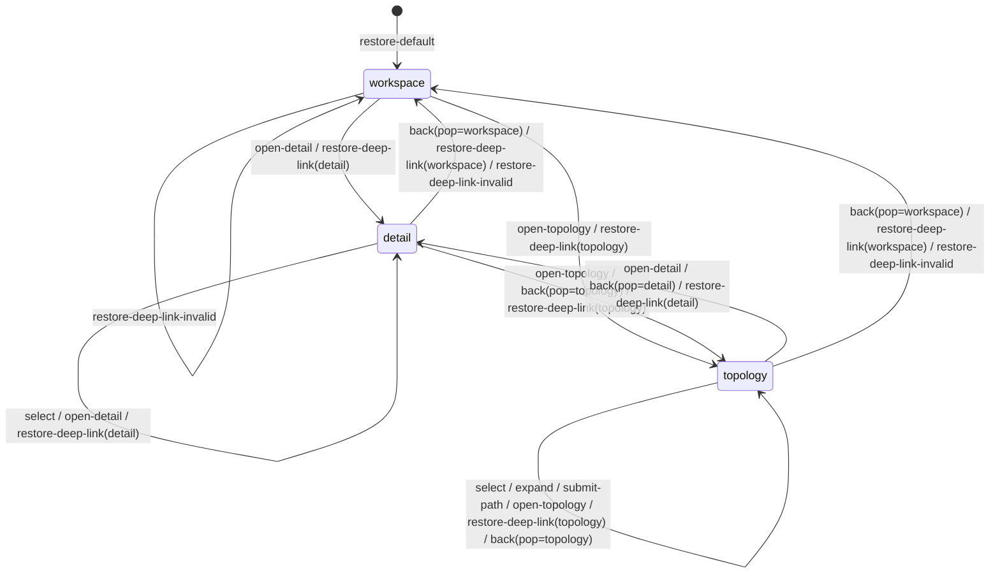
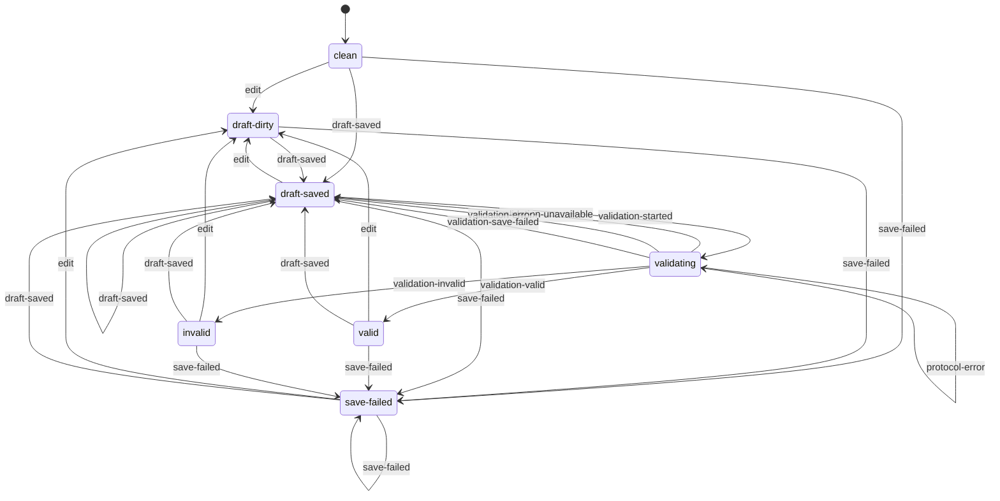

# State Machines: Skill & Dispatch Control Center

Phase 1 owns only explicit workspace navigation and local draft lifecycle. Hyphenated state/event
tokens in the tables are canonical; Mermaid aliases use underscores only because the renderer does
not accept every canonical token as an identifier.

## WorkspaceNavigation

The task-led `workspace` state contains attention plus skill/Dispatch catalogs. Detail and topology
are separate views entered only through explicit events.



### RestorationToken

One immutable token contains:

```text
{
  view,
  object_kind?,
  object_id?,
  model?,
  filters,
  scroll_anchor,
  comparison_set,
  path_query?
}
```

An explicit transition to a different view, or an explicit topology-model change, pushes the
complete current token onto a LIFO `restoration_stack`. Other same-view actions do not push. `back`
pops and restores exactly one token; an empty stack returns to the default workspace token. A deep
link restores every supported tuple member and reports every unsupported or missing member.

### Transition Table

| From | Event | To | Guard | Effect | Authority |
|---|---|---|---|---|---|
| any | `select(object)` | same | Identity valid in loaded scope | Update selection/URL only; no push | [SCD-02](discovery/control-center.md#explicit-transitions) |
| workspace/detail/topology | `open-detail(object)` | detail | Explicit valid object; if already detail, same-view | Push current token only when view changes; open detail | [SCD-02](discovery/control-center.md#explicit-transitions) |
| workspace/detail/topology | `open-topology(object,model)` | topology | Explicit object and exactly one supported model; if already same topology, same-view | Push only when view/model changes; center object, one hop | [SCD-02/03](discovery/control-center.md#explicit-transitions) |
| topology | `expand(depth)` | topology | Depth satisfies [GetTopology bounds](queries.md#gettopology) | Update explicit depth; no push | [GetTopology](queries.md#gettopology) |
| topology | `submit-path(query)` | topology | Request satisfies [FindPath](queries.md#findpath) | Store typed path answer; no push | [SCD-07/08](discovery/control-center.md#6-deterministic-path-query-contract) |
| workspace/detail/topology | `back` | popped view/default workspace | Stack token valid or stack empty | Pop exactly one token or restore default | [SCD-02](discovery/control-center.md#explicit-transitions) |
| any | `restore-deep-link(tuple)` | supported tuple view, otherwise workspace | none | Restore every supported member and report unsupported/missing members | [SCD-02](discovery/control-center.md#explicit-transitions) |

### Invalid Transitions

| From | Event | Result | Authority |
|---|---|---|---|
| any | Selection requests a view change | Apply `select` only; reject navigation | [SCD-02](discovery/control-center.md#explicit-transitions) |
| any | `open-topology` lacks a supported explicit model | `invalid-request`; view/stack unchanged | [SCD-03/07](discovery/control-center.md#6-deterministic-path-query-contract) |
| topology | Node/edge implicitly switches model | Reject; require explicit `open-topology(object,newModel)` | [SCD-03](discovery/control-center.md#4-separate-topology-read-models) |

### Invariants

| ID | Invariant | Formal | Authority |
|---|---|---|---|
| WN-I1 | Selection alone never navigates. | `event=select => next.view=current.view` | [SCC-R-001](SPEC.md#formal-rules-and-invariants) |
| WN-I2 | Topology entry is caused only by an explicit navigation/restoration event. | `next.view=topology && current.view!=topology => event in {open-topology,back,restore-deep-link}` | [SCD-02](discovery/control-center.md#explicit-transitions) |
| WN-I3 | Exactly one topology model is active. | `view=topology => count(active_model)=1` | [SCC-R-002](SPEC.md#formal-rules-and-invariants) |
| WN-I4 | Back restores one LIFO token, or the default workspace when no token exists. | `event=back => next=(stack_nonempty ? pop(restoration_stack) : default_workspace)` | [SCD-02](discovery/control-center.md#explicit-transitions) |
| WN-I5 | Deep-link restoration restores every supported tuple member and reports unsupported or missing parts. | `event=restore-deep-link => restored=supported(tuple) && reported=unsupported_or_missing(tuple)` | [SCD-02](discovery/control-center.md#explicit-transitions) |

## DraftLifecycle



Self-loops for unchanged save and validation-preflight results are defined by the table's exact
closed sets rather than repeated in the diagram. The table is the executable source for grouped
code membership.

### Transition Table

| From | Event/result code | To | Guard | Effect | Authority |
|---|---|---|---|---|---|
| clean/draft-saved/valid/invalid/save-failed | `edit` | draft-dirty | Draft locally editable | Update in-memory proposed patch only | [Phase 1 decision](../../decisions/skill-control-center-phase-1-scope.md#decision) |
| clean/draft-dirty/draft-saved/valid/invalid/save-failed | `draft-saved` | draft-saved | Save matrix success after all gates/atomic commit | Store proposal and next revision exactly once | [Save matrix](operations.md#state-transition-1) |
| clean/draft-dirty/draft-saved/valid/invalid/save-failed | `save-failed` | save-failed | Persistence failed before commit | Retain input; stored revision unchanged | [Save matrix](operations.md#state-transition-1) |
| clean/draft-dirty/draft-saved/valid/invalid/save-failed | `draft-conflict` | same | CAS mismatch | Retain input; refresh/review required | [Save matrix](operations.md#state-transition-1) |
| clean/draft-dirty/draft-saved/valid/invalid/save-failed | `{invalid-draft, forbidden-draft-state, invalid-draft-schema, invalid-draft-patch, unsupported-target-kind, protocol-error}` | same | First matching terminal/consumer code | No write; show code-specific safe action | [Closed save codes](operations.md#state-transition-1) |
| validating or undeclared source | `draft-state-ineligible` | same | Save requested outside declared save-eligible states | No write; return to eligible local state | [Save matrix](operations.md#state-transition-1) |
| draft-saved | `validation-started` | validating | Preflight passes in order: exists, revision, state, validator identity/effect | Bind attempt before availability/execution checks; no draft write | [Validation precedence](operations.md#state-transition-2) |
| draft-saved | `{draft-not-found, draft-conflict, validation-ineligible, invalid-validator, forbidden-validation-effect}` | draft-saved | Preflight returns named code before validating | No state/write; code-specific safe action | [Validation matrix](operations.md#state-transition-2) |
| validating | `validation-valid` | valid | Findings empty and preview commit succeeds | Store complete non-authoritative preview | [Validation matrix](operations.md#state-transition-2) |
| validating | `validation-invalid` | invalid | Findings non-empty and preview commit succeeds | Store complete non-authoritative preview | [Validation matrix](operations.md#state-transition-2) |
| validating | `{validation-unavailable, validation-error, validation-save-failed}` | draft-saved | Named retryable result | Retain request; no partial preview/revision change | [Validation matrix](operations.md#state-transition-2) |
| validating | `protocol-error` | validating | Consumer receives unknown producer code | Discard untrusted result; preserve current state and no partial preview | [AD-007](architecture.md#ad-007) |

### Invalid Transitions

| From | Event | Result | Authority |
|---|---|---|---|
| validating | `save` or `edit` | `draft-state-ineligible`; no write | [Save matrix](operations.md#state-transition-1) |
| clean/draft-dirty/valid/invalid/save-failed | `validate` | First-match result: absent proposal -> `draft-not-found`; stale revision -> `draft-conflict`; otherwise `validation-ineligible` | [Validation precedence](operations.md#state-transition-2) |
| any | `approve`, `apply`, `retry-apply`, `reconcile` | Forbidden; no transition or call | [Phase 1 guardrails](BACKLOG.md#phase-1-guardrails) |
| any | Set accepted/applied/receipt state locally | `protocol-error`; state unchanged | [SCC-R-010/011](SPEC.md#formal-rules-and-invariants) |

### Invariants

| ID | Invariant | Formal | Authority |
|---|---|---|---|
| DL-I1 | Lifecycle is local and non-authoritative. | `for_all transition: authoritative_effects = empty_set` | [Phase 1 decision](../../decisions/skill-control-center-phase-1-scope.md#decision) |
| DL-I2 | `valid` is a preview result only. | `state=valid => authoritative=false` | [SCC-R-011](SPEC.md#formal-rules-and-invariants) |
| DL-I3 | Successful save advances exactly one revision. | `save_success => result_revision=expected_revision+1` | [AD-005](architecture.md#ad-005) |
| DL-I4 | Retryable errors retain input and stored revision. | `retryable(error) => input_retained && stored_revision_after=stored_revision_before` | [AD-006](architecture.md#ad-006), [save matrix](operations.md#state-transition-1), [validation matrix](operations.md#state-transition-2) |
| DL-I5 | No Phase 1 state means applied or accepted. | `states intersect {approved,applying,accepted,applied,reconciling,receipt} = empty_set` | [Phase 1 guardrails](BACKLOG.md#phase-1-guardrails) |

## Deferred Authoritative Lifecycle

Apply, exact retry, reconciliation, conflict recovery and accepted-receipt states are blocked by
[SCC-BL-001](BACKLOG.md#scc-bl-001--terminal-operation-fencing),
[SCC-BL-002](BACKLOG.md#scc-bl-002--reconciliation-and-receipt-lookup), and
[SCC-BL-003](BACKLOG.md#scc-bl-003--conflict-recovery-diagram).
