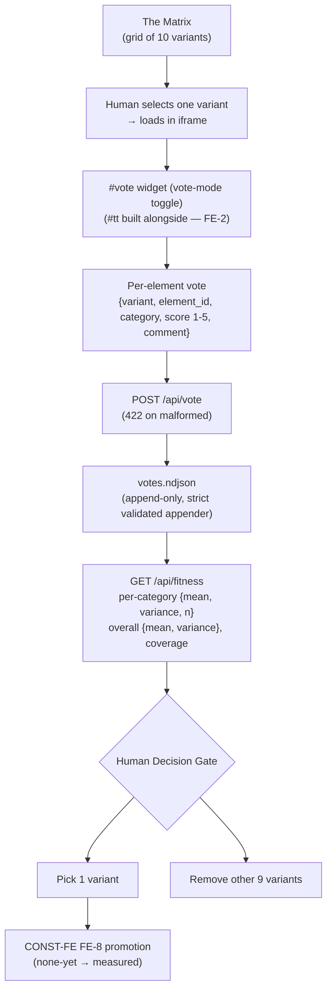

# UI-fitness harness — first cut (measurement substrate)

## Objective

Add a **measurement substrate** to ui-studio: a *Matrix* grid of the ten UI variants
where a human selects one, scores and comments **each element** (score 1–5 + comment
bound to that element's stable id), the votes are appended to a validated
`telemetry/fitness/votes.ndjson`, and `GET /api/fitness` aggregates them into per-category
and overall signals per variant. The human then runs the Decision Gate to pick one variant
and remove the other nine — **the autonomous variant-generating engine is deliberately out
of scope for this cut.**

---

## 1. Business Context

### Why now

Phase 1 shipped a linear multilevel control-plane UI over the append-only ledger
([implementations/README.md](../../../implementations/README.md)), and the human rated it
**too verbose**
([sessions/2026-07-20-1650-ui-studio-const-fe.md:24](../../../sessions/2026-07-20-1650-ui-studio-const-fe.md#L24):
*"o usuário achando a UI linear multinível 'verbosa demais'"*). The frontend constitution's answer is not to erase information but to make
density opt-in and then **measure** the result — yet CONST-FE's core rule **FE-8** is stuck
at `none-yet` precisely because *"no measurement route (fitness harness) exists"*
([vault/constitution/frontend-constitution.md:198](../../../vault/constitution/frontend-constitution.md#L198);
the `Validation` field at [:201](../../../vault/constitution/frontend-constitution.md#L201) says
the same in paraphrase — *"is missing; blocks promotion"*). Without the harness the
constitution cannot promote and the inherited task — pick 1 of the 10 variants, delete 9 —
has no measured criterion to execute against. The evidence base for this cut is already
first-hand verified ([README.md](README.md), `paired-audit-passed`; per-ID verdicts in
[verification.md](verification.md)), so this is design, not further research.

### What's broken

- **No per-element vote capture.** The server exposes `/api/snapshot`, `/api/overview`,
  `/api/repo/{name}`, `/api/dispatch/{repo}/{id}`, `/api/confirm`, `/api/stream` but **no
  `POST /api/vote`**
  ([implementations/server/main.py:69–306](../../../implementations/server/main.py#L69)).
- **The only prior-art vote store is a mutable blob.** Newspaper's `save_vote` persists to
  `telemetry_db.json` — editable in place, no lineage
  ([../ZefraHub/specs/newspaper/evolution/evolution_server.py:377](../../../../ZefraHub/specs/newspaper/evolution/evolution_server.py#L377);
  `validate_vote` at `:346`).
- **The reader ledger cannot host votes.** `ledger.py` is read-only by contract — *"This
  module NEVER writes"*
  ([implementations/server/ledger.py:21](../../../implementations/server/ledger.py#L21)) —
  so votes need their **own** strict validated appender, not a hook into `ledger.py`.
- **Feedback is too coarse.** The newspaper collapsed all voting into a global pill +
  per-article 3-metric popup — no element-level signal
  ([../ZefraHub/specs/newspaper/agents/evolution-wall.md](../../../../ZefraHub/specs/newspaper/agents/evolution-wall.md),
  "Voting UX Consolidation"). This cut's improvement is scoring **each element**.
- **FE-8 blocked → 9 dead variants can't be removed.** No measured criterion exists to
  choose among [implementations/static/ui/](../../../implementations/static/ui/)
  (`aurora, blueprint, brutalist, cyberpunk, grimoire, linear, mission-control, radar,
  swiss, terminal`).

### What stays the same

- **`ledger.py` stays read-only and untouched** — the dispatch ledger and its appender
  (`register-dispatch`) are out of scope; votes get a separate store.
- **The Phase 2 dispatch/confirm flow** (`POST /api/confirm`, the disabled Dispatch button)
  is not touched by this feature.
- **The variants' existing `data-testid` id convention + `UI-CONTRACT.md`** are the id
  substrate we **reuse** — not a new parallel id space (see Core Concept 3).
- **`/api/overview` / `/api/repo` aggregation logic** stays as-is; CONST-FE governs *form*,
  not that logic.
- **Autonomous variant generation** (newspaper's 6-agent genetic loop, Darwin-Gödel,
  Multi-Armed Bandit) is **out of scope** — deferred to a follow-up discovery.

---

## 2. Core Concepts

1. **The Matrix** — the variant-selection surface. A grid of the ten variants as candidate
   "generations"; select one → it loads (iframe) → the human scores it. Modeled on the
   newspaper's proven Matrix view **minus** the genetic machinery. Chosen over a parallel
   new page: it extends the existing selection hub
   ([implementations/static/index.html](../../../implementations/static/index.html)), which
   already lists the ten variants (see OQ-4).

2. **Per-element vote** — a vote is `{variant, element_id, category, score 1–5, comment}`,
   bound to a single element by a **stable id**. This merges the newspaper `AtomicVote`
   (score+comment) with the ui-prototyping-studio `CommentEvent` (per-element target). It is
   the concrete "improve the feedback" delta: the human comments on *each element*, not a
   global blob.

3. **One id, three duals** — the element's existing `data-testid`/`data-*-id` is
   simultaneously the harness **score key** (FE-8), the explain-mode **anchor** (FE-9), and
   the ablation **handle** (FE-10), exactly as CONST-FE FE-10 mandates. **This resolves
   OQ-2:** the bind reuses our own `data-testid` convention (already present in the variants
   and normalized by `UI-CONTRACT.md`), **not** the studio's `data-od-id`.

4. **Validation-mode → gate-type** — the harness is the executable form of CONST-FE's
   Promotion Boundary, honoring the constitution's **three** validation modes (read
   first-hand off each rule's `Validation` field, not the README's two-bucket paraphrase):
   `deterministic` (FE-3, FE-6) → **hard gate** (Playwright, discards on fail); `review`
   (FE-4, FE-7) → **soft gradient** (human 1–5 + comment, never auto-discards); `hybrid`
   (FE-1, FE-2, FE-5, FE-9, FE-10) → **both** — a deterministic sub-check gates *and* a
   soft-gradient human score applies to the same element; `none-yet` (density⊥fatigue,
   FE-8) → **human-objective residue** (the overall vote itself). *(This corrects the clean
   two-bucket map inherited from [README.md](README.md) §6.1, which misfiled FE-1 and FE-5 —
   both `hybrid` per [frontend-constitution.md:123](../../../vault/constitution/frontend-constitution.md#L123),
   [:169](../../../vault/constitution/frontend-constitution.md#L169) — as `review`/`deterministic`.)*

5. **Three granularities of the signal** — `overall (shadow) ⊃ category (FE rule) ⊃ item
   (comment+score)`, the repo's `residue = shadow ⊕ structure` lever applied to the fitness
   number. Aggregation exposes **mean + variance**, never a single clean scalar (avoids false
   precision; OQ-1).

6. **Human performs the mutation** — the harness only *measures*. Choosing the surviving
   variant and removing the nine is a **human Decision Gate / decision-receipt**, not an
   automatic action. Substrate before engine: three prior arts confirm the autonomous part
   must not come first.

---

## 3. Data model — the vote record

Append-only NDJSON at `telemetry/fitness/votes.ndjson`, one JSON object per line, written by
a **strict validated appender** (mirroring the `register-dispatch` discipline: refuse to
write a malformed record; never rewrite a prior line). Reuses the append-only *discipline* of
the ledger, **not** `ledger.py` itself (which never writes).

```jsonc
// one appended vote — every field is client-supplied except ts (server-stamped)
{
  "ts": "2026-07-21T14:03:00Z",   // server-stamped ISO-8601 UTC — client never sends it
  "variant": "linear",             // required; one of the 10 slugs (closed enum)
  "element_id": "dispatch-card",   // required; the element's stable data-testid
  "category": "FE-1",              // required; a scorable CONST-FE rule (closed enum below)
  "score": 4,                       // required; integer 1–5
  "comment": "prompt modal is good; the inline count competes with it",  // required, non-empty
  "by": "victor"                   // required; who voted
}
```

**What the strict appender validates (rejects the whole record on any violation):**

- `variant` ∈ the ten slugs; `category` ∈ the **scorable-rule enum**
  `{FE-1, FE-2, FE-4, FE-5, FE-6, FE-7, FE-9}` — **FE-8 is the *overall*** (not a per-element
  category) and **FE-10 is the ablation meta-rule** (instrumentation, not a scored quality),
  so both are excluded. This is why the old `rule_id`/`category` split is collapsed: the
  category **is** the rule (README §7: "replace the 9 newspaper metrics with the CONST-FE
  rules").
- `score` an integer in 1–5; **`comment` present and non-empty after trim** — a score without
  evidence is rejected (the studio's `critique` rule, E-7, and the whole reason per-element
  *structure* exists rather than a bare shadow score).
- `element_id` is **soft-checked** against the variant's testid manifest (§6): an unknown id
  **warns but still appends** — vote capture must not be coupled to manifest freshness (the
  repo's reader-lenient / appender-strict split).
- **No dedup key on write:** every `POST` is an independent appended fact.

- **Append-only over blob** (improves on newspaper's `telemetry_db.json`): a vote is never
  edited; a **correction is a new appended vote**, and aggregation (§6) keeps only the
  **latest** vote per `(variant, element_id, category, by)` (by `ts`), so a stale or
  double-submitted score never pulls the mean.
- **overall / category signals are derived**, computed by `GET /api/fitness` — never
  persisted as mutable state.

## 4. Interface / API contract

Two new endpoints on the **existing** FastAPI server ([main.py](../../../implementations/server/main.py)):

| Endpoint | Today | This cut |
|---|---|---|
| `POST /api/vote` | absent | appends one validated vote to `votes.ndjson`; 422 on malformed |
| `GET /api/fitness` | absent | per-variant aggregation: per-category `{mean, variance, n}`, `overall {mean, variance}`, `coverage` (elements scored / elements present), total votes |

**`POST /api/vote`** — request body is the §3 vote record **minus `ts`** (server-stamped);
`200 {"ok": true, "appended_at": "<iso>"}` on success (mirroring `/api/confirm`'s shape,
[main.py:271](../../../implementations/server/main.py#L271)); `422 {"ok": false, "errors":
[...]}` listing every schema violation on a malformed record.

**`GET /api/fitness`** — response is a list of variant objects, ordered by `overall.mean`
descending, one per variant that has ≥1 vote:

```jsonc
{
  "variants": [
    {
      "variant": "linear",
      "overall": {"mean": 3.8, "variance": 0.42, "n": 42},   // formula in §6
      "categories": {
        "FE-1": {"mean": 4.1, "variance": 0.30, "n": 12},    // one entry per scored category
        "FE-5": {"mean": 3.2, "variance": null, "n": 1}       // variance is null at n=1
        // a category absent here = not yet scored on this variant
      },
      "coverage": {"scored": 9, "present": 14, "ratio": 0.64}  // §6
    }
    // …one object per variant with ≥1 vote
  ]
}
```

The reader ledger stays read-only; the vote store gets its own appender module (e.g.
`server/votes.py`), keeping the "reader lenient / appender strict" split the repo already
made for dispatches.

## 5. Capture physics — the `#vote` widget

A discreet `#vote` affordance overlaid on the loaded variant (the physics of the studio's
`annotateClickScript`). It is a **sibling to the `#tt` tooltip system CONST-FE FE-2
*proposes*** — `#tt`/`data-tip` is the newspaper's convention (E-3), **not yet built in this
repo** ([FE-2 is `veracity: low — untested here`](../../../vault/constitution/frontend-constitution.md#L131)),
so `#tt` must be **built alongside** `#vote`, not reused.

- **Vote-mode toggle (resolves the FE-1 collision).** A plain click *expands* an element
  (FE-1), so the widget cannot also capture a vote on plain click. Following FE-9's
  explain-mode precedent, a discreet **vote-mode** toggle (off by default, sibling of the
  `?` explain toggle) scopes the behavior: outside it, clicks expand as usual; inside it, a
  click **targets** an element for scoring instead of expanding. Same *reconcile-by-mode*
  pattern CONST-FE Composition uses for FE-3 × FE-9.
- **Targeting & the id.** The element is identified by the **same `data-testid` it already
  carries** (Core Concept 3) — one id serving score, explanation (FE-9), and ablation
  (FE-10). If the click lands on an element with no `data-testid`, the widget walks up to the
  **nearest ancestor that has one**; if none exists, it shows a **"não pontuável"** state
  rather than inventing an id.
- **Category then score.** On target, the widget opens a compact picker of the scorable
  categories (§3 enum); one `(element, category, score 1–5, comment)` is one appended vote,
  so scoring an element on several rules is several votes.

## 6. Aggregation & survival criterion

`GET /api/fitness` aggregates the (deduped-to-latest, §3) votes per variant:

- **category signal** — for each scored category, `{mean, variance, n}` over its latest
  votes. At `n=1` variance is reported as `null` (undefined), never `0`. Variance is the
  **sample** variance.
- **overall** — the **mean of the per-category means** (equal weight across the categories
  that have ≥1 vote), with the variance *across those category means* exposed. Equal-weighting
  categories — instead of pooling raw item scores — stops a heavily-voted category from
  dominating the number. This is the **interim baseline**; **OQ-1** governs any future
  weighting.
- **coverage** — `scored / present`, where **present** = the count of distinct `data-testid`
  in that variant's [`static/ui/<slug>/index.html`](../../../implementations/static/ui/),
  read from a **per-variant testid manifest** (its natural home is `UI-CONTRACT.md`, which
  already owns the testid contract), and **scored** = distinct `element_id`s that carry ≥1
  vote. This makes "we scored 9 of 14 elements" honest, and prevents the degenerate
  denominator "distinct ids ever voted" (which would trivially reach 100%).

The ranking is **advisory**: it surfaces mean **and exposed variance** (never a lone scalar),
and the human runs the Decision Gate
([`.claude/skills/decision-gate`](../../../.claude/skills/decision-gate/SKILL.md)) to pick one
variant and remove nine — recorded as a decision-receipt. This is the moment FE-8's `none-yet`
becomes a measured choice and the first real cycle of data exists.

## 6b. FE-5 on the harness's own surfaces

The Matrix and the `/api/fitness` panel are themselves data-fetching surfaces, so CONST-FE
**FE-5** (loading · error · empty,
[frontend-constitution.md:159–169](../../../vault/constitution/frontend-constitution.md#L159))
governs them like any other: the Matrix shows a **loading** state before variants resolve; a
variant with `coverage.scored = 0` shows an explicit **"ainda não pontuado"** empty state,
never a blank number; a `422` from `POST /api/vote` or a failed `GET /api/fitness` shows an
**inline error with retry**. Scoping this out silently would itself violate the constitution
this discovery is `evidence_for`.

## 7. Cleanup

Nothing is deleted by this discovery. The nine losing variants are removed **by the human**
*after* the first measured cycle, via the Decision Gate — not pre-emptively. The
`_example` pending fixture belongs to the dispatch feature, not here, and is left alone.

## 8. Open questions

- **OQ-1 — soft-gradient weights.** How to combine `review` category scores into an overall
  without inventing precision? *Recommendation:* report **mean + exposed variance**, never a
  single clean scalar; do not weight categories until one real cycle shows which categories
  actually discriminate.
- **OQ-2 — per-element bind id.** **Resolved in Core Concept 3** — reuse the variants'
  existing `data-testid` convention (normalized by `UI-CONTRACT.md`), **not** the studio's
  `data-od-id`; CONST-FE FE-10 mandates one id serving score/explain/ablation. Kept here only
  as a pointer.
- **OQ-3 — action-bearing amendment (FE-8).** Does the "every overall routes to owner +
  action + evidence" amendment land now or after one cycle? *Recommendation:* after one real
  cycle, so the amendment is shaped by observed signal, not anticipated.
- **OQ-4 — Matrix as new page or hub mode.** *Recommendation:* extend the existing selection
  hub ([static/index.html](../../../implementations/static/index.html)) into The Matrix
  (UNVOTED / VOTED / ALL toggle) rather than build a parallel page — it already enumerates
  the ten variants.

---

## Connections

No `derives-from` edge: this discovery is **reconnaissance** resting on the already-verified
evidence in [README.md](README.md) / [verification.md](verification.md), which are the
feature's cited-evidence map — not a canonical `research` artifact. No `contradicts` edge:
no sibling discovery asserts incompatible things. The relationship to **CONST-FE** (this
discovery is evidence *for* the FE-8 promotion) is carried by the `evidence_for` frontmatter,
not as an edge.

---

## Flow Diagram



The diagram traces the harness end to end: a human picks a variant on The Matrix, scores it element by element through the `#vote` widget, and each per-element vote is posted to `POST /api/vote` and appended to the validated `votes.ndjson` store. `GET /api/fitness` reads that store back into per-category and overall mean+variance signals, which feed the human Decision Gate — the only actor allowed to act on the numbers. From the gate, the human picks one variant (unblocking CONST-FE FE-8 promotion) and removes the other nine; read top to bottom, arrows show data flowing up through capture and aggregation, then decisions flowing back down as human action.
