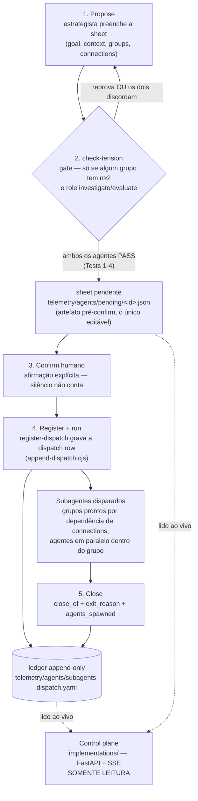

# cyberalchemy-orchestrator *(nome provisório)*

> **Estatuto:** semente, **não-revisada**, local (sem push). Claim ≤ proof. A disciplina
> de dispatch (check-tension → confirm → ledger → close) roda de verdade e tem ~700 rows
> reais em 11 repos-irmãos. O control plane que **lê** esse ledger (Fase 1) está construído
> e testado. O botão que **escreve** (Fase 2) existe na UI mas está `disabled` por design —
> ligá-lo é trabalho futuro, não um bug. Nada aqui está tipado em Lean.

## O que é isto?

Este repo é onde a disciplina de **dispatch de subagentes** — proposta → gate anti-viés →
confirm humano → registro em ledger append-only → execução → fechamento — é operada e
observada. Duas peças concretas fazem esse sistema rodável:

- **`implementations/`** — o **dispatch control plane**: um servidor FastAPI + SSE
  somente-leitura que lê, ao vivo, o ledger de dispatches de todos os repos-irmãos (e as
  sheets pendentes pré-confirm), com dez variantes de UI sobre o mesmo contrato de API.
- **`tools/agent-pool-mcp/`** — um servidor MCP cross-repo que resolve o `agent_name` de um
  agente a partir do pool canônico (`telemetry/agents/agent-pool.yaml`, 419 entradas
  tagueadas), combinando um núcleo determinístico com um julgamento barato via Haiku.

O ledger que os dois consomem/alimentam — `telemetry/agents/subagents-dispatch.yaml` — é a
fonte de verdade: **append-only**, escrito apenas pelo appender validado da skill
`register-dispatch`, nunca editado em lugar. Um hook bloqueia até leitura via Bash direto no
arquivo — a leitura estrutural passa pelo `server/ledger.py` do control plane.

## O fluxo de dispatch, ponta a ponta



O appender é **estrito** (recusa gravar um registro fora do schema v0.6.0, exit 2 com a
lista de erros) e **estrutural-mente autoprotegido** (se o ledger já estiver corrompido,
recusa gravar qualquer coisa nova até a corrupção ser corrigida). O leitor do control plane
faz o oposto por design: é **leniente** — ver "Duas decisões que os dados forçaram" abaixo.

## Anatomia de uma dispatch row / close row

Cada dispatch contribui **exatamente dois appends** no mesmo ledger (Principle 3 da
constituição de subagents-strategy): a dispatch row na hora do disparo, a close row no
fechamento. `groups` e `connections` (dispatch row) e `agents_spawned`/`feedback_prompts`
(close row) são colunas JSON dentro da linha YAML.

**Dispatch row — nível topo:**

| Campo | Obrigatório | O quê |
|---|---|---|
| `dispatch_id` | sim | `YYYY-MM-DD-<slug>`, chave de dedup |
| `schema_version` | sim | `"0.6.0"` exato |
| `dispatch_type` | sim | `research \| review \| experiment` (LIVE) — `code \| plan \| suggestion` são reservados |
| `goal` / `context` | sim | objetivo em 1-2 frases / framing em 2-4 frases — o único canal que os subagentes recebem |
| `max_loops` | sim | inteiro 1-5, teto de re-execução da sequência inteira |
| `final_approver` | sim | `"parent"` ou o `agent_name` de um aprovador dedicado (nunca membro do grupo de trabalho) |
| `groups` | sim | array JSON — ver abaixo |
| `connections` | não | array JSON de arestas tipadas — ver abaixo |
| `anti_bias_global` | sim se ≥2 grupos com fan-out | eixo de tensão do dispatch inteiro |
| `working_folder` | sim para `research`/`experiment` | caminho relativo de saída; nunca começa com `vault/` |
| `meta` | não | `true` só em dispatches sobre dispatchar |
| `parent_dispatch_id` | não | só quando planejado por um dispatch `meta: true` |
| `created`, `invoked_by` | carimbados | `created` é sempre gerado pelo appender — enviá-lo é rejeitado |

**Cada objeto de `groups[]`:** `group_id` (alvo de `connections`), `agents[]`, `n` (se
presente deve bater com `agents.length`), `robot_talks` (bool — agentes discutem após a
rodada paralela), `layers`, `anti_bias` (obrigatório se `n≥2`).

**Cada objeto de `groups[].agents[]`:** `role` (`explorer \| skeptic \| writer \| auditor`),
`model`, `token_budget`, `initial_prompt`, `agent_name` (do pool ou `null`), `angle`
(obrigatório se o grupo tem `n≥2`).

**Cada objeto de `connections[]`:** `{from, to, type, loop_cap?}` — `type` é
`sequential \| zig-zag \| feedback`; `loop_cap` só é permitido em `zig-zag`/`feedback`.

**Close row:**

| Campo | Obrigatório | O quê |
|---|---|---|
| `close_of` | sim | `dispatch_id` sendo fechado (dedup key; sem row correspondente = aviso de órfão) |
| `exit_reason` | sim | `resolved \| loop_ceiling_reached \| dissent_irreconcilable \| user_abort \| error` |
| `agents_spawned` | sim | `{total, tree: {explorer, skeptic, writer, auditor, helpers}, loops_used}` |
| `feedback_prompts` | não | array — cada pedido de uma aresta `feedback`, registrado verbatim |
| `closed` | carimbado | ISO timestamp gerado pelo appender |

## Quick Start / Como rodar

### 1. Control plane (o leitor)

```sh
pip install -r implementations/requirements.txt
cd implementations
python -m server.main
# http://127.0.0.1:8765  — a raiz serve o hub de seleção das dez variantes de UI
```

Sem `config.json`, o servidor **auto-descobre**: varre o diretório pai atrás de qualquer
pasta-irmã com `telemetry/agents/`. Para fixar a lista de repos, copie
`implementations/config.example.json` para `implementations/config.json`.

### 2. Testes do control plane

```sh
python implementations/tests/test_ledger.py       # parser + smoke contra os ledgers reais
python implementations/tests/test_ui.py            # Playwright nas dez variantes
python implementations/tests/test_ui.py terminal    # só uma variante
```

Screenshots caem em `implementations/tests/screenshots/`.

### 3. MCP agent-pool (seleção de `agent_name`)

```sh
cd tools/agent-pool-mcp
npm install
npm run smoke          # caminhos determinísticos, sem chave de API
```

Registro cross-repo, escopo de usuário — em `~/.claude.json` (ou `.mcp.json` de um repo):

```json
{
  "mcpServers": {
    "agent-pool": {
      "command": "node",
      "args": ["C:\\Users\\victo\\cyberalchemy-orchestrator\\tools\\agent-pool-mcp\\src\\server.mjs"],
      "env": { "ANTHROPIC_API_KEY": "sk-ant-..." }
    }
  }
}
```

Sem `ANTHROPIC_API_KEY`, `recommend_agents` degrada para o pré-filtro determinístico (modo
`deterministic-fallback`); `search_pool` e `check_vocab` nunca precisam de chave.

## API do control plane

| Endpoint | O quê |
|---|---|
| `GET /api/snapshot` | Estado inteiro, janela recente por repo (até `limit`=40 por repo). |
| `GET /api/stream` | SSE — emite `event: snapshot` sempre que o disco muda; conecte com `EventSource`. |
| `GET /api/dispatch/{repo}/{dispatch_id}` | Uma dispatch sem truncar prompts (painel de detalhe). 404/500 conforme o caso. |
| `GET /api/overview` | Agregados de TODOS os repos + filas de atenção humana (pendentes, abertas hoje, todas abertas — cap de 200). Nada truncado por `limit`. |
| `GET /api/repo/{name}` | Drill-down de um repo: histórico completo em forma `slim`, `summary` e `series` (histograma diário). Filtros `?state=open\|closed\|all` e `?type=<dispatch_type>` — filtram só a lista, nunca o `summary`/`series`. |

Contrato completo (formas exatas, `data-testid` obrigatórios, convenção de prefixo `_` para
campos calculados, referencial de dia em UTC): `implementations/UI-CONTRACT.md`.

**Duas decisões que os dados reais forçaram** (detalhadas em `implementations/README.md`):

1. **O leitor é leniente; o appender é estrito.** Rows antigas prettificadas (JSON
   multi-linha, vírgulas finais) que o appender rejeitaria ainda precisam aparecer — em modo
   estrito o leitor devolvia 0 dispatches para o repo `domainspec`; leniente, devolve 55.
2. **Prefixo `_` é escopado a objetos com FORMA DE ROW.** `status` é uma chave real de rows
   pré-v0.5.2; um campo calculado com esse nome, num objeto que compartilha o namespace de
   uma row, sobrescreveria dado histórico. Agregados que não são rows (`summary`, `series`,
   `totals`) não têm esse namespace a proteger e usam chaves sem prefixo.

## Estrutura do repositório

```
cyberalchemy-orchestrator/
├── PLAN.md                        # o plano por etapas E0-E4, com collapse-tests
├── FRAMINGS.md, MAPPING.md, OBLIGATIONS.md
├── definitions/DEFINITIONS.md     # protocolo de definições, termos DEF-ORCH-*
├── .claude/skills/                # skills operacionais deste repo
│   ├── register-dispatch/         # dono da forma da sheet + o appender (append-dispatch.cjs)
│   ├── check-tension/             # o gate anti-viés init-time (Tests 1-4)
│   ├── domainspec-subagents-strategy/  # o router: quando dispatchar, lifecycle de 4 passos
│   └── ...                        # ~65 outras skills (research, review, close-session, ...)
├── telemetry/agents/
│   ├── subagents-dispatch.yaml    # O LEDGER — append-only, ~700 rows reais, 11 repos
│   ├── agent-pool.yaml            # pool canônico de agent_name (419 entradas, 721 tags)
│   └── pending/                   # sheets pré-confirm (1 fixture de demonstração hoje)
├── implementations/               # o dispatch control plane — ver seção acima
│   ├── server/ (main.py, ledger.py, config.py)
│   ├── static/ui/<slug>/          # dez variantes de UI (aurora, blueprint, brutalist,
│   │                               #  cyberpunk, grimoire, linear, mission-control,
│   │                               #  radar, swiss, terminal), cada uma um HTML autocontido
│   ├── UI-CONTRACT.md             # contrato normativo (API + testids)
│   └── tests/                     # test_ledger.py, test_main.py, test_ui.py (Playwright)
├── tools/agent-pool-mcp/          # servidor MCP — seleção de agent_name cross-repo
├── research/                      # dispatches de pesquisa com working_folder próprio
├── sessions/                      # nós de sessão fechados (close-session)
├── vault/constitution/, vault/hypothesis/
└── docs/                          # features, essays, este README candidato
```

## Fases

| Fase | O quê | Estado |
|---|---|---|
| **Fase 1 — o leitor** | FastAPI + SSE somente-leitura sobre o ledger e as sheets pendentes; dez variantes de UI sobre um contrato de testids único | **Feita** — testada (`test_ledger.py`, `test_ui.py`) |
| **Fase 2 — o botão** | `POST /confirm` grava o confirm; o Claude, esperando via `Monitor`, segue a cadeia normal (`check-tension` → `register-dispatch` → agentes → close row). Quem dispara continua sendo o Claude na sessão — preserva contexto e a cadeia de skills | Planejada — o botão "Disparar" já existe em toda UI, `disabled` |
| **Fase 3 — edição** | Editar a sheet pendente antes do confirm (hoje só leitura) | Planejada |

## Por onde começar

1. **[`PLAN.md`](../../PLAN.md)** — o plano por etapas (E0-E4) e o porquê do repo: modelar
   conhecimento tendo o orquestrador de agentes como primeira peça concreta.
2. **[`.claude/skills/register-dispatch/SKILL.md`](../../.claude/skills/register-dispatch/SKILL.md)**
   (com **[`.claude/skills/check-tension/SKILL.md`](../../.claude/skills/check-tension/SKILL.md)**
   ao lado) — a disciplina que grava cada linha do ledger: campos, enums, o appender, o gate
   anti-viés, a close row.
3. **[`implementations/README.md`](../../implementations/README.md)** — o control plane
   rodável: por que existe, como rodar, as duas decisões que os dados reais forçaram, as
   próximas fases.

Para a definição de qualquer termo (`sonda`, `zig-zag`, `resíduo`, `dispatch`, ...):
`definitions/DEFINITIONS.md`.
