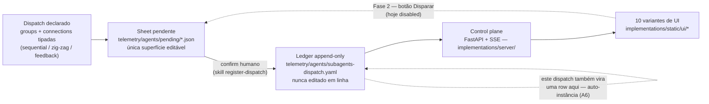

# cyberalchemy-orchestrator *(nome provisório)*

> **Status:** semente / brainstorm, **não-revisado**, local (sem remote, sem push).
> `Claim ≤ proof`: toda afirmação abaixo vale só até onde o arquivo linkado prova — trate
> "é uma categoria" como "candidato a tipar", não como resultado. Nada aqui está tipado em
> Lean *dentro deste repo* ainda. Criado 2026-07-18, primeira sessão de trabalho real
> 2026-07-20.

Este README orienta quem abre o repo pela primeira vez: **o que é isto, por que existe, o
que já roda hoje vs. o que é tese, e quais 3 documentos ler primeiro.**

## O que é isto?

Este repo tem duas camadas, e a confusão entre elas é o erro mais fácil de cometer na
primeira leitura. A camada **concreta** é um **orquestrador de subagentes**: uma disciplina
de dispatch (grupos de agentes + conexões tipadas `sequential`/`zig-zag`/`feedback`,
registradas num ledger append-only) e, sobre ela, um **control plane** — um servidor FastAPI
com dez variantes de UI que leem, ao vivo, o que está pendente de confirmação humana e o que
já foi disparado. Isso roda hoje, tem testes, e você pode subir localmente em minutos (ver
[Como rodar o control plane](#como-rodar-o-control-plane) abaixo). A camada **tese** é mais
ambiciosa e muito menos madura: a aposta de que essa própria linguagem de orquestração
(grupos, conexões, dispatches) **é** uma categoria matemática — objetos, morfismos,
composição, identidade — e que subir de conhecimento significa enriquecer o codomínio dessa
categoria rumo ao ponto de Yoneda, nunca simplificar para um resumo escalar. Essa tese ainda
não foi provada em lugar nenhum; ela vive em [`FRAMINGS.md`](../../FRAMINGS.md),
[`MAPPING.md`](../../MAPPING.md) e no alvo falsificável único de
[`OBLIGATIONS.md`](../../OBLIGATIONS.md). As duas camadas se tocam num ponto: o próprio
trabalho de construir este repo é feito por dispatches que ficam gravados no mesmo ledger que
o orquestrador opera — a tese chama isso de "framework as its own instance" (BACKLOG A6).

## Por que existe

A ambição de fundo é modelar **conhecimento** — o que é, que propriedades tem, como se
relaciona, quem age sobre ele — com estrutura suficiente para produzir sistemas, inclusive a
si mesmo. Construir essa máquina inteira de uma vez não é tratável. A primeira fatia
executável dessa ambição é menor e testável: um orquestrador de agentes que investiga,
sintetiza e critica conhecimento, com uma disciplina anti-viés já madura (tensão pairwise,
gate `check-tension`, ledger append-only, aprovação sem auto-aprovação) emprestada do
repo-irmão `domainspec`. Este repo existe para consolidar esse material espalhado, dar a ele
uma peça concreta rodável (o control plane) e, em paralelo — sem inflar uma coisa para
sustentar a outra —, testar se a linguagem por trás dele tem mesmo o tipo categórico que a
tese propõe.

## Como as peças se encaixam



O ledger só é escrito **depois** do confirm humano — é o gate. Uma UI que lesse só o ledger
sempre chegaria tarde, porque nunca poderia *ser* o gate. Por isso a Fase 1 do control plane
lê também a sheet pendente (`telemetry/agents/pending/`), o único artefato pré-confirm e
editável; o ledger continua append-only e intocado por ela. A "Fase 2" (o botão) ainda não
existe — ver a seção seguinte.

## O que já roda hoje vs. o que é tese

Este é o ponto onde vale ser mais honesto do que empolgado.

**Roda hoje (código, com testes, você pode executar agora):**

- O **control plane de leitura** (Fase 1): servidor FastAPI + SSE em
  [`implementations/`](../../implementations/), com dez variantes de UI sobre a mesma API,
  parser leniente do ledger, testes de parser (`tests/test_ledger.py`) e testes Playwright
  contra as dez variantes (`tests/test_ui.py`).
- O **ledger real**: [`telemetry/agents/subagents-dispatch.yaml`](../../telemetry/agents/subagents-dispatch.yaml)
  já tem centenas de dispatches reais registrados pela skill `register-dispatch` — incluindo,
  literalmente, os dispatches que construíram e revisaram o próprio control plane.
- O **agent-pool-mcp**: servidor MCP rodável em
  [`tools/agent-pool-mcp/`](../../tools/agent-pool-mcp/) (`npm run smoke` não precisa de
  chave de API), que seleciona `agent_name` a partir do pool canônico em
  [`telemetry/agents/agent-pool.yaml`](../../telemetry/agents/agent-pool.yaml).
- As **skills operacionais** em [`.claude/skills/`](../../.claude/skills/) —
  `register-dispatch`, `check-tension`, `robot-talks`, `domainspec-subagents-strategy` —
  executáveis via Claude Code hoje, não roteiro futuro.

**É tese / candidato, não prova:**

- **[OBLIGATIONS.md](../../OBLIGATIONS.md)** — a pergunta "a linguagem de orquestração é uma
  categoria de verdade?" (OBL-E3) está **OPEN**. Sem ela descarregada, todo paralelo em
  `MAPPING.md` é candidato tipado, não resultado.
- **[MAPPING.md](../../MAPPING.md)** e **[FRAMINGS.md](../../FRAMINGS.md)** — os paralelos
  entre construtos do orquestrador (sonda, verbo, resíduo, zig-zag) e teoria das categorias
  são hipóteses com âncora (frequentemente em outro repo, `domainspec-lean-formalization`),
  não teoremas deste repo.
- **[`vault/hypothesis/orquestracao-anti-ruido.md`](../../vault/hypothesis/orquestracao-anti-ruido.md)**
  (`HYP-ORCH-NOISE`) — a tese de que o orquestrador é uma "máquina de redução de ruído" —
  status `candidate`/`exploratory` explícito no frontmatter, com várias seções marcadas
  `PENDENTE` inline.
- A **Fase 2 do control plane** (o botão "Disparar" que grava o confirm) não está
  implementada; todo botão nas dez UIs está `disabled` de propósito.
- **Nada neste repo está tipado em Lean.** As âncoras Lean citadas em `DEFINITIONS.md`,
  `FRAMINGS.md` e `OBLIGATIONS.md` apontam para arquivos do repo-irmão
  `domainspec-lean-formalization` — aqui elas são referência, não prova local.

## Navegação

| Caminho | O quê |
|---|---|
| [`README.md`](../../README.md) | README atual do repo (raiz) — mais curto que este candidato, mesma tese em miniatura. |
| [`PLAN.md`](../../PLAN.md) | O objeto enxuto: problema, mapa do material bruto, plano em etapas com collapse-tests, protocolo de definições. |
| [`FRAMINGS.md`](../../FRAMINGS.md) | Ledger dos enquadramentos F1–F7 da sessão de origem — a anatomia da tese categórica. |
| [`MAPPING.md`](../../MAPPING.md) | Ledger vivo de paralelos construto-de-agente ⟷ tipo categórico, com força e collapse-test por linha. |
| [`OBLIGATIONS.md`](../../OBLIGATIONS.md) | O alvo falsificável único (OBL-E3): a linguagem de orquestração é mesmo uma categoria? |
| [`definitions/DEFINITIONS.md`](../../definitions/DEFINITIONS.md) | Vocabulário normativo (resíduo, separação, sombra, sonda, verbo) — uma definição por termo, fonte única. |
| [`implementations/`](../../implementations/) | O control plane rodável (Fase 1: leitor). Ver [`implementations/README.md`](../../implementations/README.md) e o contrato [`implementations/UI-CONTRACT.md`](../../implementations/UI-CONTRACT.md). |
| [`tools/agent-pool-mcp/`](../../tools/agent-pool-mcp/) | MCP cross-repo que seleciona `agent_name` do pool canônico. |
| [`telemetry/agents/subagents-dispatch.yaml`](../../telemetry/agents/subagents-dispatch.yaml) | O ledger append-only — o coração operacional. Nunca editar em linha; só via `register-dispatch`. |
| [`telemetry/agents/agent-pool.yaml`](../../telemetry/agents/agent-pool.yaml) | Pool canônico de personas (`agent_name`) para dispatch, com tags e `role_fit`. |
| [`telemetry/agents/pending/`](../../telemetry/agents/pending/) | Sheets pré-confirm — a única superfície editável antes do ledger. |
| [`vault/hypothesis/`](../../vault/hypothesis/) | Hipóteses exploratórias, ainda não promovidas a constituição (ex.: `HYP-ORCH-NOISE`). |
| [`vault/constitution/`](../../vault/constitution/) | Regras já ratificadas (ex.: `frontend-constitution.md`). |
| [`docs/essays/orquestrador-anti-ruido/`](../../docs/essays/orquestrador-anti-ruido/) | Ensaio derivado da `HYP-ORCH-NOISE` — o orquestrador como máquina de redução de ruído (viés ⊕ ruído). |
| [`docs/features/ui-studio/`](../../docs/features/ui-studio/) | Feature em design: harness de fitness para as variantes de UI. |
| [`research/`](../../research/) | Investigações pontuais, uma pasta por pergunta (ex.: inventário de UI nos repos-irmãos). |
| [`sessions/`](../../sessions/) | Registro das sessões de trabalho que produziram o repo. |
| [`.claude/skills/`](../../.claude/skills/) | Skills executáveis via Claude Code — `register-dispatch`, `check-tension`, `robot-talks`, entre dezenas de outras. |

## Por onde começar

Se esta é sua primeira visita, leia estes três documentos **nesta ordem**:

1. **[`implementations/README.md`](../../implementations/README.md)** — a peça que já roda:
   o que o control plane é, por que existe (o ledger só é escrito pós-confirm, então uma UI
   que só lê o ledger sempre chega tarde), e como subir localmente.
2. **[`PLAN.md`](../../PLAN.md)** — o objeto enxuto por trás de tudo: o problema, o material
   bruto já espalhado por outros repos, e o plano em etapas (cada uma com seu collapse-test).
3. **[`OBLIGATIONS.md`](../../OBLIGATIONS.md)** — se você quiser a profundidade da tese
   categórica: o único alvo falsificável que decide se a linguagem de orquestração é
   matemática ou metáfora. Leitura opcional para quem só quer usar o control plane.

## Como rodar o control plane

```sh
cd implementations
pip install -r requirements.txt
python -m server.main
# abre em http://127.0.0.1:8765 — a raiz serve o hub de seleção das dez variantes
```

`requirements.txt` vive dentro de `implementations/`, não na raiz do repo — entre na pasta
antes de instalar. É **somente leitura**: nenhum comando aqui escreve no ledger; o botão
"Disparar" existe em todas as UIs mas está `disabled` (Fase 2, ainda não construída). Para
rodar os testes:

```sh
python implementations/tests/test_ledger.py      # parser + smoke nos ledgers reais
python implementations/tests/test_ui.py          # Playwright nas dez variantes
```
