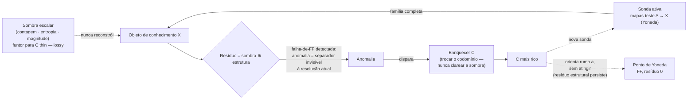

# cyberalchemy-orchestrator *(nome provisório)*

> **Estatuto:** candidato, **não-revisado**, local (sem remote). `Claim ≤ proof`: cada
> linha abaixo é uma decoração candidata a tipar, não um resultado. **Nada aqui está
> provado em Lean.** Onde a âncora é fraca (memória, Lean não-commitado, síntese nossa),
> o documento-fonte marca isso explicitamente — este README herda essa disciplina e não
> a relaxa. Criado 2026-07-18; este README, 2026-07-20.

## O que é isto?

Este repositório não é, em primeira instância, um orquestrador de agentes. É a semente de
uma **máquina de conhecimento** — um projeto para modelar conhecimento (o que é, suas
propriedades, suas relações, seus efeitos, quem age sobre ele) com estrutura suficiente
para **produzir sistemas**, inclusive a si mesma, usando a si mesma. O orquestrador de
agentes que se está construindo aqui — o leitor de dispatches em
[`implementations/`](../../implementations/README.md), o ledger em
[`telemetry/agents/subagents-dispatch.yaml`](../../telemetry/agents/subagents-dispatch.yaml)
— é a **primeira fatia executável** dessa ambição, não o projeto inteiro. Ele existe
porque uma máquina de conhecimento precisa de algo que investigue, sintetize e critique
conhecimento em seu nome; construir esse algo é a forma mais rápida de testar a tese
contra a realidade.

A tese registrada (não inflada) é a de auto-instância — nomeada no repo-mãe como
BACKLOG A6, *"framework as its own instance"*: o próprio trabalho de construir este
repositório é uma instância do framework epistemológico que ele estuda. Isso não é uma
afirmação nova cunhada aqui — é a auto-aplicação apontada para o processo de produção de
conhecimento que já está em curso. E a honestidade exigida por essa tese é dupla: uma
instância *declarada* não é prova de que o processo obedeça o framework — é uma
descrição candidata, tão falsificável quanto qualquer outra linha deste repositório. Veja
[PLAN.md §1](../../PLAN.md#1-problema).

## O fio comum

Toda a anatomia deste repositório — resíduo, sombra, separação, sonda, verbo — circula
uma única alavanca: **thin vs não-thin, a escolha do codomínio `C`**.

Um objeto de conhecimento `X` é visto através de um funtor para algum codomínio `C`. Se
`C` é **thin** (uma categoria onde entre dois objetos há no máximo um morfismo — o caso
degenerado de uma ordem ou de um conjunto), a leitura que se obtém é uma **sombra**:
contagem, entropia, magnitude — um número que resume o objeto e joga fora o objeto. Se
`C` é **não-thin** (morfismos carregam estrutura — tipos, regras, composições distintas),
a leitura preserva a **estrutura** que a sombra descarta. O **resíduo** — o que qualquer
tradução ou síntese deixa de preservar — decompõe-se exatamente nessas duas faces:
`resíduo = sombra ⊕ estrutura` ([FRAMINGS.md F1](../../FRAMINGS.md#f1--resíduo--sombra--estrutura)).

Ascender no conhecimento, sob essa alavanca, **nunca** significa clarear a sombra — apurar
a métrica, refinar a contagem. Significa **enriquecer `C`**: trocar o codomínio thin por
um mais rico, até que a interrogação ativa do objeto por mapas-teste (`A → X`, uma
**sonda**, no sentido de Yoneda) se torne *fully faithful* — o **ponto de Yoneda**, onde
o resíduo estrutural vai a zero porque a família de sondas reconstrói o objeto inteiro
([DEF-ORCH-004](../../definitions/DEFINITIONS.md#def-orch-004)). Esse ponto é o alvo
declarado; a honestidade exigida (ver o diagrama abaixo) é que, em domínios com
self-modeling operativo — este repositório entre eles — ele é **inatingível por
construção**: o que sobra não é indefinição, é sinal. Uma **anomalia** — uma falha de
*fully faithful* detectada, duas coisas que a lente atual identificava revelando-se
distintas sob uma sonda nova — é o motor que aponta onde `C` precisa crescer
([FRAMINGS.md F6](../../FRAMINGS.md#f6--o-ponto-de-yoneda-como-alvo-a-anomalia-como-motor-a-dinâmica)).
Essa é a definição operacional do processo científico que este repositório assume para
si mesmo.

**Nota de honestidade sobre o diagrama.** A leitura ingênua — "o ponto de Yoneda é um
alvo que se atinge no fim de uma escada finita" — já caiu num debate registrado em
[FRAMINGS.md F6 (status 2026-07-20)](../../FRAMINGS.md#f6--o-ponto-de-yoneda-como-alvo-a-anomalia-como-motor-a-dinâmica):
`y` é *fully faithful* de graça e o endpoint resíduo-zero é vacuoso. O que sobrevive não
é a chegada, é a **trajetória ordenada de enriquecimento** — e mesmo essa trajetória tem
estrutura própria: [F7](../../FRAMINGS.md#f7--duas-espécies-de-sonda--os-dois-eixos-independentes-com-ordem-de-apresentação)
distingue uma sonda-de-reconhecimento (que acha *quais objetos existem*) de uma
sonda-de-ligação (que estabelece *as relações* entre eles já achados), com a segunda
dependendo de tipagem da primeira — não uma escada linear, um poset graduado.

## Vocabulário normativo — as 5 definições

Fonte única: [`definitions/DEFINITIONS.md`](../../definitions/DEFINITIONS.md). Cada termo
carrega Status · Voz científica/formal · Interpretação operacional · Fronteira ·
Tipo categórico + âncora Lean — todas `status: candidato`, nenhuma promovida a premissa.

| ID | Termo | O traço, em uma linha |
|---|---|---|
| DEF-ORCH-001 | **resíduo** | O objeto de duas faces (sombra ⊕ estrutura) que um verbo deixa de preservar — não o relatório da perda, a coisa em si. |
| DEF-ORCH-002 | **separação** | O primitivo anterior à contagem: sem sinal individuante, indiscernível = idêntico; contar é derivado, nunca fundacional. |
| DEF-ORCH-003 | **sombra** | A face escalar do resíduo — funtor para uma categoria *thin*; separa, mas não reconstrói. |
| DEF-ORCH-004 | **sonda** | Interrogação ativa por mapas-teste `A → X` que se escolhe; a família completa reconstrói o objeto (Yoneda *fully faithful*). |
| DEF-ORCH-005 | **verbo** | Um morfismo mais a condição sob a qual preserva a simetria do objeto; fora dela, gera resíduo — mensurável por-verbo. |

## Construto ⟷ tipo categórico (a espinha do vault)

A regra herdada é dura: **todo construto da linguagem-de-agentes precisa de um tipo em
teoria das categorias e de uma âncora num arquivo Lean real** — sonda e zig-zag foram só
os dois primeiros exemplos. A tabela completa (ledger vivo, com estatuto e força de cada
linha) vive em [`MAPPING.md`](../../MAPPING.md); esta é a amostra que carrega o peso
argumentativo:

| Construto (linguagem-de-agentes) | Tipo CT candidato | Força |
|---|---|---|
| `concat` de resultados (sem `robot_talks`) | **coproduto** — thin, count-shaped | estrutural |
| `synthesis` (com `robot_talks: true`, tensão) | **pushout / colimit** — identifica sobreposição, **gera resíduo mensurável** | candidato forte |
| conexão `sequential` | composição `∘` | estrutural |
| conexão `zig-zag` | identidades triangulares / `EqvGen` ida-e-volta | candidato forte |
| conexão `feedback` | **NÃO** um morfismo de 1-nível — 2-célula (fora do 1-esqueleto) | candidato, evidência positiva p/ o risco de OBL-E3 |
| dispatch (grupos + conexões) | diagrama tipado `J → Cat` | candidato |
| `check-tension` / eixos anti-viés (n≥2) | família de sondas jointly-faithful — cada eixo, um separador ortogonal | candidato forte |
| `meta:true` + `parent_dispatch_id` (linhagem) | endofunctor / **free monad** sobre árvore bem-fundada — mecaniza a tese A6 | candidato forte |
| resíduo de uma síntese | `FunctorialResidueStructure` — unit de Lan não-iso | estrutural |

O achado central desta tabela — **concat = coproduto vs synthesis = pushout** — é o que
liga a mecânica do `robot_talks` (definida na skill `subagents-strategy`, não neste repo)
diretamente a DEF-ORCH-001: uma síntese sob tensão *literalmente* produz o objeto de duas
faces que o repo chama de resíduo. É também metade do caminho para descarregar a
sub-obrigação 3 de OBL-E3, abaixo.

## OBL-E3 — o teste que decide tudo

Nada neste repositório é resultado até que uma obrigação específica seja descarregada.
Ela vive em [`OBLIGATIONS.md`](../../OBLIGATIONS.md) e enuncia com precisão o que teria
que ser provado para o vault deixar de ser metáfora:

> Existe uma categoria `ORCH` onde **objetos** = grupos de dispatch, **morfismos** =
> `connections` tipadas (`sequential` / `zig-zag` / `feedback`), **composição** =
> concatenação de pipeline, **identidade** = grupo pass-through?

Três sub-obrigações, todas precisam valer: (1) associatividade das conexões encadeadas;
(2) leis de identidade do grupo pass-through; (3) o resíduo de uma síntese ser o **mesmo
objeto** que `FunctorialResidueStructure` — não apenas um resíduo count-shaped.

O risco não está escondido — está nomeado no próprio documento: `zig-zag` e `feedback`
são *loops*, e o palpite honesto é que só o fragmento `sequential` é categoria de cara;
os outros dois são provavelmente estrutura extra (2-células? uma bicategoria?), não
morfismos de 1-nível. Se for isso, o claim se restringe ao fragmento sequential — um DAG.
O **collapse-test é duplo**: (a) se `zig-zag`/`feedback` não compõem associativamente,
`ORCH` é categoria só no fragmento sequential e o paralelo CT vira decoração para as
outras arestas; (b) se o resíduo-de-síntese for demonstravelmente count-shaped, a
sub-obrigação 3 colapsa a analogia e o "mesmo resíduo" cai a zero contribuição.

**Status: OPEN.** Até descarregar OBL-E3 (ou bater um dos dois collapse-tests), tudo
neste vault é candidato tipado, não resultado — inclusive as tabelas acima. Essa é a
disciplina que separa este repositório de um glossário decorado com setas: cada
construto novo entra com sua obrigação, e uma obrigação sem collapse-test não é
falsificável, logo não conta.

## Navegação

Documentos-espinha, na ordem em que a disciplina se constrói:

- **[PLAN.md](../../PLAN.md)** — o objeto enxuto: problema, mapa do material bruto, plano
  por etapas com collapse-tests, o protocolo de definições, e §4 (a disciplina de mapping
  categórico — a regra que gera tudo abaixo).
- **[FRAMINGS.md](../../FRAMINGS.md)** — ledger dos enquadramentos F1–F7: resíduo =
  sombra ⊕ estrutura, a bateria de sombras, contagem-pressupõe-separação, a dualidade
  sonda-ativa/sinal-passivo, a regra-do-verbo, a dinâmica (ponto de Yoneda / anomalia), e
  as duas espécies de sonda — fechadas pelo "fio comum" no rodapé do documento.
- **[MAPPING.md](../../MAPPING.md)** — o ledger vivo construto ⟷ tipo CT, com estatuto e
  collapse-test por linha; fonte única do mapping.
- **[OBLIGATIONS.md](../../OBLIGATIONS.md)** — OBL-E3, o alvo falsificável que decide se
  o vault é matemática ou metáfora.
- **[definitions/DEFINITIONS.md](../../definitions/DEFINITIONS.md)** — as 5 definições
  normativas (resíduo, separação, sombra, sonda, verbo), protocolo de fonte-única +
  drift-audit.
- **[vault/ontology-conventions.md](../../vault/ontology-conventions.md)** — a
  constituição do vault; a mesma alavanca sombra/estrutura reaparece como o princípio de
  ortogonalidade dos 7 labels de classificação.
- **[vault/hypothesis/orquestracao-anti-ruido.md](../../vault/hypothesis/orquestracao-anti-ruido.md)**
  (HYP-ORCH-NOISE) — a hipótese em construção que testa se um segundo eixo (ruído, via
  Kahneman/Thaler) se tipa formalmente sobre este mesmo substrato categórico, ou se
  permanece analogia; ver também o ensaio derivado em
  [`docs/essays/orquestrador-anti-ruido/README.md`](../essays/orquestrador-anti-ruido/README.md).
- **[implementations/README.md](../../implementations/README.md)** — onde a tese toca
  código pela primeira vez: o leitor do ledger de dispatches, hoje read-only por
  construção (o botão "Disparar" existe e está `disabled`).

## Por onde começar

Se esta é sua primeira visita, leia nesta ordem:

1. **[PLAN.md](../../PLAN.md)** — o que este repositório é e não é, o problema, e a
   disciplina de mapping categórico que organiza tudo que vem depois.
2. **[FRAMINGS.md](../../FRAMINGS.md)** — a anatomia completa da alavanca thin/não-thin
   (F1–F5), a dinâmica de ascensão (F6), e a estrutura de duas sondas (F7); termine pelo
   "Fio comum" no fim do documento — ele amarra os sete enquadramentos numa única aposta.
3. **[OBLIGATIONS.md](../../OBLIGATIONS.md)** — o teste concreto (OBL-E3) que transforma
   tudo isso de metáfora sedutora em programa de pesquisa falsificável; leia junto com
   [MAPPING.md §3](../../MAPPING.md#3-estatuto-e-collapse-tests) para ver exatamente que
   linha da tabela precisa ser tipada em Lean para descarregar cada sub-obrigação.
