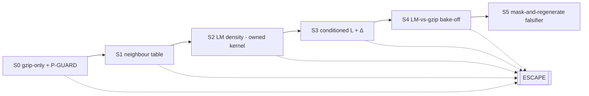
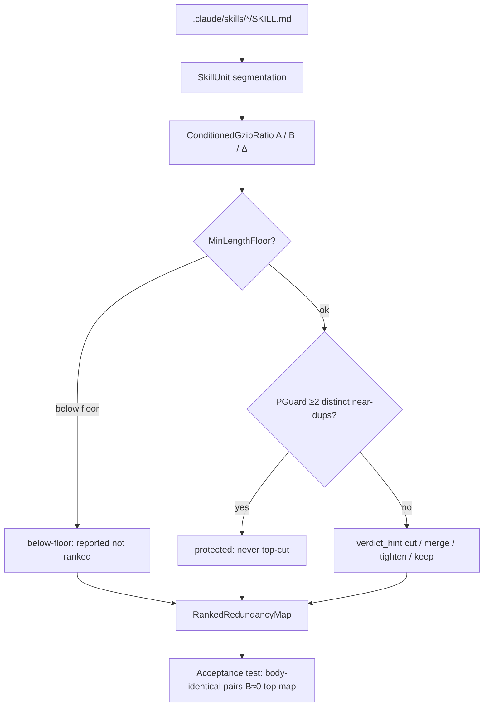

## Objective

Specify the first functional build of **Assay** — an **S0 gzip-only, confound-guarded redundancy audit** over this repository's own `SKILL.md` instruction units, emitting a `RankedRedundancyMap` as a review signal (never an autocut). The end state is a stdlib-only script, buildable with no further spec, that segments each `.claude/skills/*/SKILL.md` into a scorable body, scores each against the rest of the corpus, flags deliberate repetition, and passes an in-repo acceptance test on body-identical SKILL↔README pairs. Everything model-based (the LM kernel, the behavioral-equivalence falsifier) is explicitly scoped to later rungs, not S0.

**Status:** v0.1.0 — first discovery; anchors on the CLOSED forward-research verdict, does not re-litigate it.
**Owner:** @victorboscaro
**Companion:** [initial-considerations.md](../initial-considerations.md) — the probe owns the de-risked build ladder (S0–M1.5), the genre-confound argument, and the open forks; this doc treats that ladder as defined and specifies only the S0 rung concretely.

---

## 1. Business Context

This work serves the orchestrator's founding aim — reduce noise and unearned prose in the system that governs its own agents (see the project overview, [README.md](../../../../README.md)) — by turning "which instructions are redundant?" from a vibe into a measurement over the repo's own skills corpus.

**Why now** — The orchestrator runs on instructions: a `CLAUDE.md`, ~69 `SKILL.md` files, constitutions, and vault docs, all of which accrete prose faster than anyone prunes it. Nobody can tell, by reading, which words are load-bearing and which are restatements the model would already infer from the rest of the system. The forward-research dispatch closed with a GO on the honest slice — a gzip-first redundancy audit ships **today** against in-repo ground truth ([findings.md](../forward-research/findings.md) §Synthesis(4)) — so the gating question is no longer "is it buildable" but "build it to an exact enough shape that two adversarial reviewers cannot find an ambiguous pin."

**What's broken (as of 2026-07-23)** — Each is a gap this discovery closes, with its source location:
- The engine brief ([README.md](../README.md) §3, "Minimal first build M1") bundles the gzip column, the LM `L(unit|rest)` column, and a behavioral A/B falsifier into one first build. The probe overturned that: [initial-considerations.md](../initial-considerations.md) §3 rung `S0` isolates gzip-only as the honest MVP, and §4 descopes the behavioral A/B. This doc must pin S0 alone.
- "Self-corpus prolixity" is still phrased as a distinct measurement object in [README.md](../README.md) §1 and §3. The closed verdict ([findings.md](../forward-research/findings.md) §Gate outcomes, item 3b) rules it a **re-skin application** of the owned kernel + owned gzip, not a distinct object. No downstream artifact yet records that demotion.
- The near-duplicate criterion behind **P-GUARD** is named but never defined operationally: [initial-considerations.md](../initial-considerations.md) §2 says "restated across ≥ 2 skills/sections" without a computable predicate. S0 cannot be built without one.
- No unit-segmentation contract exists: [README.md](../README.md) §3 says "each `SKILL.md` … = one unit" but never pins how frontmatter is stripped, how the body is bounded, or how tokens are counted for the length floor.

**What stays the same** — Out of scope, each owned elsewhere and treated here as defined:
- **The verdict.** Ownership, GO/KILL calls, and the build-from-owned framing are owned by [findings.md](../forward-research/findings.md) (the CLOSED dispatch). This doc cites it and never re-opens it.
- **The engine spine and the four bindings.** `marginal_information(unit | corpus)`, the scalar⊕graph readouts, and the binding table are owned by [README.md](../README.md) §0–§2, §5–§7. This doc specifies one adapter over that spine, not the spine.
- **The build-ladder rationale and forks.** The S0–M1.5 ladder, the genre confound, and forks F1–F4 are owned by [initial-considerations.md](../initial-considerations.md) §3, §7. This doc restates only what S0 must pin.
- **The north-star binding** (novelty vs. the held-claim ledger `K`), the claim-graph Layer 2, and the category-theory thread — all deferred by [README.md](../README.md) §4, §8; untouched here.
- **The LM logprob backend, retrieval/FAISS, and any agent-replay harness** — none exist in-repo ([initial-considerations.md](../initial-considerations.md) §4) and none are built at S0.

---

## 2. Core Concepts

### MarginalInformationEngine

The single primitive the whole tool wraps — `marginal_information(unit | corpus) → scalar L`, owned and defined by [README.md](../README.md) §0. **Meta-type: Operation.** S0 does not implement its LM form; it implements a *gzip estimator* of the same relative-surprisal shape, so the engine seam is exercised before any model is stood up.

### SkillUnit

One scorable unit per `.claude/skills/*/SKILL.md`, file-tier. **Meta-type: Entity.** The `body` is the text **after the closing `---` of the YAML frontmatter**; the frontmatter is stripped from the scored text but **recorded** (its `description:` gives a free human label, and its presence/length is logged). `n_bytes = len(body.encode("utf-8"))`. File-tier is the ranking granularity because cut/merge/tighten act on whole files; section-tier is a later *zoom*, never a sum ([initial-considerations.md](../initial-considerations.md) §3, "summing sections overcounts by the multi-information").

### ConditionedGzipRatio

The S0 metric. **Meta-type: Value Object.** For a unit `u` with leave-one-out corpus `C_u` (concatenation of every *other* unit body):

```
A(u) = len(gzip(u_bytes)) / len(u_bytes)                              # raw self-compressibility
B(u) = (len(gzip(C_u + u_bytes)) - len(gzip(C_u))) / len(u_bytes)    # conditioned rate
Δ(u) = A(u) - B(u)                                                    # bits the corpus explains
```

`B` is the marginal cost of appending `u` after the corpus, normalized to a **rate** (per unit byte), so the engine's length-extensivity defect ([README.md](../README.md) §6 defect 1) *becomes the signal*. Low `B` ⇒ the rest of the corpus already predicts `u` ⇒ cross-document redundancy. `A`, `B`, `Δ` are reported as **three separate columns, never blended** — the payload is the disagreement cell (high `A`, low `B` = looks-novel-but-the-system-predicts-it), the same discipline the probe settled ([initial-considerations.md](../initial-considerations.md) §3, "Metric decisions").

### PGuard

The non-negotiable confound guard. **Meta-type: Rule.** Instructions are the one genre where low surprisal ≠ cuttable: a critical rule restated across skills scores near-zero `B` *because* it is deliberately repeated, so a naive rank puts load-bearing repetition at the top of the cut list ([initial-considerations.md](../initial-considerations.md) §2). PGuard flags any unit that is a near-duplicate of **≥ 2 distinct** other units as `protected` ("possibly deliberate repetition") and removes it from the cut ranking. The near-duplicate predicate is pinned in §3.4. It is a novel-attempt hypothesis (shrink→tighten), precedent-clean per [findings.md](../forward-research/findings.md) §Gate outcomes item 3 — carried as *our own hypothesis to test*, with AGORA's 76-pt swing under meaning-preserving perturbation named as directional counter-evidence.

### MinLengthFloor

**Meta-type: Rule.** Units below ~100 tokens are **reported but not ranked**: short units give the per-token rate and `Δ` huge variance, so the tool is least reliable exactly where instructions are densest ([initial-considerations.md](../initial-considerations.md) §2). S0 uses a whitespace-word proxy for tokens (no tokenizer dependency); the proxy is replaced by the real tokenizer when the LM kernel arrives at S2.

### RankedRedundancyMap

The S0 output. **Meta-type: Query (read model).** A per-unit row `unit_path · n_bytes · A · B · Δ · merge_partner · protected_flag · verdict_hint`, ranked **ascending by `B`** (most-redundant first), where `verdict_hint ∈ {cut, merge, tighten, keep, protected, below-floor}`. It is a **review signal, never an autocut** ([README.md](../README.md) §3 HARD CAVEAT).

### SelfCorpusApplication

The honest-scope pin. **Meta-type: Policy.** "Self-corpus prolixity" is a **re-skin application** of the owned gzip estimator (and later the owned LM kernel) applied to renamed input — the gzip call is byte-identical whether the tokens are a RAG passage or a `SKILL.md`. It is **not a distinct measurement object** ([findings.md](../forward-research/findings.md) §Gate outcomes item 3b). Assay's honest contribution is **one object** (BehavioralEquivalenceEval) plus **one falsifiable hypothesis** (PGuard); S0 claims neither — it ships owned-gzip on owned input.

### LmKernel

The later `L(unit|corpus)` estimator. **Meta-type: Interface.** **Build-from-owned**: wrap Microsoft `llmlingua`'s `PromptCompressor.get_ppl(..., condition_mode="after", condition_pos_id=...)` — per-token `CrossEntropyLoss(reduction="none")`, masked after a position ([findings.md](../forward-research/findings.md) §Gate outcomes item 1). **Never claimed novel.** Scoped to S2/S3, not S0 (§5).

### BehavioralEquivalenceEval

The genuine contribution. **Meta-type: Workflow.** Measure *same tool, same args, same gate, same trajectory shape, before-vs-after instruction compression* — the un-owned residual fusing Amazon's fidelity methodology + ACON's paired-trajectory pattern + CoACT's operation-field scorer as adjacent method donors ([findings.md](../forward-research/findings.md) §Gate outcomes item 2). Scoped to S5, not S0 (§5).

---

## 3. S0 — the gzip-only redundancy audit (first functional build)

This section is the buildable-with-no-spec core. Infra: **Python stdlib only** (`gzip`/`zlib`, `pathlib`, `re`). No model, no network, no new dependency.

### 3.1 Unit segmentation

1. Glob `.claude/skills/*/SKILL.md` (one candidate unit per file; discover the set at run time — do not hardcode the count).
2. Split each file on the YAML frontmatter delimiters: the file opens with `---`, the frontmatter runs to the **next** `---` on its own line; the **body** is everything after that closing delimiter, `.strip()`-ed. If a file has no frontmatter, the whole file is the body and `frontmatter_present = false` is recorded.
3. Record, do not score, the frontmatter: store the raw block, the parsed `description:` (free label), and `frontmatter_bytes`. Only the body enters `A`/`B`.
4. `n_bytes = len(body.encode("utf-8"))`; `n_tokens ≈` whitespace-delimited word count of the body (S0 proxy).

### 3.2 Corpus assembly (leave-one-out)

For unit `u`, `C_u = "\n\n".join(body_v for v in units if v != u)`, in a **deterministic order** (units sorted by path) so `gzip` output is reproducible. The corpus is used as a `gzip` preset-dictionary *context* by literal concatenation `C_u + u_bytes`; the unit is placed **last**, adjacent to the corpus tail.

**Pinned gzip caveat.** DEFLATE's LZ77 back-reference window is 32 KB, so `u` only benefits from the *last* 32 KB of `C_u`. At ~69 units this corpus far exceeds 32 KB, so a paraphrase restated in an early-sorted unit can be missed. S0 accepts this: it is exactly the "gzip under-detects compositional paraphrase" blind spot the LM kernel exists to close ([findings.md](../forward-research/findings.md) §Synthesis(4)). Mitigation available without a model: also compute `B` against a **path-neighbourhood-ordered** corpus (nearest siblings last); recorded as OQ-AS5, not required for S0 pass.

### 3.3 Metric computation

Use a single fixed codec for every call — `zlib.compress(data, level=9)` (or `gzip` at a fixed level), UTF-8 bytes — so lengths are comparable. Compute `A`, `B`, `Δ` per §2 `ConditionedGzipRatio`. `len(gzip(C_u))` is computed once per unit (it changes per unit under leave-one-out). Rank the map **ascending by `B`**; ties broken by ascending `Δ`. Never rank on raw `L`/total bytes.

### 3.4 P-GUARD and the near-duplicate predicate

Define the **pairwise conditioned-gzip** of `u` given a single other unit `v`:

```
pair_B(u, v) = (len(gzip(v_bytes + u_bytes)) - len(gzip(v_bytes))) / len(u_bytes)
```

`u` is a **near-duplicate of `v`** iff `pair_B(u, v) ≤ NEARDUP_TAU` (default `0.25`). PGuard sets `protected_flag = true` and `verdict_hint = protected` for any `u` with **≥ 2 distinct** units `v` satisfying this — "possibly deliberate repetition," lifted out of the cut ranking (still shown, with its `B` and its protecting partners listed). `NEARDUP_TAU` is calibrated at build time so a body-identical pair lands well below it (`pair_B ≈ 0`) and an unrelated pair well above it (`pair_B ≈ A`); the calibrated value is **recorded in the run manifest, not asserted as ground truth**.

`MinLengthFloor` (default 100 word-proxy tokens) is applied **first**: `n_tokens < floor ⇒ verdict_hint = below-floor`, reported outside the ranking. Order of precedence for `verdict_hint`: `below-floor` → `protected` → the metric hints below.

### 3.5 verdict_hint from the three columns (gzip-only)

Precedence after `below-floor`/`protected`:
- `cut` — `B ≤ CUT_TAU` (default `0.15`) **and** exactly one dominant `merge_partner` with `pair_B ≤ CUT_TAU` (near-exact duplicate of a single other unit → safe *candidate* to remove; a human decides).
- `merge` — `B ≤ MERGE_TAU` (default `0.5`) with an identifiable `merge_partner` but not near-exact (redundancy spread across a partner → consolidate).
- `tighten` — `A ≤ TIGHTEN_A_TAU` (default `0.35`, internally repetitive/verbose) **and** `Δ ≤ TIGHTEN_DELTA_TAU` (default `0.10` — the corpus explains little, so the redundancy is internal, not cross-doc): verbose but not cross-doc redundant → same content, fewer tokens. *(`TIGHTEN_DELTA_TAU` is an open knob — no findings-licensed value exists; the default is a starting pin, calibrated and recorded per run like the others.)*
- `keep` — otherwise (high `A`, `B` not low → dense and novel).

`merge_partner` for a unit is the other unit minimizing `pair_B(u, v)` (the single unit that most reduces `u`'s conditioned cost); recorded even when the verdict is `keep`, as a diagnostic. All five `TAU` defaults (`CUT_TAU`, `MERGE_TAU`, `TIGHTEN_A_TAU`, `TIGHTEN_DELTA_TAU`, `NEARDUP_TAU`) are **initial pins calibrated against the acceptance set (§3.7) and recorded per run**, not claimed optimal.

### 3.6 Output — RankedRedundancyMap

Emit a machine-readable table (CSV/JSON) plus a human digest, columns exactly:

```
unit_path · n_bytes · A · B · Δ · merge_partner · protected_flag · verdict_hint
```

The map is a **review shortlist**, never an autocut (§2 `RankedRedundancyMap`; [README.md](../README.md) §3 HARD CAVEAT). No file is modified; Assay is read-only over the corpus ([README.md](../README.md) §9 non-goals).

### 3.7 Acceptance test (in-repo ground truth)

Extend the corpus to also include the **body of each skill's paired `README.md`** (many skills carry a `README.md` that duplicates the `SKILL.md` body). Then:

- **Assertion 1 — window-safe, THE S0 gate.** Every **body-identical `SKILL.md`↔`README.md` pair** must score `pair_B(u, partner) ≈ 0`. `pair_B` (§3.4) concatenates the partner directly before `u`, so the identical partner is **always inside the 32 KB LZ77 window** — this is the reproducible exact-copy check gzip provably passes ([findings.md](../forward-research/findings.md) §Synthesis(4)). The gate rides on this, not on full-corpus `B` rank.
- **Assertion 1b — full-corpus `B`, diagnostic only, NOT a gate.** A body-identical pair's leave-one-out `B` tops the ascending-`B` map **only when** its identical partner falls within the trailing 32 KB of the path-sorted corpus (§3.2). When it does not, `B ≈ A` for that unit — **expected, not a failure**: it is the same 32 KB-window limitation §3.2 pins, and is precisely why the S0 gate uses the window-safe `pair_B` (Assertion 1) rather than full-corpus `B`.
- **Assertion 2** — those same pairs must be caught by the near-duplicate predicate (`pair_B ≈ 0 ≤ NEARDUP_TAU`), so any unit duplicated across ≥ 2 places is `protected`, demonstrating PGuard fires on real repetition.

**Ground truth (source of record: [findings.md](../forward-research/findings.md) §Synthesis(4) [S-b] counted 12/48 byte-identical across 66 `SKILL.md`).** A read-only recount on 2026-07-23 found the corpus had grown to ~13/48 across ~69 — but this is **not a hardcoded target**: the acceptance harness **computes the count itself at build time** (glob + strip + byte-compare), and the assertion binds to *the harness's own count on the day it runs*, whatever it is. The findings figures are the historical record, not a runtime constant.

---

## 4. What S0 is NOT — the honest-contribution ledger

Pinned so no reviewer or downstream reader re-inflates the claim:

- **S0 measures redundancy, not cut-safety.** Low `B` answers "is this restated?" — it does **not** answer "is it safe to remove?" That second question is PGuard (§3.4) plus the later falsifier (§5). Conflating them is the exact danger on this corpus ([initial-considerations.md](../initial-considerations.md) §2).
- **The gzip estimator is owned, not novel.** It is `gzip` applied to concatenated bytes; the LM form is build-from-owned `llmlingua.get_ppl` (§2 `LmKernel`). Assay claims neither as invention.
- **"Self-corpus prolixity" is an application, not a contribution.** Per `SelfCorpusApplication` (§2) and [findings.md](../forward-research/findings.md) §Gate outcomes item 3b — the operation is identical to any RAG-passage scoring; "self" is framing. Assay's honest contribution is **one object** (`BehavioralEquivalenceEval`, §5) plus **one falsifiable hypothesis** (`PGuard`). S0 ships neither; it ships the owned, honest slice.

---

## 5. Later rungs — LM kernel (S2/S3) and behavioral falsifier (S5)

Explicitly **not S0**. Carried here only to fix the boundary; the ladder rationale is owned by [initial-considerations.md](../initial-considerations.md) §3.

- **S1 — neighbour table.** Embed units, build a similarity table to *name the merge partner* more richly than pairwise gzip. Adds `sentence-transformers`/FAISS.
- **S2 — LM density `L(u|∅)`.** Stand up the owned kernel: wrap `llmlingua.get_ppl(condition_mode="after", condition_pos_id=...)`. **Decide adopt-vs-build here** before any bespoke logprob server (fork F1). Build-from-owned; never claimed novel.
- **S3 — conditioned `L(u|rest)` + differential `Δ_LM`.** Retrieval-conditioned leave-one-out. Build-time obligation: demonstrate `Δ_LM > 0` on genuinely private content, else defect-3 (pretraining swamps the corpus) is fatal here and the LM layer falls back to S0+S1 ([findings.md](../forward-research/findings.md) §BUILD-TIME obligations).
- **S4 — LM-vs-gzip bake-off.** The head-to-head that decides whether the LM kernel earns its cost by reordering gzip on the paraphrase cases gzip provably misses. **Kill-gate:** no meaningful reorder ⇒ the LM layer dies, S0+S1 still ship (fork F2).
- **S5 (M1) — mask-and-regenerate falsifier.** Mask a flagged unit, give the model the rest, ask it to reconstruct what the unit governs, score overlap — the self-contained operationalization of `BehavioralEquivalenceEval` with no agent loop. The full agent-replay is descoped to M1.5 on a tiny real-dispatch sample (fork F3).

---

## 6. Phases and gates



| From → To | Mandatory criteria |
|---|---|
| S0 → S1 | Acceptance test (§3.7) passes: harness-counted body-identical pairs all score `pair_B ≈ 0` (window-safe, Assertion 1) and PGuard fires on them (Assertion 2); the map emits with all eight columns. Full-corpus `B` rank is diagnostic (Assertion 1b), not gated. |
| S1 → S2 | Neighbour table concentrates near-duplicates and yields a richer `merge_partner` than pairwise gzip on the flagged units. |
| S2 → S3 | Owned `llmlingua.get_ppl` wrap returns per-token loss reproducibly under a pinned backend; F1 adopt-vs-build decided. |
| S3 → S4 | `Δ_LM > 0` demonstrated on private content (else fall back to S0+S1 — still shippable). |
| S4 → S5 | LM ranking meaningfully reorders gzip on paraphrase cases gzip misses (else kill the LM layer — S0+S1 ship). |
| any → ESCAPE | If a rung's gate fails, ship the **last passing rung** as the product and record the failed gate as a finding. S0 alone is a shippable product; S1/S3-fallback (gzip + neighbours) is a shippable product. Concrete alternative on total LM failure: keep gzip-only + PGuard as the delivered tool and route the paraphrase gap to a future dispatch — never "reassess." |

**Honest-gate rule.** Each gate costs a day-scale build to discover failure *now*; discovering the same failure at the next rung costs the standing-up of an LM backend (S2) or a bake-off harness (S4). S0's acceptance test is the cheapest possible falsifier — an exact-copy check on in-repo files — so it is run first and hardest. *(Caveat — see OQ-AS7: this rule orders gates by **build cost**, which correctly front-loads *buildability* risk but gates the tool's *value-defining* risk — defect-3, whether LM conditioning bites on private content — latest, at S3. A read-only LM spike is recommended ahead of S1 investment to test that risk for an afternoon rather than after standing up S1's infra.)*

---

## Open Questions

**OQ-AS1** — **Question:** Adopt (wrap `llmlingua`) vs. build a bespoke logprob server for the LM kernel? (fork F1) **Recommendation:** spike `llmlingua.get_ppl` at S2 before any bespoke server; the primitive is owned and pip-installable ([findings.md](../forward-research/findings.md) §Gate outcomes item 1). Settle in stage S2.

**OQ-AS2** — **Question:** Is gzip-only enough — does the LM layer ever need to exist? (fork F2) **Recommendation:** decide from the S4 bake-off; if S0+S1 already surface redundancy usefully, not building the LM layer is an acceptable outcome, not a failure. Settle in stage S4.

**OQ-AS3** — **Question:** Mask-and-regenerate vs. agent-replay as the *trusted* falsifier? (fork F3) **Recommendation:** S5 uses mask-and-regenerate (no agent loop); cost the agent-replay repeat-budget against `HYP-ORCH-NOISE` before ever committing to it. Settle in stage M1.5.

**OQ-AS4** — **Question:** If prolixity stalls, which alternative first binding? (fork F4) **Recommendation:** hold self-coherence within one governance doc (`contradicts` edges are locally human-checkable, no harness) and the claim-graph delta-proposer as fallbacks, not the first move. Settle in a future dispatch if S0→S4 stalls.

**OQ-AS5** — **Question:** Does path-neighbourhood corpus ordering recover paraphrase redundancy the 32 KB LZ77 window drops (§3.2)? **Recommendation:** compute the neighbourhood-ordered `B` as a diagnostic column at S0; do not gate S0 on it — it is the motivation for S1/S2, not an S0 requirement. Settle in stage S1.

**OQ-AS7** — **Question:** Does the S0→S5 rung order de-risk in the right sequence for **value**, not just buildability? *(Raised by owner review, 2026-07-25.)* The ladder (§6) is ordered by **build cost** — cheapest falsifier first (S0's acceptance test is an exact-copy check on in-repo files) — which correctly front-loads *buildability* risk. But the tool's *value* risk is different: whether an LM's conditioned surprisal on **private** content moves at all (defect-3, [README.md](../README.md) §6 — for public/ledger-like content `L(u|∅) ≈ L(u|corpus)` and the tool measures the base model, not our system). That risk is gated **latest**, at S3's `Δ_LM > 0` build-time obligation (§5). So the one rung that could kill the whole premise sits behind two rungs (S1 embeddings/FAISS, S2 kernel stand-up) that de-risk *plumbing*, not *payoff*. There is also a standing doubt that S0 alone delivers little beyond `diff` + a `B`-ranked merge shortlist: P-GUARD works solidly only on byte-identical `SKILL↔README` pairs (which `diff` also finds), because the genuine `SKILL↔SKILL` repetition is mostly paraphrase gzip cannot see (OQ-AS6, [CALIBRATION.md](../s0/CALIBRATION.md) §4) — so the tool's interesting behaviour lives entirely on the LM rung whose value-risk is unretired. **Recommendation:** before investing in S1 infra, run a scoped, **read-only defect-3 spike** — any pip-installable LM's conditioned surprisal (`llmlingua.get_ppl` or equivalent) over a handful of private `SKILL.md` bodies, checking `L(u|∅) − L(u|corpus) > 0` — as the cheapest test of the tool's reason to exist. If ≈0 on private content, the LM layer is dead on arrival and the delivered product is gzip-only + P-GUARD (the ESCAPE outcome §6 already names); learn that in an afternoon, not after standing up S1. This does **not** reorder the shipping ladder (S0 is built and cheap; S1 remains the next *build*) — it inserts a value-risk probe **ahead of S1 investment**. Settle before S1 build begins.

**OQ-AS6** — **Question:** How to calibrate P-GUARD so the `protected` column is trustworthy? *(Raised by the S0 implementation + code review, 2026-07-23.)* The pinned absolute predicate `pair_B ≤ NEARDUP_TAU` (§3.4) **over-triggers**: because `pair_B(u,v)` is upper-bounded by `A(u)`, any unit whose own rate `A(u) ≈ NEARDUP_TAU` (a dense, low-A unit) registers as a near-duplicate of *nearly the whole corpus* (verified: `repository-harness`, A=0.25, flagged near-dup of 68/68). So on a gzip-only run ~8 of 12 "protected" units are this artifact, not deliberate repetition. Worse: the *genuine* cross-skill repetition (the `ontology-view`/`system-view`/`engineer-view` triad restating a shared invariant) is **paraphrase**, so gzip barely catches it (pair_B ≈ 0.2, near τ by coincidence) — the §3.2 blind spot. **Net: gzip-only cannot robustly populate `protected` for cross-skill repetition; only byte-identical `SKILL↔README` pairs are solid, and those are the acceptance ground truth, not `SKILL↔SKILL` units.** **Implemented mitigation:** a scale-invariant companion `pair_B ≤ k·A(u)` (CLI `--neardup-k`). **Calibration pass completed 2026-07-23** ([s0/CALIBRATION.md](../s0/CALIBRATION.md)): a 10-pair in-repo labelled set (positives = the `ontology-view`/`system-view`/`engineer-view` triad, `sigil-maintenance-loop`↔`observed-invocation-loop`, `whisper`↔`invoke`/`necronomicon`; negatives = 8 unrelated skill pairs) shows `pair_B/A(u)` ratios that **overlap** between genuine repetition (0.58–0.92) and unrelated/artifact pairs (0.66–0.96) — confirming no single ratio threshold cleanly separates paraphrase from coincidence on gzip alone, as this OQ already suspected. A set-level sweep (not single-pair) found a stable plateau at `k ∈ [0.635, 0.695]`; **default is now `k=0.65` (was 1.0/disabled)**, dropping `protected` from 12 to 5 units on the current corpus (removes the flagship artifact `repository-harness`, `A≈0.25`, plus 5 others; keeps `system-view`/`engineer-view`/`sigil-maintenance-loop`). **Honest ceiling, unresolved by this pass:** `whisper` (paraphrase-only overlap) drops out; `ontology-view` was never recoverable at any `k` (its `pair_B` to its siblings exceeds the absolute `NEARDUP_TAU` outright — a `pair_B` asymmetry, not a `k` problem); and generator-template boilerplate (shared `bootstrap_arcanum.sh` scaffolding) is still indistinguishable from deliberate rule restatement by a byte compressor. **Recommendation stands:** treat `protected` as advisory-only at S0 — now with a materially smaller, better-targeted false-positive set, not a solved one; the remaining ambiguity (template-conformance vs. genuine restatement vs. paraphrase) needs the LM kernel (S2).

---

## Decisions Baked In

| ID | Decision | Where |
|---|---|---|
| AD-1 | First functional build is **S0 gzip-only**, stdlib-only, confound-guarded; LM and behavioral eval are later rungs. | §3, §5 |
| AD-2 | LM kernel `L(unit\|corpus)` is **build-from-owned** — wrap `llmlingua.get_ppl(condition_mode="after", condition_pos_id=...)`; never claimed novel. | §2 `LmKernel`, §5 |
| AD-3 | Report `A` (raw ratio), `B` (conditioned rate), `Δ = A−B` as **three separate columns, never blended**; rank **ascending by `B`** (rate, never total). | §2 `ConditionedGzipRatio`, §3.3 |
| AD-4 | **PGuard** flags any unit that is a near-duplicate of **≥ 2 distinct** other units as `protected`; near-duplicate `⇔ pair_B ≤ NEARDUP_TAU`; never top-cut. | §2 `PGuard`, §3.4 |
| AD-5 | **MinLengthFloor** ~100 word-proxy tokens; short units reported, not ranked. | §2 `MinLengthFloor`, §3.4 |
| AD-6 | Assay's honest contribution is **one object** (`BehavioralEquivalenceEval`) + **PGuard** as a falsifiable novel-attempt; "self-corpus prolixity" is a **re-skin application**, not a distinct measurement object. | §2 `SelfCorpusApplication`, §4 |
| AD-7 | Output is a **`RankedRedundancyMap`** — `unit_path · n_bytes · A · B · Δ · merge_partner · protected_flag · verdict_hint{cut\|merge\|tighten\|keep\|protected\|below-floor}` — a review signal, never an autocut. | §2 `RankedRedundancyMap`, §3.6 |
| AD-8 | **Segmentation:** one unit per `.claude/skills/*/SKILL.md`, file-tier; body = text after the closing frontmatter `---`, stripped; frontmatter recorded not scored. | §3.1 |
| AD-9 | **Acceptance test:** with README bodies in the corpus, harness-counted body-identical SKILL↔README pairs must score `B ≈ 0` and top the map; counts computed at build time, never hardcoded. | §3.7 |

---

## Connections

| Document | Type | Description |
|---|---|---|
| [findings.md](../forward-research/findings.md) | derives-from | The CLOSED forward-research verdict; authoritative on ownership, build-from-owned, the re-skin demotion, and the S0-ships-today GO. |
| [README.md](../README.md) | cites | The engine spine, the four bindings, the two readouts, the three defects; owns the primitive this doc adapts. |
| [initial-considerations.md](../initial-considerations.md) | derives-from | The probe; owns the S0–M1.5 ladder, the genre confound, the metric decisions, and forks F1–F4. |
| [research.md](../forward-research/research.md) | cites | Raw explorer returns (X/L/S) underlying the findings verdict. |

Pending inverse edges (not written here — reported for owner authorization): add a `modified-by`/`derived child` row pointing to this discovery in [findings.md](../forward-research/findings.md), [README.md](../README.md), and [initial-considerations.md](../initial-considerations.md), each with a patch-level bump and changelog entry.

## Flow Diagram



S0 segments each skill file into a `SkillUnit`, scores it with the stdlib `ConditionedGzipRatio` (three separate columns `A`/`B`/`Δ`), then routes it through the `MinLengthFloor` and `PGuard` guards before assigning a `verdict_hint`. Every unit lands in the `RankedRedundancyMap`, ranked ascending by `B`, which the acceptance test validates against in-repo body-identical pairs. Nothing here uses a model — the LM kernel and behavioral falsifier attach at later rungs (§5). The map is a review signal only; no file is ever modified.

## Appendix — Changelog

- **0.1.1** (2026-07-25) — Added **OQ-AS7** (owner review): the rung ladder de-risks *buildability* first but gates the *value-defining* defect-3 risk latest (S3); recommends a read-only LM spike ahead of S1 investment. Flagged the same caveat at the §6 honest-gate rule. No decision rows changed; the shipping ladder is unchanged.
- **0.1.0** (2026-07-23) — First discovery. Pins the S0 gzip-only build (segmentation, `ConditionedGzipRatio`, PGuard near-duplicate predicate, `MinLengthFloor`, `RankedRedundancyMap`, acceptance test), records the re-skin demotion and the build-from-owned LM kernel, and carries forks F1–F4 as OQ-AS1–AS5. Decision register AD-1…AD-9 created; not yet SPEC-locked, so all rows remain editable until a SPEC cites this version.

**Source dispatch:** `2026-07-23-assay-forward-research` — [findings](../forward-research/findings.md)
