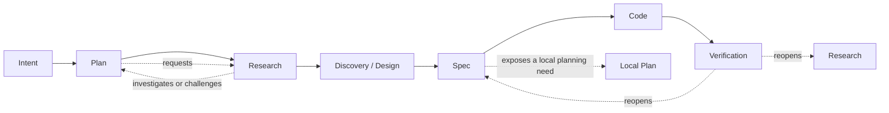

# A Composable Language for Governed Agent Work

> This is the high-level system view. It explains the shape and stakes of the proposed system for
> readers who do not yet know its vocabulary. Terms remain provisional until an ontology view owns
> them, and load-bearing choices remain open until an engineer view owns their verdicts.

## 1. About this document

This document presents a high-level view of a possible language for coordinating work across
people, agents, tools, and records. It examines how a human request can remain understandable as it
is interpreted, revised, delegated, acted on, and reviewed—and how its context, decisions,
evidence, authority, and history can remain connected throughout that process.

This is a proposal. Its concepts and definitions are not final and should be revised when better
alternatives emerge.

The document begins with how requests are made and followed. It then examines how work can be
described, connected, delegated, and observed. Finally, it considers the supporting architecture,
the decisions that remain open, and which parts might benefit from mathematical formalization.

### Alternative framings considered

| Framing | Why it is insufficient on its own |
|---|---|
| A better task manager | It does not explain evolving definitions, authority, evidence, or recursive composition. |
| A multi-agent workflow engine | It starts too late: the meaning and legitimacy of the work are already assumed. |
| An ontology platform | It may describe the world without governing effects, execution, and live work. |
| A document methodology | It cannot by itself make runtime state, capabilities, and provenance observable. |

## 2. What must remain visible

The system should make it possible to understand a piece of work without reconstructing it from
folder names, disconnected documents, agent prompts, and memory. A reader should be able to examine
its origin, current state, relationships, authority, and history from the records that describe it.

The system should connect abstract statements about work to the records, evidence, decisions,
observations, procedures, or enforcement mechanisms that make them inspectable. Concrete does not
simply mean more detailed or implemented in code; it means that the basis for a statement can be
found and examined. Understanding a piece of work therefore requires four connected kinds of
information.

**Origin and meaning**

- What was requested?
- How has that request been interpreted, and which interpretation is current?
- Which assumptions, definitions, and constraints shape that understanding?
- Which earlier or competing interpretations remain relevant, and why did the current
  interpretation prevail?

**State and authority**

- What is only being discussed or proposed?
- What has been accepted?
- What has been authorized for execution?
- What is waiting, blocked, declined, cancelled, or complete?

These distinctions matter because a detailed proposal is not automatically an accepted decision,
and an accepted decision is not automatically permission to act.

**Delegation and activity**

- Which person or agent received the work?
- What objective, context, tools, limits, and authority did they receive?
- Which larger request, investigation, plan, specification, or decision does the activity support?
- What has started, and what never launched?

These questions make concrete activity traceable to the purpose and authority behind it.

**Evidence and change**

- Which evidence supports a claim or decision?
- What result was produced?
- Which description, decision, artifact, or state changed because of that result?
- Has the result been verified or accepted as establishing completion, does it challenge an
  assumption, or does it create another claim to review?

The system should also make missing or partial grounding visible. A plan may lack authority. A
claim may have incomplete evidence. A requirement may lack implementation. A metric may exist
without an instrument, or may depend on human observation rather than automated measurement. These
are valid states when they are explicit; they become misleading when the system fills the gaps
through inference.

Any later view can display only the distinctions that the underlying system preserves. If proposals
and authorizations share one state, if names are treated as identity, or if results are stored
without their origin, no interface can faithfully recover what was never recorded.

The next section examines the basic distinctions needed to preserve this information.

### Alternative framings considered

| Framing | Why set aside |
|---|---|
| Add a better status dashboard | A view cannot recover distinctions that the underlying records never preserved. |
| Store every event in one log | Sequence alone does not explain meaning, authority, evidence, or semantic relationships. |
| Ask agents to summarize the current state | A generated summary is another assertion; it does not replace attributable source records. |

## 3. Objects, descriptions, and hypotheses

The working model separates identity, description, relationship, and operational acceptance.
Objects remain addressable while their names, descriptions, classifications, locations, or
relationships change. Tags allow low-cost descriptions before the system or its users know enough
to commit to a stronger type or rule.

Descriptions are hypotheses rather than timeless truth. A person or agent may assert that a
construct is valid, useful, related, complete, or ready. The assertion remains distinguishable from
its evidence, its contextual acceptance, and any authority to produce effects.

This distinction makes progressive definition possible:

```text
partially described object
  -> additional tags and observations
  -> candidate properties and relations
  -> reviewed or accepted contracts
  -> operational use under explicit authority
```

The arrows do not mean that every object must follow one maturity ladder. They show increasing
commitment that a workflow profile may govern.

### Alternative framings considered

| Framing | Why set aside |
|---|---|
| Require complete schemas at creation | It makes early capture expensive and encourages users to keep knowledge outside the system. |
| Treat all tags as authoritative facts | Cheap description would silently acquire operational force. |
| Make names or paths the identity | Renaming, moving, and presenting alternative views would rewrite meaning. |

## 4. Relations and composition

Relationships are first-class because several different meanings can connect the same two objects.
A Dispatch may be generated from another object, authorized by a confirmation, contained in a Plan,
and reviewed by a separate process. None of those relationships safely implies the others.

Accepted relations need enough semantics to support validation and derived views. The research
program currently expects relation contracts to address type, direction, source, destination,
scope, version, provenance, cardinality, transitivity, inheritance, and cycle policy. Different
relation types may form trees, forests, DAGs, or controlled cyclic graphs.

Relations can also compose. A useful composition must preserve the path that justified a derived
claim or action. The system should be able to explain whether a result follows from direct
relations, a permitted transitive closure, a translation between vocabularies, or a user-approved
rule.

Physical placement is one projection of these properties and relationships. The same objects may
appear in a repository-root view, an `internal_tools` view, a project view, a research view, or a
task-oriented dashboard without acquiring different identities merely because they appear in
different places.

## 5. A recursive grammar of work

The familiar sequence below is a useful first reading:

```text
Intent
  -> Plan
  -> Research
  -> Discovery / Design
  -> Spec
  -> Code
  -> Verification
```

It is not a universal irreversible pipeline. It is a candidate grammar of work kinds whose
instances can recur at different scopes and connect through typed relations.



Research for a Plan is therefore ordinary, not exceptional. A Plan can identify uncertainty and
request Research. Research can evaluate the assumptions, feasibility, precedents, or consequences
of that Plan. Its findings may support the Plan, revise it, split it, or make it unnecessary.

A workflow profile may still require a default progression. It can state which work kinds,
evidence, reviews, and approvals are required before a more expensive or authoritative commitment.
The invariant candidate is not one global order. It is that the applicable profile, transitions,
evidence, authority, bypasses, and reopenings are explicit and historically reconstructable.

### Alternative framings considered

| Framing | Why set aside |
|---|---|
| One global lifecycle | It cannot naturally represent Research for a Plan or local planning inside a Spec. |
| Completely free graph | It makes obligations, promotion, and completion too easy to evade. |
| Folder nesting as workflow | It confuses navigation with semantic and operational relationships. |

## 6. Recursive work without recursive orchestrator authority

Recursive structure does not imply recursive orchestration. An invoked orchestrator must not invoke
another orchestrator. Instead, the root orchestrator resolves the work graph and materializes small
WorkPackages for leaf agents.

Each assignment should receive only what its task needs: an objective, selected context, source
responsibilities, a small tool profile, a budget, an expected output, applicable gates, and explicit
authority boundaries. A parent relationship does not automatically transmit tools, budget,
evidence, approval, or terminal state.

This allows deep work structures with shallow execution authority:

```text
recursive work graph
  -> root orchestration and confirmation
  -> bounded leaf assignments
  -> attributable outputs and observations
  -> reconstructed progress over the original graph
```

## 7. Plans as revisable priors

The canonical [Plan contract](../../plans/README.md#canonical-definition) owns the term and its authority
boundary. At this narrative altitude, a Plan records the best current route, not an immutable
prediction of the future. Research may change its assumptions. New constraints may move its
stopping point. Implementation may expose a missing Design decision. Verification may show that
the Spec or the Plan needs to be reopened.

Revisions should create new attributable facts and versions rather than silently rewriting what was
previously believed. The system can then distinguish failure to follow a Plan from justified
revision of the Plan.

Every Plan searches for governing authority, but that search may end without finding one. An
unresolved Plan remains a visible, revisable proposal; it cannot become a binding route or execution
authority. Authorship, parentage, physical placement, and apparent completeness do not fill the
authority gap.

Program phases work similarly. A phase groups questions, dependencies, and readiness conditions
that are useful to consider together. It is not necessarily a permanent product layer. Phases may
overlap, split, merge, move, or be superseded as the program learns.

## 8. From a request to observable work

A possible operational shape is:

```text
conversation statement
  -> candidate WorkIntent
  -> admitted WorkIntent
  -> Plan / Research / WorkPackage / DispatchCandidate
  -> confirmed Dispatch
  -> TaskRun / AgentAttempt
  -> append-only lifecycle facts
  -> current-work, audit, and reminder projections
```

The original request is not mutated into a status field. Accepted facts record that something was
admitted, confirmed, started, blocked, completed, cancelled, or never launched. Read models derive
the current view and expose freshness when the system does not know what happened recently.

This separation matters because a dashboard must not create authority by displaying a button,
status, or inferred relationship. It presents accepted facts and identified uncertainty.

## 9. The kernel is a research question

“Kernel” currently means a possible minimal contract that allows independently evolving parts of
the system to interoperate and remain auditable. It does not yet name a selected component.

The first research phase must compare:

- one universal kernel;
- several specialized kernels connected by protocols;
- a microkernel with extensions;
- a kernel-of-kernels that governs compatibility and translation;
- or an architecture in which “kernel” is not a useful organizing concept.

Candidate invariants include identity, versioning, provenance, relative validity, typed relations,
explicit authority, traceable composition, and historical preservation. Each remains a hypothesis
until research tests its necessity, scope, compatibility with the others, and behavior under
composition.

The phrase `kernel-of-kernels` currently covers four questions that must remain separable: what
makes a kernel declaration governable, which laws are genuinely global, how independently valid
kernels compose, and which small checker evaluates those claims. One mechanism might eventually
implement several responsibilities, but the architecture does not yet assume that they are one
concept.

Lean is included because it is already important in the surrounding work. Its actual
[theorem-prover kernel](https://lean-lang.org/doc/reference/latest/Elaboration-and-Compilation/#the-kernel)
is also a useful `analogy-only` precedent: rich syntax, tactics, macros, and elaboration may remain
extensible because their output is checked by a much smaller trusted type checker. This suggests a
product shape in which flexible authoring sits outside a compact acceptance boundary that checks
explicit evidence.

The analogy has a hard boundary. Lean's kernel checks elaborated declarations and proof terms
against its core type theory and accepted environment. It does not decide product authority,
provenance, operational precedence, temporal obligations, or external effects, and even well-typed
axioms may be mutually inconsistent. The project must therefore separate Lean as explanatory
notation, Lean as a checker or generator of selected artifacts, Lean-checked results as governed
evidence, and the runtime mechanisms that actually enforce authority. The `permguard` artifact
elsewhere in the repository is a policy decision program verified in Lean and informally called a
“Lean kernel”; it is not the Lean prover's own trusted kernel.

### Alternative framings considered

| Framing | Why it is insufficient on its own |
|---|---|
| Use the Lean kernel as the product metakernel | It checks core type-theoretic declarations, not product authority, provenance, temporal rules, conflict resolution, or effects. |
| Call the invariant metadata schema the metakernel | A complete record can still describe a false, contradictory, unenforced, or unauthorized invariant. |
| Resolve every conflict by authority or priority | Authority may be out of scope or incomparable, and priority cannot make incompatible global laws jointly satisfiable. |

## 10. Candidate architecture by responsibility

The architecture can be understood as collaborating responsibilities rather than fixed product
layers:

1. **Authoring and interaction** captures user intent, incomplete descriptions, questions,
   proposals, and decisions.
2. **Knowledge and relationship management** preserves identities, properties, tags, typed
   relations, definitions, provenance, and alternative projections.
3. **Governance and authority** distinguishes claims, evidence, acceptance, promotion,
   confirmation, capabilities, and effect authorization.
4. **Planning and orchestration** resolves recursive work graphs into bounded, confirmable
   assignments and schedules.
5. **Execution** invokes tools and agents under materialized capabilities and records attempts.
6. **Event history and projections** preserve accepted lifecycle facts and build current views.
7. **Verification and formalization** check selected contracts through runtime validators,
   tests, reviews, and potentially Lean.
8. **Observability and product views** expose pending, active, blocked, completed, abandoned, and
   unknown work at multiple levels.

These responsibilities may be deployed together or separately. The research must determine which
boundaries are semantic, which are authority boundaries, and which are merely implementation
choices.

### Alternative framings considered

| Framing | Why set aside |
|---|---|
| Declare these as permanent layers | The layer model itself remains an open, configurable projection. |
| Put all semantics in one central service | It may turn a minimal interoperability contract into a product monolith. |
| Let every subsystem define everything locally | Translation, audit, and authority could become implicit or contradictory. |

## 11. Candidate tool families

Tool selection comes after responsibility boundaries. The following is an option inventory, not a
recommendation:

| Responsibility | Candidate options to compare | Main research question |
|---|---|---|
| Identity, metadata, and transactional authority | PostgreSQL; document databases; append-oriented stores | Which facts require transactions, constraints, and authoritative ownership? |
| Relationship traversal and alternative views | Relational edge tables; graph databases such as Neo4j; derived graph indexes | Is graph traversal authoritative or a rebuildable projection? |
| Durable event history | Database outbox/event tables; dedicated event stores; Kafka- or NATS-style streams | Which events are authoritative, and which transport observations are replayable? |
| Workflow orchestration | Purpose-built runtime; Temporal-style workflow engines; Dagster/Prefect-style orchestrators | Can the engine preserve confirmation, capabilities, recursive work, and explicit authority? |
| Policy and authorization | Application-owned policies; OPA; Cedar-style policy evaluation | How are policy versions and decisions bound to an execution attempt? |
| Search and retrieval | Database search; Elasticsearch/OpenSearch-style indexes; embedding-assisted retrieval | Which retrieval results are evidence, and how is freshness shown? |
| Observability | OpenTelemetry-compatible traces and metrics; journal-derived operational views | How are rich histories separated from bounded-cardinality health signals? |
| Formalization and validation | Lean; schema validators; property tests; model checking | Which claims deserve formalization, and how do formal artifacts connect to runtime evidence? |
| Artifact history and collaboration | Git; database versions; hybrid GitOps | Which changes need branching and review, and which live facts cannot wait for commits? |

The final architecture may use several tools for one responsibility or one tool for several
responsibilities. The selection criterion is whether authority, provenance, replay, and
interoperability remain explicit—not whether a tool can store a similar shape.

## 12. A representative walkthrough

Suppose a user asks: “Plan how to introduce a new governed research capability.”

1. The statement is captured as a candidate WorkIntent.
2. A Plan is created as a revisable prior.
3. The Plan identifies uncertainty and requests Research about existing capabilities.
4. The Research targets the Plan, returning evidence that revises its assumptions.
5. Discovery/Design synthesizes the evidence into alternatives and explicit open decisions.
6. A Spec records an accepted contract for one bounded capability.
7. The root orchestrator prepares a DispatchCandidate for implementation and review.
8. If it waits for confirmation, it remains visible and can trigger a reminder.
9. Once confirmed, the runtime creates bounded agent attempts with explicit context and tools.
10. Code is linked to the Spec version it attempts to realize.
11. Verification checks the implementation and may reopen Research or Spec.
12. The dashboard reconstructs current state from accepted lifecycle facts while preserving the
    complete history of revisions and non-launched candidates.

The walkthrough is intentionally recursive. Research did not merely follow the Plan; it acted on
the Plan and changed it.

## 13. What remains open

The research program must still determine:

- whether stable object identity survives changes to function or objective;
- whether Plan is the only route-bearing object allowed to remain durable while governing
  authority is absent, unknown, or contested;
- which work names are artifact kinds, activity kinds, session kinds, or contextual roles;
- the typed relation grammar and permitted recursive compositions;
- how workflow profiles require, skip, or reopen work;
- whether `Spec` and `Code` are the only universally required work kinds, with the route through
  Plan, Research, Experiment, Discovery, Design, Verification, or other kinds selected through a
  user-confirmed installation profile;
- whether installation is the right confirmation boundary for that profile or whether the route
  must remain adjustable per project, risk, and context;
- whether there is one kernel, several, or none;
- whether a meta-contract, global invariant set, composition protocol, and trusted bootstrap need
  separate owners or one bounded mechanism;
- the boundary between loose tags and accepted operational relations;
- how candidate validity becomes contextual acceptance or executable authority;
- how pending Dispatch candidates are registered and reminded without entering the executable
  ledger;
- which semantics Lean should own, check, generate, or merely explain;
- and which infrastructure choices preserve these distinctions with acceptable complexity.

Every governed explanatory, research, planning, design, specification, formalization, review, or
decision artifact must retain an explicit `Open Questions` section. An empty section records that
no questions are currently known; it does not assert completeness. Resolved or deferred questions
remain in history with their later status.

## 14. Named architectural stances

This view names but does not decide the following tensions:

- `stance:meta-invariant-boundary` → `engineer-view#decision-meta-invariant-boundary`
- `stance:trusted-bootstrap-boundary` → `engineer-view#decision-trusted-bootstrap-boundary`
- `stance:kernel-topology` → `engineer-view#decision-kernel-topology`
- `stance:plan-authority-exception-scope` → `engineer-view#decision-plan-authority-exception-scope`
- `stance:recursive-work-grammar` → `engineer-view#decision-recursive-work-grammar`
- `stance:workflow-profile-authority` → `engineer-view#decision-workflow-profile-authority`
- `stance:minimal-universal-work-contract` → `engineer-view#decision-minimal-universal-work-contract`
- `stance:dispatch-candidate-registry` → `engineer-view#decision-dispatch-candidate-registry`
- `stance:relation-authority` → `engineer-view#decision-relation-authority`
- `stance:projection-vs-authority` → `engineer-view#decision-projection-authority`
- `stance:lean-runtime-boundary` → `engineer-view#decision-lean-runtime-boundary`
- `stance:formalization-correspondence` → `engineer-view#decision-formalization-correspondence`
- `stance:storage-and-orchestration-tools` → `engineer-view#decision-tool-boundaries`

`Plan` defers to the canonical [Plan contract](../../plans/README.md#canonical-definition). Other provisional
terms used here defer to a future ontology view, including `WorkIntent`, `Research`, `Discovery`,
`Design`, `Spec`, `WorkPackage`, `DispatchCandidate`, `Dispatch`,
`TaskRun`, `WorkflowProfile`, `kernel`, `metakernel`, `conformance checker`, `global invariant`,
`composition witness`, `bootstrap`, `relation`, `validity`, and `authority`.

## 15. What this view does not cover

This document does not own canonical definitions, record schemas, field-level contracts, failure
codes, validator behavior, infrastructure selection, or implementation verdicts. Those belong in
the future ontology and engineer views and in the governed research artifacts that precede them.

## 16. Mathematical and Lean formalization appendix

This is the first formal proposal generated by R1 of the
[Agent Work Language Research](../../plans/governed-agent-work-infrastructure/subplans/agent-work-language-research/PLAN.md). Its
[research record](../../research/agent-language-mathematical-formalization/research.md) preserves
the independent returns; its
[findings](../../research/agent-language-mathematical-formalization/findings.md) preserve their
synthesis. The formalization is a hypothesis and remains inside the existing system view rather
than becoming an independent plan.

### 16.1 Status and correspondence

The appendix distinguishes definitions, premises, candidate axioms, invariants, propositions,
countermodels, proof obligations, `proof-present-in-bound-source`, and
`machine-checked-currently`. The last status is reserved for a later build and dependency audit.
Mappings are classified as `direct`, `adapted`, `analogy-only`, `conflicting`, `insufficient`, or
`no-correspondence`.

Three judgments must not be conflated:

```text
model soundness         =/=>  product correspondence
product correspondence  =/=>  execution authority
```

This reflects the responsibility boundaries in the
[ACI architecture](../features/agents-communication-infra/specs/architecture.md): semantic
structure, accepted runtime facts, derived projections, executable authority, and external effects
are not the same thing.

### 16.2 Many-sorted carriers before a universal object

Let `K` be a provisional set of construct kinds. For each `k in K`, let `X_k` be a carrier of
constructs, `I_k` its identity space, `D_k` its description space, and `Ver` a version order. Define

```text
id_k   : X_k       -> I_k
desc_k : X_k x Ver -> D_k
```

Identity is stable while versioned names, descriptions, tags, classification, lifecycle posture,
and physical location may change. This corresponds to Section 3 and to stable `dispatch_id`,
`run_id`, and artifact identities in the
[ACI domain](../features/agents-communication-infra/specs/domain.md).

Several carriers are used to avoid prematurely collapsing Entity, Assertion, Event, Definition,
Relation, and Execution into one universal `Object`, a risk recorded in the
[foundational brief](../../research/foundational-kernel-and-formalization/research-initial-definitions.md).
This is an adapted model, not a selected product ontology. Tags remain low-cost incomplete
assertions; attachment alone does not promote them to accepted typed properties.

### 16.3 Direct relations and witnessed composition

For each relation signature `rho`, let

```text
D_rho(x,y)
```

be the type of accepted direct facts from `x` to `y`. A signature owns endpoint kinds,
direction, scope, version, provenance requirements, cardinality, transitivity, inheritance, and
cycle policy. These responsibilities originate in Section 4 and the
[research subplan](../../plans/governed-agent-work-infrastructure/subplans/agent-work-language-research/PLAN.md#recursive-hierarchy-and-relation-hypothesis).

A direct fact is different from a derived path:

```text
Path(x, z, w, r)
```

where `w = (e_1, ..., e_n)` lists accepted direct facts and `r` identifies the rule and version
that admitted the derivation. An explicit witness

```text
Adm(rho, sigma ; tau)
```

is required before relation kinds `rho` and `sigma` can compose into kind `tau`. Trees, DAGs, and controlled
cycles therefore arise from relation-specific policies, not one universal hierarchy.

The base is a proof-relevant typed multigraph, not automatically a category. A relation family
earns categorical structure only after identities, closure, composition, and coherence have been
specified. The DomainSpec relationship model is useful typed-graph precedent, but its
heterogeneous relation kinds do not already share a universal composition law.

**Candidate invariant R1.** Every derived relation retains its direct witnesses and the exact
composition rule/version.

**Non-claim.** Reachability is not a direct fact, proof of truth, or delegation of authority.

### 16.4 History, provenance, and projections

Let `Prov(z)` be a typed origin and transformation chain. Provenance explains
where `z` came from; it is not correctness, trust, or authority.

For aggregate `a`, let `H_a = [e_1, ..., e_n]` be its ordered accepted history and

```text
fold_v : H_a -> S_a
```

be a pure reducer at version `v`. This maps directly to `RuntimeEventEnvelope` and replay in the
[ACI workflows](../features/agents-communication-infra/specs/workflows.md).

**Candidate invariant H1.** The same ordered history, reducer version, and payload equality produce
the same state without external effects. Corrections append rather than rewrite history.

For view kind `v`, define a rebuildable projection `pi_v : H -> V_v`. Folder trees, indexes,
dashboards, and current-work views are projections. Physical location is therefore one property,
not identity or semantic authority.

**Candidate invariant V1.** A projection may expose accepted authority evidence but cannot create
authority. A stale dashboard showing `ready` while no accepted confirmation exists is the collapse
test.

### 16.5 Authority, context, and effects

Authority is not ordinary graph reachability. Define

```text
Auth(p, o, x, s, v, b)
```

to mean that principal `p` may perform operation `o` on `x`, in scope `s`, at version
`v`, on accepted basis `b`. This is adapted from the explicit authority model in CAV2 and the
confirmed-Dispatch boundary in the
[ACI domain](../features/agents-communication-infra/specs/domain.md).

Let `Materialize(d,a,m,c)` record that Dispatch `d`, for attempt `a`, received
context `c` through explicit manifest `m`.

**Candidate invariant A1.** Abbreviate `HasAuth(y) := exists p,o,s,v,b. Auth(p, o, y, s, v, b)`, and let
`HasTools`, `HasBudget`, and `HasEvidence` abbreviate the corresponding accepted records for `y`.
Then

```text
Lineage(x, y)  =/=>  HasAuth(y) or HasTools(y) or HasBudget(y) or HasEvidence(y)
```

The disjunction is load-bearing: lineage transmits none of the four individually, which is strictly
stronger than merely failing to transmit all four at once.

This “no automatic inheritance” law concerns execution lineage. It is not a universal rule for
documents: a typed document relation may define content inheritance, overlay, or precedence under
its own policy. The parent may explicitly materialize selected context for a child, producing a
versioned and attributable record.

External effects cross an explicit `Fence(d,r,m,e)`, corresponding to
`ExecutionAuthorityFence`. Mathematics can describe required evidence, but cannot prove that a
physical sandbox, process tree, credential boundary, or sole writer was enforced.

### 16.6 Recursive work with shallow orchestrator authority

Let

```text
W = (V, E, rank, B)
```

be a finite typed work graph with rank or bounded rounds and budget `B`. Its nodes may be Intent,
Plan, Research, Discovery/Design, Spec, Code, or Verification. This is not a linear pipeline:
Research may challenge a Plan, a Spec may open local Research, and Verification may reopen Design.

Let `compile(D, W) = L` map a confirmed root Dispatch and valid work graph to bounded
leaf assignments.

**Candidate invariant W1.** Every leaf has explicit tools, context, budget, and gates, and no
invoked orchestrator has an outgoing orchestrator-invocation edge.

This formalizes the user-confirmed constraint in Section 6 and the
[invocation brief](../../research/agent-invocation-and-collaboration-topology/research-initial-definitions.md).
It does not forbid recursive documents, plans, feedback, or research. It separates semantic
nesting from runtime authority nesting and does not claim termination of arbitrary agent behavior.

### 16.7 Bounded contracts and the kernel-of-kernels question

Let `Sig_i` be a versioned bounded contract and `T_ij` a declared translation. Define

```text
Compat(Sig_i, Sig_j)
```

as a record of translations, preserved invariants, owner acceptance, conflicts, and residue.
Calling `T_ij` a functor is justified only when both sides have the required category
structure and identity/composition preservation is proved.

A finite bootstrap boundary is proposed as

```text
B_0 = (roots, versions, owners, validators, assumptions)
```

The current refinement separates five objects that the informal phrase `kernel-of-kernels` can
otherwise collapse:

```text
M    = meta-contract
G    = global invariant set
K_i  = bounded domain kernel
Q    = conformance checker
C_ij = composition witness
```

`M` states what evidence makes a kernel or invariant declaration well-formed: identity, version,
owned scope, applicability, authority basis, evaluation semantics, dependencies, violation
posture, provenance, and lifecycle are candidate responsibilities, not a settled record schema.
`G` contains only the laws every accepted composition must preserve. Each `K_i` owns bounded
domain semantics. `C_ij` records the translations, preserved laws, conflicts, assumptions, and
residue for one declared composition. `Q` implements a small set of versioned judgments over
these declarations and witnesses; it is not identical to the language `M` that they inhabit.

Writing `Ctx` for the accepted declaration context against which a judgment is evaluated, the
intended judgment is closer to

```text
B_0 ; Ctx  |-_Q  WellFormed_M(K_i)
B_0 ; Ctx  |-_Q  C_ij : Compatible_G(K_i, K_j)
```

than to `M |- K_i`. The meta-contract need not derive a domain kernel's rules or prove them
jointly satisfiable. A compatibility witness is scoped evidence, not permission to execute. A
separate effect boundary still requires accepted authority.

Authority, precedence, and logical compatibility are also different relations. Authority governs
who may propose, accept, revise, or enforce a rule. Precedence selects among rules only where an
accepted composition policy defines such selection. Incompatible invariants may require rejection,
isolation, translation, version change, or escalation; a generic “higher authority wins” rule
would allow local policy to weaken global law and is therefore a collapse test, not a candidate
default.

The actual Lean kernel motivates only the shape of a small trusted checker beneath a richer
elaboration layer. It does not supply these product semantics. Lean's kernel checks core terms
relative to an environment and admitted axioms; this system still needs separate correspondence,
governance, journal, and physical-enforcement boundaries.
[Independent rechecking](https://lean-lang.org/doc/reference/latest/ValidatingProofs/) is a useful
precedent for reducing implementation trust, but not proof that the proposed `B_0`, `M`, or
`C_ij` is sufficient.

Finite dependencies, well-founded rank, decidable checks, and explicit roots can make selected
well-formedness and compatibility checks terminate relative to `B_0`. They do not self-justify
those roots. Whether the product needs one kernel, several kernels, a microkernel, a metakernel, a
composition protocol, or some combination remains a Phase 1 research question.

### 16.8 Proposition and countermodel ledger

| ID | Claim | Responsibility | Status | Collapse test or boundary |
|---|---|---|---|---|
| P-01 | derived paths retain direct witnesses and rule versions | relations | open | derived fact without reconstructible path |
| P-02 | projections cannot manufacture authority | read models | open | projection-only state launches work |
| P-03 | fixed replay is deterministic and effect-free | journal/reducer | open | reducer reads clock/provider or emits effects |
| P-04 | confirmed Dispatch semantics are immutable under one identity | invocation | open | topology changes under same confirmed digest |
| P-05 | lineage does not transmit authority or context | invocation/documents | open | child launches from ancestry alone |
| P-06 | finite recursive work compiles to shallow authority | orchestration | open | an invoked orchestrator launches another orchestrator |
| P-07 | policy concatenation is decision meet under the inspected algebra | permissions | proof-present-in-bound-source | matcher safety unproved; empty policy is `allow` |
| P-08 | node-local data cannot characterize graph acyclicity | graph validation | proof-present-in-bound-source | unary checks all pass on a cycle |
| P-09 | faithful schema translation need not preserve all instances | translation | proof-present-in-bound-source countermodel | analogy-only until product mapping exists |
| P-10 | finite bootstrap checking terminates relative to roots | compatibility | open | unranked dependency cycle |
| P-11 | meta-well-formedness does not imply invariant preservation or execution authority | kernel governance | open | complete metadata accepted as proof or permission |
| P-12 | accepted kernel composition preserves global invariants under its declared witness | composition | open | individually valid kernels compose into a globally invalid state |
| P-13 | authority and precedence are scope-qualified partial relations | governance | open | globally stronger rule inferred from unrelated or out-of-scope authority |
| P-14 | checker acceptance and effect enforcement remain separately evidenced | runtime correspondence | open | accepted certificate while the physical enforcement point is absent or bypassed |
| P-15 | independent checker implementations agree on the accepted core | bootstrap trust | open | same normalized obligation receives divergent verdicts |

The bounded Lean observations for P-07 through P-09 are recorded in the
[research evidence](../../research/agent-language-mathematical-formalization/research.md#lean-source-observations).
No build was run.

### 16.9 Lean roadmap

The Lean model should encode only the accepted pure subset:

1. claim status and `CorrespondenceRecord`;
2. `Kind`, `ObjId`, `Version`, and versioned descriptions;
3. `RelationSig`, `DirectEdge`, `ComposeWitness`, `DerivationPath`, and `CyclePolicy`;
4. `AcceptedEvent`, `History`, pure `fold`, and rebuildable `Projection`;
5. `AuthorityClaim`, `ContextManifest`, reveal evidence, and abstract fence evidence;
6. finite `WorkGraph`, rank/budget, compiler validity, and `LeafAssignment`;
7. bootstrap, meta-contract, conformance judgments, bounded domain contracts, global-law
   preservation, translations, composition witnesses, and residue; and
8. counterexamples before broader categorical enrichment.

The first dependency cone should prefer structures, indexed families, relations, lists, finite
graphs, and predicates. Kan extensions, Yoneda, fibrations, sheaves, operads, thermodynamic
metaphors, and reflection towers remain outside the core unless a smaller structure fails a named
obligation and an infrastructure owner establishes correspondence.

Before any result becomes `machine-checked-currently`, a verification record must name the Lean
project/toolchain, build target, dependency cone, successful build, `sorry` and axiom audit, source
digest, correspondence review, and relationship to runtime validators. Proof remains evidence,
never execution authority.

### 16.10 Residue and non-claims

- No universal `Object` or category is selected.
- No composition law applies to every relation.
- No metakernel, global invariant set, or composition protocol is selected.
- No well-formed invariant record proves that its predicate is preserved.
- No authority or precedence relation repairs a logical contradiction by itself.
- No proof establishes that deployed implementation matches the model.
- No projection establishes freshness, completeness, or causal truth.
- No provenance or schema-validity record establishes correctness, promotion, or authority.
- No lineage edge delegates tools, evidence, budget, approval, or terminal state.
- No theorem models physical enforcement, provider behavior, credentials, or writer safety.
- No termination theorem covers agents, reviews, reminders, retries, or feedback loops.
- “Plan as revisable prior” remains a metaphor until an update calculus is selected.
- Layers and phases remain configurable views, not universal invariants.

### 16.11 Open Questions

| ID | Question | Status | History |
|---|---|---|---|
| ALF-OQ-001 | What are the minimal primitive carriers, and can a common `Object` avoid collapse? | open | Many-sorted start proposed 2026-07-24. |
| ALF-OQ-002 | Which relation kinds admit composition, partial composition, or none? | open | Universal composition rejected 2026-07-24. |
| ALF-OQ-003 | Which derived closures may affect decisions, under what witness/version contract? | open | Opened 2026-07-24. |
| ALF-OQ-004 | Which lifecycle model combines accepted history, transitions, intervals, and temporal obligations? | open | Opened 2026-07-24. |
| ALF-OQ-005 | What is the minimal authority record, and what remains runtime-enforced? | open | Opened 2026-07-24. |
| ALF-OQ-006 | What compiler invariant and runtime check enforce no nested orchestrator invocation? | open | Opened 2026-07-24. |
| ALF-OQ-007 | Will policy composition be intersection-of-authority, and how will empty policy fail closed? | open | Raised from Lean precedent 2026-07-24. |
| ALF-OQ-008 | Which roots and owners define the finite bootstrap boundary? | open | Relative checking proposed 2026-07-24. |
| ALF-OQ-009 | What evidence is sufficient for mathematical-to-product correspondence? | open | Ledger proposed; adequacy unresolved. |
| ALF-OQ-010 | Which Lean results stay explanatory, generate validators, or become governed evidence? | open | Opened 2026-07-24. |
| ALF-OQ-011 | What is the identity, ownership, reopening, and projection contract for Open Questions? | open | Opened 2026-07-24. |
| ALF-OQ-012 | How can research remain connected to one Plan without folder proliferation? | resolved | Plan registry and one reused formalization node adopted 2026-07-24. |
| ALF-OQ-013 | Are the meta-contract, conformance checker, global invariant set, composition protocol, and bootstrap distinct artifacts or views over one mechanism? | open | Separation introduced 2026-07-24; ownership undecided. |
| ALF-OQ-014 | What proof obligation distinguishes well-formed invariant metadata from actual preservation under transitions? | open | Opened after metakernel critique 2026-07-24. |
| ALF-OQ-015 | Which parts of the Lean kernel/TCB pattern correspond to the product acceptance boundary, and which remain analogy-only? | open | Lean-kernel precedent bounded 2026-07-24. |

Resolved and deferred questions remain visible. This refinement creates a new appendix revision;
the next step is to freeze that revision and run staged independent review, not immediate Lean
implementation.

## system-view Result

- Status: flag
- Target boundary: high-level product and architecture shape for the composable agent-work system
- Stakeholder altitude: project owner and technically literate first-time reader
- Lane handles:
  - surface: Sections 1–2
  - shape: Sections 3–12 and the candidate formalization appendix in Section 16
  - layering: Section 10, expressed as responsibilities rather than fixed layers
  - stances: Section 14
  - alternative_framings: Sections 1–5 and 9–10
  - shape_diagrams: Sections 5–6
  - deferrals: Sections 14–16
- Stances named: thirteen, each routed to a future engineer-view decision row
- Decided-nothing check: pass; candidate shapes and formal constructs are proposals, not product verdicts
- Term-deferral check: flag; the ontology view does not yet exist
- Evidence boundary: conversation-established constraints, local plan/research material, and
  official Lean documentation for the bounded kernel/TCB precedent; tool options remain an
  unverified candidate inventory pending research
