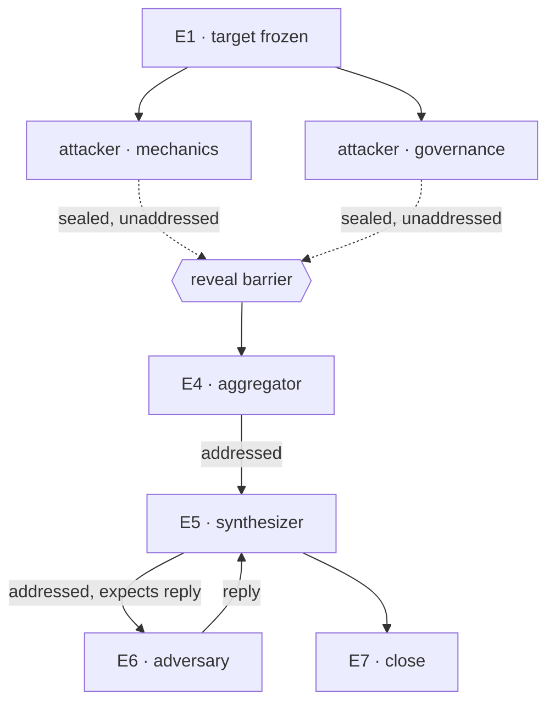

# Agent Work Infrastructure — a System and Engineer View

> **Two voices in one file, deliberately.** Part I is a `system-view`: it explains the shape and
> **names** each load-bearing stance without deciding it. Part II is an `engineer-view`: it owns
> exactly one verdict per named stance, plus the contracts, the mechanics, and the failure modes.
> Nothing is decided twice. Terms defer to a future `ontology-view` that **does not yet exist** —
> every term below is provisional.
>
> This is a target state. It is not a description of anything running. `authority: proposal-only`.

---

# Part I — system-view

## 1. Surface

A request fans out to several agents. What comes back is only as good as the judgment behind it,
and judgment degrades in ways that are invisible unless the infrastructure is built to expose
them: agents contaminate each other, their outputs are pasted together rather than aggregated, and
nobody can later reconstruct who said what on what basis.

This view describes the infrastructure that would make a fan-out **inspectable by construction**:
one where the shape of the work is confirmed before it runs, where every message an agent sends
carries an explicit contract, and where an agent's independent judgment is structurally incapable
of leaking to its peers before it is sealed.

The reader this is written for is the person deciding whether to build it.

## 2. Shape

### 2.1 Services, not phases

The first temptation is to draw a pipeline: classify, plan, compile, run. That reading is wrong in
a way that matters. These are **services with boundaries**, not stages in a line. They have
different lifetimes, different cache behaviour, and different owners. Some run once per question,
some run once per *kind* of question and are reused forever, and one of them — the fabric — is
orthogonal to all the others and is present the whole time.

```text
  question
     │
     ├─▶ CLASSIFIER      question → dispatch_type + reason
     │
     ├─▶ PROTOCOL        dispatch_type → the canonical step sequence      (per TYPE, cached)
     │
     ├─▶ COMPILER        protocol + question → work graph → runtime plan  (per INSTANCE)
     │
     └─▶ EXECUTION       resolves prompts, delivers, collects emissions

        ═══ FABRIC ═══   addresses · seals · records · validates
                         (orthogonal; never a step)
```

The compiler does not embed prompt text. Execution owns prompt resolution, which means the two
evolve at different speeds — a prompt template can improve without invalidating a confirmed work
graph. What that costs is named as a stance below.

| Alternative framing | Why set aside |
|---|---|
| One orchestration engine that does all four | Collapses four different lifetimes into one release cadence; a prompt fix would require recompiling a confirmed graph. |
| A workflow DSL executed top to bottom | A pipeline cannot express the fabric, which is present during every step and is a step in none of them. |
| Let the orchestrator agent improvise the sequence | Then the sequence is not inspectable before it runs, and there is nothing to confirm. |

### 2.2 The protocol belongs to the type

A `dispatch_type` is not just a label on a row. It should carry a **canonical sequence of steps**:
what a `review` always does, in order, regardless of what is being reviewed. That sequence knows
nothing about any particular question. It is versioned, addressable, and reused across every
dispatch of its type.

This is the layer that does not exist today in any form — current sequences are written by hand,
per phase, and thrown away. Making the sequence an object of the type is what turns "we ran a
review" from a claim into a comparison: two reviews of the same protocol version are comparable
because they had the same shape.

| Alternative framing | Why set aside |
|---|---|
| Sequence per dispatch, authored fresh each time | No two dispatches are comparable, and the authoring cost recurs in full every run. |
| One universal sequence for all types | The reason types exist is that a `research` and a `code` dispatch have genuinely different shapes. |
| Sequence inferred from the question by a model | Inference is a new assertion; it cannot be diffed against the previous run. |

### 2.3 The graph belongs to the instance

Applying a protocol to a question produces a **work graph**: the concrete nodes, with concrete
roles and concrete opposed angles, and the edges between them. This is the artifact a human reads
and confirms. It is legible on purpose — *"step 3: two independent attackers read the proposal and
emit sealed judgment"* — because a confirmation over something illegible is not a confirmation.

Downstream of that graph is a second artifact the machine consumes: addresses, bindings, budgets,
response schemas. The relationship between the two is the load-bearing question of this whole
design, and it is named as a stance.

| Alternative framing | Why set aside |
|---|---|
| Confirm the machine-readable plan directly | A human confirming a schema-shaped object is rubber-stamping, not judging. |
| Confirm only the intent, let the graph be derived | Then the thing that runs was never seen, and the confirmation attaches to nothing executable. |
| No confirmation; trust the protocol | The protocol is generic; the angles and the target are exactly what needs a human look. |

### 2.4 The emission belongs to the edge

The instinct is to configure an agent's *mode*: this one reports to that one, that one evaluates
independently. That framing puts the property in the wrong place. The same agent may emit sealed
judgment at one step and address a peer at another. The configurable unit is the **emission**, not
the agent.

An emission varies along three axes that move independently:

- **address** — whether there is a recipient. This axis alone decides whether an edge exists in
  the graph, and therefore whether the reveal barrier applies.
- **payload** — judgment (built to be aggregated, so it needs a scale shared across its group),
  content (built to be read by one recipient, so any bilateral shape will do), or empty (the value
  is in the act of emitting).
- **return** — nothing, an acknowledgement, or a reply. This axis alone decides whether the
  emitting node blocks.

Naming three axes rather than four emission types is not tidiness. Each axis governs a different
mechanism — barrier, format, blocking — and an enumeration cannot express "this one blocks and
that one does not" without enumerating every crossing.

A consequence worth stating plainly: an emission may carry nothing at all. A reminder is an
emission whose entire value is that it was delivered and acknowledged. Whether the *record* of
such an emission is still an event is a stance.

| Alternative framing | Why set aside |
|---|---|
| Two modes: send-to-peer or evaluate-alone | Cannot express a reminder, an unaddressed work note, or a judgment sent to one recipient. |
| Mode as a property of the agent | Forces one agent per behaviour and multiplies the node count for no semantic gain. |
| One enum of emission types | Blocking, formatting, and barrier behaviour stop being separately expressible. |

### 2.5 The fabric transports and never authors

Two agents communicating "directly" can mean two very different things: no intermediary *author*,
or no intermediary *transport*. The design takes the first. A fabric sits between every pair — it
addresses, delivers, seals, validates shape on delivery, and records — and it never rewrites,
summarises, reinterprets, chooses a recipient, or judges which answer is better. The bytes one
agent emitted are the bytes another agent reads.

This is what makes provenance possible at all: if the transport records nothing, every claim about
who said what has to be reconstructed after the fact from artifacts that were never designed to
support the question.

| Alternative framing | Why set aside |
|---|---|
| Point-to-point channel with no fabric | Lower latency, but no record of the exchange and a second writer of durable facts. |
| A relay agent that normalises messages between peers | The relay becomes an author; downstream, attribution is ambiguous by construction. |
| Fabric that also routes by content | Routing becomes a judgment, which is exactly what the fabric must not make. |

## 3. Layering

Three strata, distinguished by what may change and who may change it:

**Given.** The three emission axes, the fabric's non-authoring rule, and the requirement that the
confirmed shape is the executed shape. These are the frame; changing one changes what the system
*is*, not how it behaves.

**Optimised.** Protocol sequences per type, angles per node, prompt templates, budgets, aggregation
rules, barrier policy. These are meant to be tuned, versioned, and compared across runs. Most of
the value of the system is in learning to tune these well.

**Accumulated.** The event record, the emission history, the confirmed digests. These only grow.
They are never edited, and the interesting property is not their content but that they are
sufficient to replay.

The design fails quietly when something migrates between strata without anyone noticing — an
optimised knob hardening into a given, or a given eroding into a knob.

## 4. Shape diagram

One dispatch of a hypothetical `review` protocol, showing both emission kinds:



The dotted edges are not edges. They are drawn to show where sealed judgment goes; in the work
graph itself those nodes have no outgoing edge at all, which is precisely why the two attackers
cannot contaminate each other.

## 5. Named stances

Each is named here and decided exactly once in Part II.

| Stance | The tension |
|---|---|
| `stance:protocol-mutability` → `engineer-view#D1` | Reuse and comparability across runs vs. adapting the sequence to an unusual question. |
| `stance:confirmation-topology` → `engineer-view#D2` | Confirming something legible vs. confirming something faithful to what will run. |
| `stance:prompt-binding-time` → `engineer-view#D3` | A digest that covers the literal prompt vs. a prompt service that can improve independently. |
| `stance:emission-event-totality` → `engineer-view#D4` | Complete provenance and replay vs. the cost of recording emissions that carry nothing. |
| `stance:fabric-authority` → `engineer-view#D5` | The convenience of a mediator that normalises vs. unambiguous authorship. |
| `stance:barrier-override` → `engineer-view#D6` | Unblocking a stuck dispatch vs. the independence guarantee the barrier exists to provide. |
| `stance:judgment-scale-scope` → `engineer-view#D7` | Cross-dispatch comparability of judgments vs. a scale that fits the local question. |
| `stance:ack-first-classness` → `engineer-view#D8` | Traceable delivery vs. journal noise. |
| `stance:execution-service-boundary` → `engineer-view#D9` | One simpler component vs. boundaries that can evolve at their own pace. |

## 6. What Part I does not cover

Record shapes, enums, failure codes, runtime wiring, and every verdict above belong to Part II.
Term meanings belong to an `ontology-view` that does not exist; `dispatch`, `agent`, `event`,
`judgment`, `authority`, `protocol`, and `emission` are all used provisionally here.

---

# Part II — engineer-view

> **What this part owns:** one verdict per stance named in Part I, the contracts, the mechanics,
> and the failure modes. It does not re-narrate the shape (point up to Part I) and does not define
> terms (there is no ontology-view to point sideways to; this is recorded as a gap, not filled).

## 7. Decision inventory

| # | Stance | Verdict | Status | Authority |
|---|---|---|---|---|
| D1 | `stance:protocol-mutability` | A `ProtocolSpec` is immutable per version. Adapting to a question happens by choosing a different version or authoring a new one — never by editing in place for one run. | OPEN | Proposal of this document; no gate in repo |
| D2 | `stance:confirmation-topology` | Two confirmations, **one digest**. Confirm #1 approves the work graph's content; confirm #2 authorises firing that same digest. The runtime plan must be a pure function of the work graph: no node and no edge may be born at compile time. | **CRITICAL** | Proposal of this document; no gate in repo |
| D3 | `stance:prompt-binding-time` | The digest freezes the **binding and template version**, not the rendered text. Execution renders at run time; the rendered text is recorded as an emission fact. | OPEN | Owner direction, session 2026-07-27 (execution is a separate service) |
| D4 | `stance:emission-event-totality` | Every emission produces an event; not every emission carries content. The event records that an emission occurred, its axes, and its binding. An empty-payload emission still produces an event. | OPEN | Proposal of this document; no gate in repo |
| D5 | `stance:fabric-authority` | The fabric transports and never authors. It may address, deliver, seal, validate shape, apply budget, and record. It may not rewrite, summarise, reinterpret, choose a recipient, or rank answers. | RESOLVED | Owner direction, session 2026-07-27 |
| D6 | `stance:barrier-override` | Undecided. No principal is currently authorised to open a barrier early, and no override path is specified. | **CRITICAL** | No gate in repo |
| D7 | `stance:judgment-scale-scope` | Undecided between a scale fixed per `dispatch_type` and a scale fixed per aggregation group. The weaker constraint that must hold either way: judgments aggregated together share one scale. | OPEN | No gate in repo |
| D8 | `stance:ack-first-classness` | Undecided. Whether an acknowledgement is its own event or a field on the emission event changes what a delivery failure looks like in the record. | OPEN | No gate in repo |
| D9 | `stance:execution-service-boundary` | Execution is a separate service from the compiler. It owns prompt resolution and emission collection. | RESOLVED | Owner direction, session 2026-07-27 |

Two rows are CRITICAL because the core thesis does not survive them being wrong. D2: if the
executed topology can differ from the confirmed one, every confirmation in the system is theatre.
D6: if any principal can open the barrier early, independence — the property the whole design
exists to produce — is unenforced.

## 8. Contracts

### 8.1 Emission

```text
emission:
  address   : sealed | directed(<node>)
  payload   : judgment | content | empty
  return    : none | ack | reply
  binding   : (prompt_template@version, response_format@version)
```

The four combinations named in Part I are examples, not an enumeration. All 2 × 3 × 3 crossings
are expressible; the useful ones will be discovered, not designed.

Derived rules, each following from exactly one axis:

- `address = sealed` ⟹ no edge in the work graph ⟹ the barrier applies ⟹ no principal may read
  the payload before the barrier opens.
- `payload = judgment` ⟹ `response_format` must be the one shared by the emission's aggregation
  group. Mixed formats within a group is not a degraded aggregation; it is not an aggregation.
- `return = reply` ⟹ the emitting node blocks and inherits a deadline. `return = none` ⟹ it does
  not.

### 8.2 Node

```text
node:
  role            # what it is
  angle           # the lens; this is what is opposed to its pair's
  receives        # from which nodes, what
  emits           # one or more emissions
  gates           # what must pass before and after
  budget
```

### 8.3 The two compiled artifacts

```text
ProtocolSpec        # per dispatch_type, versioned, cached, question-agnostic
  steps[]           # ordered; each step declares role, emission axes, gates
  aggregation       # which steps form a group, and the shared scale

WorkGraph           # per question; what a human confirms
  nodes[] edges[]   # concrete roles, concrete angles

RuntimePlan         # per question; what the machine consumes
  = f(WorkGraph, ProtocolSpec@version)
  channels[] bindings[] budgets[] schemas[]
```

### 8.4 Failure-code family

A first cut at the codes the fabric would need to fail closed on, given D5:

| Code | Raised when |
|---|---|
| `EMIT-SHAPE` | A payload does not match its declared `response_format@version`. |
| `EMIT-SCALE` | A judgment's format differs from its aggregation group's shared scale. |
| `BARRIER-EARLY` | A read of a sealed payload is attempted before the barrier opens. |
| `PLAN-DRIFT` | A `RuntimePlan` contains a node or edge absent from the confirmed `WorkGraph`. |
| `BIND-STALE` | A template version referenced by a confirmed digest no longer resolves. |
| `DEADLINE` | A node with `return = reply` exceeds its deadline. |
| `CYCLE-BLOCK` | Two or more nodes are mutually blocked on `return = reply`. |

## 9. Mechanics

**Confirmation and the digest.** The digest closes over the work graph, the protocol version, and
every `(prompt_template@version, response_format@version)` binding. It does not close over rendered
prompt text — that is D3. Compilation is checked against the digest rather than trusted: `PLAN-DRIFT`
is the check that makes D2 enforceable rather than merely intended.

**The barrier.** Sealed payloads are held by the fabric and are unreadable — by peers, by the
aggregator, and by the orchestrator — until the barrier opens. The opening condition is the
aggregation group reaching its declared completion rule. What happens when it cannot is D6, and is
open.

**Aggregation.** The aggregator reads the full set only after the barrier and produces a
reproducible aggregate — distribution, frequency, agreement — without editing any individual
judgment. It is deterministic: the same sealed set produces the same aggregate.

**Blocking.** Only `return = reply` blocks. `ack` is a delivery signal, not a rendezvous, so an
emission expecting `ack` does not stall a node. Whether that signal is its own event is D8.

**Recording.** Every emission produces an event carrying its axes, its binding, its digest lineage,
and its payload when non-empty. Under D4 this is total, including empty payloads. The event record
is append-only; corrections append rather than rewrite.

## 10. Failure modes

| # | Failure | What it looks like | Violates |
|---|---|---|---|
| FM-1 | **Decorative confirmation** | The compiled plan contains a node or an edge the human never saw. Every downstream guarantee inherits an unaudited topology. | D2 |
| FM-2 | **Barrier leak** | A peer, or the orchestrator "just checking", reads a sealed judgment before the barrier. Independence is gone and nothing in the record shows it. | D6, barrier |
| FM-3 | **Collage, not aggregation** | Judgments on incompatible scales are aggregated. The output looks like a distribution and means nothing. | `EMIT-SCALE` |
| FM-4 | **Authoring fabric** | The transport normalises or summarises in flight. Attribution becomes unrecoverable, silently. | D5 |
| FM-5 | **Unrecorded reminder** | An empty-payload emission is not recorded. Nobody knows whether it was delivered; replay diverges from history. | D4 |
| FM-6 | **Prompt drift** | A template changes between confirmation and execution without a new digest. The confirmed dispatch and the executed one differ in the one place nobody is looking. | D3, `BIND-STALE` |
| FM-7 | **Second writer** | The fabric persists durable facts that never passed the validated appender. Two sources of truth, discovered later, by contradiction. | Single-writer |
| FM-8 | **Dead protocol** | `ProtocolSpec` is edited per run until it is no longer a property of the type. The cache is useless and cross-dispatch comparison is meaningless. | D1 |
| FM-9 | **Circular block** | Two nodes each wait for the other's reply. | `CYCLE-BLOCK` |

FM-2 and FM-7 share a property worth stating: both are silent. Nothing in the output looks wrong,
and the damage is only visible to someone who goes looking for a record that was never written.
Failure modes that announce themselves are cheaper than these two by a wide margin.

## 11. Cross-reference map

| Claim family | Owner |
|---|---|
| Shape, layering, stance naming | Part I of this document |
| Verdicts, contracts, mechanics, failure modes | Part II of this document |
| Term meanings | **Unowned** — no `ontology-view` exists |
| Plan authority and boundary | `plans/README.md` |
| Decision-hygiene rationale for barrier and aggregation | `plans/governed-agent-work-infrastructure/PLAN.md` §3.1, §3.3 |
| Kernel-level invariant candidates (authority, provenance, one owner) | `plans/governed-agent-work-infrastructure/plans/agent-work-language-research/CANDIDATE-INVARIANTS.md` |

## 12. Open Questions

- Can `PLAN-DRIFT` be a **structural** guarantee — the compiler unable to emit an unconfirmed node —
  rather than a check that runs after the fact?
- Is there any legitimate barrier override, or is a stuck aggregation group always a dispatch that
  should fail rather than proceed? (D6)
- Is the judgment scale fixed per `dispatch_type` or per aggregation group? (D7)
- Is an acknowledgement its own event? What does a lost `ack` look like in the record? (D8)
- Does an emission need a fourth axis for **visibility** — who besides the recipient may read it —
  or is that fully determined by `address` plus the barrier?
- What is the smallest `ProtocolSpec` that is still worth caching, and does a one-node dispatch have
  a protocol at all?
- Who authors a new `ProtocolSpec` version, and what evidence promotes it from draft to reusable?
- If two dispatches share a protocol version, what exactly is comparable between them — and is that
  comparability an outcome the design should optimise for, or a side effect?

---

## system-view Result

- Status: flag
- Target boundary: the target-state infrastructure from dispatch classification to agent emission;
  no current implementation is described or assessed
- Stakeholder altitude: repository owner deciding whether to build it
- Lane handles:
  - surface: §1 · shape: §2 (five layers) · layering: §3 · stances: §5 ·
    alternative_framings: §2.1–2.5 · shape_diagrams: §4 · deferrals: §6
- Stances named: nine, each routed to exactly one Part II row (`D1`–`D9`)
- Decided-nothing check: pass — Part I names tensions and states no verdict
- Term-deferral check: **flag** — no `ontology-view` exists; all terms are provisional and unowned
- Evidence boundary: owner direction from session 2026-07-27 for D5 and D9; everything else is
  proposal by this document with no repository gate

## engineer-view Result

- Status: flag
- Target boundary: as above
- Lane handles:
  - decision_inventory: §7 · contracts: §8 · mechanics: §9 · cross_reference_map: §11 ·
    deferrals: §11 (ontology row, recorded unowned)
- Decisions: D1 OPEN · **D2 CRITICAL** · D3 OPEN · D4 OPEN · D5 RESOLVED · **D6 CRITICAL** ·
  D7 OPEN · D8 OPEN · D9 RESOLVED
- Stance-coverage check: pass — nine stances, nine rows, one each
- Authority check: **flag** — only D3, D5, D9 cite an authority outside this document; the other six
  cite "no gate in repo", which is honest but means six of nine verdicts are proposals
- Nothing-decided-twice check: pass — no shape re-narrated, no term defined
- Open / Critical rows: D2 and D6 are CRITICAL; neither has a specified mechanism, and the core
  thesis does not survive either being wrong
