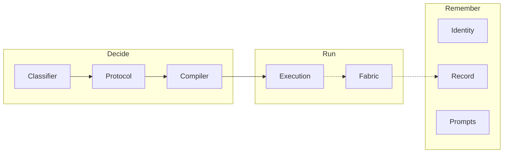

# A Hypothesis for the Final Architecture

> **Two views in one file.** Part I is a `system-view`: it explains the shape and **names** every
> load-bearing stance without deciding any of them. Part II is an `engineer-view`: it owns exactly
> one verdict per named stance, plus the contracts and the mechanics. Nothing is decided twice.
> Terms defer to an `ontology-view` that **does not exist**; every term here is provisional.
>
> A proposal of the finished shape, written to be argued with. `authority: proposal-only`.

---

# Part I — system-view

## 1. Surface

Imagine work that carries a complete account of itself.

You point at anything — a paragraph, a decision, a line of code, a conclusion someone is relying on
— and ask what produced it. The answer comes back complete: the question that prompted it, the agents
that worked on it, what each said and on what basis, the authority they ran under, the evidence they
used, and everything since built on top of it. Not reconstructed from clues. Retrieved, because it
was recorded when it happened.

In that world nothing must be remembered. An objective from months ago still has its live thread down
to whatever runs under it today, and anything running can name the objective it serves. When a
conclusion turns out to be wrong, everything that leaned on it identifies itself.

The reader this is written for is the person deciding whether to build it.

## 2. Why the shape is worth having

Work compounds instead of evaporating. Agent reasoning happens inside a context that closes and does
not reopen; what lasts is only what was written down. If the record cannot be reassembled, the
thinking is gone however good it was, leaving outputs nobody can vouch for.

A second consequence matters more for governance. Rules over agent work — this was confirmed, this
was authorised, this stayed inside its boundary — are real only if they can be checked against a
record. Without one, every guarantee is a claim about something nobody can inspect.

| Alternative framing | Why set aside |
|---|---|
| Better logging | Logs record that things happened, not what connects them; the questions here are relational. |
| A document repository with good search | Retrieval finds text; it does not establish that this artifact came from that activation. |
| A task tracker with rich metadata | Preserves assignment and status while losing justification, authority, and outcome evidence. |
| Reconstruct provenance on demand from artifacts | Reconstruction infers; the ideal in §1 requires facts recorded at the time they were true. |

## 3. The hypothesis

> The system is a small set of services whose joint output is one durable, connected record of
> everything that was done — and those services can be **derived** from what that record must do,
> rather than chosen first and justified afterwards.

The derivation is the claim. Any service list can be made to sound reasonable; the question is
whether it follows from something. §4 states what the record must do, §5 derives what must exist.

**Method constraint.** Nothing in Part I is derived from what this repository currently has. The
ideal is worked out on its own terms; existing components are compared to it afterwards, never
before. Reasoning from the current inventory would produce a target shaped like the present.

## 4. Shape — what the record must do

Seven requirements. Each is stated as shape; the contested choice inside each is named in §6 and
decided only in Part II.

**R1 · A thing stays addressable when its description changes.** Names, folders and classifications
move; the thing they refer to does not become a different thing. A record whose identities are paths
loses its history at the first rename.

**R2 · Two runs of the same kind are comparable.** Comparability requires that the shape of the work
belong to the kind rather than being invented per run — otherwise the record holds many runs and no
basis for relating any two.

**R3 · The confirmed thing and the executed thing are the same thing.** If the executed shape can
differ from the confirmed one, confirmation attests to nothing and every downstream guarantee
inherits an unaudited topology.

**R4 · An independent judgment is not visible to peers before it is fixed.** Independence that is
claimed rather than structurally prevented cannot be distinguished, after the fact, from
contamination.

**R5 · What was said is what is read.** Anything that rewrites, summarises or reinterprets in transit
becomes an author, and attribution downstream is ambiguous by construction.

**R6 · What happened is recoverable later.** Including acts that carry no content. A record with
silent gaps is indistinguishable from a record of a system where nothing happened.

**R7 · A connection means something specific.** `produced-by` is not `accepted-as`; `part-of` is not
`authorised-by`. Proximity in a folder or in time establishes nothing.

R1, R6 and R7 make the record *exist*; R2–R5 make it *trustworthy*. A complete record of
untrustworthy facts is not better than no record.

| Alternative framing | Why set aside |
|---|---|
| One `parent` relation over everything | A piece of work participates in several contexts at once; one relation cannot carry their different meanings (R7). |
| Folder structure as the record | Placement is one projection of a thing's properties, not its identity (R1). |
| Record only what carries content | Makes delivery unverifiable and replay divergent from history (R6). |
| Trust agents to stay independent | Moves a structural property into a behavioural hope, unobservable in the record (R4). |

## 5. Shape — what must exist

Each service is here because some requirement demands it. Nothing is here for another reason.



**Remembering.** *Identity* mints and keeps identities and owns typed relations between them (R1,
R7) — every other service names things through it. *Record* is the account of what occurred (R6);
it owns events and nothing else does. *Prompts* holds versioned, typed instructions addressable by
version, because R3 requires saying exactly which instruction was confirmed, which is impossible if
instructions are strings pasted into a plan.

**Deciding what to run.** *Classifier* determines the kind, since R2 is stated over kinds.
*Protocol* holds the canonical sequence for a kind, versioned and question-agnostic — the thing that
makes two runs comparable. *Compiler* applies a protocol to a question, producing the shape a human
confirms and, from it, the plan a machine consumes (R3).

**Running it.** *Execution* resolves instructions at run time and collects what comes back. *Fabric*
sits between every pair of agents, addressing, delivering, holding sealed payloads, checking shape
and recording (R4, R5). It is not a step; it is present during all of them.

| Requirement | Provided by |
|---|---|
| R1 addressable across description change | Identity |
| R2 comparable runs of a kind | Classifier, Protocol |
| R3 confirmed is executed | Compiler, Prompts, Execution |
| R4 judgment sealed until released | Fabric |
| R5 message unchanged in transit | Fabric |
| R6 what happened is recoverable | Record |
| R7 connections carry meaning | Identity |

Eight services, seven requirements, no orphan in either column. That correspondence is the
hypothesis's main testable claim.

| Alternative framing | Why set aside |
|---|---|
| One orchestration engine doing all of it | Collapses different lifetimes into one release cadence; an instruction fix would invalidate a confirmed shape. |
| A pipeline executed top to bottom | Cannot express the fabric, which is present during every step and is a step in none. |
| Let an orchestrator agent improvise the sequence | The sequence is then not inspectable before it runs, so there is nothing to confirm (R2, R3). |
| Fold the record into whichever service produces it | Multiple writers of durable facts; contradiction discovered later (R6). |

## 6. Layering

**Given.** The seven requirements and the single-writer rule. Changing one changes what the system
*is*, not how it behaves.

**Optimised.** Protocol sequences, instruction templates, angles, budgets, aggregation rules, release
policy. These are meant to be tuned and compared across runs.

**Accumulated.** Events, emissions, confirmed digests. These only grow; the interesting property is
not their content but that they are sufficient to replay.

The design fails quietly when something migrates between strata unnoticed — an optimised knob
hardening into a given, or a given eroding into a knob.

## 7. Named stances

Each is named here with its tension and decided exactly once in Part II.

| Stance | The tension |
|---|---|
| `stance:identity-basis` → `engineer-view#D1` | Minted identities that survive every rename vs. the capture cost of minting one for everything. |
| `stance:protocol-mutability` → `engineer-view#D2` | Reuse and comparability across runs vs. adapting the sequence to an unusual question. |
| `stance:confirmation-topology` → `engineer-view#D3` | Confirming something legible vs. confirming something faithful to what will run. |
| `stance:prompt-binding-time` → `engineer-view#D4` | A digest covering the literal instruction vs. an instruction service that improves independently. |
| `stance:release-condition` → `engineer-view#D5` | Sealing as a property of the message vs. of the recipient that will receive it. |
| `stance:fabric-authority` → `engineer-view#D6` | The convenience of a mediator that normalises vs. unambiguous authorship. |
| `stance:record-totality` → `engineer-view#D7` | Complete replay vs. the cost of recording acts that carry nothing. |
| `stance:relation-composition` → `engineer-view#D8` | Useful derived paths vs. conclusions no accepted relation warrants. |
| `stance:authority-ownership` → `engineer-view#D9` | Authority as its own service vs. a property of the record. |

## 8. What this view does not cover

Record shapes, enums, failure codes, runtime wiring, and every verdict above belong to Part II. Term
meanings belong to an `ontology-view` that does not exist: `record`, `event`, `emission`, `judgment`,
`authority`, `protocol`, `identity` and `context` are all used provisionally and are **unowned**.

---

# Part II — engineer-view

> **What this part owns:** one verdict per stance named in Part I, the contracts, and the mechanics.
> It does not re-narrate the shape (point up to Part I) and does not define terms — there is no
> `ontology-view` to point sideways to, which is recorded as a gap rather than filled.

## 9. Decision inventory

| # | Stance | Verdict | Status | Authority |
|---|---|---|---|---|
| D1 | `stance:identity-basis` | Identity is minted and independent of placement. A path locates an object; it never *is* one. Minting is required for anything another artifact may reference. | OPEN | [work-context essay §8, §26](../work-context-system-view/essay.md) (placement is a projection); no gate in repo |
| D2 | `stance:protocol-mutability` | A protocol is immutable per version. Adapting to a question means choosing a different version or authoring a new one, never editing in place for one run. | OPEN | Proposal of this document; no gate in repo |
| D3 | `stance:confirmation-topology` | Two confirmations, **one digest**: the first approves the content of the shape, the second authorises firing that same digest. The machine-consumed plan is a pure function of the confirmed shape — no step is born at compile time. | **CRITICAL** | Proposal of this document; no gate in repo |
| D4 | `stance:prompt-binding-time` | The digest freezes the **binding and template version**, not the rendered text. Execution renders at run time and the rendered text is recorded as a fact. | OPEN | Owner direction, session 2026-07-27 (execution is a separate service) |
| D5 | `stance:release-condition` | Release lives on the **recipient**, not the message. A sealed judgment is addressed to its aggregation point under a condition not yet met; the recipient set carries cardinality. | OPEN | Adversarial review of the companion essay, 2026-07-27 |
| D6 | `stance:fabric-authority` | The fabric transports and never authors. It may address, deliver, seal, validate shape, apply budget and record. It may not rewrite, summarise, reinterpret, choose a recipient or rank answers. | RESOLVED | Owner direction, session 2026-07-27 |
| D7 | `stance:record-totality` | Every act produces an event; not every act carries content. An empty-payload act still produces an event carrying its axes and binding. | OPEN | Proposal of this document; no gate in repo |
| D8 | `stance:relation-composition` | Undecided. Which relation paths license a derived conclusion, and what witness a derivation must carry, is not settled. Direct relations remain the only attributable source material. | OPEN | [work-context essay `OD-04`](../work-context-system-view/essay.md); no gate in repo |
| D9 | `stance:authority-ownership` | Undecided. §1 requires work to run under authority and no service in §5 provides it. Either a ninth service exists or authority is a property of the record. | **CRITICAL** | No gate in repo |

Two rows are CRITICAL because the hypothesis does not survive them being wrong. D3: if the executed
shape can differ from the confirmed one, every confirmation is theatre. D9: if authority has no
owner, §5's requirement-to-service correspondence — the document's main claim — has a hole in it.

Six of nine rows cite no repository gate. That is honest, and it means six of nine verdicts are
proposals of this document rather than established facts.

## 10. Contracts

Deliberately minimal. Enums, failure-code families and storage belong to a specification.

**Emission.**

```text
emission:
  recipients : who receives it, and under what release condition
  payload    : judgment | content | empty
  return     : none | ack | reply
  binding    : (prompt@version, format@version)
```

Following from D5, a sealed emission is not unaddressed — it is addressed under an unmet condition.
Judgments aggregated together share one format: mixed formats within a group is not a degraded
aggregation, it is not an aggregation.

**Digest.** Closes over the confirmed shape, the protocol version, and every
`(prompt@version, format@version)` binding. It does not close over rendered text (D4).

**Single writer.** Durable facts enter through the Record and nowhere else.

## 11. Mechanics

**Confirmation.** The compiled plan is checked against the digest rather than trusted. A plan
containing a step absent from the confirmed shape fails closed; that check is what makes D3
enforceable rather than merely intended.

**Release.** Sealed payloads are held by the fabric and are unreadable — by peers, by the aggregation
point, by the orchestrator — until the recipient's condition is met. What happens when it cannot be
met is unspecified and belongs to D5's unresolved surface.

**Recording.** Every act produces an event carrying its axes, its binding and its digest lineage,
plus its payload when non-empty (D7). The record is append-only; corrections append.

## 12. Cross-reference map

| Claim family | Owner |
|---|---|
| Shape, layering, stance naming | Part I |
| Verdicts, contracts, mechanics | Part II |
| Term meanings | **Unowned** — no `ontology-view` exists |
| Macro-to-micro context, relation composition, authority containment | [work-context system-view](../work-context-system-view/essay.md) |
| Plan authority and boundary | [plans/README.md](../../../README.md) |

## 13. How this could be wrong

1. **A requirement with no service.** D9 is the live instance: §1 requires authority and §5 provides
   none.
2. **A service no requirement demands.** Then it was chosen for a reason not admitted here.
3. **A connection the shape cannot carry** — an assertion to the activity that produced it, across
   contexts.
4. **Decorative confirmation** (D3 wrong) and **silent leakage** (D5/D6 wrong). Both are dangerous
   because neither announces itself.

---

## system-view Result

- Status: flag
- Target boundary: the finished-state architecture producing one connected record; no current
  implementation is described or assessed
- Stakeholder altitude: repository owner deciding whether to build it
- Lane handles:
  - surface: §1–§2 · shape: §4–§5 · layering: §6 · stances: §7 ·
    alternative_framings: §2, §4, §5 · shape_diagrams: §5 · deferrals: §8
- Stances named: nine, each routed to exactly one Part II row (`D1`–`D9`)
- Decided-nothing check: pass — Part I names tensions and states no verdict
- Term-deferral check: **flag** — no `ontology-view` exists; all terms provisional and unowned
- Evidence boundary: owner direction (session 2026-07-27) for D4 and D6; companion essay for D1 and
  D8; everything else is proposal by this document

## engineer-view Result

- Status: flag
- Target boundary: as above
- Lane handles:
  - decision_inventory: §9 · contracts: §10 · mechanics: §11 · cross_reference_map: §12 ·
    deferrals: §12 (ontology row, recorded unowned)
- Decisions: D1 OPEN · D2 OPEN · **D3 CRITICAL** · D4 OPEN · D5 OPEN · D6 RESOLVED · D7 OPEN ·
  D8 OPEN · **D9 CRITICAL** — all nine cite an authority or explicitly record its absence
- Stance-coverage check: pass — nine stances, nine rows, one each
- Authority check: **flag** — only D1, D4, D5, D6 and D8 cite an authority outside this document;
  four rows cite "no gate in repo"
- Nothing-decided-twice check: pass — no shape re-narrated, no term defined
- Open / Critical rows: D3 and D9
