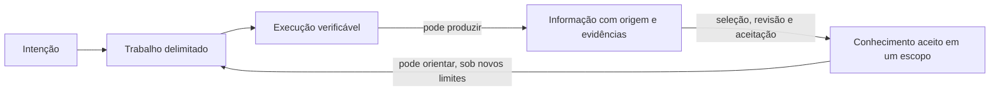

# Um sistema para ampliar o trabalho com agentes de IA

> Este documento apresenta a direção do produto. Parte da infraestrutura descrita já existe, mas o
> sistema completo ainda é uma proposta.

## Objetivo

Ampliar a capacidade de uma pessoa organizar e executar trabalho com agentes de IA, mantendo esse
trabalho compreensível e controlável.

A pessoa deve poder começar pelo resultado que pretende alcançar, mesmo quando ainda não sabe qual
trabalho será necessário. A infraestrutura propõe uma forma de avançar, coordena a execução e
devolve ao usuário três coisas: uma visão do que importa, decisões que realmente exigem sua
participação e resultados acompanhados das razões e evidências necessárias para avaliá-los.

O ganho pretendido não é apenas fazer mais tarefas. É tornar administrável um trabalho que, pela
quantidade de partes, agentes, dependências ou duração, seria difícil coordenar manualmente.

## A relação que o produto propõe

Usar vários agentes costuma transferir trabalho, mas também cria trabalho novo. Alguém precisa
explicar o objetivo, dividir o problema, distribuir contexto, acompanhar dependências, perceber
quando uma premissa mudou, resolver decisões e depois reconstruir como os resultados foram
produzidos. À medida que a execução cresce, essa coordenação pode consumir o benefício obtido com
os agentes.

A proposta é deslocar essa complexidade para a infraestrutura. A relação do usuário com o trabalho
se torna mais simples:

1. dizer o que pretende alcançar e quais limites já conhece;
2. examinar como o sistema propõe organizar o trabalho;
3. autorizar o que pode seguir e decidir o que não deve ser delegado;
4. acompanhar o estado no nível de detalhe necessário;
5. intervir quando surgir uma decisão fora dos limites concedidos;
6. avaliar o resultado junto de sua história e de suas evidências.

“Mais simples” não significa esconder o trabalho. Significa não exigir atenção contínua à
coordenação interna, sem impedir que o usuário aprofunde a inspeção quando precisar entender uma
decisão, um desvio ou um resultado.

## Por que delegar tarefas não basta

Trabalho geralmente começa com um resultado desejado, não com uma especificação completa. Para
agir, é preciso decidir o que fazer, como dividir, quem ou o que ficará responsável e quais limites
se aplicam. Cada decisão torna o trabalho mais executável, mas também cria relações que precisam
continuar compreensíveis.

Quando uma parte é entregue a um agente, ele recebe um contexto local para poder agir. Essa
redução é útil, porém arriscada: o agente pode concluir corretamente sua parte depois que uma
premissa relevante mudou; uma resposta localmente boa pode não contribuir para o objetivo; uma
decisão pode alterar o restante da execução sem que seus motivos a acompanhem. Atividade aumenta,
mas o estado e o valor do conjunto ficam menos claros.

O mesmo problema continua depois da execução. Um resultado pode parecer convincente e ainda ter
suporte fraco. Outra pessoa ou outro agente pode encontrá-lo no futuro sem saber em quais condições
ele foi aceito. Guardar a resposta preserva o conteúdo, mas não preserva necessariamente uma razão
para confiar nela ou aplicá-la novamente.

Portanto, o problema não é apenas comunicação entre agentes. O objetivo, a divisão do trabalho,
as decisões, os limites, os acontecimentos e as evidências precisam permanecer relacionados.

## Como seria usar o sistema

Considere uma pessoa responsável por reduzir o abandono no cadastro de um produto digital. Ela
sabe que a mudança não pode alterar critérios de risco nem ampliar a coleta de dados pessoais sem
uma nova aprovação, mas ainda não sabe se o problema está na interface, nas regras ou na
implementação.

Em vez de transformar o pedido diretamente em tarefas, o sistema propõe três frentes: analisar em
que etapa as pessoas desistem, inspecionar o fluxo no software e comparar intervenções possíveis.
A proposta mostra quais agentes participariam, quais informações receberiam, como as frentes se
relacionam e quais limites se aplicariam. A pessoa pode corrigi-la antes de autorizar a execução.

Depois da autorização, os agentes cuidam de partes locais. Eles recebem o contexto e a liberdade
necessários para suas responsabilidades, sem precisar coordenar todo o sistema ao redor. Durante a
análise, um agente conclui que flexibilizar um critério de risco poderia reduzir o abandono. Como
essa mudança está fora dos limites concedidos, a execução não a incorpora: devolve a alternativa,
seu provável efeito e as evidências disponíveis para decisão. Silêncio não se transforma em
permissão.

Durante o trabalho, a pessoa vê um resumo do estado e pode chegar aos registros que o sustentam.
Se mantiver o limite original, a execução pode seguir com uma mudança na interface e seus testes.
Ao final, ela recebe a alteração proposta, os resultados dos testes, os dados usados para localizar
o abandono e o registro da alternativa rejeitada. Esse material permite responder separadamente:

- o trabalho permaneceu dentro dos limites autorizados?
- as evidências disponíveis sustentam aceitar o resultado?

Cumprir o processo não prova que o resultado é bom. Da mesma forma, um resultado aparentemente bom
não torna irrelevante a maneira como foi produzido.

Esse fluxo descreve o comportamento pretendido. Hoje, o repositório já registra parte do trabalho
de agentes, pode impedir alguns lançamentos sem os registros exigidos e preserva novos eventos sem
reescrever os anteriores. A experiência completa descrita acima ainda não funciona de ponta a
ponta.

## Um segundo olhar: as partes que apareceram no percurso

Até aqui, vimos a experiência sem depender do vocabulário interno do sistema. Alguns nomes agora
permitem distinguir partes que terão regras diferentes.

A descrição aprovada do que deve acontecer é um **dispatch**. Ele reúne e relaciona o objetivo, a
divisão proposta, o contexto necessário, as dependências, os limites aplicáveis e as decisões já
tomadas. Uma mudança que ultrapasse esses limites exige uma nova versão autorizada; ela não
reescreve o que já ocorreu.

Cada execução concreta de um dispatch é uma **tentativa**. O dispatch descreve o que deveria
acontecer; os registros da tentativa descrevem o que aconteceu. Separar prescrição de história
permite comparar a execução com o que foi autorizado sem adaptar retrospectivamente o plano ao
resultado.

Pessoas, agentes, ferramentas ou serviços que tomam parte naquele trabalho são **participantes**.
Cada participante atua por meio de um **papel**, que reúne uma responsabilidade e uma autoridade
limitada naquele contexto. O papel não classifica permanentemente quem o ocupa: o mesmo agente ou
pessoa pode exercer responsabilidades diferentes em outros trabalhos.

**Autoridade** é a permissão para decidir ou agir dentro de limites determinados. Quando uma ação
consequente ultrapassa esses limites, o sistema deve encaminhar a decisão a um papel autorizado.
Se uma parte precisar de nova decomposição, essa decomposição também deve respeitar a autoridade já
concedida. O modelo definitivo dessa organização recursiva ainda é uma decisão arquitetural aberta.

À medida que a tentativa avança, ela produz eventos, contribuições, decisões, resultados e
evidências. Cada registro preserva sua origem e seu estado: algo reportado ou observado durante a
execução não se torna automaticamente um fato aceito. O conjunto forma uma trilha atribuível da
execução. Um resumo pode mostrar o estado atual; a trilha preservada permite verificar depois como
esse estado surgiu. O resumo é uma visão útil, não uma substituição dos registros nem de seus
estados.

Parte da informação produzida pode merecer uso posterior. **Proveniência** registra sua origem e o
processo que a produziu; **evidência** oferece suporte para uma afirmação, sem garanti-la sozinha.
Uma **revisão** examina informação e evidências segundo critérios explícitos. Quando uma decisão a
aceita para reutilização, registra também o escopo, a versão e o estado dessa aceitação. Chamamos de
**conhecimento** o entendimento aceito nessas condições. Ele pode ser posteriormente substituído,
revogado ou restringido sem que sua história anterior seja apagada.

## Como essas partes se compõem

Os elementos acima não formam apenas uma lista. Suas relações permitem enxergar três composições
úteis. Elas são recortes explicativos propostos aqui: não são as únicas formas possíveis de agrupar
o sistema e não determinam quantos serviços ou componentes técnicos deverão existir.

Cada composição responde a uma pergunta diferente.

### 1. Trabalho delimitado

Um dispatch aprovado — relacionando objetivo, divisão, contexto, dependências, limites e decisões
— junto dos participantes, seus papéis e sua autoridade forma uma unidade de **trabalho
delimitado**.

Essas partes pertencem juntas porque respondem, em conjunto: o que buscamos, como pretendemos
avançar, quem pode fazer o quê e até onde pode decidir? Nenhum elemento isolado oferece essa
resposta. A composição transforma uma intenção incompleta em trabalho inspecionável e autorizável.

O limite desse grupo é funcional. Um mesmo trabalho pode também pertencer a um produto, uma
pesquisa, um plano ou uma organização. “Trabalho delimitado” não pretende substituir esses outros
contextos nem descrever tudo o que uma implementação precisará; reúne as relações centrais para
tornar uma execução específica inspecionável antes de começar.

### 2. Execução verificável

Uma **execução verificável** existe quando essas partes permanecem ligadas por relações explícitas:
o dispatch autoriza uma tentativa; atribuições ligam participantes a partes dela; eventos e
decisões registram seu avanço; a tentativa produz resultados; evidências sustentam afirmações sobre
esses resultados; e uma revisão pode aceitá-los, rejeitá-los ou pedir novo trabalho. As visões do
estado preservam essas ligações e o status dos registros que apresentam.

A composição mantém separadas três perguntas:

- o que deveria acontecer?
- o que de fato aconteceu?
- o que as evidências permitem concluir?

Juntas, essas partes permitem acompanhar o presente, reconstruir o passado e avaliar tanto o
respeito aos limites quanto o resultado. Chamamos a produção dessas visões atuais e retrospectivas
de **observação**. Ela lê a trilha da execução; não converte todo registro em fato aceito, não cria
uma segunda história e não garante, por si só, que todo resumo seja completo.

### 3. Continuidade do conhecimento

Proveniência, evidências, revisão, aceitação, versão, estado e escopo formam a **continuidade do
conhecimento** quando permanecem ligados à informação produzida pelo trabalho. Essa composição
permite saber não apenas o que foi aceito, mas sob quais condições isso ocorreu e se a aceitação
continua vigente ou foi substituída, revogada ou restringida.

A proveniência permite inspeção, mas não prova que a informação seja verdadeira, suficiente ou
adequada para um novo uso.

O que emerge dessa composição é a possibilidade de trabalhos futuros aproveitarem entendimento
já produzido sem reconstruí-lo a partir de registros dispersos. A passagem não é automática:
armazenamento não equivale a conhecimento, aceitação não torna uma conclusão universal e uma
aceitação anterior não autoriza qualquer aplicação futura.

## O conjunto que essas composições deixam

As três composições podem formar um ciclo de realimentação:

O trabalho delimitado transforma intenção em ação autorizada. A execução verificável preserva o
que ocorreu e permite avaliar o resultado. Quando alguma informação merece promoção, a
continuidade do conhecimento seleciona o que pode informar trabalhos posteriores, mantendo origem,
suporte, estado e limites.

Esse ciclo conecta um **sistema de trabalho**, responsável por organizar ação em direção a um
resultado, a um **sistema de conhecimento**, responsável por governar qual entendimento pode ser
reutilizado e em quais condições. A separação é importante: histórico de execução não é
conhecimento aceito. A conexão também é importante: conhecimento sem ligação com o trabalho perde
origem; trabalho sem acesso ao que já foi aprendido repete reconstruções desnecessárias.

Vistas por outro ângulo, as mesmas composições sustentam três propriedades da experiência:

| Propriedade | O que o usuário obtém | O que a infraestrutura precisa preservar |
|---|---|---|
| **Baixa carga operacional** | Declara a intenção e acompanha o que importa, sem coordenar cada interação | Divisão, contexto e dependências administrados dentro do trabalho delimitado |
| **Controle** | Autoriza limites e recebe decisões que os ultrapassam | Papéis, autoridade, versões e decisões explícitas |
| **Transparência** | Consulta o estado e recupera como ele surgiu | Eventos preservados, observação, evidências e proveniência |
| **Continuidade** | Aproveita o que trabalhos anteriores estabeleceram | Revisão, aceitação e escopo conectados à origem |

Essa tabela é outra projeção sobre o mesmo sistema: organiza efeitos para o usuário, não novos
componentes da arquitetura.

## Infraestrutura temporária, história persistente

Participantes, canais e recursos podem ser reunidos para um trabalho específico e removidos quando
deixam de ser necessários. Os registros necessários para compreender decisões, resultados e
evidências precisam permanecer. É nesse sentido que a proposta fala em **infraestrutura efêmera de
trabalho**: a estrutura operacional pode ser temporária; a história relevante não.

O termo descreve uma responsabilidade conceitual, não uma arquitetura de implantação. Um único
serviço ou muitos serviços podem realizá-la sem alterar o que o sistema precisa preservar.

## Escopo e estado atual

A arquitetura pretende servir a diferentes domínios, mas essa transferência ainda não foi
demonstrada. O primeiro recorte é o desenvolvimento de software com agentes de IA: este repositório
já coordena esse tipo de trabalho, software deixa artefatos inspecionáveis e muitos resultados
podem ser testados.

Hoje existem partes do substrato: registro obrigatório para alguns trabalhos de agentes, recusa de
lançamento quando faltam registros, histórico acrescentado sem substituir eventos anteriores e um
sistema local experimental que liga algumas execuções às sessões que as produziram.

Ainda são propostas: a experiência completa partindo da intenção do usuário, a linguagem comum de
trabalho operando de ponta a ponta, o retorno automático de decisões fora de autoridade e o sistema
de conhecimento descrito aqui. A forma definitiva de decomposição entre orquestradores também
permanece aberta.

## Como saber se o produto funciona

O produto não deve ser avaliado pela quantidade de agentes, eventos ou registros que produz. Ele
funciona se uma pessoa consegue administrar trabalho mais complexo com menor carga de coordenação
e ainda responder, quando necessário:

- qual resultado estamos buscando e como cada parte contribui para ele?
- quem ou o que é responsável, e dentro de quais limites?
- qual é o estado atual e quais decisões estão abertas?
- por que uma decisão foi tomada e o que mudou depois dela?
- o resultado respeitou o que foi autorizado?
- quais evidências sustentam aceitá-lo?
- o que pode ser reutilizado, em qual escopo e com qual origem?

Essa capacidade precisa custar menos do que a coordenação e a reconstrução que remove. Caso
contrário, a infraestrutura apenas substitui uma forma de complexidade por outra.

## Leituras complementares

- [Uma visão do contexto do trabalho](work-context-system-view/essay.md) aprofunda os caminhos que
  ligam objetivos, partes, autoridade, execução, resultados e evidências.
- [Uma linguagem componível para trabalho governado por agentes](agent-language-system-view/essay.md)
  desenvolve a linguagem proposta e as responsabilidades que ela precisa distinguir.
