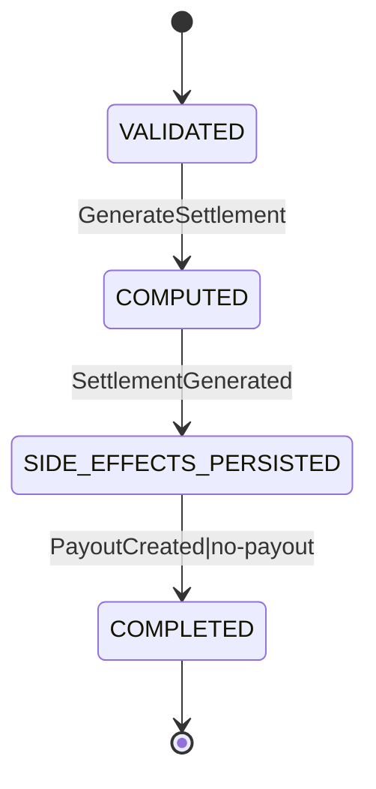

# States: Financial Settlement

## SettlementExecutionState

### Transition Table

| From | Event | To | Guard | Effect |
| ---- | ----- | -- | ----- | ------ |
| [new] | GenerateSettlement | VALIDATED | Required input fields present and player exists | Request accepted for execution |
| VALIDATED | GenerateSettlement | COMPUTED | Stats and policy dependencies loaded | Totals and policy result computed |
| COMPUTED | SettlementGenerated | SIDE_EFFECTS_PERSISTED | Computed result is deterministic | Player makeup and transaction side-effects persisted |
| SIDE_EFFECTS_PERSISTED | PayoutCreated or no-payout | COMPLETED | PAYOUT dedupe rule is satisfied | Response finalized for API caller |

### Invariants

| ID | Invariant | Formal |
| --- | --------- | ------ |
| I1 | Makeup debt cannot become negative | `newMakeup >= 0` |
| I2 | Settlement side-effects are idempotent by period end | `count(tx[type in {MAKEUP_APPLIED, PAYOUT} where playerId = input.playerId and date = endDate]) <= 1 per type` |
