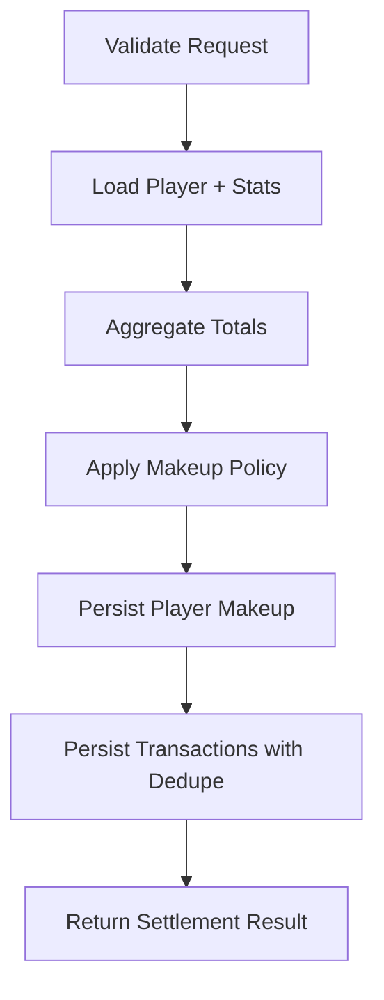

# Workflows: Financial Settlement

## SettlementWorkflow

**Type:** Workflow  
**Triggers:** Manual settlement execution  
**Orchestrates:** [GenerateSettlement](operations.md#generatesettlement)  
**Compensation Strategy:** notify-only  
**Idempotency:** conditional (transaction dedupe by type and period end date)

### Steps

### Step Table

| #   | Step                     | Actor    | Operation          | On Success | On Failure   | Compensation          |
| --- | ------------------------ | -------- | ------------------ | ---------- | ------------ | --------------------- |
| 1   | Validate request payload | API      | GenerateSettlement | Step 2     | return 400   | -                     |
| 2   | Load dependencies        | Use-case | GenerateSettlement | Step 3     | return error | -                     |
| 3   | Compute policy result    | Use-case | GenerateSettlement | Step 4     | return error | -                     |
| 4   | Persist side-effects     | Use-case | GenerateSettlement | Step 5     | return error | no rollback specified |
| 5   | Return response          | API      | GenerateSettlement | done       | -            | -                     |

### Invariants

| ID  | Invariant                                               | Formal                                  |
| --- | ------------------------------------------------------- | --------------------------------------- |
| I1  | Makeup debt cannot be negative                          | `newMakeup >= 0`                        |
| I2  | Duplicate payout event for same period end is prevented | `count(PAYOUT where date=endDate) <= 1` |

---

## DefaultMakeupPolicy

**Type:** Policy  
**Applies To:** GenerateSettlement

### Decision Table

| Condition                                     | Selected Behavior     | Notes                                    |
| --------------------------------------------- | --------------------- | ---------------------------------------- |
| remaining debt > 0 and remaining profit > 0   | apply profit first    | controlled by `applyProfitFirst=true`    |
| remaining debt > 0 and remaining rakeback > 0 | apply rakeback second | controlled by `applyRakebackSecond=true` |
| remaining rakeback after debt                 | share 50% to player   | controlled by `playerRakebackShare=0.5`  |
