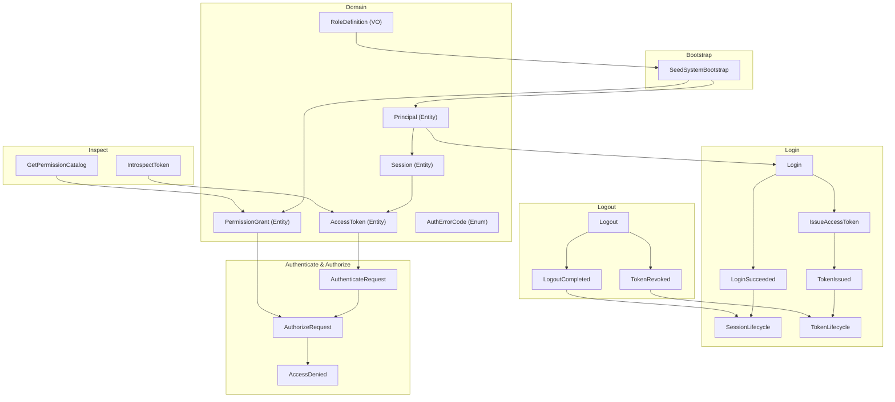

# Authentication and Access Control

## What This Module Owns

Portable authentication and authorization model for any service exposing APIs. Owns login, logout, session lifecycle, JWT token issuance and verification, permission resolution, and route-level enforcement. Follows deny-by-default with explicit permission grants.

**Key design decisions:**

- Session identity is authoritative through `sid` claim (not `sub`).
- Session TTL is fixed at 8 hours.
- Refresh-token rotation is deferred from v1.

## Module Map

## Capabilities

| Capability                                                             | What                                      | Key Aspects                                                  | Detail                                                              |
| ---------------------------------------------------------------------- | ----------------------------------------- | ------------------------------------------------------------ | ------------------------------------------------------------------- |
| [Login](capabilities/login.md)                                         | Start session, receive access token       | Login + IssueAccessToken → SessionLifecycle, TokenLifecycle  | 2 operations, 1 interface, 1 mapping, 2 state transitions, 2 events |
| [Authenticate Request](capabilities/authenticate-request.md)           | Verify bearer token, build auth context   | AuthenticateRequest → JWTClaimsToAuthContext → AuthContext   | 6 rules, 1 mapping, 1 workflow                                      |
| [Authorize Request](capabilities/authorize-request.md)                 | Enforce route permission (deny-overrides) | AuthorizeRequest + PermissionResolutionPolicy → AccessDenied | 3 rules, 1 policy, 1 event                                          |
| [Logout](capabilities/logout.md)                                       | Terminate session, revoke tokens          | Logout → TokenRevoked + LogoutCompleted                      | 3 rules, 2 state transitions, 2 events                              |
| [Introspect Token](capabilities/introspect-token.md)                   | Inspect token state with inactive reason  | IntrospectToken → 5-level reason precedence                  | 3 rules, 1 interface                                                |
| [Browse Permission Catalog](capabilities/browse-permission-catalog.md) | List permission keys for admin UI         | GetPermissionCatalog → namespace + deprecated filter         | 1 query                                                             |
| [System Bootstrap](capabilities/system-bootstrap.md)                   | Auto-seed admin + role grants on boot     | SeedSystemBootstrap → RoleDefinition → PermissionGrant       | 1 operation, 4 roles, auto-generated credentials                    |

## Domain Concepts

| Concept                                        | Type          | Key Constraints                                                                                |
| ---------------------------------------------- | ------------- | ---------------------------------------------------------------------------------------------- |
| [Principal](domain.md#principal)               | Entity        | `status` ACTIVE/DISABLED; `roleKeys` + `directPermissions` for resolution                      |
| [Session](domain.md#session)                   | Entity        | `sid` authoritative; TTL 8h; `effectivePermissions` unique                                     |
| [AccessToken](domain.md#accesstoken)           | Entity        | `expiresAt > issuedAt`; revoked ⇒ not active; scopes from session                              |
| [PermissionGrant](domain.md#permissiongrant)   | Entity        | Canonical key format `^[a-z0-9-]+\.[a-z0-9-]+\.[a-zA-Z0-9*]+$`; ALLOW/DENY                     |
| [RoleDefinition](domain.md#roledefinition)     | Value Object  | 4 predefined roles: admin, manager, coach, player; permissions are canonical                    |
| [AuthErrorCode](domain.md#autherrorcode)       | Enum          | AUTH_REQUIRED · INVALID_TOKEN · TOKEN_EXPIRED · TOKEN_REVOKED · FORBIDDEN · PRINCIPAL_DISABLED |
| [SessionLifecycle](states.md#sessionlifecycle) | State Machine | ACTIVE → TERMINATED (logout) or EXPIRED (TTL); terminal states are final                       |
| [TokenLifecycle](states.md#tokenlifecycle)     | State Machine | ACTIVE → EXPIRED (TTL) or REVOKED (logout); terminal states are final                          |

## Concept Registry

<!-- Source of truth for global registry sync -->

| Concept                                                      | ID                                         | Type          |
| ------------------------------------------------------------ | ------------------------------------------ | ------------- |
| [Principal](domain.md#principal)                             | auth-access-control.Principal              | Entity        |
| [Session](domain.md#session)                                 | auth-access-control.Session                | Entity        |
| [AccessToken](domain.md#accesstoken)                         | auth-access-control.AccessToken            | Entity        |
| [PermissionGrant](domain.md#permissiongrant)                 | auth-access-control.PermissionGrant        | Entity        |
| [RoleDefinition](domain.md#roledefinition)                   | auth-access-control.RoleDefinition         | Value Object  |
| [AuthErrorCode](domain.md#autherrorcode)                     | auth-access-control.AuthErrorCode          | Enum / Type   |
| [Login](operations.md#login)                                 | auth-access-control.Login                  | Operation     |
| [Logout](operations.md#logout)                               | auth-access-control.Logout                 | Operation     |
| [AuthenticateRequest](operations.md#authenticaterequest)     | auth-access-control.AuthenticateRequest    | Operation     |
| [AuthorizeRequest](operations.md#authorizerequest)           | auth-access-control.AuthorizeRequest       | Operation     |
| [IssueAccessToken](operations.md#issueaccesstoken)           | auth-access-control.IssueAccessToken       | Operation     |
| [SeedSystemBootstrap](operations.md#seedsystembootstrap)     | auth-access-control.SeedSystemBootstrap    | Operation     |
| [GetPermissionCatalog](queries.md#getpermissioncatalog)      | auth-access-control.GetPermissionCatalog   | Query         |
| [IntrospectToken](queries.md#introspecttoken)                | auth-access-control.IntrospectToken        | Query         |
| [AuthAPI](interfaces.md#external-authapi-rest)               | auth-access-control.AuthAPI                | Interface     |
| [TokenLifecycle](states.md#tokenlifecycle)                   | auth-access-control.TokenLifecycle         | State Machine |
| [SessionLifecycle](states.md#sessionlifecycle)               | auth-access-control.SessionLifecycle       | State Machine |
| [JWTClaimsToAuthContext](mappings.md#jwtclaimstoauthcontext) | auth-access-control.JWTClaimsToAuthContext | Mapping       |
| [AuthorizeRequestFlow](workflows.md#authorizerequestflow)    | auth-access-control.AuthorizeRequestFlow   | Workflow      |

## Concepts

| Concept                                                          | ID                                         | Type          | Description                                                        |
| ---------------------------------------------------------------- | ------------------------------------------ | ------------- | ------------------------------------------------------------------ |
| [AuthAPI](interfaces.md#external-authapi-rest)                   | auth-access-control.AuthAPI                | Interface     | External authentication and authorization HTTP boundary            |
| [Login](operations.md#login)                                     | auth-access-control.Login                  | Operation     | Starts authenticated session and token issuance                    |
| [AuthenticateRequest](operations.md#authenticaterequest)         | auth-access-control.AuthenticateRequest    | Operation     | Verifies bearer token and builds request auth context              |
| [AuthorizeRequest](operations.md#authorizerequest)               | auth-access-control.AuthorizeRequest       | Operation     | Enforces route permission with deny-overrides behavior             |
| [GetPermissionCatalog](queries.md#getpermissioncatalog)          | auth-access-control.GetPermissionCatalog   | Query         | Lists canonical permission keys for admin and tooling consumers    |
| [PermissionGrant](domain.md#permissiongrant)                     | auth-access-control.PermissionGrant        | Entity        | Grant record used for effective permission computation             |
| [Principal](domain.md#principal)                                 | auth-access-control.Principal              | Entity        | Authenticated actor with role and direct permission assignments    |
| [JWTClaimsToAuthContext](mappings.md#jwtclaimstoauthcontext)     | auth-access-control.JWTClaimsToAuthContext | Mapping       | Maps JWT claims into internal authorization context                |
| [AuthorizeRequestFlow](workflows.md#authorizerequestflow)        | auth-access-control.AuthorizeRequestFlow   | Workflow      | End-to-end flow joining authentication and authorization decisions |

## Feature Concept Graph

| From                                          | Edge         | To                                        | Evidence                                   | Notes                                        |
| --------------------------------------------- | ------------ | ----------------------------------------- | ------------------------------------------ | -------------------------------------------- |
| auth-access-control.AuthAPI                   | exposes      | auth-access-control.Login                 | interfaces.md#external-authapi-rest        | API exposes login endpoint contract          |
| auth-access-control.AuthAPI                   | exposes      | auth-access-control.AuthenticateRequest   | interfaces.md#external-authapi-rest        | API exposes request authentication endpoint  |
| auth-access-control.AuthAPI                   | exposes      | auth-access-control.AuthorizeRequest      | interfaces.md#external-authapi-rest        | API exposes request authorization endpoint   |
| auth-access-control.GetPermissionCatalog      | queries      | auth-access-control.PermissionGrant       | queries.md#getpermissioncatalog            | Query resolves permission grants             |
| auth-access-control.AuthorizeRequestFlow      | orchestrates | auth-access-control.AuthorizeRequest      | workflows.md#authorizerequestflow          | Workflow coordinates authorization decisions |
| auth-access-control.JWTClaimsToAuthContext    | maps         | auth-access-control.Principal             | mappings.md#jwtclaimstoauthcontext         | Mapping derives principal auth context       |

## Aspect Docs

| Aspect                      | Contains                                               | Key Concepts                                                                                                           |
| --------------------------- | ------------------------------------------------------ | ---------------------------------------------------------------------------------------------------------------------- |
| [Domain](domain.md)         | Entities, value objects, enums, invariants             | Principal, Session, AccessToken, PermissionGrant, AuthErrorCode                                                        |
| [Operations](operations.md) | 5 operations with rules and calculations               | Login, IssueAccessToken, AuthenticateRequest, AuthorizeRequest, Logout                                                 |
| [Interfaces](interfaces.md) | REST endpoints, internal guard contract, error payload | AuthAPI (4 routes), AuthorizationGuard, Standard Error Payload                                                         |
| [Queries](queries.md)       | Read models                                            | GetPermissionCatalog, IntrospectToken                                                                                  |
| [Mappings](mappings.md)     | 5 inbound/outbound transforms                          | LoginRequestToSession, JWTClaimsToAuthContext, LogoutRequestToTermination, RoutePermissionBinding, ErrorToHttpResponse |
| [Workflows](workflows.md)   | End-to-end flow, authorize flow, permission policy     | EndToEndAuthFlow, AuthorizeRequestFlow, PermissionResolutionPolicy                                                     |
| [States](states.md)         | Session and token lifecycles                           | SessionLifecycle, TokenLifecycle                                                                                       |
| [Events](events.md)         | 5 domain events                                        | LoginSucceeded, TokenIssued, TokenRevoked, LogoutCompleted, AccessDenied                                               |

## Cross-Feature Dependencies

| Depends On | Relationship | Why                                                       |
| ---------- | ------------ | --------------------------------------------------------- |
| shared     | contains     | Reuses shared error and identity value-object conventions |

## Produces For

| Consumer             | Consumes Capability                     | Via       | What                                                  |
| -------------------- | --------------------------------------- | --------- | ----------------------------------------------------- |
| player-management    | Authenticate Request, Authorize Request | Operation | JWT validation and permission enforcement             |
| player-makeup        | Authenticate Request, Authorize Request | Operation | Route-level auth for makeup endpoints                 |
| financial-settlement | Authenticate Request, Authorize Request | Operation | Settlement endpoint protection                        |
| any feature          | Authorize Request                       | Mapping   | Permission naming convention (`service.scope.action`) |
| admin tooling        | Browse Permission Catalog               | Query     | Available permission keys for admin UI                |

## Stories

See [User Stories](STORIES.md) for acceptance scenarios and BDD coverage.

## User Stories

See [STORIES.md](STORIES.md) for classic and BDD story definitions.

## Story Coverage Matrix

See [Story Coverage Matrix](STORIES.md#story-coverage-matrix) for concept and capability coverage.

## Pilot Decisions

Pilot policy and verification decisions are recorded in [PILOT-DECISIONS.md](PILOT-DECISIONS.md).

## References

- [Implementation tasks](tasks.en.md)
- [Architecture decisions](decisions.en.md)
- [Test specification](TEST-SPEC.md)
- Error payload contract: [Standard Error Payload](interfaces.md#standard-error-payload-contract)
