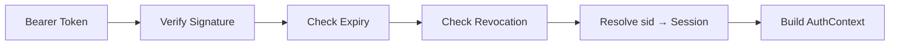

# Authenticate Request

> ← Back to [Module Index](../SPEC.md#capabilities) · Stories: [US-03](../STORIES.md#us-03-protected-endpoint-validates-bearer-token-and-builds-auth-context), [US-04](../STORIES.md#us-04-authentication-fails-deterministically-per-rule)

Verify a bearer token and build the auth context for downstream use.

## Aspect Map

| Aspect | Concept | Summary |
| ------ | ------- | ------- |
| Operation | [AuthenticateRequest](../operations.md#authenticaterequest) | Validates signature, expiry, revocation, session liveness |
| Mapping | [JWTClaimsToAuthContext](../mappings.md#jwtclaimstoauthcontext) | JWT claims → AuthContext with session-resolved permissions |
| Workflow | [AuthorizeRequestFlow](../workflows.md#authorizerequestflow) | Authenticate → Authorize → Execute handler |

## Flow

## Rules

| ID | Rule | Formal | On Failure |
| -- | ---- | ------ | ---------- |
| R1 | Bearer token must be present | `authorizationHeader startsWith 'Bearer '` | `AUTH_REQUIRED` |
| R2 | Token signature and claims must verify | `verifySignature(token) = true` | `INVALID_TOKEN` |
| R3 | Token must not be expired | `now < token.expiresAt` | `TOKEN_EXPIRED` |
| R4 | Token must not be revoked | `token.revokedAt = null` | `TOKEN_REVOKED` |
| R5 | Token must include session id claim | `token.sid != null` | `INVALID_TOKEN` |
| R6 | Session identified by sid must exist and be active | `session(token.sid).status = ACTIVE` | `AUTH_REQUIRED` |

## AuthContext Shape

Built from JWT claims + server-side session resolution:

| Field | Source |
| ----- | ------ |
| principalId | Session (resolved via `sid`) |
| sessionId | JWT `sid` claim |
| permissions | Session `effectivePermissions` |
| tokenId | JWT `jti` claim |
| issuedAt | JWT `iat` claim |
| expiresAt | JWT `exp` claim |

Permissions always come from the server-side session, never from JWT claims.

## Domain Concepts Used

- [AccessToken](../domain.md#accesstoken) — verified token
- [Session](../domain.md#session) — resolved via `sid` for permissions
- [AuthContext](../domain.md#authcontext) — output value object
- [AuthErrorCode](../domain.md#autherrorcode) — deterministic error codes
