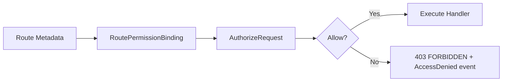

# Authorize Request

> ← Back to [Module Index](../SPEC.md#capabilities) · Stories: [US-05](../STORIES.md#us-05-route-permission-is-enforced-with-deny-overrides-policy)

Enforce route-level permission against the authenticated context.

## Aspect Map

| Aspect | Concept | Summary |
| ------ | ------- | ------- |
| Operation | [AuthorizeRequest](../operations.md#authorizerequest) | Resolves required permission with deny-overrides policy |
| Mapping | [RoutePermissionBinding](../mappings.md#routepermissionbinding) | Route metadata → requiredPermission + authContext |
| Event | [AccessDenied](../events.md#accessdenied) | Emitted on FORBIDDEN for security analytics |
| Policy | [PermissionResolutionPolicy](../workflows.md#permissionresolutionpolicy) | deny > exact allow > scoped wildcard > global wildcard > default deny |

## Flow



## Rules

| ID | Rule | Formal |
| -- | ---- | ------ |
| R1 | Required permission must be canonical | `requiredPermission matches ^[a-z0-9-]+\.[a-z0-9-]+\.[a-zA-Z0-9*]+$` |
| R2 | Decision must be allow by precedence policy | `decision(authContext.permissions, requiredPermission) = ALLOW` |
| R3 | Deny rules override allow rules | `exists denyMatch => decision = DENY` |

## Permission Resolution Precedence

```
deny > allow.exact > allow.scopedWildcard > allow.globalWildcard > noMatch (deny)
```

| Condition | Result |
| --------- | ------ |
| Exact allow match, no deny | Allow |
| Any deny match | Deny (overrides all allows) |
| Scoped wildcard (`service.read.*`), no deny | Allow |
| Global wildcard (`*.*.*`), no deny | Allow |
| No matches at all | Deny (default) |

## Domain Concepts Used

- [PermissionGrant](../domain.md#permissiongrant) — ALLOW/DENY entries
- [PermissionKey](../domain.md#permissionkey) — canonical `service.scope.action` format
- [AuthContext](../domain.md#authcontext) — input from Authenticate Request
